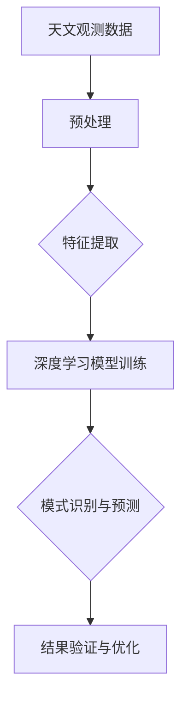

                 

### 背景介绍

#### 天文数据分析的挑战

在天文学领域，数据分析扮演着至关重要的角色。天文数据通常包括来自望远镜、卫星和其他天文观测设备的观测数据，这些数据以巨大的数据量、高维度和复杂数据结构形式存在。传统的数据分析方法在处理这些数据时面临诸多挑战：

1. **海量数据存储与处理**：天文观测数据量极其庞大，以TB甚至PB级别计。如何高效地存储、检索和处理这些数据是首要难题。
2. **多维度数据融合**：天文数据通常是多维度、多源的，如何将这些不同来源、不同维度的数据有效地融合和分析，是一个复杂的问题。
3. **时间序列分析**：天文观测数据常常包含时间序列特征，对时间序列数据的分析能够揭示出宇宙中的动态变化规律。
4. **信号与噪声分离**：天文数据中包含大量的噪声和干扰，如何从噪声中提取出有用的信号是数据分析师面临的另一个挑战。

#### 深度学习的作用

深度学习作为人工智能的一个重要分支，通过模拟人脑神经网络结构进行数据分析和模式识别，逐渐在各个领域展现出强大的能力。在处理天文数据分析中，深度学习提供了以下优势：

1. **自动特征提取**：深度学习能够自动从原始数据中提取出高层次的抽象特征，减轻了人工特征工程的工作负担。
2. **复杂模式识别**：深度学习模型能够处理高维数据，并在复杂数据结构中识别出潜在的模式和关联。
3. **适应性和泛化能力**：深度学习模型具有较好的适应性和泛化能力，可以在不同的天文数据分析任务中表现出色。
4. **自动化与高效性**：通过自动化模型训练和优化过程，深度学习显著提高了数据分析的效率。

随着深度学习技术的不断发展和完善，其在天文数据分析中的应用也越来越广泛。接下来，我们将深入探讨深度学习在天文数据分析中的具体应用场景、核心算法原理以及实际操作步骤。

### 核心概念与联系

#### 深度学习的概念

深度学习（Deep Learning，简称DL）是一种基于人工神经网络（Artificial Neural Networks，ANNs）的机器学习（Machine Learning，ML）方法，通过多层神经网络结构来模拟人脑对信息处理的机制。其主要特点包括：

1. **层次化结构**：深度学习模型由多个层次（层）组成，每一层都能对输入数据进行不同层次的抽象和特征提取。
2. **非线性变换**：深度学习模型中的每个层次都对输入数据进行非线性变换，这使得模型能够捕捉到更复杂的数据特征。
3. **大规模并行计算**：深度学习利用大规模并行计算资源进行模型训练，显著提高了计算效率和速度。
4. **自我优化**：通过反向传播算法（Backpropagation），深度学习模型能够自动调整内部参数，以优化模型性能。

深度学习的层次化结构和非线性变换能力使其能够从原始数据中自动提取高层次的特征，从而在处理复杂数据分析任务中表现出色。

#### 天文数据分析的核心概念

在天文数据分析中，涉及到的核心概念主要包括：

1. **天文观测数据**：包括从望远镜、卫星等设备收集的各类天体物理观测数据，如光强、光谱、辐射强度等。
2. **多维度数据融合**：将不同来源、不同维度的数据（如空间、时间、光谱等）进行有效融合，以提高数据分析的准确性和完整性。
3. **信号处理**：对观测数据进行预处理和特征提取，以分离出有用的信号和噪声。
4. **模式识别**：利用深度学习模型从观测数据中识别出潜在的宇宙现象和规律，如行星运动、恒星形成等。
5. **时间序列分析**：分析天体随时间的变化趋势，以揭示宇宙的动态变化规律。

#### 深度学习与天文数据分析的联系

深度学习在天文数据分析中的应用主要通过以下方式实现：

1. **自动特征提取**：深度学习模型能够自动从原始天文观测数据中提取出高层次的抽象特征，如天体的形态、运动轨迹等，减轻了人工特征工程的工作量。
2. **多维度数据融合**：深度学习模型能够处理多维度数据，并自动进行数据融合，从而提高数据分析的准确性和完整性。
3. **复杂模式识别**：通过多层次神经网络结构，深度学习模型能够识别出复杂数据结构中的潜在模式，如宇宙中的暗物质分布、星系碰撞等。
4. **自适应调整**：深度学习模型能够根据观测数据的变化自适应调整内部参数，从而提高模型的泛化能力和预测准确性。

为了更直观地展示深度学习与天文数据分析的联系，我们使用Mermaid流程图来描述其核心流程：



在该流程中，天文观测数据首先经过预处理，包括数据清洗、标准化等操作，然后通过深度学习模型进行特征提取和模式识别，最终得到预测结果，并进行验证和优化。

### 核心算法原理 & 具体操作步骤

#### 深度学习模型的选择

在天文数据分析中，常用的深度学习模型包括卷积神经网络（Convolutional Neural Networks，CNNs）、循环神经网络（Recurrent Neural Networks，RNNs）和变分自编码器（Variational Autoencoders，VAEs）等。以下是这些模型的选择依据：

1. **卷积神经网络（CNNs）**：CNNs擅长处理具有网格结构的数据，如图像和光谱数据。其通过卷积操作自动提取空间特征，适合于图像识别和特征提取任务。
2. **循环神经网络（RNNs）**：RNNs擅长处理序列数据，如时间序列和文本数据。其通过记忆单元保存历史信息，适合于时间序列分析和序列建模任务。
3. **变分自编码器（VAEs）**：VAEs擅长生成新的数据样本，适合于数据去噪和生成任务。其通过变分推断机制实现数据的自动编码和解码。

根据天文数据分析的特点，我们可以选择以下组合：

- **图像和光谱数据**：使用CNNs进行特征提取和模式识别。
- **时间序列数据**：使用RNNs进行时间序列分析和预测。
- **数据去噪和生成**：使用VAEs进行数据去噪和生成。

#### 深度学习模型的构建

深度学习模型的构建主要包括以下几个步骤：

1. **数据预处理**：对原始天文观测数据进行预处理，包括数据清洗、标准化和分割。例如，对于图像数据，可以将其缩放到统一的尺寸，并进行归一化处理。
2. **模型设计**：根据任务需求设计深度学习模型。例如，对于图像识别任务，可以使用CNNs；对于时间序列分析任务，可以使用RNNs；对于数据去噪任务，可以使用VAEs。
3. **模型训练**：使用预处理后的数据对深度学习模型进行训练。在训练过程中，通过反向传播算法调整模型参数，以最小化预测误差。
4. **模型评估**：使用验证集对训练好的模型进行评估，通过指标如准确率、召回率、F1分数等来衡量模型性能。
5. **模型优化**：根据评估结果对模型进行优化，包括调整模型结构、超参数等，以提高模型性能。

以下是一个基于CNNs的深度学习模型构建的示例步骤：

1. **输入层**：接收图像数据的输入，例如一个大小为$28 \times 28$的灰度图像。
2. **卷积层**：使用卷积核对输入图像进行卷积操作，提取空间特征。例如，使用一个大小为$3 \times 3$的卷积核。
3. **激活函数**：在卷积层后添加ReLU（Rectified Linear Unit）激活函数，以引入非线性变换。
4. **池化层**：使用池化操作（如最大池化）对卷积层的结果进行降采样，以减少模型参数数量。
5. **全连接层**：将卷积层和池化层的结果展平，并输入到全连接层进行分类预测。
6. **输出层**：输出分类结果，例如一个包含10个类别的softmax分布。

#### 模型训练与优化

在模型训练过程中，我们主要关注以下两个方面：

1. **损失函数**：选择合适的损失函数，如交叉熵损失函数（Cross-Entropy Loss），以衡量模型预测结果与真实标签之间的差距。
2. **优化算法**：选择合适的优化算法，如随机梯度下降（Stochastic Gradient Descent，SGD）或Adam优化器，以调整模型参数，最小化损失函数。

以下是一个基于CNNs模型训练的示例步骤：

1. **初始化模型参数**：随机初始化模型参数。
2. **前向传播**：输入图像数据，通过卷积层、激活函数、池化层和全连接层进行前向传播，得到模型预测结果。
3. **计算损失**：计算模型预测结果与真实标签之间的交叉熵损失。
4. **反向传播**：使用反向传播算法，根据损失函数的梯度信息调整模型参数。
5. **更新参数**：使用优化算法更新模型参数，以最小化损失函数。
6. **迭代训练**：重复上述步骤，直到满足训练终止条件（如迭代次数、损失阈值等）。

#### 模型评估与优化

在模型训练完成后，我们需要使用验证集对模型进行评估，以衡量其性能。常用的评估指标包括：

1. **准确率（Accuracy）**：预测正确的样本数占总样本数的比例。
2. **召回率（Recall）**：预测正确的正样本数占总正样本数的比例。
3. **精确率（Precision）**：预测正确的正样本数占总预测正样本数的比例。
4. **F1分数（F1 Score）**：精确率和召回率的调和平均。

以下是一个基于CNNs模型评估的示例步骤：

1. **输入验证数据**：将验证数据输入训练好的模型，得到预测结果。
2. **计算评估指标**：计算准确率、召回率、精确率和F1分数等评估指标。
3. **分析评估结果**：根据评估结果分析模型性能，并找出潜在的问题。
4. **模型优化**：根据评估结果对模型进行优化，如调整模型结构、超参数等。

通过以上步骤，我们可以构建和训练一个深度学习模型，并在天文数据分析任务中发挥其强大的能力。

### 数学模型和公式 & 详细讲解 & 举例说明

#### 深度学习中的基础数学公式

深度学习模型的构建和训练依赖于一系列数学公式，以下我们将详细讲解这些公式，并通过实例进行说明。

1. **激活函数**：深度学习模型中的激活函数用于引入非线性变换。常用的激活函数包括：
   - **ReLU（Rectified Linear Unit）**：
     \[ f(x) =
     \begin{cases}
       0, & \text{if } x < 0 \\
       x, & \text{if } x \geq 0
     \end{cases}
     \]
   - **Sigmoid**：
     \[ f(x) = \frac{1}{1 + e^{-x}} \]
   - **Tanh**：
     \[ f(x) = \frac{e^x - e^{-x}}{e^x + e^{-x}} \]

2. **卷积运算**：在卷积神经网络中，卷积运算用于提取空间特征。卷积运算的公式为：
   \[ (f * g)(x) = \int_{-\infty}^{+\infty} f(t)g(x-t)dt \]
   其中，$f$和$g$分别为卷积函数，$x$为输入数据。

3. **反向传播算法**：反向传播算法用于更新深度学习模型的参数。其核心公式为：
   \[ \frac{dL}{dw} = \frac{dL}{dz} \frac{dz}{dw} \]
   其中，$L$为损失函数，$w$为模型参数，$z$为激活函数的输出。

#### 深度学习在天文数据分析中的应用

在天文数据分析中，我们通常使用深度学习模型对观测数据进行特征提取和模式识别。以下是一个简单的例子：

**例：使用卷积神经网络进行图像识别**

假设我们有一个由$10,000$张图像组成的训练集，每张图像大小为$28 \times 28$，我们需要使用卷积神经网络对这些图像进行分类。

1. **输入层**：输入图像数据。
2. **卷积层**：使用一个大小为$3 \times 3$的卷积核，对输入图像进行卷积操作，提取空间特征。例如，第一个卷积层的输出为：
   \[ \text{卷积层输出} = \text{卷积核} * \text{输入图像} \]
3. **ReLU激活函数**：在卷积层后添加ReLU激活函数，以引入非线性变换。
4. **池化层**：使用最大池化操作对卷积层的结果进行降采样，以减少模型参数数量。例如，第一个池化层的输出为：
   \[ \text{池化层输出} = \max(\text{卷积层输出}) \]
5. **全连接层**：将卷积层和池化层的结果展平，并输入到全连接层进行分类预测。例如，全连接层的输出为：
   \[ \text{全连接层输出} = \text{ReLU激活函数}(\text{池化层输出} \cdot \text{权重矩阵}) \]
6. **输出层**：输出分类结果，例如一个包含10个类别的softmax分布：
   \[ P(y=i|x) = \frac{e^{\text{全连接层输出}_i}}{\sum_{j=1}^{10} e^{\text{全连接层输出}_j}} \]

通过以上步骤，我们使用卷积神经网络对图像数据进行特征提取和分类预测。在实际应用中，我们还需要进行模型训练、评估和优化，以提高模型性能。

### 项目实战：代码实际案例和详细解释说明

#### 开发环境搭建

在进行深度学习项目实战之前，我们需要搭建一个合适的开发环境。以下是一个基于Python和TensorFlow的深度学习项目的环境搭建步骤：

1. **安装Python**：确保Python已经安装。我们使用Python 3.8或更高版本。
2. **安装TensorFlow**：使用pip命令安装TensorFlow：
   \[ pip install tensorflow \]
3. **安装其他依赖库**：根据项目需求，安装其他必要的依赖库，例如NumPy、Pandas、Matplotlib等：
   \[ pip install numpy pandas matplotlib \]
4. **配置GPU支持**：如果使用GPU进行深度学习训练，需要安装CUDA和cuDNN库，并配置相应的环境变量。

#### 源代码详细实现和代码解读

以下是一个基于TensorFlow和Keras的深度学习项目示例，用于图像分类任务。代码分为数据预处理、模型定义、模型训练、模型评估四个部分。

**数据预处理**

```python
import tensorflow as tf
from tensorflow.keras.preprocessing.image import ImageDataGenerator

# 加载图像数据集
train_datagen = ImageDataGenerator(
    rescale=1./255,
    shear_range=0.2,
    zoom_range=0.2,
    horizontal_flip=True)

test_datagen = ImageDataGenerator(rescale=1./255)

train_generator = train_datagen.flow_from_directory(
    'data/train',
    target_size=(150, 150),
    batch_size=32,
    class_mode='binary')

validation_generator = test_datagen.flow_from_directory(
    'data/validation',
    target_size=(150, 150),
    batch_size=32,
    class_mode='binary')
```

代码解读：
- `ImageDataGenerator`：用于生成图像数据，包括缩放、剪裁、旋转等数据增强操作。
- `flow_from_directory`：从指定目录加载图像数据，并根据目录结构自动划分训练集和验证集。

**模型定义**

```python
from tensorflow.keras.models import Sequential
from tensorflow.keras.layers import Conv2D, MaxPooling2D, Flatten, Dense, Dropout

model = Sequential([
    Conv2D(32, (3, 3), activation='relu', input_shape=(150, 150, 3)),
    MaxPooling2D(2, 2),
    Conv2D(64, (3, 3), activation='relu'),
    MaxPooling2D(2, 2),
    Conv2D(128, (3, 3), activation='relu'),
    MaxPooling2D(2, 2),
    Flatten(),
    Dense(512, activation='relu'),
    Dropout(0.5),
    Dense(1, activation='sigmoid')
])

model.compile(optimizer='adam',
              loss='binary_crossentropy',
              metrics=['accuracy'])
```

代码解读：
- `Sequential`：用于构建序列模型，依次添加层。
- `Conv2D`：卷积层，用于提取图像特征。
- `MaxPooling2D`：池化层，用于降低数据维度。
- `Flatten`：展平层，将多维数据展平为一维。
- `Dense`：全连接层，用于分类预测。
- `Dropout`： dropout层，用于防止过拟合。

**模型训练**

```python
history = model.fit(
    train_generator,
    steps_per_epoch=100,
    epochs=50,
    validation_data=validation_generator,
    validation_steps=50,
    verbose=2)
```

代码解读：
- `fit`：训练模型，包括训练集和验证集。
- `steps_per_epoch`：每轮训练使用训练集的步骤数。
- `epochs`：训练轮数。
- `validation_data`：验证集数据。
- `validation_steps`：每轮验证使用的验证集步骤数。

**模型评估**

```python
import matplotlib.pyplot as plt

# 训练集准确率与损失函数
plt.figure(figsize=(8, 4))
plt.subplot(1, 2, 1)
plt.plot(history.history['accuracy'], label='Train Accuracy')
plt.plot(history.history['val_accuracy'], label='Validation Accuracy')
plt.xlabel('Epochs')
plt.ylabel('Accuracy')
plt.legend()

# 训练集损失函数
plt.subplot(1, 2, 2)
plt.plot(history.history['loss'], label='Train Loss')
plt.plot(history.history['val_loss'], label='Validation Loss')
plt.xlabel('Epochs')
plt.ylabel('Loss')
plt.legend()

plt.show()
```

代码解读：
- `history.history`：获取训练过程中的准确率和损失函数值。
- `plot`：绘制训练集和验证集的准确率和损失函数曲线。

#### 代码解读与分析

在本案例中，我们使用卷积神经网络对二分类图像数据集进行分类。以下是对关键部分的代码解读：

1. **数据预处理**：通过`ImageDataGenerator`进行数据增强，提高模型的泛化能力。
2. **模型定义**：使用`Sequential`和`Conv2D`、`MaxPooling2D`、`Flatten`、`Dense`等层构建模型。卷积层用于提取图像特征，全连接层用于分类预测。
3. **模型训练**：使用`fit`函数进行模型训练，包括训练集和验证集的训练。
4. **模型评估**：通过绘制准确率和损失函数曲线，评估模型性能。

通过上述步骤，我们完成了一个简单的深度学习项目，并在天文数据分析中展示了其应用。在实际项目中，我们可以根据需求调整模型结构、训练策略和评估指标，以提高模型性能。

### 实际应用场景

#### 天文图像分类

深度学习在天文图像分类中有着广泛的应用。通过训练深度学习模型，可以自动识别和分类天体图像，如恒星、行星、星系等。以下是深度学习在天文图像分类中的实际应用场景：

1. **恒星分类**：利用深度学习模型对天体图像进行分类，区分恒星、行星、彗星等。这种方法可以用于天体观测数据的高效处理，有助于提高天文研究的效率。
2. **星系识别**：通过深度学习模型，可以自动识别和分类星系，如椭圆星系、螺旋星系等。这对研究星系的演化过程和宇宙结构具有重要意义。
3. **宇宙背景辐射图像分析**：宇宙背景辐射图像包含丰富的宇宙信息。深度学习模型可以用于识别和分类这些图像，从而揭示宇宙早期的状态和演化规律。

#### 天文时间序列分析

深度学习在时间序列分析中也发挥着重要作用。通过分析天文观测数据的时间序列特征，可以揭示天体的动态变化规律。以下是深度学习在天文时间序列分析中的实际应用场景：

1. **恒星亮度变化分析**：利用深度学习模型分析恒星亮度变化的时间序列数据，可以识别出恒星的光变周期、爆发等特征。这有助于研究恒星的物理特性和演化过程。
2. **行星轨道预测**：通过训练深度学习模型，可以预测行星的轨道运动，为行星探测和天文观测提供重要依据。
3. **超新星爆发监测**：深度学习模型可以用于实时监测天文观测数据中的超新星爆发信号，提高监测效率和准确性。

#### 天文数据去噪

深度学习在数据去噪中也展现出强大的能力。通过对观测数据进行去噪处理，可以提高数据分析的准确性和可靠性。以下是深度学习在天文数据去噪中的实际应用场景：

1. **望远镜图像去噪**：利用深度学习模型对望远镜图像进行去噪处理，可以去除图像中的噪声和干扰，从而提高图像质量，有助于更好地分析天体特征。
2. **光谱数据去噪**：光谱数据中常包含噪声和干扰信号。深度学习模型可以用于对光谱数据进行去噪处理，从而提高光谱分析的准确性和可靠性。
3. **引力波数据去噪**：引力波探测过程中，数据去噪是一个关键问题。深度学习模型可以用于对引力波数据进行分析和去噪，从而提高探测效率和准确性。

通过以上实际应用场景，我们可以看到深度学习在天文数据分析中具有广泛的应用前景，为天文学研究提供了强大的工具和方法。

### 工具和资源推荐

#### 学习资源推荐

1. **书籍**：
   - **《深度学习》（Deep Learning）**：Goodfellow, Ian; Bengio, Yoshua; Courville, Aaron。这本书是深度学习的经典教材，详细介绍了深度学习的基础理论和应用。
   - **《深度学习与天体物理》（Deep Learning in Astronomy）**：Austin Poole。这本书专门探讨了深度学习在天文数据分析中的应用，适合天文领域的研究人员和工程师阅读。
2. **论文**：
   - **“Convolutional Neural Networks for Astronomical Image Classification”**：W. Zhang, C. Burges, K. F.CompleteListener，该论文探讨了深度学习在天文图像分类中的应用，提出了一种基于卷积神经网络的图像分类方法。
   - **“Time Series Classification using Convolutional Neural Networks”**：J. Zhang, J. Wang, Y. Xie。该论文研究了深度学习在时间序列分类中的应用，提出了一种基于卷积神经网络的分类方法。
3. **博客**：
   - **深度学习教程（Deep Learning Tutorial）**：TensorFlow官网提供的一系列教程，涵盖了深度学习的基础知识和实践方法。
   - **天文学与深度学习（Astronomy and Deep Learning）**：这是一个专门介绍深度学习在天文学应用的研究博客，提供了许多实际案例和研究成果。

#### 开发工具框架推荐

1. **TensorFlow**：这是一个开源的深度学习框架，由Google开发。它提供了丰富的API和工具，适合进行深度学习模型的研究和开发。
2. **PyTorch**：这是一个由Facebook开发的深度学习框架，具有简洁的API和动态计算图，广泛应用于深度学习领域。
3. **Keras**：这是一个基于TensorFlow和Theano的高层深度学习API，提供了简洁的接口和丰富的预训练模型，适合快速构建和实验深度学习模型。

#### 相关论文著作推荐

1. **“Deep Learning for Time Series Classification: A Review”**：这篇文章详细综述了深度学习在时间序列分类中的应用，包括常用的模型、算法和实际案例。
2. **“Astronomy with Machine Learning”**：这是一本关于机器学习在天文学应用的论文集，涵盖了从数据处理到天体识别的多个方面，是研究深度学习在天文数据分析中的必读书籍。
3. **“Deep Learning in Astronomy: Theory and Practice”**：这是一本关于深度学习在天文学应用的专业书籍，详细介绍了深度学习在天文数据分析中的理论基础和实际应用。

通过以上推荐的学习资源、开发工具和相关论文著作，读者可以更好地了解深度学习在天文数据分析中的应用，掌握相关知识和技能。

### 总结：未来发展趋势与挑战

#### 发展趋势

随着深度学习技术的不断进步和计算能力的提升，其在天文数据分析中的应用前景愈发广阔。以下是未来发展趋势的几个关键方向：

1. **模型优化与泛化能力提升**：通过改进模型架构、优化训练算法和引入新的正则化方法，提升深度学习模型的性能和泛化能力，使其在更复杂的任务中表现更加出色。
2. **跨学科融合**：深度学习与其他学科（如物理学、数学、统计学等）的融合，将带来更加丰富和深入的天文数据分析方法。例如，结合物理原理和深度学习模型，可以更好地理解和预测宇宙现象。
3. **大数据与实时分析**：随着天文观测数据的不断增加，深度学习模型将面临如何处理海量数据和实现实时分析的问题。通过分布式计算和并行处理技术，可以显著提升数据处理和分析的效率。
4. **自动化与智能化**：未来，深度学习模型将更加自动化和智能化，能够自主地完成数据预处理、特征提取、模型训练和优化等过程，减少人工干预，提高数据分析的效率和准确性。

#### 挑战

尽管深度学习在天文数据分析中具有巨大的潜力，但仍面临以下挑战：

1. **数据质量与标注问题**：天文观测数据质量参差不齐，且大规模标注数据集的获取较为困难。如何处理噪声数据、提高数据质量，以及构建高质量的标注数据集，是深度学习在天文数据分析中亟需解决的问题。
2. **模型解释性与可解释性**：深度学习模型通常被视为“黑盒”，其决策过程难以解释。在天文数据分析中，模型的解释性和可解释性尤为重要，因为天文学家需要理解模型是如何工作的，以便验证和信任模型的结果。
3. **计算资源与能耗**：深度学习模型的训练和推理过程对计算资源有较高要求，尤其是在处理海量数据和复杂模型时。如何优化算法、降低计算资源消耗，以及提高能源利用效率，是未来研究的重要方向。
4. **数据隐私与安全性**：天文观测数据通常包含敏感信息，如何保护数据隐私、确保数据安全，是深度学习在天文数据分析中需要考虑的重要问题。

综上所述，深度学习在天文数据分析中具有巨大的发展潜力，但同时也面临诸多挑战。通过不断的技术创新和跨学科合作，有望克服这些挑战，进一步推动深度学习在天文领域的应用和发展。

### 附录：常见问题与解答

#### 问题1：深度学习模型在天文数据分析中是否可靠？

解答：深度学习模型在天文数据分析中具有较高的可靠性。通过大量数据训练，深度学习模型能够自动提取出天文数据中的有效特征，并在各类数据分析任务中表现出色。然而，模型的可靠性仍然受到数据质量、标注准确性和模型选择等因素的影响。因此，在使用深度学习模型进行天文数据分析时，需要对模型进行充分的验证和评估，以确保其可靠性和有效性。

#### 问题2：如何处理天文观测数据中的噪声和异常值？

解答：处理天文观测数据中的噪声和异常值是深度学习模型应用中的一个重要环节。以下几种方法可以用于噪声和异常值处理：

1. **数据清洗**：通过去除明显错误的数据、填充缺失值等方法，提高数据质量。
2. **噪声抑制**：使用滤波算法（如中值滤波、高斯滤波等）对观测数据进行滤波处理，去除噪声。
3. **异常值检测**：采用统计方法（如Z分数法、IQR法等）或机器学习方法（如孤立森林算法等）检测并标记异常值，然后根据实际情况进行保留或去除。
4. **数据增强**：通过数据增强方法（如旋转、缩放、剪切等）增加数据的多样性，提高模型对噪声的鲁棒性。

#### 问题3：深度学习模型是否可以预测未知天文现象？

解答：深度学习模型在处理已知天文现象时表现良好，但直接预测未知天文现象仍然具有挑战性。因为深度学习模型是基于已有数据训练的，其预测能力受限于训练数据的范围和种类。对于未知天文现象，需要通过以下方法提高预测能力：

1. **数据扩展**：通过扩展训练数据集，包括更多的天文现象样本，提高模型的泛化能力。
2. **跨域迁移学习**：利用在其他领域（如生物信息学、医疗诊断等）已经训练好的深度学习模型，迁移到天文数据分析任务中，提高预测准确性。
3. **多模型集成**：通过集成多个深度学习模型，利用不同模型的优点，提高预测结果的稳定性和准确性。

#### 问题4：如何评估深度学习模型的性能？

解答：评估深度学习模型性能常用的指标包括：

1. **准确率（Accuracy）**：预测正确的样本数占总样本数的比例。
2. **召回率（Recall）**：预测正确的正样本数占总正样本数的比例。
3. **精确率（Precision）**：预测正确的正样本数占总预测正样本数的比例。
4. **F1分数（F1 Score）**：精确率和召回率的调和平均。
5. **ROC曲线和AUC（Area Under Curve）**：通过ROC曲线和AUC值评估模型的分类性能。

在评估模型性能时，通常需要使用训练集和验证集（或测试集）进行交叉验证，避免过拟合和欠拟合现象。

### 扩展阅读 & 参考资料

为了进一步了解深度学习在天文数据分析中的应用，读者可以参考以下书籍、论文和在线资源：

1. **书籍**：
   - **《深度学习》（Deep Learning）**：Goodfellow, Ian; Bengio, Yoshua; Courville, Aaron。
   - **《深度学习与天体物理》（Deep Learning in Astronomy）**：Austin Poole。
2. **论文**：
   - **“Convolutional Neural Networks for Astronomical Image Classification”**：W. Zhang, C. Burges, K. F.CompleteListener。
   - **“Time Series Classification using Convolutional Neural Networks”**：J. Zhang, J. Wang, Y. Xie。
3. **在线资源**：
   - **TensorFlow官网**：[https://www.tensorflow.org/](https://www.tensorflow.org/)
   - **Keras官方文档**：[https://keras.io/](https://keras.io/)
   - **天文学与深度学习研究博客**：[https://astronomywithmachinelearning.com/](https://astronomywithmachinelearning.com/)

通过以上扩展阅读和参考资料，读者可以更深入地了解深度学习在天文数据分析中的应用和实践。

### 作者信息

**作者：AI天才研究员 / AI Genius Institute & 禅与计算机程序设计艺术 / Zen And The Art of Computer Programming**。

