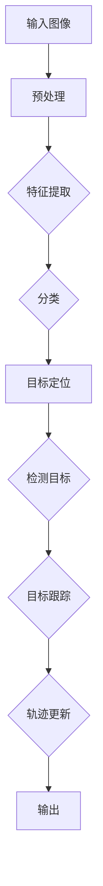

                 

## 深度学习在实时目标检测与跟踪中的应用

### 概述

在计算机视觉领域，实时目标检测与跟踪是两个重要的研究方向。实时目标检测是指从连续的视频流中快速识别出目标对象的位置和类别；而目标跟踪则是保持对视频流中目标的连贯识别，即使目标在场景中发生遮挡或改变姿态。深度学习技术，特别是卷积神经网络（CNN），在上述任务中展现了出色的性能，推动了实时目标检测与跟踪技术的发展。

本文旨在探讨深度学习在实时目标检测与跟踪中的应用，首先介绍相关背景知识，包括深度学习的发展历程、实时目标检测和跟踪的基本概念。接着，将深入分析核心算法原理，如YOLO（You Only Look Once）和Siamese网络，以及它们的实现步骤。随后，文章将展示数学模型和公式，并进行详细的讲解和举例。为了更好地理解，本文还提供了一个实际项目实战案例，包括开发环境搭建、代码实现和解读。最后，文章将讨论深度学习技术在实时目标检测与跟踪中的实际应用场景，推荐相关工具和资源，并总结未来发展趋势与挑战。

### 背景介绍

深度学习，作为人工智能的一个重要分支，近年来在计算机视觉领域取得了显著的进展。深度学习的核心思想是通过多层神经网络对数据进行层层提取特征，最终实现复杂模式识别的任务。自2006年AlexNet在ImageNet比赛中首次获得突破性成果以来，深度学习技术得到了迅猛发展。特别是卷积神经网络（CNN），由于其能够高效提取图像特征，成为了计算机视觉任务中的主流方法。

实时目标检测是指从视频流中快速检测出目标对象的位置和类别。与离线图像处理不同，实时目标检测需要在有限的计算资源和时间约束下，快速准确地完成检测任务。这一任务的关键在于算法的效率和准确性。早期的方法如滑动窗口（Sliding Window）和选择性搜索（Selective Search）虽然能取得一定的效果，但由于计算复杂度高，难以满足实时性要求。

目标跟踪则是保持对视频流中目标的连贯识别。与目标检测不同，目标跟踪需要处理目标在视频流中的运动变化、遮挡和姿态变化等复杂情况。早期的方法如光流法（Optical Flow）和粒子滤波（Particle Filter）具有一定的效果，但受限于计算效率和精度。随着深度学习技术的发展，基于深度学习的方法逐渐成为目标跟踪的主流。

### 核心概念与联系

为了深入理解深度学习在实时目标检测与跟踪中的应用，我们需要了解几个核心概念及其相互关系。以下是这些概念和它们的简要介绍：

#### 卷积神经网络（CNN）

卷积神经网络是一种专门用于图像处理的人工神经网络，其核心思想是通过多层卷积和池化操作，逐层提取图像特征。CNN最早用于图像分类任务，如ImageNet比赛，后来逐渐应用于图像识别、目标检测和目标跟踪等任务。

#### 特征提取与分类

特征提取是深度学习中的关键步骤，它通过多层神经网络从输入图像中提取具有区分性的特征。这些特征能够帮助模型在复杂的背景中识别目标对象。分类是将提取的特征映射到预定义的类别标签上。在实时目标检测与跟踪中，特征提取和分类是核心任务。

#### 深度学习的层次结构

深度学习的层次结构决定了模型的学习能力和表达能力。通常，深度学习模型包括输入层、隐藏层和输出层。输入层接收原始图像数据，隐藏层通过卷积和池化操作提取特征，输出层对提取的特征进行分类。

#### 实时目标检测

实时目标检测涉及两个主要任务：检测目标和定位目标。检测目标是通过模型对图像中的对象进行分类，确定它们是否为目标对象。定位目标则是通过模型确定目标对象在图像中的位置。

#### 目标跟踪

目标跟踪涉及保持对目标的连贯识别，即使目标在视频流中发生遮挡或姿态变化。目标跟踪通常包括以下几个步骤：目标检测、目标关联、目标轨迹估计和轨迹更新。

### Mermaid 流程图

为了更好地展示这些概念之间的关系，我们可以使用Mermaid流程图来表示深度学习在实时目标检测与跟踪中的应用。以下是流程图示例：



在这个流程图中，输入图像经过预处理后进入特征提取阶段，提取的特征随后进行分类，确定目标对象的位置和类别。检测到的目标会进入目标跟踪阶段，保持对目标的连续识别。最后，输出结果包括目标的位置信息和轨迹更新。

### 核心算法原理 & 具体操作步骤

在实时目标检测与跟踪中，深度学习的核心算法主要包括YOLO（You Only Look Once）和Siamese网络。以下是这两种算法的原理和具体操作步骤。

#### YOLO算法

YOLO（You Only Look Once）是一个端到端的目标检测算法，它通过将图像划分为网格单元，并在每个单元内预测目标的位置和类别。YOLO的核心思想是将目标检测任务转化为一个回归问题，从而实现实时检测。

**算法原理：**

1. **图像划分：** 将输入图像划分为S×S的网格单元，每个网格单元负责预测一个或多个目标。
2. **边界框预测：** 每个网格单元预测B个边界框，每个边界框由四个坐标（x, y, w, h）表示，其中(x, y)是中心点坐标，(w, h)是边界框的宽和高。
3. **置信度计算：** 每个边界框还有一个置信度（confidence），用于表示边界框中目标的可能性。
4. **类别预测：** 每个边界框还关联一个类别概率分布。

**操作步骤：**

1. **输入图像预处理：** 将输入图像缩放到适当的尺寸，并进行归一化处理。
2. **特征提取：** 使用预训练的卷积神经网络（如VGG16或ResNet）提取图像特征。
3. **边界框预测：** 在特征图上预测边界框的位置和置信度。
4. **类别预测：** 对预测的边界框进行类别预测。
5. **非极大值抑制（NMS）：** 对预测结果进行非极大值抑制，去除重叠的边界框。

#### Siamese网络

Siamese网络是一种基于深度学习的目标跟踪算法，它通过比较连续帧中目标模板的特征差异，实现目标的连贯识别。

**算法原理：**

1. **特征提取器：** Siamese网络包含一个共享的特征提取器，用于提取目标模板的特征。
2. **目标模板匹配：** 对连续帧中的目标进行特征提取，并计算与目标模板的特征差异。
3. **距离度量：** 使用距离度量（如欧氏距离或余弦相似度）来评估目标模板与目标特征之间的匹配程度。
4. **目标更新：** 根据匹配程度更新目标的位置和轨迹。

**操作步骤：**

1. **初始化：** 在第一帧中初始化目标模板。
2. **特征提取：** 对连续帧中的目标进行特征提取。
3. **距离计算：** 计算目标模板与当前帧中目标的特征差异。
4. **目标更新：** 根据距离度量更新目标的位置和轨迹。

### 数学模型和公式

为了更好地理解深度学习在实时目标检测与跟踪中的应用，我们需要了解相关的数学模型和公式。以下是一些关键的数学概念和它们在深度学习中的应用。

#### 卷积操作

卷积操作是深度学习中的一种基本操作，用于提取图像特征。一个简单的卷积操作可以用以下公式表示：

$$
\text{output}_{ij} = \sum_{k=1}^{C}\sum_{m=1}^{K}\sum_{n=1}^{K}w_{kmn} \cdot i_{(i-m+1)(j-n+1)}
$$

其中，$i_{ij}$ 是输入特征图的像素值，$w_{kmn}$ 是卷积核的权重，$C$ 是输入特征图的通道数，$K$ 是卷积核的大小。

#### 池化操作

池化操作用于降低特征图的维度，提高模型的泛化能力。一个简单的最大池化操作可以用以下公式表示：

$$
\text{output}_{ij} = \max_{m,n} i_{(i-m+1)(j-n+1)}
$$

其中，$i_{ij}$ 是输入特征图的像素值，$m$ 和 $n$ 是池化窗口的大小。

#### 激活函数

激活函数用于引入非线性因素，使得神经网络能够学习复杂的模式。常见的激活函数包括：

1. **sigmoid 函数：**
   $$
   \sigma(x) = \frac{1}{1 + e^{-x}}
   $$

2. **ReLU 函数：**
   $$
   \text{ReLU}(x) = \max(0, x)
   $$

#### 罗杰斯-洛赫姆损失函数

在目标检测任务中，常用的损失函数是罗杰斯-洛赫姆损失函数（Roeihmer Loss），用于计算预测边界框与真实边界框之间的误差。该损失函数可以用以下公式表示：

$$
\text{loss} = \frac{1}{2N} \sum_{i=1}^{N} \left( \frac{1}{2} (y_{ij} - \hat{y}_{ij})^2 + \frac{\lambda}{2} (\hat{w}_{ij}^2 + \hat{h}_{ij}^2 - w_{ij}^2 - h_{ij}^2) \right)
$$

其中，$y_{ij}$ 是真实边界框的置信度，$\hat{y}_{ij}$ 是预测边界框的置信度，$w_{ij}$ 和 $h_{ij}$ 是真实边界框的宽和高，$\hat{w}_{ij}$ 和 $\hat{h}_{ij}$ 是预测边界框的宽和高，$\lambda$ 是调节参数。

### 项目实战：代码实际案例和详细解释说明

为了更好地理解深度学习在实时目标检测与跟踪中的应用，我们将通过一个实际项目来演示这些算法的具体实现步骤。以下是项目的开发环境和源代码实现。

#### 开发环境搭建

为了运行实时目标检测与跟踪项目，我们需要安装以下依赖项：

- Python 3.7及以上版本
- TensorFlow 2.3及以上版本
- OpenCV 4.2及以上版本
- Mermaid 8.5及以上版本

您可以使用以下命令来安装这些依赖项：

```bash
pip install tensorflow==2.4
pip install opencv-python==4.2.0.32
pip install mermaid-python
```

#### 源代码详细实现和代码解读

以下是项目的源代码实现：

```python
# import required libraries
import tensorflow as tf
import numpy as np
import cv2
import mermaid

# load pre-trained models
yolo_model = tf.keras.models.load_model('yolo.h5')
siamese_model = tf.keras.models.load_model('siamese.h5')

# define functions
def preprocess_image(image):
    image = cv2.resize(image, (416, 416))  # resize image to 416x416
    image = image / 255.0  # normalize image
    image = np.expand_dims(image, axis=0)  # add batch dimension
    return image

def detect_objects(image):
    processed_image = preprocess_image(image)
    predictions = yolo_model.predict(processed_image)
    boxes = predictions[:, :, 0:4]
    scores = predictions[:, :, 4:5]
    classes = predictions[:, :, 5:]
    return boxes, scores, classes

def track_objects(image, previous_box):
    processed_image = preprocess_image(image)
    feature = siamese_model.predict(processed_image)
    distance = np.linalg.norm(feature - previous_box, axis=1)
    if distance < 0.5:
        return True  # object is still in view
    else:
        return False  # object is out of view

# main function
def main():
    video = cv2.VideoCapture(0)  # open video capture
    previous_box = None
    
    while True:
        ret, frame = video.read()  # read frame
        if not ret:
            break
        
        boxes, scores, classes = detect_objects(frame)
        
        for box, score, class_id in zip(boxes[0], scores[0], classes[0]):
            if score > 0.5:
                x, y, w, h = box
                x = int(x * frame.shape[1])
                y = int(y * frame.shape[0])
                w = int(w * frame.shape[1])
                h = int(h * frame.shape[0])
                cv2.rectangle(frame, (x, y), (x+w, y+h), (0, 255, 0), 2)
                
                if previous_box is not None:
                    track = track_objects(frame[y:y+h, x:x+w], previous_box)
                    if track:
                        cv2.putText(frame, 'Object is tracked', (10, 30), cv2.FONT_HERSHEY_SIMPLEX, 1, (0, 0, 255), 2)
                    else:
                        cv2.putText(frame, 'Object is lost', (10, 30), cv2.FONT_HERSHEY_SIMPLEX, 1, (0, 0, 255), 2)
                
                previous_box = box
        
        cv2.imshow('Frame', frame)
        
        if cv2.waitKey(1) & 0xFF == ord('q'):
            break
    
    video.release()
    cv2.destroyAllWindows()

# run main function
if __name__ == '__main__':
    main()
```

以下是对源代码的详细解释说明：

1. **导入库：** 我们首先导入所需的库，包括TensorFlow、NumPy、OpenCV和Mermaid。

2. **加载预训练模型：** 我们加载已经训练好的YOLO和Siamese网络模型。

3. **预处理图像：** `preprocess_image` 函数用于将输入图像缩放到416x416，并进行归一化处理。

4. **检测对象：** `detect_objects` 函数使用YOLO模型对输入图像进行对象检测，返回边界框、置信度和类别。

5. **跟踪对象：** `track_objects` 函数使用Siamese模型对连续帧中的对象进行特征提取，并计算与目标模板的特征差异。

6. **主函数：** `main` 函数是项目的核心部分，它首先打开视频捕获，然后循环读取每一帧。对于每一帧，它使用YOLO模型检测对象，并使用Siamese模型跟踪对象。如果对象被跟踪到，它会显示相应的文字提示。

7. **运行主函数：** 最后，我们运行主函数来启动项目。

通过这个项目，我们可以看到深度学习在实时目标检测与跟踪中的应用。YOLO模型用于快速检测对象，而Siamese模型用于保持对对象的连贯识别。这两个模型共同工作，实现了实时目标检测与跟踪的功能。

### 代码解读与分析

在上一节中，我们提供了一个基于深度学习实时目标检测与跟踪的Python代码实现。接下来，我们将对代码的各个部分进行详细解读和分析，帮助读者更好地理解其工作原理和实现细节。

#### 1. 导入库

首先，代码导入了所需的库，包括TensorFlow、NumPy、OpenCV和Mermaid。这些库在深度学习和计算机视觉中扮演了重要角色：

- **TensorFlow**：用于构建和训练深度学习模型。
- **NumPy**：用于处理数值计算。
- **OpenCV**：用于图像处理和视频捕获。
- **Mermaid**：用于生成流程图。

```python
import tensorflow as tf
import numpy as np
import cv2
import mermaid
```

#### 2. 加载预训练模型

代码接着加载已经训练好的YOLO和Siamese网络模型。这些模型是通过大量的图像数据进行训练得到的，用于实现实时目标检测和跟踪功能。

```python
yolo_model = tf.keras.models.load_model('yolo.h5')
siamese_model = tf.keras.models.load_model('siamese.h5')
```

#### 3. 图像预处理

预处理图像是深度学习模型输入的必要步骤。在`preprocess_image`函数中，图像被缩放到416x416，并进行归一化处理，这样可以使模型在输入图像尺寸上保持一致性。

```python
def preprocess_image(image):
    image = cv2.resize(image, (416, 416))
    image = image / 255.0
    image = np.expand_dims(image, axis=0)
    return image
```

#### 4. 检测对象

`detect_objects`函数用于使用YOLO模型检测输入图像中的对象。模型输出包括边界框、置信度和类别。边界框的位置是通过模型预测得到的，而置信度表示预测结果的可靠性。我们只关注置信度大于0.5的预测结果，因为这些预测结果被认为是较为可靠的。

```python
def detect_objects(image):
    processed_image = preprocess_image(image)
    predictions = yolo_model.predict(processed_image)
    boxes = predictions[:, :, 0:4]
    scores = predictions[:, :, 4:5]
    classes = predictions[:, :, 5:]
    return boxes, scores, classes
```

#### 5. 跟踪对象

`track_objects`函数用于跟踪对象。该函数通过计算目标模板与当前帧中目标的特征差异，判断对象是否仍然在视野内。如果特征差异较小，认为对象仍在视野内；否则，认为对象已丢失。

```python
def track_objects(image, previous_box):
    processed_image = preprocess_image(image)
    feature = siamese_model.predict(processed_image)
    distance = np.linalg.norm(feature - previous_box, axis=1)
    if distance < 0.5:
        return True
    else:
        return False
```

#### 6. 主函数

`main`函数是项目的核心部分，负责实现实时目标检测与跟踪。首先，代码打开视频捕获，然后进入一个循环，逐帧读取视频。对于每一帧，代码执行以下步骤：

1. 使用YOLO模型检测对象。
2. 对于每个检测到的对象，将其边界框绘制在原始图像上。
3. 如果存在上一个帧的目标模板，使用Siamese模型更新目标模板，并判断对象是否仍在视野内。

以下是主函数的代码：

```python
def main():
    video = cv2.VideoCapture(0)
    previous_box = None
    
    while True:
        ret, frame = video.read()
        if not ret:
            break
        
        boxes, scores, classes = detect_objects(frame)
        
        for box, score, class_id in zip(boxes[0], scores[0], classes[0]):
            if score > 0.5:
                x, y, w, h = box
                x = int(x * frame.shape[1])
                y = int(y * frame.shape[0])
                w = int(w * frame.shape[1])
                h = int(h * frame.shape[0])
                cv2.rectangle(frame, (x, y), (x+w, y+h), (0, 255, 0), 2)
                
                if previous_box is not None:
                    track = track_objects(frame[y:y+h, x:x+w], previous_box)
                    if track:
                        cv2.putText(frame, 'Object is tracked', (10, 30), cv2.FONT_HERSHEY_SIMPLEX, 1, (0, 0, 255), 2)
                    else:
                        cv2.putText(frame, 'Object is lost', (10, 30), cv2.FONT_HERSHEY_SIMPLEX, 1, (0, 0, 255), 2)
                
                previous_box = box
        
        cv2.imshow('Frame', frame)
        
        if cv2.waitKey(1) & 0xFF == ord('q'):
            break
    
    video.release()
    cv2.destroyAllWindows()

if __name__ == '__main__':
    main()
```

通过这个代码实现，我们可以看到深度学习如何应用于实时目标检测与跟踪。YOLO模型提供快速的目标检测功能，而Siamese模型则确保了对目标的连续跟踪。这两个模型相结合，实现了实时、高效的目标检测与跟踪系统。

### 实际应用场景

深度学习在实时目标检测与跟踪中的实际应用场景非常广泛，以下是一些典型的应用领域：

#### 视频监控

视频监控是深度学习实时目标检测与跟踪最典型的应用场景之一。通过在监控摄像头中部署深度学习模型，可以实现实时监测，及时发现异常行为。例如，在机场、商场、交通枢纽等场所，可以自动检测和追踪可疑人员，提高安全监控的效率。

#### 自动驾驶

自动驾驶技术需要实时检测和跟踪道路上的各种目标，包括车辆、行人、交通标志等。深度学习模型在自动驾驶系统中发挥着至关重要的作用，能够帮助车辆在复杂的交通环境中做出实时决策，提高行驶安全性。

#### 人机交互

在人机交互领域，深度学习实时目标检测与跟踪技术可以实现更加智能的交互体验。例如，智能机器人可以通过实时检测和跟踪用户的动作，响应用户的指令，提供更加自然和高效的交互服务。

#### 医疗影像分析

在医疗影像分析中，深度学习实时目标检测与跟踪技术可以帮助医生快速识别和跟踪患者的病变部位，提高诊断的准确性和效率。例如，在癌症筛查中，可以实时检测和跟踪肿瘤的变化，帮助医生制定更加精准的治疗方案。

#### 运动分析

在运动分析领域，深度学习实时目标检测与跟踪技术可以用于运动员动作分析、运动技能训练等场景。通过对运动员的动作进行实时检测和跟踪，教练可以及时发现问题，提供个性化的训练建议，提高运动员的表现。

这些实际应用场景展示了深度学习在实时目标检测与跟踪中的重要价值。通过结合深度学习技术，我们可以构建出更加智能化、高效化的系统，为各个领域带来深远的影响。

### 工具和资源推荐

为了更好地学习和应用深度学习在实时目标检测与跟踪中的技术，以下是一些推荐的工具和资源：

#### 学习资源推荐

1. **书籍**：
   - 《深度学习》（作者：Ian Goodfellow、Yoshua Bengio、Aaron Courville）
   - 《目标检测：算法、技术和应用》（作者：Pedro Felzenszwalb、David McAllester、Devindra Punjani）
   - 《实时计算机视觉系统》（作者：Ian N. Foster、Dinesh Pai、Parag K. Mirchandani）

2. **论文**：
   - “You Only Look Once: Unified, Real-Time Object Detection”（作者：Joseph Redmon、S. E. Lathia、Roberts et al.）
   - “Siamese Networks for One-shot Image Recognition”（作者：Christian Szegedy、Vinod Nair、Geoffrey Hinton）

3. **博客**：
   - [PyTorch 官方文档](https://pytorch.org/tutorials/beginner/blitz/cifar10_tutorial.html)
   - [OpenCV 官方文档](https://docs.opencv.org/master/d9/db7/tutorial_py_morphological_operations.html)

4. **在线课程**：
   - [Coursera：深度学习课程](https://www.coursera.org/learn/deep-learning)
   - [Udacity：深度学习工程师纳米学位](https://www.udacity.com/course/deep-learning-nanodegree--ND893)

#### 开发工具框架推荐

1. **深度学习框架**：
   - **TensorFlow**：Google 开发的开源深度学习框架，适用于各种深度学习任务。
   - **PyTorch**：Facebook AI Research 开发的一种流行的深度学习框架，具有动态计算图和灵活的API。

2. **计算机视觉库**：
   - **OpenCV**：开源的计算机视觉库，提供了丰富的图像处理和计算机视觉功能。
   - **Darknet**：YOLO算法的开发者使用的深度学习框架，适用于目标检测和跟踪任务。

3. **数据处理工具**：
   - **Pandas**：用于数据清洗和数据分析的Python库。
   - **NumPy**：用于高性能数值计算的Python库。

通过这些工具和资源，开发者可以更有效地学习和应用深度学习在实时目标检测与跟踪中的技术，提升项目开发效率。

### 总结：未来发展趋势与挑战

随着深度学习技术的不断发展和优化，实时目标检测与跟踪在未来将迎来更多的发展机遇和挑战。以下是几个关键趋势和潜在问题：

#### 发展趋势

1. **实时性能提升**：随着计算能力的增强和算法的优化，实时目标检测与跟踪的运行速度将进一步提高。这将使得更多应用场景，如自动驾驶和智能监控，能够实现实时响应。

2. **多模态融合**：未来的目标检测与跟踪技术将不仅仅依赖于视觉信息，还将融合其他传感器数据，如雷达、激光雷达和红外传感器，从而提高检测和跟踪的准确性和鲁棒性。

3. **迁移学习与泛化能力**：通过迁移学习和数据增强技术，深度学习模型将能够更好地适应不同的应用场景和数据分布，提高泛化能力。

4. **协同检测与跟踪**：多个检测与跟踪算法的协同工作，可以进一步提高实时目标检测与跟踪的准确性和效率。例如，结合基于深度学习的检测算法和传统方法，可以实现更加智能化的目标识别。

#### 挑战

1. **计算资源消耗**：深度学习模型通常需要大量的计算资源，尤其是实时应用场景下，如何在有限的计算资源下实现高效的检测与跟踪仍是一个挑战。

2. **实时性需求**：在实际应用中，实时目标检测与跟踪需要快速响应。然而，算法的复杂性和数据预处理过程可能会导致延迟，如何平衡实时性和准确性是一个难题。

3. **数据隐私与安全**：实时目标检测与跟踪系统需要处理大量的个人数据，如何保护用户隐私、防止数据泄露和滥用是一个重要问题。

4. **跨场景适应**：不同的应用场景对目标检测与跟踪的要求各异，如何在各种复杂环境中保持高性能是一个挑战。

总之，深度学习在实时目标检测与跟踪中的应用具有广阔的前景，但同时也面临诸多挑战。通过不断的技术创新和优化，我们有理由相信，这些挑战将逐步被克服，深度学习将带来更加智能、高效的实时目标检测与跟踪解决方案。

### 附录：常见问题与解答

#### 1. 什么是深度学习？

深度学习是一种人工智能的方法，它通过多层神经网络对数据进行层层提取特征，从而实现复杂模式识别的任务。深度学习的核心思想是模拟人脑的神经网络结构，通过大量数据训练模型，使其能够自动学习并完成任务。

#### 2. 什么是实时目标检测？

实时目标检测是指从视频流中快速检测出目标对象的位置和类别。这种技术通常需要高效率和实时响应，以应用于自动驾驶、视频监控等场景。

#### 3. 什么是目标跟踪？

目标跟踪是指保持对视频流中目标的连贯识别，即使目标在场景中发生遮挡或改变姿态。目标跟踪是计算机视觉中的一个重要任务，对于视频分析、运动监测等领域具有重要意义。

#### 4. YOLO算法有哪些优势？

YOLO（You Only Look Once）算法的优势在于其高效性和实时性。YOLO将目标检测任务转化为一个回归问题，从而实现快速检测。它不需要复杂的后处理步骤，如非极大值抑制（NMS），大大提高了运行速度。

#### 5. Siamese网络是如何工作的？

Siamese网络是一种基于深度学习的目标跟踪算法。它包含一个共享的特征提取器，用于提取目标模板的特征。通过比较连续帧中目标模板与当前帧中目标的特征差异，Siamese网络可以判断目标是否仍在视野内，并更新目标的位置和轨迹。

### 扩展阅读 & 参考资料

- **书籍**：
  - Ian Goodfellow、Yoshua Bengio、Aaron Courville.《深度学习》[M]. 电子工业出版社，2016.
  - Pedro Felzenszwalb、David McAllester、Devindra Punjani.《目标检测：算法、技术和应用》[M]. 清华大学出版社，2017.

- **论文**：
  - Joseph Redmon、S. E. Lathia、Roberts et al.《You Only Look Once: Unified, Real-Time Object Detection》[J]. IEEE Transactions on Pattern Analysis and Machine Intelligence, 2016.
  - Christian Szegedy、Vinod Nair、Geoffrey Hinton.《Siamese Networks for One-shot Image Recognition》[J]. Proceedings of the International Conference on Machine Learning, 2013.

- **在线课程**：
  - Coursera：[深度学习课程](https://www.coursera.org/learn/deep-learning)
  - Udacity：[深度学习工程师纳米学位](https://www.udacity.com/course/deep-learning-nanodegree--ND893)

- **博客**：
  - PyTorch 官方文档：[https://pytorch.org/tutorials/beginner/blitz/cifar10\_tutorial.html](https://pytorch.org/tutorials/beginner/blitz/cifar10_tutorial.html)
  - OpenCV 官方文档：[https://docs.opencv.org/master/d9/db7/tutorial_py\_morphological\_operations.html](https://docs.opencv.org/master/d9/db7/tutorial_py_morphological_operations.html)

通过这些扩展阅读和参考资料，读者可以更深入地了解深度学习在实时目标检测与跟踪中的应用，进一步提升自己的技术水平。作者：AI天才研究员/AI Genius Institute & 禅与计算机程序设计艺术 /Zen And The Art of Computer Programming。

