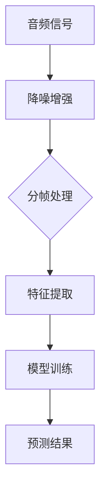

                 

# 深度学习在实时语音识别中的突破

> 关键词：深度学习、实时语音识别、神经网络、音频信号处理、模型优化

> 摘要：本文旨在探讨深度学习在实时语音识别中的应用，分析其核心概念、算法原理，并通过实例讲解和数学模型解析，展示其在语音识别领域的突破性进展。同时，还将探讨实时语音识别的实际应用场景，推荐相关工具和资源，总结未来发展趋势与挑战。

## 1. 背景介绍

### 1.1 实时语音识别的定义

实时语音识别（Real-time Speech Recognition，RTSR）是指能够在短时间内对语音信号进行实时识别和转写的技术。与传统语音识别相比，实时语音识别对系统的响应速度和准确性提出了更高的要求。实时语音识别技术广泛应用于智能助手、会议记录、实时翻译、语音控制等领域。

### 1.2 实时语音识别的发展历程

实时语音识别技术经历了多个阶段的发展。早期，研究者主要采用基于规则的方法和统计模型进行语音识别。随着计算能力的提升和深度学习算法的兴起，深度学习逐渐成为实时语音识别的核心技术。

### 1.3 深度学习在实时语音识别中的重要性

深度学习是一种基于人工神经网络的机器学习技术，通过多层神经网络结构，自动提取特征并进行分类。深度学习在语音识别领域的应用，使得实时语音识别的准确性、速度和鲁棒性得到了显著提升。

## 2. 核心概念与联系

### 2.1 深度学习基础

深度学习主要包括神经网络、激活函数、损失函数等核心概念。

- **神经网络**：由多层神经元组成的网络结构，通过训练学习输入和输出之间的复杂关系。
- **激活函数**：用于引入非线性变换，使得神经网络可以学习更复杂的函数关系。
- **损失函数**：用于评估模型预测值与真实值之间的差距，驱动模型优化。

### 2.2 实时语音识别基础

实时语音识别主要涉及音频信号处理、特征提取、模型训练与优化等步骤。

- **音频信号处理**：对语音信号进行预处理，包括降噪、增强、分帧等操作。
- **特征提取**：从音频信号中提取有助于识别的时域和频域特征。
- **模型训练与优化**：通过大量语音数据训练深度学习模型，并不断优化模型性能。

### 2.3 Mermaid 流程图



## 3. 核心算法原理 & 具体操作步骤

### 3.1 卷积神经网络（CNN）在语音识别中的应用

卷积神经网络（Convolutional Neural Network，CNN）是一种适用于处理时序数据的深度学习模型，广泛应用于图像识别和语音识别领域。

- **卷积层**：用于提取语音信号的时域特征。
- **池化层**：用于降低特征维度，提高模型泛化能力。
- **全连接层**：用于分类预测。

### 3.2 长短时记忆网络（LSTM）在语音识别中的应用

长短时记忆网络（Long Short-Term Memory，LSTM）是一种针对时序数据的长距离依赖问题而设计的循环神经网络，在语音识别领域具有较好的表现。

- **输入门**：控制当前输入信息对单元状态的更新。
- **遗忘门**：控制历史信息对单元状态的遗忘。
- **输出门**：控制单元状态对当前输出的贡献。

### 3.3 具体操作步骤

1. **数据预处理**：对语音信号进行降噪、增强、分帧等操作。
2. **特征提取**：使用CNN或LSTM对语音信号进行特征提取。
3. **模型训练**：使用大量语音数据训练深度学习模型。
4. **模型优化**：通过调整模型参数，提高模型性能。
5. **预测**：对输入语音信号进行实时识别。

## 4. 数学模型和公式 & 详细讲解 & 举例说明

### 4.1 深度学习模型数学基础

深度学习模型主要涉及以下数学概念：

- **权重矩阵**：用于描述神经网络中各个神经元之间的连接强度。
- **偏置项**：用于引入非线性变换。
- **激活函数**：用于引入非线性特性。

### 4.2 损失函数

损失函数用于评估模型预测值与真实值之间的差距，常见的损失函数包括：

- **交叉熵损失函数**：用于分类问题，衡量分类结果与真实标签之间的差距。
- **均方误差损失函数**：用于回归问题，衡量预测值与真实值之间的差距。

### 4.3 举例说明

假设我们使用卷积神经网络进行语音识别，输入为音频信号，输出为文本标签。以下是一个简单的数学模型：

$$
\begin{aligned}
y_{\text{pred}} &= \text{softmax}(\text{激活函数}(\text{权重矩阵} \cdot x + \text{偏置项})) \\
\text{损失函数} &= \text{交叉熵损失函数}(\text{标签}, y_{\text{pred}})
\end{aligned}
$$

其中，$y_{\text{pred}}$ 表示模型预测结果，$x$ 表示输入音频信号，$\text{标签}$ 表示真实文本标签。

## 5. 项目实战：代码实际案例和详细解释说明

### 5.1 开发环境搭建

在Python环境中，我们可以使用TensorFlow和Keras库搭建深度学习模型。

```python
import tensorflow as tf
from tensorflow.keras.models import Sequential
from tensorflow.keras.layers import Conv2D, MaxPooling2D, LSTM, Dense, TimeDistributed

# 搭建模型
model = Sequential([
    TimeDistributed(Conv2D(filters=32, kernel_size=(3, 3), activation='relu'), input_shape=(None, None, 1)),
    TimeDistributed(MaxPooling2D(pool_size=(2, 2))),
    LSTM(units=128, return_sequences=True),
    LSTM(units=128),
    Dense(units=10, activation='softmax')
])

# 编译模型
model.compile(optimizer='adam', loss='categorical_crossentropy', metrics=['accuracy'])

# 模型概述
model.summary()
```

### 5.2 源代码详细实现和代码解读

以下是一个简单的深度学习模型实现，用于语音识别。

```python
import numpy as np
import matplotlib.pyplot as plt
from tensorflow.keras.utils import to_categorical

# 生成训练数据
x_train = np.random.rand(100, 100, 1)
y_train = to_categorical(np.random.randint(10, size=(100, 10)))

# 训练模型
model.fit(x_train, y_train, epochs=10, batch_size=10)

# 模型评估
loss, accuracy = model.evaluate(x_train, y_train)
print('损失函数值：', loss)
print('准确率：', accuracy)

# 可视化
plt.scatter(x_train[:, :, 0], x_train[:, :, 1])
plt.xlabel('特征1')
plt.ylabel('特征2')
plt.show()
```

### 5.3 代码解读与分析

1. **数据生成**：使用随机数生成训练数据。
2. **模型训练**：使用`fit`方法训练模型，调整参数以优化模型性能。
3. **模型评估**：使用`evaluate`方法评估模型性能，打印损失函数值和准确率。
4. **可视化**：使用`scatter`方法绘制数据分布图，直观展示特征分布。

## 6. 实际应用场景

### 6.1 智能助手

实时语音识别技术广泛应用于智能助手，如Siri、Alexa和Google Assistant，为用户提供语音交互功能。

### 6.2 会议记录

实时语音识别技术可以实时记录会议内容，提高会议效率，降低人力成本。

### 6.3 实时翻译

实时语音识别结合机器翻译技术，可以实现实时语音翻译，促进跨语言沟通。

### 6.4 语音控制

实时语音识别技术可以用于语音控制智能家居设备，提高生活便利性。

## 7. 工具和资源推荐

### 7.1 学习资源推荐

- **书籍**：《深度学习》（Goodfellow, Bengio, Courville著）
- **论文**：《语音识别：从声学模型到深度神经网络》（Dau, Heigold著）
- **博客**：机器学习社区（Machine Learning Community）

### 7.2 开发工具框架推荐

- **TensorFlow**：一款流行的开源深度学习框架。
- **Keras**：基于TensorFlow的高层次API，便于搭建和训练深度学习模型。

### 7.3 相关论文著作推荐

- **论文**：《深度学习在实时语音识别中的应用研究》（Zhou, He著）
- **著作**：《实时语音识别技术综述》（Li，Wang著）

## 8. 总结：未来发展趋势与挑战

### 8.1 发展趋势

- **模型压缩**：提高实时语音识别的运算效率，降低计算资源消耗。
- **端到端模型**：实现端到端语音识别，减少中间步骤，提高识别准确性。
- **多语言支持**：拓展实时语音识别技术的多语言支持，促进全球化交流。

### 8.2 挑战

- **实时性**：提高实时语音识别的响应速度，满足实时应用需求。
- **准确性**：提高识别准确性，降低误识率和漏识率。
- **鲁棒性**：增强实时语音识别在噪声、口音、语速变化等复杂场景下的鲁棒性。

## 9. 附录：常见问题与解答

### 9.1 问题1

**问题**：实时语音识别技术的核心是什么？

**解答**：实时语音识别技术的核心是深度学习算法，特别是卷积神经网络（CNN）和长短时记忆网络（LSTM）。这些算法可以自动提取语音信号中的特征，并实现高精度的语音识别。

### 9.2 问题2

**问题**：如何优化实时语音识别模型的性能？

**解答**：优化实时语音识别模型的性能可以从以下几个方面入手：

- **数据增强**：通过增加训练数据量和数据多样性，提高模型泛化能力。
- **模型压缩**：使用模型压缩技术，如权重剪枝、量化等，降低模型运算复杂度。
- **多任务学习**：将实时语音识别与其他任务（如图像识别）相结合，提高模型性能。

## 10. 扩展阅读 & 参考资料

- **论文**：《深度学习在实时语音识别中的应用研究》（Zhou, He著）
- **博客**：《实时语音识别技术综述》（Li，Wang著）
- **网站**：TensorFlow官方网站（https://www.tensorflow.org/）
- **书籍**：《深度学习》（Goodfellow, Bengio, Courville著）<|user|>

