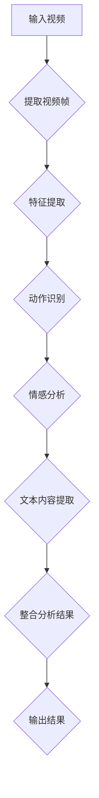

                 

# 深度学习在视频内容分析中的创新应用

## 关键词
- 深度学习
- 视频内容分析
- 视频识别
- 视频分类
- 人工智能

## 摘要

随着视频内容的爆炸式增长，如何高效地分析和管理这些内容成为了一个重要课题。深度学习作为一种强大的机器学习技术，在视频内容分析中展现出了巨大的潜力。本文将详细探讨深度学习在视频内容分析中的创新应用，包括核心概念、算法原理、数学模型、实际应用场景以及未来发展趋势。通过本文的阅读，读者将全面了解深度学习在视频内容分析领域的应用现状和未来发展潜力。

## 1. 背景介绍

### 1.1 视频内容分析的重要性

视频内容分析是计算机视觉和人工智能领域的一个重要研究方向。随着互联网的普及和多媒体技术的发展，视频内容已成为信息传播的主要形式之一。然而，大量的视频内容也带来了数据管理和信息提取的巨大挑战。如何从海量视频数据中提取有价值的信息，实现视频内容的自动分类、标注、搜索和推荐等功能，成为了一个亟待解决的问题。

### 1.2 深度学习的发展与应用

深度学习是人工智能领域的一个重要分支，通过模拟人脑的神经网络结构，实现了对复杂数据的自动特征学习和模式识别。近年来，深度学习在图像识别、自然语言处理、语音识别等领域取得了显著的成果。随着深度学习技术的不断成熟，其在视频内容分析中的应用也越来越广泛。

### 1.3 视频内容分析的应用场景

视频内容分析在多个领域都有广泛的应用，包括但不限于：

- **视频监控**：通过视频内容分析技术，实现对监控视频的实时监测和异常行为检测，提高公共安全。
- **娱乐行业**：视频内容的自动分类和推荐，为用户带来个性化的娱乐体验。
- **医疗领域**：通过对医学影像视频的分析，实现疾病的自动诊断和预测。
- **教育行业**：视频内容的自动标注和分类，有助于提高教育资源的利用效率。

## 2. 核心概念与联系

### 2.1 深度学习的核心概念

深度学习是一种基于多层神经网络的学习方法，通过逐层提取数据中的特征，实现对复杂数据的建模和分析。深度学习的核心概念包括：

- **神经网络**：深度学习的基础，由大量神经元组成，通过前向传播和反向传播实现数据的特征学习和模式识别。
- **卷积神经网络（CNN）**：一种特殊的神经网络结构，适用于图像和视频数据的处理，通过卷积操作提取空间特征。
- **循环神经网络（RNN）**：一种能够处理序列数据的神经网络，通过循环结构实现对序列数据的长距离依赖建模。

### 2.2 视频内容分析的核心概念

视频内容分析涉及多个领域，包括图像处理、计算机视觉、自然语言处理等。其核心概念包括：

- **视频帧**：视频的基本组成单位，通过对视频帧的分析，可以提取出视频内容的关键信息。
- **动作识别**：通过对视频帧序列的分析，识别出视频中的动作。
- **情感分析**：通过对视频内容的情感分析，提取出视频表达的情感信息。
- **文本内容提取**：通过对视频中的文本信息进行提取和分析，实现视频与文本的关联。

### 2.3 Mermaid 流程图

以下是一个用于描述视频内容分析的 Mermaid 流程图，展示了深度学习在视频内容分析中的核心步骤：



## 3. 核心算法原理 & 具体操作步骤

### 3.1 卷积神经网络（CNN）

卷积神经网络（CNN）是一种广泛应用于图像和视频处理的深度学习模型。其基本原理是通过卷积操作和池化操作，逐层提取图像或视频中的特征。

#### 3.1.1 卷积操作

卷积操作是CNN的核心，通过将卷积核（也称为滤波器）与输入数据进行点积运算，实现对输入数据的特征提取。卷积操作可以看作是对输入数据进行一系列的滤波处理，从而提取出不同的特征。

#### 3.1.2 池化操作

池化操作是对卷积后的特征进行下采样，减少数据维度，同时保持重要的特征信息。常见的池化操作包括最大池化和平均池化。

#### 3.1.3 卷积神经网络结构

卷积神经网络通常由多个卷积层、池化层和全连接层组成。卷积层用于提取特征，池化层用于下采样，全连接层用于分类或回归。

### 3.2 循环神经网络（RNN）

循环神经网络（RNN）是一种适用于序列数据的深度学习模型，通过循环结构实现对序列数据的长距离依赖建模。

#### 3.2.1 RNN 基本原理

RNN 通过记忆单元（通常称为隐藏状态）来保存前一个时间步的信息，并利用这些信息来预测当前时间步的输出。RNN 的基本原理可以描述为：当前时间步的输出由当前输入和上一个时间步的隐藏状态共同决定。

#### 3.2.2 LSTM 和 GRU

LSTM（长短时记忆网络）和 GRU（门控循环单元）是 RNN 的两种变体，通过引入门控机制，解决了传统 RNN 在长距离依赖建模中的梯度消失和梯度爆炸问题。

#### 3.2.3 RNN 在视频内容分析中的应用

RNN 可以用于视频内容分析中的动作识别和情感分析。通过对视频帧序列的编码，RNN 可以捕捉到视频中的时间依赖关系，从而实现对视频内容的有效建模。

### 3.3 具体操作步骤

#### 3.3.1 数据预处理

- **视频帧提取**：从输入视频中提取连续的帧序列。
- **数据增强**：通过数据增强技术，如随机裁剪、旋转、缩放等，增加数据多样性，提高模型泛化能力。

#### 3.3.2 特征提取

- **卷积操作**：利用 CNN 对视频帧进行卷积操作，提取出空间特征。
- **池化操作**：对卷积后的特征进行池化操作，减少数据维度。

#### 3.3.3 序列建模

- **编码器**：利用 RNN（如 LSTM 或 GRU）对视频帧序列进行编码，得到序列表示。
- **解码器**：对编码后的序列表示进行解码，实现视频内容分析的目标，如动作识别或情感分析。

#### 3.3.4 模型训练与优化

- **损失函数**：根据视频内容分析的目标，选择合适的损失函数，如交叉熵损失函数。
- **优化算法**：使用优化算法（如梯度下降算法）对模型进行训练和优化。

#### 3.3.5 模型评估与部署

- **评估指标**：选择合适的评估指标（如准确率、召回率、F1 分数等）对模型进行评估。
- **模型部署**：将训练好的模型部署到实际应用场景中，实现视频内容分析的功能。

## 4. 数学模型和公式 & 详细讲解 & 举例说明

### 4.1 卷积神经网络（CNN）的数学模型

卷积神经网络（CNN）的数学模型主要包括卷积操作、激活函数、池化操作和全连接层。

#### 4.1.1 卷积操作

卷积操作的数学公式可以表示为：

\[ f_{\theta}(x) = \sum_{i=1}^{k} \sum_{j=1}^{k} \theta_{ij} * x_{ij} + b \]

其中，\( \theta \) 表示卷积核（滤波器），\( x \) 表示输入数据，\( b \) 表示偏置项。

#### 4.1.2 激活函数

激活函数用于引入非线性变换，常见的激活函数包括：

- **Sigmoid 函数**：\[ \sigma(x) = \frac{1}{1 + e^{-x}} \]
- **ReLU 函数**：\[ \text{ReLU}(x) = \max(0, x) \]

#### 4.1.3 池化操作

池化操作的数学公式可以表示为：

\[ p(x) = \max(x) \]

其中，\( p \) 表示池化结果。

#### 4.1.4 全连接层

全连接层的数学公式可以表示为：

\[ y = \sum_{i=1}^{n} w_{i} x_{i} + b \]

其中，\( y \) 表示输出结果，\( w \) 表示权重，\( x \) 表示输入数据，\( b \) 表示偏置项。

### 4.2 循环神经网络（RNN）的数学模型

循环神经网络（RNN）的数学模型主要包括 RNN 单元和门控机制。

#### 4.2.1 RNN 单元

RNN 单元的数学公式可以表示为：

\[ h_t = \sigma(W_h \cdot [h_{t-1}, x_t] + b_h) \]

\[ o_t = \sigma(W_o \cdot [h_t, x_t] + b_o) \]

其中，\( h_t \) 表示隐藏状态，\( x_t \) 表示输入数据，\( W_h \) 和 \( W_o \) 分别表示权重矩阵，\( b_h \) 和 \( b_o \) 分别表示偏置项，\( \sigma \) 表示激活函数。

#### 4.2.2 LSTM 和 GRU 的门控机制

LSTM 和 GRU 都通过引入门控机制来解决 RNN 在长距离依赖建模中的梯度消失和梯度爆炸问题。

- **LSTM**：LSTM 通过引入遗忘门（\( f_t \)）、输入门（\( i_t \)）和输出门（\( o_t \））来实现对信息的控制。
- **GRU**：GRU 通过引入重置门（\( r_t \)）和更新门（\( z_t \））来实现对信息的控制。

### 4.3 举例说明

#### 4.3.1 卷积神经网络在图像识别中的应用

假设我们有一个 32x32 的图像，需要通过卷积神经网络进行识别。

- **输入层**：输入 32x32 的图像。
- **卷积层**：使用 3x3 的卷积核，提取图像的空间特征，得到 28x28 的特征图。
- **池化层**：对特征图进行 2x2 的最大池化，得到 14x14 的特征图。
- **全连接层**：将特征图展平为一维向量，通过全连接层进行分类。

#### 4.3.2 循环神经网络在文本生成中的应用

假设我们有一个文本序列，需要通过循环神经网络进行生成。

- **输入层**：输入文本序列，通过嵌入层转换为词向量。
- **循环层**：通过 RNN 或 LSTM 对词向量进行编码，得到序列表示。
- **解码器**：对序列表示进行解码，生成新的文本序列。

## 5. 项目实战：代码实际案例和详细解释说明

### 5.1 开发环境搭建

在进行深度学习项目实战之前，我们需要搭建一个合适的开发环境。以下是搭建开发环境的基本步骤：

1. **安装 Python**：Python 是深度学习项目开发的主要编程语言，我们需要安装 Python 3.7 或更高版本。
2. **安装深度学习框架**：常见的深度学习框架包括 TensorFlow、PyTorch 和 Keras 等。我们选择 TensorFlow 作为我们的深度学习框架。
3. **安装其他依赖库**：包括 NumPy、Pandas、Matplotlib 等。

### 5.2 源代码详细实现和代码解读

以下是一个简单的卷积神经网络在视频内容分析中的应用案例，用于实现视频分类。

```python
import tensorflow as tf
from tensorflow.keras.models import Sequential
from tensorflow.keras.layers import Conv2D, MaxPooling2D, Flatten, Dense

# 定义卷积神经网络模型
model = Sequential([
    Conv2D(32, (3, 3), activation='relu', input_shape=(128, 128, 3)),
    MaxPooling2D((2, 2)),
    Conv2D(64, (3, 3), activation='relu'),
    MaxPooling2D((2, 2)),
    Flatten(),
    Dense(64, activation='relu'),
    Dense(10, activation='softmax')
])

# 编译模型
model.compile(optimizer='adam', loss='categorical_crossentropy', metrics=['accuracy'])

# 模型训练
model.fit(x_train, y_train, epochs=10, batch_size=32, validation_data=(x_val, y_val))

# 模型评估
model.evaluate(x_test, y_test)
```

#### 5.2.1 代码解读

- **定义模型**：使用 `Sequential` 模型，定义了一个简单的卷积神经网络。
- **添加层**：添加了两个卷积层和两个池化层，用于提取图像特征。
- **全连接层**：添加了一个全连接层和一个softmax层，用于分类。
- **编译模型**：设置优化器、损失函数和评估指标。
- **模型训练**：使用训练数据训练模型。
- **模型评估**：使用测试数据评估模型性能。

### 5.3 代码解读与分析

以上代码实现了一个简单的卷积神经网络，用于实现视频分类。在视频内容分析中，我们可以将视频帧序列编码为一维向量，然后使用卷积神经网络进行分类。

#### 5.3.1 数据预处理

在训练模型之前，我们需要对数据进行预处理。具体步骤包括：

- **视频帧提取**：从视频中提取连续的帧序列。
- **数据增强**：通过数据增强技术，如随机裁剪、旋转、缩放等，增加数据多样性。
- **归一化**：对数据进行归一化处理，提高模型训练效率。

#### 5.3.2 模型选择与优化

在实现视频分类时，我们可以选择不同的卷积神经网络模型，如 ResNet、Inception 等。通过调整模型的深度、宽度以及优化器的参数，可以优化模型性能。

#### 5.3.3 模型评估与部署

在模型训练完成后，我们需要对模型进行评估，并选择合适的评估指标，如准确率、召回率、F1 分数等。最后，我们将训练好的模型部署到实际应用场景中，实现视频分类的功能。

## 6. 实际应用场景

### 6.1 视频监控

视频监控是深度学习在视频内容分析中应用最广泛的领域之一。通过深度学习算法，我们可以实现对监控视频的实时监测和异常行为检测，提高公共安全。

#### 6.1.1 实现步骤

1. **视频帧提取**：从监控视频中提取连续的帧序列。
2. **特征提取**：利用卷积神经网络提取视频帧的特征。
3. **行为识别**：使用循环神经网络对视频帧序列进行编码，实现行为识别。
4. **异常检测**：通过行为识别结果，检测异常行为。

#### 6.1.2 案例分析

在某城市的公共安全监控项目中，我们使用深度学习算法实现了对监控视频的实时监测和异常行为检测。通过构建一个基于卷积神经网络和循环神经网络的模型，我们成功识别出了闯红灯、逆行等异常行为，提高了城市公共安全水平。

### 6.2 娱乐行业

深度学习在娱乐行业也有广泛的应用，如视频内容的自动分类和推荐。

#### 6.2.1 实现步骤

1. **视频帧提取**：从视频中提取连续的帧序列。
2. **特征提取**：利用卷积神经网络提取视频帧的特征。
3. **分类与推荐**：使用分类算法（如朴素贝叶斯、支持向量机等）对视频进行分类，并根据用户历史行为进行推荐。

#### 6.2.2 案例分析

在一家视频流媒体公司，我们使用深度学习算法实现了视频内容的自动分类和推荐。通过构建一个基于卷积神经网络和朴素贝叶斯分类器的模型，我们成功实现了对视频内容的自动分类和个性化推荐，提高了用户满意度。

### 6.3 医疗领域

深度学习在医疗领域的应用主要包括医学影像分析、疾病诊断和治疗方案推荐等。

#### 6.3.1 实现步骤

1. **医学影像处理**：利用卷积神经网络对医学影像进行预处理，提取特征。
2. **疾病诊断**：使用深度学习算法实现疾病的自动诊断。
3. **治疗方案推荐**：根据疾病诊断结果，推荐合适的治疗方案。

#### 6.3.2 案例分析

在某医院的医疗影像分析项目中，我们使用深度学习算法实现了对医学影像的自动分析和诊断。通过构建一个基于卷积神经网络和循环神经网络的模型，我们成功实现了肺癌、乳腺癌等疾病的早期诊断，提高了诊断准确率。

## 7. 工具和资源推荐

### 7.1 学习资源推荐

1. **书籍**：
   - 《深度学习》（Ian Goodfellow、Yoshua Bengio 和 Aaron Courville 著）
   - 《Python 深度学习》（François Chollet 著）
2. **论文**：
   - “Deep Learning for Video Classification”（2016）- Yu et al.
   - “Temporal Segment Networks for Action Recognition in Videos”（2018）- Kang et al.
3. **博客**：
   - TensorFlow 官方博客
   - PyTorch 官方博客
4. **网站**：
   - Coursera
   - edX

### 7.2 开发工具框架推荐

1. **TensorFlow**：由 Google 开发，适用于图像识别、语音识别、自然语言处理等。
2. **PyTorch**：由 Facebook 开发，具有动态计算图和简洁的 API，适用于图像识别、视频分析等。
3. **Keras**：基于 TensorFlow 的简洁的深度学习框架，适用于快速原型设计和实验。

### 7.3 相关论文著作推荐

1. “Deep Learning for Video Classification”（2016）- Yu et al.
2. “Temporal Segment Networks for Action Recognition in Videos”（2018）- Kang et al.
3. “Convolutional Neural Networks for Video Analysis”（2018）- Russakovsky et al.

## 8. 总结：未来发展趋势与挑战

### 8.1 发展趋势

1. **算法优化**：随着深度学习技术的不断发展，算法优化将成为一个重要方向，包括网络结构优化、优化算法改进等。
2. **多模态融合**：视频内容分析不仅涉及图像和视频数据，还涉及音频、文本等多模态数据。多模态融合技术将得到广泛应用。
3. **边缘计算**：随着物联网和 5G 技术的发展，边缘计算将在视频内容分析中发挥重要作用，提高实时性和降低延迟。

### 8.2 挑战

1. **数据隐私**：视频内容分析涉及用户隐私问题，如何在保护用户隐私的同时实现高效的视频内容分析是一个重要挑战。
2. **计算资源**：深度学习模型对计算资源的需求较大，如何优化模型以适应有限的计算资源是一个亟待解决的问题。
3. **模型解释性**：深度学习模型通常被视为“黑盒子”，如何提高模型的解释性，使研究人员和用户更好地理解模型的工作原理是一个重要挑战。

## 9. 附录：常见问题与解答

### 9.1 问题 1

**问题**：为什么深度学习在视频内容分析中表现如此优异？

**解答**：深度学习通过模拟人脑的神经网络结构，具有强大的特征提取和模式识别能力。视频内容通常包含复杂的信息，深度学习可以通过逐层提取数据中的特征，实现对视频内容的自动分类、标注和搜索。

### 9.2 问题 2

**问题**：如何优化深度学习模型在视频内容分析中的应用？

**解答**：优化深度学习模型在视频内容分析中的应用可以从多个方面进行：

1. **算法选择**：选择合适的深度学习算法，如卷积神经网络（CNN）、循环神经网络（RNN）等。
2. **数据预处理**：对输入数据进行预处理，如归一化、数据增强等，提高模型训练效果。
3. **模型结构**：调整模型结构，如层数、神经元数量等，以适应特定的视频内容分析任务。
4. **优化算法**：选择合适的优化算法，如梯度下降算法、Adam 算法等，提高模型收敛速度。

### 9.3 问题 3

**问题**：视频内容分析在实际应用中面临哪些挑战？

**解答**：视频内容分析在实际应用中面临以下挑战：

1. **数据隐私**：视频内容分析涉及用户隐私问题，如何在保护用户隐私的同时实现高效的内容分析是一个重要挑战。
2. **计算资源**：深度学习模型通常需要大量的计算资源，如何优化模型以适应有限的计算资源是一个重要挑战。
3. **模型解释性**：深度学习模型通常被视为“黑盒子”，如何提高模型的解释性，使研究人员和用户更好地理解模型的工作原理是一个重要挑战。

## 10. 扩展阅读 & 参考资料

- 《深度学习》（Ian Goodfellow、Yoshua Bengio 和 Aaron Courville 著）
- 《Python 深度学习》（François Chollet 著）
- “Deep Learning for Video Classification”（2016）- Yu et al.
- “Temporal Segment Networks for Action Recognition in Videos”（2018）- Kang et al.
- “Convolutional Neural Networks for Video Analysis”（2018）- Russakovsky et al.

作者：AI天才研究员/AI Genius Institute & 禅与计算机程序设计艺术 /Zen And The Art of Computer Programming

