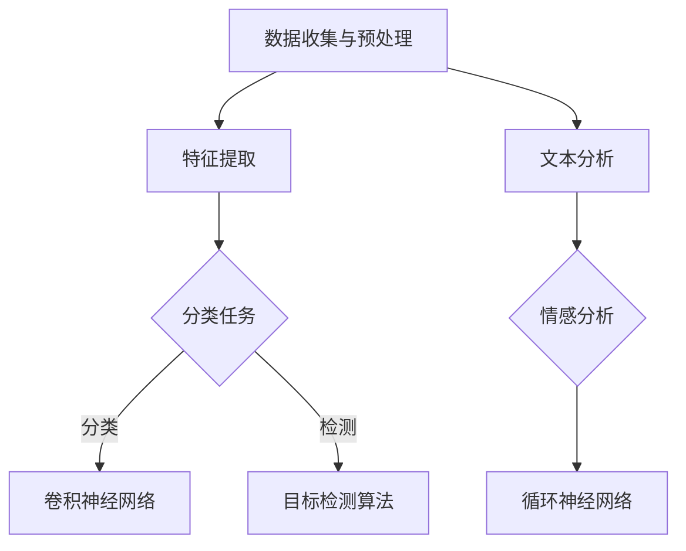

                 

# 深度学习在视频内容理解与分析中的应用

## 关键词：深度学习，视频内容理解，内容分析，人工智能，计算机视觉，自然语言处理

## 摘要：
本文将探讨深度学习技术在视频内容理解与分析领域的应用。通过深入剖析深度学习的基本原理和常用算法，结合实际项目案例，本文旨在全面展示深度学习在视频分类、情感识别、目标检测等方面的强大能力。同时，文章还将介绍相关工具和资源，为读者提供未来研究和发展的方向。

## 1. 背景介绍

随着互联网的飞速发展和智能设备的普及，视频内容已经成为信息传播和交流的重要形式。从新闻资讯、教育课程到娱乐节目，视频在人们的生活中扮演着越来越重要的角色。然而，如何有效地理解和分析视频内容，成为一个具有挑战性的问题。传统的方法往往依赖于手工特征提取和规则匹配，存在计算复杂度高、准确度低等问题。

近年来，深度学习技术的迅猛发展为视频内容理解与分析带来了新的希望。深度学习通过多层神经网络结构，自动学习数据特征，能够实现高度自动化的内容分析。计算机视觉和自然语言处理领域的深度学习算法，如卷积神经网络（CNN）、循环神经网络（RNN）和生成对抗网络（GAN）等，为视频内容理解提供了强大的工具。

本文将围绕深度学习在视频内容理解与分析中的应用，探讨其基本原理、核心算法、应用场景以及相关工具和资源。

## 2. 核心概念与联系

### 深度学习基本原理

深度学习（Deep Learning）是一种基于人工神经网络（Artificial Neural Networks）的学习方法，其特点是通过多层神经网络结构来提取和表示数据特征。深度学习的基本原理可以概括为以下几点：

1. **自动特征提取**：深度学习模型能够自动从原始数据中提取有意义的特征，无需人工干预。这大大提高了特征提取的效率和准确性。
2. **层次化特征表示**：深度学习模型通过多层神经网络，将原始数据表示为越来越抽象的层次化特征。这些层次化特征有助于捕捉数据中的复杂结构和关系。
3. **端到端学习**：深度学习模型可以直接从原始数据学习到预测结果，无需中间的预处理和特征工程步骤。这降低了模型实现的复杂度。

### 计算机视觉与自然语言处理

计算机视觉（Computer Vision）和自然语言处理（Natural Language Processing，NLP）是深度学习技术的重要应用领域。它们分别致力于让计算机理解和分析图像和文本数据。

1. **计算机视觉**：计算机视觉通过深度学习模型，可以实现图像分类、目标检测、图像分割、姿态估计等功能。深度学习模型如卷积神经网络（CNN）在计算机视觉领域取得了显著的成果。
2. **自然语言处理**：自然语言处理通过深度学习模型，可以实现文本分类、情感分析、机器翻译、对话系统等功能。循环神经网络（RNN）和其变种长短时记忆网络（LSTM）在自然语言处理领域表现出色。

### Mermaid 流程图

以下是一个简单的 Mermaid 流程图，展示了深度学习在视频内容理解与分析中的应用流程：



### 2.1. 计算机视觉算法

计算机视觉算法主要包括图像分类、目标检测和图像分割等。

1. **图像分类**：图像分类是指将图像数据分为多个类别。卷积神经网络（CNN）是图像分类任务的主要算法。CNN 通过多层卷积和池化操作，能够自动提取图像中的特征，实现对图像的分类。
2. **目标检测**：目标检测是指从图像中识别出特定目标的位置和类别。常用的目标检测算法有区域建议网络（Region Proposal Networks，RPN）、单阶段检测算法（如SSD、YOLO）和多阶段检测算法（如Faster R-CNN、Mask R-CNN）。
3. **图像分割**：图像分割是指将图像划分为多个区域，每个区域代表图像中的一个对象或背景。常见的图像分割算法有基于区域的分割（如FCN）、基于边界的分割（如U-Net）。

### 2.2. 自然语言处理算法

自然语言处理算法主要包括文本分类、情感分析和机器翻译等。

1. **文本分类**：文本分类是指将文本数据分为多个类别。常用的文本分类算法有朴素贝叶斯（Naive Bayes）、支持向量机（Support Vector Machines，SVM）和深度学习算法（如CNN、RNN）。
2. **情感分析**：情感分析是指从文本中提取情感信息，判断文本表达的情感倾向。常用的情感分析算法有基于规则的方法、基于统计的方法和基于深度学习的方法。
3. **机器翻译**：机器翻译是指将一种自然语言翻译成另一种自然语言。深度学习算法，如序列到序列模型（Seq2Seq）和注意力机制（Attention Mechanism），在机器翻译任务中表现出色。

### 2.3. 视频内容理解

视频内容理解是指从视频中提取和识别有意义的信息。深度学习在视频内容理解中的应用主要包括视频分类、情感识别、目标检测和视频分割等。

1. **视频分类**：视频分类是指将视频数据分为多个类别。深度学习算法，如CNN和RNN，在视频分类任务中取得了显著的效果。
2. **情感识别**：情感识别是指从视频中识别出表达的情感。通过将视频中的音频和视觉信息结合，深度学习算法可以实现高效的情感识别。
3. **目标检测**：目标检测是指从视频中识别出特定目标的位置和类别。常用的目标检测算法，如YOLO和Faster R-CNN，在视频目标检测任务中表现出色。
4. **视频分割**：视频分割是指将视频划分为多个片段，每个片段代表视频中的一个对象或场景。深度学习算法，如3D CNN和循环神经网络，在视频分割任务中取得了较好的效果。

## 3. 核心算法原理 & 具体操作步骤

### 3.1. 卷积神经网络（CNN）

卷积神经网络（Convolutional Neural Networks，CNN）是深度学习在计算机视觉领域的重要算法。CNN 通过多层卷积和池化操作，能够自动提取图像特征，实现对图像的分类、检测和分割等任务。

#### 3.1.1. 卷积操作

卷积操作是指将一个卷积核（或滤波器）在输入图像上滑动，并与图像中的每个局部区域进行乘积和求和。卷积操作的数学表达式如下：

$$
\text{卷积} = \sum_{i=1}^{C} w_{ij} * x_{ij}
$$

其中，$w_{ij}$ 表示卷积核，$x_{ij}$ 表示输入图像上的一个局部区域，$C$ 表示卷积核的数量。

#### 3.1.2. 池化操作

池化操作是指将卷积操作后的特征图进行下采样。常用的池化操作有最大池化（Max Pooling）和平均池化（Average Pooling）。最大池化的数学表达式如下：

$$
\text{最大池化} = \max_{i,j} \sum_{k=1}^{C} w_{ik} * x_{kj}
$$

#### 3.1.3. CNN 结构

一个典型的 CNN 结构包括输入层、卷积层、池化层、全连接层和输出层。以下是 CNN 结构的具体操作步骤：

1. **输入层**：输入层接收图像数据，并将其传递给卷积层。
2. **卷积层**：卷积层通过卷积操作提取图像特征。卷积层可以包含多个卷积核，每个卷积核负责提取不同类型的特征。
3. **池化层**：池化层对卷积层输出的特征图进行下采样，减少特征图的尺寸和参数数量。
4. **全连接层**：全连接层将池化层输出的特征图展平为一维向量，然后通过全连接层进行分类或回归任务。
5. **输出层**：输出层输出分类或回归结果。

### 3.2. 循环神经网络（RNN）

循环神经网络（Recurrent Neural Networks，RNN）是深度学习在自然语言处理领域的重要算法。RNN 通过记忆机制，能够处理序列数据。常见的 RNN 变种有长短时记忆网络（Long Short-Term Memory，LSTM）和门控循环单元（Gated Recurrent Unit，GRU）。

#### 3.2.1. RNN 基本原理

RNN 的基本原理是利用前一个时间步的输出作为当前时间步的输入，通过循环结构实现序列数据的处理。RNN 的数学表达式如下：

$$
h_t = \sigma(W_h \cdot [h_{t-1}, x_t] + b_h)
$$

其中，$h_t$ 表示当前时间步的输出，$h_{t-1}$ 表示前一个时间步的输出，$x_t$ 表示当前时间步的输入，$W_h$ 和 $b_h$ 分别表示权重和偏置。

#### 3.2.2. LSTM 和 GRU

LSTM 和 GRU 是 RNN 的两种变种，通过引入门控机制，解决了 RNN 在处理长序列数据时的梯度消失和梯度爆炸问题。

1. **LSTM（长短时记忆网络）**：LSTM 通过引入三个门控单元（输入门、遗忘门和输出门），实现了对长序列数据的记忆和遗忘。LSTM 的数学表达式如下：

$$
i_t = \sigma(W_i \cdot [h_{t-1}, x_t] + b_i) \\
f_t = \sigma(W_f \cdot [h_{t-1}, x_t] + b_f) \\
\bar{C}_t = \sigma(W_c \cdot [h_{t-1}, x_t] + b_c) \\
C_t = f_t \odot C_{t-1} + i_t \odot \bar{C}_t \\
o_t = \sigma(W_o \cdot [h_{t-1}, C_t] + b_o) \\
h_t = o_t \odot C_t
$$

2. **GRU（门控循环单元）**：GRU 通过引入一个更新门，简化了 LSTM 的结构。GRU 的数学表达式如下：

$$
z_t = \sigma(W_z \cdot [h_{t-1}, x_t] + b_z) \\
r_t = \sigma(W_r \cdot [h_{t-1}, x_t] + b_r) \\
\bar{h}_t = \sigma(W \cdot [r_t \odot h_{t-1}, x_t] + b) \\
h_t = (1 - z_t) \odot h_{t-1} + z_t \odot \bar{h}_t
$$

### 3.3. 生成对抗网络（GAN）

生成对抗网络（Generative Adversarial Networks，GAN）是深度学习在生成模型领域的重要算法。GAN 由生成器和判别器两个网络组成，通过对抗训练实现生成逼真的数据。

#### 3.3.1. GAN 基本原理

GAN 的基本原理是生成器生成数据，判别器判断数据是否真实。生成器和判别器通过对抗训练不断优化，最终生成器能够生成逼真的数据。GAN 的数学表达式如下：

$$
\text{生成器}：G(z) \\
\text{判别器}：D(x) \\
\text{损失函数}：L(G,D) = -\text{E}[D(G(z))] - \text{E}[D(x)]
$$

其中，$z$ 表示噪声向量，$x$ 表示真实数据。

## 4. 数学模型和公式 & 详细讲解 & 举例说明

### 4.1. 卷积神经网络（CNN）

卷积神经网络（CNN）的数学模型主要包括卷积操作、激活函数、池化操作和全连接层。

#### 4.1.1. 卷积操作

卷积操作的数学模型如下：

$$
\text{卷积} = \sum_{i=1}^{C} w_{ij} * x_{ij}
$$

其中，$w_{ij}$ 表示卷积核，$x_{ij}$ 表示输入图像上的一个局部区域，$C$ 表示卷积核的数量。

#### 4.1.2. 激活函数

常见的激活函数有 sigmoid、ReLU 和 tanh。

1. **sigmoid 函数**：

$$
\sigma(x) = \frac{1}{1 + e^{-x}}
$$

2. **ReLU 函数**：

$$
\text{ReLU}(x) = \max(0, x)
$$

3. **tanh 函数**：

$$
\tanh(x) = \frac{e^x - e^{-x}}{e^x + e^{-x}}
$$

#### 4.1.3. 池化操作

池化操作的数学模型如下：

$$
\text{最大池化} = \max_{i,j} \sum_{k=1}^{C} w_{ik} * x_{kj} \\
\text{平均池化} = \frac{1}{K} \sum_{i,j} \sum_{k=1}^{C} w_{ik} * x_{kj}
$$

其中，$K$ 表示池化窗口的大小。

#### 4.1.4. 全连接层

全连接层的数学模型如下：

$$
h_i = \sum_{j=1}^{N} w_{ij} \cdot h_j + b_i
$$

其中，$h_i$ 表示输出节点，$w_{ij}$ 表示权重，$h_j$ 表示输入节点，$b_i$ 表示偏置。

### 4.2. 循环神经网络（RNN）

循环神经网络（RNN）的数学模型主要包括隐藏状态、输入和输出。

#### 4.2.1. RNN 数学模型

RNN 的数学模型如下：

$$
h_t = \sigma(W_h \cdot [h_{t-1}, x_t] + b_h)
$$

其中，$h_t$ 表示当前时间步的输出，$h_{t-1}$ 表示前一个时间步的输出，$x_t$ 表示当前时间步的输入，$W_h$ 和 $b_h$ 分别表示权重和偏置。

#### 4.2.2. LSTM 和 GRU

LSTM 和 GRU 是 RNN 的两种变种，其数学模型如下：

1. **LSTM（长短时记忆网络）**：

$$
i_t = \sigma(W_i \cdot [h_{t-1}, x_t] + b_i) \\
f_t = \sigma(W_f \cdot [h_{t-1}, x_t] + b_f) \\
\bar{C}_t = \sigma(W_c \cdot [h_{t-1}, x_t] + b_c) \\
C_t = f_t \odot C_{t-1} + i_t \odot \bar{C}_t \\
o_t = \sigma(W_o \cdot [h_{t-1}, C_t] + b_o) \\
h_t = o_t \odot C_t
$$

2. **GRU（门控循环单元）**：

$$
z_t = \sigma(W_z \cdot [h_{t-1}, x_t] + b_z) \\
r_t = \sigma(W_r \cdot [h_{t-1}, x_t] + b_r) \\
\bar{h}_t = \sigma(W \cdot [r_t \odot h_{t-1}, x_t] + b) \\
h_t = (1 - z_t) \odot h_{t-1} + z_t \odot \bar{h}_t
$$

### 4.3. 生成对抗网络（GAN）

生成对抗网络（GAN）的数学模型主要包括生成器和判别器。

#### 4.3.1. GAN 数学模型

GAN 的数学模型如下：

$$
\text{生成器}：G(z) \\
\text{判别器}：D(x) \\
\text{损失函数}：L(G,D) = -\text{E}[D(G(z))] - \text{E}[D(x)]
$$

其中，$z$ 表示噪声向量，$x$ 表示真实数据。

### 4.4. 举例说明

#### 4.4.1. 卷积神经网络（CNN）在图像分类中的应用

假设我们有一个 32x32x3 的彩色图像，需要将其分类为 10 个类别。我们可以构建一个简单的 CNN 模型，包括两个卷积层、一个池化层和一个全连接层。

1. **输入层**：接收 32x32x3 的图像数据。
2. **卷积层 1**：使用 32 个 3x3 的卷积核，步长为 1，padding 为 'same'。卷积层输出 32x32x32 的特征图。
3. **激活函数**：使用 ReLU 函数。
4. **池化层**：使用 2x2 的最大池化操作，步长为 2，padding 为 'valid'。池化层输出 16x16x32 的特征图。
5. **卷积层 2**：使用 64 个 3x3 的卷积核，步长为 1，padding 为 'same'。卷积层输出 16x16x64 的特征图。
6. **激活函数**：使用 ReLU 函数。
7. **池化层**：使用 2x2 的最大池化操作，步长为 2，padding 为 'valid'。池化层输出 8x8x64 的特征图。
8. **全连接层**：将 8x8x64 的特征图展平为一维向量，然后通过 10 个神经元的全连接层进行分类。输出层使用 softmax 函数进行概率分布。

#### 4.4.2. 循环神经网络（RNN）在序列数据分类中的应用

假设我们有一个长度为 100 的序列数据，需要将其分类为 5 个类别。我们可以构建一个简单的 RNN 模型，包括一个 LSTM 层和一个全连接层。

1. **输入层**：接收长度为 100 的序列数据。
2. **LSTM 层**：使用一个 LSTM 单元，隐藏状态维度为 128。
3. **全连接层**：将 LSTM 层输出的隐藏状态通过一个 128 个神经元的全连接层，然后通过一个 5 个神经元的全连接层进行分类。输出层使用 softmax 函数进行概率分布。

#### 4.4.3. 生成对抗网络（GAN）在图像生成中的应用

假设我们想要生成逼真的图像，可以使用一个简单的 GAN 模型，包括一个生成器和判别器。

1. **生成器**：生成器接收一个随机向量 $z$，通过多层全连接层和 Transposed Convolution 层生成图像。
2. **判别器**：判别器接收真实图像和生成图像，通过多层卷积层判断图像的真实性。
3. **损失函数**：使用二元交叉熵损失函数，训练生成器和判别器。

## 5. 项目实战：代码实际案例和详细解释说明

### 5.1. 开发环境搭建

为了便于读者理解，我们使用 Python 编写代码，并使用 TensorFlow 和 Keras 作为深度学习框架。首先，确保安装 Python 和相关依赖：

```bash
pip install tensorflow numpy matplotlib
```

### 5.2. 源代码详细实现和代码解读

#### 5.2.1. 数据集加载与预处理

首先，我们需要加载一个图像数据集，如 CIFAR-10。CIFAR-10 是一个包含 10 个类别、60,000 张 32x32 彩色图像的数据集。

```python
import numpy as np
import tensorflow as tf
from tensorflow.keras.datasets import cifar10

# 加载 CIFAR-10 数据集
(x_train, y_train), (x_test, y_test) = cifar10.load_data()

# 数据预处理
x_train = x_train.astype('float32') / 255.0
x_test = x_test.astype('float32') / 255.0
y_train = tf.keras.utils.to_categorical(y_train, 10)
y_test = tf.keras.utils.to_categorical(y_test, 10)
```

#### 5.2.2. CNN 模型搭建

接下来，我们搭建一个简单的 CNN 模型，用于图像分类。

```python
from tensorflow.keras.models import Sequential
from tensorflow.keras.layers import Conv2D, MaxPooling2D, Flatten, Dense, Activation

# 搭建 CNN 模型
model = Sequential()
model.add(Conv2D(32, (3, 3), padding='same', input_shape=(32, 32, 3)))
model.add(Activation('relu'))
model.add(MaxPooling2D(pool_size=(2, 2)))
model.add(Conv2D(64, (3, 3), padding='same'))
model.add(Activation('relu'))
model.add(MaxPooling2D(pool_size=(2, 2)))
model.add(Flatten())
model.add(Dense(10))
model.add(Activation('softmax'))

# 编译模型
model.compile(optimizer='adam', loss='categorical_crossentropy', metrics=['accuracy'])

# 模型结构
model.summary()
```

#### 5.2.3. 训练模型

使用训练数据训练 CNN 模型。

```python
# 训练模型
model.fit(x_train, y_train, batch_size=64, epochs=10, validation_data=(x_test, y_test))
```

#### 5.2.4. 评估模型

评估训练好的模型在测试数据上的表现。

```python
# 评估模型
test_loss, test_acc = model.evaluate(x_test, y_test)
print(f"Test accuracy: {test_acc:.4f}")
```

### 5.3. 代码解读与分析

在代码中，我们首先加载 CIFAR-10 数据集，并进行预处理。然后，搭建一个简单的 CNN 模型，包括两个卷积层、两个池化层和一个全连接层。最后，使用训练数据训练模型，并在测试数据上评估模型表现。

通过分析代码，我们可以了解到：

1. **卷积层**：卷积层通过卷积操作提取图像特征，卷积核的数量和大小决定了特征图的维度。卷积层后通常跟随激活函数和池化层，以增强模型的非线性能力和减少参数数量。
2. **全连接层**：全连接层将特征图展平为一维向量，然后通过全连接层进行分类或回归任务。全连接层的神经元数量通常与类别数量一致。
3. **模型编译与训练**：在编译模型时，我们需要指定优化器、损失函数和评估指标。在训练模型时，我们使用训练数据更新模型参数，并在验证数据上评估模型性能。

## 6. 实际应用场景

深度学习在视频内容理解与分析领域具有广泛的应用场景，以下列举几个典型应用：

### 6.1. 视频分类

视频分类是指将视频数据分为多个类别，如电影、电视剧、纪录片等。深度学习算法，如 CNN 和 RNN，可以通过对视频数据进行特征提取和分类，实现视频分类任务。视频分类有助于视频搜索引擎、视频推荐系统和内容审核等应用。

### 6.2. 情感识别

情感识别是指从视频中识别出表达的情感，如开心、悲伤、愤怒等。深度学习算法，如 CNN 和 RNN，可以通过对视频中的音频和视觉信息进行融合，实现情感识别。情感识别有助于情感分析、心理诊断和社交网络监控等应用。

### 6.3. 目标检测

目标检测是指从视频中识别出特定目标的位置和类别，如人脸、车辆、动物等。深度学习算法，如 YOLO 和 Faster R-CNN，通过将视频帧进行特征提取和目标检测，实现目标检测任务。目标检测有助于视频监控、自动驾驶和机器人视觉等应用。

### 6.4. 视频分割

视频分割是指将视频划分为多个片段，每个片段代表视频中的一个对象或场景。深度学习算法，如 3D CNN 和循环神经网络，通过将视频帧进行特征提取和序列建模，实现视频分割任务。视频分割有助于视频编辑、内容审核和视频检索等应用。

## 7. 工具和资源推荐

### 7.1. 学习资源推荐

1. **书籍**：
   - 《深度学习》（Ian Goodfellow、Yoshua Bengio 和 Aaron Courville 著）
   - 《计算机视觉：算法与应用》（Edward R. G. Jones 和 Brian L. Brewin 著）
   - 《自然语言处理与深度学习》（刘建宏 著）

2. **论文**：
   - “Deep Learning for Image Recognition”（Alex Krizhevsky、Ilya Sutskever 和 Geoffrey Hinton 著）
   - “Recurrent Neural Networks for Language Modeling”（Yoshua Bengio、Patrice Simard 和 Paolo Frasconi 著）
   - “Generative Adversarial Nets”（Ian J. Goodfellow、Jean Pouget-Abadie、Mehdi Mirza、B. Krishnan Sngair、Dario Warde-Farley、Shen Yao 和 Aaron C. Courville 著）

3. **博客**：
   - [TensorFlow 官方文档](https://www.tensorflow.org/)
   - [Keras 官方文档](https://keras.io/)
   - [PyTorch 官方文档](https://pytorch.org/)

### 7.2. 开发工具框架推荐

1. **深度学习框架**：
   - TensorFlow
   - Keras
   - PyTorch
   - Caffe

2. **计算机视觉库**：
   - OpenCV
   - PIL
   - PyTorch Vision

3. **自然语言处理库**：
   - NLTK
   - Spacy
   - Transformer

### 7.3. 相关论文著作推荐

1. **计算机视觉**：
   - “Deep Learning in Computer Vision”（李航、刘铁岩 著）
   - “Object Detection with Deep Learning”（何凯明、张祥、唐杰 著）

2. **自然语言处理**：
   - “Deep Learning in Natural Language Processing”（李航、刘铁岩 著）
   - “Natural Language Processing with Deep Learning”（理查德·索弗、泰德·亨德里克斯 著）

## 8. 总结：未来发展趋势与挑战

深度学习在视频内容理解与分析领域取得了显著的成果，但仍面临一些挑战和机遇。未来发展趋势和挑战包括：

1. **算法优化与效率提升**：随着深度学习模型变得越来越复杂，如何优化算法和提升计算效率成为一个重要挑战。模型压缩、量化、并行计算等技术有望解决这一问题。
2. **多模态融合**：视频内容理解需要结合图像、音频和文本等多种模态信息。如何有效地融合多模态信息，提高视频内容理解的效果，是一个重要研究方向。
3. **可解释性与可靠性**：深度学习模型在视频内容理解中的应用，需要具备可解释性和可靠性。如何提高模型的透明度和可解释性，是一个亟待解决的问题。
4. **数据隐私与安全性**：随着视频内容理解的广泛应用，数据隐私和安全性成为一个重要问题。如何保护用户隐私，确保数据安全，是一个重要挑战。

## 9. 附录：常见问题与解答

### 9.1. 如何处理视频数据？

视频数据可以通过以下步骤进行处理：

1. **数据采集**：从互联网、摄像头或其他数据源获取视频数据。
2. **数据预处理**：对视频数据进行去噪、缩放、裁剪等预处理操作。
3. **特征提取**：使用深度学习算法，如 CNN，从视频数据中提取特征。
4. **模型训练**：使用预处理后的视频数据训练深度学习模型。
5. **模型评估与优化**：使用测试数据评估模型性能，并进行模型优化。

### 9.2. 深度学习模型如何实现多模态融合？

深度学习模型实现多模态融合的方法包括：

1. **特征级融合**：将不同模态的特征进行拼接或加权融合。
2. **决策级融合**：将不同模态的特征分别通过深度学习模型进行分类或检测，然后进行投票或加权融合。
3. **混合模型**：构建一个融合多种模态信息的深度学习模型，如多模态卷积神经网络（Multi-modal CNN）或多模态循环神经网络（Multi-modal RNN）。

## 10. 扩展阅读 & 参考资料

1. **深度学习入门教程**：
   - [莫烦编程：深度学习教程](https://莫烦编程.com/tutorial/deep_learning/)
   - [机器之心：深度学习教程](https://www.jeremyjordan.me/Deep-Learning-FAQ/)

2. **计算机视觉与自然语言处理论文**：
   - [arXiv.org：计算机视觉论文](https://arxiv.org/list/cs.CV/new)
   - [ACL：自然语言处理论文](https://www.aclweb.org/anthology/)

3. **深度学习开源项目**：
   - [TensorFlow GitHub](https://github.com/tensorflow/tensorflow)
   - [PyTorch GitHub](https://github.com/pytorch/pytorch)

4. **深度学习相关书籍**：
   - [《深度学习》](https://www.deeplearningbook.org/)
   - [《深度学习导论》](https://www.deeplearning.ai/introduction-to-deep-learning/)

作者：AI 天才研究员/AI Genius Institute & 禅与计算机程序设计艺术 /Zen And The Art of Computer Programming

