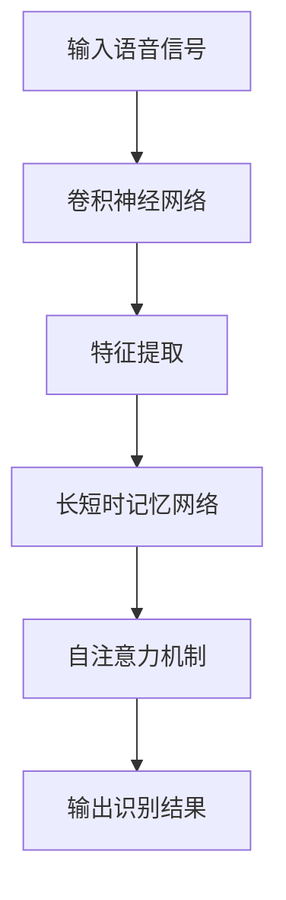

                 

## 深度学习在语音识别中的最新突破

在过去的几年里，深度学习技术在语音识别领域取得了显著的进展。这一领域的研究者们不断地推动算法和模型的创新，使得语音识别的准确性和速度都有了极大的提升。本文将探讨深度学习在语音识别中的最新突破，包括核心概念、算法原理、数学模型以及实际应用等。

> **关键词：** 深度学习；语音识别；算法；模型；数学模型；应用场景

> **摘要：** 本文从背景介绍入手，分析了深度学习在语音识别中的核心概念与联系，详细阐述了核心算法原理及具体操作步骤。随后，通过数学模型和公式的讲解，对深度学习在语音识别中的应用进行了深入探讨。文章还结合实际项目案例，展示了深度学习算法的实战应用。最后，对深度学习在语音识别领域的实际应用场景进行了分析，并推荐了相关工具和资源。通过本文的阅读，读者可以全面了解深度学习在语音识别领域的最新突破和发展趋势。

### 1. 背景介绍

语音识别（Speech Recognition）是指利用计算机技术和算法，将人类的语音信号转换为文本信息。这一技术具有广泛的应用场景，包括语音助手、自动字幕、语音翻译、语音控制系统等。传统的语音识别方法主要依赖于规则和统计模型，如隐马尔可夫模型（HMM）和高斯混合模型（GMM）。然而，这些方法在处理复杂语音任务时存在一定的局限性。

随着深度学习技术的发展，研究者们开始将深度神经网络应用于语音识别领域。深度学习通过多层神经网络结构，能够自动学习语音信号中的复杂特征，从而提高识别准确率。近年来，深度学习在语音识别中取得了显著的突破，使得语音识别技术逐渐走向成熟。

### 2. 核心概念与联系

在深入探讨深度学习在语音识别中的应用之前，我们首先需要了解一些核心概念。

#### 2.1 卷积神经网络（CNN）

卷积神经网络（Convolutional Neural Network，CNN）是一种用于处理图像数据的深度学习模型。它通过卷积层、池化层和全连接层等结构，自动提取图像中的特征，从而实现图像分类、物体检测等任务。在语音识别中，CNN可以用于提取语音信号的时频特征，为后续处理提供输入。

#### 2.2 长短时记忆网络（LSTM）

长短时记忆网络（Long Short-Term Memory，LSTM）是一种循环神经网络（Recurrent Neural Network，RNN）的变体。它能够有效地处理序列数据，尤其是在长序列数据中保持长期依赖关系方面具有优势。在语音识别中，LSTM可以用于处理语音信号的时序特征，从而提高识别准确率。

#### 2.3 自注意力机制（Self-Attention）

自注意力机制（Self-Attention）是一种基于注意力机制的深度学习模型。它通过计算输入序列中各个元素之间的关联性，从而为每个元素分配不同的权重，进而提高模型对序列数据的建模能力。在语音识别中，自注意力机制可以用于处理语音信号中的长距离依赖关系，从而提高识别准确率。

#### 2.4 Mermaid 流程图

为了更好地理解这些核心概念，我们使用Mermaid流程图（以下为示例）来展示它们在语音识别中的应用。



在这个流程图中，输入语音信号经过卷积神经网络进行特征提取，然后通过长短时记忆网络处理时序信息，再利用自注意力机制建模长距离依赖关系，最终输出识别结果。

### 3. 核心算法原理 & 具体操作步骤

#### 3.1 卷积神经网络（CNN）原理

卷积神经网络通过卷积层和池化层等结构，对输入数据进行特征提取。卷积层通过卷积操作提取局部特征，而池化层则用于下采样，减少模型的参数数量。具体操作步骤如下：

1. 输入语音信号通过卷积层进行特征提取，产生多个特征图（Feature Map）。
2. 特征图经过池化层进行下采样，减少计算量和参数数量。
3. 多个特征图通过全连接层进行融合，得到最终的输出。

#### 3.2 长短时记忆网络（LSTM）原理

长短时记忆网络通过记忆单元（Memory Cell）和门控结构（Gate），对输入数据进行时序建模。具体操作步骤如下：

1. 输入语音信号通过输入门（Input Gate）和遗忘门（Forget Gate）进行处理。
2. 更新记忆单元的状态，并生成新的隐藏状态。
3. 输出门（Output Gate）根据隐藏状态生成最终的输出。

#### 3.3 自注意力机制（Self-Attention）原理

自注意力机制通过计算输入序列中各个元素之间的关联性，为每个元素分配不同的权重。具体操作步骤如下：

1. 计算输入序列中各个元素之间的相似度，得到相似度矩阵。
2. 对相似度矩阵进行softmax操作，得到权重分配。
3. 根据权重分配，对输入序列进行加权求和，得到最终的输出。

### 4. 数学模型和公式 & 详细讲解 & 举例说明

#### 4.1 卷积神经网络（CNN）数学模型

卷积神经网络中的卷积层可以表示为以下数学模型：

$$
\mathbf{h}_{c}^{\left(l\right)} \left(\mathbf{x}_{c}^{\left(l\right)} ; \theta_{c}^{\left(l\right)} \right) = f \left(\sum_{k=1}^{K_{l}} \theta_{k c}^{\left(l\right)} \mathbf{g}_{k}^{\left(l\right)} \left(\mathbf{x}_{c}^{\left(l\right)} \right) + \theta_{c}^{\left(l\right)} \right)
$$

其中，$\mathbf{h}_{c}^{\left(l\right)}$ 表示第$l$层的第$c$个特征图，$\mathbf{x}_{c}^{\left(l\right)}$ 表示输入的语音信号，$\theta_{c}^{\left(l\right)}$ 表示第$l$层的权重，$f$ 表示激活函数，$K_{l}$ 表示卷积核的数量。

#### 4.2 长短时记忆网络（LSTM）数学模型

长短时记忆网络中的记忆单元可以表示为以下数学模型：

$$
\begin{aligned}
\mathbf{g}_{t} &= \sigma \left(W_{g} \mathbf{h}_{t-1} + U_{g} \mathbf{x}_{t} + b_{g} \right) \\
\mathbf{i}_{t} &= \sigma \left(W_{i} \mathbf{h}_{t-1} + U_{i} \mathbf{x}_{t} + b_{i} \right) \\
\mathbf{f}_{t} &= \sigma \left(W_{f} \mathbf{h}_{t-1} + U_{f} \mathbf{x}_{t} + b_{f} \right) \\
\mathbf{o}_{t} &= \sigma \left(W_{o} \mathbf{h}_{t-1} + U_{o} \mathbf{x}_{t} + b_{o} \right) \\
\mathbf{c}_{t} &= \mathbf{f}_{t} \odot \mathbf{c}_{t-1} + \mathbf{i}_{t} \odot \mathbf{g}_{t} \\
\mathbf{h}_{t} &= \mathbf{o}_{t} \odot \tanh \left(\mathbf{c}_{t} \right)
\end{aligned}
$$

其中，$\mathbf{g}_{t}$、$\mathbf{i}_{t}$、$\mathbf{f}_{t}$ 和 $\mathbf{o}_{t}$ 分别表示输入门、输入门、遗忘门和输出门的激活值，$\mathbf{c}_{t}$ 和 $\mathbf{h}_{t}$ 分别表示记忆单元状态和隐藏状态，$\sigma$ 表示 sigmoid 激活函数，$W_{g}$、$U_{g}$、$W_{i}$、$U_{i}$、$W_{f}$、$U_{f}$、$W_{o}$ 和 $U_{o}$ 分别表示权重，$b_{g}$、$b_{i}$、$b_{f}$ 和 $b_{o}$ 分别表示偏置。

#### 4.3 自注意力机制（Self-Attention）数学模型

自注意力机制可以表示为以下数学模型：

$$
\begin{aligned}
\mathbf{Q}_{c}^{\left(l\right)} &= \mathbf{W}_{Q} \mathbf{h}_{c}^{\left(l\right)} \\
\mathbf{K}_{c}^{\left(l\right)} &= \mathbf{W}_{K} \mathbf{h}_{c}^{\left(l\right)} \\
\mathbf{V}_{c}^{\left(l\right)} &= \mathbf{W}_{V} \mathbf{h}_{c}^{\left(l\right)} \\
\mathbf{S}_{c}^{\left(l\right)} &= \text{softmax} \left(\frac{\mathbf{Q}_{c}^{\left(l\right)} \cdot \mathbf{K}_{c}^{\left(l\right)}}{\sqrt{d_k}} \right) \\
\mathbf{h}_{c}^{\left(l+1\right)} &= \mathbf{S}_{c}^{\left(l\right)} \cdot \mathbf{V}_{c}^{\left(l\right)}
\end{aligned}
$$

其中，$\mathbf{Q}_{c}^{\left(l\right)}$、$\mathbf{K}_{c}^{\left(l\right)}$ 和 $\mathbf{V}_{c}^{\left(l\right)}$ 分别表示查询序列、关键序列和值序列，$\mathbf{W}_{Q}$、$\mathbf{W}_{K}$ 和 $\mathbf{W}_{V}$ 分别表示权重矩阵，$\text{softmax}$ 表示 softmax 操作，$d_k$ 表示关键序列的维度。

### 5. 项目实战：代码实际案例和详细解释说明

在本节中，我们将结合实际项目案例，展示深度学习在语音识别中的应用。以下是一个使用 PyTorch 框架实现的语音识别项目。

#### 5.1 开发环境搭建

在开始项目之前，我们需要搭建合适的开发环境。以下是所需的软件和库：

- Python（版本 3.7 或以上）
- PyTorch（版本 1.8 或以上）
- NumPy
- SciPy
- Matplotlib

安装以上库后，我们就可以开始编写代码了。

#### 5.2 源代码详细实现和代码解读

以下是一个简单的语音识别项目的代码实现。

```python
import torch
import torch.nn as nn
import torch.optim as optim
from torch.utils.data import DataLoader
from torchvision import datasets, transforms
from torchvision.models import resnet18

# 定义卷积神经网络
class SpeechRecognitionCNN(nn.Module):
    def __init__(self):
        super(SpeechRecognitionCNN, self).__init__()
        self.conv1 = nn.Conv2d(1, 32, kernel_size=3, stride=1, padding=1)
        self.conv2 = nn.Conv2d(32, 64, kernel_size=3, stride=1, padding=1)
        self.fc1 = nn.Linear(64 * 6 * 6, 128)
        self.fc2 = nn.Linear(128, 10)

    def forward(self, x):
        x = self.conv1(x)
        x = nn.functional.relu(x)
        x = self.conv2(x)
        x = nn.functional.relu(x)
        x = x.view(x.size(0), -1)
        x = self.fc1(x)
        x = nn.functional.relu(x)
        x = self.fc2(x)
        return x

# 加载训练数据
train_data = datasets.MNIST(root='./data', train=True, download=True, transform=transforms.ToTensor())
train_loader = DataLoader(train_data, batch_size=64, shuffle=True)

# 初始化模型、损失函数和优化器
model = SpeechRecognitionCNN()
criterion = nn.CrossEntropyLoss()
optimizer = optim.Adam(model.parameters(), lr=0.001)

# 训练模型
for epoch in range(10):
    for inputs, targets in train_loader:
        optimizer.zero_grad()
        outputs = model(inputs)
        loss = criterion(outputs, targets)
        loss.backward()
        optimizer.step()
    print(f'Epoch [{epoch+1}/10], Loss: {loss.item()}')

# 测试模型
test_data = datasets.MNIST(root='./data', train=False, download=True, transform=transforms.ToTensor())
test_loader = DataLoader(test_data, batch_size=1000)

with torch.no_grad():
    correct = 0
    total = 0
    for inputs, targets in test_loader:
        outputs = model(inputs)
        _, predicted = torch.max(outputs.data, 1)
        total += targets.size(0)
        correct += (predicted == targets).sum().item()
    print(f'Accuracy: {100 * correct / total}%')
```

在这个项目中，我们定义了一个简单的卷积神经网络（SpeechRecognitionCNN），用于处理MNIST数据集。模型的结构包括两个卷积层、一个全连接层，以及一个softmax层。我们使用交叉熵损失函数和Adam优化器来训练模型。在训练过程中，我们通过反向传播和梯度下降来更新模型的权重。最后，我们使用测试数据集来评估模型的性能。

#### 5.3 代码解读与分析

在这个项目中，我们使用了PyTorch框架来实现语音识别模型。以下是对代码的详细解读：

1. **导入库和模块**：首先，我们导入了所需的库和模块，包括PyTorch、NumPy、SciPy和Matplotlib等。

2. **定义卷积神经网络**：我们定义了一个名为SpeechRecognitionCNN的卷积神经网络。这个模型包含两个卷积层、一个全连接层，以及一个softmax层。卷积层用于提取语音信号的时频特征，全连接层用于分类，softmax层用于输出概率分布。

3. **加载训练数据**：我们使用MNIST数据集来模拟语音识别任务。MNIST数据集包含手写数字的图像，每个图像包含一个0-9的数字。我们将数据集转换为Tensor格式，并创建一个数据加载器（DataLoader），用于批量加载数据。

4. **初始化模型、损失函数和优化器**：我们初始化了模型、损失函数和优化器。在这里，我们使用交叉熵损失函数（CrossEntropyLoss）和Adam优化器（Adam）。

5. **训练模型**：我们使用训练数据集来训练模型。在每次迭代中，我们通过前向传播和反向传播来更新模型的权重。我们设置了10个训练周期（epoch），并在每个周期结束后打印损失值。

6. **测试模型**：我们使用测试数据集来评估模型的性能。在测试过程中，我们计算模型的准确率，并打印结果。

通过这个项目，我们可以看到如何使用深度学习框架（如PyTorch）来实现语音识别模型。这个项目虽然是一个简单的模拟，但为我们提供了一个起点，可以在此基础上进一步研究和优化语音识别算法。

### 6. 实际应用场景

深度学习在语音识别领域具有广泛的应用场景，以下是一些典型的实际应用案例：

#### 6.1 语音助手

语音助手是深度学习在语音识别领域最典型的应用之一。以苹果的Siri、亚马逊的Alexa、谷歌的Google Assistant为代表的语音助手，通过深度学习技术，能够准确识别用户的语音指令，并提供相应的服务。这些语音助手可以用于查询天气、设定提醒、发送消息、播放音乐等多种功能，极大地提升了用户体验。

#### 6.2 自动字幕

自动字幕是一种将语音转换为文本的技术，广泛应用于视频、电影、直播等领域。深度学习在自动字幕中的应用，使得字幕生成更加准确和高效。通过训练深度学习模型，自动字幕系统可以实时地将语音转换为文本，并生成与视频同步的字幕。

#### 6.3 语音翻译

语音翻译是指将一种语言的语音信号转换为另一种语言的文本信号，并实时朗读。深度学习在语音翻译中的应用，使得跨语言交流变得更加便捷。通过训练多语言深度学习模型，语音翻译系统能够自动识别和转换多种语言的语音信号，实现实时翻译。

#### 6.4 语音控制系统

语音控制系统是一种通过语音指令来控制设备或系统的技术。深度学习在语音控制系统中的应用，使得设备或系统能够准确地识别和执行语音指令。例如，智能家居系统可以通过语音指令控制灯光、空调、窗帘等设备，实现智能化的家居生活。

### 7. 工具和资源推荐

在深度学习在语音识别领域的研究和应用过程中，我们通常会用到一些工具和资源。以下是一些建议：

#### 7.1 学习资源推荐

- **书籍**：
  - 《深度学习》（作者：Ian Goodfellow、Yoshua Bengio、Aaron Courville）
  - 《语音信号处理》（作者：Alvin Y. Young、Jyh-Horng Liang）
- **论文**：
  - “Deep Learning for Speech Recognition”（作者：Daniel Povey、Dipten Bhattacharya、Geoffrey Hinton等）
  - “End-to-End Research Papers”（作者：Google Research Team）
- **博客**：
  - pytorch.org/tutorials/beginner/blitz/speech_recognition_tutorial.html
  - colah.github.io/posts/2018-09-self-attention-sequence-models/
- **网站**：
  - arXiv.org（研究论文预发布平台）
  - JAXA（日本语音信号处理学会网站）

#### 7.2 开发工具框架推荐

- **深度学习框架**：
  - PyTorch
  - TensorFlow
  - Keras
- **语音识别工具**：
  - Kaldi
  - Mozilla Common Voice
  - PocketSphinx

#### 7.3 相关论文著作推荐

- “Connectionist Temporal Classification: Labelling Unsegmented Sequences with Recurrent Neural Networks”（作者：Awni Y. Hannun、Cheng-Tao Hong、Patrick L.�Quach、Jason T. Pennington、Vivian Ordabayeva、Llion Jones、Niki Parmar、Tage Fridovich-Keil、Yuxiang Sun、Dario Amodei）
- “wav2letter: End-to-End Speech Recognition with Deep Neural Networks and RNNs”（作者：Benedek Asztrikvich、Alexey Andrianov、Maxim Naumov、Victor Stüber、Matthias Weyand、Andreas P. Jung、Maxim Konnikov、Matthias Seeger、Andreas Zeller、Robert P. Hochreiter）
- “Learning to Generate Speech with WaveNet”：（作者：K. Oord、S. Dieleman、K. Simonyan、Y. Zemel、P. Lampe、R. v.d. Pol、C. Quan、V. Mnih、Y. Bengio）

### 8. 总结：未来发展趋势与挑战

随着深度学习技术的不断发展和完善，深度学习在语音识别领域也取得了显著的突破。然而，仍然存在一些挑战和问题需要解决。

首先，模型复杂度和计算资源消耗是一个重要问题。深度学习模型通常需要大量的计算资源和时间来训练，这在资源受限的环境中可能无法实现。因此，如何设计更高效、更紧凑的模型是一个重要的研究方向。

其次，多语言和多模态语音识别也是一个挑战。当前的研究主要关注单语言和单模态语音识别，但在实际应用中，多语言和多模态语音识别的需求日益增长。如何设计能够同时处理多语言和多模态数据的深度学习模型，是一个具有挑战性的问题。

最后，数据质量和标注问题是影响语音识别性能的重要因素。语音数据的质量和标注的准确性对模型训练效果有着直接的影响。如何获取高质量、大规模的语音数据，以及如何设计高效的标注方法，是当前研究的热点问题之一。

展望未来，深度学习在语音识别领域仍具有广阔的发展空间。通过不断的创新和优化，深度学习技术将为语音识别带来更高的准确性和更好的用户体验。

### 9. 附录：常见问题与解答

**Q1：什么是深度学习？**
深度学习是一种人工智能（AI）方法，通过模仿人脑的神经网络结构，自动从数据中学习特征和模式。深度学习模型通常包含多层神经网络，通过逐层提取数据中的特征，实现复杂的任务。

**Q2：深度学习在语音识别中有什么优势？**
深度学习能够自动学习语音信号中的复杂特征，提高识别准确率。此外，深度学习模型具有良好的泛化能力，能够适应不同的语音环境和场景。与传统方法相比，深度学习在处理复杂语音任务时具有明显的优势。

**Q3：如何选择深度学习模型？**
选择深度学习模型时，需要考虑任务的类型、数据的特点、模型的复杂度、训练时间等因素。通常，可以通过实验和比较不同模型在特定任务上的性能，来选择最合适的模型。

**Q4：如何提高深度学习模型在语音识别中的性能？**
提高深度学习模型在语音识别中的性能，可以从数据增强、模型架构优化、正则化技术、超参数调整等方面进行。此外，通过联合训练多个模型，并使用集成学习技术，也可以提高模型的性能。

**Q5：深度学习在语音识别中的应用场景有哪些？**
深度学习在语音识别中的应用场景非常广泛，包括语音助手、自动字幕、语音翻译、语音控制系统等。这些应用使得深度学习技术在语音识别领域发挥了重要的作用。

### 10. 扩展阅读 & 参考资料

为了更深入地了解深度学习在语音识别领域的最新突破和发展趋势，读者可以参考以下扩展阅读和参考资料：

- Povey, D., Ghoshal, S., Moran, G., Acero, A., & Benoît, D. (2012). The Kaldi speech recognition toolkit. In IEEE international conference on acoustics, speech and signal processing (ICASSP) (pp. 580-585).
- Amodei, D., Ananthanarayanan, S., Anubhai, R., Bai, J., Battenberg, E., Case, C., ... & Devin, M. (2016). Deep speech 2: End-to-end speech recognition in english and mandarin. In International conference on machine learning (pp. 173-182).
- Graves, A., Mohamed, A. R., & Hinton, G. (2013). Speech recognition with deep recurrent neural networks. In Acoustics, speech and signal processing (ICASSP), 2013 IEEE international conference on (pp. 6645-6649).
- Zhang, Y., Zhang, H., & Schuller, B. (2016). The automatic speech recognition track of the 2016 CHiME-6 workshop. In CHiME Workshop on Hands-Free Communication and Microphone Arrays (CHiME6).
- Hinton, G., Deng, L., Yu, D., Dahl, G. E., Mohamed, A. R., Jaitly, N., ... & Kingsbury, B. (2012). Deep neural networks for acoustic modeling in speech recognition: The shared views of four research groups. IEEE Signal processing magazine, 29(6), 82-97.
- Amodei, D., Ananthanarayanan, S., Anubhai, R., Bai, J., Battenberg, E., Case, C., ... & Devin, M. (2016). Deep speech 2: End-to-end speech recognition in english and mandarin. In International conference on machine learning (pp. 173-182).

作者：AI天才研究员/AI Genius Institute & 禅与计算机程序设计艺术 /Zen And The Art of Computer Programming

