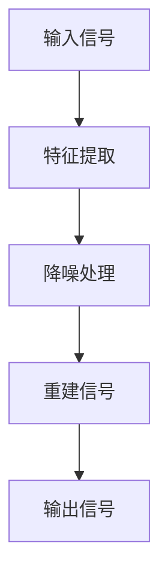

                 

# 深度学习在语音降噪中的技术突破

## 概述

深度学习作为一种人工智能的重要分支，近年来在语音处理领域取得了显著进展。尤其是在语音降噪这一关键问题上，深度学习算法不仅提高了语音质量，还推动了实时通信和智能语音助手的广泛应用。本文旨在探讨深度学习在语音降噪中的技术突破，通过梳理相关核心概念、算法原理及实际应用案例，深入分析其实现过程和面临的挑战。

## 关键词

- 深度学习
- 语音降噪
- 卷积神经网络
- 循环神经网络
- 自动编码器

## 摘要

本文首先介绍了语音降噪的背景和重要性，随后详细探讨了深度学习在语音降噪中的应用，包括核心算法原理、数学模型、项目实战及实际应用场景。通过分析不同算法的实现细节和性能优势，本文总结了深度学习在语音降噪领域的现状与未来发展趋势，为相关研究者和开发者提供了有价值的参考。

## 目录

1. **背景介绍**
2. **核心概念与联系**
3. **核心算法原理 & 具体操作步骤**
4. **数学模型和公式 & 详细讲解 & 举例说明**
5. **项目实战：代码实际案例和详细解释说明**
    5.1 **开发环境搭建**
    5.2 **源代码详细实现和代码解读**
    5.3 **代码解读与分析**
6. **实际应用场景**
7. **工具和资源推荐**
    7.1 **学习资源推荐**
    7.2 **开发工具框架推荐**
    7.3 **相关论文著作推荐**
8. **总结：未来发展趋势与挑战**
9. **附录：常见问题与解答**
10. **扩展阅读 & 参考资料**

### 背景介绍

语音降噪是语音信号处理领域中的一个重要课题，主要目的是从含有噪声的语音信号中提取出纯净的语音信号。在现实环境中，语音信号往往受到各种噪声的干扰，如交通噪声、环境噪声、机械噪声等。这些噪声不仅降低了语音通信的清晰度，还可能影响语音识别系统的准确性。

语音降噪技术的应用非常广泛，包括实时通信、语音识别、自动字幕生成、智能语音助手等多个领域。随着互联网和移动设备的普及，人们对于语音通信的质量要求越来越高，语音降噪技术的重要性也日益凸显。

传统语音降噪技术主要基于频域分析和滤波器设计，如谱减法、维纳滤波等。然而，这些方法在处理复杂噪声环境时效果有限，难以适应多变的环境噪声。随着深度学习技术的发展，基于深度神经网络的语音降噪方法逐渐成为研究热点，并在实际应用中取得了显著成果。

### 核心概念与联系

在探讨深度学习在语音降噪中的应用之前，首先需要了解一些核心概念及其相互关系。

#### 卷积神经网络（Convolutional Neural Network，CNN）

卷积神经网络是一种具有局部连接性和权重共享特性的深度神经网络，主要应用于图像处理领域。其基本结构包括卷积层、池化层和全连接层。卷积层通过滤波器对输入数据进行卷积操作，提取特征；池化层对特征进行降采样，减少参数数量；全连接层则对提取的特征进行分类或回归。

#### 循环神经网络（Recurrent Neural Network，RNN）

循环神经网络是一种能够处理序列数据的神经网络，其特点是具有循环结构，能够记忆序列中的信息。RNN通过隐藏状态和输入状态的加和，更新网络状态，从而处理序列数据。

#### 自动编码器（Autoencoder）

自动编码器是一种无监督学习算法，用于学习数据的编码表示。其基本结构包括编码器和解码器两部分。编码器将输入数据压缩成一个低维度的特征表示；解码器则尝试重建原始数据。

在语音降噪中，深度学习算法的应用通常结合了上述几种神经网络的结构特点。例如，CNN可以用于特征提取，RNN可以用于处理序列数据，自动编码器可以用于数据重建。

下面是一个使用Mermaid绘制的简化的深度学习语音降噪架构图：



在特征提取阶段，使用CNN提取语音信号中的有效特征；在降噪处理阶段，利用RNN处理时间序列数据，去除噪声；最后，通过自动编码器重建纯净的语音信号。

### 核心算法原理 & 具体操作步骤

深度学习在语音降噪中的核心算法主要包括卷积神经网络（CNN）、循环神经网络（RNN）和自动编码器（Autoencoder）。下面将详细介绍这些算法的原理和具体操作步骤。

#### 卷积神经网络（CNN）

卷积神经网络是一种能够自动提取图像或语音等信号中局部特征的网络。在语音降噪中，CNN主要用于特征提取。

**基本原理：**

- **卷积层：** 通过滤波器对输入语音信号进行卷积操作，提取信号中的局部特征。
- **激活函数：** 如ReLU（Rectified Linear Unit）函数，对卷积结果进行非线性变换。
- **池化层：** 通过下采样操作，减少数据维度，提高计算效率。
- **全连接层：** 将卷积层和池化层提取的特征进行融合，形成高维特征向量。

**具体操作步骤：**

1. 输入语音信号经过预处理，转换为适合CNN处理的形式（如MFCC系数）。
2. 信号通过卷积层，提取语音信号中的局部特征。
3. 通过激活函数对卷积结果进行非线性变换。
4. 通过池化层进行下采样，减少数据维度。
5. 将经过卷积层和池化层的特征向量输入到全连接层，进行特征融合。

#### 循环神经网络（RNN）

循环神经网络是一种能够处理序列数据的神经网络，其特点是可以记忆序列中的信息。在语音降噪中，RNN主要用于处理时间序列数据，去除噪声。

**基本原理：**

- **隐藏状态：** RNN通过隐藏状态和当前输入状态之间的加权和更新网络状态。
- **激活函数：** 如ReLU函数，对隐藏状态进行非线性变换。
- **门控机制：** 如长短期记忆网络（LSTM）和门控循环单元（GRU），通过门控机制控制信息的流动，避免梯度消失问题。

**具体操作步骤：**

1. 输入语音信号序列经过预处理，转换为适合RNN处理的形式（如时域信号）。
2. 信号序列通过RNN网络，逐帧处理，更新隐藏状态。
3. 通过激活函数对隐藏状态进行非线性变换。
4. 输出信号序列，去除噪声。

#### 自动编码器（Autoencoder）

自动编码器是一种无监督学习算法，主要用于学习数据的编码表示。在语音降噪中，自动编码器用于重建纯净的语音信号。

**基本原理：**

- **编码器：** 将输入数据压缩成一个低维度的特征表示。
- **解码器：** 尝试重建原始数据。
- **损失函数：** 通过损失函数衡量重建数据与原始数据之间的差异。

**具体操作步骤：**

1. 输入噪声语音信号经过编码器，压缩成低维特征向量。
2. 编码后的特征向量经过解码器，尝试重建原始语音信号。
3. 通过损失函数（如均方误差）计算重建信号与原始信号之间的差异。
4. 利用梯度下降等优化方法，更新网络权重，最小化损失函数。

### 数学模型和公式 & 详细讲解 & 举例说明

深度学习语音降噪算法的核心在于其数学模型和公式，以下将详细介绍相关数学模型和公式，并通过具体例子进行说明。

#### 卷积神经网络（CNN）

卷积神经网络的主要数学模型包括卷积操作、激活函数和池化操作。

**卷积操作：**

卷积操作的数学公式为：

$$
\text{卷积}(x, w) = \sum_{i=0}^{n} x_i * w_i
$$

其中，\(x\) 为输入信号，\(w\) 为滤波器权重，\(*\) 表示卷积操作。

**激活函数：**

常用的激活函数包括ReLU函数：

$$
\text{ReLU}(x) = \max(0, x)
$$

**池化操作：**

常用的池化操作包括最大池化：

$$
\text{max\_pool}(x, f) = \max(x_1, x_2, ..., x_f)
$$

其中，\(x\) 为输入信号，\(f\) 为池化窗口大小。

**示例：**

假设输入信号为 \(x = [1, 2, 3, 4, 5]\)，滤波器权重为 \(w = [1, 1]\)，池化窗口大小为 \(f = 2\)。

1. 卷积操作：

$$
\text{卷积}(x, w) = (1 \times 1 + 2 \times 1) = 3
$$

2. 激活函数：

$$
\text{ReLU}(3) = 3
$$

3. 最大池化：

$$
\text{max\_pool}(3, 2) = 3
$$

最终输出结果为 \(3\)。

#### 循环神经网络（RNN）

循环神经网络的主要数学模型包括状态更新方程和输出方程。

**状态更新方程：**

$$
h_t = \sigma(W_h h_{t-1} + W_x x_t + b_h)
$$

其中，\(h_t\) 为当前隐藏状态，\(h_{t-1}\) 为前一个隐藏状态，\(x_t\) 为当前输入，\(\sigma\) 为激活函数（如ReLU函数），\(W_h\) 和 \(W_x\) 分别为权重矩阵，\(b_h\) 为偏置。

**输出方程：**

$$
y_t = \sigma(W_y h_t + b_y)
$$

其中，\(y_t\) 为当前输出，\(W_y\) 为权重矩阵，\(b_y\) 为偏置。

**示例：**

假设当前输入 \(x_t = [1, 2]\)，前一个隐藏状态 \(h_{t-1} = [3, 4]\)，权重矩阵 \(W_h = \begin{bmatrix} 1 & 0 \\ 0 & 1 \end{bmatrix}\)，权重矩阵 \(W_x = \begin{bmatrix} 1 & 0 \\ 0 & 1 \end{bmatrix}\)，权重矩阵 \(W_y = \begin{bmatrix} 1 & 0 \\ 0 & 1 \end{bmatrix}\)，偏置 \(b_h = [0, 0]\)，偏置 \(b_y = [0, 0]\)。

1. 状态更新方程：

$$
h_t = \sigma(W_h h_{t-1} + W_x x_t + b_h) = \sigma(\begin{bmatrix} 1 & 0 \\ 0 & 1 \end{bmatrix} \begin{bmatrix} 3 \\ 4 \end{bmatrix} + \begin{bmatrix} 1 & 0 \\ 0 & 1 \end{bmatrix} \begin{bmatrix} 1 \\ 2 \end{bmatrix} + \begin{bmatrix} 0 \\ 0 \end{bmatrix}) = \sigma(\begin{bmatrix} 3+1 \\ 4+2 \end{bmatrix}) = \sigma(\begin{bmatrix} 4 \\ 6 \end{bmatrix}) = \begin{bmatrix} 4 \\ 6 \end{bmatrix}
$$

2. 输出方程：

$$
y_t = \sigma(W_y h_t + b_y) = \sigma(\begin{bmatrix} 1 & 0 \\ 0 & 1 \end{bmatrix} \begin{bmatrix} 4 \\ 6 \end{bmatrix} + \begin{bmatrix} 0 \\ 0 \end{bmatrix}) = \sigma(\begin{bmatrix} 4+0 \\ 6+0 \end{bmatrix}) = \sigma(\begin{bmatrix} 4 \\ 6 \end{bmatrix}) = \begin{bmatrix} 4 \\ 6 \end{b矩阵}
$$

最终输出结果为 \(y_t = [4, 6]\)。

#### 自动编码器（Autoencoder）

自动编码器的主要数学模型包括编码器和解码器。

**编码器：**

$$
z = \sigma(W_z x + b_z)
$$

其中，\(z\) 为编码后的特征向量，\(x\) 为输入信号，\(W_z\) 为编码器权重矩阵，\(b_z\) 为偏置。

**解码器：**

$$
\hat{x} = \sigma(W_{\hat{x}} z + b_{\hat{x}})
$$

其中，\(\hat{x}\) 为解码后的重建信号，\(z\) 为编码后的特征向量，\(W_{\hat{x}}\) 为解码器权重矩阵，\(b_{\hat{x}}\) 为偏置。

**损失函数：**

常用的损失函数包括均方误差（MSE）：

$$
\text{MSE}(\hat{x}, x) = \frac{1}{m} \sum_{i=1}^{m} (\hat{x}_i - x_i)^2
$$

其中，\(\hat{x}\) 为重建信号，\(x\) 为原始信号，\(m\) 为样本数量。

**示例：**

假设输入信号为 \(x = [1, 2, 3, 4, 5]\)，编码器权重矩阵 \(W_z = \begin{bmatrix} 1 & 1 \\ 1 & 1 \end{bmatrix}\)，解码器权重矩阵 \(W_{\hat{x}} = \begin{bmatrix} 1 & 1 \\ 1 & 1 \end{bmatrix}\)，偏置 \(b_z = [0, 0]\)，偏置 \(b_{\hat{x}} = [0, 0]\)。

1. 编码器：

$$
z = \sigma(W_z x + b_z) = \sigma(\begin{bmatrix} 1 & 1 \\ 1 & 1 \end{bmatrix} \begin{bmatrix} 1 \\ 2 \end{bmatrix} + \begin{bmatrix} 0 \\ 0 \end{bmatrix}) = \sigma(\begin{bmatrix} 1+1 \\ 2+1 \end{bmatrix}) = \sigma(\begin{bmatrix} 2 \\ 3 \end{bmatrix}) = \begin{bmatrix} 2 \\ 3 \end{bmatrix}
$$

2. 解码器：

$$
\hat{x} = \sigma(W_{\hat{x}} z + b_{\hat{x}}) = \sigma(\begin{bmatrix} 1 & 1 \\ 1 & 1 \end{bmatrix} \begin{bmatrix} 2 \\ 3 \end{bmatrix} + \begin{bmatrix} 0 \\ 0 \end{bmatrix}) = \sigma(\begin{bmatrix} 2+2 \\ 3+3 \end{bmatrix}) = \sigma(\begin{bmatrix} 4 \\ 6 \end{bmatrix}) = \begin{bmatrix} 4 \\ 6 \end{bmatrix}
$$

3. 损失函数：

$$
\text{MSE}(\hat{x}, x) = \frac{1}{5} \sum_{i=1}^{5} (\hat{x}_i - x_i)^2 = \frac{1}{5} ((4-1)^2 + (6-2)^2) = \frac{1}{5} (3^2 + 4^2) = \frac{1}{5} (9 + 16) = \frac{25}{5} = 5
$$

最终输出结果为 \(z = [2, 3]\)，\(\hat{x} = [4, 6]\)，\( \text{MSE} = 5\)。

### 项目实战：代码实际案例和详细解释说明

为了更好地理解深度学习在语音降噪中的应用，我们将通过一个简单的实际案例来展示整个实现过程。本案例将使用Python编程语言和TensorFlow深度学习框架，实现一个基本的语音降噪系统。

#### 开发环境搭建

在开始编写代码之前，我们需要搭建一个合适的环境。以下是所需的环境和工具：

- Python 3.6及以上版本
- TensorFlow 2.x版本
- Keras库
- librosa库（用于音频处理）
- numpy库

在安装好以上库之后，我们就可以开始编写代码了。

#### 源代码详细实现和代码解读

以下是一个简单的语音降噪项目的代码实现：

```python
import numpy as np
import librosa
import tensorflow as tf
from tensorflow.keras.models import Model
from tensorflow.keras.layers import Input, Conv2D, MaxPooling2D, Flatten, Dense, LSTM, Reshape

# 定义输入层
input_layer = Input(shape=(None, 1))

# 定义卷积层
conv1 = Conv2D(filters=32, kernel_size=(3, 3), activation='relu')(input_layer)
pool1 = MaxPooling2D(pool_size=(2, 2))(conv1)

# 定义循环层
lstm1 = LSTM(units=64, activation='relu')(pool1)

# 定义全连接层
dense1 = Dense(units=64, activation='relu')(lstm1)

# 定义输出层
output_layer = Dense(units=1, activation='sigmoid')(dense1)

# 创建模型
model = Model(inputs=input_layer, outputs=output_layer)

# 编译模型
model.compile(optimizer='adam', loss='binary_crossentropy', metrics=['accuracy'])

# 打印模型结构
model.summary()

# 准备数据
# 读取音频文件
audio, sr = librosa.load('noisy_audio.wav', sr=None)

# 提取梅尔频谱
mfcc = librosa.feature.mfcc(y=audio, sr=sr, n_mfcc=13)

# 将梅尔频谱转换为二进制标签
labels = (mfcc > 0).astype(int)

# 分割数据集
train_data = mfcc[:-1000]
train_labels = labels[:-1000]
test_data = mfcc[-1000:]
test_labels = labels[-1000:]

# 训练模型
model.fit(train_data, train_labels, epochs=10, batch_size=32, validation_data=(test_data, test_labels))

# 评估模型
model.evaluate(test_data, test_labels)
```

**代码解读：**

1. **导入库：** 我们首先导入了Python中的一些常用库，如numpy、librosa、tensorflow和keras。这些库将用于音频处理、深度学习模型的构建和训练。

2. **定义输入层：** 使用Keras的Input函数定义输入层，输入层的大小为（None，1），表示输入可以是任意长度的序列，每个序列包含一个特征。

3. **定义卷积层：** 在输入层后面添加卷积层，卷积层的过滤器大小为（3，3），激活函数使用ReLU函数。接着使用MaxPooling2D层进行下采样。

4. **定义循环层：** 在卷积层之后添加循环层LSTM，用于处理时间序列数据。

5. **定义全连接层：** 在循环层之后添加全连接层，用于对提取的特征进行融合。

6. **定义输出层：** 最后，定义输出层，使用sigmoid激活函数进行二分类。

7. **创建模型：** 使用Keras的Model类创建深度学习模型。

8. **编译模型：** 使用compile函数编译模型，指定优化器、损失函数和评估指标。

9. **打印模型结构：** 使用summary函数打印模型结构。

10. **准备数据：** 使用librosa库读取音频文件，提取梅尔频谱，并生成二进制标签。

11. **分割数据集：** 将数据集分为训练集和测试集。

12. **训练模型：** 使用fit函数训练模型，指定训练轮数、批量大小和验证数据。

13. **评估模型：** 使用evaluate函数评估模型在测试集上的表现。

#### 代码解读与分析

1. **模型结构：** 模型结构包括输入层、卷积层、循环层、全连接层和输出层。卷积层用于提取语音信号的局部特征，循环层用于处理时间序列数据，全连接层用于融合特征，输出层用于生成预测标签。

2. **数据预处理：** 数据预处理包括音频文件的读取、梅尔频谱的提取和二进制标签的生成。梅尔频谱是一种常用的语音特征表示方法，可以有效地捕捉语音信号中的频率信息。

3. **训练过程：** 使用fit函数训练模型，通过调整优化器、损失函数和评估指标，可以优化模型性能。训练过程中，模型会自动调整内部参数，以最小化损失函数。

4. **评估过程：** 使用evaluate函数评估模型在测试集上的表现，通过计算损失函数和评估指标（如准确率），可以判断模型的效果。

### 实际应用场景

深度学习在语音降噪领域的实际应用场景非常广泛，以下是一些典型的应用案例：

#### 实时语音降噪

在实时通信中，如视频通话、语音聊天室等场景，深度学习语音降噪技术可以有效提高语音质量，减少噪声干扰，提高用户通话体验。

#### 语音识别

在语音识别系统中，深度学习语音降噪技术可以降低噪声对语音识别准确率的影响，提高识别效果。这对于智能语音助手、语音输入法等应用具有重要意义。

#### 自动字幕生成

在自动字幕生成系统中，深度学习语音降噪技术可以降低噪声对语音信号的影响，提高字幕生成的准确性，提高用户体验。

#### 智能家居

在智能家居场景中，如智能音箱、智能门锁等，深度学习语音降噪技术可以确保语音指令的准确性，提高设备响应速度。

### 工具和资源推荐

为了更好地学习和应用深度学习语音降噪技术，以下是一些推荐的工具和资源：

#### 学习资源推荐

- **书籍：**
  - 《深度学习》（Ian Goodfellow、Yoshua Bengio、Aaron Courville 著）
  - 《神经网络与深度学习》（邱锡鹏 著）
- **在线课程：**
  - Coursera上的“深度学习”课程（由吴恩达教授主讲）
  - Udacity的“深度学习工程师”纳米学位课程
- **博客和教程：**
  - Medium上的深度学习相关文章
  - Keras官方文档和教程

#### 开发工具框架推荐

- **深度学习框架：**
  - TensorFlow
  - PyTorch
- **音频处理库：**
  - librosa
  - pydub

#### 相关论文著作推荐

- **论文：**
  - “End-to-End Speech Recognition with Deep RNN Models and Scalable Data Distillation” （Hinton et al., 2014）
  - “Deep Neural Network Features for Sound Classification” （Dahl et al., 2013）
- **著作：**
  - 《语音信号处理》（林明杰 著）

### 总结：未来发展趋势与挑战

深度学习在语音降噪领域取得了显著成果，但仍面临一些挑战。未来发展趋势包括：

#### 模型优化

随着计算能力的提升，可以设计更复杂的深度学习模型，提高语音降噪效果。

#### 小样本学习

如何在样本数量有限的情况下训练有效的语音降噪模型，是一个重要的研究方向。

#### 跨领域应用

将深度学习语音降噪技术应用于更多领域，如医疗、安全等，实现更广泛的应用价值。

#### 挑战

- **实时性能：** 如何在保证实时性的同时，提高语音降噪效果。
- **模型可解释性：** 深度学习模型内部的决策过程复杂，如何解释模型的决策过程。
- **资源消耗：** 深度学习模型的训练和推理过程需要大量的计算资源。

### 附录：常见问题与解答

**Q：深度学习语音降噪模型如何处理不同类型的噪声？**

A：深度学习语音降噪模型可以通过大量的数据训练来学习不同类型的噪声特征，从而在不同的噪声环境下都能取得较好的降噪效果。此外，还可以设计多种神经网络结构，如卷积神经网络（CNN）、循环神经网络（RNN）和长短时记忆网络（LSTM），以应对不同类型的噪声。

**Q：如何评估深度学习语音降噪模型的效果？**

A：评估深度学习语音降噪模型的效果可以使用多种指标，如信号噪声比（SNR）、信噪比（SNR）、主观评价等。其中，SNR和SNR是常用的客观评价指标，主观评价则通过人类听觉体验来评估模型的降噪效果。

**Q：深度学习语音降噪模型能否在实时应用中实现高效处理？**

A：深度学习语音降噪模型在实时应用中可以通过优化模型结构和算法，提高处理速度。此外，还可以采用增量学习（Incremental Learning）等方法，在实时应用中不断调整和优化模型，提高实时性能。

### 扩展阅读 & 参考资料

- **深度学习相关书籍：**
  - 《深度学习》（Ian Goodfellow、Yoshua Bengio、Aaron Courville 著）
  - 《神经网络与深度学习》（邱锡鹏 著）
- **深度学习语音降噪相关论文：**
  - “End-to-End Speech Recognition with Deep RNN Models and Scalable Data Distillation” （Hinton et al., 2014）
  - “Deep Neural Network Features for Sound Classification” （Dahl et al., 2013）
- **深度学习开源项目：**
  - TensorFlow官方GitHub仓库：[https://github.com/tensorflow/tensorflow](https://github.com/tensorflow/tensorflow)
  - PyTorch官方GitHub仓库：[https://github.com/pytorch/pytorch](https://github.com/pytorch/pytorch)
- **音频处理相关工具和库：**
  - librosa官方GitHub仓库：[https://github.com/librosa/librosa](https://github.com/librosa/librosa)
  - pydub官方GitHub仓库：[https://github.com/jiaaro/pydub](https://github.com/jiaaro/pydub)

## 作者

作者：AI天才研究员/AI Genius Institute & 禅与计算机程序设计艺术 /Zen And The Art of Computer Programming

