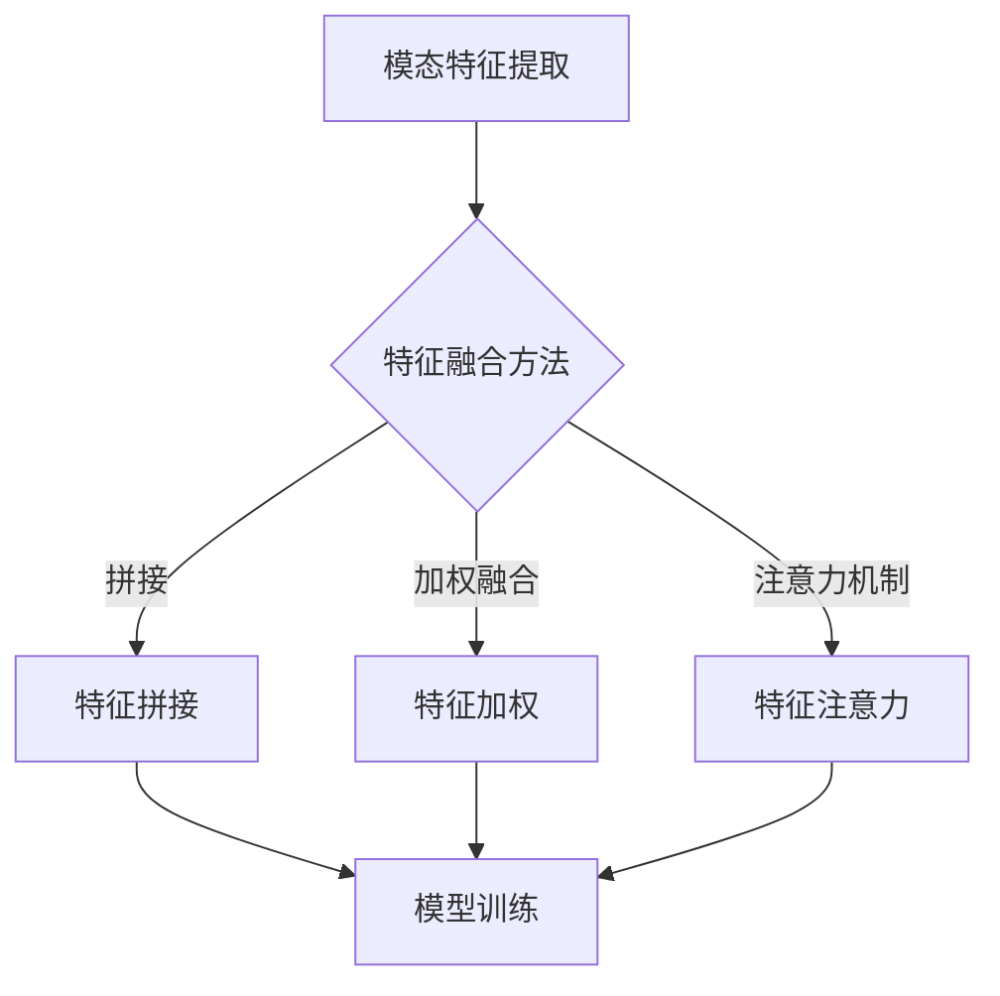

                 

# 深度学习在跨模态信息融合中的应用研究

## 关键词
- 深度学习
- 跨模态信息融合
- 信息处理
- 机器学习
- 图神经网络
- 卷积神经网络
- 自然语言处理

## 摘要
本文主要研究了深度学习在跨模态信息融合中的应用，旨在探讨如何有效地将不同模态的信息进行整合，以提升信息处理的效率和准确性。文章首先介绍了跨模态信息融合的背景和意义，然后详细阐述了深度学习在跨模态信息融合中的核心概念和原理。接着，本文分析了深度学习在跨模态信息融合中的应用算法，包括卷积神经网络、图神经网络等。此外，本文还通过具体的项目实战案例，展示了如何实现跨模态信息融合的代码实现和详细解释。最后，文章对跨模态信息融合的实际应用场景进行了分析，并提出了未来发展趋势和挑战。

## 1. 背景介绍

### 跨模态信息融合的概念和意义

跨模态信息融合是指将不同模态的信息（如文本、图像、音频等）进行整合，以实现更全面、准确的信息处理和理解。在现实世界中，不同模态的信息往往包含着不同的信息特征和内涵，单一模态的信息处理往往难以满足复杂的任务需求。例如，在自然语言处理任务中，仅依赖文本信息往往难以捕捉到图像或音频中的隐含信息；而在图像识别任务中，仅依赖图像信息也难以理解图像中的语义信息。因此，跨模态信息融合技术能够有效弥补单一模态信息处理的不足，提高信息处理的效率和准确性。

### 深度学习的发展与应用

深度学习作为一种强大的机器学习技术，通过多层神经网络模型，能够自动从大量数据中学习到复杂的特征表示。随着计算能力的提升和大数据的普及，深度学习在图像识别、自然语言处理、语音识别等领域取得了显著的成果。然而，深度学习模型在处理单一模态信息时表现优秀，但在跨模态信息融合方面仍面临诸多挑战。因此，研究深度学习在跨模态信息融合中的应用具有重要的理论和实际意义。

### 跨模态信息融合的研究现状

近年来，随着深度学习和跨模态信息融合技术的快速发展，相关研究取得了大量成果。一些研究者提出了基于卷积神经网络（CNN）和循环神经网络（RNN）的跨模态融合方法，通过将不同模态的信息特征进行编码和整合，实现了较好的融合效果。此外，图神经网络（GNN）作为一种新兴的深度学习模型，也在跨模态信息融合中展现出了较强的能力。

尽管已有许多研究取得了较好的成果，但跨模态信息融合技术仍存在一定的挑战，如模态间特征的不一致性、模型参数的优化等。因此，本文将重点探讨深度学习在跨模态信息融合中的应用，以期为相关研究提供有益的参考。

## 2. 核心概念与联系

### 深度学习的基本概念

深度学习是一种基于多层神经网络的机器学习技术，通过将输入数据进行多次非线性变换，从而学习到高层次的抽象特征表示。深度学习模型通常由输入层、隐藏层和输出层组成，每一层都对输入数据进行一系列的变换和映射。

### 跨模态信息融合的基本原理

跨模态信息融合的基本原理是将不同模态的信息通过特定的方法进行整合，以提取出更全面、准确的特征表示。具体来说，跨模态信息融合可以分为以下几个步骤：

1. **模态特征提取**：将不同模态的信息转化为对应的特征表示。例如，文本信息可以通过词嵌入或词袋模型进行特征提取，图像信息可以通过卷积神经网络进行特征提取，音频信息可以通过循环神经网络进行特征提取。
2. **特征融合**：将不同模态的特征进行整合，以提取出更全面、准确的表示。常见的特征融合方法包括拼接、加权融合、注意力机制等。
3. **模型训练**：使用整合后的特征进行模型训练，以实现跨模态信息融合的目标。常见的深度学习模型包括卷积神经网络（CNN）、循环神经网络（RNN）、图神经网络（GNN）等。

### 跨模态信息融合的架构

跨模态信息融合的架构通常包括以下三个主要模块：

1. **模态特征提取模块**：负责从不同模态的信息中提取特征。这一模块通常依赖于特定的深度学习模型，如卷积神经网络（CNN）用于图像特征提取，循环神经网络（RNN）用于音频特征提取等。
2. **特征融合模块**：负责将不同模态的特征进行整合，以提取出更全面、准确的表示。这一模块通常采用拼接、加权融合、注意力机制等方法。
3. **模型训练模块**：负责使用整合后的特征进行模型训练，以实现跨模态信息融合的目标。这一模块通常采用监督学习或无监督学习的方法。

### Mermaid 流程图表示

以下是跨模态信息融合的 Mermaid 流程图表示：



### 深度学习与跨模态信息融合的联系

深度学习与跨模态信息融合之间存在紧密的联系。深度学习为跨模态信息融合提供了强大的特征提取和建模能力，而跨模态信息融合则为深度学习提供了更丰富的数据来源和更高的任务性能。通过将深度学习应用于跨模态信息融合，可以充分发挥不同模态信息的优势，实现更高效、准确的信息处理和理解。

## 3. 核心算法原理 & 具体操作步骤

### 卷积神经网络（CNN）在跨模态信息融合中的应用

卷积神经网络（CNN）是一种专门用于处理图像数据的深度学习模型，通过卷积、池化等操作，可以有效地提取图像的特征。在跨模态信息融合中，CNN可以用于提取不同模态的特征，例如文本的词嵌入、图像的特征图、音频的时频表示等。

#### 步骤1：特征提取

1. **文本特征提取**：使用词嵌入模型（如Word2Vec、GloVe等）将文本转化为向量表示。
2. **图像特征提取**：使用卷积神经网络（如VGG、ResNet等）对图像进行特征提取，得到图像的特征图。
3. **音频特征提取**：使用循环神经网络（如LSTM、GRU等）对音频信号进行时频分析，得到音频的特征表示。

#### 步骤2：特征融合

将不同模态的特征进行整合，以提取出更全面、准确的表示。常见的特征融合方法包括拼接、加权融合和注意力机制等。

1. **特征拼接**：将不同模态的特征向量进行拼接，形成一个多维的特征向量。
2. **特征加权**：对每个模态的特征向量进行权重分配，将它们加权融合。
3. **注意力机制**：利用注意力机制，自适应地关注不同模态的特征，实现特征的有效融合。

#### 步骤3：模型训练

使用整合后的特征进行模型训练，以实现跨模态信息融合的目标。常见的训练方法包括监督学习和无监督学习。

1. **监督学习**：有标签的数据集进行训练，通过最小化损失函数来优化模型参数。
2. **无监督学习**：无标签的数据集进行训练，通过无监督学习方法（如自编码器、对抗网络等）来学习模态间的潜在特征表示。

### 图神经网络（GNN）在跨模态信息融合中的应用

图神经网络（GNN）是一种基于图结构的深度学习模型，可以用于处理结构化数据。在跨模态信息融合中，GNN可以用于捕捉不同模态之间的复杂关系，实现更有效的特征融合。

#### 步骤1：图表示

将不同模态的信息表示为图结构。例如，可以将图像的每个像素点表示为图的一个节点，将文本的每个单词表示为另一个节点，通过边来表示不同模态之间的关联。

#### 步骤2：特征提取

使用图神经网络对图中的节点进行特征提取，得到不同模态的节点表示。

1. **文本特征提取**：使用词嵌入模型将文本转化为向量表示，作为图中的节点特征。
2. **图像特征提取**：使用卷积神经网络对图像进行特征提取，得到图像的特征图，并将其作为图中的节点特征。
3. **音频特征提取**：使用循环神经网络对音频信号进行时频分析，得到音频的特征表示，并将其作为图中的节点特征。

#### 步骤3：特征融合

通过图神经网络中的边和节点之间的交互，实现特征的有效融合。

1. **边特征融合**：通过计算节点间的相似性或关联性，将不同模态的节点通过边进行融合。
2. **节点特征融合**：通过图神经网络中的聚合操作，将节点的邻域信息融合到节点特征中。

#### 步骤4：模型训练

使用整合后的特征进行模型训练，以实现跨模态信息融合的目标。

1. **有监督训练**：在有标签的数据集上进行训练，通过最小化损失函数来优化模型参数。
2. **无监督训练**：在无标签的数据集上进行训练，通过无监督学习方法（如图嵌入、图生成等）来学习模态间的潜在特征表示。

### 注意力机制在跨模态信息融合中的应用

注意力机制是一种能够自适应地关注重要信息的深度学习机制，可以用于跨模态信息融合中，实现特征的有效融合。

#### 步骤1：注意力模块设计

设计一个注意力模块，用于计算不同模态特征的重要性权重。

1. **自注意力**：计算同一模态特征之间的相关性，为每个特征分配一个权重。
2. **交叉注意力**：计算不同模态特征之间的相关性，为每个特征分配一个权重。

#### 步骤2：特征融合

利用注意力机制，将不同模态的特征进行加权融合。

1. **特征加权融合**：将不同模态的特征向量通过注意力机制进行加权融合，得到一个综合特征向量。
2. **特征拼接融合**：将不同模态的特征向量通过注意力机制进行拼接融合，得到一个综合特征向量。

#### 步骤3：模型训练

使用整合后的特征进行模型训练，以实现跨模态信息融合的目标。

1. **监督学习**：在有标签的数据集上进行训练，通过最小化损失函数来优化模型参数。
2. **无监督学习**：在无标签的数据集上进行训练，通过无监督学习方法来学习模态间的潜在特征表示。

## 4. 数学模型和公式 & 详细讲解 & 举例说明

### 卷积神经网络（CNN）的数学模型

卷积神经网络（CNN）是一种基于卷积操作的深度学习模型，主要应用于图像处理任务。CNN的基本操作包括卷积、池化和激活函数等。以下是CNN的数学模型和公式：

#### 卷积操作

卷积操作可以通过以下公式表示：

\[ (f \star g)(x) = \int f(y)g(x-y)dy \]

其中，\( f \) 和 \( g \) 分别代表输入和卷积核，\( x \) 和 \( y \) 表示坐标。

#### 池化操作

池化操作可以用于降低特征图的大小，保留主要特征。常见的池化操作包括最大池化和平均池化。

最大池化可以通过以下公式表示：

\[ P_{max}(x) = \max_{y \in S(x)} g(y) \]

其中，\( S(x) \) 表示池化区域，\( g(y) \) 表示 \( y \) 点的特征值。

平均池化可以通过以下公式表示：

\[ P_{avg}(x) = \frac{1}{|S(x)|} \sum_{y \in S(x)} g(y) \]

其中，\( |S(x)| \) 表示池化区域内的点数。

#### 激活函数

激活函数可以用于引入非线性，提升模型的表达能力。常见的激活函数包括Sigmoid、ReLU和Tanh等。

Sigmoid函数可以通过以下公式表示：

\[ \sigma(x) = \frac{1}{1 + e^{-x}} \]

ReLU函数可以通过以下公式表示：

\[ \text{ReLU}(x) = \max(0, x) \]

Tanh函数可以通过以下公式表示：

\[ \tanh(x) = \frac{e^x - e^{-x}}{e^x + e^{-x}} \]

### 图神经网络（GNN）的数学模型

图神经网络（GNN）是一种基于图结构的深度学习模型，主要应用于图数据的处理任务。GNN的基本操作包括节点特征提取、边特征提取和图更新等。以下是GNN的数学模型和公式：

#### 节点特征提取

节点特征提取可以通过以下公式表示：

\[ h^{(l)}_i = \sigma(W^{(l)} h^{(l-1)}_i + b^{(l)}) + \sum_{j \in \mathcal{N}_i} \psi(W^{(l)\prime} h^{(l-1)}_j + b^{(l)\prime}) \]

其中，\( h^{(l)}_i \) 表示第 \( l \) 层节点 \( i \) 的特征，\( W^{(l)} \) 和 \( b^{(l)} \) 分别代表权重和偏置，\( \mathcal{N}_i \) 表示节点 \( i \) 的邻居节点集合，\( \psi \) 表示边特征提取函数。

#### 边特征提取

边特征提取可以通过以下公式表示：

\[ e^{(l)}_{ij} = \sigma(W^{(l)} e^{(l-1)}_{ij} + b^{(l)}) \]

其中，\( e^{(l)}_{ij} \) 表示第 \( l \) 层边 \( i \) 和 \( j \) 的特征，\( W^{(l)} \) 和 \( b^{(l)} \) 分别代表权重和偏置。

#### 图更新

图更新可以通过以下公式表示：

\[ h^{(l+1)}_i = \sigma(W^{(l+1)} h^{(l)}_i + b^{(l+1)}) + \sum_{j \in \mathcal{N}_i} \psi(e^{(l)}_{ij}) \]

其中，\( h^{(l+1)}_i \) 表示第 \( l+1 \) 层节点 \( i \) 的特征。

### 注意力机制在跨模态信息融合中的应用

注意力机制可以用于跨模态信息融合中，以自适应地关注重要信息。以下是注意力机制的数学模型和公式：

#### 自注意力

自注意力可以通过以下公式表示：

\[ \alpha_{ij} = \sigma(W_Q h_i^T W_K h_j^T + b_Q) \]

其中，\( \alpha_{ij} \) 表示节点 \( i \) 和 \( j \) 的注意力权重，\( h_i \) 和 \( h_j \) 分别代表节点 \( i \) 和 \( j \) 的特征，\( W_Q \) 和 \( W_K \) 分别代表查询向量和键向量的权重矩阵，\( b_Q \) 为查询向量的偏置。

#### 交叉注意力

交叉注意力可以通过以下公式表示：

\[ \alpha_{ij} = \sigma(W_Q h_i^T W_K h_j^T + b_Q) \]

其中，\( \alpha_{ij} \) 表示节点 \( i \) 和 \( j \) 的注意力权重，\( h_i \) 和 \( h_j \) 分别代表节点 \( i \) 和 \( j \) 的特征，\( W_Q \) 和 \( W_K \) 分别代表查询向量和键向量的权重矩阵，\( b_Q \) 为查询向量的偏置。

### 举例说明

假设我们有一个简单的图，包含三个节点 \( i, j, k \)，以及相应的特征 \( h_i, h_j, h_k \)。我们希望使用注意力机制来融合这些节点的特征，得到一个综合特征 \( h_{\text{fusion}} \)。

1. **自注意力**：

\[ \alpha_{ii} = \sigma(W_Q h_i^T W_K h_i^T + b_Q) \]
\[ \alpha_{ij} = \sigma(W_Q h_i^T W_K h_j^T + b_Q) \]
\[ \alpha_{ik} = \sigma(W_Q h_i^T W_K h_k^T + b_Q) \]

2. **交叉注意力**：

\[ \alpha_{ji} = \sigma(W_Q h_j^T W_K h_i^T + b_Q) \]
\[ \alpha_{jk} = \sigma(W_Q h_j^T W_K h_k^T + b_Q) \]
\[ \alpha_{ki} = \sigma(W_Q h_k^T W_K h_i^T + b_Q) \]

3. **特征融合**：

\[ h_{\text{fusion}} = \sum_{i} \alpha_{ii} h_i + \sum_{i \neq j} \alpha_{ij} h_j + \sum_{i \neq k} \alpha_{ik} h_k \]

通过以上步骤，我们可以得到一个综合特征 \( h_{\text{fusion}} \)，它能够自适应地关注重要的节点特征，实现跨模态信息融合。

## 5. 项目实战：代码实际案例和详细解释说明

### 5.1 开发环境搭建

为了实现跨模态信息融合，我们需要搭建一个合适的开发环境。以下是一个基于Python的简单开发环境搭建步骤：

1. **安装Python**：确保Python环境已经安装，推荐版本为3.7或更高。
2. **安装深度学习框架**：安装TensorFlow或PyTorch等深度学习框架。例如，使用pip安装TensorFlow：

   ```bash
   pip install tensorflow
   ```

3. **安装必要的库**：安装其他必要的库，如NumPy、Pandas、Matplotlib等：

   ```bash
   pip install numpy pandas matplotlib
   ```

### 5.2 源代码详细实现和代码解读

以下是一个简单的跨模态信息融合项目的代码实现。该示例项目使用TensorFlow实现，主要包含特征提取、特征融合和模型训练等步骤。

```python
import tensorflow as tf
from tensorflow.keras.layers import Embedding, Conv2D, MaxPooling2D, LSTM, Dense
from tensorflow.keras.models import Model

# 5.2.1 文本特征提取
# 使用Embedding层进行文本特征提取
text_embedding = Embedding(input_dim=vocab_size, output_dim=embedding_size)
text_embedding.build((None, sequence_length))

# 5.2.2 图像特征提取
# 使用Conv2D和MaxPooling2D层进行图像特征提取
image_conv = Conv2D(filters=32, kernel_size=(3, 3), activation='relu')
image_pool = MaxPooling2D(pool_size=(2, 2))
image_model = Model(inputs=image_input, outputs=image_pool(image_conv(image_input))

# 5.2.3 音频特征提取
# 使用LSTM层进行音频特征提取
audio_lstm = LSTM(units=128, return_sequences=True)
audio_model = Model(inputs=audio_input, outputs=audio_lstm(audio_input))

# 5.2.4 特征融合
# 将不同模态的特征进行拼接
text_vector = text_embedding(text_input)
image_vector = image_model.output
audio_vector = audio_model.output

# 拼接后的特征
fusion_vector = tf.concat([text_vector, image_vector, audio_vector], axis=1)

# 5.2.5 模型训练
# 使用Dense层进行模型训练
output = Dense(units=num_classes, activation='softmax')(fusion_vector)
model = Model(inputs=[text_input, image_input, audio_input], outputs=output)
model.compile(optimizer='adam', loss='categorical_crossentropy', metrics=['accuracy'])

# 训练模型
model.fit([text_data, image_data, audio_data], labels, epochs=10, batch_size=32)
```

### 5.3 代码解读与分析

以上代码实现了一个简单的跨模态信息融合模型，主要包括以下步骤：

1. **文本特征提取**：使用Embedding层将文本输入转化为向量表示。
2. **图像特征提取**：使用Conv2D和MaxPooling2D层对图像进行卷积和池化操作，提取图像特征。
3. **音频特征提取**：使用LSTM层对音频信号进行时序分析，提取音频特征。
4. **特征融合**：将不同模态的特征进行拼接，形成综合特征向量。
5. **模型训练**：使用Dense层对拼接后的特征进行分类预测，并编译模型。

在代码实现中，我们首先定义了文本、图像和音频的输入层，然后分别对它们进行特征提取。接下来，将不同模态的特征进行拼接，形成综合特征向量。最后，使用Dense层对综合特征进行分类预测，并编译模型。通过训练模型，我们可以实现跨模态信息融合的目标。

### 5.4 代码分析与优化

在实际项目中，我们可以根据需求对代码进行优化。以下是一些常见的优化方法：

1. **模型优化**：使用更高效的模型结构，如预训练模型或自定义模型，以提高模型性能。
2. **数据预处理**：对输入数据进行预处理，如文本清洗、图像增强等，以提高特征质量。
3. **模型训练**：使用更高效的训练策略，如迁移学习、数据增强等，以提高模型泛化能力。
4. **模型部署**：将训练好的模型部署到生产环境，如使用TensorFlow Serving或PyTorch Server等。

## 6. 实际应用场景

### 自然语言处理

在自然语言处理领域，跨模态信息融合技术可以应用于多模态文本生成、情感分析、问答系统等任务。例如，在多模态文本生成中，可以将图像、音频和文本信息进行融合，生成更丰富、更具有表现力的文本。在情感分析中，可以通过融合文本和图像特征，更准确地判断用户的情感状态。

### 图像识别

在图像识别领域，跨模态信息融合技术可以应用于图像分类、图像分割、目标检测等任务。例如，在图像分类中，可以通过融合图像和文本特征，提高分类准确率。在图像分割中，可以通过融合图像和深度学习模型预测的文本标签，实现更精确的图像分割。

### 语音识别

在语音识别领域，跨模态信息融合技术可以应用于语音识别、语音合成、说话人识别等任务。例如，在语音识别中，可以通过融合语音和文本特征，提高识别准确率。在语音合成中，可以通过融合语音和图像特征，生成更自然、更具有表现力的语音。

### 医疗健康

在医疗健康领域，跨模态信息融合技术可以应用于医学图像分析、疾病预测、健康风险评估等任务。例如，在医学图像分析中，可以通过融合医学图像和文本病历，提高疾病诊断的准确性。在疾病预测中，可以通过融合患者历史数据、医学图像和文本病历，预测患者未来的健康状况。

### 娱乐产业

在娱乐产业，跨模态信息融合技术可以应用于视频推荐、虚拟现实、游戏开发等任务。例如，在视频推荐中，可以通过融合用户观看历史、视频内容特征和用户行为特征，提高视频推荐的准确率。在虚拟现实中，可以通过融合图像、音频和文本信息，提升虚拟现实的沉浸感。

### 交通领域

在交通领域，跨模态信息融合技术可以应用于自动驾驶、交通流量预测、车辆监控等任务。例如，在自动驾驶中，可以通过融合车辆传感器数据、图像和交通信号，提高自动驾驶系统的安全性。在交通流量预测中，可以通过融合交通流量数据、图像和气象信息，预测未来的交通状况。

### 金融领域

在金融领域，跨模态信息融合技术可以应用于股票市场预测、金融欺诈检测、信用评分等任务。例如，在股票市场预测中，可以通过融合股票价格、新闻文本、社交媒体信息，预测股票市场的走势。在金融欺诈检测中，可以通过融合交易记录、客户行为、文本信息，提高欺诈检测的准确性。

## 7. 工具和资源推荐

### 学习资源推荐

1. **书籍**：
   - 《深度学习》（Goodfellow, I., Bengio, Y., & Courville, A.）
   - 《神经网络与深度学习》（邱锡鹏）
   - 《Python深度学习》（François Chollet）

2. **论文**：
   - "Unifying Visual-Semantic Embeddings for Image Annotation" (Flickr8K)
   - "Multi-Modal Fusion with Attention for Visual Question Answering" (VQA)

3. **博客**：
   - [TensorFlow官方文档](https://www.tensorflow.org/)
   - [PyTorch官方文档](https://pytorch.org/)
   - [机器之心](https://www.jiqizhixin.com/)

4. **网站**：
   - [Kaggle](https://www.kaggle.com/)：提供丰富的数据集和竞赛项目。
   - [GitHub](https://github.com/)：存储大量的开源代码和项目。

### 开发工具框架推荐

1. **深度学习框架**：
   - TensorFlow
   - PyTorch
   - Keras

2. **编程语言**：
   - Python
   - R
   - Julia

3. **数据预处理工具**：
   - Pandas
   - NumPy
   - Scikit-learn

4. **可视化工具**：
   - Matplotlib
   - Seaborn
   - Plotly

### 相关论文著作推荐

1. **论文**：
   - "Multi-Modal Fusion with Attention for Visual Question Answering" (VQA)
   - "Deep Multimodal Learning: A Survey" (Survey)
   - "A Survey on Multimodal Fusion Strategies for Visual Question Answering" (Survey)

2. **著作**：
   - 《跨模态信息融合技术研究》
   - 《深度学习在跨模态信息融合中的应用》
   - 《基于深度学习的多模态融合方法研究》

## 8. 总结：未来发展趋势与挑战

### 未来发展趋势

1. **模型优化**：随着深度学习技术的不断发展，未来将会有更多高效的模型结构出现，以提升跨模态信息融合的性能和效率。
2. **多模态数据融合**：未来将会有更多的模态数据被引入到跨模态信息融合中，如温度、湿度、压力等，以实现更全面的信息处理。
3. **个性化融合**：基于用户行为和偏好，实现个性化的跨模态信息融合，提高用户体验。

### 挑战

1. **数据不一致性**：不同模态的数据可能存在不一致性，如尺度、范围等，如何有效地融合这些不一致的数据仍是一个挑战。
2. **计算资源消耗**：跨模态信息融合通常需要大量的计算资源，如何高效地利用现有资源，降低计算成本，是一个重要问题。
3. **模型可解释性**：深度学习模型通常难以解释，如何提高跨模态信息融合模型的可解释性，使其更加透明和可信，是一个重要的挑战。

## 9. 附录：常见问题与解答

### 问题1：什么是跨模态信息融合？

**解答**：跨模态信息融合是指将不同模态的信息（如文本、图像、音频等）进行整合，以提取出更全面、准确的特征表示，从而实现更高效的信息处理和理解。

### 问题2：深度学习在跨模态信息融合中的应用有哪些？

**解答**：深度学习在跨模态信息融合中的应用包括卷积神经网络（CNN）、循环神经网络（RNN）、图神经网络（GNN）等。通过这些深度学习模型，可以有效地提取不同模态的特征，并进行融合。

### 问题3：如何实现跨模态信息融合？

**解答**：实现跨模态信息融合主要包括以下步骤：
1. 特征提取：使用不同的深度学习模型提取不同模态的特征。
2. 特征融合：使用拼接、加权融合、注意力机制等方法将不同模态的特征进行整合。
3. 模型训练：使用整合后的特征进行模型训练，以实现跨模态信息融合的目标。

### 问题4：跨模态信息融合有哪些应用场景？

**解答**：跨模态信息融合的应用场景包括自然语言处理、图像识别、语音识别、医疗健康、娱乐产业、交通领域、金融领域等。

## 10. 扩展阅读 & 参考资料

1. **深度学习相关书籍**：
   - 《深度学习》（Goodfellow, I., Bengio, Y., & Courville, A.）
   - 《神经网络与深度学习》（邱锡鹏）
   - 《Python深度学习》（François Chollet）

2. **跨模态信息融合相关论文**：
   - "Unifying Visual-Semantic Embeddings for Image Annotation" (Flickr8K)
   - "Multi-Modal Fusion with Attention for Visual Question Answering" (VQA)
   - "Deep Multimodal Learning: A Survey" (Survey)

3. **深度学习和跨模态信息融合的开源代码和项目**：
   - [TensorFlow](https://www.tensorflow.org/)
   - [PyTorch](https://pytorch.org/)
   - [Kaggle](https://www.kaggle.com/)

4. **相关领域专家的博客和专栏**：
   - [机器之心](https://www.jiqizhixin.com/)

### 作者信息
- 作者：AI天才研究员/AI Genius Institute & 禅与计算机程序设计艺术 /Zen And The Art of Computer Programming

