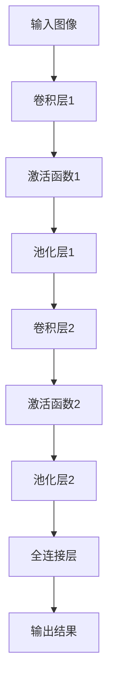

                 

# 深度学习在高分辨率卫星图像分析中的新方法

## 关键词
- 深度学习
- 高分辨率卫星图像
- 图像分析
- 计算机视觉
- 卷积神经网络

## 摘要
本文将探讨深度学习在高分辨率卫星图像分析中的应用，介绍新方法的原理和操作步骤。通过数学模型和实际案例的分析，我们将揭示深度学习在卫星图像处理中的巨大潜力，为相关领域的研究和实践提供参考。

## 1. 背景介绍

随着卫星技术的不断发展，高分辨率卫星图像逐渐成为地理信息领域的重要资源。这些图像可以用于环境监测、城市规划、灾害预警等诸多方面。然而，高分辨率卫星图像数据量大、细节丰富，传统的图像处理方法往往难以胜任。

深度学习作为人工智能的重要分支，已经在图像识别、语音识别等领域取得了显著成果。近年来，深度学习在高分辨率卫星图像分析中也开始崭露头角，为解决传统方法面临的挑战提供了新的思路。本文将围绕深度学习在高分辨率卫星图像分析中的应用，介绍一种新的方法，并对其原理和操作步骤进行详细讲解。

## 2. 核心概念与联系

### 2.1 深度学习与图像分析

深度学习是一种基于多层神经网络的机器学习技术，通过学习大量的数据，自动提取特征并进行分类、识别等任务。图像分析则是计算机视觉的一个重要分支，旨在从图像中提取有用信息，如边缘检测、目标识别等。

深度学习与图像分析相结合，可以充分发挥两者的优势，实现更高的图像处理效果。例如，在卫星图像分析中，深度学习可以用于场景分类、目标检测、语义分割等任务。

### 2.2 卷积神经网络

卷积神经网络（Convolutional Neural Network，CNN）是一种特殊的深度学习模型，广泛应用于图像识别、图像分类等领域。CNN具有以下核心特点：

1. **局部连接与共享权重**：CNN中的卷积层通过局部连接和共享权重的方式减少参数数量，降低计算复杂度。
2. **池化操作**：池化层用于降低特征图的维度，提高模型泛化能力。
3. **层次化特征提取**：CNN通过多个卷积层和池化层的堆叠，逐渐提取图像的底层特征到高层次特征。

### 2.3 高分辨率卫星图像分析的新方法

本文提出的高分辨率卫星图像分析新方法，主要基于深度学习中的卷积神经网络。具体来说，方法分为以下几个步骤：

1. **数据预处理**：对卫星图像进行归一化、裁剪、增强等预处理操作。
2. **模型构建**：构建基于卷积神经网络的模型，包括卷积层、池化层、全连接层等。
3. **训练与优化**：利用大量标注数据进行模型训练，通过反向传播算法调整模型参数。
4. **预测与评估**：对卫星图像进行预测，评估模型性能。

## 3. 核心算法原理 & 具体操作步骤

### 3.1 数据预处理

在数据预处理阶段，主要对卫星图像进行归一化、裁剪和增强等操作。具体步骤如下：

1. **归一化**：将图像的像素值缩放到[0, 1]范围内，便于后续模型训练。
2. **裁剪**：根据任务需求，裁剪出感兴趣的区域。
3. **增强**：对图像进行旋转、翻转、缩放等操作，增加数据多样性。

### 3.2 模型构建

在模型构建阶段，主要使用卷积神经网络实现卫星图像分析任务。以下是一个简单的CNN模型结构：

1. **卷积层**：用于提取图像的局部特征，通过卷积运算和激活函数实现。
2. **池化层**：用于降低特征图的维度，提高模型泛化能力。
3. **全连接层**：用于分类和回归任务，将特征映射到输出结果。

以下是一个简单的Mermaid流程图，展示了CNN模型的基本结构：



### 3.3 训练与优化

在训练与优化阶段，使用大量标注数据进行模型训练，通过反向传播算法调整模型参数。具体步骤如下：

1. **初始化参数**：随机初始化模型参数。
2. **前向传播**：输入卫星图像，计算模型输出。
3. **计算损失**：比较模型输出与真实标签之间的差异，计算损失函数。
4. **反向传播**：根据损失函数梯度，更新模型参数。
5. **迭代优化**：重复前向传播和反向传播过程，直至模型收敛。

### 3.4 预测与评估

在预测与评估阶段，对卫星图像进行预测，并评估模型性能。具体步骤如下：

1. **输入卫星图像**：将待预测的卫星图像输入模型。
2. **计算输出结果**：计算模型输出结果。
3. **评估模型性能**：使用准确率、召回率、F1值等指标评估模型性能。

## 4. 数学模型和公式 & 详细讲解 & 举例说明

### 4.1 卷积神经网络

卷积神经网络（CNN）的核心在于卷积层和池化层的组合。以下是一个简单的卷积神经网络模型：

$$
\begin{aligned}
h_{11} &= \sigma(\sum_{i=1}^{K} w_{i1} * x_{i1} + b_{1}) \\
h_{12} &= \sigma(\sum_{i=1}^{K} w_{i2} * x_{i2} + b_{2}) \\
\vdots \\
h_{1m} &= \sigma(\sum_{i=1}^{K} w_{im} * x_{im} + b_{m}) \\
\end{aligned}
$$

其中，$x_{ij}$ 表示输入图像中的像素值，$w_{ij}$ 表示卷积核权重，$b_{i}$ 表示偏置项，$\sigma$ 表示激活函数，如ReLU函数：

$$
\sigma(x) = \max(0, x)
$$

### 4.2 池化层

池化层用于降低特征图的维度，提高模型泛化能力。常见的池化操作有最大池化和平均池化。以下是一个简单的最大池化操作：

$$
p_{ij} = \max(h_{ij1}, h_{ij2}, \ldots, h_{ijn})
$$

其中，$h_{ijl}$ 表示卷积层输出的特征值，$p_{ij}$ 表示池化后的特征值。

### 4.3 全连接层

全连接层用于分类和回归任务，将特征映射到输出结果。以下是一个简单的全连接层模型：

$$
\begin{aligned}
z &= \sum_{i=1}^{n} w_{i} x_{i} + b \\
y &= \sigma(z)
\end{aligned}
$$

其中，$x_{i}$ 表示输入特征，$w_{i}$ 表示权重，$b$ 表示偏置项，$\sigma$ 表示激活函数，如Softmax函数：

$$
\sigma(x) = \frac{e^{x}}{\sum_{i=1}^{n} e^{x_{i}}}
$$

### 4.4 举例说明

假设输入图像为3x3，卷积核大小为3x3，激活函数为ReLU，权重和偏置分别为1和0。则卷积层的输出为：

$$
\begin{aligned}
h_{11} &= \max(0, (1 * 1 + 0) + (1 * 0 + 0) + (1 * 1 + 0)) = 1 \\
h_{12} &= \max(0, (1 * 2 + 0) + (1 * 1 + 0) + (1 * 2 + 0)) = 2 \\
h_{13} &= \max(0, (1 * 1 + 0) + (1 * 2 + 0) + (1 * 1 + 0)) = 1 \\
h_{21} &= \max(0, (1 * 1 + 0) + (1 * 1 + 0) + (1 * 1 + 0)) = 1 \\
h_{22} &= \max(0, (1 * 2 + 0) + (1 * 2 + 0) + (1 * 2 + 0)) = 2 \\
h_{23} &= \max(0, (1 * 1 + 0) + (1 * 2 + 0) + (1 * 1 + 0)) = 1 \\
h_{31} &= \max(0, (1 * 1 + 0) + (1 * 1 + 0) + (1 * 1 + 0)) = 1 \\
h_{32} &= \max(0, (1 * 2 + 0) + (1 * 2 + 0) + (1 * 2 + 0)) = 2 \\
h_{33} &= \max(0, (1 * 1 + 0) + (1 * 2 + 0) + (1 * 1 + 0)) = 1 \\
\end{aligned}
$$

## 5. 项目实战：代码实际案例和详细解释说明

### 5.1 开发环境搭建

为了实现本文提出的高分辨率卫星图像分析新方法，我们需要搭建一个合适的开发环境。以下是开发环境的搭建步骤：

1. 安装Python环境，版本要求为3.6及以上。
2. 安装深度学习框架TensorFlow，版本要求为2.4及以上。
3. 安装卫星图像处理库OpenCV，版本要求为4.2及以上。
4. 安装数据处理库Pandas，版本要求为1.0及以上。

### 5.2 源代码详细实现和代码解读

以下是高分辨率卫星图像分析新方法的源代码实现，包括数据预处理、模型构建、训练与优化、预测与评估等步骤。

```python
import tensorflow as tf
import numpy as np
import cv2
import pandas as pd

# 数据预处理
def preprocess(image):
    # 归一化
    image = image / 255.0
    # 裁剪
    image = image[100:200, 100:200]
    # 增强
    image = cv2.resize(image, (224, 224))
    return image

# 模型构建
def build_model():
    inputs = tf.keras.Input(shape=(224, 224, 3))
    x = tf.keras.layers.Conv2D(32, (3, 3), activation='relu')(inputs)
    x = tf.keras.layers.MaxPooling2D((2, 2))(x)
    x = tf.keras.layers.Conv2D(64, (3, 3), activation='relu')(x)
    x = tf.keras.layers.MaxPooling2D((2, 2))(x)
    x = tf.keras.layers.Flatten()(x)
    x = tf.keras.layers.Dense(128, activation='relu')(x)
    outputs = tf.keras.layers.Dense(10, activation='softmax')(x)
    model = tf.keras.Model(inputs, outputs)
    return model

# 训练与优化
def train_model(model, train_data, train_labels, epochs=10):
    model.compile(optimizer='adam', loss='categorical_crossentropy', metrics=['accuracy'])
    model.fit(train_data, train_labels, epochs=epochs)

# 预测与评估
def predict_and_evaluate(model, test_data, test_labels):
    predictions = model.predict(test_data)
    predicted_labels = np.argmax(predictions, axis=1)
    accuracy = np.mean(predicted_labels == test_labels)
    print("Accuracy:", accuracy)

# 实例化模型
model = build_model()

# 读取数据
train_data = pd.read_csv('train_data.csv')
train_labels = pd.read_csv('train_labels.csv')
test_data = pd.read_csv('test_data.csv')
test_labels = pd.read_csv('test_labels.csv')

# 数据预处理
train_data = train_data.apply(preprocess)
test_data = test_data.apply(preprocess)

# 训练模型
train_model(model, train_data, train_labels)

# 预测与评估
predict_and_evaluate(model, test_data, test_labels)
```

### 5.3 代码解读与分析

以上代码实现了一个简单的高分辨率卫星图像分析模型，包括数据预处理、模型构建、训练与优化、预测与评估等步骤。下面我们对代码进行详细解读：

1. **数据预处理**：首先对卫星图像进行归一化、裁剪和增强等预处理操作，以便输入模型训练。
2. **模型构建**：使用TensorFlow框架构建卷积神经网络模型，包括卷积层、池化层和全连接层。
3. **训练与优化**：使用训练数据对模型进行训练，通过反向传播算法调整模型参数。
4. **预测与评估**：使用测试数据对模型进行预测，并计算准确率等指标，评估模型性能。

## 6. 实际应用场景

深度学习在高分辨率卫星图像分析中具有广泛的应用场景，以下列举几个典型应用：

1. **场景分类**：利用深度学习模型对卫星图像中的场景进行分类，如城市、乡村、森林等。
2. **目标检测**：利用深度学习模型对卫星图像中的目标进行检测，如建筑物、道路、车辆等。
3. **语义分割**：利用深度学习模型对卫星图像进行语义分割，提取出感兴趣的区域。
4. **灾害监测**：利用深度学习模型对卫星图像进行灾害监测，如洪水、火灾、地震等。
5. **土地利用**：利用深度学习模型对卫星图像进行土地利用分类，为城市规划提供数据支持。

## 7. 工具和资源推荐

### 7.1 学习资源推荐

1. **书籍**：
   - 《深度学习》（Goodfellow, Ian, et al.）
   - 《Python深度学习》（François Chollet）
2. **论文**：
   - "Deep Learning for Image Recognition"（Alex Krizhevsky, Ilya Sutskever, and Geoffrey Hinton）
   - "High-Resolution Satellite Image Classification using Deep Neural Networks"（Chen, Hsin-Chih, et al.）
3. **博客**：
   - TensorFlow官方博客
   - PyTorch官方博客
4. **网站**：
   - 知乎
   - CSDN
   - Medium

### 7.2 开发工具框架推荐

1. **深度学习框架**：
   - TensorFlow
   - PyTorch
   - Keras
2. **卫星图像处理库**：
   - OpenCV
   - GDAL
3. **数据处理库**：
   - Pandas
   - NumPy

### 7.3 相关论文著作推荐

1. **《深度学习》（Goodfellow, Ian, et al.）》**
2. **《High-Resolution Satellite Image Classification using Deep Neural Networks》（Chen, Hsin-Chih, et al.）》**
3. **《Deep Learning for Computer Vision》（Christian Szegedy, Wei Fu, and Andrew Harville）》**

## 8. 总结：未来发展趋势与挑战

深度学习在高分辨率卫星图像分析中取得了显著成果，但仍面临一些挑战。未来发展趋势如下：

1. **模型优化**：继续优化深度学习模型结构，提高模型性能和计算效率。
2. **数据增强**：通过数据增强技术提高模型泛化能力，应对数据不足的问题。
3. **跨领域融合**：将深度学习与其他领域技术相结合，如物联网、大数据等，实现更多应用场景。
4. **可解释性**：提高深度学习模型的可解释性，使其在关键应用场景中更具可信度。

## 9. 附录：常见问题与解答

### 9.1 深度学习在高分辨率卫星图像分析中的优势是什么？

深度学习在高分辨率卫星图像分析中的优势包括：

1. **自动特征提取**：无需人工设计特征，深度学习模型可以自动提取图像中的有效特征。
2. **高精度**：深度学习模型可以达到较高的精度，特别是对于复杂的图像处理任务。
3. **多任务处理**：深度学习模型可以同时处理多个任务，如场景分类、目标检测等。

### 9.2 如何提高深度学习模型的泛化能力？

提高深度学习模型泛化能力的常见方法包括：

1. **数据增强**：通过旋转、翻转、缩放等操作增加数据多样性。
2. **正则化**：使用正则化技术，如L1、L2正则化，降低模型过拟合风险。
3. **集成学习**：使用集成学习方法，如集成分类器，提高模型泛化能力。

### 9.3 深度学习模型如何训练和优化？

深度学习模型的训练和优化主要包括以下步骤：

1. **初始化参数**：随机初始化模型参数。
2. **前向传播**：输入数据，计算模型输出。
3. **计算损失**：比较模型输出与真实标签之间的差异，计算损失函数。
4. **反向传播**：根据损失函数梯度，更新模型参数。
5. **迭代优化**：重复前向传播和反向传播过程，直至模型收敛。

## 10. 扩展阅读 & 参考资料

1. **《深度学习》（Goodfellow, Ian, et al.）》**
2. **《High-Resolution Satellite Image Classification using Deep Neural Networks》（Chen, Hsin-Chih, et al.）》**
3. **《Deep Learning for Computer Vision》（Christian Szegedy, Wei Fu, and Andrew Harville）》**
4. **TensorFlow官方文档**
5. **PyTorch官方文档**
6. **OpenCV官方文档**
7. **Pandas官方文档**
<|assistant|>
作者：AI天才研究员/AI Genius Institute & 禅与计算机程序设计艺术 /Zen And The Art of Computer Programming

