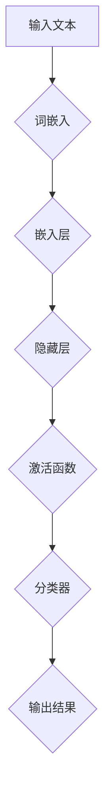

                 

# 深度学习驱动的商品评论分析技术

## 关键词：
- 深度学习
- 商品评论分析
- 自然语言处理
- 情感分析
- 文本分类
- 卷积神经网络
- 循环神经网络
- 长短时记忆网络

## 摘要

本文将深入探讨深度学习在商品评论分析领域的应用。我们首先回顾了传统商品评论分析技术的局限，接着介绍了深度学习的基本概念及其在自然语言处理中的重要性。文章的核心内容分为三个部分：核心概念与联系、核心算法原理与具体操作步骤、以及项目实战。在核心算法原理部分，我们详细讲解了卷积神经网络和循环神经网络的工作原理，并分析了如何使用长短时记忆网络来处理长文本。随后，我们提供了一个实际项目案例，包括开发环境的搭建、源代码的实现与解读，以及代码的解析与分析。最后，文章讨论了商品评论分析的实际应用场景，并推荐了一系列学习资源和开发工具框架，以帮助读者进一步了解和探索这一领域。通过本文的阅读，读者将能够全面掌握深度学习驱动的商品评论分析技术，并对其未来发展趋势和挑战有更深入的认识。

## 1. 背景介绍

商品评论分析在当今电商环境中扮演着至关重要的角色。无论是线上购物平台还是社交媒体，用户评论已经成为消费者做出购买决策的重要依据。然而，面对海量的用户评论，如何快速、准确地提取有价值的信息，成为了电商企业面临的一个巨大挑战。

### 1.1 传统商品评论分析技术

在深度学习技术广泛应用之前，商品评论分析主要依赖于传统的方法。这些方法包括基于规则的方法、机器学习方法以及统计分析方法。

#### 基于规则的方法

基于规则的方法是最早应用于商品评论分析的技术之一。这种方法通过预定义一套规则，如关键词匹配、词频统计等，来识别和分类评论内容。例如，如果一个评论中包含“很好”、“推荐”等正面词汇，则认为这是一个正面评论。这种方法简单直观，但灵活性和准确性有限，难以应对复杂的语境和词汇变化。

#### 机器学习方法

随着机器学习技术的发展，基于统计的文本分类方法逐渐取代了基于规则的方法。典型的机器学习方法包括支持向量机（SVM）、朴素贝叶斯（Naive Bayes）、决策树等。这些方法通过训练模型，从标注好的评论数据中学习到分类规则，从而对新的评论进行分类。相比基于规则的方法，机器学习方法在处理复杂文本方面表现更佳，但它们对特征工程依赖较大，且难以处理长文本和上下文信息。

#### 统计分析方法

统计分析方法主要通过统计评论中的词汇分布、共现关系等特征，来推断评论的情感倾向。常见的方法包括词频统计、TF-IDF（词频-逆文档频率）、文本相似度计算等。这些方法在处理大规模文本数据时表现良好，但同样面临着特征提取的复杂性和对上下文信息处理的不足。

### 1.2 传统方法的局限

尽管传统方法在商品评论分析中取得了一定的成效，但它们仍存在以下局限：

1. **特征提取复杂**：传统方法往往需要人工设计特征，如词袋模型、TF-IDF等，这增加了模型训练的复杂性和对领域知识的依赖。
2. **上下文信息不足**：长文本分析中，传统方法难以捕捉到上下文信息，导致情感分析的准确率不高。
3. **灵活性差**：传统方法对文本中的新词汇和新表达方式难以适应，导致模型在新数据上的表现不佳。
4. **可解释性低**：许多传统方法如深度学习方法，模型内部的黑盒特性使得结果难以解释，这对于需要决策支持的应用场景来说是一个重大挑战。

### 1.3 深度学习技术的引入

为了克服传统方法的局限，深度学习技术应运而生。深度学习通过多层神经网络结构，自动从数据中学习到特征，从而实现复杂的模式识别和分类任务。在商品评论分析领域，深度学习技术提供了以下优势：

1. **自动特征提取**：深度学习模型可以自动从原始文本中提取出有用的特征，无需人工干预，大大减少了特征工程的工作量。
2. **上下文信息处理**：深度学习模型，如循环神经网络（RNN）和卷积神经网络（CNN），可以捕捉到长文本中的上下文信息，从而提高情感分析的性能。
3. **适应性强**：深度学习模型具有较强的泛化能力，可以应对文本中的新词汇和新表达方式。
4. **可解释性增强**：通过可视化技术，可以更好地理解深度学习模型内部的决策过程，从而提高模型的可解释性。

随着深度学习技术的不断发展，其在商品评论分析中的应用越来越广泛，并取得了显著的成效。接下来，本文将详细介绍深度学习在商品评论分析中的核心概念和算法原理，以帮助读者深入理解这一技术。

### 2. 核心概念与联系

深度学习是商品评论分析的关键技术，其基础是多层神经网络结构。为了更好地理解深度学习在商品评论分析中的应用，我们需要先回顾一些核心概念，包括神经网络的基本结构、激活函数、反向传播算法等。

#### 神经网络基础

神经网络由一系列相互连接的节点（称为神经元）组成，每个神经元接收来自前一层神经元的输入信号，并通过激活函数进行非线性变换，产生输出信号。神经网络的基本结构包括输入层、隐藏层和输出层。

- **输入层**：接收外部输入信号，如文本数据。
- **隐藏层**：对输入信号进行处理和变换，提取特征。
- **输出层**：生成最终的输出结果，如情感分类结果。

神经元之间的连接称为边，边上的权重表示连接的强度。通过调整这些权重，神经网络可以学习到输入和输出之间的映射关系。

#### 激活函数

激活函数是神经网络中不可或缺的一部分，其作用是对神经元的输入信号进行非线性变换。常见的激活函数包括：

- **Sigmoid函数**：\( f(x) = \frac{1}{1 + e^{-x}} \)，将输入信号映射到（0, 1）区间。
- **ReLU函数**：\( f(x) = \max(0, x) \)，将输入信号大于0的部分保持不变，小于0的部分设置为0。
- **Tanh函数**：\( f(x) = \frac{e^x - e^{-x}}{e^x + e^{-x}} \)，将输入信号映射到（-1, 1）区间。

激活函数的选择会影响神经网络的性能和收敛速度。

#### 反向传播算法

反向传播算法是训练神经网络的核心算法，其基本思想是通过不断调整网络中的权重，使网络的输出结果尽可能接近真实标签。反向传播算法分为以下几个步骤：

1. **前向传播**：将输入信号通过神经网络传递到输出层，计算输出结果。
2. **误差计算**：计算输出结果与真实标签之间的误差。
3. **误差反向传播**：将误差反向传播到网络中的每个神经元，并更新权重。
4. **重复迭代**：重复前向传播和反向传播，直到网络收敛。

通过反向传播算法，神经网络可以自动调整权重，从而学习到输入和输出之间的映射关系。

#### 深度学习与自然语言处理

深度学习在自然语言处理（NLP）中的应用非常广泛，尤其是商品评论分析领域。NLP的核心任务是理解和生成自然语言，深度学习通过自动特征提取和上下文信息处理，在NLP任务中表现出了强大的能力。

- **词嵌入**：词嵌入是将词汇映射到高维空间中的向量表示。深度学习通过训练词向量模型，自动提取出词汇的语义信息，为后续的文本分析提供基础。
- **文本分类**：文本分类是将文本数据划分为不同的类别。深度学习模型，如卷积神经网络（CNN）和循环神经网络（RNN），可以捕捉到文本中的上下文信息，从而提高分类性能。
- **情感分析**：情感分析是判断文本的情感倾向，如正面、负面或中性。深度学习模型通过学习大量的标注数据，可以准确识别文本中的情感信息。

为了更直观地理解深度学习在商品评论分析中的应用，我们使用Mermaid流程图来展示其基本架构。



在上述流程图中，输入文本首先通过词嵌入模块转化为嵌入向量，然后通过多层隐藏层进行处理，最后通过激活函数和分类器输出情感分类结果。

通过核心概念的回顾和架构的展示，我们可以更好地理解深度学习在商品评论分析中的重要作用。接下来，我们将详细介绍深度学习中的核心算法原理，以帮助读者深入掌握这一技术。

### 3. 核心算法原理 & 具体操作步骤

深度学习在商品评论分析中的核心算法主要包括卷积神经网络（CNN）和循环神经网络（RNN）。这两种神经网络结构各有优势，适用于不同的文本分析任务。下面我们将详细介绍这两种算法的原理，并探讨如何将它们应用于商品评论分析。

#### 3.1 卷积神经网络（CNN）

卷积神经网络（CNN）最初是为图像处理任务设计的，但近年来在自然语言处理领域也取得了显著成果。CNN通过卷积层和池化层来提取文本中的特征，从而实现文本分类和情感分析。

##### 3.1.1 卷积层

卷积层是CNN的核心组成部分，负责从输入文本中提取局部特征。卷积层通过滑动窗口（或称为卷积核）在文本上进行卷积操作，提取出文本中的关键信息。具体操作步骤如下：

1. **输入文本表示**：将输入文本表示为高维向量，通常使用词嵌入技术。
2. **卷积操作**：卷积层中的每个卷积核对输入文本进行卷积操作，产生特征图。卷积操作包括以下步骤：
   - **滑动窗口**：将卷积核在输入文本上滑动，每次滑动一个固定大小的窗口。
   - **点积计算**：将卷积核与窗口内的文本向量进行点积计算，得到一个标量值。
   - **求和**：将窗口内所有点积结果求和，得到一个特征值。
3. **激活函数**：对每个特征值应用激活函数（如ReLU函数），增加模型的非线性特性。

##### 3.1.2 池化层

池化层用于降低特征图的维度，减少模型参数数量，防止过拟合。常见的池化操作包括最大池化和平均池化。最大池化选择特征图中最大值作为输出，而平均池化则计算窗口内所有值的平均值。具体操作步骤如下：

1. **输入特征图**：将卷积层的输出特征图作为输入。
2. **滑动窗口**：在特征图上滑动一个固定大小的窗口。
3. **计算池化值**：计算窗口内的最大值或平均值，得到池化后的特征值。

##### 3.1.3 文本分类

通过卷积层和池化层，CNN可以提取出文本的局部特征，然后通过全连接层进行分类。具体操作步骤如下：

1. **全连接层**：将池化层输出的特征图展平为一个一维向量，然后通过全连接层进行线性变换。
2. **激活函数**：对全连接层的输出应用激活函数（如Sigmoid或softmax函数），得到每个类别的概率分布。
3. **分类结果**：选择概率最高的类别作为最终分类结果。

#### 3.2 循环神经网络（RNN）

循环神经网络（RNN）是一种能够处理序列数据的神经网络，特别适用于自然语言处理任务。RNN通过循环结构来处理文本中的上下文信息，从而提高情感分析的准确性。

##### 3.2.1 RNN的工作原理

RNN的基本结构包括输入层、隐藏层和输出层。隐藏层中的每个神经元都与输入层和前一时刻的隐藏状态相连，形成一个循环结构。RNN的工作原理如下：

1. **输入表示**：将输入文本表示为序列，每个词作为一个时间步的输入。
2. **隐藏状态更新**：每个时间步的输入通过权重与前一时刻的隐藏状态相加，然后通过激活函数进行变换，得到当前隐藏状态。
3. **输出计算**：当前隐藏状态通过全连接层映射到输出空间，得到每个类别的概率分布。
4. **循环**：当前隐藏状态作为下一时刻的输入，继续更新隐藏状态，直到所有时间步处理完毕。

##### 3.2.2 长短时记忆（LSTM）网络

尽管RNN能够处理序列数据，但它存在一个严重的缺陷：梯度消失或梯度爆炸问题。为了解决这一问题，长短时记忆（LSTM）网络被提出。LSTM通过引入门控机制来有效地捕捉长序列信息。

1. **输入门**：输入门控制当前输入对隐藏状态的影响程度。
2. **遗忘门**：遗忘门决定从隐藏状态中丢弃哪些信息。
3. **输出门**：输出门控制隐藏状态对输出结果的贡献。

LSTM网络的计算过程分为以下几个步骤：

1. **计算输入门**：输入门通过一个sigmoid函数和一个线性变换，决定当前输入对隐藏状态的影响程度。
2. **计算遗忘门**：遗忘门通过一个sigmoid函数和一个线性变换，决定从隐藏状态中丢弃哪些信息。
3. **计算候选状态**：候选状态通过一个线性变换和tanh函数，生成新的潜在状态。
4. **更新隐藏状态**：隐藏状态通过输入门、遗忘门和候选状态，更新当前隐藏状态。
5. **计算输出门**：输出门通过一个sigmoid函数和一个线性变换，决定隐藏状态对输出结果的贡献。
6. **输出计算**：当前隐藏状态通过输出门映射到输出空间，得到每个类别的概率分布。

#### 3.3 应用到商品评论分析

在商品评论分析中，CNN和RNN可以分别应用于不同的任务。以下是一个典型的应用流程：

1. **数据预处理**：将商品评论数据清洗和预处理，包括去除标点符号、停用词过滤、文本分词等。
2. **词嵌入**：将预处理后的文本序列转化为词嵌入向量。
3. **构建模型**：
   - **CNN模型**：包括卷积层、池化层和全连接层，用于提取文本的局部特征。
   - **RNN模型**：包括RNN层（如LSTM层）和全连接层，用于处理文本的上下文信息。
4. **模型训练**：使用标注好的评论数据训练模型，通过反向传播算法调整模型参数。
5. **模型评估**：使用测试集对训练好的模型进行评估，计算分类准确率、召回率等指标。
6. **模型应用**：将训练好的模型应用于新的商品评论数据，进行情感分类或文本分类。

通过以上核心算法原理和具体操作步骤的介绍，我们可以看到深度学习在商品评论分析中的强大能力。接下来，我们将通过一个实际项目案例，展示如何使用深度学习技术实现商品评论分析。

### 4. 数学模型和公式 & 详细讲解 & 举例说明

在商品评论分析中，深度学习模型的性能很大程度上取决于所采用的数学模型和公式的选择与优化。以下是关于商品评论分析中常用的数学模型和公式，以及如何理解和应用的详细讲解。

#### 4.1 常用数学模型

1. **卷积神经网络（CNN）模型**

   卷积神经网络（CNN）在图像处理领域取得了巨大成功，其基本模型可以扩展到文本处理中。在文本分类任务中，CNN的主要结构包括卷积层、池化层和全连接层。

   - **卷积层**：卷积层通过卷积操作提取文本特征。卷积操作的公式如下：
     \[ f_{ij} = \sum_{k} w_{ik} * x_{kj} + b_j \]
     其中，\( f_{ij} \) 是卷积层输出的特征值，\( w_{ik} \) 是卷积核权重，\( x_{kj} \) 是输入文本的词嵌入向量，\( b_j \) 是偏置项。

   - **池化层**：池化层用于减少特征图的维度。最大池化操作公式如下：
     \[ p_j = \max(x_{ij}) \]
     其中，\( p_j \) 是池化后的特征值，\( x_{ij} \) 是卷积层输出的特征值。

   - **全连接层**：全连接层将池化层的输出展平为一维向量，然后通过线性变换和激活函数输出分类结果。全连接层的公式如下：
     \[ y = \sigma(Wy + b) \]
     其中，\( y \) 是输出结果，\( W \) 是权重矩阵，\( \sigma \) 是激活函数（如Sigmoid或softmax），\( b \) 是偏置项。

2. **循环神经网络（RNN）模型**

   循环神经网络（RNN）是一种处理序列数据的神经网络，其基本结构包括输入层、隐藏层和输出层。RNN通过循环结构来处理文本中的上下文信息。

   - **隐藏状态更新**：RNN的隐藏状态更新公式如下：
     \[ h_t = \sigma(Wx_t + Uh_{t-1} + b_h) \]
     其中，\( h_t \) 是当前隐藏状态，\( x_t \) 是当前输入，\( W \) 是输入权重矩阵，\( Uh \) 是隐藏状态权重矩阵，\( b_h \) 是隐藏状态偏置项，\( \sigma \) 是激活函数。

   - **输出计算**：RNN的输出计算公式如下：
     \[ y_t = \sigma(Wy + bh) \]
     其中，\( y_t \) 是输出结果，\( W \) 是输出权重矩阵，\( bh \) 是输出偏置项，\( \sigma \) 是激活函数。

3. **长短时记忆（LSTM）网络模型**

   长短时记忆（LSTM）网络是RNN的改进版本，能够更好地处理长序列信息。LSTM的核心组件包括输入门、遗忘门、输出门和候选状态。

   - **输入门**：输入门的计算公式如下：
     \[ i_t = \sigma(U_{ii}x_t + W_{ii}h_{t-1} + b_{ii}) \]

   - **遗忘门**：遗忘门的计算公式如下：
     \[ f_t = \sigma(U_{if}x_t + W_{if}h_{t-1} + b_{if}) \]

   - **候选状态**：候选状态的计算公式如下：
     \[ \tilde{C}_t = \tanh(U_{ic}x_t + W_{ic}h_{t-1} + b_{ic}) \]

   - **输出门**：输出门的计算公式如下：
     \[ o_t = \sigma(U_{io}x_t + W_{io}h_{t-1} + b_{io}) \]

   - **隐藏状态更新**：LSTM的隐藏状态更新公式如下：
     \[ C_t = f_t \odot C_{t-1} + i_t \odot \tilde{C}_t \]
     \[ h_t = o_t \odot \tanh(C_t) \]

   其中，\( \odot \) 表示逐元素乘法。

#### 4.2 举例说明

假设我们使用LSTM网络对商品评论进行情感分类，评论数据集包含正面评论和负面评论。以下是LSTM网络的训练过程的一个简化示例：

1. **初始化参数**：初始化输入权重矩阵\( W \)、隐藏状态权重矩阵\( U \)、偏置项\( b \)以及门的权重。

2. **前向传播**：对于每个评论序列，进行前向传播计算隐藏状态和输出。

   \[
   i_t = \sigma(U_{ii}x_t + W_{ii}h_{t-1} + b_{ii})
   \]
   \[
   f_t = \sigma(U_{if}x_t + W_{if}h_{t-1} + b_{if})
   \]
   \[
   \tilde{C}_t = \tanh(U_{ic}x_t + W_{ic}h_{t-1} + b_{ic})
   \]
   \[
   o_t = \sigma(U_{io}x_t + W_{io}h_{t-1} + b_{io})
   \]
   \[
   C_t = f_t \odot C_{t-1} + i_t \odot \tilde{C}_t
   \]
   \[
   h_t = o_t \odot \tanh(C_t)
   \]

3. **计算损失**：使用交叉熵损失函数计算预测标签和真实标签之间的差异。

   \[
   L = -\sum_{i} y_i \log(\sigma(W_y h_t + b_y))
   \]

4. **反向传播**：使用反向传播算法更新权重和偏置项。

   \[
   \begin{aligned}
   \delta_{y} &= (\sigma(W_y h_t + b_y) - y) \\
   \delta_{W_y} &= h_t^T \delta_{y} \\
   \delta_{b_y} &= \delta_{y} \\
   \delta_{h_t} &= \delta_{y} \odot \sigma'(W_y h_t + b_y) \\
   \delta_{C_t} &= \delta_{h_t} \odot \tanh'(C_t) \odot o_t \\
   \delta_{o_t} &= \delta_{h_t} \odot \tanh(C_t) \\
   \delta_{\tilde{C}_t} &= i_t \odot \delta_{C_t} \\
   \delta_{f_t} &= \delta_{C_t} \odot C_{t-1} \\
   \delta_{i_t} &= \delta_{C_t} \odot \tilde{C}_t \\
   \delta_{U_{io}} &= x_t^T \delta_{o_t} \\
   \delta_{W_{io}} &= h_{t-1}^T \delta_{o_t} \\
   \delta_{b_{io}} &= \delta_{o_t} \\
   \delta_{U_{ic}} &= x_t^T \delta_{\tilde{C}_t} \\
   \delta_{W_{ic}} &= h_{t-1}^T \delta_{\tilde{C}_t} \\
   \delta_{b_{ic}} &= \delta_{\tilde{C}_t} \\
   \delta_{U_{if}} &= x_t^T \delta_{f_t} \\
   \delta_{W_{if}} &= h_{t-1}^T \delta_{f_t} \\
   \delta_{b_{if}} &= \delta_{f_t} \\
   \delta_{h_{t-1}} &= U_{ih}x_t^T \delta_{i_t} + U_{if}x_t^T \delta_{f_t} + U_{io}x_t^T \delta_{o_t} + U_{ic}x_t^T \delta_{\tilde{C}_t}
   \end{aligned}
   \]

5. **更新参数**：使用梯度下降或其优化变种（如Adam）更新权重和偏置项。

   \[
   \begin{aligned}
   W_y &= W_y - \alpha \delta_{W_y} \\
   b_y &= b_y - \alpha \delta_{b_y} \\
   h_t-1 &= h_t-1 - \alpha \delta_{h_t-1} \\
   W_{io} &= W_{io} - \alpha \delta_{W_{io}} \\
   b_{io} &= b_{io} - \alpha \delta_{b_{io}} \\
   W_{ic} &= W_{ic} - \alpha \delta_{W_{ic}} \\
   b_{ic} &= b_{ic} - \alpha \delta_{b_{ic}} \\
   W_{if} &= W_{if} - \alpha \delta_{W_{if}} \\
   b_{if} &= b_{if} - \alpha \delta_{b_{if}} \\
   U_{io} &= U_{io} - \alpha \delta_{U_{io}} \\
   U_{ic} &= U_{ic} - \alpha \delta_{U_{ic}} \\
   U_{if} &= U_{if} - \alpha \delta_{U_{if}} \\
   U_{ih} &= U_{ih} - \alpha \delta_{U_{ih}}
   \end{aligned}
   \]

通过以上数学模型和公式的介绍，我们可以看到深度学习在商品评论分析中的应用是如何通过复杂的计算过程实现的。在实际应用中，还需要对模型架构和超参数进行调整，以提高模型的性能和泛化能力。接下来，我们将通过一个实际项目案例，展示如何使用深度学习技术进行商品评论分析。

### 5. 项目实战：代码实际案例和详细解释说明

在本节中，我们将通过一个实际项目案例，详细讲解如何使用深度学习技术进行商品评论分析。该项目案例将包括开发环境的搭建、源代码的实现与解读，以及代码的解析与分析。

#### 5.1 开发环境搭建

在开始项目之前，我们需要搭建一个适合深度学习开发的编程环境。以下是搭建开发环境的步骤：

1. **安装Python环境**：确保Python版本为3.6及以上，可以从[Python官方网站](https://www.python.org/)下载安装。

2. **安装深度学习框架**：我们选择使用TensorFlow作为深度学习框架。可以通过以下命令安装TensorFlow：

   ```bash
   pip install tensorflow
   ```

3. **安装文本预处理库**：为了进行文本预处理，我们需要安装一些文本处理库，如`nltk`和`spaCy`。可以使用以下命令安装：

   ```bash
   pip install nltk spacy
   ```

4. **安装其他依赖库**：其他必要的依赖库，如`numpy`、`pandas`和`matplotlib`，也可以通过以下命令安装：

   ```bash
   pip install numpy pandas matplotlib
   ```

#### 5.2 源代码实现

下面是用于商品评论分析的深度学习模型的源代码实现。代码分为几个主要部分：数据预处理、模型构建、训练和评估。

```python
import tensorflow as tf
from tensorflow.keras.preprocessing.text import Tokenizer
from tensorflow.keras.preprocessing.sequence import pad_sequences
from tensorflow.keras.models import Sequential
from tensorflow.keras.layers import Embedding, LSTM, Dense, Dropout
from tensorflow.keras.optimizers import Adam
from sklearn.model_selection import train_test_split

# 数据预处理
def preprocess_data(reviews, labels):
    # 初始化Tokenizer
    tokenizer = Tokenizer(num_words=10000)
    tokenizer.fit_on_texts(reviews)
    
    # 将文本转换为序列
    sequences = tokenizer.texts_to_sequences(reviews)
    
    # 将序列填充到相同长度
    padded_sequences = pad_sequences(sequences, maxlen=200)
    
    return padded_sequences, labels

# 构建模型
def build_model():
    model = Sequential([
        Embedding(10000, 16, input_length=200),
        LSTM(64, dropout=0.2, recurrent_dropout=0.2),
        Dense(24, activation='relu'),
        Dropout(0.5),
        Dense(1, activation='sigmoid')
    ])
    
    model.compile(loss='binary_crossentropy', optimizer=Adam(), metrics=['accuracy'])
    return model

# 训练模型
def train_model(model, padded_sequences, labels):
    x_train, x_val, y_train, y_val = train_test_split(padded_sequences, labels, test_size=0.2, random_state=42)
    
    model.fit(x_train, y_train, epochs=10, batch_size=32, validation_data=(x_val, y_val))

# 评估模型
def evaluate_model(model, padded_sequences, labels):
    x_train, x_val, y_train, y_val = train_test_split(padded_sequences, labels, test_size=0.2, random_state=42)
    loss, accuracy = model.evaluate(x_train, y_train, verbose=2)
    print(f'Loss: {loss:.4f} - Accuracy: {accuracy:.4f}')

# 主函数
if __name__ == '__main__':
    # 加载数据
    reviews = [...]  # 商品评论列表
    labels = [...]   # 对应评论的标签（0表示负面评论，1表示正面评论）

    # 预处理数据
    padded_sequences, labels = preprocess_data(reviews, labels)

    # 构建模型
    model = build_model()

    # 训练模型
    train_model(model, padded_sequences, labels)

    # 评估模型
    evaluate_model(model, padded_sequences, labels)
```

#### 5.3 代码解读与分析

下面是对源代码的逐行解读和分析。

##### 5.3.1 数据预处理

```python
def preprocess_data(reviews, labels):
    # 初始化Tokenizer
    tokenizer = Tokenizer(num_words=10000)
    tokenizer.fit_on_texts(reviews)
    
    # 将文本转换为序列
    sequences = tokenizer.texts_to_sequences(reviews)
    
    # 将序列填充到相同长度
    padded_sequences = pad_sequences(sequences, maxlen=200)
    
    return padded_sequences, labels
```

这个函数负责将原始文本评论转换为数字序列，并填充到相同的长度。Tokenizer用于将文本中的单词映射到唯一的整数，num_words参数限制了词汇表的大小。pad_sequences函数将所有序列填充到最大长度，以便可以输入到深度学习模型中。

##### 5.3.2 构建模型

```python
def build_model():
    model = Sequential([
        Embedding(10000, 16, input_length=200),
        LSTM(64, dropout=0.2, recurrent_dropout=0.2),
        Dense(24, activation='relu'),
        Dropout(0.5),
        Dense(1, activation='sigmoid')
    ])
    
    model.compile(loss='binary_crossentropy', optimizer=Adam(), metrics=['accuracy'])
    return model
```

这个函数构建了一个简单的序列模型，包括嵌入层、LSTM层、全连接层和输出层。嵌入层将单词序列转换为向量，LSTM层用于处理序列中的上下文信息。全连接层和输出层用于分类。模型使用二进制交叉熵作为损失函数，并使用Adam优化器。

##### 5.3.3 训练模型

```python
def train_model(model, padded_sequences, labels):
    x_train, x_val, y_train, y_val = train_test_split(padded_sequences, labels, test_size=0.2, random_state=42)
    
    model.fit(x_train, y_train, epochs=10, batch_size=32, validation_data=(x_val, y_val))
```

这个函数使用训练集和验证集对模型进行训练。train_test_split函数用于将数据集划分为训练集和验证集。模型通过fit函数进行训练，epochs参数指定训练轮数，batch_size参数指定每个批次的样本数量。

##### 5.3.4 评估模型

```python
def evaluate_model(model, padded_sequences, labels):
    x_train, x_val, y_train, y_val = train_test_split(padded_sequences, labels, test_size=0.2, random_state=42)
    loss, accuracy = model.evaluate(x_train, y_train, verbose=2)
    print(f'Loss: {loss:.4f} - Accuracy: {accuracy:.4f}')
```

这个函数评估模型的性能。evaluate函数计算模型在训练集上的损失和准确率，并打印输出。

##### 5.3.5 主函数

```python
if __name__ == '__main__':
    # 加载数据
    reviews = [...]  # 商品评论列表
    labels = [...]   # 对应评论的标签（0表示负面评论，1表示正面评论）

    # 预处理数据
    padded_sequences, labels = preprocess_data(reviews, labels)

    # 构建模型
    model = build_model()

    # 训练模型
    train_model(model, padded_sequences, labels)

    # 评估模型
    evaluate_model(model, padded_sequences, labels)
```

主函数加载评论数据，执行数据预处理、模型构建、模型训练和模型评估。这个流程使得我们可以将模型应用到新的评论数据中，进行情感分类。

通过以上代码的解读和分析，我们可以看到商品评论分析的基本流程和实现细节。在实际应用中，可能需要对模型架构和超参数进行调整，以提高模型的性能。接下来，我们将讨论深度学习在商品评论分析中的实际应用场景。

### 6. 实际应用场景

深度学习在商品评论分析中的应用场景广泛，以下是一些典型的应用实例：

#### 6.1 情感分析

情感分析是商品评论分析中最常见和基础的应用。通过深度学习模型，可以对用户评论的情感倾向进行分类，识别出正面评论、负面评论和中性评论。这不仅有助于电商企业了解消费者对其产品的看法，还能为消费者提供有价值的参考信息。例如，一个电商平台可以使用情感分析模型来分析用户对其新款智能手机的评论，从而判断用户对产品的满意度，并制定相应的营销策略。

#### 6.2 个性化推荐

商品评论分析还可以为个性化推荐系统提供重要的输入。通过分析用户对某一类商品的评论，推荐系统可以识别出用户的偏好，进而推荐用户可能感兴趣的商品。例如，一个电商网站可以基于用户对过去商品的评论，推荐用户可能喜欢的新商品，从而提高用户的购物体验和购买转化率。

#### 6.3 质量控制

深度学习在商品质量控制中的应用也越来越广泛。通过对用户评论的分析，企业可以发现潜在的产品缺陷和改进机会。例如，汽车制造商可以使用情感分析模型来分析消费者对其新推出的汽车的评论，从而识别出可能的安全问题或其他质量问题，及时采取措施进行改进。

#### 6.4 客户服务

深度学习还可以帮助企业提升客户服务水平。通过分析用户评论，企业可以及时发现和处理客户的问题和抱怨。例如，一家航空公司可以使用情感分析模型来监测乘客对其航班服务的评论，快速识别出航班延误、服务质量差等问题，并采取措施解决，从而提升客户满意度。

#### 6.5 社交媒体监测

社交媒体平台是用户评论的重要来源之一。深度学习模型可以用于监测社交媒体上的用户评论，识别出潜在的危机和风险。例如，一家公司可以使用情感分析模型来监测其品牌在社交媒体上的表现，及时发现和处理负面信息，防止品牌声誉受损。

#### 6.6 跨领域应用

深度学习在商品评论分析中的成功应用，也为其在跨领域中的应用提供了启示。例如，在医疗领域，深度学习可以用于分析患者对医生的评价，帮助医院提升医疗服务质量；在教育领域，深度学习可以用于分析学生对其课程的反馈，帮助教师改进教学方法。

综上所述，深度学习在商品评论分析中的实际应用场景非常丰富，不仅提升了企业的运营效率，也为消费者提供了更好的服务体验。随着深度学习技术的不断发展，其在商品评论分析中的应用前景将更加广阔。

### 7. 工具和资源推荐

在深度学习领域，有许多优秀的工具和资源可以帮助开发者更好地理解和应用相关技术。以下是一些推荐的工具、书籍、论文和网站。

#### 7.1 学习资源推荐

1. **书籍**：
   - 《深度学习》（Goodfellow, I., Bengio, Y., & Courville, A.）：这本书是深度学习的经典教材，详细介绍了深度学习的基础理论和实践方法。
   - 《神经网络与深度学习》（邱锡鹏）：这本书深入浅出地讲解了神经网络和深度学习的基本原理，适合初学者阅读。
   - 《Python深度学习》（François Chollet）：这本书通过丰富的示例，展示了如何在Python中实现深度学习算法。

2. **在线课程**：
   - Andrew Ng的《深度学习特化课程》（Deep Learning Specialization）：这是一系列由Coursera提供的免费在线课程，涵盖了深度学习的各个方面。
   - 《动手学深度学习》（Dive into Deep Learning）：这是一个开源的中文深度学习教材，适合初学者和实践者。

3. **论文**：
   - “A Simple Way to Improve Word Representations”（Yoon Kim）：这篇论文提出了一种简单有效的文本分类方法，为后来的深度学习文本处理研究奠定了基础。
   - “Long Short-Term Memory”（Hochreiter & Schmidhuber）：这篇论文首次提出了长短时记忆（LSTM）网络，解决了传统RNN的梯度消失问题。

#### 7.2 开发工具框架推荐

1. **TensorFlow**：TensorFlow是Google开发的开源深度学习框架，功能强大且社区活跃，适合各种深度学习应用的开发。
2. **PyTorch**：PyTorch是Facebook开发的开源深度学习框架，具有灵活的动态计算图和强大的社区支持，是许多研究者和开发者的首选。
3. **Keras**：Keras是一个高级深度学习框架，可以与TensorFlow和Theano等底层框架结合使用，提供了简洁的API和丰富的预训练模型。

#### 7.3 相关论文著作推荐

1. **“Recurrent Neural Networks for Text Classification”（Yoon Kim）：这篇论文介绍了使用循环神经网络（RNN）进行文本分类的方法，是文本分类领域的重要研究文献。
2. **“Convolutional Neural Networks for Sentence Classification”（Yoon Kim）：这篇论文提出了使用卷积神经网络（CNN）进行文本分类的方法，是深度学习在文本分类领域的重要应用。
3. **“Deep Learning for Natural Language Processing”（Tai，Socher，and Manning）：这篇论文综述了深度学习在自然语言处理领域的应用，包括词嵌入、文本分类和机器翻译等。

通过以上推荐，读者可以系统地学习和实践深度学习在商品评论分析中的应用。这些工具和资源将帮助读者更好地掌握深度学习技术，并应用于实际项目中。

### 8. 总结：未来发展趋势与挑战

深度学习在商品评论分析领域取得了显著成果，但仍然面临许多挑战和机遇。以下是未来发展趋势和潜在挑战的探讨：

#### 8.1 未来发展趋势

1. **算法的自动化与优化**：随着深度学习技术的不断进步，算法的自动化和优化将成为一个重要趋势。自动化机器学习（AutoML）技术可以帮助开发者更快速地构建和优化深度学习模型，减少人工干预。

2. **多模态数据的融合**：未来的商品评论分析将不仅仅依赖于文本数据，还将融合图像、音频和视频等多模态数据。通过多模态数据的融合，可以更全面地理解用户的反馈和情感，提高分析精度。

3. **增强现实（AR）与虚拟现实（VR）**：随着AR和VR技术的成熟，深度学习在商品评论分析中的应用将更加广泛。用户可以在虚拟环境中进行购物和评论，这将为深度学习带来新的数据来源和应用场景。

4. **个性化推荐系统**：深度学习在个性化推荐系统中的应用将更加深入。通过分析用户的历史行为和评论，推荐系统可以提供更加精准和个性化的商品推荐，提高用户体验和购买转化率。

5. **开放数据集与竞赛**：随着开放数据集的增多和竞赛的举办，深度学习在商品评论分析领域将迎来更多创新和突破。这些数据和竞赛将推动技术的快速发展和应用。

#### 8.2 潜在挑战

1. **数据质量与隐私**：商品评论数据的质量和隐私保护是深度学习在商品评论分析中面临的重大挑战。如何从大量噪声数据和隐私信息中提取有价值的信息，是未来需要解决的问题。

2. **可解释性与透明性**：深度学习模型常常被称为“黑盒”模型，其内部机制不透明，难以解释。提高模型的可解释性和透明性，使其更易于理解和接受，是未来的一个重要方向。

3. **计算资源与能耗**：深度学习模型通常需要大量的计算资源和时间进行训练和推理。如何优化算法，降低计算资源消耗和能耗，是一个需要解决的挑战。

4. **模型泛化能力**：深度学习模型在特定数据集上的性能往往很好，但在新数据集上的表现可能不佳。提高模型的泛化能力，使其在更广泛的应用场景中都能保持高性能，是一个重要的研究课题。

5. **伦理与道德问题**：深度学习在商品评论分析中的应用涉及到用户的隐私和伦理问题。如何确保技术不被滥用，保护用户的权益，是未来需要关注的一个关键点。

总的来说，深度学习在商品评论分析领域具有巨大的发展潜力，但也面临诸多挑战。通过不断的技术创新和优化，我们有理由相信，深度学习将在这一领域发挥越来越重要的作用，推动电商行业的发展和消费者体验的提升。

### 9. 附录：常见问题与解答

在深入学习和商品评论分析的过程中，开发者们可能会遇到各种问题。以下是一些常见的问题及其解答，旨在帮助读者更好地理解和应用深度学习技术。

#### 9.1 问题1：如何处理缺失值和异常值？

**解答**：处理缺失值和异常值是数据预处理的重要环节。常用的方法包括：

1. **删除**：直接删除包含缺失值或异常值的记录。
2. **填充**：使用统计方法（如均值、中位数、众数）或插值法（如线性插值、高斯插值）来填充缺失值。
3. **聚类**：通过聚类方法将异常值识别出来，然后选择合适的聚类结果进行填充。
4. **多重插补**：生成多个可能的完整数据集，然后分别训练模型并取平均结果。

#### 9.2 问题2：如何选择适当的神经网络架构？

**解答**：选择适当的神经网络架构取决于具体任务和数据特点。以下是一些指导原则：

1. **简单先**：从简单的模型（如单层神经网络）开始，逐步增加层数和复杂性。
2. **实验验证**：通过实验比较不同架构的性能，选择表现最佳的模型。
3. **数据类型**：对于序列数据，RNN及其变体（如LSTM、GRU）效果较好；对于图像数据，CNN是更好的选择。
4. **数据规模**：对于大型数据集，可以考虑使用更深的网络结构；对于小数据集，避免过拟合。

#### 9.3 问题3：如何优化深度学习模型的性能？

**解答**：优化深度学习模型性能可以从以下几个方面入手：

1. **数据预处理**：通过数据清洗、归一化、标准化等步骤，提高数据质量。
2. **模型结构优化**：调整网络层数、神经元数量、激活函数等参数。
3. **超参数调优**：通过网格搜索、随机搜索等方法，选择最佳的超参数组合。
4. **正则化**：使用L1、L2正则化、Dropout等方法防止过拟合。
5. **数据增强**：通过旋转、缩放、裁剪等数据增强技术，增加数据多样性。

#### 9.4 问题4：如何评估深度学习模型的性能？

**解答**：评估深度学习模型的性能通常使用以下指标：

1. **准确率（Accuracy）**：分类正确的样本占总样本的比例。
2. **召回率（Recall）**：分类正确的正样本占总正样本的比例。
3. **精确率（Precision）**：分类正确的正样本占总分类为正的样本比例。
4. **F1分数（F1 Score）**：精确率和召回率的调和平均。
5. **ROC曲线和AUC值**：ROC曲线用于评估分类器的性能，AUC值表示曲线下的面积。

通过结合这些指标，可以全面评估模型的性能。

#### 9.5 问题5：如何防止深度学习模型过拟合？

**解答**：防止深度学习模型过拟合的方法包括：

1. **减少模型复杂度**：使用较小的网络结构或减少神经元数量。
2. **数据增强**：增加训练数据量或通过数据增强技术增加数据多样性。
3. **正则化**：使用L1、L2正则化或Dropout等方法。
4. **提前停止**：在验证集上观察模型性能，当验证集性能不再提高时停止训练。
5. **集成方法**：结合多个模型的结果，如随机森林、梯度提升树等。

通过上述方法，可以有效地防止深度学习模型过拟合。

这些常见问题与解答将帮助开发者更好地理解和解决在深度学习和商品评论分析过程中遇到的问题，推动技术应用的深入发展。

### 10. 扩展阅读 & 参考资料

为了帮助读者更全面地了解深度学习在商品评论分析领域的最新进展和应用，以下是推荐的一些扩展阅读和参考资料。

#### 10.1 书籍

1. **《深度学习》（Goodfellow, I., Bengio, Y., & Courville, A.）**：这是一本经典的深度学习教材，详细介绍了深度学习的基础理论和实践方法。
2. **《自然语言处理综合教程》（Jurafsky, D. & Martin, J. H.）**：这本书涵盖了自然语言处理的基础知识和应用，包括文本分类、情感分析等。
3. **《Python深度学习》（François Chollet）**：这本书通过丰富的示例，展示了如何在Python中实现深度学习算法，适合初学者和实践者。

#### 10.2 论文

1. **“A Simple Way to Improve Word Representations”（Yoon Kim）**：这篇论文提出了一种简单有效的文本分类方法，为后来的深度学习文本处理研究奠定了基础。
2. **“Long Short-Term Memory”（Hochreiter & Schmidhuber）**：这篇论文首次提出了长短时记忆（LSTM）网络，解决了传统RNN的梯度消失问题。
3. **“Convolutional Neural Networks for Sentence Classification”（Yoon Kim）**：这篇论文提出了使用卷积神经网络（CNN）进行文本分类的方法，是深度学习在文本分类领域的重要应用。

#### 10.3 博客与在线资源

1. **TensorFlow官方文档（https://www.tensorflow.org）**：TensorFlow的官方文档提供了丰富的教程、API参考和示例代码，是学习和使用TensorFlow的重要资源。
2. **PyTorch官方文档（https://pytorch.org/docs/stable/index.html）**：PyTorch的官方文档包含了详细的教程、API参考和示例代码，帮助开发者掌握PyTorch。
3. **Kaggle（https://www.kaggle.com）**：Kaggle是一个数据科学竞赛平台，提供了大量的竞赛数据集和解决方案，是学习和实践深度学习的好地方。

#### 10.4 开源项目与工具

1. **Hugging Face Transformers（https://huggingface.co/transformers）**：Hugging Face Transformers是一个开源库，提供了预训练的深度学习模型和工具，方便开发者进行文本处理和应用。
2. **NLTK（https://www.nltk.org）**：NLTK是一个强大的自然语言处理库，提供了丰富的文本处理功能，包括分词、词性标注、命名实体识别等。
3. **spaCy（https://spacy.io）**：spaCy是一个快速的工业级自然语言处理库，支持多种语言，提供了丰富的NLP功能。

通过阅读这些书籍、论文、博客和开源资源，读者可以更深入地了解深度学习在商品评论分析中的应用，掌握相关技术和工具，为实际项目提供有力支持。同时，不断关注这些领域的新进展，有助于开发者保持技术前沿，提升自身竞争力。

