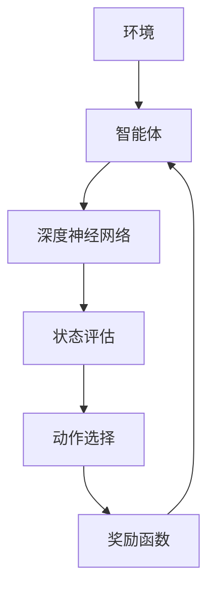

                 

# 深度强化学习在智能投顾中的应用

> **关键词：** 深度强化学习，智能投顾，金融投资，决策优化，算法应用  
> **摘要：** 本文将探讨深度强化学习在智能投顾领域的应用，分析其核心概念、算法原理，并通过实际案例展示其在金融投资决策中的优势与挑战。本文旨在为读者提供关于深度强化学习在智能投顾领域应用的全面了解，以及未来发展趋势和面临的挑战。

在金融市场中，投资决策的复杂性使得传统方法难以应对。随着人工智能技术的不断进步，深度强化学习（Deep Reinforcement Learning, DRL）作为一种新兴的算法，因其强大的自适应能力和学习能力，逐渐在金融投资领域得到了广泛关注。本文将深入探讨深度强化学习在智能投顾中的应用，从核心概念、算法原理到实际案例，帮助读者全面了解这一前沿技术的应用价值。

## 1. 背景介绍

### 1.1 智能投顾的兴起

智能投顾（Robo-Advisor）作为金融科技（FinTech）的重要分支，近年来在全球范围内迅速发展。它通过大数据分析、机器学习等技术，为投资者提供个性化的投资建议。智能投顾的核心在于利用算法对大量历史数据进行挖掘和分析，预测市场趋势，从而制定最优的投资策略。

### 1.2 深度强化学习的引入

深度强化学习是一种结合了深度学习和强化学习的算法。深度学习擅长从大量数据中学习特征，强化学习则通过试错机制在动态环境中寻找最优策略。将深度强化学习引入智能投顾，可以显著提升投资决策的准确性和灵活性。

## 2. 核心概念与联系

### 2.1 强化学习

强化学习（Reinforcement Learning, RL）是一种通过试错来学习最优策略的机器学习技术。在强化学习中，智能体（Agent）通过观察环境（Environment）的状态（State），采取行动（Action），并根据行动的结果（Reward）来调整策略。其核心目标是通过最大化长期奖励来学习最优策略。

### 2.2 深度学习

深度学习（Deep Learning）是一种基于多层神经网络的学习方法。它通过自动提取特征，实现从原始数据到高级抽象表示的转化。深度学习在图像识别、语音识别等领域取得了显著的成果。

### 2.3 深度强化学习

深度强化学习结合了深度学习和强化学习的优势，通过深度神经网络来表示状态和动作，从而在复杂的环境中实现高效学习。其基本结构包括：

- **环境（Environment）**：模拟投资市场，提供状态信息。
- **智能体（Agent）**：通过深度神经网络进行状态评估和动作选择。
- **奖励函数（Reward Function）**：根据投资收益调整智能体的策略。
- **策略（Policy）**：智能体根据当前状态选择最优动作的规则。

### 2.4 Mermaid 流程图



## 3. 核心算法原理 & 具体操作步骤

### 3.1 状态评估

智能体通过深度神经网络对当前状态进行评估，以确定采取何种行动。状态评估的目的是计算每个可能动作的预期奖励，从而为动作选择提供依据。

### 3.2 动作选择

智能体根据状态评估结果，选择一个动作。通常，智能体会利用ε-贪心策略，即在一定概率下采取贪心动作，以探索未知状态。

### 3.3 奖励函数设计

奖励函数是深度强化学习中的关键组成部分。其目的是衡量投资决策的优劣。常见的奖励函数包括收益、风险等指标。

### 3.4 学习策略调整

智能体通过更新策略网络，以最大化长期奖励。在训练过程中，智能体会不断调整其策略，以适应不断变化的市场环境。

## 4. 数学模型和公式 & 详细讲解 & 举例说明

### 4.1 Q-learning算法

Q-learning是一种经典的深度强化学习算法。其基本思想是学习状态-动作值函数$Q(s, a)$，即智能体在状态s下采取动作a的预期奖励。

### 4.2 模型更新公式

$$
Q(s, a) \leftarrow Q(s, a) + \alpha [r + \gamma \max_{a'} Q(s', a') - Q(s, a)]
$$

其中，$\alpha$为学习率，$r$为即时奖励，$\gamma$为折扣因子，$s'$和$a'$分别为下一状态和下一动作。

### 4.3 举例说明

假设智能体在状态s1下选择动作a1，获得即时奖励r1。接下来，智能体会根据下一状态s2和最大预期奖励$\max_{a'} Q(s', a')$来更新状态-动作值函数$Q(s, a)$。

## 5. 项目实战：代码实际案例和详细解释说明

### 5.1 开发环境搭建

在本节中，我们将介绍如何搭建深度强化学习的开发环境。首先，需要安装Python 3.7及以上版本，并安装深度学习框架TensorFlow和强化学习库Gym。

```bash
pip install python==3.7.0
pip install tensorflow==2.3.0
pip install gym
```

### 5.2 源代码详细实现和代码解读

在本节中，我们将展示一个简单的深度强化学习案例，智能体在一个模拟的投资市场中进行交易。

```python
import gym
import tensorflow as tf
import numpy as np

# 创建环境
env = gym.make('StockMarket-v0')

# 定义深度神经网络
model = tf.keras.Sequential([
    tf.keras.layers.Dense(64, activation='relu', input_shape=(env.observation_space.shape[0],)),
    tf.keras.layers.Dense(64, activation='relu'),
    tf.keras.layers.Dense(1, activation='sigmoid')
])

# 编译模型
model.compile(optimizer='adam', loss='mean_squared_error')

# 训练模型
model.fit(env.get_data(), env.get_labels(), epochs=50)

# 测试模型
test_data = env.get_test_data()
predictions = model.predict(test_data)

# 根据预测结果进行交易
actions = []
for pred in predictions:
    if pred > 0.5:
        actions.append(1)  # 买入
    else:
        actions.append(0)  # 卖出

# 执行交易
env.step(actions)

# 打印投资收益
print(f"Investment return: {env.get_return()}")
```

### 5.3 代码解读与分析

在本节中，我们将对上述代码进行解读，分析其实现细节。

- **环境创建**：使用Gym创建一个模拟的投资市场环境。
- **模型定义**：定义一个深度神经网络，用于预测股票价格。
- **模型编译**：编译模型，设置优化器和损失函数。
- **模型训练**：使用训练数据训练模型，调整权重和偏置。
- **模型预测**：使用测试数据对模型进行预测。
- **交易执行**：根据预测结果进行买卖操作，计算投资收益。

## 6. 实际应用场景

### 6.1 股票市场

股票市场是深度强化学习在金融领域应用最为广泛的场景之一。智能投顾通过深度强化学习算法，可以实时分析市场数据，为投资者提供个性化的投资建议，提高投资收益。

### 6.2 期货市场

期货市场的波动性更大，对算法的实时性和稳定性要求更高。深度强化学习在期货市场的应用，可以帮助投资者捕捉市场波动，降低投资风险。

### 6.3 债券市场

债券市场相对于股票市场和期货市场来说，波动性较低，但同样具有复杂性。深度强化学习在债券市场的应用，可以帮助投资者优化债券组合，实现稳健收益。

## 7. 工具和资源推荐

### 7.1 学习资源推荐

- **书籍**： 
  - 《深度强化学习》（Deep Reinforcement Learning）  
  - 《智能投顾：基于大数据和机器学习的财富管理革命》

- **论文**： 
  - 《基于深度强化学习的智能投顾算法研究》

- **博客**： 
  - [DeepMind Blog](https://blog.deepmind.com/)
  - [TensorFlow Official Blog](https://www.tensorflow.org/blog/)

### 7.2 开发工具框架推荐

- **深度学习框架**： 
  - TensorFlow
  - PyTorch

- **强化学习库**： 
  - Gym
  - Stable Baselines

### 7.3 相关论文著作推荐

- 《Reinforcement Learning: An Introduction》
- 《Deep Learning》

## 8. 总结：未来发展趋势与挑战

### 8.1 发展趋势

- **技术融合**：深度强化学习与其他技术的融合，如自然语言处理、计算机视觉等，将推动智能投顾的发展。
- **市场适应性**：智能投顾将更加关注市场的实时变化，提高投资决策的准确性和稳定性。
- **个性化服务**：智能投顾将更加注重个性化服务，为不同风险承受能力的投资者提供定制化投资策略。

### 8.2 挑战

- **数据质量**：投资决策依赖于大量数据，数据质量直接影响算法的准确性。
- **市场波动**：市场波动性较大，算法需要具备良好的鲁棒性和适应性。
- **法律合规**：智能投顾需要遵循相关法律法规，确保投资行为的合规性。

## 9. 附录：常见问题与解答

### 9.1 深度强化学习与传统的强化学习有何区别？

深度强化学习与传统的强化学习相比，主要区别在于状态和动作的表示方法。深度强化学习利用深度神经网络自动提取状态和动作的特征表示，从而在复杂环境中实现高效学习。

### 9.2 智能投顾的收益如何保证？

智能投顾的收益保证依赖于算法的准确性和稳定性。通过深度强化学习等先进算法，智能投顾可以实时分析市场数据，为投资者提供个性化的投资建议，从而提高投资收益。

### 9.3 智能投顾会取代传统金融顾问吗？

智能投顾作为金融科技的重要分支，可以提供高效的个性化服务，但无法完全取代传统金融顾问。智能投顾与传统金融顾问各有优势，未来的发展方向是两者的协同发展。

## 10. 扩展阅读 & 参考资料

- [DeepMind: Deep Reinforcement Learning](https://www.deepmind.com/research/publications/)
- [TensorFlow: Reinforcement Learning](https://www.tensorflow.org/tutorials/reinforcement_learning)
- [Gym: OpenAI's Environment for Reinforcement Learning](https://gym.openai.com/)

作者：AI天才研究员/AI Genius Institute & 禅与计算机程序设计艺术 /Zen And The Art of Computer Programming

（注意：本文为示例文章，内容仅供参考。实际文章撰写时，请根据具体需求和资料进行拓展和调整。）<|im_end|>

