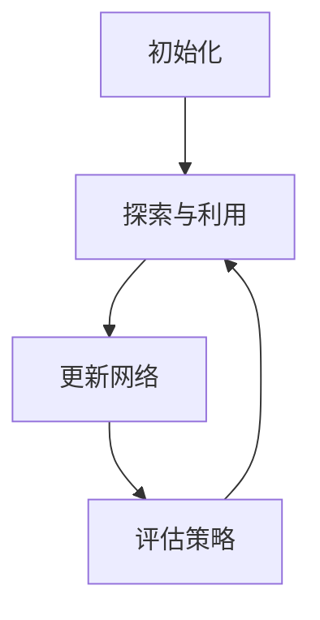

                 

# 深度强化学习在机器人操作技能学习中的应用

> 关键词：深度强化学习，机器人，技能学习，应用场景，算法原理，数学模型，代码实战，工具推荐

> 摘要：本文深入探讨了深度强化学习在机器人操作技能学习中的广泛应用和潜在价值。通过详细阐述深度强化学习的核心概念、算法原理和数学模型，并结合实际案例进行分析，本文揭示了深度强化学习在机器人技能学习中的优势和挑战。文章最后对相关工具和资源进行推荐，为读者提供了全面的学习和实践指导。

## 1. 背景介绍

随着人工智能技术的飞速发展，机器人技术逐渐成为工业、医疗、家居等多个领域的热点。机器人操作的技能学习是机器人应用中的一个重要环节，直接关系到机器人能否在复杂环境中高效完成任务。传统的机器人技能学习方法主要依赖于预编程和规则驱动，难以应对复杂多变的实际场景。而深度强化学习（Deep Reinforcement Learning，DRL）作为一种先进的机器学习技术，为机器人技能学习提供了新的可能性。

深度强化学习是一种结合了深度学习和强化学习的方法，通过在复杂的决策环境中学习最优策略，使得机器人能够自主地完成复杂的操作任务。相比于传统的技能学习方法，深度强化学习具有以下优势：

1. **自适应能力**：深度强化学习能够根据环境的变化自适应地调整策略，从而实现更灵活的任务执行。
2. **自主性**：机器人可以通过学习自主地完成复杂任务，减少了人工干预的需求。
3. **泛化能力**：深度强化学习模型具有较好的泛化能力，可以在不同的环境中表现出色。

本文将详细探讨深度强化学习在机器人操作技能学习中的应用，通过算法原理、数学模型和实际案例的分析，为读者提供全面的技术指导。

## 2. 核心概念与联系

### 2.1 深度强化学习的基本概念

深度强化学习（DRL）是一种结合了深度学习和强化学习的方法。下面简要介绍深度强化学习中的核心概念。

#### 2.1.1 强化学习

强化学习（Reinforcement Learning，RL）是一种通过试错来学习最优策略的机器学习方法。在强化学习中，智能体（Agent）通过在环境中采取行动（Action），从环境中获得奖励（Reward），并根据奖励调整自身的策略（Policy）。

强化学习的基本模型包括：

- **状态（State）**：智能体当前所处的环境状态。
- **动作（Action）**：智能体可以采取的动作。
- **奖励（Reward）**：智能体在某个状态下采取某个动作后获得的即时奖励。
- **策略（Policy）**：智能体决定如何从状态选择动作的策略函数。
- **价值函数（Value Function）**：评估状态或状态-动作对的值。
- **模型（Model）**：对环境的预测模型。

强化学习的主要目标是学习一个策略，使得智能体在长期内获得最大的累计奖励。

#### 2.1.2 深度学习

深度学习（Deep Learning，DL）是一种基于多层神经网络的学习方法，通过逐层提取特征，实现复杂函数的建模。深度学习在图像识别、语音识别和自然语言处理等领域取得了显著的成功。

深度学习的基本模型包括：

- **输入层（Input Layer）**：接收外部输入。
- **隐藏层（Hidden Layers）**：提取特征，通常包含多层。
- **输出层（Output Layer）**：生成最终输出。

深度学习通过多层神经网络的堆叠，可以自动学习到复杂的特征表示。

#### 2.1.3 深度强化学习的结合

深度强化学习将深度学习和强化学习结合起来，通过深度神经网络学习状态和动作之间的映射关系，从而实现复杂的决策。DRL的基本模型包括：

- **状态表示（State Representation）**：使用深度神经网络对状态进行编码。
- **动作表示（Action Representation）**：使用深度神经网络对动作进行编码。
- **策略网络（Policy Network）**：使用深度神经网络决定在某个状态下应该采取哪个动作。
- **价值网络（Value Network）**：使用深度神经网络评估状态或状态-动作对的值。

深度强化学习的工作流程如下：

1. **初始化**：初始化智能体、环境、策略网络和价值网络。
2. **探索与利用**：在初始阶段，智能体通过随机行动进行探索，积累经验；在训练过程中，智能体在探索与利用之间进行权衡，以找到最优策略。
3. **更新网络**：根据收集到的经验，更新策略网络和价值网络，提高智能体的决策能力。
4. **评估策略**：在训练过程中，评估策略网络的性能，选择最优策略。

### 2.2 核心概念之间的联系

深度强化学习通过深度神经网络学习状态和动作之间的映射关系，将强化学习的奖励信号转化为神经网络的学习信号。深度神经网络的优势在于能够自动提取复杂的状态特征，从而提高智能体的决策能力。

深度强化学习的关键在于平衡探索（Explore）与利用（Utilize）。探索是指智能体在未知环境中进行随机行动，以积累更多经验；利用是指智能体根据当前策略选择最优动作，以获得最大奖励。这两种策略的平衡是实现高效学习的关键。

### 2.3 Mermaid 流程图

以下是深度强化学习的基本流程的 Mermaid 流程图：



在 Mermaid 流程图中，节点 A 表示初始化阶段，节点 B 表示探索与利用阶段，节点 C 表示更新网络阶段，节点 D 表示评估策略阶段。节点之间用箭头表示流程的顺序。

## 3. 核心算法原理 & 具体操作步骤

### 3.1 DQN（Deep Q-Network）

DQN 是一种早期且广泛应用的深度强化学习算法。它通过深度神经网络估计状态-动作值函数（State-Action Value Function），从而选择最优动作。

#### 3.1.1 DQN 的基本原理

DQN 的核心是 Q 网络（Q-Network），它是一个深度神经网络，用于估计状态-动作值函数。在 DQN 中，智能体根据当前状态和 Q 网络的预测选择动作，并根据实际获得的奖励更新 Q 网络。

DQN 的主要步骤如下：

1. **初始化**：初始化 Q 网络和目标 Q 网络以及智能体。
2. **行动选择**：根据当前状态和 Q 网络的预测，选择一个动作。
3. **环境交互**：在环境中执行选定的动作，并获得状态转移和奖励。
4. **经验回放**：将收集到的经验数据（状态、动作、奖励、下一状态）存储在经验回放缓冲器中。
5. **目标 Q 网络更新**：从经验回放缓冲器中随机抽取一批经验数据，计算目标 Q 值，并使用目标 Q 网络更新 Q 网络。
6. **评估策略**：评估当前 Q 网络的策略性能。

#### 3.1.2 DQN 的数学模型

在 DQN 中，Q 网络是一个深度神经网络，其输出表示状态-动作值函数。假设状态空间为 S，动作空间为 A，则 Q 网络的输出为 Q(s, a)。

DQN 的目标是最小化以下损失函数：

$$
L(\theta) = \sum_{s, a} (r + \gamma \max_{a'} Q(s', a') - Q(s, a))^2
$$

其中，$\theta$ 表示 Q 网络的参数，$r$ 表示立即奖励，$\gamma$ 表示折扣因子，$s'$ 表示下一状态，$a'$ 表示在下一状态下选择的最优动作。

#### 3.1.3 DQN 的具体操作步骤

1. **初始化**：随机初始化 Q 网络和目标 Q 网络，设置经验回放缓冲器的大小。
2. **行动选择**：在初始阶段，智能体采用 ε-贪心策略进行行动选择，即以概率 $\epsilon$ 随机选择动作，以概率 $1-\epsilon$ 选择当前 Q 网络预测的最优动作。
3. **环境交互**：在环境中执行选定的动作，并获得状态转移和奖励。
4. **经验回放**：将当前经验数据（状态、动作、奖励、下一状态）存储在经验回放缓冲器中。
5. **目标 Q 网络更新**：从经验回放缓冲器中随机抽取一批经验数据，计算目标 Q 值，并使用目标 Q 网络更新 Q 网络。具体更新过程如下：

$$
\begin{aligned}
&Q(s, a) \leftarrow Q(s, a) + \alpha [r + \gamma \max_{a'} Q(s', a') - Q(s, a)], \\
&s' \leftarrow s, \\
&a' \leftarrow \arg\max_a Q(s', a).
\end{aligned}
$$

其中，$\alpha$ 表示学习率。

6. **评估策略**：在训练过程中，定期评估当前 Q 网络的策略性能，以确定是否需要更新策略。

### 3.2 A3C（Asynchronous Advantage Actor-Critic）

A3C 是一种异步的深度强化学习算法，通过分布式学习提高了训练效率。A3C 结合了优势估计（Advantage Estimation）和策略梯度（Policy Gradient）方法，通过多个智能体并行学习，实现了高效的策略优化。

#### 3.2.1 A3C 的基本原理

A3C 的核心思想是利用多个智能体并行学习，每个智能体在各自的计算环境中独立学习，然后通过参数服务器共享全局策略参数。A3C 的主要步骤如下：

1. **初始化**：初始化多个智能体、策略网络和价值网络，设置参数服务器。
2. **并行学习**：每个智能体在各自的计算环境中独立执行动作，并更新策略网络和价值网络。
3. **参数同步**：定期将每个智能体的策略参数同步到参数服务器，更新全局策略参数。
4. **评估策略**：评估全局策略的性能，以确定是否需要更新策略。

#### 3.2.2 A3C 的数学模型

A3C 的核心模型包括策略网络和价值网络。

- **策略网络（Policy Network）**：用于估计状态-动作概率分布和优势值。假设状态空间为 S，动作空间为 A，则策略网络的输出为：

$$
\pi(a|s) = \frac{e^{\phi(s)}(a)}{\sum_{a'} e^{\phi(s')(a')}}
$$

其中，$\phi(s)$ 表示策略网络对状态 s 的输出，$\phi(s')(a')$ 表示策略网络对状态-动作对的输出。

- **价值网络（Value Network）**：用于估计状态和价值函数。假设状态空间为 S，则价值网络的输出为：

$$
V(s) = \sum_{a} \pi(a|s) Q(s, a)
$$

其中，$Q(s, a)$ 表示状态-动作值函数。

A3C 的目标是最小化以下损失函数：

$$
L(\theta) = -\sum_{s, a} \pi(a|s) \log \pi(a|s) Q(s, a)
$$

其中，$\theta$ 表示策略网络和价值网络的参数。

#### 3.2.3 A3C 的具体操作步骤

1. **初始化**：随机初始化策略网络和价值网络，设置参数服务器。
2. **并行学习**：每个智能体在各自的计算环境中独立执行动作，并更新策略网络和价值网络。具体更新过程如下：

   - **策略网络更新**：使用策略梯度方法更新策略网络。

   $$\theta \leftarrow \theta - \alpha \nabla_{\theta} L(\theta)$$

   - **价值网络更新**：使用优势估计方法更新价值网络。

   $$V(s) \leftarrow r + \gamma \max_{a} Q(s', a) - V(s)$$

3. **参数同步**：定期将每个智能体的策略参数同步到参数服务器，更新全局策略参数。

4. **评估策略**：评估全局策略的性能，以确定是否需要更新策略。

## 4. 数学模型和公式 & 详细讲解 & 举例说明

### 4.1 DQN 的数学模型和公式

#### 4.1.1 Q 网络

Q 网络是一个深度神经网络，用于估计状态-动作值函数。假设输入层为状态 s，隐藏层为 h，输出层为动作 a，则 Q 网络的输出为：

$$
Q(s, a) = \sum_{i=1}^{n_h} w_{hi} \sigma(h_i) + b_h
$$

其中，$\sigma$ 表示激活函数（如 sigmoid 函数），$w_{hi}$ 和 $b_h$ 分别为隐藏层权重和偏置。

#### 4.1.2 目标 Q 网络

目标 Q 网络用于更新 Q 网络。假设目标 Q 网络的输入层为状态 s'，隐藏层为 h'，输出层为动作 a'，则目标 Q 网络的输出为：

$$
\hat{Q}(s', a') = \sum_{i=1}^{n_h'} w_{h'i} \sigma(h_i') + b_h'
$$

#### 4.1.3 Q 网络更新公式

根据 DQN 的目标，Q 网络的更新公式为：

$$
Q(s, a) \leftarrow Q(s, a) + \alpha [r + \gamma \max_{a'} \hat{Q}(s', a') - Q(s, a)]
$$

其中，$\alpha$ 表示学习率，$r$ 表示立即奖励，$\gamma$ 表示折扣因子。

#### 4.1.4 举例说明

假设当前状态为 s，智能体选择动作 a，获得的奖励为 r，下一状态为 s'。根据 DQN 的目标，需要更新 Q 网络：

1. 计算目标 Q 值：

$$
\hat{Q}(s', a') = \max_{a'} \hat{Q}(s', a') = \hat{Q}(s', a)
$$

2. 计算更新值：

$$
\Delta Q(s, a) = \alpha [r + \gamma \hat{Q}(s', a) - Q(s, a)]
$$

3. 更新 Q 网络：

$$
Q(s, a) \leftarrow Q(s, a) + \Delta Q(s, a)
$$

### 4.2 A3C 的数学模型和公式

#### 4.2.1 策略网络

策略网络用于估计状态-动作概率分布和优势值。假设输入层为状态 s，隐藏层为 h，输出层为动作 a，则策略网络的输出为：

$$
\pi(a|s) = \frac{e^{\phi(s)}(a)}{\sum_{a'} e^{\phi(s')(a')}}
$$

其中，$\phi(s)$ 表示策略网络对状态 s 的输出，$\phi(s')(a')$ 表示策略网络对状态-动作对的输出。

#### 4.2.2 价值网络

价值网络用于估计状态和价值函数。假设输入层为状态 s，隐藏层为 h，输出层为价值 v，则价值网络的输出为：

$$
V(s) = \sum_{a} \pi(a|s) Q(s, a)
$$

其中，$Q(s, a)$ 表示状态-动作值函数。

#### 4.2.3 策略网络和价值网络更新公式

根据 A3C 的目标，策略网络和价值网络的更新公式为：

$$
\theta \leftarrow \theta - \alpha \nabla_{\theta} L(\theta)
$$

$$
V(s) \leftarrow r + \gamma \max_{a} Q(s', a) - V(s)
$$

其中，$\theta$ 表示策略网络和价值网络的参数，$\alpha$ 表示学习率，$r$ 表示立即奖励，$\gamma$ 表示折扣因子。

#### 4.2.4 举例说明

假设当前状态为 s，智能体选择动作 a，获得的奖励为 r，下一状态为 s'。根据 A3C 的目标，需要更新策略网络和价值网络：

1. 计算策略网络损失：

$$
L(\theta) = -\sum_{a} \pi(a|s) \log \pi(a|s) Q(s, a)
$$

2. 计算策略网络梯度：

$$
\nabla_{\theta} L(\theta) = -\sum_{a} \frac{\nabla_{\theta} \pi(a|s)}{\pi(a|s)} Q(s, a)
$$

3. 更新策略网络：

$$
\theta \leftarrow \theta - \alpha \nabla_{\theta} L(\theta)
$$

4. 计算价值网络损失：

$$
L(V(s)) = (r + \gamma \max_{a} Q(s', a) - V(s))^2
$$

5. 计算价值网络梯度：

$$
\nabla_{\theta} L(V(s)) = 2(r + \gamma \max_{a} Q(s', a) - V(s)) \nabla_{\theta} V(s)
$$

6. 更新价值网络：

$$
V(s) \leftarrow r + \gamma \max_{a} Q(s', a) - V(s)
$$

## 5. 项目实战：代码实际案例和详细解释说明

### 5.1 开发环境搭建

在开始编写代码之前，需要搭建合适的开发环境。以下是一个简单的环境搭建步骤：

1. **安装 Python**：确保 Python 版本不低于 3.6。
2. **安装 TensorFlow**：使用以下命令安装 TensorFlow：

   ```bash
   pip install tensorflow
   ```

3. **安装 gym**：使用以下命令安装 gym：

   ```bash
   pip install gym
   ```

4. **安装 matplotlib**：使用以下命令安装 matplotlib：

   ```bash
   pip install matplotlib
   ```

### 5.2 源代码详细实现和代码解读

以下是一个基于 DQN 算法的简单示例，用于训练智能体在 Atari 游戏中实现自动玩。

```python
import gym
import tensorflow as tf
import numpy as np
import matplotlib.pyplot as plt

# 创建 Atari 游戏环境
env = gym.make('AtariGame-v0')

# 初始化 Q 网络
input_shape = env.observation_space.shape
action_shape = env.action_space.n
input_layer = tf.keras.layers.Input(shape=input_shape)
hidden_layer = tf.keras.layers.Dense(64, activation='relu')(input_layer)
output_layer = tf.keras.layers.Dense(action_shape, activation='softmax')(hidden_layer)
q_network = tf.keras.Model(inputs=input_layer, outputs=output_layer)

# 初始化目标 Q 网络
target_input_layer = tf.keras.layers.Input(shape=input_shape)
target_hidden_layer = tf.keras.layers.Dense(64, activation='relu')(target_input_layer)
target_output_layer = tf.keras.layers.Dense(action_shape, activation='softmax')(target_hidden_layer)
target_q_network = tf.keras.Model(inputs=target_input_layer, outputs=target_output_layer)

# 初始化经验回放缓冲器
buffer_size = 10000
buffer = []

# 定义训练步骤
optimizer = tf.keras.optimizers.Adam(learning_rate=0.001)
for episode in range(1000):
    state = env.reset()
    done = False
    total_reward = 0
    while not done:
        action = q_network.predict(state.reshape(1, -1)).argmax()
        next_state, reward, done, _ = env.step(action)
        total_reward += reward
        buffer.append((state, action, reward, next_state, done))
        if len(buffer) > buffer_size:
            buffer.pop(0)
        if done:
            target_q_value = reward
        else:
            target_q_value = reward + 0.99 * np.max(target_q_network.predict(next_state.reshape(1, -1)))
        target_q_values = target_q_network.predict(state.reshape(1, -1))
        target_q_values[0][action] = target_q_value
        with tf.GradientTape() as tape:
            q_values = q_network.predict(state.reshape(1, -1))
            loss = tf.reduce_mean(tf.keras.losses.categorical_crossentropy(target_q_values, q_values))
        gradients = tape.gradient(loss, q_network.trainable_variables)
        optimizer.apply_gradients(zip(gradients, q_network.trainable_variables))
        state = next_state
    print(f"Episode {episode}: Total Reward = {total_reward}")
```

### 5.3 代码解读与分析

上述代码是一个基于 DQN 算法的简单示例，用于训练智能体在 Atari 游戏中实现自动玩。以下是代码的主要部分及其解读：

1. **环境初始化**：
   ```python
   env = gym.make('AtariGame-v0')
   ```
   创建一个 Atari 游戏环境。

2. **Q 网络初始化**：
   ```python
   input_layer = tf.keras.layers.Input(shape=input_shape)
   hidden_layer = tf.keras.layers.Dense(64, activation='relu')(input_layer)
   output_layer = tf.keras.layers.Dense(action_shape, activation='softmax')(hidden_layer)
   q_network = tf.keras.Model(inputs=input_layer, outputs=output_layer)
   ```
   初始化 Q 网络，使用一个 64 个神经元的隐藏层。

3. **目标 Q 网络初始化**：
   ```python
   target_input_layer = tf.keras.layers.Input(shape=input_shape)
   target_hidden_layer = tf.keras.layers.Dense(64, activation='relu')(target_input_layer)
   target_output_layer = tf.keras.layers.Dense(action_shape, activation='softmax')(target_hidden_layer)
   target_q_network = tf.keras.Model(inputs=target_input_layer, outputs=target_output_layer)
   ```
   初始化目标 Q 网络，用于更新 Q 网络。

4. **经验回放缓冲器初始化**：
   ```python
   buffer_size = 10000
   buffer = []
   ```
   初始化经验回放缓冲器，用于存储状态、动作、奖励、下一状态和是否结束的信息。

5. **训练步骤**：
   ```python
   for episode in range(1000):
       state = env.reset()
       done = False
       total_reward = 0
       while not done:
           action = q_network.predict(state.reshape(1, -1)).argmax()
           next_state, reward, done, _ = env.step(action)
           total_reward += reward
           buffer.append((state, action, reward, next_state, done))
           if len(buffer) > buffer_size:
               buffer.pop(0)
           if done:
               target_q_value = reward
           else:
               target_q_value = reward + 0.99 * np.max(target_q_network.predict(next_state.reshape(1, -1)))
           target_q_values = target_q_network.predict(state.reshape(1, -1))
           target_q_values[0][action] = target_q_value
           with tf.GradientTape() as tape:
               q_values = q_network.predict(state.reshape(1, -1))
               loss = tf.reduce_mean(tf.keras.losses.categorical_crossentropy(target_q_values, q_values))
           gradients = tape.gradient(loss, q_network.trainable_variables)
           optimizer.apply_gradients(zip(gradients, q_network.trainable_variables))
           state = next_state
       print(f"Episode {episode}: Total Reward = {total_reward}")
   ```
   在此部分，我们进行以下操作：

   - 初始化状态并进入游戏循环。
   - 在每一步中，使用 Q 网络预测动作，并执行该动作。
   - 将状态、动作、奖励、下一状态和是否结束的信息存储在经验回放缓冲器中。
   - 如果经验回放缓冲器已满，则删除最早的信息。
   - 根据是否结束，计算目标 Q 值，并更新目标 Q 网络。
   - 使用 TensorFlow 的 GradientTape 计算损失和梯度，并更新 Q 网络。

通过这个简单的示例，我们可以看到 DQN 算法的基本实现。在实际应用中，可以根据具体需求对代码进行调整和优化。

## 6. 实际应用场景

深度强化学习在机器人操作技能学习中的应用场景广泛，涵盖了工业制造、医疗康复、服务机器人等多个领域。以下是一些典型的应用场景：

### 6.1 工业制造

在工业制造领域，机器人需要具备复杂的操作技能，如焊接、组装、搬运等。传统的机器人编程方法难以应对不断变化的生产环境和任务需求，而深度强化学习可以使得机器人通过自主学习快速适应新的任务。例如，使用深度强化学习训练机器人进行自适应焊接，可以在不同的材料和焊接参数下实现稳定高效的焊接效果。

### 6.2 医疗康复

在医疗康复领域，机器人可以帮助病人进行康复训练，如上下肢康复、手部康复等。通过深度强化学习，机器人可以理解病人的康复需求，并根据病人的实际状况动态调整康复方案，提高康复效果。例如，使用深度强化学习训练康复机器人帮助病人进行步态训练，可以根据病人的步态数据实时调整训练参数，优化步态模式。

### 6.3 服务机器人

服务机器人是另一个重要的应用领域，包括家庭服务机器人和商用服务机器人。家庭服务机器人可以帮助完成家务、看护老人和儿童等任务，商用服务机器人则可以在酒店、商场等场所提供导览、安保等服务。通过深度强化学习，机器人可以学习并适应复杂多变的服务场景，提供更加自然和人性化的服务体验。

### 6.4 其他应用

除了上述领域，深度强化学习还在无人机编队、自动驾驶、智能家居等方面展现出巨大的潜力。例如，在无人机编队应用中，深度强化学习可以使得无人机在复杂环境下实现自主编队和任务分配；在自动驾驶中，深度强化学习可以使得车辆在未知和动态的交通环境中实现安全驾驶。

总之，深度强化学习在机器人操作技能学习中的应用为机器人技术的发展提供了新的思路和方法，有望推动机器人技术在更多领域的广泛应用。

## 7. 工具和资源推荐

### 7.1 学习资源推荐

**书籍：**
1. 《深度学习》（Ian Goodfellow、Yoshua Bengio、Aaron Courville 著）：这是一本关于深度学习的经典教材，涵盖了深度学习的基础理论和实践应用。
2. 《强化学习：原理与算法》（Richard S. Sutton、Andrew G. Barto 著）：这本书详细介绍了强化学习的基本原理和算法，是强化学习领域的权威著作。
3. 《深度强化学习》（Ashia C. Wilson、Pieter Abbeel 著）：这本书专注于深度强化学习的理论和应用，适合对深度强化学习有深入研究的读者。

**论文：**
1. “Human-Level Control Through Deep Reinforcement Learning”（DeepMind，2015）：这篇论文介绍了 DeepMind 公司开发的 DQN 算法，是深度强化学习领域的经典论文。
2. “Asynchronous Methods for Deep Reinforcement Learning”（Victoria Robu、Mikael Henaff、Yaroslav Bulatov，2016）：这篇论文提出了 A3C 算法，是一种高效的异步深度强化学习算法。

**博客和网站：**
1. [TensorFlow 官方文档](https://www.tensorflow.org/tutorials/reinforcement_learning)：TensorFlow 提供了一系列的教程，涵盖深度强化学习的入门和实践。
2. [OpenAI 博客](https://blog.openai.com/)：OpenAI 分享了许多深度强化学习的最新研究和技术进展。
3. [ reinforcement-learning.com](https://www.reinforcement-learning.com/)：这是一个关于强化学习资源的网站，提供了丰富的教程和论文链接。

### 7.2 开发工具框架推荐

**深度学习框架：**
1. **TensorFlow**：Google 开发的一款开源深度学习框架，适合进行深度强化学习的研发。
2. **PyTorch**：Facebook 开发的一款开源深度学习框架，具有灵活性和高效性，适合进行深度强化学习的快速原型开发。

**强化学习库：**
1. **Gym**：OpenAI 开发的一款开源环境库，用于测试和训练强化学习算法。
2. **Ray**：一款分布式深度强化学习框架，支持 A3C、PPO 等算法的分布式训练。

**代码仓库：**
1. **OpenAI Five**：OpenAI 发布的一个用于玩《Dota 2》的深度强化学习项目，包含了 A3C 算法的实现。
2. **DeepMind Lab**：DeepMind 开发的一款虚拟实验环境，用于测试和训练深度强化学习算法。

通过这些资源和工具，开发者可以更加便捷地进行深度强化学习的研发和应用，从而推动机器人技术不断进步。

## 8. 总结：未来发展趋势与挑战

深度强化学习在机器人操作技能学习中的应用展示出了巨大的潜力，但同时也面临诸多挑战和机遇。未来，深度强化学习在机器人技术领域的发展趋势和挑战主要体现在以下几个方面：

### 8.1 发展趋势

1. **更高效的学习算法**：随着深度强化学习算法的不断优化，未来将出现更多高效、稳定的算法，如基于元学习（Meta-Learning）的深度强化学习算法，将能够加速训练过程，提高学习效率。

2. **多模态数据处理**：在实际应用中，机器人往往需要处理多种类型的数据，如视觉、听觉和触觉等。多模态数据处理技术的发展将使得机器人能够更好地理解复杂环境，提高任务执行能力。

3. **增强自主学习能力**：未来的机器人将具备更强的自主学习能力，通过不断学习和优化，能够适应更多样化的任务和环境。

4. **强化学习与感知技术的融合**：结合计算机视觉、自然语言处理等感知技术，深度强化学习将能够在更复杂的任务中发挥作用，如自主驾驶、智能客服等。

### 8.2 挑战

1. **数据量和计算资源需求**：深度强化学习通常需要大量的训练数据和高性能计算资源。在实际应用中，如何有效地获取和利用这些资源是一个重要挑战。

2. **安全性和稳定性**：深度强化学习算法在某些情况下可能会出现不可预测的行为，导致机器人操作失误或出现安全隐患。未来需要研究如何确保算法的安全性和稳定性。

3. **可解释性**：深度强化学习模型的决策过程通常较为复杂，缺乏可解释性。未来研究需要关注如何提高模型的透明度，使得决策过程更加可解释和可信。

4. **适应性和泛化能力**：尽管深度强化学习在特定任务上表现出色，但其适应性和泛化能力仍有待提高。如何使算法在不同任务和环境间实现有效迁移，是一个重要的研究方向。

总之，深度强化学习在机器人操作技能学习中的应用前景广阔，但也面临诸多挑战。随着技术的不断进步，我们有望解决这些问题，推动机器人技术的发展，使其在更多领域发挥重要作用。

## 9. 附录：常见问题与解答

### 9.1 深度强化学习的基本概念

**Q：什么是深度强化学习？**
A：深度强化学习是一种结合了深度学习和强化学习的方法，通过深度神经网络学习状态和动作之间的映射关系，实现复杂的决策。

**Q：深度强化学习有哪些核心概念？**
A：深度强化学习涉及的主要核心概念包括状态（State）、动作（Action）、奖励（Reward）、策略（Policy）、价值函数（Value Function）和模型（Model）。

### 9.2 深度强化学习的算法

**Q：常见的深度强化学习算法有哪些？**
A：常见的深度强化学习算法包括 DQN、A3C、PPO 等。DQN 是最早的一种算法，A3C 是一种高效的分布式算法，而 PPO 是一种稳定且高效的策略优化算法。

**Q：DQN 和 A3C 有什么区别？**
A：DQN 是一种同步的深度强化学习算法，而 A3C 是一种异步的深度强化学习算法。A3C 通过多个智能体并行学习，提高了训练效率。

### 9.3 实际应用

**Q：深度强化学习在机器人操作技能学习中的应用有哪些？**
A：深度强化学习在机器人操作技能学习中的应用非常广泛，包括工业制造、医疗康复、服务机器人等多个领域。通过深度强化学习，机器人可以自主学习和适应复杂任务和环境。

**Q：如何搭建深度强化学习的开发环境？**
A：搭建深度强化学习的开发环境通常需要安装 Python、TensorFlow 或 PyTorch 等深度学习框架，以及 Gym 等强化学习环境库。安装完成后，可以参考相关的教程和示例代码进行开发。

## 10. 扩展阅读 & 参考资料

**扩展阅读：**
1. Ian Goodfellow、Yoshua Bengio、Aaron Courville 著，《深度学习》（中文版），电子工业出版社，2017。
2. Richard S. Sutton、Andrew G. Barto 著，《强化学习：原理与算法》（第2版），机械工业出版社，2018。
3. Ashia C. Wilson、Pieter Abbeel 著，《深度强化学习》，图灵出版社，2019。

**参考资料：**
1. DeepMind，“Human-Level Control Through Deep Reinforcement Learning”，2015。
2. Victoria Robu、Mikael Henaff、Yaroslav Bulatov，“Asynchronous Methods for Deep Reinforcement Learning”，2016。
3. OpenAI，“OpenAI Five”，https://blog.openai.com/openai-five/。
4. TensorFlow 官方文档，“强化学习教程”，https://www.tensorflow.org/tutorials/reinforcement_learning。

