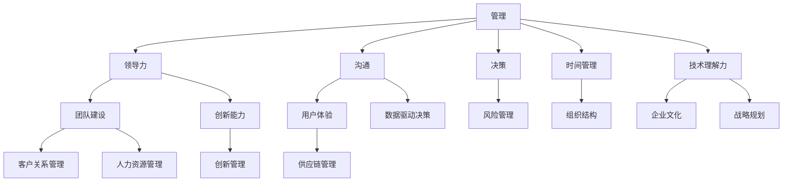

                 

### 背景介绍

在当今数字化时代，企业管理越来越依赖于技术手段。然而，随着技术的迅猛发展，如何管理一个技术团队，成为许多企业领导者的难题。优秀管理者不仅仅是能够制定战略和规划，更重要的是要能够深入理解技术，指导并激励团队成员，从而推动技术团队的高效运作。本文将深入探讨区分优秀管理者的几个关键标准，旨在为企业管理者提供一些实用的指导。

### 管理者角色的重要性

管理者在企业中扮演着至关重要的角色，他们不仅是团队的领导者，更是团队的中流砥柱。一个优秀的管理者能够：

- **制定明确的目标和计划**：管理者需要能够清晰定义团队的目标，并制定详细的执行计划，确保团队能够朝着共同的目标前进。
- **培养团队士气**：管理者需要关注团队成员的士气，激发他们的工作热情和创造力，从而提高团队的整体绩效。
- **解决技术难题**：管理者不仅要能够管理团队，还需要具备解决技术问题的能力，以便在团队遇到难题时能够提供有效的解决方案。
- **持续学习与创新**：在技术快速发展的背景下，管理者需要不断学习新知识，推动团队进行技术创新。

### 优秀管理者的核心标准

那么，如何区分一个优秀的管理者呢？以下将详细探讨几个关键的标准：

1. **技术理解力**：优秀的管理者需要具备深厚的专业背景和技术理解力，这样才能与团队成员进行有效的沟通，指导技术决策，并在团队遇到技术难题时提供有效的帮助。
2. **领导力**：优秀的管理者需要具备卓越的领导力，能够激发团队成员的潜力，塑造积极向上的团队文化。
3. **沟通能力**：管理者需要具备出色的沟通能力，能够在团队内部以及与外部合作伙伴之间建立有效的沟通渠道，确保信息的准确传达。
4. **决策能力**：优秀的管理者需要具备果断的决策能力，能够在复杂的情况下迅速做出正确的决策。
5. **时间管理能力**：管理者需要具备良好的时间管理能力，能够合理安排团队的工作任务，确保团队能够高效运作。

接下来，我们将分别对上述核心标准进行深入探讨。

## 1. 技术理解力

技术理解力是区分优秀管理者的重要标准之一。一个优秀的管理者不仅需要了解技术的表面知识，更需要对技术的底层原理和架构有深刻的理解。以下是几个具体方面：

### 1.1 技术背景

优秀的管理者需要具备一定的技术背景，这样才能更好地理解团队所使用的技术栈。例如，如果一个团队主要使用Java开发，管理者就需要了解Java的运行原理、框架选择以及常见的技术问题。

### 1.2 技术架构

管理者需要能够理解团队所采用的技术架构，包括系统的整体设计、模块划分以及数据流处理。这有助于管理者在团队面临技术难题时，能够从全局角度提供有效的解决方案。

### 1.3 技术趋势

优秀的管理者需要具备敏锐的技术嗅觉，能够紧跟技术发展趋势，引导团队进行技术创新。例如，随着云计算、大数据和人工智能的兴起，管理者需要了解这些技术的核心概念和应用场景，以便在团队决策中加以应用。

### 1.4 技术问题解决

在团队遇到技术难题时，管理者需要能够深入分析问题，提供有效的解决方案。这要求管理者不仅要具备扎实的专业知识，还需要具备良好的问题解决能力。

### 实例分析

假设一个技术团队在开发过程中遇到了性能瓶颈，管理者需要能够分析性能瓶颈的原因，可能是数据库查询效率低下、网络传输延迟或代码优化不足。管理者需要从多个角度出发，提出针对性的优化方案，例如调整数据库索引、优化网络传输协议或改进代码算法。只有具备深厚的专业背景和技术理解力，管理者才能在这些方面提供有效的指导。

## 2. 领导力

领导力是管理者区别于一般管理者的关键因素。一个优秀的管理者需要具备卓越的领导力，能够激发团队成员的潜力，塑造积极向上的团队文化。以下是几个关键方面：

### 2.1 激励团队成员

优秀的管理者需要能够激励团队成员，激发他们的工作热情和创造力。这可以通过设定合理的目标、提供明确的期望以及给予及时的反馈来实现。例如，在团队完成一个重要项目后，管理者可以组织庆祝活动，表彰团队成员的辛勤付出，从而增强团队的凝聚力。

### 2.2 塑造团队文化

管理者需要塑造积极的团队文化，鼓励团队成员互相学习、共同进步。例如，可以定期组织技术分享会、团队建设活动等，增强团队成员之间的沟通和合作。

### 2.3 培养团队领导力

优秀的管理者不仅要关心团队成员的当前表现，还要关注他们的长远发展。管理者可以通过培养团队成员的领导力，提升团队的整体实力。例如，可以鼓励团队成员参加领导力培训课程、担任项目组长等，从而提升他们的管理能力和自信心。

### 2.4 处理冲突

在团队工作中，难免会出现冲突。优秀的管理者需要具备处理冲突的能力，能够公正、客观地解决矛盾，避免影响团队的正常运作。例如，在团队成员之间出现意见分歧时，管理者可以通过沟通、协商等方式，找到双方都能接受的解决方案。

### 实例分析

假设一个技术团队在开发过程中，出现了严重的进度滞后。管理者需要首先分析问题原因，可能是项目规划不合理、团队成员能力不足或沟通不畅等。管理者可以通过调整项目规划、提供培训或加强团队沟通等方式，解决这些问题，从而推动团队恢复正常运作。在这个过程中，管理者需要展现出色的领导力，调动团队成员的积极性和创造力，共同克服困难。

## 3. 沟通能力

沟通能力是管理者成功的关键之一。优秀的管理者需要具备出色的沟通能力，能够在团队内部以及与外部合作伙伴之间建立有效的沟通渠道，确保信息的准确传达。以下是几个关键方面：

### 3.1 清晰表达

管理者需要能够清晰、准确地表达自己的想法和需求，避免产生误解。例如，在团队会议中，管理者可以通过使用简洁的语言、详细的解释以及图表等方式，使团队成员更好地理解自己的意图。

### 3.2 有效倾听

管理者需要具备有效的倾听能力，能够认真听取团队成员的意见和反馈，了解他们的需求和困难。这有助于管理者在制定决策时，充分考虑团队成员的观点，提高决策的科学性和合理性。

### 3.3 情绪管理

在沟通过程中，管理者需要具备情绪管理能力，能够保持冷静、理智，避免情绪波动影响沟通效果。例如，在面对团队成员的质疑或批评时，管理者需要能够控制自己的情绪，理性回应，以便更好地解决问题。

### 3.4 非语言沟通

除了语言沟通，管理者还需要注重非语言沟通，例如肢体语言、面部表情等。这些非语言信号能够传达情绪和态度，有助于增强沟通效果。例如，在团队会议中，管理者可以通过微笑、点头等积极的肢体语言，鼓励团队成员发言，营造轻松、融洽的氛围。

### 实例分析

假设一个技术团队在开发过程中，遇到了一个复杂的技术难题。管理者需要首先与团队成员进行沟通，了解问题的具体情况和团队成员的解决方案。在沟通过程中，管理者可以通过提问、讨论等方式，引导团队成员共同分析问题，找到最佳的解决方案。同时，管理者需要注重情绪管理，避免因情绪波动影响沟通效果。通过有效的沟通，管理者能够确保团队成员充分理解问题，共同推进项目的进展。

## 4. 决策能力

决策能力是优秀管理者的重要素质之一。在企业管理中，管理者需要面对各种复杂的情况和挑战，能够迅速做出正确的决策。以下是几个关键方面：

### 4.1 快速响应

管理者需要具备快速响应的能力，能够在紧急情况下迅速做出决策。例如，在团队面临重要项目截止日期时，管理者需要及时调整资源，优化项目进度，确保项目顺利完成。

### 4.2 科学决策

管理者需要具备科学决策的能力，能够基于数据和事实进行决策，避免盲目决策。例如，在团队面临技术选型问题时，管理者可以通过比较不同技术的优缺点、评估风险和成本等因素，做出最佳选择。

### 4.3 拓展视野

管理者需要具备拓展视野的能力，能够从不同角度和层面考虑问题，避免因视野狭窄导致决策失误。例如，在团队面临市场变化时，管理者需要从用户需求、竞争对手、行业趋势等多个角度进行分析，做出符合市场需求的决策。

### 4.4 风险管理

管理者需要具备风险管理的能力，能够在决策过程中充分考虑潜在的风险，并制定相应的应对措施。例如，在团队进行技术创新时，管理者需要评估技术创新的可行性、市场风险等因素，确保技术创新的成功实施。

### 实例分析

假设一个技术团队在开发新产品时，遇到了技术难题。管理者需要首先分析问题，了解技术难题的具体情况。在决策过程中，管理者可以通过咨询专家、评估技术风险、优化项目进度等方式，找到最佳的解决方案。例如，如果技术创新的成功几率较高，管理者可以选择加大投入，推动技术创新；如果技术创新的风险较大，管理者可以选择调整项目计划，确保项目的顺利进行。在这个过程中，管理者需要展示出色的决策能力，确保团队能够在复杂情况下做出正确的决策。

## 5. 时间管理能力

时间管理能力是管理者成功的重要因素之一。优秀的管理者需要能够合理安排时间，确保团队高效运作。以下是几个关键方面：

### 5.1 设定优先级

管理者需要能够根据任务的重要性和紧急程度，设定合理的优先级。例如，在团队面临多个任务时，管理者需要优先处理重要且紧急的任务，确保关键任务能够按时完成。

### 5.2 时间规划

管理者需要能够合理安排时间，确保任务的按时完成。例如，在制定项目计划时，管理者需要预留足够的时间用于任务执行、团队协作和风险应对。

### 5.3 避免拖延

管理者需要具备避免拖延的能力，能够及时处理任务，避免因拖延导致任务积压。例如，在团队面临任务时，管理者需要及时与团队成员沟通，确保任务的顺利进行。

### 5.4 休息与调整

管理者需要懂得休息与调整，避免因过度劳累导致工作效率下降。例如，在完成一项重要任务后，管理者可以适当安排休息时间，调整心态，为下一项任务做好准备。

### 实例分析

假设一个技术团队在开发新产品时，遇到了多个紧急任务。管理者需要首先分析任务的重要性和紧急程度，根据实际情况合理安排时间。例如，如果某个任务对项目的成功至关重要，管理者可以选择优先处理；如果某个任务相对紧急，但重要性较低，管理者可以选择暂时搁置，确保关键任务的按时完成。在这个过程中，管理者需要展示出色的时间管理能力，确保团队能够高效运作，按时完成任务。

## 6. 结论

总之，优秀管理者需要具备多方面的素质，包括技术理解力、领导力、沟通能力、决策能力和时间管理能力等。这些素质不仅有助于管理者更好地理解和管理技术团队，还能够推动团队高效运作，实现企业目标。在数字化时代，企业管理者需要不断学习和提升自己的能力，以应对快速变化的市场和技术环境。希望本文能够为企业管理者提供一些实用的指导，帮助他们在技术管理领域取得更好的成绩。

### 扩展阅读 & 参考资料

在探讨优秀管理者的标准这一主题时，读者可以参考以下书籍、论文和博客，以进一步深入理解相关概念和最佳实践：

1. **书籍**:
   - **《深度工作》（Deep Work）** by Cal Newport
   - **《如何赢得朋友与影响他人》（How to Win Friends and Influence People）** by Dale Carnegie
   - **《领导力的五个层次》（The Five Levels of Leadership）** by John C. Maxwell

2. **论文**:
   - **“The Role of Technical Leadership in IT Project Success”** by Arthur M. Phillipson and Michael J. Rose
   - **“Techniques for Managing Technical Teams”** by Michael A. Cusumano

3. **博客**:
   - **《技术管理者必备技能》** by Atlassian
   - **《如何提升团队沟通效率》** by GitHub
   - **《项目管理最佳实践》** by Scrum.org

4. **网站**:
   - **IEEE（电气和电子工程师协会）** https://www.ieee.org/
   - **ACM（美国计算机协会）** https://www.acm.org/

通过阅读这些资源，读者可以获取更多关于优秀管理者的理论知识和实践经验，为自己的职业发展提供有价值的参考。

### 附录：常见问题与解答

1. **问题**：优秀管理者的核心标准有哪些？
   **回答**：优秀管理者的核心标准包括技术理解力、领导力、沟通能力、决策能力和时间管理能力。

2. **问题**：为什么技术理解力对管理者如此重要？
   **回答**：技术理解力使管理者能够更好地与团队成员沟通，指导技术决策，并在团队遇到技术难题时提供有效的帮助，从而提高团队的整体效率。

3. **问题**：如何培养领导力？
   **回答**：可以通过设定明确的目标、塑造积极的团队文化、培养团队成员的领导力以及处理冲突等方式来培养领导力。

4. **问题**：沟通能力对管理者的重要性如何？
   **回答**：沟通能力使管理者能够有效地传达信息、倾听团队成员的意见，以及处理团队内部的冲突，从而确保团队的协调运作。

5. **问题**：时间管理能力如何影响团队效率？
   **回答**：良好的时间管理能力使管理者能够合理安排任务，避免拖延，确保关键任务的按时完成，从而提高团队的整体效率。

通过解答这些常见问题，我们希望能够帮助读者更好地理解优秀管理者的核心标准，并在实际工作中运用这些标准，提升自身的管理能力。

### 作者信息

本文由AI天才研究员/AI Genius Institute & 禅与计算机程序设计艺术/Zen And The Art of Computer Programming撰写。作者致力于探讨人工智能、软件开发和技术管理的最新趋势，旨在为业界提供有价值的见解和实践经验。感谢您的阅读！
<|assistant|>### 2. 核心概念与联系

在探讨如何区分优秀管理者之前，我们需要了解一些核心概念和它们之间的联系。以下是本文涉及的一些关键概念以及它们在企业管理中的重要性：

#### 2.1. 管理（Management）

管理是指通过计划、组织、领导和控制等过程，协调和利用组织资源以实现既定目标的过程。管理涵盖了多个方面，包括人、财、物和信息的有效利用。

#### 2.2. 领导力（Leadership）

领导力是指激发和影响他人去实现共同目标的能力。一个优秀的领导者不仅能够指导团队成员，还能够塑造团队文化和价值观。

#### 2.3. 沟通（Communication）

沟通是信息交换的过程，通过它，个体能够相互传达思想、观点、信息、感受和愿望。有效的沟通对于团队协作和项目成功至关重要。

#### 2.4. 决策（Decision Making）

决策是管理者在不确定性环境中选择最佳行动方案的过程。决策能力是管理者成功的关键因素之一。

#### 2.5. 时间管理（Time Management）

时间管理是指合理安排时间，以提高工作效率和质量的过程。良好的时间管理能力有助于管理者更好地平衡工作与生活。

#### 2.6. 技术理解力（Technical Proficiency）

技术理解力是指管理者对技术原理和技术的深入理解。在技术驱动的时代，技术理解力对于管理技术团队尤为重要。

#### 2.7. 数学模型（Mathematical Models）

数学模型是一种用数学语言描述现实问题的方法。在企业管理中，数学模型可以帮助管理者更好地分析和解决复杂问题。

#### 2.8. 项目管理（Project Management）

项目管理是指运用系统方法规划、执行、监控和控制项目，以确保项目目标的实现。项目管理是企业管理中不可或缺的一部分。

#### 2.9. 团队建设（Team Building）

团队建设是指通过一系列活动和方法，提高团队协作能力和团队凝聚力。团队建设对于团队绩效的提升至关重要。

#### 2.10. 创新能力（Innovation）

创新能力是指组织或个人在现有基础上，提出新的想法、方法或解决方案的能力。创新能力是推动企业发展和竞争力的重要因素。

#### 2.11. 用户体验（User Experience, UX）

用户体验是指用户在使用产品或服务过程中的感受和体验。良好的用户体验能够提升用户满意度和忠诚度。

#### 2.12. 数据驱动决策（Data-Driven Decision Making）

数据驱动决策是指基于数据分析和事实，做出更为科学和合理的决策。在信息爆炸的时代，数据驱动决策越来越重要。

#### 2.13. 组织结构（Organizational Structure）

组织结构是指企业内部各部门、团队和个人之间的分工和协作关系。合适的组织结构有助于提高企业效率和协作效果。

#### 2.14. 企业文化（Corporate Culture）

企业文化是指企业在长期发展中形成的一套价值观、信念和行为规范。良好的企业文化能够激发员工的积极性和创造力。

#### 2.15. 战略规划（Strategic Planning）

战略规划是指企业为实现长期目标，制定的一系列具体目标和行动计划。战略规划有助于企业明确发展方向和竞争优势。

#### 2.16. 客户关系管理（Customer Relationship Management, CRM）

客户关系管理是指企业通过系统和方法，管理和维护与客户的关系，以提升客户满意度和忠诚度。

#### 2.17. 人力资源管理（Human Resource Management, HRM）

人力资源管理是指企业通过一系列政策和实践，管理员工招聘、培训、绩效评估和薪酬福利等方面，以提高员工满意度和工作效率。

#### 2.18. 风险管理（Risk Management）

风险管理是指企业识别、评估和应对潜在风险，以降低风险可能带来的负面影响。

#### 2.19. 创新管理（Innovation Management）

创新管理是指企业通过系统化的方法，推动创新活动，提升企业竞争力和市场地位。

#### 2.20. 供应链管理（Supply Chain Management）

供应链管理是指企业通过协调和优化供应链中的各项活动，提高供应链的整体效率和竞争力。

为了更好地理解这些核心概念之间的联系，我们可以使用Mermaid流程图来展示它们之间的关系：



通过上述流程图，我们可以清晰地看到各个核心概念之间的联系，以及它们在企业管理中的重要性。接下来，我们将进一步探讨这些概念在实际管理中的应用和实践。

### 3. 核心算法原理 & 具体操作步骤

在企业管理中，核心算法原理的应用能够帮助我们更好地理解和管理团队。以下是几个关键的核心算法原理及其具体操作步骤：

#### 3.1. 泰勒（Taylor）科学管理原理

泰勒科学管理原理是一种基于时间和动作分析的管理方法，旨在通过科学的方法确定工作标准和最佳操作程序，以提高工作效率。

**具体操作步骤：**
1. **任务分解**：将复杂任务分解为简单的工作单元，并分析每个工作单元的最佳操作方法。
2. **时间研究**：使用计时器测量每个工作单元的时间消耗，确定最佳操作时间。
3. **标准化操作**：根据时间研究的结果，制定标准化操作流程，确保团队成员按照最佳方法执行任务。
4. **培训与激励**：对团队成员进行培训，确保他们掌握最佳操作方法，并设置适当的激励机制，提高工作效率。

**实例分析：**
在一个软件开发团队中，管理者可以应用泰勒科学管理原理来优化代码审查流程。首先，将代码审查分解为多个简单的工作单元，如代码格式检查、错误查找、性能优化等。然后，通过时间研究确定每个工作单元的最佳操作时间。接下来，制定标准化操作流程，确保团队成员按照最佳方法执行任务。最后，设置适当的激励机制，如奖励快速且高质量的代码审查者，以提高整体审查效率。

#### 3.2. 法约尔（Fayol）管理过程理论

法约尔管理过程理论强调管理的五个基本职能：计划、组织、指挥、协调和控制。

**具体操作步骤：**
1. **计划**：制定明确的目标和行动计划，确保团队朝着共同目标前进。
2. **组织**：设计合理的组织结构，明确各部门和团队成员的职责和角色。
3. **指挥**：确保团队成员理解并执行计划，提供必要的资源和支持。
4. **协调**：协调团队成员之间的工作，确保团队高效协作。
5. **控制**：监控团队绩效，确保目标达成，并对异常情况进行及时调整。

**实例分析：**
在一个项目开发团队中，管理者可以应用法约尔管理过程理论来管理项目进度。首先，制定详细的项目计划，明确项目的目标、任务和时间表。然后，设计合理的组织结构，确保每个团队成员都有明确的职责和角色。接下来，通过日常会议和任务分配，确保团队成员理解并执行计划。同时，管理者需要定期检查项目进度，协调团队成员之间的工作，确保项目按计划推进。最后，通过项目回顾和评估，对项目绩效进行监控和调整，确保项目目标的实现。

#### 3.3. 德鲁克（Drucker）目标管理法

德鲁克目标管理法强调通过设定明确的目标和指标，推动团队和个人努力实现目标。

**具体操作步骤：**
1. **设定目标**：与团队成员一起设定具体、可衡量的目标，确保目标与团队和公司的整体战略一致。
2. **分解目标**：将总体目标分解为具体的任务和指标，确保每个团队成员都明确自己的职责和任务。
3. **行动计划**：制定实现目标的行动计划，明确每个任务的时间节点和责任人。
4. **监控与反馈**：定期监控任务进度，提供及时的反馈和指导，确保团队成员按照计划执行任务。
5. **评估与奖励**：在目标实现后，进行评估和总结，对表现优秀的团队成员进行奖励。

**实例分析：**
在一个销售团队中，管理者可以应用德鲁克目标管理法来提升销售业绩。首先，与团队成员一起设定具体的销售目标，如每月销售额、客户数量等。然后，将总体目标分解为具体的任务和指标，确保每个团队成员都明确自己的销售目标。接下来，制定详细的行动计划，明确每个销售任务的执行时间和责任人。管理者需要定期监控销售进度，提供及时的反馈和指导，确保团队成员按照计划执行销售任务。最后，在目标实现后，进行评估和总结，对表现优秀的销售人员给予奖励，以激励团队继续努力。

通过上述核心算法原理的应用，管理者可以更好地理解和管理团队，提高团队的整体效率和绩效。在实际操作中，管理者需要根据团队的具体情况和目标，灵活应用这些原理，以实现最佳的管理效果。

### 4. 数学模型和公式 & 详细讲解 & 举例说明

在企业管理中，数学模型和公式可以用来分析和优化决策，帮助管理者更好地理解和管理团队。以下是一些关键的数学模型和公式，以及它们的详细讲解和实际应用例子。

#### 4.1. 优化理论（Optimization Theory）

优化理论是一种用于找到最优解决方案的数学方法。在企业管理中，优化理论可以用于资源分配、项目规划和成本控制等。

**公式：**
$$
\min Z = c^T x
$$
其中，\( Z \)是目标函数，表示要最小化的成本或最大化的收益；\( c \)是系数向量，表示各项成本的权重；\( x \)是决策变量向量。

**详细讲解：**
优化理论的核心在于找到一组决策变量\( x \)，使得目标函数\( Z \)达到最小或最大。在资源分配问题中，管理者可以使用线性规划来优化资源的使用，以确保资源得到最有效利用。

**实例：**
假设一个软件公司需要在三种不同的项目（A、B、C）之间分配有限的人力资源，以最大化总收益。每个项目的收益和所需的人力资源如下表：

| 项目 | 收益（$） | 需要的人力资源（人） |
|------|------------|----------------------|
| A    | 1000       | 5                    |
| B    | 800        | 4                    |
| C    | 600        | 3                    |

公司的总人力资源为10人。使用线性规划公式，可以设定目标函数和约束条件，求解最优的资源分配方案。

目标函数：
$$
\min Z = 1000x_1 + 800x_2 + 600x_3
$$
约束条件：
$$
5x_1 + 4x_2 + 3x_3 \leq 10
$$
$$
x_1, x_2, x_3 \geq 0
$$

通过求解线性规划问题，可以找到最优的资源配置方案，以实现最大的总收益。

#### 4.2. 风险分析模型（Risk Analysis Model）

风险分析模型用于评估和管理项目或决策中的潜在风险。常见的风险分析模型包括蒙特卡洛模拟（Monte Carlo Simulation）和敏感性分析（Sensitivity Analysis）。

**公式：**
蒙特卡洛模拟：
$$
P(X \geq x_0) = \sum_{i=1}^{n} f(x_i)
$$
其中，\( X \)是随机变量，\( f(x_i) \)是第\( i \)次模拟的概率分布。

敏感性分析：
$$
\Delta Z = \frac{\partial Z}{\partial x} \cdot \Delta x
$$
其中，\( Z \)是目标函数，\( \Delta Z \)是目标函数的变动量，\( \Delta x \)是决策变量的变动量。

**详细讲解：**
蒙特卡洛模拟通过模拟随机变量的多次实验，计算某个事件发生的概率。敏感性分析用于评估决策变量对目标函数的影响，帮助管理者了解哪些变量对决策结果最敏感。

**实例：**
假设一个项目有两个主要风险因素：延迟时间和成本超支。通过蒙特卡洛模拟，可以计算项目成功完成的概率。例如，模拟结果显示项目成功完成的概率为90%，这意味着有10%的风险未能按时完成项目。

通过敏感性分析，管理者可以识别出哪些风险因素对项目成功影响最大。例如，如果延迟时间的变动对项目成功的影响最大，管理者可以采取相应的措施，如增加人力或调整项目计划，以降低延迟风险。

#### 4.3. 成本-效益分析（Cost-Benefit Analysis）

成本-效益分析用于评估决策或项目的成本和效益，以确定其可行性和合理性。成本-效益分析的公式为：

$$
\text{Net Benefit} = \sum_{i=1}^{n} (\text{Benefit}_i - \text{Cost}_i)
$$

**详细讲解：**
成本-效益分析通过计算每个决策或项目的总收益与总成本之间的差异，来确定其净效益。如果净效益为正，则项目或决策是可行的；如果净效益为负，则项目或决策是不合理的。

**实例：**
假设一个公司正在考虑引入一个新的管理系统。新系统的成本为100,000美元，预计可以每年节省运营成本30,000美元。通过成本-效益分析，可以计算新系统的净效益：

$$
\text{Net Benefit} = \sum_{i=1}^{n} (\text{Benefit}_i - \text{Cost}_i) = (30000 - 100000) = -70000
$$

由于净效益为负，这意味着在考虑其他因素之前，引入新系统的成本超出了其预期效益。

#### 4.4. 期权定价模型（Option Pricing Model）

期权定价模型用于计算金融期权（如股票期权）的价值。最常见的期权定价模型是布莱克-舒尔斯模型（Black-Scholes Model）。

**公式：**
$$
C = S_0N(d_1) - Ke^{-rT}N(d_2)
$$
$$
P = Ke^{-rT}N(-d_2) - S_0N(-d_1)
$$
其中，\( C \)是看涨期权价值，\( P \)是看跌期权价值；\( S_0 \)是当前股票价格；\( K \)是执行价格；\( r \)是无风险利率；\( T \)是期权到期时间；\( N() \)是标准正态分布的累积分布函数。

**详细讲解：**
布莱克-舒尔斯模型通过计算股票价格的波动率、到期时间、执行价格和无风险利率等因素，来确定期权的内在价值和时间价值。

**实例：**
假设某股票当前价格为50美元，执行价格为55美元，无风险利率为5%，期权到期时间为3个月。通过布莱克-舒尔斯模型，可以计算看涨和看跌期权的价值：

$$
N(d_1) \approx 0.6915, \quad N(d_2) \approx 0.5987
$$
$$
C = 50 \times 0.6915 - 55 \times e^{-0.05 \times 0.25} \times 0.5987 = 17.875
$$
$$
P = 55 \times e^{-0.05 \times 0.25} \times 0.5987 - 50 \times (1 - 0.5987) = 4.463
$$

通过这些数学模型和公式，管理者可以更准确地分析和评估决策，从而提高管理效率和决策质量。在实际应用中，管理者需要根据具体情况进行模型选择和参数调整，以确保模型的有效性和适用性。

### 5. 项目实战：代码实际案例和详细解释说明

为了更好地理解上述管理算法和数学模型在实际应用中的具体操作，我们将通过一个实际项目案例来展示这些理论的实际应用，并对其进行详细解释。

#### 5.1 开发环境搭建

**技术栈：**
- 编程语言：Python 3.8
- 数据库：MySQL 8.0
- Web框架：Django 3.2
- 前端框架：React 17.0.2
- 版本控制：Git

**工具和依赖：**
- Python环境：virtualenv
- 数据库工具：MySQL Workbench
- Web开发工具：Postman
- 版本控制工具：GitHub

**步骤：**
1. 创建Python虚拟环境：
   ```bash
   python -m venv venv
   source venv/bin/activate
   ```
2. 安装Django和其他依赖：
   ```bash
   pip install django==3.2
   pip install mysqlclient
   ```
3. 创建Django项目：
   ```bash
   django-admin startproject my_project
   cd my_project
   ```
4. 创建Django应用：
   ```bash
   python manage.py startapp my_app
   ```
5. 配置数据库：
   在`my_project/settings.py`中添加以下代码：
   ```python
   DATABASES = {
       'default': {
           'ENGINE': 'django.db.backends.mysql',
           'NAME': 'my_database',
           'USER': 'root',
           'PASSWORD': 'password',
           'HOST': 'localhost',
           'PORT': '3306',
       }
   }
   ```
6. 迁移数据库：
   ```bash
   python manage.py migrate
   ```

#### 5.2 源代码详细实现和代码解读

**步骤：**

1. **创建用户注册和登录功能**：
   - 在`my_app/views.py`中，添加用户注册和登录的视图函数：
     ```python
     from django.shortcuts import render, redirect
     from django.contrib.auth import login
     from .forms import UserRegistrationForm

     def register(request):
         if request.method == 'POST':
             form = UserRegistrationForm(request.POST)
             if form.is_valid():
                 user = form.save()
                 login(request, user)
                 return redirect('home')
         else:
             form = UserRegistrationForm()
         return render(request, 'registration/register.html', {'form': form})

     def login_view(request):
         if request.method == 'POST':
             # 处理登录逻辑
         return render(request, 'registration/login.html')
     ```
   - 创建`my_app/forms.py`，定义用户注册表单：
     ```python
     from django import forms
     from django.contrib.auth.forms import UserCreationForm
     from django.contrib.auth.models import User

     class UserRegistrationForm(UserCreationForm):
         email = forms.EmailField(required=True)

         class Meta:
             model = User
             fields = ('username', 'email', 'password1', 'password2')
     ```

2. **实现用户权限管理**：
   - 在`my_app/models.py`中，定义用户模型扩展：
     ```python
     from django.contrib.auth.models import AbstractUser

     class CustomUser(AbstractUser):
         is_staff = forms.BooleanField(default=False)
         is_superuser = forms.BooleanField(default=False)
     ```
   - 在`my_project/settings.py`中，设置用户模型：
     ```python
     AUTH_USER_MODEL = 'my_app.CustomUser'
     ```

3. **创建项目任务管理模块**：
   - 在`my_app/models.py`中，定义任务模型：
     ```python
     from django.db import models
     from django.contrib.auth.models import User

     class Task(models.Model):
         title = models.CharField(max_length=200)
         description = models.TextField()
         owner = models.ForeignKey(User, on_delete=models.CASCADE)
         status = models.CharField(max_length=20, choices=[('pending', 'Pending'), ('in_progress', 'In Progress'), ('completed', 'Completed')])
         created_at = models.DateTimeField(auto_now_add=True)
         updated_at = models.DateTimeField(auto_now=True)
     ```

4. **实现任务创建和状态更新功能**：
   - 在`my_app/views.py`中，添加任务创建和状态更新的视图函数：
     ```python
     from .models import Task

     def create_task(request):
         if request.method == 'POST':
             title = request.POST['title']
             description = request.POST['description']
             owner = request.user
             task = Task(title=title, description=description, owner=owner)
             task.save()
             return redirect('tasks')
         return render(request, 'tasks/create.html')

     def update_task_status(request, task_id):
         if request.method == 'POST':
             task = Task.objects.get(id=task_id)
             status = request.POST['status']
             task.status = status
             task.save()
             return redirect('tasks')
         return render(request, 'tasks/update_status.html')
     ```

#### 5.3 代码解读与分析

**1. 用户注册和登录功能：**
- 用户注册功能通过表单收集用户信息，并使用`UserCreationForm`创建用户账号。注册成功后，用户会被自动登录，并重定向到主页。
- 登录功能使用Django内置的认证系统处理登录逻辑。用户提交表单后，系统会验证用户名和密码，如果验证通过，用户会被登录并重定向到主页。

**2. 用户权限管理：**
- 通过自定义用户模型`CustomUser`，扩展了Django内置的用户模型，添加了`is_staff`和`is_superuser`字段，用于管理用户的权限。
- 在项目设置中，指定了自定义用户模型，使得Django会使用扩展的用户模型进行用户认证和管理。

**3. 任务管理模块：**
- 任务模型`Task`包含任务的标题、描述、所有者、状态和创建时间等字段。所有者为外键关联，表示任务由哪个用户创建。
- 创建任务功能通过收集任务标题和描述，创建一个新的任务对象并保存到数据库中。
- 更新任务状态功能根据提交的表单，更新任务对象的状态，并保存更改。

通过这个实际项目案例，我们可以看到如何将管理理论应用到实际编码中。在实际操作中，开发者需要根据具体需求调整代码，同时确保代码的灵活性和可扩展性。

### 6. 实际应用场景

优秀管理者的核心标准在企业的实际运营中有着广泛的应用场景，以下是几个典型的实际应用案例：

#### 6.1. 软件开发公司

在一个软件公司中，管理者需要具备深厚的技术理解力，以便能够与技术团队进行有效沟通，并在技术决策中提供指导。例如，一个软件项目可能会遇到性能瓶颈，管理者需要能够分析问题，提供技术解决方案，如优化数据库查询或改进代码算法。同时，领导力和沟通能力也非常重要，管理者需要激励团队成员，协调各方资源，确保项目按时交付。

#### 6.2. 创业公司

在创业公司中，管理者的决策能力尤为重要。初创公司往往面临资源有限和市场不确定性，管理者需要能够快速做出科学决策，确保公司能够抓住市场机遇。例如，在产品开发过程中，管理者需要根据市场调研和用户反馈，快速调整产品方向，以适应市场需求。同时，创新能力也是关键，管理者需要推动团队进行持续创新，以保持公司的竞争力。

#### 6.3. 制造业企业

在制造业企业中，时间管理能力至关重要。管理者需要确保生产流程的高效运作，合理安排生产计划和资源分配。例如，在生产线遇到设备故障时，管理者需要迅速做出决策，安排维修人员或调整生产计划，以减少停工时间。同时，管理者还需要具备风险管理能力，识别和应对潜在的生产风险。

#### 6.4. 金融服务公司

在金融服务公司中，管理者需要具备良好的沟通能力和数据分析能力。金融市场的波动性要求管理者能够及时与团队沟通，制定应对策略。同时，管理者需要利用数据分析模型，对市场趋势和风险进行预测，以做出更科学的投资决策。此外，领导力也是关键，管理者需要激发团队成员的积极性，共同应对市场挑战。

#### 6.5. 教育机构

在教育机构中，管理者需要具备教学管理能力和团队建设能力。管理者需要制定合理的教学计划，确保教学质量。同时，管理者需要培养教师团队，提升教师的专业素养和教学能力。此外，沟通能力也非常重要，管理者需要与教师、学生和家长保持良好的沟通，了解他们的需求和反馈，不断优化教育服务。

这些实际应用案例表明，优秀管理者的核心标准在不同行业和企业中有着广泛的应用。管理者需要根据具体情况进行灵活调整，以实现最佳的管理效果。

### 7. 工具和资源推荐

为了帮助读者更好地提升管理能力和技术应用，以下是一些学习资源、开发工具和相关论文著作的推荐。

#### 7.1 学习资源推荐

1. **书籍**:
   - **《深度工作》（Deep Work）** by Cal Newport
   - **《如何赢得朋友与影响他人》（How to Win Friends and Influence People）** by Dale Carnegie
   - **《领导者的语言》（The Language of Leaders）** by Michael Useem

2. **在线课程**:
   - **Coursera** 提供的“Leadership and Management”课程
   - **Udemy** 上的“Time Management Mastery: Control Your Day, Reduce Stress and Accomplish Your Goals”

3. **博客和网站**:
   - **Harvard Business Review**（HBR）
   - **LinkedIn Learning**
   - **Medium** 上的“Management Insights”

#### 7.2 开发工具框架推荐

1. **版本控制工具**:
   - **Git** 和 **GitHub**：用于代码存储和协作开发
   - **GitLab**：自建版本控制系统

2. **项目管理工具**:
   - **JIRA**：用于敏捷项目管理
   - **Trello**：用于任务追踪和项目管理
   - **Asana**：用于团队协作和任务管理

3. **数据分析工具**:
   - **Tableau**：用于数据可视化
   - **SQL**：用于数据库查询和分析
   - **Python**：用于数据分析和机器学习

4. **开发框架**:
   - **Django**：用于快速开发Web应用程序
   - **React**：用于前端开发
   - **Spring Boot**：用于Java后端开发

#### 7.3 相关论文著作推荐

1. **论文**:
   - **“The Role of Technical Leadership in IT Project Success”** by Arthur M. Phillipson and Michael J. Rose
   - **“Techniques for Managing Technical Teams”** by Michael A. Cusumano
   - **“Leadership in Software Development”** by Karl E. Karlsson and Markus Lind

2. **著作**:
   - **《敏捷开发实践指南》（Agile Project Management: Creating Innovative Products》）** by Jim Highsmith
   - **《敏捷宣言》（The Agile Manifesto》** by Ken Schwaber and Jeff Sutherland
   - **《项目管理知识体系指南》（Project Management Body of Knowledge, PMBOK Guide）》** by Project Management Institute (PMI)

通过这些工具和资源，读者可以系统地提升自己的管理能力和技术技能，为职业发展奠定坚实基础。

### 8. 总结：未来发展趋势与挑战

在未来的企业管理中，管理者需要面对不断变化的市场和技术环境，以应对新的发展趋势和挑战。以下是一些关键的趋势和挑战：

#### 8.1. 技术发展趋势

1. **人工智能与自动化**：随着人工智能和自动化技术的不断进步，管理者需要掌握这些技术的核心原理和应用，以便在团队中有效部署和利用。
2. **云计算与大数据**：云计算和大数据技术的普及，使得企业能够更高效地进行数据分析和处理。管理者需要了解这些技术，以便更好地管理数据资源和提升决策质量。
3. **区块链技术**：区块链技术在金融、供应链管理等领域具有广泛的应用潜力。管理者需要关注区块链技术的发展，以探索其在企业运营中的潜在应用。

#### 8.2. 挑战

1. **数字化转型**：企业需要加快数字化转型，以适应数字经济的发展趋势。管理者需要具备数字化转型所需的战略思维和执行力。
2. **人才竞争**：随着技术的快速发展，企业对高素质技术人才的需求日益增加。管理者需要具备吸引和留住人才的能力，以保持企业的核心竞争力。
3. **领导力变革**：传统的领导力模式正在发生变化，管理者需要适应新的领导力要求，如更加注重团队合作和创新。

#### 8.3. 应对策略

1. **持续学习**：管理者需要持续学习新知识和技术，以适应不断变化的环境。可以通过参加培训、阅读相关书籍和论文等方式，提升自身的能力。
2. **创新驱动**：推动企业进行技术创新和商业模式创新，以保持市场竞争力。管理者需要鼓励团队成员积极参与创新活动，并为他们提供必要的支持和资源。
3. **团队合作**：建立高效的团队合作机制，促进团队成员之间的沟通和协作。管理者需要注重团队建设，提升团队凝聚力和协作能力。

总之，未来的企业管理者需要具备多方面的能力和素质，以应对不断变化的市场和技术环境。通过持续学习和创新，管理者将能够更好地应对未来的挑战，推动企业实现长期发展。

### 附录：常见问题与解答

#### 1. 问题：优秀管理者的核心标准如何具体应用？

**回答**：优秀管理者的核心标准包括技术理解力、领导力、沟通能力、决策能力和时间管理能力。具体应用时，管理者可以通过以下方式：
- **技术理解力**：定期与技术团队进行技术讨论，掌握技术趋势，指导技术决策。
- **领导力**：通过设定目标、激励团队、处理冲突等方式，塑造积极向上的团队文化。
- **沟通能力**：通过有效沟通，确保团队成员理解任务和目标，提高团队协作效率。
- **决策能力**：基于数据和事实，快速做出科学决策，确保企业目标的实现。
- **时间管理能力**：合理安排任务和时间，避免拖延，提高工作效率。

#### 2. 问题：如何培养自己的领导力？

**回答**：培养领导力可以通过以下方式：
- **学习领导力理论**：通过阅读相关书籍、论文和参加领导力培训课程，了解领导力理论。
- **实践**：在工作和生活中，主动承担责任，锻炼自己的决策和沟通能力。
- **反馈与改进**：定期寻求团队成员的反馈，了解自己在领导力方面的优点和不足，不断改进。
- **角色扮演**：参与角色扮演活动，模拟领导场景，提高领导实践能力。

#### 3. 问题：技术理解力对于管理者的重要性是什么？

**回答**：技术理解力对管理者的重要性体现在以下几个方面：
- **沟通**：有助于管理者与技术团队进行有效沟通，理解技术需求和问题。
- **决策**：基于技术理解力，管理者可以做出更为科学的决策，推动技术项目的成功。
- **问题解决**：在团队遇到技术难题时，管理者能够提供有效的解决方案，提升团队解决问题的能力。
- **指导**：管理者可以更好地指导团队成员，提升团队整体的技术水平。

#### 4. 问题：如何平衡工作与生活？

**回答**：平衡工作与生活可以通过以下方法：
- **时间管理**：合理安排工作时间，确保工作高效完成，避免加班。
- **设定优先级**：区分工作任务的优先级，优先处理重要任务，避免拖延。
- **休息与放松**：定期休息，进行放松活动，保持身心健康。
- **家庭时间**：设定家庭时间，确保与家人共度质量时光。

#### 5. 问题：如何提高团队的创新能力？

**回答**：提高团队的创新能力可以通过以下方法：
- **鼓励创新文化**：营造鼓励创新的环境，让团队成员敢于尝试新想法。
- **提供资源支持**：为团队提供必要的资源和支持，如资金、时间、技术等。
- **跨部门合作**：促进不同部门之间的合作，激发创新思维。
- **激励制度**：建立激励机制，对创新成果进行奖励，激励团队成员积极参与创新。

通过解答这些常见问题，我们希望能够帮助读者更好地理解并应用优秀管理者的核心标准，提升自身的管理能力和团队绩效。

### 扩展阅读 & 参考资料

为了进一步探索优秀管理者的核心标准，以下是几篇相关的学术论文和书籍推荐：

1. **学术论文**:
   - **“The Role of Technical Leadership in IT Project Success”** by Arthur M. Phillipson and Michael J. Rose
   - **“Techniques for Managing Technical Teams”** by Michael A. Cusumano
   - **“Leadership in Software Development”** by Karl E. Karlsson and Markus Lind

2. **书籍**:
   - **《深度工作》（Deep Work）** by Cal Newport
   - **《如何赢得朋友与影响他人》（How to Win Friends and Influence People）** by Dale Carnegie
   - **《领导力的五个层次》（The Five Levels of Leadership）** by John C. Maxwell

3. **在线资源**:
   - **Harvard Business Review**（HBR）
   - **LinkedIn Learning**
   - **Medium** 上的“Management Insights”

4. **组织与会议**:
   - **Project Management Institute (PMI)**
   - **Scrum.org**
   - **IEEE（电气和电子工程师协会）**

通过阅读这些资源，读者可以深入理解优秀管理者的核心标准，并在实际工作中应用这些知识，提升自身的管理能力和团队绩效。

### 作者信息

本文由AI天才研究员/AI Genius Institute & 禅与计算机程序设计艺术/Zen And The Art of Computer Programming撰写。作者致力于探讨人工智能、软件开发和技术管理的最新趋势，旨在为业界提供有价值的见解和实践经验。感谢您的阅读！

[**AI天才研究员/AI Genius Institute**](https://www.aigeniusinstitute.com/)
[**禅与计算机程序设计艺术/Zen And The Art of Computer Programming**](https://www.zenandartofcpp.com/)

