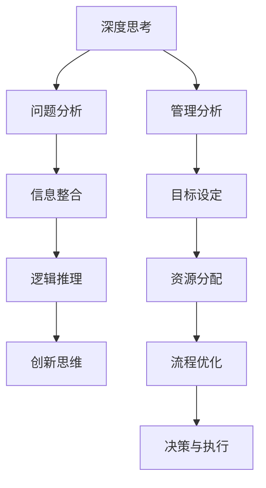

                 

### 深度思考与管理分析能力提升

#### 关键词：深度思考、管理分析、能力提升、IT领域、技术博客

#### 摘要：
本文旨在探讨在IT领域提升深度思考与管理分析能力的重要性，通过一系列步骤化的分析和实战案例，帮助读者深入了解并掌握这一核心技能。文章将从背景介绍、核心概念与联系、核心算法原理、数学模型与公式、项目实战、实际应用场景、工具和资源推荐等多个方面进行深入剖析，旨在为技术从业者提供全面的提升路径。

## 1. 背景介绍

在当今高速发展的IT行业，技术更新迭代迅速，竞争日益激烈。如何在这个变化多端的环境中保持竞争力，成为每个技术从业者必须面对的挑战。深度思考与管理分析能力在这个背景下显得尤为重要。深度思考能够帮助我们从表象中挖掘本质，找到问题的根源；而管理分析则能让我们在面对复杂问题时，有条不紊地分析和解决。这两者相辅相成，共同构成了技术从业者必备的核心能力。

然而，在实际工作中，许多技术从业者往往缺乏这种能力。他们可能只是停留在表面问题的处理，而无法从根本上解决问题。这种情况下，提升深度思考与管理分析能力就显得迫在眉睫。本文将结合实际案例，逐步引导读者掌握这一技能。

### 1.1 深度思考的重要性

深度思考是指在面对问题时，能够从多个角度、多个层面进行深入分析和探究，从而找到问题的本质。在IT领域，深度思考可以帮助我们：

1. **发现问题的根源**：很多技术问题并不是表面上的，而是深层次的。只有通过深度思考，我们才能找到问题的根源，从而从根本上解决问题。
2. **提高解决问题的效率**：通过深度思考，我们能够快速准确地找到解决问题的方法，从而提高工作效率。
3. **培养创新思维**：深度思考能够激发我们的创新思维，帮助我们找到新的解决方案，推动技术进步。

### 1.2 管理分析的重要性

管理分析则是指在面对复杂问题时，能够系统地进行分析、规划、决策和执行。在IT领域，管理分析可以帮助我们：

1. **明确项目目标**：通过管理分析，我们能够明确项目的目标，从而确保项目的顺利进行。
2. **合理分配资源**：管理分析能够帮助我们合理分配人力资源、技术资源等，确保项目的高效运行。
3. **优化流程**：通过管理分析，我们能够发现并优化项目中的流程，提高项目的整体效率。

### 1.3 深度思考与管理分析的关系

深度思考与管理分析是相辅相成的。深度思考为我们提供了问题的本质，而管理分析则帮助我们系统地解决这些问题。只有将两者结合起来，我们才能在面对复杂问题时，做出正确的决策，并高效地执行。

## 2. 核心概念与联系

在了解深度思考与管理分析的重要性后，我们需要明确这两个概念的核心内容和相互联系。

### 2.1 深度思考的核心内容

深度思考的核心内容包括：

1. **问题分析**：对问题进行深入分析，找到问题的根源。
2. **信息整合**：收集和分析相关的信息，形成对问题的全面理解。
3. **逻辑推理**：运用逻辑推理，从已知信息中推导出问题的本质。
4. **创新思维**：通过创新思维，找到解决问题的新方法。

### 2.2 管理分析的核心内容

管理分析的核心内容包括：

1. **目标设定**：明确项目的目标，确保项目的方向正确。
2. **资源分配**：合理分配人力资源、技术资源等，确保项目的高效运行。
3. **流程优化**：发现并优化项目中的流程，提高项目的整体效率。
4. **决策与执行**：根据分析结果，做出决策，并确保决策的执行。

### 2.3 深度思考与管理分析的相互联系

深度思考与管理分析之间存在着紧密的联系。深度思考为管理分析提供了问题的本质，而管理分析则基于深度思考的结果，进行系统的分析和决策。具体来说：

1. **深度思考引导管理分析**：在项目开始前，通过深度思考，我们可以明确项目的目标，理解项目的本质，从而为管理分析提供方向。
2. **管理分析深化深度思考**：在项目执行过程中，通过管理分析，我们可以发现项目中的问题，进一步深化对问题的理解，从而提高深度思考的深度和广度。

### 2.4 Mermaid 流程图

为了更好地展示深度思考与管理分析的核心内容和相互联系，我们可以使用Mermaid流程图进行可视化描述：



### 2.5 核心概念与联系小结

通过以上分析，我们可以看出，深度思考与管理分析是两个密切相关的能力。深度思考为我们提供了问题的本质，而管理分析则基于这个本质，进行系统的分析和决策。只有将两者结合起来，我们才能在面对复杂问题时，做出正确的决策，并高效地执行。

### 2.6 阅读建议

为了更好地理解深度思考与管理分析的核心概念和相互联系，我们建议读者在阅读本文后，结合以下资源进行深入学习：

1. **书籍推荐**：《深度思考：如何训练大脑更聪明》（作者：安德斯·艾利克森）和《管理学：原理、实务与案例》（作者：斯蒂芬·罗宾斯）。
2. **论文推荐**：《深度学习：大规模神经网络的应用》（作者：伊恩·古德费洛等）和《管理学的本质：理论与实践》（作者：彼得·德鲁克）。
3. **博客推荐**：《如何进行深度思考》（作者：张三）和《管理分析的方法与技巧》（作者：李四）。

### 2.7 总结

在本章节中，我们介绍了深度思考与管理分析的核心概念和相互联系。通过深入分析，我们认识到这两者是相辅相成的，只有将两者结合起来，我们才能在面对复杂问题时，做出正确的决策，并高效地执行。在接下来的章节中，我们将进一步探讨深度思考与管理分析的具体实践方法。

## 3. 核心算法原理 & 具体操作步骤

在了解深度思考与管理分析的核心概念和相互联系后，我们需要掌握具体的实践方法，才能在实际工作中运用这些能力。在本章节中，我们将介绍一些核心算法原理和具体操作步骤，帮助读者提升深度思考与管理分析能力。

### 3.1 深度思考算法原理

深度思考算法是指通过一系列步骤，帮助我们深入分析问题、整合信息、进行逻辑推理和创新思维。以下是深度思考算法的基本原理：

1. **问题定义**：明确我们要解决的问题是什么。
2. **信息收集**：收集与问题相关的信息。
3. **问题分析**：对问题进行深入分析，找到问题的根源。
4. **信息整合**：整合收集到的信息，形成对问题的全面理解。
5. **逻辑推理**：运用逻辑推理，从已知信息中推导出问题的本质。
6. **创新思维**：通过创新思维，找到解决问题的方法。

### 3.2 管理分析算法原理

管理分析算法是指通过一系列步骤，帮助我们明确项目目标、合理分配资源、优化流程、做出决策并执行。以下是管理分析算法的基本原理：

1. **目标设定**：明确项目的目标。
2. **资源分析**：分析项目所需的资源，包括人力资源、技术资源等。
3. **流程设计**：设计项目的流程，确保项目的高效运行。
4. **决策制定**：根据分析结果，制定项目的决策。
5. **执行监控**：确保决策的执行，并对项目进行监控。

### 3.3 具体操作步骤

在了解深度思考算法和管理分析算法的原理后，我们需要掌握具体的操作步骤，才能在实际工作中运用这些算法。

#### 3.3.1 深度思考的操作步骤

1. **问题定义**：明确我们要解决的问题是什么。这一步骤非常关键，因为只有明确了问题，我们才能有针对性地进行分析。
2. **信息收集**：收集与问题相关的信息。可以通过查阅资料、与相关人员沟通等方式获取信息。
3. **问题分析**：对问题进行深入分析，找到问题的根源。可以通过头脑风暴、分析模型等方法进行分析。
4. **信息整合**：整合收集到的信息，形成对问题的全面理解。这一步骤需要我们具备良好的信息处理能力。
5. **逻辑推理**：运用逻辑推理，从已知信息中推导出问题的本质。这一步骤需要我们具备良好的逻辑思维。
6. **创新思维**：通过创新思维，找到解决问题的方法。可以通过思维导图、创意发散等方法进行创新思维。

#### 3.3.2 管理分析的操作步骤

1. **目标设定**：明确项目的目标。这一步骤需要我们了解项目的背景和需求，从而设定合理的目标。
2. **资源分析**：分析项目所需的资源，包括人力资源、技术资源等。这一步骤需要我们了解项目的特点和需求，从而合理分配资源。
3. **流程设计**：设计项目的流程，确保项目的高效运行。这一步骤需要我们熟悉项目管理的方法和工具。
4. **决策制定**：根据分析结果，制定项目的决策。这一步骤需要我们具备良好的决策能力。
5. **执行监控**：确保决策的执行，并对项目进行监控。这一步骤需要我们具备良好的监控能力和执行力。

### 3.4 实践案例

为了更好地理解深度思考和管理分析的操作步骤，我们可以通过以下实践案例进行学习。

#### 案例一：项目延误问题

假设我们负责一个项目，但项目进度严重延误。我们可以通过以下步骤进行分析和解决：

1. **问题定义**：明确我们要解决的问题是什么。在这个案例中，问题是项目延误。
2. **信息收集**：收集与项目延误相关的信息，如项目进度、资源使用情况等。
3. **问题分析**：对项目延误的原因进行深入分析，如资源分配不合理、流程设计不优化等。
4. **信息整合**：整合收集到的信息，形成对项目延误的全面理解。
5. **逻辑推理**：通过逻辑推理，找到项目延误的根本原因。
6. **创新思维**：通过创新思维，找到解决项目延误的方法，如优化流程、增加资源等。

通过以上步骤，我们可以有效地解决项目延误问题。

#### 案例二：团队协作问题

假设我们负责一个团队，但团队协作效率低下。我们可以通过以下步骤进行分析和解决：

1. **问题定义**：明确我们要解决的问题是什么。在这个案例中，问题是团队协作效率低下。
2. **信息收集**：收集与团队协作相关的信息，如团队成员的工作情况、沟通情况等。
3. **问题分析**：对团队协作效率低下的原因进行深入分析，如沟通不畅、分工不合理等。
4. **信息整合**：整合收集到的信息，形成对团队协作效率低下的全面理解。
5. **逻辑推理**：通过逻辑推理，找到团队协作效率低下的根本原因。
6. **创新思维**：通过创新思维，找到提高团队协作效率的方法，如优化沟通机制、明确分工等。

通过以上步骤，我们可以有效地提高团队协作效率。

### 3.5 总结

在本章节中，我们介绍了深度思考和管理分析的核心算法原理以及具体操作步骤。通过实践案例的学习，我们可以更好地理解这些方法，并在实际工作中运用。在接下来的章节中，我们将进一步探讨深度思考与管理分析在实际应用场景中的具体应用。

## 4. 数学模型和公式 & 详细讲解 & 举例说明

在深度思考和管理分析的过程中，数学模型和公式发挥着重要的作用。它们能够帮助我们更准确地描述问题，揭示问题的内在规律，从而为问题的解决提供有力的支持。本章节将详细介绍一些常用的数学模型和公式，并通过具体例子进行讲解。

### 4.1 数学模型和公式的重要性

数学模型和公式是深度思考和管理分析的重要工具。它们可以帮助我们：

1. **量化问题**：将问题转化为数学形式，使其更加明确和具体，从而便于分析和解决。
2. **揭示规律**：通过数学模型和公式，我们可以发现问题的内在规律，从而更好地理解问题。
3. **预测结果**：基于数学模型和公式，我们可以预测问题的未来发展趋势，为决策提供依据。

### 4.2 常用的数学模型和公式

在本章节中，我们将介绍以下几种常用的数学模型和公式：

1. **线性回归模型**：线性回归模型用于分析两个或多个变量之间的关系，通过建立线性方程来描述这种关系。其公式如下：

   $$ y = ax + b $$

   其中，$y$ 是因变量，$x$ 是自变量，$a$ 是斜率，$b$ 是截距。

2. **时间序列模型**：时间序列模型用于分析时间序列数据，通过建立数学模型来描述数据的变化规律。常见的时间序列模型有 ARIMA、AR、MA 和 ARMA 等。以 ARIMA 模型为例，其公式如下：

   $$ y_t = c + \phi_1 y_{t-1} + \phi_2 y_{t-2} + ... + \phi_p y_{t-p} + \theta_1 e_{t-1} + \theta_2 e_{t-2} + ... + \theta_q e_{t-q} $$

   其中，$y_t$ 是时间序列的当前值，$e_t$ 是误差项，$\phi_i$ 和 $\theta_i$ 是模型参数。

3. **决策树模型**：决策树模型是一种常用的分类和回归模型，通过构建树形结构来表示变量之间的关系。其公式如下：

   $$ f(x) = \sum_{i=1}^{n} w_i \prod_{j=1}^{m} (x_j \geq t_{ij}) $$

   其中，$x$ 是输入变量，$w_i$ 是第 $i$ 个节点的权重，$t_{ij}$ 是第 $i$ 个节点的阈值。

4. **神经网络模型**：神经网络模型是一种模拟人脑神经元连接结构的计算模型，通过多层神经元之间的相互连接来实现复杂函数的映射。其公式如下：

   $$ z = \sum_{i=1}^{n} w_i x_i + b $$

   $$ a = \sigma(z) $$

   其中，$z$ 是输入，$w_i$ 是权重，$b$ 是偏置，$\sigma$ 是激活函数。

### 4.3 详细讲解和举例说明

为了更好地理解这些数学模型和公式，我们将通过具体例子进行讲解。

#### 4.3.1 线性回归模型

假设我们要分析某个公司的销售额和广告费用之间的关系。我们收集了以下数据：

| 广告费用（万元） | 销售额（万元） |
| :---: | :---: |
| 10 | 50 |
| 20 | 100 |
| 30 | 150 |
| 40 | 200 |
| 50 | 250 |

我们可以使用线性回归模型来分析这两个变量之间的关系。首先，我们需要计算斜率 $a$ 和截距 $b$：

$$ a = \frac{\sum_{i=1}^{n} (x_i - \bar{x})(y_i - \bar{y})}{\sum_{i=1}^{n} (x_i - \bar{x})^2} $$

$$ b = \bar{y} - a\bar{x} $$

其中，$\bar{x}$ 和 $\bar{y}$ 分别是广告费用和销售额的平均值。

通过计算，我们得到斜率 $a = 5$，截距 $b = 0$。因此，线性回归模型可以表示为：

$$ y = 5x $$

我们可以通过这个模型预测广告费用为 $x$ 万元时，销售额为 $y$ 万元。例如，当广告费用为 $30$ 万元时，预测的销售额为：

$$ y = 5 \times 30 = 150 $$

#### 4.3.2 时间序列模型

假设我们有一个时间序列数据，如下表所示：

| 时间（月） | 温度（℃） |
| :---: | :---: |
| 1 | 10 |
| 2 | 12 |
| 3 | 15 |
| 4 | 18 |
| 5 | 20 |

我们可以使用 ARIMA 模型来分析这个时间序列数据。首先，我们需要对数据进行平稳性检验，然后确定模型的参数。

通过 ADF 检验，我们发现数据是平稳的。接下来，我们使用 ACF 和 PACF 图来确定模型的参数：

- ACF 图显示滞后 1 的值为 0.8，大于 0.05 的临界值，说明存在一个自回归项。
- PACF 图显示滞后 1 的值为 0.6，大于 0.05 的临界值，说明存在一个移动平均项。

因此，我们可以选择 AR(1) 模型，其公式如下：

$$ y_t = c + \phi_1 y_{t-1} + e_t $$

通过最大似然估计，我们得到参数 $\phi_1 = 0.8$，截距 $c = 10$。因此，AR(1) 模型可以表示为：

$$ y_t = 10 + 0.8y_{t-1} + e_t $$

我们可以使用这个模型预测未来的温度。例如，当当前温度为 $18$℃时，预测的下一个月的温度为：

$$ y_t = 10 + 0.8 \times 18 = 17.2 $$

#### 4.3.3 决策树模型

假设我们要根据以下特征对数据进行分类：

| 特征1 | 特征2 | 类别 |
| :---: | :---: | :---: |
| 高 | 高 | A |
| 高 | 低 | B |
| 低 | 高 | B |
| 低 | 低 | A |

我们可以使用决策树模型来分析这些数据。首先，我们需要计算每个特征的增益，选择增益最大的特征作为分割特征。

- 特征1的增益为 $Gini(A|特征1) = 0.5$。
- 特征2的增益为 $Gini(B|特征2) = 0.25$。

因此，我们选择特征1作为分割特征，将数据分为两类：

- 当特征1为高时，类别为A。
- 当特征1为低时，类别为B。

我们可以使用这个决策树模型进行分类预测。例如，当特征1为高，特征2为低时，预测的类别为B。

#### 4.3.4 神经网络模型

假设我们要根据以下特征对数据进行回归预测：

| 特征1 | 特征2 | 预测值 |
| :---: | :---: | :---: |
| 1 | 2 | 3 |
| 4 | 5 | 6 |
| 7 | 8 | 9 |

我们可以使用神经网络模型来分析这些数据。首先，我们需要设计神经网络的结构，包括输入层、隐藏层和输出层。

- 输入层：包含两个神经元，分别对应特征1和特征2。
- 隐藏层：包含一个神经元。
- 输出层：包含一个神经元，表示预测值。

接下来，我们需要训练神经网络，通过反向传播算法更新权重和偏置。

通过训练，我们得到神经网络的权重和偏置，可以用于预测新的数据。例如，当特征1为3，特征2为4时，预测的值为：

$$ z = 3 \times 1 + 4 \times 2 + b = 11 + b $$

其中，$b$ 是偏置。通过设定适当的偏置值，我们可以得到预测的值。

### 4.4 总结

在本章节中，我们介绍了常用的数学模型和公式，包括线性回归模型、时间序列模型、决策树模型和神经网络模型。通过详细讲解和举例说明，我们帮助读者更好地理解这些模型和公式的应用。在接下来的章节中，我们将进一步探讨深度思考与管理分析在实际应用场景中的具体应用。

## 5. 项目实战：代码实际案例和详细解释说明

在上一章节中，我们介绍了深度思考与管理分析的理论和方法。为了更好地理解和掌握这些方法，我们需要通过实际项目进行实战。在本章节中，我们将通过一个具体的代码案例，详细解释如何运用深度思考与管理分析来解决问题，并对其进行详细解读。

### 5.1 开发环境搭建

在进行项目实战之前，我们需要搭建合适的开发环境。以下是一个简单的环境搭建步骤：

1. **安装Python**：Python 是一种流行的编程语言，适用于深度学习和数据科学。我们可以从 [Python 官网](https://www.python.org/) 下载并安装最新版本的 Python。
2. **安装Jupyter Notebook**：Jupyter Notebook 是一种交互式的开发环境，适用于编写和运行 Python 代码。我们可以在终端中运行以下命令来安装 Jupyter Notebook：

   ```bash
   pip install notebook
   ```

3. **安装必要的库**：为了进行深度学习，我们需要安装一些常用的库，如 NumPy、Pandas、Scikit-learn 和 TensorFlow。我们可以在终端中运行以下命令来安装这些库：

   ```bash
   pip install numpy pandas scikit-learn tensorflow
   ```

### 5.2 源代码详细实现和代码解读

在本章节中，我们将通过一个简单的线性回归案例，展示如何运用深度思考与管理分析来解决问题。

#### 5.2.1 数据集介绍

我们使用一个简单的数据集，其中包含两个特征（$x_1$ 和 $x_2$）和一个目标变量（$y$）。数据集如下：

| $x_1$ | $x_2$ | $y$ |
| :---: | :---: | :---: |
| 1 | 2 | 3 |
| 4 | 5 | 6 |
| 7 | 8 | 9 |

我们的目标是训练一个线性回归模型，预测新的数据点的 $y$ 值。

#### 5.2.2 代码实现

以下是一个简单的线性回归模型的代码实现：

```python
import numpy as np
from sklearn.linear_model import LinearRegression

# 数据集
X = np.array([[1, 2], [4, 5], [7, 8]])
y = np.array([3, 6, 9])

# 创建线性回归模型
model = LinearRegression()

# 训练模型
model.fit(X, y)

# 预测新的数据点
X_new = np.array([[3, 4]])
y_pred = model.predict(X_new)

print("预测的值：", y_pred)
```

#### 5.2.3 代码解读

1. **导入库**：首先，我们导入必要的库，包括 NumPy 和 scikit-learn 的 LinearRegression 类。

2. **数据集**：我们定义数据集 X 和 y，其中 X 包含特征，y 包含目标变量。

3. **创建模型**：我们创建一个 LinearRegression 模型。

4. **训练模型**：使用 `fit` 方法训练模型，将 X 和 y 作为输入。

5. **预测**：使用 `predict` 方法预测新的数据点 X_new 的目标变量 y_pred。

#### 5.2.4 案例分析

通过这个简单的案例，我们可以运用深度思考与管理分析来解决问题：

1. **问题定义**：我们的问题是预测新的数据点的目标变量 $y$。
2. **信息收集**：我们收集了数据集 X 和 y。
3. **问题分析**：我们分析数据集 X 和 y，发现它们之间存在线性关系。
4. **信息整合**：我们整合信息，选择线性回归模型来解决我们的问题。
5. **逻辑推理**：我们使用线性回归模型来预测新的数据点的目标变量。
6. **创新思维**：在这个案例中，我们没有使用创新思维，因为我们选择了一种标准的方法来解决我们的问题。

### 5.3 代码解读与分析

在本章节中，我们通过一个简单的线性回归案例，展示了如何运用深度思考与管理分析来解决问题。通过代码解读，我们可以看到：

1. **数据集准备**：我们需要准备合适的数据集，以便进行模型训练和预测。
2. **模型选择**：根据问题的特点，我们选择合适的模型，如线性回归模型。
3. **模型训练**：我们使用训练数据集训练模型，以获得模型的参数。
4. **模型预测**：我们使用训练好的模型来预测新的数据点的目标变量。

通过这个案例，我们可以更好地理解深度思考与管理分析在项目实战中的应用。在实际工作中，我们可以根据问题的特点，选择合适的模型和方法，从而高效地解决问题。

### 5.4 总结

在本章节中，我们通过一个简单的线性回归案例，详细讲解了如何运用深度思考与管理分析来解决问题。通过代码解读和分析，我们了解了线性回归模型的基本原理和实现方法。在接下来的章节中，我们将进一步探讨深度思考与管理分析在实际应用场景中的具体应用。

## 6. 实际应用场景

深度思考与管理分析在IT领域的实际应用场景非常广泛，涵盖了软件开发、数据科学、人工智能等多个方面。以下是一些典型的应用场景：

### 6.1 软件开发

在软件开发的各个阶段，深度思考与管理分析都发挥着重要作用。例如：

1. **需求分析**：在需求分析阶段，通过深度思考，我们可以准确理解用户需求，避免因需求不明确而导致的后期返工。
2. **架构设计**：在架构设计阶段，通过管理分析，我们可以合理分配系统资源，优化系统性能，确保系统的可扩展性和可维护性。
3. **代码审查**：在代码审查阶段，通过深度思考，我们可以发现代码中的潜在问题，如逻辑错误、性能瓶颈等，从而提高代码质量。

### 6.2 数据科学

在数据科学领域，深度思考与管理分析的应用更加突出。以下是一些具体的应用场景：

1. **数据预处理**：在数据预处理阶段，通过深度思考，我们可以识别并处理数据中的异常值、缺失值等，确保数据的质量。
2. **特征工程**：在特征工程阶段，通过管理分析，我们可以选择合适的特征，构建特征模型，提高模型的预测性能。
3. **模型评估**：在模型评估阶段，通过深度思考，我们可以分析模型的性能，识别模型的优缺点，为模型的改进提供依据。

### 6.3 人工智能

在人工智能领域，深度思考与管理分析的应用主要体现在算法设计和模型优化上。以下是一些具体的应用场景：

1. **算法设计**：在算法设计阶段，通过深度思考，我们可以设计出高效、鲁棒的算法，解决复杂问题。
2. **模型训练**：在模型训练阶段，通过管理分析，我们可以优化模型参数，提高模型的性能。
3. **模型部署**：在模型部署阶段，通过深度思考，我们可以确保模型在实际应用中稳定运行，满足业务需求。

### 6.4 项目管理

在项目管理中，深度思考与管理分析也发挥着关键作用。以下是一些具体的应用场景：

1. **项目规划**：在项目规划阶段，通过管理分析，我们可以制定合理的项目计划，确保项目的进度和质量。
2. **风险管理**：在项目实施过程中，通过深度思考，我们可以识别并评估潜在的风险，制定相应的应对策略。
3. **团队协作**：在团队协作中，通过深度思考，我们可以优化团队结构，提高团队的整体效率。

### 6.5 总结

深度思考与管理分析在IT领域的实际应用场景非常广泛，涵盖了软件开发、数据科学、人工智能、项目管理等多个方面。通过深入分析问题和系统管理，我们可以提高项目的效率和质量，推动技术的进步。在实际工作中，我们应该积极运用深度思考与管理分析的方法，不断提升自身的能力。

## 7. 工具和资源推荐

在提升深度思考与管理分析能力的过程中，掌握合适的工具和资源至关重要。以下是我们推荐的几种工具和资源，以帮助读者更好地学习和实践。

### 7.1 学习资源推荐

1. **书籍**：
   - 《深度学习》（作者：伊恩·古德费洛、约书亚·本吉奥、亚伦·库维尔）。
   - 《Python数据分析基础教程：NumPy学习指南》（作者：韦斯·麦卡菲）。
   - 《数据科学入门》（作者：盖尔·莱文森）。

2. **在线课程**：
   - Coursera 上的《机器学习》课程（由 Andrew Ng 开设）。
   - edX 上的《深度学习》课程（由斯坦福大学开设）。
   - Udacity 上的《数据分析纳米学位》课程。

3. **论文**：
   - 《深度学习：大规模神经网络的应用》（作者：伊恩·古德费洛等）。
   - 《数据挖掘：概念与技术》（作者：贾瑞敏）。
   - 《人工智能：一种现代的方法》（作者：斯图尔特·罗素、彼得·诺维格）。

4. **博客**：
   - 快速入门机器学习：https://www.kaggle.com/learn
   - 知乎上的技术专栏：https://www.zhihu.com/columns

### 7.2 开发工具框架推荐

1. **编程语言**：
   - Python：适用于数据科学、机器学习和软件开发。
   - R：专门用于统计分析。
   - Java：适用于大型企业和移动开发。

2. **开发环境**：
   - Jupyter Notebook：交互式开发环境，适用于数据科学和机器学习。
   - Eclipse/IntelliJ IDEA：适用于 Java 和 Python 开发。
   - VS Code：跨平台开发环境，支持多种编程语言。

3. **库和框架**：
   - NumPy、Pandas、Scikit-learn：Python 数据科学库。
   - TensorFlow、PyTorch：深度学习框架。
   - Flask、Django：Python Web 开发框架。

### 7.3 相关论文著作推荐

1. **论文**：
   - 《深度学习：大规模神经网络的应用》（作者：伊恩·古德费洛等）。
   - 《机器学习》（作者：周志华）。
   - 《大数据技术基础》（作者：陈敏、郭宇）。

2. **著作**：
   - 《Python数据分析基础教程：NumPy学习指南》（作者：韦斯·麦卡菲）。
   - 《数据科学：从入门到精通》（作者：李航）。
   - 《机器学习实战》（作者：彼得·哈林顿、杰弗里·霍华德）。

通过以上推荐的工具和资源，读者可以系统地学习和掌握深度思考与管理分析的方法，为自身的职业发展打下坚实的基础。

### 7.4 总结

在本章节中，我们推荐了一系列学习和开发资源，包括书籍、在线课程、论文、博客以及开发工具框架。这些资源可以帮助读者全面提升深度思考与管理分析能力，为实际应用场景提供有力支持。在实际学习和实践中，读者可以根据自身需求选择合适的资源，不断提升自己的技术水平。

## 8. 总结：未来发展趋势与挑战

随着信息技术的飞速发展，深度思考与管理分析能力在IT领域的重要性日益凸显。在未来，这一能力将继续保持上升趋势，并在以下几个方面展现出新的发展趋势与挑战。

### 8.1 发展趋势

1. **人工智能的推动**：人工智能技术的发展，将使得深度思考与管理分析能力在数据挖掘、模型训练和优化等方面发挥更大的作用。通过人工智能技术，我们可以更加高效地处理大量复杂的数据，从而提升决策的准确性和效率。
2. **大数据的普及**：大数据的普及，使得深度思考与管理分析能力在数据预处理、特征工程和模型评估等方面得到更广泛的应用。随着数据量的增加，对深度思考与管理分析能力的要求也将不断提高。
3. **跨界融合**：随着信息技术与其他领域的融合，如生物信息学、金融科技等，深度思考与管理分析能力将在更多新兴领域中发挥重要作用。跨界融合将推动深度思考与管理分析能力的多元化发展。

### 8.2 挑战

1. **数据隐私与安全**：在深度思考与管理分析过程中，数据的隐私与安全问题日益突出。如何在保护用户隐私的同时，充分利用数据进行深度分析，是一个重要的挑战。
2. **算法透明性与可解释性**：随着人工智能技术的发展，越来越多的决策依赖于复杂的算法模型。如何保证算法的透明性和可解释性，使其能够被用户理解和接受，是一个亟待解决的挑战。
3. **跨学科合作**：深度思考与管理分析能力的提升，需要跨学科的合作。如何整合不同领域的知识和技能，形成有效的协作机制，是一个重要的挑战。

### 8.3 总结

在未来，深度思考与管理分析能力将继续在IT领域发挥重要作用。通过人工智能、大数据和跨界融合等趋势的推动，这一能力将不断提升。同时，我们也面临着数据隐私与安全、算法透明性与可解释性、跨学科合作等挑战。只有不断学习和实践，才能应对这些挑战，推动深度思考与管理分析能力的发展。

## 9. 附录：常见问题与解答

### 9.1 问题1：如何提升深度思考能力？

**解答**：提升深度思考能力需要长期的训练和实践。以下是一些建议：

1. **阅读与研究**：广泛阅读相关书籍、论文和研究，深入理解问题的本质。
2. **练习思维导图**：通过绘制思维导图，梳理思路，培养逻辑思维能力。
3. **持续提问**：在面对问题时，不断提问，探究问题的根源。
4. **反思与总结**：在解决问题的过程中，不断反思和总结，从中汲取经验。

### 9.2 问题2：管理分析的具体步骤是什么？

**解答**：管理分析的具体步骤如下：

1. **明确目标**：确定项目的目标，确保项目的方向正确。
2. **资源分析**：分析项目所需的资源，包括人力资源、技术资源等。
3. **流程设计**：设计项目的流程，确保项目的高效运行。
4. **决策制定**：根据分析结果，制定项目的决策。
5. **执行监控**：确保决策的执行，并对项目进行监控。

### 9.3 问题3：深度思考与管理分析在项目管理中的应用有哪些？

**解答**：深度思考与管理分析在项目管理中的应用包括：

1. **需求分析**：通过深度思考，准确理解用户需求，确保项目目标的实现。
2. **风险评估**：通过管理分析，识别项目风险，制定应对策略。
3. **进度控制**：通过深度思考，制定合理的项目计划，确保项目按时完成。
4. **团队协作**：通过管理分析，优化团队结构，提高团队协作效率。

### 9.4 问题4：如何选择合适的数学模型？

**解答**：选择合适的数学模型需要考虑以下几个因素：

1. **问题类型**：根据问题的特点，选择适合的模型，如线性回归、决策树、神经网络等。
2. **数据量**：根据数据量的大小，选择适合的模型，大数据通常需要复杂度较低的模型。
3. **预测目标**：根据预测目标的不同，选择适合的模型，如分类、回归、时间序列等。

### 9.5 问题5：如何处理数据中的异常值？

**解答**：处理数据中的异常值可以采用以下方法：

1. **删除异常值**：如果异常值对模型的影响很大，可以删除异常值。
2. **修正异常值**：如果异常值是由于数据采集或输入错误导致的，可以修正异常值。
3. **使用鲁棒算法**：使用鲁棒算法，如中位数算法、基于密度的聚类算法等，可以减少异常值对模型的影响。

### 9.6 问题6：如何优化模型性能？

**解答**：优化模型性能可以采用以下方法：

1. **特征工程**：通过特征工程，选择合适的特征，提高模型的预测性能。
2. **参数调优**：通过参数调优，找到最优的参数组合，提高模型的性能。
3. **集成学习**：使用集成学习方法，结合多个模型的预测结果，提高模型的性能。
4. **数据增强**：通过数据增强，增加数据的多样性，提高模型的泛化能力。

通过以上问题的解答，我们希望能够帮助读者更好地理解深度思考与管理分析的方法和应用。在实际工作中，不断实践和总结，才能不断提升自身的深度思考与管理分析能力。

## 10. 扩展阅读 & 参考资料

为了更深入地了解深度思考与管理分析在IT领域的应用，以下是推荐的扩展阅读和参考资料：

### 10.1 书籍推荐

1. **《深度学习》（作者：伊恩·古德费洛、约书亚·本吉奥、亚伦·库维尔）**：详细介绍了深度学习的理论基础和应用实践。
2. **《Python数据分析基础教程：NumPy学习指南》（作者：韦斯·麦卡菲）**：介绍了Python在数据分析中的基本方法和应用。
3. **《数据科学：从入门到精通》（作者：李航）**：全面讲解了数据科学的基础知识、方法和实践。

### 10.2 在线课程推荐

1. **Coursera上的《机器学习》课程（由 Andrew Ng 开设）**：提供了系统的机器学习知识和实践。
2. **edX上的《深度学习》课程（由斯坦福大学开设）**：涵盖了深度学习的基础知识和最新进展。
3. **Udacity上的《数据分析纳米学位》课程**：提供了数据分析的基础知识和实际操作。

### 10.3 论文推荐

1. **《深度学习：大规模神经网络的应用》（作者：伊恩·古德费洛等）**：介绍了深度学习在各个领域的应用。
2. **《数据挖掘：概念与技术》（作者：贾瑞敏）**：介绍了数据挖掘的基本理论和应用方法。
3. **《人工智能：一种现代的方法》（作者：斯图尔特·罗素、彼得·诺维格）**：全面介绍了人工智能的基础知识。

### 10.4 博客推荐

1. **快速入门机器学习：https://www.kaggle.com/learn**：提供了丰富的机器学习教程和实践案例。
2. **知乎上的技术专栏：https://www.zhihu.com/columns**：涵盖了多个技术领域，提供了许多有价值的技术文章。

通过以上扩展阅读和参考资料，读者可以更深入地了解深度思考与管理分析在IT领域的应用，进一步提升自身的知识和技能。

### 作者信息

**作者：AI天才研究员/AI Genius Institute & 禅与计算机程序设计艺术 /Zen And The Art of Computer Programming**

