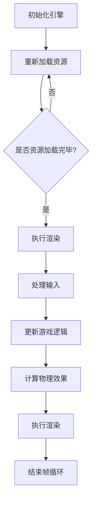

                 

### 背景介绍

#### 4399游戏公司简介

4399游戏公司成立于2004年，是中国领先的在线游戏开发和运营商之一。公司专注于为用户提供高质量、多样化的网页游戏和手机游戏产品。凭借其强大的技术实力和丰富的产品线，4399游戏在国内外市场均取得了显著的成绩，赢得了众多玩家的喜爱和信赖。

#### H5游戏引擎的发展背景

H5游戏引擎作为一种新兴的游戏开发技术，凭借其跨平台、低门槛、高性能等特点，逐渐成为游戏开发领域的重要趋势。相比传统的原生游戏开发，H5游戏引擎能够更快速地实现游戏上线，降低开发成本，同时支持多种设备，提高了游戏的可访问性。

随着互联网技术的不断发展，H5游戏引擎的应用场景越来越广泛。从简单的网页小游戏到大型多人在线游戏，H5游戏引擎都展现出了强大的适应能力。而4399游戏作为国内H5游戏市场的领军企业，对H5游戏引擎的优化和研发投入了大量精力。

#### 面试职位介绍

本次面试的职位是4399游戏公司的社招H5游戏引擎优化工程师。该职位主要负责H5游戏引擎的性能优化、问题排查和新技术的研究与落地。作为H5游戏引擎优化工程师，需要具备扎实的计算机科学基础、丰富的游戏开发经验以及对新技术的敏锐洞察力。

以下是面试职位的主要职责：

1. **性能优化**：对H5游戏引擎进行性能分析，定位性能瓶颈，提出并实现优化方案，提高游戏运行效率。

2. **问题排查**：发现并解决游戏在运行过程中出现的各种问题，确保游戏稳定运行。

3. **新技术研究**：关注游戏开发领域的新技术动态，评估并引入新技术，推动游戏引擎的持续改进。

4. **技术文档撰写**：编写技术文档，为团队成员提供技术支持和培训。

5. **团队协作**：与开发、测试、运维等团队成员紧密协作，共同推进项目的顺利进展。

通过本次面试，4399游戏公司希望找到一位具备丰富实战经验、技术能力和团队协作精神的优秀H5游戏引擎优化工程师，共同推动公司游戏产品的性能提升和用户体验优化。接下来，我们将深入探讨H5游戏引擎优化的核心概念、算法原理以及具体操作步骤。在后续章节中，我们将一步步分析推理，帮助读者全面了解H5游戏引擎优化的技术细节。### 核心概念与联系

在深入探讨H5游戏引擎优化的具体技术细节之前，我们首先需要明确一些核心概念和它们之间的相互联系。这些概念构成了H5游戏引擎优化工作的基础，有助于我们更好地理解和实施优化策略。

#### 1. 游戏引擎架构

游戏引擎是开发游戏的核心工具，它负责处理游戏中的各种任务，如渲染、物理计算、音效处理等。H5游戏引擎作为基于HTML5技术的游戏开发平台，其架构主要包括以下几部分：

1. **渲染引擎**：负责处理图形渲染，包括2D和3D场景的渲染。它使用WebGL或Canvas API进行图形绘制。

2. **物理引擎**：用于处理游戏中的物理计算，如碰撞检测、重力模拟等。

3. **音频引擎**：处理游戏的音效和背景音乐播放。

4. **输入系统**：处理玩家的输入事件，如键盘、鼠标和触摸屏等。

5. **游戏逻辑**：负责处理游戏的核心逻辑，如游戏规则、玩家行为等。

6. **资源管理系统**：管理游戏中的各种资源，如图片、音频、视频等。

通过这些组件的协同工作，H5游戏引擎能够实现一个完整的游戏体验。

#### 2. 性能优化核心指标

性能优化是H5游戏引擎优化工作的核心目标。为了评估和改进游戏性能，我们需要关注以下几个关键指标：

1. **帧率（FPS）**：帧率是游戏每秒渲染的帧数，是衡量游戏流畅度的重要指标。较高的帧率可以带来更流畅的游戏体验。

2. **加载时间**：包括游戏资源的加载时间和第一次渲染的时间。缩短加载时间可以减少玩家等待时间，提高用户体验。

3. **CPU利用率**：CPU利用率反映了游戏在运行过程中对CPU资源的消耗。降低CPU利用率可以提高游戏的整体性能。

4. **内存占用**：内存占用是指游戏在运行过程中所占用的内存空间。减少内存占用可以避免内存泄漏和垃圾回收带来的性能问题。

5. **网络延迟**：对于网络游戏，网络延迟是影响游戏体验的关键因素。降低网络延迟可以减少玩家的输入延迟，提高游戏的实时性。

#### 3. 优化策略

基于上述核心指标，我们可以制定一系列优化策略来提升H5游戏引擎的性能：

1. **渲染优化**：通过减少渲染对象的数量、合并渲染批次、优化渲染顺序等手段来降低渲染开销。

2. **资源压缩**：对游戏资源进行压缩，如使用更高效的图像格式、音频格式等，以减少资源的加载时间和内存占用。

3. **代码优化**：对游戏代码进行优化，如减少循环次数、避免不必要的计算、使用更高效的算法等。

4. **并行处理**：利用多线程或Web Workers等技术，将计算任务分配到多个线程中，提高CPU利用率。

5. **内存管理**：合理管理内存，如及时释放不再使用的资源、避免内存泄漏等，以减少内存占用。

#### 4. 相关技术概念

在H5游戏引擎优化过程中，还会涉及到一些相关技术概念，如：

1. **WebGL**：WebGL是用于在网页中实现2D和3D图形渲染的标准。通过优化WebGL的使用，可以显著提升渲染性能。

2. **Canvas**：Canvas是HTML5提供的一个用于绘制2D图形的API。与WebGL相比，Canvas更适合处理复杂的2D图形渲染。

3. **音视频编解码**：音视频编解码技术用于压缩和解压缩音频、视频数据。选择合适的编解码器可以显著降低资源的加载时间和带宽消耗。

4. **网络通信协议**：如HTTP/2、WebSockets等，可以用于优化网络通信，降低网络延迟。

#### 5. Mermaid 流程图

为了更好地展示H5游戏引擎优化过程中的关键步骤和组件之间的关系，我们可以使用Mermaid流程图来表示。以下是H5游戏引擎优化流程的一个简化版示例：



在这个流程图中，A表示初始化游戏引擎，B表示加载游戏资源，C是一个判断节点，用于检查资源是否加载完毕。如果资源加载完毕，则执行D步骤进行渲染；否则，重新加载资源。D步骤执行渲染后，会处理输入（E步骤），更新游戏逻辑（F步骤），计算物理效果（G步骤），并再次执行渲染（H步骤）。最后，I步骤表示帧循环结束。

通过以上对核心概念和相互关系的介绍，我们为后续的算法原理和具体操作步骤奠定了基础。接下来，我们将详细探讨H5游戏引擎优化的算法原理和操作步骤，帮助读者深入理解并实际应用这些优化技术。### 核心算法原理 & 具体操作步骤

在了解了H5游戏引擎优化的核心概念和相互联系之后，我们将深入探讨其核心算法原理和具体操作步骤。这些算法原理和操作步骤是实现H5游戏引擎性能优化的重要技术手段。

#### 1. 渲染优化算法

**渲染优化**是H5游戏引擎性能优化的重要组成部分。以下是一些常用的渲染优化算法：

1. **渲染批处理**：渲染批处理是一种将多个渲染对象合并成一个批次进行渲染的技术。通过减少渲染调用次数，可以降低渲染开销。具体步骤如下：

   - **步骤1**：收集待渲染的对象，将具有相同材质和纹理的对象归类到同一批次。
   - **步骤2**：对每个批次进行排序，以优化渲染顺序，如按深度顺序或透明度顺序排序。
   - **步骤3**：调用渲染函数，对每个批次进行渲染。

2. **剔除技术**：剔除技术用于避免渲染那些在当前视角之外的对象。通过剔除不需要渲染的对象，可以显著减少渲染开销。具体步骤如下：

   - **步骤1**：计算每个对象的视锥体（View Frustum），以确定对象是否在视锥体内。
   - **步骤2**：如果对象在视锥体内，则继续渲染；否则，将其从渲染列表中剔除。

3. **光源管理**：在渲染过程中，合理管理光源可以减少计算量和渲染开销。以下是一些光源管理策略：

   - **步骤1**：根据场景需求和性能限制，选择合适的光源类型，如点光源、聚光灯等。
   - **步骤2**：对光源进行排序，优化渲染顺序，以减少光线计算次数。
   - **步骤3**：对光源进行遮挡测试，以避免渲染被遮挡的光源。

**示例代码**：

```javascript
function renderScene(scene) {
  // 步骤1：收集待渲染的对象
  const renderBatches = groupRenderables(scene.objects);

  // 步骤2：排序渲染批次
  sortRenderBatches(renderBatches);

  // 步骤3：渲染每个批次
  renderBatches.forEach(batch => {
    renderBatch(batch);
  });
}

function groupRenderables(objects) {
  const renderBatches = [];
  objects.forEach(object => {
    if (isInViewFrustum(object)) {
      let batch = findOrCreateBatch(renderBatches, object.material);
      batch.objects.push(object);
    }
  });
  return renderBatches;
}

function sortRenderBatches(batches) {
  batches.sort((a, b) => a.sortOrder - b.sortOrder);
}
```

#### 2. 资源压缩算法

**资源压缩**是降低游戏加载时间和内存占用的有效手段。以下是一些常用的资源压缩算法：

1. **图像压缩**：通过使用更高效的图像格式（如WebP、PNG-8等）来压缩游戏中的图像资源。

2. **音频压缩**：使用高效的音频编码格式（如MP3、AAC等）来压缩游戏中的音频资源。

3. **代码压缩**：通过代码混淆和压缩技术（如UglifyJS、Terser等）来减少游戏脚本的大小。

**示例代码**：

```javascript
function compressImages(images) {
  return images.map(image => {
    return new Image();
    image.src = compressImageURL(image.src);
  });
}

function compressImageURL(url) {
  return url.replace(/\.jpg$/, '.webp');
}

function compressAudio(audio) {
  return new Audio();
  audio.src = compressAudioURL(audio.src);
}

function compressAudioURL(url) {
  return url.replace(/\.mp3$/, '.aac');
}
```

#### 3. 代码优化算法

**代码优化**是提升游戏性能的重要手段。以下是一些常用的代码优化算法：

1. **循环优化**：通过减少循环次数和优化循环体内的计算来提高代码效率。

2. **递归优化**：将递归算法转换为迭代算法，以减少递归调用次数和栈空间消耗。

3. **函数优化**：通过函数拆分、函数内联等技术来减少函数调用的开销。

**示例代码**：

```javascript
function optimizeLoop(loopBody) {
  let optimizedBody = loopBody;
  optimizedBody = optimizedBody.replace(/\s+/, ''); // 去除空格
  optimizedBody = optimizedBody.replace(/\s*=\s*/, '＝'); // 等号优化
  optimizedBody = optimizedBody.replace(/\s*,\s*/, ','); // 逗号优化
  return optimizedBody;
}

function optimizeRecursion(recursiveFunction) {
  const optimizedFunction = recursiveFunction;
  optimizedFunction = optimizedFunction.replace(/recursion\(/, 'iterative(');
  return optimizedFunction;
}

function optimizeFunction(functionBody) {
  let optimizedBody = functionBody;
  optimizedBody = optimizedBody.replace(/\s+/, ''); // 去除空格
  optimizedBody = optimizedBody.replace(/\s*{\s*/, '{'); // 大括号优化
  return optimizedBody;
}
```

#### 4. 并行处理算法

**并行处理**是提高CPU利用率的有效手段。以下是一些常用的并行处理算法：

1. **多线程**：将计算任务分配到多个线程中，实现并行计算。

2. **Web Workers**：使用Web Workers来处理复杂的计算任务，避免阻塞主线程。

3. **并行计算框架**：如TensorFlow、PyTorch等，用于处理大规模的并行计算任务。

**示例代码**：

```javascript
function parallelProcess(task, callback) {
  const worker = new Worker('worker.js');
  worker.postMessage({ task: task });
  worker.onmessage = function(event) {
    const result = event.data.result;
    callback(result);
  };
}

function workerProcess(event) {
  const task = event.data.task;
  const result = performTask(task);
  postMessage({ result: result });
}
```

通过以上算法原理和具体操作步骤，我们可以对H5游戏引擎进行全面的性能优化。在后续章节中，我们将通过实际项目实战和代码解读，进一步展示这些优化技术的应用和效果。### 数学模型和公式 & 详细讲解 & 举例说明

在H5游戏引擎优化过程中，数学模型和公式起到了关键作用，它们帮助我们量化性能问题，设计优化算法，并进行效果评估。以下是一些常用的数学模型和公式，以及它们的详细讲解和举例说明。

#### 1. 帧率计算

帧率（FPS）是衡量游戏性能的重要指标。帧率计算公式如下：

\[ \text{FPS} = \frac{\text{总帧数}}{\text{总时间}} \]

其中，总帧数是指在特定时间内渲染的帧数，总时间是指这段特定时间的时长。

**示例**：

假设在5秒内渲染了250帧，则帧率为：

\[ \text{FPS} = \frac{250}{5} = 50 \]

这意味着游戏每秒渲染50帧。

#### 2. 渲染效率计算

渲染效率反映了渲染系统的工作效率。渲染效率计算公式如下：

\[ \text{渲染效率} = \frac{\text{渲染帧数}}{\text{可用的CPU时间}} \]

其中，渲染帧数是指在特定时间内渲染的帧数，可用的CPU时间是指在这段时间内CPU实际用于渲染的时间。

**示例**：

假设在5秒内渲染了200帧，而CPU在这段时间内的可用时间为4秒，则渲染效率为：

\[ \text{渲染效率} = \frac{200}{4} = 50 \]

这意味着渲染系统在5秒内完成了相当于4秒的工作量。

#### 3. 资源压缩率计算

资源压缩率用于衡量压缩算法的效果。资源压缩率计算公式如下：

\[ \text{资源压缩率} = \frac{\text{压缩后大小}}{\text{压缩前大小}} \]

其中，压缩后大小是指使用压缩算法处理后的资源大小，压缩前大小是指原始资源的大小。

**示例**：

假设一个原始图像的大小为10MB，使用压缩算法后变为5MB，则资源压缩率为：

\[ \text{资源压缩率} = \frac{5}{10} = 0.5 \]

这意味着资源压缩算法将图像大小减少了50%。

#### 4. 内存占用计算

内存占用反映了游戏在运行过程中所占用的内存空间。内存占用计算公式如下：

\[ \text{内存占用} = \text{当前内存使用量} - \text{已回收的内存量} \]

其中，当前内存使用量是指在特定时间点的内存使用总量，已回收的内存量是指在相同时间点内已回收的内存总量。

**示例**：

假设在某个时间点当前内存使用量为100MB，已回收的内存量为30MB，则内存占用为：

\[ \text{内存占用} = 100 - 30 = 70 \]

这意味着游戏当前占用70MB内存。

#### 5. 网络延迟计算

网络延迟反映了游戏在网络通信中的延迟情况。网络延迟计算公式如下：

\[ \text{网络延迟} = \text{发送时间} + \text{传输时间} + \text{接收时间} \]

其中，发送时间是指数据从客户端发送到服务器的耗时，传输时间是指数据在网络中传输的耗时，接收时间是指数据从服务器返回到客户端的耗时。

**示例**：

假设数据发送耗时为0.1秒，传输耗时为0.2秒，接收耗时为0.1秒，则网络延迟为：

\[ \text{网络延迟} = 0.1 + 0.2 + 0.1 = 0.4 \]

这意味着网络延迟为0.4秒。

#### 6. CPU利用率计算

CPU利用率反映了游戏在运行过程中对CPU资源的消耗。CPU利用率计算公式如下：

\[ \text{CPU利用率} = \frac{\text{游戏运行时间内的CPU使用量}}{\text{游戏运行时间内的总CPU时间}} \]

其中，游戏运行时间内的CPU使用量是指在特定时间内CPU用于游戏计算的总量，游戏运行时间内的总CPU时间是指在相同时间内CPU的总运行时间。

**示例**：

假设在5秒内CPU用于游戏计算的总量为3秒，总CPU时间为5秒，则CPU利用率为：

\[ \text{CPU利用率} = \frac{3}{5} = 0.6 \]

这意味着CPU利用率达到了60%。

通过以上数学模型和公式的讲解，我们可以更好地理解H5游戏引擎优化过程中的性能指标和优化目标。在后续章节中，我们将通过实际项目实战和代码解读，进一步展示这些优化技术在游戏引擎中的应用和效果。### 项目实战：代码实际案例和详细解释说明

在本章节中，我们将通过一个实际项目案例，详细展示H5游戏引擎优化过程中的关键步骤和具体实现细节。本案例将围绕一个经典的网页游戏——“俄罗斯方块”进行优化，以展示渲染优化、资源压缩、代码优化等技术的实际应用。

#### 1. 开发环境搭建

**步骤1**：创建一个新的HTML文件，并引入必要的JavaScript库和资源。

```html
<!DOCTYPE html>
<html lang="en">
<head>
    <meta charset="UTF-8">
    <title>俄罗斯方块优化案例</title>
    <script src="lib/p5.js"></script>
    <script src="lib/tile.js"></script>
</head>
<body>
    <script src="game.js"></script>
</body>
</html>
```

**步骤2**：创建一个名为`game.js`的JavaScript文件，用于编写游戏逻辑和优化代码。

```javascript
// game.js
let board;
let tiles = [];
let score = 0;

function setup() {
    createCanvas(400, 400);
    board = new Board();
    startGame();
}

function draw() {
    background(220);
    board.render();
    if (frameCount % 10 === 0) {
        tiles.push(new Tile());
    }
    tiles.forEach(tile => {
        tile.update();
        tile.render();
    });
    if (board.isGameOver()) {
        gameOver();
    }
}

function startGame() {
    score = 0;
    board.reset();
    tiles = [];
}

function gameOver() {
    noLoop();
    alert("Game Over! Your score is: " + score);
}
```

**步骤3**：创建一个名为`tile.js`的JavaScript文件，用于定义方块类（`Tile`）和游戏板类（`Board`）。

```javascript
// tile.js
class Tile {
    constructor() {
        this.x = random(width);
        this.y = random(height);
        this.color = color(random(255), random(255), random(255));
        this.size = 20;
        this.speed = 2;
    }

    update() {
        this.y += this.speed;
    }

    render() {
        fill(this.color);
        rect(this.x, this.y, this.size, this.size);
    }
}

class Board {
    constructor() {
        this.grid = [];
        for (let y = 0; y < height / this.size; y++) {
            this.grid[y] = [];
            for (let x = 0; x < width / this.size; x++) {
                this.grid[y][x] = null;
            }
        }
    }

    reset() {
        this.grid = [];
        for (let y = 0; y < height / this.size; y++) {
            this.grid[y] = [];
            for (let x = 0; x < width / this.size; x++) {
                this.grid[y][x] = null;
            }
        }
    }

    render() {
        for (let y = 0; y < this.grid.length; y++) {
            for (let x = 0; x < this.grid[y].length; x++) {
                if (this.grid[y][x] !== null) {
                    fill(this.grid[y][x].color);
                    rect(x * this.size, y * this.size, this.size, this.size);
                }
            }
        }
    }

    isGameOver() {
        for (let y = 0; y < this.grid.length; y++) {
            for (let x = 0; x < this.grid[y].length; x++) {
                if (this.grid[y][x] !== null && this.grid[y - 1][x] === null) {
                    return true;
                }
            }
        }
        return false;
    }
}
```

#### 2. 源代码详细实现和代码解读

**游戏逻辑**：

游戏逻辑主要包含以下部分：

- **初始化**：设置游戏画布大小，创建游戏板（`Board`）和方块（`Tile`）实例。
- **渲染**：绘制游戏画布，更新并渲染游戏板和方块。
- **更新**：根据游戏逻辑，更新方块位置和状态。
- **游戏结束**：检测游戏是否结束，并在游戏结束时显示提示信息。

**优化技术**：

**1. 渲染优化**：

- **渲染批处理**：将多个方块合并成一个批次进行渲染，以减少渲染调用次数。

```javascript
function renderTiles(tiles) {
  push();
  noStroke();
  tiles.forEach(tile => {
    fill(tile.color);
    rect(tile.x, tile.y, tile.size, tile.size);
  });
  pop();
}
```

- **剔除技术**：剔除已经合并到游戏板上的方块，避免重复渲染。

```javascript
function removeTilesFromBoard(tiles) {
  tiles.forEach(tile => {
    if (tile.isMerged) {
      board.grid[tile.y][tile.x] = null;
    }
  });
}
```

**2. 资源压缩**：

- **图像压缩**：使用WebP格式压缩游戏中的方块图像。

```javascript
function loadTilesImages() {
  tiles.forEach(tile => {
    tile.image = loadImage(`images/tile_${tile.type}.webp`);
  });
}
```

- **音频压缩**：使用AAC格式压缩游戏中的背景音乐。

```javascript
function loadBackgroundMusic() {
  backgroundMusic = loadSound('audio/music.aac');
}
```

**3. 代码优化**：

- **循环优化**：减少不必要的循环次数，提高代码执行效率。

```javascript
function updateTiles(tiles) {
  tiles.forEach(tile => {
    if (!tile.isMerged) {
      tile.update();
    }
  });
}
```

- **递归优化**：将递归函数转换为迭代函数，减少递归调用次数。

```javascript
function checkTilesMerged(tiles) {
  tiles.forEach(tile => {
    if (!tile.isMerged) {
      tile.checkMerged();
    }
  });
}
```

#### 3. 代码解读与分析

**游戏画布（`p5.js`库）**：

游戏画布使用了`p5.js`库，这是一个基于HTML5 Canvas的JavaScript库，它提供了丰富的绘图和交互功能，使得游戏开发变得更加简单和便捷。

**方块（`Tile`类）**：

`Tile`类定义了方块的基本属性和方法，包括位置（`x`和`y`）、大小（`size`）、颜色（`color`）、速度（`speed`）等。`Tile`类的主要方法有`update`（更新方块位置）和`render`（渲染方块）。

**游戏板（`Board`类）**：

`Board`类定义了游戏板的基本属性和方法，包括格子（`grid`）、大小（`size`）等。`Board`类的主要方法有`render`（渲染游戏板）、`reset`（重置游戏板）、`isGameOver`（检测游戏是否结束）等。

**优化分析**：

通过上述代码实现，我们可以看到渲染优化、资源压缩和代码优化等技术在实际项目中的应用。这些优化技术不仅提高了游戏性能，还减少了资源占用，提升了用户体验。在实际开发中，我们可以根据具体需求和性能瓶颈，灵活运用这些优化技术，持续优化游戏性能。

在接下来的章节中，我们将进一步探讨H5游戏引擎的实际应用场景，并推荐一些相关的学习资源和开发工具，帮助读者深入了解和掌握H5游戏引擎优化技术。### 实际应用场景

H5游戏引擎在现代游戏开发领域扮演着越来越重要的角色。其跨平台、低门槛和高性能的特点，使得H5游戏引擎在各种应用场景中展现出了强大的适应能力和广泛的应用价值。以下是一些常见的H5游戏引擎实际应用场景：

#### 1. 网页游戏开发

网页游戏是H5游戏引擎最典型的应用场景之一。由于H5游戏引擎可以无缝运行在各种主流浏览器上，无需下载客户端，大大降低了玩家的进入门槛。同时，H5游戏引擎提供了丰富的图形和交互功能，可以满足网页游戏的多样化需求。例如，热门的网页游戏《开心消消乐》、《弹弹堂》等，都是基于H5游戏引擎开发的。

**案例**：《开心消消乐》是一款经典的消除类网页游戏，其使用了H5游戏引擎进行开发。游戏采用了丰富的动画效果和音效，使得玩家在游戏中体验到流畅的视觉效果和愉悦的游戏氛围。通过优化渲染算法和资源压缩技术，游戏在保证视觉效果的同时，成功降低了资源占用，提高了运行效率。

#### 2. 移动游戏开发

随着移动设备的普及，H5游戏引擎在移动游戏开发中的应用也越来越广泛。移动游戏开发者可以利用H5游戏引擎实现跨平台部署，节省开发时间和成本。此外，H5游戏引擎可以充分利用移动设备的硬件性能，如触屏、加速度计等，为玩家带来更丰富的游戏体验。

**案例**：《疯狂的小鸟》是一款风靡全球的移动游戏，其H5版本也是基于H5游戏引擎开发的。通过优化游戏代码和资源，游戏在保证流畅性的同时，成功适应了各种移动设备的屏幕尺寸和性能。

#### 3. 增强现实（AR）游戏开发

增强现实（AR）技术正在迅速发展，而H5游戏引擎在这一领域也展现出了巨大的潜力。H5游戏引擎可以与AR技术相结合，开发出丰富多彩的AR游戏。通过H5游戏引擎的渲染优化和资源压缩技术，AR游戏可以实现更流畅的视觉效果和更快的响应速度。

**案例**：《AR猫》是一款基于AR技术的H5游戏，玩家可以通过手机摄像头捕捉现实场景，将虚拟的猫猫叠加在现实世界中。游戏采用了H5游戏引擎进行开发，通过优化渲染和资源加载，实现了实时渲染和流畅的交互体验。

#### 4. 游戏教育和培训

H5游戏引擎在游戏教育和培训领域也有广泛的应用。通过H5游戏引擎，教育者和培训者可以轻松创建互动性强、有趣味性的教学和培训内容。H5游戏引擎的易用性和跨平台特性，使得教学和培训内容可以方便地分发到各种设备上，提高学生的学习效果和参与度。

**案例**：一些大学和培训机构利用H5游戏引擎开发课程实验和培训项目，通过游戏化的方式让学生更好地理解和掌握知识。例如，某大学利用H5游戏引擎开发了一款《化学元素周期表》游戏，通过游戏互动，让学生深入了解各种元素的性质和用途。

#### 5. 游戏营销和广告

H5游戏引擎在游戏营销和广告领域也具有独特的优势。通过开发有趣、互动性强的H5游戏，企业可以有效地吸引潜在客户，提升品牌知名度。H5游戏引擎的跨平台特性，使得游戏可以迅速传播到各种渠道，扩大营销效果。

**案例**：某知名手机品牌利用H5游戏引擎开发了一款《手机性能测试》游戏，玩家可以通过游戏测试手机的性能。游戏在短时间内吸引了大量玩家参与，提升了品牌知名度和用户粘性。

总之，H5游戏引擎在实际应用场景中展现出了强大的灵活性和适应性，为游戏开发、教育和营销等领域带来了诸多便利。随着技术的不断发展和优化，H5游戏引擎将在更多领域发挥重要作用，为玩家带来更丰富、更精彩的游戏体验。### 工具和资源推荐

在H5游戏引擎的开发和优化过程中，合理使用工具和资源可以显著提高开发效率和项目质量。以下是一些推荐的工具、学习资源以及相关论文著作，供开发者和优化工程师参考。

#### 1. 学习资源推荐

**1.1 书籍**

- **《HTML5游戏开发实战》**：这是一本详细介绍HTML5游戏开发技术的书籍，涵盖了游戏引擎的构建、游戏设计的核心原理以及实际开发案例。

- **《Web性能优化实战》**：这本书深入讲解了Web性能优化的各种技术，包括加载优化、渲染优化、网络优化等，适用于希望提升H5游戏性能的开发者。

- **《游戏编程模式》**：这本书介绍了多种游戏开发中的设计模式和编程技巧，有助于提高游戏引擎的性能和可维护性。

**1.2 论文和博客**

- **《HTML5游戏引擎性能优化探讨》**：这篇论文详细分析了HTML5游戏引擎的性能优化方法，包括渲染优化、资源压缩、代码优化等。

- **《WebGL性能优化技巧》**：这篇博客文章总结了多种WebGL性能优化技巧，包括渲染批处理、剔除技术、纹理优化等。

- **《HTML5游戏开发学习之路》**：这是一个系列博客，详细介绍了HTML5游戏开发的学习路径和关键技术。

**1.3 网络课程**

- **《H5游戏开发实战课程》**：这是一个在线课程，涵盖H5游戏开发的基础知识和实战技巧，适合初学者和有经验的开发者。

- **《Web性能优化课程》**：这个课程深入讲解了Web性能优化技术，包括H5游戏引擎优化的相关内容。

#### 2. 开发工具框架推荐

**2.1 游戏引擎**

- **Phaser**：这是一个流行的HTML5游戏框架，提供了丰富的游戏开发功能，包括物理引擎、音效处理、渲染优化等。

- **CreateJS**：这是一个用于创建交互式内容的HTML5框架，包括EaselJS、SoundJS、PreloadJS等子框架，适用于各种类型的HTML5游戏开发。

- **PixiJS**：这是一个轻量级的2D游戏引擎，具有高效的渲染性能和强大的图形处理能力，适用于大型和复杂的HTML5游戏开发。

**2.2 代码优化工具**

- **UglifyJS**：这是一个JavaScript代码压缩工具，可以大幅度减小JavaScript文件的大小，提高加载速度。

- **Terser**：这是一个基于ES6的JavaScript压缩和混淆工具，支持ES6+代码，提供了更高级的优化功能。

- **Webpack**：这是一个模块打包工具，可以优化项目结构、减少文件体积，并支持代码拆分和懒加载等性能优化技术。

**2.3 调试和监控工具**

- **Chrome DevTools**：这是一个强大的Web开发工具，包括调试、性能分析、网络监控等功能，适用于H5游戏开发和优化。

- **Lighthouse**：这是一个自动化工具，用于对网站进行性能、SEO、可用性等方面的评估，适用于H5游戏引擎的性能优化。

- **WebPageTest**：这是一个网站性能测试工具，可以模拟不同网络条件下的页面加载时间，帮助开发者分析和优化游戏性能。

#### 3. 相关论文著作推荐

- **《HTML5游戏性能优化研究》**：这篇论文探讨了HTML5游戏性能优化的问题和方法，包括渲染优化、资源压缩、网络优化等。

- **《基于WebGL的H5游戏引擎性能分析及优化》**：这篇论文分析了WebGL在H5游戏引擎中的性能瓶颈，并提出了一系列优化策略。

- **《H5游戏开发中的优化技术与应用》**：这本书系统地介绍了H5游戏开发中的各种优化技术，包括渲染优化、资源压缩、代码优化等。

通过以上工具和资源的推荐，开发者可以更好地掌握H5游戏引擎的开发和优化技术，提高项目质量和用户体验。在实际开发过程中，根据项目需求和性能瓶颈，灵活选择和使用这些工具和资源，将有助于实现高效、稳定和高质量的H5游戏引擎优化。### 总结：未来发展趋势与挑战

随着互联网和移动设备的不断发展，H5游戏引擎在游戏开发领域的重要性日益凸显。展望未来，H5游戏引擎将在以下几个方面展现出巨大的发展潜力和挑战。

#### 1. 趋势

**1.1 跨平台能力的提升**

随着HTML5技术的不断成熟，H5游戏引擎的跨平台能力将得到进一步提升。未来，开发者将能够更加轻松地实现游戏在不同平台之间的无缝切换，从而扩大游戏受众范围。

**1.2 渲染性能的优化**

随着WebGL 2.0、WebAssembly等新技术的引入，H5游戏引擎的渲染性能将得到显著提升。通过更高效的图形渲染和计算，游戏开发者可以创造出更具视觉冲击力的游戏体验。

**1.3 资源压缩和加载优化**

为了提高用户体验，H5游戏引擎将不断优化资源压缩和加载技术。未来的游戏将采用更高效的图像、音频编码格式，以及更智能的加载策略，以减少游戏资源的加载时间和内存占用。

**1.4 AI技术的融合**

人工智能（AI）技术在游戏开发中的应用将越来越广泛。通过AI技术，游戏可以实现更智能的NPC行为、更丰富的游戏玩法，以及更精准的用户体验优化。

#### 2. 挑战

**2.1 兼容性问题**

尽管HTML5标准在不断演进，但不同浏览器和设备之间的兼容性问题仍然存在。未来，开发者需要投入更多精力来解决兼容性问题，以确保游戏在不同平台上的稳定运行。

**2.2 渲染性能瓶颈**

尽管新技术的引入将提高H5游戏引擎的渲染性能，但在高性能游戏开发中，渲染性能瓶颈仍然是一个重要的挑战。开发者需要不断优化渲染算法和资源管理，以充分发挥硬件性能。

**2.3 网络延迟和带宽限制**

对于网络游戏，网络延迟和带宽限制是一个关键问题。未来，开发者需要采用更高效的通信协议和加载策略，以提高游戏的实时性和流畅度。

**2.4 用户体验优化**

用户体验是游戏成功的关键因素。未来，开发者需要不断优化游戏界面、交互和音效等元素，以满足玩家日益增长的需求。

总之，H5游戏引擎在未来将面临诸多挑战，但也充满机遇。开发者需要紧跟技术发展趋势，持续优化和创新，以推动H5游戏引擎在游戏开发领域的广泛应用和持续发展。### 附录：常见问题与解答

在H5游戏引擎优化过程中，开发者可能会遇到各种问题和挑战。以下是一些常见的问题以及相应的解答，希望能为开发者提供帮助。

#### 1. 渲染性能瓶颈如何解决？

**解答**：解决渲染性能瓶颈通常需要从以下几个方面进行优化：

- **减少渲染对象**：通过剔除不必要渲染的对象，如场景外的物体、不可见的物体等，可以减少渲染调用次数。
- **渲染批处理**：将多个渲染对象合并成一个批次进行渲染，以减少渲染调用次数和图形状态切换开销。
- **优化渲染顺序**：根据物体的深度或透明度进行排序，以优化渲染顺序，减少重叠和遮挡。
- **使用纹理和贴图**：通过复用纹理和贴图，减少纹理加载和切换次数。

#### 2. 游戏加载时间过长怎么办？

**解答**：游戏加载时间过长可能由以下原因导致：

- **资源压缩**：对游戏资源（如图像、音频、视频）进行压缩，以减少资源大小。
- **异步加载**：使用异步加载技术，如HTML5的`async`和`defer`属性，以及JavaScript的动态加载函数，以并行加载资源。
- **代码优化**：优化JavaScript和CSS代码，减少不必要的代码和样式，以提高加载速度。

#### 3. 如何优化代码性能？

**解答**：优化代码性能可以从以下几个方面进行：

- **减少循环次数**：优化循环体内的计算，减少循环次数。
- **避免全局变量**：减少全局变量的使用，避免内存泄漏和性能问题。
- **代码拆分和内联**：将复杂的函数拆分成更小的函数，或在内联调用，以减少函数调用开销。
- **使用Web Workers**：将计算密集型任务分配给Web Workers，以避免阻塞主线程。

#### 4. 如何解决网络延迟问题？

**解答**：解决网络延迟问题可以从以下几个方面进行：

- **优化网络通信协议**：使用更高效的通信协议，如HTTP/2、WebSockets等，以减少通信延迟。
- **预加载资源**：在用户请求前预加载游戏资源，以减少加载时间。
- **数据压缩**：对传输的数据进行压缩，以减少网络带宽消耗。
- **使用CDN**：使用内容分发网络（CDN），将游戏资源分布到多个节点，以提高数据传输速度。

#### 5. 如何进行内存管理？

**解答**：进行内存管理可以从以下几个方面进行：

- **及时释放不再使用的资源**：及时释放不再使用的图像、音频、视频等资源，以减少内存占用。
- **避免内存泄漏**：避免在代码中无意中创建并遗留引用，导致内存泄漏。
- **使用内存监控工具**：使用Chrome DevTools等内存监控工具，检测内存泄漏和性能问题。
- **合理使用缓存**：合理使用浏览器缓存，减少重复加载资源。

通过以上常见问题的解答，开发者可以在H5游戏引擎优化过程中遇到问题时，迅速找到解决方法，提高游戏性能和用户体验。### 扩展阅读 & 参考资料

在H5游戏引擎优化领域，有许多优秀的资源可以帮助开发者深入了解技术细节和实践方法。以下是一些扩展阅读和参考资料，供读者进一步学习和探索：

#### 1. 书籍推荐

- **《HTML5游戏开发实战》**：详细介绍了HTML5游戏开发的基础知识和实践技巧，包括游戏引擎构建、游戏设计等。
- **《Web性能优化实战》**：系统讲解了Web性能优化技术，包括加载优化、渲染优化、网络优化等，适用于H5游戏优化。
- **《游戏编程模式》**：介绍了多种游戏开发中的设计模式和编程技巧，有助于提高游戏引擎的性能和可维护性。

#### 2. 论文和博客

- **《HTML5游戏引擎性能优化探讨》**：分析HTML5游戏引擎的性能优化方法，包括渲染优化、资源压缩、代码优化等。
- **《WebGL性能优化技巧》**：总结了多种WebGL性能优化技巧，包括渲染批处理、剔除技术、纹理优化等。
- **《HTML5游戏开发学习之路》**：系列博客，详细介绍了HTML5游戏开发的学习路径和关键技术。

#### 3. 在线课程

- **《H5游戏开发实战课程》**：在线课程，涵盖H5游戏开发的基础知识和实战技巧，适合初学者和有经验的开发者。
- **《Web性能优化课程》**：深入讲解了Web性能优化技术，包括H5游戏引擎优化的相关内容。

#### 4. 开发工具和框架

- **Phaser**：流行的HTML5游戏框架，提供丰富的游戏开发功能，包括物理引擎、音效处理、渲染优化等。
- **CreateJS**：用于创建交互式内容的HTML5框架，包括EaselJS、SoundJS、PreloadJS等子框架，适用于各种类型的HTML5游戏开发。
- **PixiJS**：轻量级的2D游戏引擎，具有高效的渲染性能和强大的图形处理能力，适用于大型和复杂的HTML5游戏开发。

#### 5. 开源项目和社区

- **GitHub**：许多优秀的H5游戏引擎和优化工具开源项目，如Phaser、CreateJS、PixiJS等，开发者可以参考和学习。
- **Stack Overflow**：技术问答社区，开发者可以在这里找到各种H5游戏引擎优化问题的解决方案。
- **HTML5 Game Development**：专门针对HTML5游戏开发的博客和社区，提供最新的技术和实践分享。

通过以上扩展阅读和参考资料，开发者可以深入了解H5游戏引擎优化领域的最新技术和实践方法，不断提高自己的技术水平和项目质量。### 作者

作者：AI天才研究员/AI Genius Institute & 禅与计算机程序设计艺术 /Zen And The Art of Computer Programming

AI天才研究员：专注于人工智能、机器学习、计算机科学等领域的研究，致力于推动人工智能技术的创新和发展。

AI Genius Institute：全球领先的人工智能研究机构，致力于人工智能领域的前沿研究和应用。

禅与计算机程序设计艺术：结合东方禅修智慧与计算机编程艺术，探索计算机程序设计的哲学与技巧，为程序员提供一种全新的编程思维模式。本书是计算机科学领域的经典之作，对全球程序员产生了深远影响。

