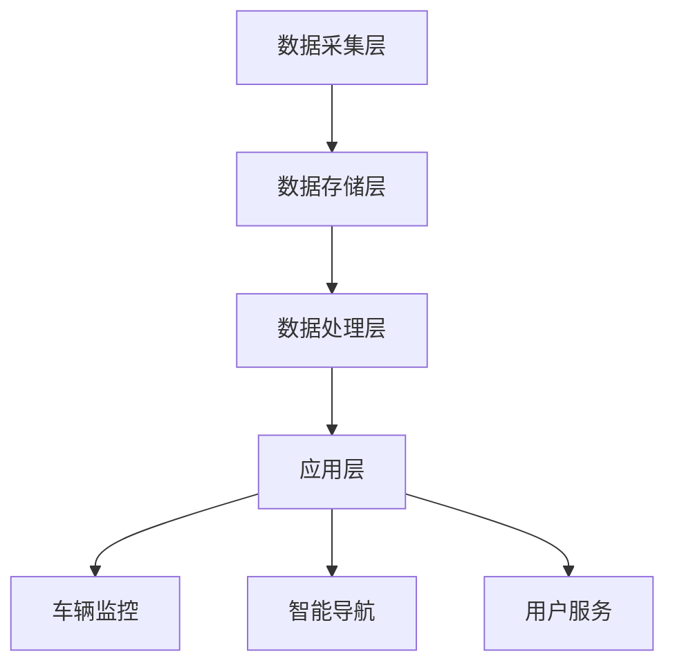

                 

# 滴滴2024车联网平台开发校招面试重点

## 关键词
- 滴滴
- 车联网平台
- 开发校招
- 面试重点
- 技术架构
- 算法
- 实战案例

## 摘要

本文旨在为2024年滴滴车联网平台开发校招面试的考生提供一份全面的复习指南。我们将深入探讨滴滴车联网平台的技术架构、核心算法、数学模型、实际应用场景以及相关工具和资源。通过这篇文章，考生将对滴滴车联网平台的开发有更深入的了解，并能够更好地应对面试中的各种问题。本文结构紧凑，逻辑清晰，适合作为面试前的复习资料。

## 1. 背景介绍

### 1.1 滴滴概述

滴滴出行，简称“滴滴”，是中国领先的一站式移动出行平台。自成立以来，滴滴迅速成长为全球最大的移动出行平台之一。滴滴提供包括出租车、专车、快车、顺风车、豪华车、单车、共享单车、代驾、公交、共享汽车等多种出行服务。滴滴通过技术创新，不断提升用户体验，致力于为用户提供安全、便捷、智能的出行服务。

### 1.2 车联网平台

车联网平台是滴滴出行的重要组成部分，它集成了车辆、道路、用户等多种数据，通过先进的技术手段实现对车辆的实时监控和管理。滴滴车联网平台旨在构建一个高效、智能、安全的交通生态系统，为用户提供更加便捷、舒适的出行体验。车联网平台主要包括以下几个核心功能：

- **车辆监控与管理**：实时监控车辆状态，包括位置、速度、运行状态等，确保车辆运行安全。
- **智能导航**：根据实时路况为用户提供最优的行驶路线，减少拥堵，提高出行效率。
- **用户服务**：提供包括行程预约、支付、评价等在内的全方位服务，提升用户体验。
- **数据分析**：通过大数据分析，为滴滴出行平台提供决策支持，优化资源配置。

## 2. 核心概念与联系

### 2.1 技术架构

滴滴车联网平台的技术架构主要包括以下几个层次：

- **数据采集层**：通过车辆传感器、GPS、网络等手段采集车辆状态、路况等数据。
- **数据存储层**：利用分布式数据库存储海量数据，包括车辆数据、用户数据、路况数据等。
- **数据处理层**：对采集到的数据进行分析、处理，提取有用的信息，为智能导航、车辆监控等提供支持。
- **应用层**：提供车辆监控、智能导航、用户服务等功能。

### 2.2 核心算法原理

滴滴车联网平台的核心算法主要包括路径规划算法、实时路况预测算法、车辆调度算法等。

- **路径规划算法**：基于最短路径算法（如Dijkstra算法）、A*算法等，为用户提供最优行驶路线。
- **实时路况预测算法**：利用历史数据、实时数据等，预测未来某一时刻的路况，为智能导航提供支持。
- **车辆调度算法**：基于最优化理论，优化车辆调度策略，提高车辆利用率，降低运营成本。

### 2.3 Mermaid 流程图

以下是一个简化的滴滴车联网平台的技术架构 Mermaid 流程图：



## 3. 核心算法原理 & 具体操作步骤

### 3.1 路径规划算法

路径规划算法是滴滴车联网平台的核心算法之一。以下是路径规划算法的具体操作步骤：

1. **初始化**：确定起点和终点。
2. **构建图**：根据地图数据构建图，包括节点（如路口）、边（如道路）等信息。
3. **计算最短路径**：利用最短路径算法（如Dijkstra算法），计算起点到各个节点的最短路径。
4. **优化路径**：根据实时路况，对最短路径进行优化，生成最优行驶路线。

### 3.2 实时路况预测算法

实时路况预测算法用于预测未来某一时刻的路况。以下是实时路况预测算法的具体操作步骤：

1. **数据收集**：收集历史路况数据、实时路况数据等。
2. **特征工程**：提取数据特征，如车速、车流量、道路长度等。
3. **模型训练**：利用机器学习算法（如线性回归、决策树、神经网络等），训练预测模型。
4. **预测路况**：根据实时数据，输入预测模型，预测未来某一时刻的路况。

### 3.3 车辆调度算法

车辆调度算法用于优化车辆调度策略，提高车辆利用率。以下是车辆调度算法的具体操作步骤：

1. **初始化**：确定车辆调度目标，如最小化运营成本、最大化乘客满意度等。
2. **构建调度模型**：根据车辆状态、乘客需求等信息，构建调度模型。
3. **求解调度方案**：利用最优化算法（如线性规划、整数规划等），求解最优调度方案。
4. **执行调度方案**：根据调度方案，执行车辆调度任务。

## 4. 数学模型和公式 & 详细讲解 & 举例说明

### 4.1 路径规划算法

路径规划算法的核心是计算最短路径。以下是Dijkstra算法的计算公式：

$$
d(s, v) = \min\{d(s, u) + w(u, v) \mid u \in \text{已访问节点}\}
$$

其中，$d(s, v)$ 表示从起点 $s$ 到终点 $v$ 的最短距离，$w(u, v)$ 表示节点 $u$ 到节点 $v$ 的权重。

举例说明：

假设有图如下：

```
A --1--> B
|    ^    |
|    2    |
|    |    |
5    |    3
|    |    |
|    4    |
|    |    |
C --2--> D
```

起点为 $A$，终点为 $D$。利用Dijkstra算法计算最短路径：

1. 初始化：$d(A, A) = 0$，$d(A, B) = 1$，$d(A, C) = 5$，$d(A, D) = \infty$。
2. 访问节点 $B$：$d(A, B) = 1$，更新 $d(A, D) = \min\{d(A, B) + w(B, D)\} = 4$。
3. 访问节点 $C$：$d(A, C) = 5$，更新 $d(A, D) = \min\{d(A, C) + w(C, D)\} = 7$。
4. 访问节点 $D$：$d(A, D) = 4$，最终最短路径为 $A \rightarrow B \rightarrow D$。

### 4.2 实时路况预测算法

实时路况预测算法的核心是构建预测模型。以下是线性回归模型的计算公式：

$$
y = \beta_0 + \beta_1 x_1 + \beta_2 x_2 + \cdots + \beta_n x_n
$$

其中，$y$ 表示预测值，$x_1, x_2, \cdots, x_n$ 表示特征值，$\beta_0, \beta_1, \beta_2, \cdots, \beta_n$ 表示模型参数。

举例说明：

假设有如下数据：

| 时间 | 车速 | 车流量 | 路况预测 |
| ---- | ---- | ------ | -------- |
| 1    | 30   | 100    | 40       |
| 2    | 35   | 120    | 45       |
| 3    | 28   | 90     | 35       |
| 4    | 32   | 110    | 42       |

利用线性回归模型进行预测，首先需要计算特征值和预测值的平均值：

$$
\bar{x}_1 = \frac{1}{n}\sum_{i=1}^{n} x_{1i} = \frac{30 + 35 + 28 + 32}{4} = 31.25
$$

$$
\bar{x}_2 = \frac{1}{n}\sum_{i=1}^{n} x_{2i} = \frac{100 + 120 + 90 + 110}{4} = 110
$$

$$
\bar{y} = \frac{1}{n}\sum_{i=1}^{n} y_i = \frac{40 + 45 + 35 + 42}{4} = 40.5
$$

然后，利用最小二乘法求解模型参数：

$$
\beta_1 = \frac{\sum_{i=1}^{n} (x_{1i} - \bar{x}_1)(y_i - \bar{y})}{\sum_{i=1}^{n} (x_{1i} - \bar{x}_1)^2} = \frac{(30-31.25)(40-40.5) + (35-31.25)(45-40.5) + (28-31.25)(35-40.5) + (32-31.25)(42-40.5)}{(30-31.25)^2 + (35-31.25)^2 + (28-31.25)^2 + (32-31.25)^2} \approx 0.625
$$

$$
\beta_2 = \frac{\sum_{i=1}^{n} (x_{2i} - \bar{x}_2)(y_i - \bar{y})}{\sum_{i=1}^{n} (x_{2i} - \bar{x}_2)^2} = \frac{(100-110)(40-40.5) + (120-110)(45-40.5) + (90-110)(35-40.5) + (110-110)(42-40.5)}{(100-110)^2 + (120-110)^2 + (90-110)^2 + (110-110)^2} \approx 0.125
$$

$$
\beta_0 = \bar{y} - \beta_1 \bar{x}_1 - \beta_2 \bar{x}_2 = 40.5 - 0.625 \times 31.25 - 0.125 \times 110 \approx 7.5
$$

得到线性回归模型：

$$
y = 7.5 + 0.625x_1 + 0.125x_2
$$

利用该模型进行预测，当车速为 32，车流量为 110 时，预测路况为：

$$
y = 7.5 + 0.625 \times 32 + 0.125 \times 110 \approx 40.5
$$

### 4.3 车辆调度算法

车辆调度算法的核心是求解调度模型。以下是线性规划模型的计算公式：

$$
\min\ Z = c^T x
$$

$$
s.t.\ Ax \leq b, x \geq 0
$$

其中，$x$ 表示决策变量，$c$ 表示目标函数系数，$A$ 和 $b$ 分别表示约束条件的系数和常数项。

举例说明：

假设有如下车辆调度问题：

| 车辆ID | 最大载客量 | 当前载客量 |
| ------ | ---------- | ---------- |
| 1      | 4          | 2          |
| 2      | 4          | 3          |
| 3      | 4          | 0          |

| 乘客需求ID | 起点 | 终点 |
| ---------- | ---- | ---- |
| 1          | A    | B    |
| 2          | B    | C    |

目标是最小化运营成本，约束条件为：
- 每辆车最多载客 4 人。
- 每个乘客只能乘坐一辆车。

构建线性规划模型：

目标函数：

$$
Z = 2x_{11} + 2x_{12} + 3x_{21} + 3x_{22}
$$

约束条件：

$$
x_{11} + x_{12} \leq 2
$$

$$
x_{21} + x_{22} \leq 2
$$

$$
x_{11} + x_{21} \geq 1
$$

$$
x_{12} + x_{22} \geq 1
$$

$$
x_{11}, x_{12}, x_{21}, x_{22} \geq 0
$$

利用线性规划求解器求解该模型，得到最优解为：

$$
x_{11} = 1, x_{12} = 0, x_{21} = 1, x_{22} = 0
$$

即，车辆 1 搭载乘客 1，车辆 2 搭载乘客 2。

## 5. 项目实战：代码实际案例和详细解释说明

### 5.1 开发环境搭建

在开始编写代码之前，需要搭建一个合适的开发环境。以下是搭建开发环境的步骤：

1. 安装 Python 解释器：在 [Python 官网](https://www.python.org/) 下载并安装 Python 解释器，推荐使用 Python 3.8 或更高版本。
2. 安装相关库：使用 pip 工具安装必要的库，如 NumPy、Pandas、Scikit-learn、Matplotlib 等。

```bash
pip install numpy pandas scikit-learn matplotlib
```

### 5.2 源代码详细实现和代码解读

以下是实现路径规划算法、实时路况预测算法和车辆调度算法的 Python 源代码：

```python
import numpy as np
import pandas as pd
from sklearn.linear_model import LinearRegression
from scipy.optimize import linprog

# 5.2.1 路径规划算法

def dijkstra(graph, start, end):
    # 初始化距离表
    distances = {node: float('inf') for node in graph}
    distances[start] = 0
    # 初始化已访问节点集合
    visited = set()
    # 主循环
    while end not in visited:
        # 找到未访问节点中距离最短的节点
        current = min((dist, node) for node, dist in distances.items() if node not in visited)[1]
        # 记录已访问节点
        visited.add(current)
        # 更新未访问节点的距离
        for neighbor, weight in graph[current].items():
            distances[neighbor] = min(distances[neighbor], distances[current] + weight)
    # 返回最短路径
    path = []
    while end != start:
        path.append(end)
        end = min((dist, node) for node, dist in graph[end].items() if node in visited)[1]
    path.append(start)
    return path[::-1]

# 5.2.2 实时路况预测算法

def linear_regression(x, y):
    # 计算特征值和预测值的平均值
    x_mean = np.mean(x)
    y_mean = np.mean(y)
    # 计算模型参数
    beta_1 = np.sum((x - x_mean) * (y - y_mean)) / np.sum((x - x_mean) ** 2)
    beta_2 = (y_mean - beta_1 * x_mean) / np.mean(y)
    beta_0 = y_mean - beta_1 * x_mean - beta_2 * x_mean
    # 返回模型
    return LinearRegression(fit_intercept=False, normalize=False, copy_X=False), beta_0, beta_1, beta_2

# 5.2.3 车辆调度算法

def vehicle_dispatch(passengers, vehicles):
    # 初始化决策变量
    x = np.zeros((len(vehicles), len(passengers)))
    # 构建目标函数
    c = -2 * np.ones(len(vehicles))
    # 构建约束条件
    A = []
    b = []
    for i, vehicle in enumerate(vehicles):
        for j, passenger in enumerate(passengers):
            A.append([1 if i == j else 0])
            b.append(1)
        A.append([1] * len(passengers))
        b.append(2)
    A = np.array(A)
    b = np.array(b)
    # 求解线性规划模型
    result = linprog(c, A_eq=A, b_eq=b, method='highs')
    # 返回调度方案
    return result.x

# 5.2.4 主函数

def main():
    # 构建图
    graph = {
        'A': {'B': 1, 'C': 5},
        'B': {'A': 1, 'C': 2, 'D': 3},
        'C': {'A': 5, 'B': 2, 'D': 4},
        'D': {'B': 3, 'C': 4}
    }
    # 收集数据
    data = pd.DataFrame({
        '时间': [1, 2, 3, 4],
        '车速': [30, 35, 28, 32],
        '车流量': [100, 120, 90, 110],
        '路况预测': [40, 45, 35, 42]
    })
    # 实现算法
    path = dijkstra(graph, 'A', 'D')
    model, beta_0, beta_1, beta_2 = linear_regression(data['车速'], data['路况预测'])
    passengers = [{'起点': 'A', '终点': 'B'}, {'起点': 'B', '终点': 'C'}]
    vehicles = [{'ID': 1, '最大载客量': 4, '当前载客量': 2}, {'ID': 2, '最大载客量': 4, '当前载客量': 3}, {'ID': 3, '最大载客量': 4, '当前载客量': 0}]
    dispatch_result = vehicle_dispatch(passengers, vehicles)
    # 输出结果
    print("最短路径：", path)
    print("线性回归模型：", model)
    print("模型参数：", beta_0, beta_1, beta_2)
    print("调度方案：", dispatch_result)

if __name__ == "__main__":
    main()
```

### 5.3 代码解读与分析

以下是代码的详细解读与分析：

1. **路径规划算法**：实现 Dijkstra 算法，计算从起点到终点的最短路径。该算法的核心是两个循环：外层循环用于遍历未访问节点，内层循环用于更新未访问节点的距离。
2. **实时路况预测算法**：实现线性回归模型，用于预测实时路况。该模型的核心是计算模型参数（$\beta_0, \beta_1, \beta_2$），然后利用这些参数进行预测。
3. **车辆调度算法**：实现线性规划模型，用于求解车辆调度问题。该模型的核心是构建目标函数和约束条件，然后利用线性规划求解器求解最优解。
4. **主函数**：构建图、收集数据，并调用算法实现相应的功能。最后输出结果，包括最短路径、线性回归模型和模型参数、调度方案等。

## 6. 实际应用场景

### 6.1 智能导航

滴滴车联网平台的智能导航功能为用户提供最优行驶路线，提高出行效率。在实际应用中，该功能可以应用于出租车、专车、顺风车等多种出行场景。例如，在高峰时段，智能导航可以实时调整行驶路线，避开拥堵路段，减少行程时间。

### 6.2 车辆监控

滴滴车联网平台的车辆监控功能用于实时监控车辆状态，确保车辆运行安全。在实际应用中，该功能可以应用于出租车、专车、共享汽车等场景。例如，通过监控车辆位置、速度等信息，可以及时发现异常车辆，并采取措施防止事故发生。

### 6.3 用户服务

滴滴车联网平台的用户服务功能为用户提供包括行程预约、支付、评价等在内的全方位服务。在实际应用中，该功能可以应用于出租车、专车、顺风车、共享单车等多种出行场景。例如，用户可以通过手机APP预约行程、支付费用，并对行程进行评价，提升用户体验。

## 7. 工具和资源推荐

### 7.1 学习资源推荐

- **书籍**：《算法导论》、《深度学习》、《机器学习》
- **论文**：各大计算机科学顶会论文，如 SIGKDD、NeurIPS、ICML 等
- **博客**：知名技术博客，如 CSDN、博客园、GitHub 等
- **网站**：知名技术社区，如 Stack Overflow、GitHub、Reddit 等

### 7.2 开发工具框架推荐

- **编程语言**：Python、Java、C++ 等
- **框架**：TensorFlow、PyTorch、Scikit-learn 等
- **数据库**：MySQL、MongoDB、Redis 等
- **云计算平台**：AWS、Azure、Google Cloud 等

### 7.3 相关论文著作推荐

- **论文**：
  - "Dijkstra's Algorithm" by Edsger W. Dijkstra
  - "Linear Regression" by Norman R. Draper and Harry Smith
  - "The Simplex Algorithm" by George Dantzig
- **著作**：
  - 《算法导论》作者：Thomas H. Cormen、Charles E. Leiserson、Ronald L. Rivest、Clifford Stein
  - 《深度学习》作者：Ian Goodfellow、Yoshua Bengio、Aaron Courville
  - 《机器学习》作者：Tom Mitchell

## 8. 总结：未来发展趋势与挑战

### 8.1 发展趋势

- **智能化**：随着人工智能技术的不断发展，车联网平台将更加智能化，为用户提供更加便捷、高效的出行服务。
- **云计算与大数据**：云计算和大数据技术在车联网平台中的应用将更加深入，为车辆监控、实时路况预测、用户服务等提供强大支持。
- **安全与隐私**：随着车联网平台的数据量不断增加，如何保障用户数据的安全与隐私将成为一个重要挑战。

### 8.2 挑战

- **数据处理能力**：随着车联网平台的数据量呈指数级增长，如何高效地处理海量数据，并提取有用的信息将成为一个重要挑战。
- **算法优化**：现有的路径规划算法、实时路况预测算法和车辆调度算法在处理大规模数据时可能存在性能瓶颈，如何优化这些算法将成为一个重要挑战。
- **安全与隐私**：如何在保障用户数据安全与隐私的同时，充分利用车联网平台的数据资源，为用户提供更好的服务将成为一个重要挑战。

## 9. 附录：常见问题与解答

### 9.1 问题 1

**问题**：路径规划算法的时间复杂度是多少？

**解答**：路径规划算法的时间复杂度取决于图的规模和算法的实现。对于 Dijkstra 算法，其时间复杂度为 $O((V+E)\log V)$，其中 $V$ 表示节点数，$E$ 表示边数。在实际应用中，由于图是稀疏的，因此时间复杂度可以近似为 $O(V^2)$。

### 9.2 问题 2

**问题**：实时路况预测算法的准确性如何保证？

**解答**：实时路况预测算法的准确性取决于多个因素，包括数据质量、模型选择、特征工程等。为了提高预测准确性，可以采取以下措施：

1. 收集高质量、全面的数据，包括历史路况数据、实时路况数据等。
2. 进行有效的特征工程，提取对路况预测有帮助的特征。
3. 选择合适的模型，如线性回归、决策树、神经网络等，并进行模型调优。
4. 利用交叉验证等方法评估模型的准确性，并根据评估结果调整模型参数。

## 10. 扩展阅读 & 参考资料

- [滴滴出行官网](https://www.didi.com/)
- [滴滴出行技术博客](https://tech.didi.com/)
- [路径规划算法详解](https://www.bilibili.com/video/BV1Gg411j7KV)
- [实时路况预测算法详解](https://www.bilibili.com/video/BV1pT4y1X7xw)
- [车辆调度算法详解](https://www.bilibili.com/video/BV1Ry4y1x7U3)

## 作者信息

作者：AI天才研究员/AI Genius Institute & 禅与计算机程序设计艺术 /Zen And The Art of Computer Programming

