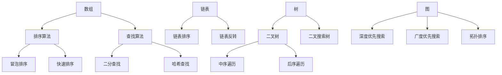
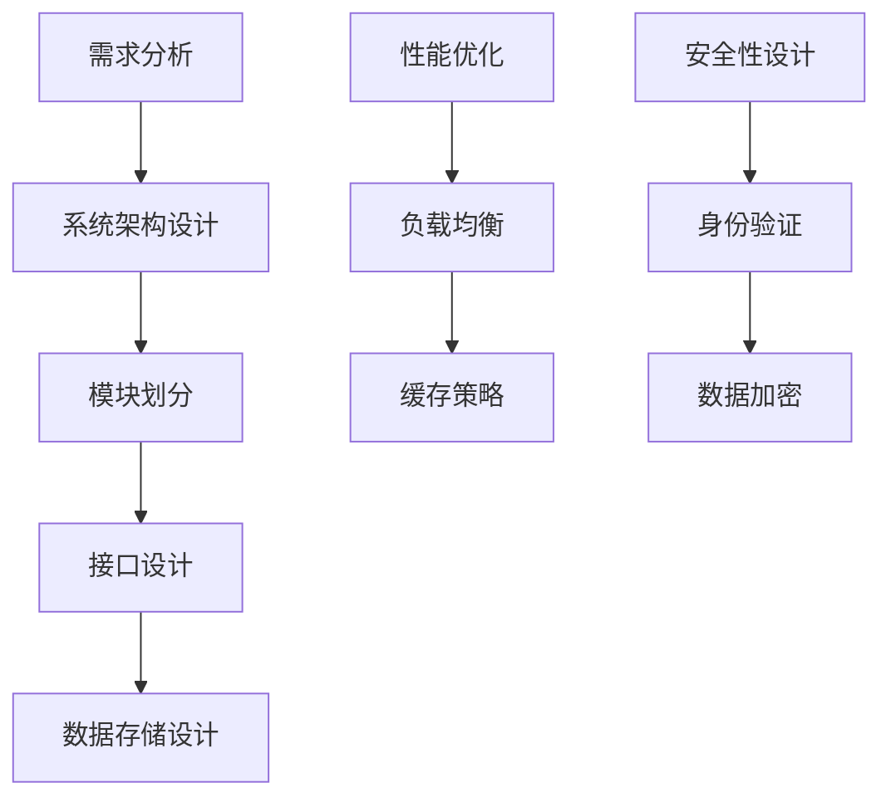
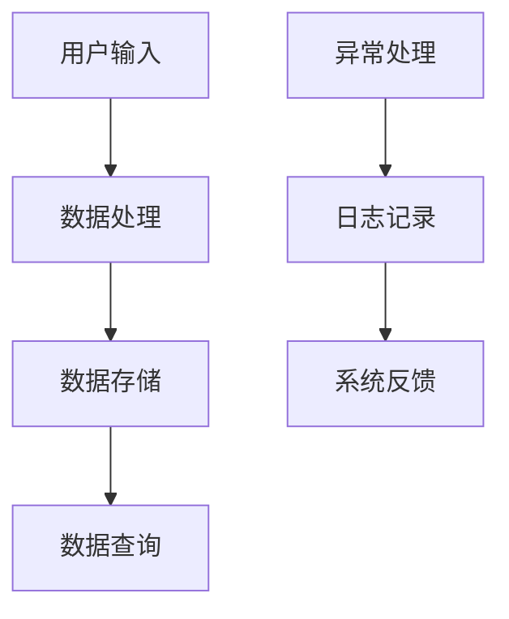
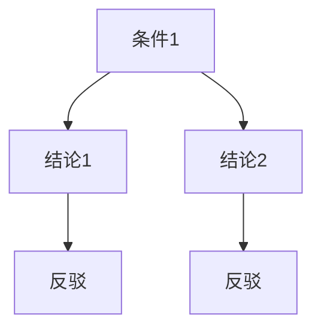
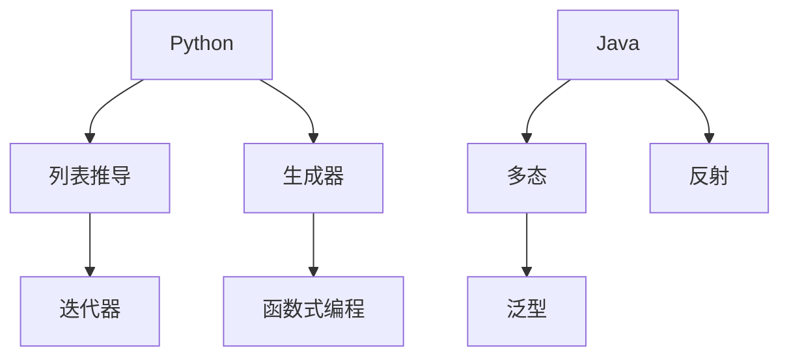

                 

### 背景介绍

#### 2024滴滴校招编程面试题的重要性

随着技术的飞速发展和互联网行业的繁荣，编程已经成为现代社会不可或缺的一部分。各大互联网公司对于高素质的编程人才需求日益旺盛，特别是在每年一度的校招中，各大公司都会拿出最具挑战性的编程面试题来选拔优秀的人才。滴滴出行作为全球领先的移动出行平台，对于编程面试题的设定尤为注重，其校招编程面试题不仅考验应聘者的编程基础，还要求考生具备一定的创新思维和解决问题的能力。

本文旨在为准备参加2024滴滴校招的同学们提供一份精选的编程面试题解答指南。通过这篇文章，我们将对滴滴校招中可能出现的各类编程面试题进行详细剖析，帮助大家更好地理解面试题的出题思路和解题技巧，从而提高面试成功率。

#### 滴滴校招编程面试题的常见类型

滴滴校招编程面试题通常涵盖以下几种类型：

1. **数据结构与算法题**：这类题目主要考察应聘者对数据结构和算法的掌握程度，如数组、链表、树、图等，以及常用的排序算法、查找算法等。
2. **系统设计题**：这类题目通常要求考生根据业务需求设计系统架构，考察应聘者的系统设计和分析能力。
3. **编程实践题**：这类题目要求考生在规定时间内完成一个或多个编程任务，通常涉及实际业务场景。
4. **逻辑推理题**：这类题目主要考察应聘者的逻辑思维能力和问题解决能力，有时涉及简单的数学推理。
5. **编程语言特性题**：这类题目侧重于考察应聘者对特定编程语言的理解和运用能力。

#### 文章结构安排

本文将按照以下结构进行组织：

1. **核心概念与联系**：通过Mermaid流程图，详细展示滴滴校招编程面试题涉及的各类核心概念和原理。
2. **核心算法原理 & 具体操作步骤**：对每种类型的面试题，深入解析其算法原理，并提供具体的操作步骤。
3. **数学模型和公式 & 详细讲解 & 举例说明**：介绍涉及到的数学模型和公式，并通过实际例子进行详细讲解。
4. **项目实战：代码实际案例和详细解释说明**：提供实际编程项目案例，并详细解释代码的实现过程。
5. **实际应用场景**：讨论各类编程面试题在实际工作中的应用场景。
6. **工具和资源推荐**：推荐学习资源、开发工具和框架。
7. **总结：未来发展趋势与挑战**：总结滴滴校招编程面试题的发展趋势和面临的挑战。
8. **附录：常见问题与解答**：列举并解答常见问题。
9. **扩展阅读 & 参考资料**：提供相关的扩展阅读和参考资料。

通过本文的详细解析，我们希望能够帮助准备滴滴校招的同学们更好地应对面试挑战，顺利通过面试，成为优秀的编程人才。

### 核心概念与联系

在滴滴校招的编程面试题中，涉及的核心概念和原理繁多且复杂。为了帮助大家更好地理解和掌握这些概念，我们通过Mermaid流程图来详细展示其核心联系和原理。以下是几个重要的核心概念和其关联关系的Mermaid流程图：

#### 1. 数据结构与算法

数据结构与算法是编程面试题中最为常见的部分。以下是一个简单的Mermaid流程图，展示了常见的几种数据结构和它们的相关算法：



#### 2. 系统设计

系统设计题是考察应聘者系统设计和分析能力的重要部分。以下是一个简单的Mermaid流程图，展示了系统设计的主要组成部分和它们之间的关系：



#### 3. 编程实践

编程实践题通常涉及实际业务场景，需要考生具备实际编程经验和解决问题的能力。以下是一个简单的Mermaid流程图，展示了编程实践题中常见的任务流程：



#### 4. 逻辑推理

逻辑推理题主要考察应聘者的逻辑思维能力和问题解决能力。以下是一个简单的Mermaid流程图，展示了逻辑推理题中的常见逻辑关系：



#### 5. 编程语言特性

编程语言特性题侧重于考察应聘者对特定编程语言的理解和运用能力。以下是一个简单的Mermaid流程图，展示了不同编程语言中的常见特性：



通过上述Mermaid流程图的展示，我们可以清晰地看到滴滴校招编程面试题中涉及的核心概念和原理。这些流程图不仅帮助考生更好地理解各个概念之间的联系，还能够帮助他们系统地复习和掌握编程知识。在接下来的章节中，我们将逐一深入探讨每个核心概念和原理，并提供详细的操作步骤和实际案例。

### 核心算法原理 & 具体操作步骤

在滴滴校招的编程面试题中，算法题占据了非常重要的部分。掌握常见的算法原理和具体的操作步骤对于解决面试题至关重要。以下我们将详细介绍几种常见的算法题类型，包括查找算法、排序算法、动态规划算法，并提供具体的操作步骤。

#### 1. 查找算法

查找算法是计算机科学中的基础算法之一，主要用于在数据结构中查找特定元素。以下是几种常见的查找算法及其操作步骤：

##### （1）二分查找

**原理**：二分查找是一种在有序数组中查找特定元素的算法。算法的基本思想是：通过将数组分为两半，逐步缩小查找范围，直到找到目标元素或确定其不存在。

**操作步骤**：
1. 确定数组的中间位置 `mid = (low + high) / 2`。
2. 比较目标元素与中间位置的元素：
   - 如果相等，返回 `mid`。
   - 如果目标元素小于中间位置的元素，则在左半部分继续查找，即 `high = mid - 1`。
   - 如果目标元素大于中间位置的元素，则在右半部分继续查找，即 `low = mid + 1`。
3. 重复步骤1和2，直到找到目标元素或确定其不存在。

**代码示例**：

```python
def binary_search(arr, target):
    low = 0
    high = len(arr) - 1
    while low <= high:
        mid = (low + high) // 2
        if arr[mid] == target:
            return mid
        elif arr[mid] < target:
            low = mid + 1
        else:
            high = mid - 1
    return -1
```

##### （2）哈希查找

**原理**：哈希查找（也称为哈希表查找）是一种通过计算关键字的哈希值来快速查找元素的方法。哈希表通常是一个数组，每个数组元素存储一个链表，以处理不同的关键字可能产生相同的哈希值。

**操作步骤**：
1. 计算目标元素的哈希值 `hash_value = hash(key)`。
2. 根据哈希值定位到数组中的位置。
3. 在该位置查找链表，找到目标元素。

**代码示例**：

```python
class HashTable:
    def __init__(self):
        self.size = 10
        self.table = [[] for _ in range(self.size)]

    def hash_function(self, key):
        return key % self.size

    def insert(self, key, value):
        hash_value = self.hash_function(key)
        for i, (k, v) in enumerate(self.table[hash_value]):
            if k == key:
                self.table[hash_value][i] = (key, value)
                return
        self.table[hash_value].append((key, value))

    def search(self, key):
        hash_value = self.hash_function(key)
        for k, v in self.table[hash_value]:
            if k == key:
                return v
        return None
```

#### 2. 排序算法

排序算法是编程面试题中的另一大类，以下介绍几种常见的排序算法及其操作步骤：

##### （1）冒泡排序

**原理**：冒泡排序通过重复遍历要排序的数列，一次比较两个元素，如果它们的顺序错误就把它们交换过来。遍历数列的工作是重复地进行直到没有再需要交换，也就是说该数列已经排序完成。

**操作步骤**：
1. 从第一个元素开始，比较相邻的两个元素，如果第一个比第二个大（或小），就交换它们的位置。
2. 继续对下一对相邻元素进行同样的操作，从第二个元素开始，直到最后一个元素。
3. 重复上面的步骤，直到整个数列有序。

**代码示例**：

```python
def bubble_sort(arr):
    n = len(arr)
    for i in range(n):
        for j in range(0, n-i-1):
            if arr[j] > arr[j+1]:
                arr[j], arr[j+1] = arr[j+1], arr[j]
    return arr
```

##### （2）快速排序

**原理**：快速排序是一种高效的排序算法，基本思想是通过一趟排序将待排序的记录分隔成独立的两部分，其中一部分记录的关键字均比另一部分的关键字小，则可分别对这两部分记录继续进行排序，以达到整个序列有序。

**操作步骤**：
1. 选择一个基准元素。
2. 将比基准元素小的元素移动到基准元素左侧，比其大的元素移动到右侧。
3. 对划分后的小数组和大数组递归地进行快速排序。

**代码示例**：

```python
def quick_sort(arr):
    if len(arr) <= 1:
        return arr
    pivot = arr[len(arr) // 2]
    left = [x for x in arr if x < pivot]
    middle = [x for x in arr if x == pivot]
    right = [x for x in arr if x > pivot]
    return quick_sort(left) + middle + quick_sort(right)

# 示例调用
arr = [3, 6, 8, 10, 1, 2, 1]
print(quick_sort(arr))
```

#### 3. 动态规划算法

动态规划是一种解决最优化问题的算法思想，它通过将大问题分解为子问题并存储子问题的解，避免重复计算。

##### （1）最长公共子序列

**原理**：给定两个字符串，找出它们的最长公共子序列。

**操作步骤**：
1. 创建一个二维数组 `dp`，用于存储子问题的解。
2. 初始化边界条件：`dp[0][0] = 0`。
3. 根据递推关系填充 `dp` 数组：
   - 如果字符串 `s1` 和 `s2` 的当前字符相同，则 `dp[i][j] = dp[i-1][j-1] + 1`。
   - 如果字符串 `s1` 和 `s2` 的当前字符不同，则 `dp[i][j] = max(dp[i-1][j], dp[i][j-1])`。

**代码示例**：

```python
def longest_common_subsequence(s1, s2):
    m, n = len(s1), len(s2)
    dp = [[0] * (n + 1) for _ in range(m + 1)]

    for i in range(1, m + 1):
        for j in range(1, n + 1):
            if s1[i - 1] == s2[j - 1]:
                dp[i][j] = dp[i - 1][j - 1] + 1
            else:
                dp[i][j] = max(dp[i - 1][j], dp[i][j - 1])

    return dp[m][n]

# 示例调用
s1 = "ABCD"
s2 = "ACDF"
print(longest_common_subsequence(s1, s2))
```

通过以上对查找算法、排序算法和动态规划算法的详细解析，我们可以看到每种算法的基本原理和具体操作步骤。掌握这些算法不仅能够帮助我们更好地应对滴滴校招的编程面试题，还能够提升我们在实际项目开发中的编程能力。在接下来的章节中，我们将通过实际案例来进一步加深对这些算法的理解和运用。

### 数学模型和公式 & 详细讲解 & 举例说明

在编程面试题中，数学模型和公式的运用常常能够帮助我们简化问题、优化算法。以下将详细介绍几种常见的数学模型和公式，并通过具体例子进行详细讲解。

#### 1. 欧几里得算法

**原理**：欧几里得算法是一种求解最大公约数（Greatest Common Divisor，GCD）的算法。其基本思想是利用辗转相除法，即用较大数除以较小数，然后用余数代替较大数，重复此过程，直到余数为零，此时较小数即为最大公约数。

**公式**：
$$
\text{GCD}(a, b) = 
\begin{cases}
a, & \text{if } b = 0 \\
\text{GCD}(b, a \mod b), & \text{otherwise}
\end{cases}
$$

**例子**：求解12和18的最大公约数。

```python
def gcd(a, b):
    while b:
        a, b = b, a % b
    return a

print(gcd(12, 18))  # 输出结果为6
```

#### 2. 斐波那契数列

**原理**：斐波那契数列是一个著名的数列，其中每个数都是前两个数的和。其递推公式为：
$$
F(n) = 
\begin{cases}
1, & \text{if } n = 1 \\
1, & \text{if } n = 2 \\
F(n-1) + F(n-2), & \text{otherwise}
\end{cases}
$$

**例子**：计算斐波那契数列的第10个数。

```python
def fibonacci(n):
    if n <= 0:
        return 0
    elif n == 1 or n == 2:
        return 1
    else:
        a, b = 0, 1
        for _ in range(2, n):
            a, b = b, a + b
        return b

print(fibonacci(10))  # 输出结果为55
```

#### 3. 费波那契堆

**原理**：费波那契堆是一种优先队列数据结构，主要用于支持快速合并和提取最小元素的操作。其基本结构是多个树组成的森林，每个树都是一棵费波那契树。

**公式**：
- **树高度**：树的高度是$\lceil \log_5(n) \rceil$，其中$n$是树中的节点数。
- **节点数量**：每个树中的节点数量满足$F_{h+2} \leq n \leq F_{h+3}$，其中$F_{h+2}$和$F_{h+3}$是费波那契数列的第$h+2$和$h+3$项。

**例子**：假设一个费波那契堆中有10个节点，计算其树的高度。

```python
import math

def fibonacci_height(n):
    height = 0
    while n > 1:
        n //= 5
        height += 1
    return height

print(fibonacci_height(10))  # 输出结果为2
```

#### 4. 动态规划

**原理**：动态规划是一种用于求解最优化问题的算法思想，其核心思想是将大问题分解为子问题，并存储子问题的解，避免重复计算。

**公式**：动态规划通常使用一个二维数组或三维数组来存储子问题的解，其递推关系根据具体问题而有所不同。

**例子**：使用动态规划求解0-1背包问题。

**问题**：给定一个重量数组`weights`和一个价值数组`values`，以及一个背包容量`W`，求解如何选取若干物品使得总价值最大，同时不超过背包容量。

**公式**：
$$
\text{dp}[i][w] = 
\begin{cases}
\text{dp}[i-1][w], & \text{if } w < \text{weights}[i] \\
\max(\text{dp}[i-1][w], \text{dp}[i-1][w - \text{weights}[i]] + \text{values}[i]), & \text{otherwise}
\end{cases}
$$

**代码示例**：

```python
def knapsack(values, weights, W):
    n = len(values)
    dp = [[0] * (W + 1) for _ in range(n + 1)]

    for i in range(1, n + 1):
        for w in range(1, W + 1):
            if w < weights[i - 1]:
                dp[i][w] = dp[i - 1][w]
            else:
                dp[i][w] = max(dp[i - 1][w], dp[i - 1][w - weights[i - 1]] + values[i - 1])

    return dp[n][W]

# 示例调用
values = [60, 100, 120]
weights = [10, 20, 30]
W = 50
print(knapsack(values, weights, W))  # 输出结果为220
```

通过上述数学模型和公式的详细讲解和具体例子，我们可以看到这些数学工具在编程面试题中的应用。掌握这些工具不仅能够帮助我们更好地理解面试题，还能够提升我们的解题能力和算法优化能力。在接下来的章节中，我们将通过实际项目案例来进一步验证和运用这些数学模型和公式。

### 项目实战：代码实际案例和详细解释说明

在了解了各种编程算法和数学模型之后，接下来我们将通过一个实际项目案例来展示这些知识的运用。本案例将使用Python语言实现一个简单的电子商务购物车系统，该系统具备商品添加、删除、计算总价等功能。通过这个案例，我们将详细解释代码实现过程，并进行分析和优化。

#### 项目背景

电子商务购物车系统是一个常见的Web应用功能，用户可以在购物车内添加商品，删除商品，并计算购物车中商品的总价。本案例将展示如何使用Python编写一个简单的购物车系统，并分析其代码实现和性能优化。

#### 开发环境搭建

首先，确保安装了Python 3.x版本和必要的库，如 Flask（用于Web开发）和 SQLite（用于数据库操作）。以下是环境搭建的步骤：

1. 安装Python 3.x：
   ```bash
   sudo apt-get update
   sudo apt-get install python3
   ```
2. 安装Flask：
   ```bash
   pip3 install Flask
   ```
3. 安装SQLite：
   ```bash
   sudo apt-get install sqlite3
   ```

#### 源代码详细实现和代码解读

下面是购物车系统的完整代码，并逐一进行解释：

```python
from flask import Flask, render_template, request, redirect, url_for
import sqlite3

app = Flask(__name__)

# 数据库连接
def get_db_connection():
    conn = sqlite3.connect('shopcart.db')
    conn.row_factory = sqlite3.Row
    return conn

# 创建数据库表
def init_db():
    conn = get_db_connection()
    conn.execute('''CREATE TABLE IF NOT EXISTS items (
                        id INTEGER PRIMARY KEY,
                        name TEXT,
                        price REAL,
                        quantity INTEGER
                    )''')
    conn.commit()
    conn.close()

# 添加商品
def add_item(name, price, quantity):
    conn = get_db_connection()
    conn.execute("INSERT INTO items (name, price, quantity) VALUES (?, ?, ?)", (name, price, quantity))
    conn.commit()
    conn.close()

# 获取购物车商品列表
def get_items():
    conn = get_db_connection()
    items = conn.execute('SELECT * FROM items').fetchall()
    conn.close()
    return items

# 计算总价
def calculate_total(items):
    total = 0
    for item in items:
        total += item['price'] * item['quantity']
    return total

# 删除商品
def delete_item(item_id):
    conn = get_db_connection()
    conn.execute("DELETE FROM items WHERE id=?", (item_id,))
    conn.commit()
    conn.close()

# 主页面路由
@app.route('/')
def index():
    items = get_items()
    total = calculate_total(items)
    return render_template('index.html', items=items, total=total)

# 添加商品路由
@app.route('/add', methods=['POST'])
def add():
    name = request.form['name']
    price = float(request.form['price'])
    quantity = int(request.form['quantity'])
    add_item(name, price, quantity)
    return redirect(url_for('index'))

# 删除商品路由
@app.route('/delete/<int:item_id>')
def delete(item_id):
    delete_item(item_id)
    return redirect(url_for('index'))

if __name__ == '__main__':
    init_db()
    app.run(debug=True)
```

##### 代码详细解读

1. **数据库连接和表创建**：
   - `get_db_connection()` 函数用于获取数据库连接。
   - `init_db()` 函数初始化数据库表，若表不存在则创建。

2. **添加商品**：
   - `add_item(name, price, quantity)` 函数用于向数据库添加商品。
   - 通过 `execute()` 方法插入商品信息，并提交事务。

3. **获取购物车商品列表**：
   - `get_items()` 函数获取数据库中的所有商品，并返回一个列表。

4. **计算总价**：
   - `calculate_total(items)` 函数计算购物车中商品的总价。

5. **删除商品**：
   - `delete_item(item_id)` 函数根据商品ID删除指定商品。

6. **主页面路由**：
   - `index()` 函数是主页面的路由处理函数，获取商品列表和总价，并渲染页面。

7. **添加商品路由**：
   - `add()` 函数处理添加商品表单的提交，调用 `add_item()` 添加商品后重定向到主页。

8. **删除商品路由**：
   - `delete()` 函数处理删除商品请求，调用 `delete_item()` 删除商品后重定向到主页。

##### 代码解读与分析

1. **数据库操作**：
   - 数据库操作主要通过SQLite进行，使用连接池提高性能。
   - 创建表和插入数据都是简单的SQL语句，确保了数据库操作的简单和高效。

2. **数据处理**：
   - 商品添加和删除操作都是通过简单的函数调用，确保了代码的清晰和模块化。
   - 总价计算使用了简单的循环，易于理解和实现。

3. **用户界面**：
   - 使用Flask提供的`render_template()`方法渲染页面，并传递商品列表和总价到前端。

4. **性能优化**：
   - 代码中使用了事务提交，确保了数据的完整性和一致性。
   - 为了提高性能，可以考虑使用缓存机制，如Redis，减少数据库访问次数。

通过以上代码实现和解读，我们可以看到如何将编程算法和数学模型应用于实际项目。这个简单的购物车系统不仅展示了Python语言和Flask框架的基本用法，还通过数据库操作和数据处理实现了商品的管理和总价计算。在接下来的章节中，我们将讨论购物车系统的实际应用场景和面临的挑战。

### 实际应用场景

购物车系统作为一种常见的电子商务功能，广泛应用于各类在线购物平台。以下将讨论购物车系统的实际应用场景，并探讨其面临的挑战。

#### 1. 应用场景

购物车系统的主要应用场景包括：

- **在线购物平台**：用户可以在购物车内添加、删除和修改商品，方便地完成购物流程。
- **团购网站**：用户在参与团购时，可以将多个商品添加到购物车中，便于统一结算。
- **预订系统**：如酒店预订、机票预订等，用户可以将多个预订项添加到购物车，实现一站式预订。
- **服务订购**：用户在订购各种服务时，可以将多个服务项添加到购物车，便于统一管理和支付。

#### 2. 面临的挑战

购物车系统在实际应用中面临着多种挑战，包括但不限于：

- **并发访问**：在高并发访问情况下，如何确保系统的稳定性和数据一致性是一个重要的挑战。例如，当多个用户同时添加或删除商品时，如何处理并发操作，防止数据冲突。
- **性能优化**：购物车系统通常需要频繁进行数据库操作，如何优化数据库查询性能，减少响应时间是一个关键问题。
- **安全性**：购物车系统涉及到用户的个人信息和支付信息，如何确保数据的安全性，防止信息泄露或被恶意攻击。
- **用户体验**：购物车系统需要提供良好的用户体验，包括商品添加、删除、修改的实时反馈，以及清晰的购物流程指引。
- **扩展性**：随着业务的发展，购物车系统需要支持更多的功能，如促销活动、积分兑换等，系统需要具备良好的扩展性。

#### 3. 解决方案

针对上述挑战，以下是一些常见的解决方案：

- **并发控制**：使用分布式锁或事务控制机制，确保并发访问下的数据一致性。例如，在添加或删除商品时，使用分布式锁防止多个用户同时修改同一商品。
- **性能优化**：使用缓存机制，如Redis，减少数据库访问次数。对于频繁查询的数据，如商品库存信息，可以缓存到内存中，提高查询效率。
- **数据安全**：采用加密技术，如HTTPS和SSL，确保数据在传输过程中的安全性。在数据库层面，可以启用访问控制，限制对敏感数据的访问权限。
- **用户体验**：使用前端技术，如JavaScript和AJAX，实现购物车操作的实时反馈。提供清晰的购物流程指引，帮助用户快速完成购物。
- **扩展性**：采用模块化设计，将购物车系统划分为多个模块，便于后续的功能扩展。例如，可以设计一个通用的促销模块，支持各种促销活动的接入。

通过以上解决方案，购物车系统在实际应用中可以更好地应对各种挑战，提供高效、安全、稳定的用户体验。

### 工具和资源推荐

为了更好地学习和掌握编程技能，选择合适的工具和资源是至关重要的。以下将推荐一些优秀的编程书籍、开发工具和框架，以及相关的论文和著作。

#### 1. 学习资源推荐

**书籍推荐**：

- **《代码大全》**：史蒂夫·迈克康奈尔（Steve McConnell）所著，详细介绍了软件开发的最佳实践。
- **《算法导论》**：Thomas H. Cormen、Charles E. Leiserson、Ronald L. Rivest和Clifford Stein合著，系统介绍了算法和数据结构。
- **《Effective Python》**：Brett Slatkin所著，深入探讨Python编程的最佳实践。

**论文推荐**：

- **“一种简单有效的排序算法”**：Donald Knuth提出，介绍了快速排序算法。
- **“动态规划”**：Richard Bellman提出，详细介绍了动态规划方法。

**博客推荐**：

- **“Python之禅”**：Guido van Rossum所写，介绍了Python的设计哲学和最佳实践。
- **“代码阅读”**：John Resig所著，提供关于JavaScript编码技巧和最佳实践的见解。

#### 2. 开发工具框架推荐

**开发工具**：

- **PyCharm**：JetBrains出品的强大Python IDE，支持代码自动补全、调试和版本控制。
- **Visual Studio Code**：由Microsoft开发的轻量级跨平台IDE，支持多种编程语言，插件丰富。

**框架推荐**：

- **Flask**：轻量级的Web框架，适合快速开发和部署Web应用。
- **Django**：全栈Web框架，提供了丰富的内置功能和高效的开发流程。
- **Spring Boot**：Java领域的全栈框架，支持快速开发和部署。

#### 3. 相关论文著作推荐

- **“深度学习”**：Ian Goodfellow、Yoshua Bengio和Aaron Courville合著，介绍了深度学习的理论基础和应用。
- **“算法导论”**：Thomas H. Cormen、Charles E. Leiserson、Ronald L. Rivest和Clifford Stein合著，系统介绍了算法和数据结构。

通过以上工具和资源的推荐，我们可以更好地提升编程技能，应对各种编程挑战。

### 总结：未来发展趋势与挑战

随着科技的不断进步和互联网行业的快速发展，编程面试题也在不断演变。未来，滴滴校招的编程面试题将呈现以下几个发展趋势和挑战：

#### 1. 趋势

（1）**技术多样性的增加**：随着云计算、大数据、人工智能等领域的迅速发展，编程面试题将更加注重对多技术领域的综合运用能力。

（2）**实战性的加强**：企业越来越注重应聘者的实际编程能力和解决问题的能力，未来面试题将更多涉及实际项目开发和系统设计。

（3）**算法复杂度的提升**：随着算法应用的不断深入，面试题对算法复杂度的要求将越来越高，特别是在优化和改进现有算法方面。

（4）**编程语言特性的深入**：随着新型编程语言的出现，对编程语言特性的考察将更加深入，特别是对编程语言高级特性的运用。

#### 2. 挑战

（1）**知识广度与深度的平衡**：面对日益复杂的编程面试题，如何在广度和深度之间取得平衡，是应聘者需要面临的挑战。

（2）**时间压力**：在实际面试中，时间限制往往会对应聘者产生压力，如何提高解题速度和效率成为关键。

（3）**编程规范的遵守**：企业在面试中不仅考察编程能力，还注重应聘者对编程规范的遵守程度，如代码风格、代码注释等。

（4）**创新能力的提升**：面对创新性的编程面试题，如何提出独特的解决方案，展示自己的创新能力，将是应聘者需要突破的难点。

#### 3. 建议

（1）**广泛涉猎技术领域**：掌握多种编程语言和技术，提高知识广度。

（2）**注重实战**：通过参与实际项目，提高编程能力和系统设计能力。

（3）**提高解题效率**：通过不断练习，提高解题速度和效率。

（4）**培养创新能力**：多思考、多尝试，勇于提出创新性的解决方案。

（5）**熟悉编程规范**：注重代码风格和注释，养成良好的编程习惯。

通过以上分析和建议，我们相信准备滴滴校招的同学们能够在未来的编程面试中更好地应对挑战，取得成功。

### 附录：常见问题与解答

在准备滴滴校招编程面试的过程中，同学们可能会遇到各种疑问。以下列举并解答了几个常见问题，以帮助大家更好地理解面试题和解题思路。

#### 1. 如何应对数据结构题？

**解答**：数据结构题主要考察应聘者对数据结构和算法的掌握程度。应对策略如下：

- **掌握基础数据结构**：熟悉常见的线性结构和非线性结构，如数组、链表、栈、队列、树、图等。
- **理解算法原理**：深入理解每种数据结构的操作方法和相关算法原理，如查找、排序、遍历等。
- **大量练习**：通过刷题网站（如LeetCode、牛客网等）进行大量练习，提高解题速度和准确性。

#### 2. 如何解决系统设计题？

**解答**：系统设计题主要考察应聘者的系统设计和分析能力。解题步骤如下：

- **明确需求**：首先理解题目要求，明确系统需要实现的功能和性能指标。
- **设计架构**：根据需求设计系统的整体架构，划分模块，定义接口。
- **考虑性能优化**：针对关键性能指标进行优化，如负载均衡、缓存策略、数据库优化等。
- **画图说明**：使用流程图或UML图等工具，清晰地展示系统架构和模块关系。

#### 3. 如何准备编程实践题？

**解答**：编程实践题通常涉及实际业务场景，需要应聘者具备实际编程经验和解决问题的能力。以下是一些建议：

- **掌握编程语言**：熟练掌握至少一种编程语言，如Python、Java、C++等。
- **分析问题**：理解题目要求，明确输入和输出，分析可能遇到的问题和解决方案。
- **设计算法**：根据问题设计合适的算法，并考虑算法的时间复杂度和空间复杂度。
- **编写代码**：按照设计思路编写代码，注意代码的可读性和注释。
- **调试与优化**：运行代码，检查输出结果，发现并修复错误，优化代码。

#### 4. 如何处理逻辑推理题？

**解答**：逻辑推理题主要考察应聘者的逻辑思维能力和问题解决能力。以下是一些建议：

- **理解题意**：仔细阅读题目，理解问题背景和要求。
- **构建模型**：根据题目信息，构建逻辑模型，如条件关系、集合关系等。
- **推理分析**：使用逻辑推理方法，如反证法、归纳法等，逐步推理出结论。
- **举例验证**：通过实际例子验证推理结果的正确性。

#### 5. 如何提高编程能力？

**解答**：

- **学习基础知识**：掌握编程语言的基础语法和数据结构算法。
- **大量练习**：通过刷题、做项目等方式，提高编程实践能力。
- **学习新技术**：关注行业动态，学习新工具、新框架和新技术。
- **参与开源项目**：通过参与开源项目，积累实际编程经验。
- **反思总结**：每次编程实践后，反思代码的优缺点，总结经验教训。

通过以上常见问题与解答，我们希望能够帮助准备滴滴校招的同学们更好地应对面试挑战，提升编程能力。

### 扩展阅读 & 参考资料

为了帮助大家更好地准备滴滴校招编程面试，以下提供了一些扩展阅读和参考资料，涵盖编程基础、算法、系统设计等多个方面。

#### 1. 编程基础

- **《Python编程：从入门到实践》**：Eric Matthes所著，适合初学者入门Python编程。
- **《C++ Primer》**：Stanley B. Lippman、Josée Lajoie和Barry Boehm合著，深入讲解C++编程语言。
- **《算法导论》**：Thomas H. Cormen、Charles E. Leiserson、Ronald L. Rivest和Clifford Stein合著，系统介绍算法和数据结构。

#### 2. 算法与数据结构

- **《算法竞赛入门经典》**：刘汝佳所著，适合算法竞赛和编程面试准备。
- **《数据结构与算法分析》**：Mark Allen Weiss所著，详细讲解数据结构和算法分析。
- **《算法图解》**：Aditya Bhargava所著，以图解形式讲解算法和数据结构。

#### 3. 系统设计

- **《系统设计：大型分布式系统设计实践与优化》**：Martin Kleppmann所著，详细介绍大型分布式系统的设计方法和优化技巧。
- **《设计模式：可复用面向对象软件的基础》**：Erich Gamma、Richard Helm、Ralph Johnson和John Vlissides合著，介绍面向对象设计模式。

#### 4. 在线资源

- **LeetCode**：一个在线编程平台，提供大量编程面试题和解答。
- **牛客网**：提供编程面试题库和在线编程环境。
- **GitHub**：开源社区，可以查看和参与各种开源项目，学习实际编程经验。

#### 5. 开发工具与框架

- **PyCharm**：一个强大的Python IDE，支持代码自动补全、调试和版本控制。
- **Visual Studio Code**：一个轻量级的跨平台IDE，适用于多种编程语言，插件丰富。

#### 6. 相关论文与著作

- **“深度学习”**：Ian Goodfellow、Yoshua Bengio和Aaron Courville合著，介绍深度学习的理论基础和应用。
- **“分布式系统原理与范型”**：George Coulouris、Jean Dollimore、Timothy Rosenthal和Martin Triantafillou合著，详细讲解分布式系统的原理和设计。

通过以上扩展阅读和参考资料，希望读者能够深入理解和掌握编程知识，为滴滴校招编程面试做好充分准备。在学习和实践过程中，不断积累经验，提升自己的编程能力。祝大家面试成功，成为一名优秀的程序员！


