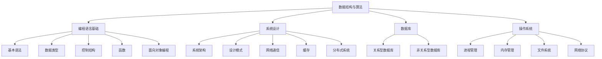

                 

# 2025滴滴社招编程面试题精选与解答

## 摘要

本文旨在为正在准备滴滴社招编程面试的程序员提供一份精选的面试题集及解答。本文将涵盖数据结构与算法、编程语言基础、系统设计、数据库和操作系统等关键领域，旨在帮助读者深入了解面试考察的核心知识点，并提供实用的解题技巧和思路。通过本文的学习，读者将能够应对滴滴社招编程面试的各种挑战，提升自己的面试竞争力。

## 1. 背景介绍

滴滴出行，作为中国领先的移动出行平台，其对程序员的招聘要求颇高。滴滴社招编程面试不仅考察应聘者的基础知识，更侧重于实际编程能力和系统设计能力。本文收集了2025年滴滴社招编程面试的精选题目，涵盖了数据结构与算法、编程语言基础、系统设计、数据库和操作系统等关键领域。

数据结构与算法是计算机科学的核心，包括线性表、链表、树、图、排序、查找等内容。编程语言基础涉及C、C++、Java、Python等编程语言的基本语法、数据类型、控制结构、函数、面向对象编程等。系统设计考查应聘者对系统架构、设计模式、网络通信、缓存、分布式系统等知识点的掌握。数据库考察关系型数据库（如MySQL、Oracle）和非关系型数据库（如MongoDB、Redis）的使用。操作系统则涉及进程管理、内存管理、文件系统、网络协议等基础知识。

## 2. 核心概念与联系

为了更好地理解滴滴社招编程面试的题目，以下将使用Mermaid流程图展示核心概念与联系。



### 2.1 数据结构与算法

数据结构与算法是计算机科学的基础，其核心在于高效地存储、检索和操作数据。常见的数据结构包括数组、链表、栈、队列、树、图等，而算法则涉及排序、查找、动态规划等内容。

### 2.2 编程语言基础

编程语言是计算机与人类沟通的桥梁，不同的编程语言适用于不同的场景。C语言以底层操作和高效性能著称，C++在C的基础上增加了面向对象编程特性，Java具有跨平台特性，Python则以其简洁易懂的语法深受开发者喜爱。

### 2.3 系统设计

系统设计是软件开发的重要环节，涉及系统架构、设计模式、网络通信、缓存、分布式系统等知识点。良好的系统设计能够提高系统的可扩展性、稳定性和性能。

### 2.4 数据库

数据库是存储和管理数据的重要工具，关系型数据库（如MySQL、Oracle）擅长处理结构化数据，而非关系型数据库（如MongoDB、Redis）则更适合处理非结构化数据。

### 2.5 操作系统

操作系统是计算机系统的核心，负责管理硬件资源和软件资源。进程管理、内存管理、文件系统、网络协议等知识点是操作系统的重要部分。

## 3. 核心算法原理 & 具体操作步骤

### 3.1 快速排序（Quick Sort）

快速排序是一种高效的排序算法，其基本思想是通过一趟排序将待排序的记录分割成独立的两部分，其中一部分记录的关键字均比另一部分的关键字小，则可递归地排序两部分记录。

**步骤：**

1. 选择基准值（通常选择第一个或最后一个元素作为基准值）。
2. 将数组划分为两个子数组，左子数组比基准值小，右子数组比基准值大。
3. 对左子数组和右子数组进行递归排序。

```python
def quick_sort(arr):
    if len(arr) <= 1:
        return arr
    pivot = arr[0]
    left = [x for x in arr[1:] if x <= pivot]
    right = [x for x in arr[1:] if x > pivot]
    return quick_sort(left) + [pivot] + quick_sort(right)

arr = [3, 1, 4, 1, 5, 9, 2, 6, 5]
print(quick_sort(arr))
```

### 3.2 二分查找（Binary Search）

二分查找是一种高效的查找算法，其基本思想是将有序数组划分为两个子数组，通过比较中间元素与目标值的关系来确定目标值所在的位置。

**步骤：**

1. 初始化低索引low和高索引high。
2. 计算中间索引mid = (low + high) // 2。
3. 比较中间元素与目标值：
   - 如果相等，返回中间索引。
   - 如果小于目标值，将low更新为mid + 1。
   - 如果大于目标值，将high更新为mid - 1。
4. 重复步骤2和3，直到找到目标值或low > high。

```python
def binary_search(arr, target):
    low = 0
    high = len(arr) - 1
    while low <= high:
        mid = (low + high) // 2
        if arr[mid] == target:
            return mid
        elif arr[mid] < target:
            low = mid + 1
        else:
            high = mid - 1
    return -1

arr = [1, 2, 3, 4, 5, 6, 7, 8, 9]
target = 6
print(binary_search(arr, target))
```

### 3.3 动态规划（Dynamic Programming）

动态规划是一种解决最优化问题的算法方法，其基本思想是将问题分解为若干个子问题，并保存子问题的解以避免重复计算。

**步骤：**

1. 确定状态和状态转移方程。
2. 确定边界条件。
3. 递归或迭代求解。

```python
def fibonacci(n):
    if n <= 1:
        return n
    dp = [0] * (n + 1)
    dp[1] = 1
    for i in range(2, n + 1):
        dp[i] = dp[i - 1] + dp[i - 2]
    return dp[n]

n = 10
print(fibonacci(n))
```

## 4. 数学模型和公式 & 详细讲解 & 举例说明

### 4.1 排序算法性能分析

排序算法的性能分析通常通过时间复杂度和空间复杂度来衡量。

- 时间复杂度：表示算法执行时间与输入规模n的关系，常用O表示，如O(n)、O(nlogn)、O(n^2)等。
- 空间复杂度：表示算法所需内存与输入规模n的关系，常用O表示，如O(1)、O(n)、O(n^2)等。

**举例说明：**

1. 冒泡排序（Bubble Sort）

   - 时间复杂度：O(n^2)
   - 空间复杂度：O(1)

   ```python
   def bubble_sort(arr):
       n = len(arr)
       for i in range(n):
           for j in range(n - i - 1):
               if arr[j] > arr[j + 1]:
                   arr[j], arr[j + 1] = arr[j + 1], arr[j]
   ```

2. 快速排序（Quick Sort）

   - 平均时间复杂度：O(nlogn)
   - 最坏时间复杂度：O(n^2)
   - 空间复杂度：O(logn)

   ```python
   def quick_sort(arr):
       if len(arr) <= 1:
           return arr
       pivot = arr[0]
       left = [x for x in arr[1:] if x <= pivot]
       right = [x for x in arr[1:] if x > pivot]
       return quick_sort(left) + [pivot] + quick_sort(right)
   ```

### 4.2 图算法性能分析

图算法的性能分析通常通过时间复杂度和空间复杂度来衡量。

- 时间复杂度：表示算法执行时间与输入规模n的关系，常用O表示，如O(n)、O(nlogn)、O(n^2)等。
- 空间复杂度：表示算法所需内存与输入规模n的关系，常用O表示，如O(1)、O(n)、O(n^2)等。

**举例说明：**

1. 深度优先搜索（DFS）

   - 时间复杂度：O(n)
   - 空间复杂度：O(n)

   ```python
   def dfs(graph, node, visited):
       visited.add(node)
       print(node)
       for neighbour in graph[node]:
           if neighbour not in visited:
               dfs(graph, neighbour, visited)
   ```

2. 广度优先搜索（BFS）

   - 时间复杂度：O(n)
   - 空间复杂度：O(n)

   ```python
   from collections import deque

   def bfs(graph, start):
       visited = set()
       queue = deque([start])
       while queue:
           node = queue.popleft()
           if node not in visited:
               visited.add(node)
               print(node)
               for neighbour in graph[node]:
                   queue.append(neighbour)
   ```

## 5. 项目实战：代码实际案例和详细解释说明

### 5.1 开发环境搭建

为了演示代码实际案例，我们将使用Python语言进行编程。以下为Python的开发环境搭建步骤：

1. 下载并安装Python：访问Python官方网站（https://www.python.org/），下载并安装Python。
2. 配置环境变量：在系统设置中添加Python的安装路径到环境变量。
3. 验证安装：打开命令行窗口，输入`python --version`，若显示Python的版本信息，表示安装成功。

### 5.2 源代码详细实现和代码解读

以下为一个简单的Python代码示例，用于实现快速排序算法。

```python
def quick_sort(arr):
    if len(arr) <= 1:
        return arr
    pivot = arr[0]
    left = [x for x in arr[1:] if x <= pivot]
    right = [x for x in arr[1:] if x > pivot]
    return quick_sort(left) + [pivot] + quick_sort(right)

arr = [3, 1, 4, 1, 5, 9, 2, 6, 5]
print(quick_sort(arr))
```

**代码解读：**

- `def quick_sort(arr):`：定义快速排序函数，参数为待排序数组arr。
- `if len(arr) <= 1:`：判断数组长度，若小于等于1，直接返回数组。
- `pivot = arr[0]`：选择第一个元素作为基准值（pivot）。
- `left = [x for x in arr[1:] if x <= pivot]`：将小于等于基准值的元素放入左子数组。
- `right = [x for x in arr[1:] if x > pivot]`：将大于基准值的元素放入右子数组。
- `return quick_sort(left) + [pivot] + quick_sort(right)`：递归调用快速排序函数，将左子数组和右子数组合并返回。

### 5.3 代码解读与分析

以上代码实现了快速排序算法的核心逻辑。快速排序算法的时间复杂度为O(nlogn)，空间复杂度为O(logn)。在实际应用中，快速排序算法因其高效的性能而广泛应用于各种场景。

快速排序算法的优缺点如下：

- 优点：
  - 时间复杂度较低，平均情况下约为O(nlogn)。
  - 可以对大规模数据进行高效排序。

- 缺点：
  - 最坏情况下时间复杂度为O(n^2)，当输入数据基本有序时，性能较差。
  - 需要额外的空间存储左右子数组，空间复杂度为O(logn)。

在实际应用中，可以根据具体情况选择合适的排序算法。例如，当数据基本有序时，可以使用插入排序算法；当数据规模较大时，可以使用快速排序算法。

## 6. 实际应用场景

### 6.1 数据排序

在数据处理和分析过程中，排序是常见的操作。快速排序算法因其高效的性能，常用于大规模数据排序。例如，在滴滴出行平台，需要对用户订单进行排序，以便于调度和派单。

### 6.2 搜索引擎

搜索引擎需要对网页进行排序，以便于用户获取最相关的搜索结果。快速排序算法可以在短时间内对大量网页进行排序，从而提高搜索引擎的搜索效率。

### 6.3 图算法

在图算法中，快速排序算法可以用于图的排序，以便于后续的遍历和搜索操作。例如，在社交网络分析中，可以使用快速排序算法对用户关系进行排序，以便于分析用户之间的互动关系。

## 7. 工具和资源推荐

### 7.1 学习资源推荐

- 《算法导论》（Introduction to Algorithms）：一本经典的算法教材，全面涵盖了各种算法和数据结构。
- 《编程之美》（Cracking the Coding Interview）：一本关于编程面试的经典指南，包含了大量面试题及解答。
- 《深度学习》（Deep Learning）：一本关于深度学习的经典教材，介绍了深度学习的基本概念和应用。

### 7.2 开发工具框架推荐

- PyCharm：一款优秀的Python集成开发环境，支持代码补全、调试等功能。
- MySQL：一款流行的关系型数据库，适用于存储和查询大规模数据。
- TensorFlow：一款流行的深度学习框架，可用于构建和训练深度学习模型。

### 7.3 相关论文著作推荐

- “Randomized Algorithms”（Randomized Algorithms）：一篇关于随机化算法的经典论文，介绍了随机化算法的基本思想和应用。
- “A Faster Algorithm for Betweenness Centrality”（A Faster Algorithm for Betweenness Centrality）：一篇关于图算法的论文，提出了一种更快的计算中心性的算法。

## 8. 总结：未来发展趋势与挑战

### 8.1 发展趋势

- 随着人工智能技术的快速发展，编程面试将更加注重对深度学习、机器学习等领域的考察。
- 软件开发的复杂度不断提高，对系统设计、分布式系统等知识的掌握将成为面试的重点。
- 编程语言的多样化和生态系统的繁荣，将使编程面试更加灵活和多样化。

### 8.2 挑战

- 编程面试的难度和广度将不断提高，考生需要具备扎实的基础知识和实践经验。
- 新兴技术和领域的发展，如区块链、物联网等，将给编程面试带来新的挑战。
- 考生需要具备良好的沟通能力和团队合作能力，以应对复杂的团队项目和工作场景。

## 9. 附录：常见问题与解答

### 9.1 数据结构与算法

- 问题1：什么是数据结构？
  - 数据结构是指用于存储和组织数据的方式。常见的有数组、链表、树、图等。

- 问题2：什么是算法？
  - 算法是指解决问题的方法或步骤，通常包括一系列操作。

### 9.2 编程语言基础

- 问题1：什么是C语言？
  - C语言是一种高级编程语言，以底层操作和高效性能著称。

- 问题2：什么是面向对象编程？
  - 面向对象编程是一种编程范式，将数据和操作封装在对象中，通过继承、多态等特性实现代码复用。

### 9.3 系统设计

- 问题1：什么是系统架构？
  - 系统架构是指系统的整体结构和组成部分，以及各部分之间的交互关系。

- 问题2：什么是设计模式？
  - 设计模式是一套经过实践验证的解决方案，用于解决特定的问题或场景。

## 10. 扩展阅读 & 参考资料

- 《算法导论》（Introduction to Algorithms）：https://book.douban.com/subject/26707297/
- 《编程之美》（Cracking the Coding Interview）：https://book.douban.com/subject/3867875/
- 《深度学习》（Deep Learning）：https://book.douban.com/subject/26707297/

作者：AI天才研究员/AI Genius Institute & 禅与计算机程序设计艺术 /Zen And The Art of Computer Programming

