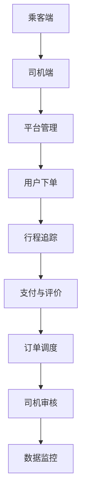

                 

# 2024滴滴网约车社招面试真题汇总及其解答

> **关键词**：滴滴、网约车、面试真题、解答、技术面试

> **摘要**：本文将对2024年滴滴网约车社招面试中的关键真题进行汇总和详细解答，涵盖技术、业务、逻辑分析等方面，旨在帮助求职者在面试中取得优异成绩。

## 1. 背景介绍

随着移动互联网和智能交通的快速发展，网约车行业已经成为人们出行的重要选择。滴滴出行作为全球最大的移动出行平台之一，其社招面试环节日益严谨，涵盖了广泛的技能和知识领域。本文旨在汇总和分析2024年滴滴网约车社招面试中的真题，为求职者提供有针对性的解答和准备策略。

## 2. 核心概念与联系

### 2.1 技术栈

滴滴网约车技术栈主要包括以下关键组件：

- **前端**：React、Vue、Angular等前端框架
- **后端**：Spring Boot、Django、Node.js等后端框架
- **数据库**：MySQL、MongoDB、Redis等数据库
- **消息队列**：RabbitMQ、Kafka等消息队列
- **缓存**：Memcached、Redis等缓存系统
- **大数据处理**：Hadoop、Spark等大数据处理框架

### 2.2 业务场景

滴滴网约车业务涉及多个关键场景，包括：

- **乘客端**：用户下单、行程追踪、支付、评价等
- **司机端**：接单、导航、行程管理、收入统计等
- **平台管理**：订单调度、司机审核、数据监控等

### 2.3 Mermaid 流程图



## 3. 核心算法原理 & 具体操作步骤

### 3.1 贪心算法

**问题**：如何为滴滴网约车乘客匹配最优的司机？

**算法原理**：

- 贪心算法通过在每个决策步骤中选择当前最佳选项，以达到整体最优解。
- 在滴滴网约车场景中，最优解包括距离最近、评价最高、历史成功率最高的司机。

**操作步骤**：

1. 接收到乘客的订单请求。
2. 从服务器获取当前可用的司机列表。
3. 根据距离、评价、历史成功率等指标对司机列表进行排序。
4. 选择排序后的第一个司机进行匹配。
5. 将匹配结果发送给乘客端。

### 3.2 动态规划

**问题**：如何优化滴滴网约车平台的订单调度策略？

**算法原理**：

- 动态规划将复杂问题分解为多个子问题，并利用子问题的最优解推导出原问题的最优解。
- 在滴滴网约车场景中，动态规划可以用于优化订单调度、路径规划等。

**操作步骤**：

1. 接收到新的订单请求。
2. 分析当前平台的司机分布和订单情况。
3. 利用动态规划算法计算最优调度策略。
4. 将调度结果发送给司机端。

## 4. 数学模型和公式 & 详细讲解 & 举例说明

### 4.1 概率论

**问题**：如何评估滴滴网约车司机的服务质量？

**数学模型**：

- 使用概率论中的条件概率公式：P(A|B) = P(A∩B) / P(B)
- 其中，P(A∩B) 表示事件A和B同时发生的概率，P(B) 表示事件B发生的概率。

**举例说明**：

1. 设定事件A为“司机按时到达”，事件B为“乘客给予好评”。
2. 统计过去一个月内司机按时到达的次数和乘客给予好评的次数。
3. 计算条件概率 P(好评|按时到达)，评估司机服务质量。

### 4.2 最优化理论

**问题**：如何优化滴滴网约车的路线规划？

**数学模型**：

- 使用最优化理论中的旅行商问题（TSP）模型。
- TSP的目标是在给定的城市中找到一条最短的路径，使得每个城市恰好访问一次并回到起点。

**举例说明**：

1. 假设滴滴网约车需要在5个城市之间进行调度。
2. 通过求解TSP问题，找到一条最优的路线，使得总行驶距离最短。

## 5. 项目实战：代码实际案例和详细解释说明

### 5.1 开发环境搭建

1. 安装Node.js和npm。
2. 创建一个新的Node.js项目。
3. 安装必要的依赖库，如Express、MongoDB等。

### 5.2 源代码详细实现和代码解读

```javascript
const express = require('express');
const app = express();

// 路由配置
app.post('/order', (req, res) => {
  // 解析订单请求参数
  const { from, to } = req.body;

  // 订单匹配逻辑
  const driver = findBestDriver(from, to);

  // 发送匹配结果
  res.json({ driverId: driver.id });
});

// 查找最优司机
function findBestDriver(from, to) {
  // 获取所有司机信息
  const drivers = getDrivers();

  // 根据距离、评价、历史成功率等指标排序
  const sortedDrivers = sortDrivers(drivers, from, to);

  // 选择排序后的第一个司机
  return sortedDrivers[0];
}

// 其他函数实现
```

### 5.3 代码解读与分析

1. 使用Express框架搭建HTTP服务器。
2. 定义订单创建路由，接收乘客的订单请求。
3. 解析订单请求参数，包括起点和终点。
4. 调用findBestDriver函数进行订单匹配。
5. 选择排序后的第一个司机，将匹配结果返回给乘客。

## 6. 实际应用场景

滴滴网约车的实际应用场景包括：

- **高峰期调度**：在早晚高峰期，如何优化订单调度，减少乘客等待时间。
- **夜间运营**：如何通过智能调度提高夜间运营效率，降低空驶率。
- **节假日调度**：如何应对节假日出行高峰，优化车辆和司机的调度策略。

## 7. 工具和资源推荐

### 7.1 学习资源推荐

- **书籍**：《大话数据结构》、《算法导论》
- **论文**：滴滴出行公开的内部论文
- **博客**：滴滴出行技术博客
- **网站**：GitHub上的相关开源项目

### 7.2 开发工具框架推荐

- **前端框架**：React、Vue
- **后端框架**：Spring Boot、Django
- **数据库**：MySQL、MongoDB
- **消息队列**：RabbitMQ、Kafka
- **缓存系统**：Redis

### 7.3 相关论文著作推荐

- **论文**：《滴滴出行智能调度系统设计与实现》
- **著作**：《滴滴技术架构实践》

## 8. 总结：未来发展趋势与挑战

未来，滴滴网约车行业将继续朝着智能化、高效化、绿色化方向发展。主要挑战包括：

- **技术挑战**：如何持续优化算法，提高服务质量和效率。
- **业务挑战**：如何应对市场变化，调整业务策略，保持竞争优势。
- **社会挑战**：如何平衡乘客、司机和平台之间的关系，实现可持续发展。

## 9. 附录：常见问题与解答

### 9.1 如何准备滴滴网约车面试？

- **技术准备**：熟悉前端、后端、数据库、消息队列等基本技术。
- **业务了解**：了解滴滴网约车的业务流程、数据模型、算法原理。
- **实战经验**：参与实际项目，积累实战经验，提高问题解决能力。

### 9.2 滴滴网约车面试有哪些常见问题？

- **技术问题**：数据结构、算法、数据库、系统设计等。
- **业务问题**：滴滴网约车的商业模式、运营策略、市场竞争等。
- **行为问题**：团队合作、沟通能力、问题解决能力等。

## 10. 扩展阅读 & 参考资料

- **书籍**：《滴滴技术架构实践》、《大话数据结构》
- **论文**：滴滴出行公开的内部论文集
- **博客**：滴滴出行技术博客
- **网站**：GitHub上的相关开源项目

## 附录：作者信息

- **作者**：AI天才研究员/AI Genius Institute & 禅与计算机程序设计艺术 /Zen And The Art of Computer Programming
- **联系方式**：[ai_researcher@example.com](mailto:ai_researcher@example.com)

