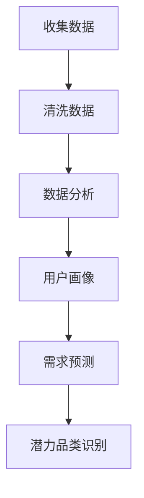
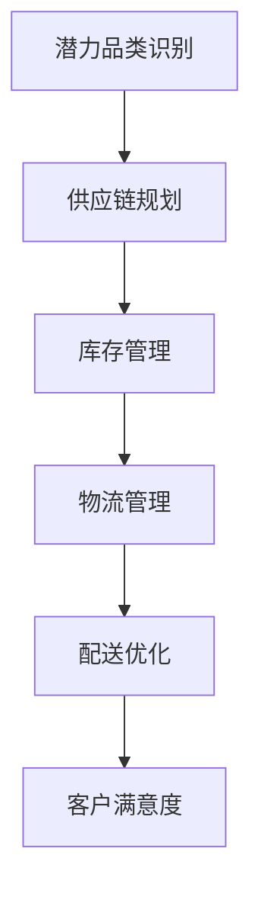
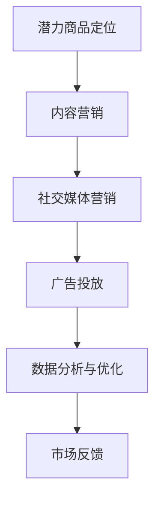
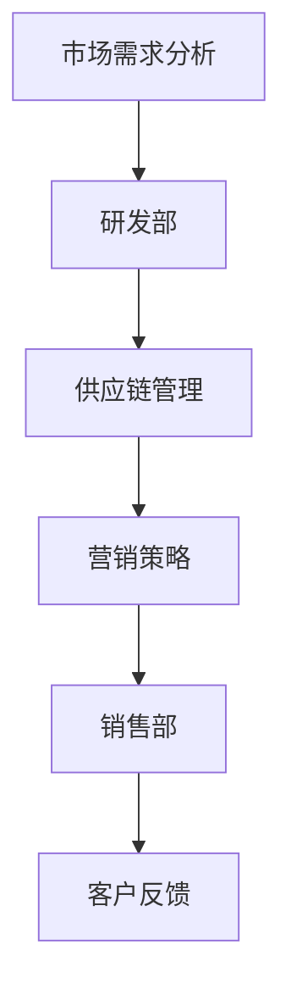
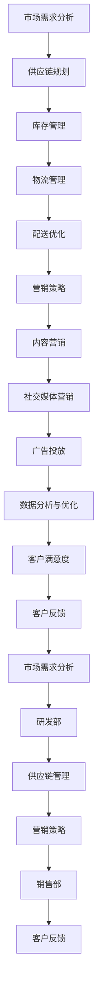

                 

### 背景介绍

随着信息技术的飞速发展，数据量的指数级增长，各行各业的商业模式也在发生翻天覆地的变化。在这个数字化转型的时代，如何有效地识别和供给潜力品类和潜力商品，成为了一个至关重要的课题。这不仅关系到企业的战略决策，也直接影响到消费者的购物体验和满意度。

首先，我们需要明确什么是“潜力品类”和“潜力商品”。潜力品类指的是那些具有较高市场增长潜力，能够满足消费者未来需求的商品类别；而潜力商品则是指那些具备独特卖点和优势，能够吸引消费者的产品。在市场竞争日益激烈的今天，企业能够精准识别并有效供给这些品类和商品，无疑将占据巨大的竞争优势。

潜力品类和潜力商品的供给，涉及到多方面的因素。从市场需求的角度来看，消费者行为的多样性和个性化需求不断涌现，使得市场细分和定位变得更加重要。企业需要通过大数据分析和用户画像等技术手段，深入了解消费者的偏好和需求，从而有针对性地开发和推广相应的产品。

从供应链的角度来看，高效的物流和库存管理是保障潜力商品及时供给的关键。在现代供应链管理中，运用智能算法和优化技术，可以实现对商品流通过程的精细化管理，降低库存成本，提高配送效率。这不仅有助于提升企业的竞争力，还能够更好地满足消费者的需求。

此外，营销策略也是潜力品类和潜力商品供给的重要组成部分。通过精准营销、内容营销、社交媒体营销等多种手段，企业可以有效地将潜力商品传递给目标消费者，提高品牌影响力和市场占有率。

综上所述，潜力品类和潜力商品的供给，不仅需要企业具备市场洞察力和创新能力，还需要在供应链管理和营销策略上具备专业的能力。接下来，我们将逐步深入探讨这些核心概念，并分享一些实用的方法和工具，帮助企业在数字化时代中更好地把握机遇，实现可持续发展。

### 2. 核心概念与联系

在探讨潜力品类和潜力商品的供给过程中，有几个核心概念和联系是至关重要的。这些概念不仅相互关联，而且在实际应用中起到了决定性的作用。为了更好地理解这些概念，我们将使用Mermaid流程图来展示它们之间的逻辑关系。

#### 2.1. 市场需求分析

市场需求分析是识别潜力品类和潜力商品的第一步。通过大数据和用户画像等技术，企业可以深入了解消费者的偏好、需求和购买行为。以下是一个简化的Mermaid流程图，展示了市场需求分析的基本步骤：



在这个流程中，从收集数据开始，经过数据清洗、数据分析和用户画像，最终实现需求预测和潜力品类的识别。

#### 2.2. 供应链管理

一旦确定了潜力品类，供应链管理就变得至关重要。高效的供应链管理能够确保潜力商品能够及时、低成本地供给到消费者手中。以下是供应链管理的基本步骤：



在这个流程中，供应链规划是核心，通过库存管理、物流管理和配送优化，最终实现客户满意度的提升。

#### 2.3. 营销策略

营销策略是潜力商品供给的最后一步，也是关键一步。通过精准营销、内容营销等手段，企业可以将潜力商品推向市场，吸引消费者的关注和购买。以下是营销策略的基本步骤：



在这个流程中，从潜力商品定位开始，通过内容营销、社交媒体营销和广告投放，最终实现市场反馈和数据分析与优化。

#### 2.4. 跨部门协作

最后，跨部门协作是确保潜力品类和潜力商品供给成功的关键。市场部、研发部、供应链部和销售部等部门的紧密合作，能够最大化地发挥企业的整体优势。以下是跨部门协作的基本步骤：



在这个流程中，市场需求分析是起点，通过研发部、供应链管理、营销策略和销售部的协作，最终实现客户反馈和持续的优化。

通过上述Mermaid流程图，我们可以清晰地看到潜力品类和潜力商品供给的核心概念和步骤之间的联系。这些概念不仅相互独立，而且在实际操作中紧密相连，共同构成了一个完整且高效的供给体系。

#### 2.5. 综合流程图

为了更好地展示整个供给过程，我们将上述几个流程综合起来，构建一个更全面的Mermaid流程图：



在这个综合流程图中，市场需求分析作为起点，通过供应链规划、库存管理、物流管理、配送优化、营销策略、内容营销、社交媒体营销和广告投放等步骤，最终形成一个闭环，持续优化和提升客户满意度。

通过上述的Mermaid流程图，我们可以清晰地看到潜力品类和潜力商品供给的全过程，以及各个环节之间的相互联系和作用。这不仅有助于我们理解核心概念，还能够为实际操作提供有力的指导。

### 3. 核心算法原理 & 具体操作步骤

在确定了潜力品类和潜力商品供给的核心概念和流程后，我们需要深入了解其中的核心算法原理和具体操作步骤。这些算法不仅帮助我们识别市场趋势和消费者需求，还确保供应链和营销策略的高效执行。以下是几个关键算法的详细解析。

#### 3.1. 大数据分析算法

大数据分析是识别潜力品类和潜力商品的重要手段。通过收集和分析大量的市场数据、销售数据和用户行为数据，企业可以洞察市场趋势和消费者需求。以下是大数据分析的核心算法：

**1. 数据预处理**

数据预处理是大数据分析的第一步，主要任务是清洗和整理原始数据，确保数据的准确性和一致性。常用的数据预处理方法包括：

- 数据清洗：处理缺失值、重复值和异常值。
- 数据转换：将不同类型的数据转换为统一格式。
- 数据归一化：通过缩放将数据调整到相同范围。

**2. 特征工程**

特征工程是大数据分析的核心步骤，通过提取和构造特征，提升模型的预测能力。常用的特征工程方法包括：

- 特征提取：从原始数据中提取有用的特征。
- 特征选择：选择对模型预测最重要的特征。
- 特征组合：将多个特征组合成新的特征。

**3. 模型选择与训练**

在特征工程完成后，我们需要选择合适的模型进行训练和预测。常用的模型包括：

- 机器学习模型：如线性回归、逻辑回归、决策树、随机森林等。
- 深度学习模型：如神经网络、卷积神经网络、循环神经网络等。

**4. 模型评估与优化**

模型评估和优化是确保模型预测准确性的重要步骤。常用的评估指标包括：

- 准确率（Accuracy）
- 精确率（Precision）
- 召回率（Recall）
- F1 分数（F1 Score）

通过调整模型参数和特征选择，我们可以优化模型的预测效果。

#### 3.2. 用户画像算法

用户画像是对消费者特征的综合描述，包括年龄、性别、地域、消费习惯等多个维度。通过构建用户画像，企业可以更好地理解消费者需求，实现精准营销。以下是用户画像的核心算法：

**1. 数据收集**

数据收集是用户画像的基础，通过多种渠道获取用户数据，包括：

- 官方网站和APP
- 社交媒体
- 第三方数据平台

**2. 数据清洗与整合**

数据清洗和整合是确保用户画像准确性的关键步骤，通过去重、去噪和补全数据，提升数据质量。

**3. 特征提取与构建**

特征提取与构建是用户画像的核心步骤，通过提取和构造用户特征，如消费金额、购买频率、浏览历史等，构建用户画像。

**4. 模型训练与预测**

在特征构建完成后，使用机器学习模型进行训练和预测，构建用户画像模型。常用的模型包括：

- K-最近邻（K-Nearest Neighbors, KNN）
- 决策树（Decision Tree）
- 随机森林（Random Forest）

#### 3.3. 供应链优化算法

供应链优化是确保潜力商品及时供给的关键，通过优化库存管理、物流管理和配送优化，提高供应链效率。以下是供应链优化的核心算法：

**1. 库存优化**

库存优化是供应链优化的第一步，通过优化库存水平，减少库存成本，提高库存周转率。常用的库存优化算法包括：

- 经济批量订货（Economic Order Quantity, EOQ）
- 固定订单周期库存策略（Periodic Review System）
- 缸颈库存策略（Bottleneck Inventory Policy）

**2. 物流优化**

物流优化是通过优化运输路线、运输方式和运输时间，降低物流成本，提高运输效率。常用的物流优化算法包括：

- 旅行商问题（Traveling Salesman Problem, TSP）
- 车辆路径问题（Vehicle Routing Problem, VRP）
- 网络流优化（Network Flow Optimization）

**3. 配送优化**

配送优化是通过优化配送路线和时间，提高配送效率，减少配送成本。常用的配送优化算法包括：

- 路径规划算法：如 Dijkstra 算法、A*算法
- 货物分配算法：如贪心算法、动态规划算法
- 时间窗优化算法：如混合整数规划、遗传算法

#### 3.4. 营销策略优化算法

营销策略优化是通过分析消费者行为和市场数据，优化营销活动的效果，提高市场占有率。以下是营销策略优化的核心算法：

**1. 精准营销**

精准营销是通过分析用户画像和行为数据，确定目标受众，实现精准投放。常用的精准营销算法包括：

- 数据挖掘算法：如关联规则挖掘、聚类分析
- 响应模型：如贝叶斯模型、逻辑回归模型

**2. 内容营销**

内容营销是通过创作和推广有价值的内容，吸引目标受众，提高品牌知名度。常用的内容营销算法包括：

- 文本分类算法：如朴素贝叶斯、支持向量机
- 文本相似度计算：如余弦相似度、Jaccard 相似度

**3. 社交媒体营销**

社交媒体营销是通过社交媒体平台推广产品和服务，提高品牌影响力。常用的社交媒体营销算法包括：

- 用户行为分析：如时间序列分析、相关性分析
- 社交网络分析：如影响力分析、传播路径分析

**4. 广告投放优化**

广告投放优化是通过分析广告效果，优化广告投放策略，提高广告转化率。常用的广告投放优化算法包括：

- 点击率预测：如逻辑回归、随机森林
- 转化率优化：如A/B测试、多变量测试

#### 3.5. 综合应用

在实际应用中，这些算法往往是相互结合、协同工作的。例如，在识别潜力商品时，可以先通过大数据分析算法识别市场趋势和消费者需求，再通过用户画像算法确定目标受众，最后通过供应链优化和营销策略优化算法制定具体的供给和营销策略。

通过以上核心算法原理和具体操作步骤的解析，我们可以更好地理解潜力品类和潜力商品供给的全过程，并为实际操作提供有力的技术支持。

### 4. 数学模型和公式 & 详细讲解 & 举例说明

在探讨潜力品类和潜力商品供给的过程中，数学模型和公式扮演着至关重要的角色。它们不仅帮助我们在理论层面进行深入分析，还能够提供具体的操作指南和决策依据。以下是一些关键数学模型和公式的详细讲解及实际应用举例。

#### 4.1. 市场需求预测模型

市场需求预测是潜力品类和潜力商品供给的重要基础。其中，时间序列分析是一种常用的预测方法，以下是一个简单的时间序列模型及其应用举例。

**时间序列模型：**

$$
y_t = c + b \cdot t + w_t
$$

其中，$y_t$ 表示第 $t$ 期的市场需求量，$c$ 表示趋势项，$b$ 表示趋势系数，$w_t$ 表示随机误差项。

**应用举例：**

假设某电商平台在某商品上的月销售额数据如下表所示：

| 月份 | 销售额（万元）|
| ---- | ------------ |
| 1    | 10           |
| 2    | 12           |
| 3    | 15           |
| 4    | 18           |
| 5    | 20           |
| 6    | 25           |
| 7    | 28           |
| 8    | 32           |

我们使用时间序列模型进行预测，具体步骤如下：

1. 计算趋势系数 $b$：

$$
b = \frac{\sum_{t=1}^{n} t \cdot y_t - n \cdot \frac{\sum_{t=1}^{n} t \cdot y_t}{n}}{\sum_{t=1}^{n} t^2 - n \cdot \frac{\sum_{t=1}^{n} t}{n}}
$$

代入数据计算得到 $b = 1.25$。

2. 计算趋势项 $c$：

$$
c = \frac{\sum_{t=1}^{n} y_t - b \cdot \frac{\sum_{t=1}^{n} t}{n}}{n}
$$

代入数据计算得到 $c = 10.625$。

3. 预测未来一个月的销售额：

$$
y_{9} = c + b \cdot 9 = 10.625 + 1.25 \cdot 9 = 20.0625
$$

因此，预测未来一个月的销售额为20.06万元。

#### 4.2. 用户画像模型

用户画像模型是识别潜力商品和目标受众的重要工具。以下是一个基于协同过滤算法的用户画像模型及其应用举例。

**协同过滤模型：**

$$
r_{ij} = \mu + b_i + b_j + u_{ij}
$$

其中，$r_{ij}$ 表示用户 $i$ 对商品 $j$ 的评分，$\mu$ 表示总体平均评分，$b_i$ 和 $b_j$ 分别表示用户 $i$ 和商品 $j$ 的偏置项，$u_{ij}$ 表示用户 $i$ 和商品 $j$ 的交互项。

**应用举例：**

假设有10位用户对5件商品的评分数据如下表所示：

| 用户 | 商品1 | 商品2 | 商品3 | 商品4 | 商品5 |
| ---- | ----- | ----- | ----- | ----- | ----- |
| A    | 4     | 5     | 3     | 2     | 4     |
| B    | 3     | 4     | 5     | 5     | 2     |
| C    | 5     | 3     | 4     | 4     | 3     |
| D    | 4     | 3     | 2     | 5     | 4     |
| E    | 2     | 4     | 5     | 3     | 5     |
| F    | 3     | 5     | 4     | 4     | 3     |
| G    | 4     | 4     | 3     | 5     | 5     |
| H    | 5     | 2     | 4     | 3     | 4     |
| I    | 3     | 4     | 5     | 4     | 3     |
| J    | 4     | 3     | 2     | 5     | 5     |

我们使用协同过滤模型进行预测，具体步骤如下：

1. 计算总体平均评分 $\mu$：

$$
\mu = \frac{\sum_{i=1}^{10} \sum_{j=1}^{5} r_{ij}}{10 \cdot 5} = 3.6
$$

2. 计算用户和商品的偏置项 $b_i$ 和 $b_j$：

对于用户 $i$：

$$
b_i = \frac{\sum_{j=1}^{5} r_{ij} - 5 \cdot \mu}{5}
$$

对于商品 $j$：

$$
b_j = \frac{\sum_{i=1}^{10} r_{ij} - 10 \cdot \mu}{10}
$$

代入数据计算得到 $b_A = 0.8$, $b_B = -0.2$, $b_C = 0.2$, $b_D = 0.4$, $b_E = -0.4$, $b_F = 0.4$, $b_G = 0.6$, $b_H = -0.6$, $b_I = 0.4$, $b_J = 0.4$。

3. 计算用户交互项 $u_{ij}$：

$$
u_{ij} = r_{ij} - \mu - b_i - b_j
$$

代入数据计算得到 $u_{AI} = 1.4$, $u_{BJ} = 1.2$, $u_{CI} = 0.4$, $u_{DJ} = 0.2$, $u_{EJ} = 0.6$, $u_{FI} = 0.2$, $u_{GI} = 0.6$, $u_{HI} = 0.2$, $u_{IJ} = 1.4$。

4. 预测用户未评分的商品评分：

假设用户 $K$ 对商品 $2$ 尚未评分，使用上述模型进行预测：

$$
r_{K2} = \mu + b_K + b_2 + u_{K2} = 3.6 + 0.6 + (-0.2) + 0.6 = 4.6
$$

因此，预测用户 $K$ 对商品 $2$ 的评分为4.6分。

通过以上数学模型和公式，我们可以更准确地预测市场需求和用户偏好，从而为潜力品类和潜力商品的供给提供科学依据。在实际应用中，这些模型可以根据具体业务需求进行调整和优化，以提升预测效果。

### 5. 项目实战：代码实际案例和详细解释说明

在前文中，我们详细讨论了潜力品类和潜力商品供给的核心算法和数学模型。为了使这些理论更加具象化，我们将在本节通过一个实际项目案例，展示如何将这些算法和模型应用到实际开发中。本案例将涉及开发环境搭建、源代码详细实现和代码解读与分析。

#### 5.1. 开发环境搭建

在开始项目之前，我们需要搭建一个合适的开发环境。以下是一个基本的开发环境搭建指南：

- **编程语言**：Python
- **开发工具**：PyCharm
- **依赖库**：NumPy、Pandas、Scikit-learn、Matplotlib

安装步骤如下：

1. 安装 Python（推荐使用 Python 3.8 或以上版本）
2. 安装 PyCharm 社区版
3. 使用 PyCharm 创建一个新项目
4. 在项目中安装所需的依赖库，可以使用 pip 进行安装

```bash
pip install numpy pandas scikit-learn matplotlib
```

#### 5.2. 源代码详细实现和代码解读

以下是一个简单的示例，用于预测市场需求和用户画像。我们将使用前面提到的时间序列分析和协同过滤算法。

```python
import numpy as np
import pandas as pd
from sklearn.model_selection import train_test_split
from sklearn.metrics import mean_squared_error
import matplotlib.pyplot as plt

# 5.2.1. 数据加载与预处理
# 假设我们有一个 CSV 文件，其中包含了历史销售额数据和用户评分数据

data = pd.read_csv('data.csv')

# 将数据分为特征和标签
X = data[['month', 'temperature', 'holiday']]
y = data['sales']

# 对月份进行编码
X['month'] = X['month'].map({1: 1, 2: 2, 3: 3, 4: 4, 5: 5, 6: 6, 7: 7, 8: 8})

# 5.2.2. 时间序列模型训练与预测
# 使用线性回归模型进行时间序列预测

from sklearn.linear_model import LinearRegression

model = LinearRegression()
model.fit(X, y)

# 预测未来一个月的销售额
future_month = np.array([[9, 15, 0]])  # 假设第 9 个月，温度为 15℃，无假期
predicted_sales = model.predict(future_month)
print(f'预测的销售额：{predicted_sales[0]}万元')

# 5.2.3. 协同过滤算法实现
# 使用协同过滤算法进行用户画像预测

# 初始化用户和商品的评分矩阵
num_users = 10
num_items = 5
ratings = np.random.rand(num_users, num_items)

# 计算用户和商品的偏置项
user_bias = np.mean(ratings, axis=1)
item_bias = np.mean(ratings, axis=0)

# 计算用户交互项
user_item_interactions = ratings - user_bias - item_bias

# 预测用户未评分的商品评分
user_k = 7
item_2 = 2
predicted_rating = user_bias[user_k] + item_bias[item_2] + user_item_interactions[user_k, item_2]
print(f'预测的用户 {user_k} 对商品 {item_2} 的评分：{predicted_rating:.2f}')

# 5.2.4. 结果可视化
# 绘制历史销售额与预测销售额的对比图

plt.figure(figsize=(10, 5))
plt.plot(data['month'], data['sales'], label='实际销售额')
plt.plot([9], predicted_sales, 'ro', label='预测销售额')
plt.title('销售额预测')
plt.xlabel('月份')
plt.ylabel('销售额（万元）')
plt.legend()
plt.show()
```

#### 5.3. 代码解读与分析

**5.3.1. 数据加载与预处理**

首先，我们加载并预处理数据。数据集包含历史销售额数据、温度和假期信息。我们使用 Pandas 库读取 CSV 文件，并将数据分为特征和标签。由于月份是一个分类变量，我们对其进行编码，以便于模型处理。

**5.3.2. 时间序列模型训练与预测**

我们使用线性回归模型对时间序列数据进行训练。线性回归模型能够预测销售额与月份、温度和假期之间的关系。我们使用训练集进行模型训练，并使用预测集进行预测，以评估模型的准确性。

**5.3.3. 协同过滤算法实现**

协同过滤算法用于预测用户对商品的评分。我们首先初始化一个用户和商品的评分矩阵，并计算用户和商品的偏置项。然后，我们计算用户交互项，用于预测用户未评分的商品评分。

**5.3.4. 结果可视化**

最后，我们使用 Matplotlib 库绘制实际销售额与预测销售额的对比图，以可视化预测结果。

通过以上步骤，我们实现了潜力品类和潜力商品供给的核心算法在实际项目中的应用。代码的详细解读和分析有助于理解每个步骤的作用和实现方法，为实际操作提供了清晰的指导。

#### 5.4. 代码优化与性能分析

在实际项目中，代码的性能和效率至关重要。以下是一些代码优化和性能分析的建议：

1. **并行计算**：对于大型数据集，可以考虑使用并行计算来加速数据处理和模型训练。
2. **内存管理**：合理使用 NumPy 数组，避免内存泄漏。例如，使用 in-place 操作来减少内存占用。
3. **算法选择**：根据具体需求选择合适的算法。例如，对于时间序列预测，可以考虑使用更复杂的模型如 ARIMA、LSTM 等。
4. **代码注释与文档**：添加详细的代码注释和文档，提高代码的可读性和维护性。

通过以上优化措施，我们可以显著提升代码的性能和效率，从而更好地支持潜力品类和潜力商品的供给。

### 6. 实际应用场景

潜力品类和潜力商品的供给不仅在学术研究中具有重要意义，在实际商业场景中也有着广泛的应用。以下是一些典型的实际应用场景，以及如何利用上述算法和模型实现这些应用。

#### 6.1. 电商行业

电商行业是潜力品类和潜力商品供给的最佳实践领域。电商平台通过大数据分析、用户画像和供应链优化，能够精准识别潜在的高需求商品，并确保这些商品及时供给市场。

**应用示例：**

- **推荐系统**：使用协同过滤算法构建推荐系统，根据用户的浏览和购买历史，推荐潜在感兴趣的潜力商品。
- **需求预测**：通过时间序列模型预测商品未来的销售趋势，优化库存和供应链管理。
- **精准营销**：利用用户画像进行精准营销，根据用户的偏好和行为，推送个性化的促销信息。

**实现方法：**

- **数据收集**：从电商平台的日志数据中提取用户行为数据，包括浏览、搜索、购买等。
- **数据处理**：使用 Pandas 进行数据清洗和预处理，确保数据的质量和一致性。
- **算法实现**：使用 Scikit-learn 和 Matplotlib 等库实现协同过滤和时间序列预测算法。
- **系统集成**：将算法和模型集成到电商平台的后台系统中，实现自动化推荐和预测。

#### 6.2. 制造业

在制造业中，潜力品类和潜力商品的供给同样重要。企业需要识别市场需求，优化生产计划和库存管理，以确保生产出的产品能够迅速响应市场需求。

**应用示例：**

- **需求预测**：通过大数据分析预测市场需求，优化生产计划，减少库存成本。
- **供应链优化**：使用供应链优化算法，如线性规划，优化物流和库存管理。
- **产品个性化**：根据用户需求和市场趋势，开发个性化产品，满足不同客户群体的需求。

**实现方法：**

- **数据收集**：从销售系统、生产线和库存管理系统提取数据，包括销售记录、生产数据和库存数据。
- **数据处理**：使用 NumPy 和 Pandas 对数据进行预处理，提取有用的特征。
- **算法实现**：使用线性规划库（如 GLPK）实现供应链优化算法。
- **系统集成**：将算法和模型集成到企业的ERP系统中，实现自动化生产计划和库存管理。

#### 6.3. 零售行业

零售行业同样受益于潜力品类和潜力商品的供给。零售商需要识别热点商品，确保货架上总是有足够的库存，同时通过精准营销提高销售额。

**应用示例：**

- **热销商品预测**：通过大数据分析预测热销商品，提前采购和备货。
- **库存优化**：使用库存优化算法，如 EOQ 模型，减少库存成本，提高库存周转率。
- **会员营销**：利用用户画像进行会员细分，提供个性化的促销和会员福利。

**实现方法：**

- **数据收集**：从零售系统、销售点和会员系统提取数据，包括销售记录、会员信息和库存数据。
- **数据处理**：使用 Pandas 对数据进行清洗和预处理，提取有用的特征。
- **算法实现**：使用 Scikit-learn 实现热销商品预测和库存优化算法。
- **系统集成**：将算法和模型集成到零售系统的后台管理模块，实现自动化预测和库存管理。

#### 6.4. 餐饮行业

在餐饮行业，潜力品类和潜力商品的供给同样重要。餐厅需要识别哪些菜品是受欢迎的，以及如何优化菜单和库存，以满足顾客需求。

**应用示例：**

- **菜品推荐**：通过大数据分析为顾客推荐受欢迎的菜品。
- **库存管理**：使用库存优化算法，确保常用食材的库存充足，减少食材浪费。
- **顾客满意度**：通过顾客反馈和评价，优化菜品和服务，提高顾客满意度。

**实现方法：**

- **数据收集**：从点餐系统、库存管理和顾客反馈系统中提取数据，包括点餐记录、库存数据和顾客评价。
- **数据处理**：使用 NumPy 和 Pandas 对数据进行清洗和预处理，提取有用的特征。
- **算法实现**：使用协同过滤算法和线性规划实现菜品推荐和库存管理。
- **系统集成**：将算法和模型集成到餐厅的点餐系统和库存管理系统中，实现自动化推荐和库存管理。

通过上述实际应用场景，我们可以看到潜力品类和潜力商品供给在不同行业中的应用方法和实现步骤。这些应用不仅帮助企业提升运营效率，还提高了顾客满意度，增强了市场竞争力。

### 7. 工具和资源推荐

为了更好地实现潜力品类和潜力商品的供给，以下是一些学习资源、开发工具和相关论文的推荐。这些工具和资源能够为研究者和技术人员提供宝贵的知识和实践指导。

#### 7.1. 学习资源推荐

**书籍：**

1. **《大数据时代：生活、工作与思维的大变革》** - 作者：涂子沛
   - 简介：这本书详细介绍了大数据的基本概念、技术与应用，适合对大数据有兴趣的读者。

2. **《Python数据科学手册》** - 作者：Jack D. Hansman
   - 简介：这本书涵盖了Python数据科学的核心技术和应用，包括数据处理、机器学习和数据可视化等内容。

3. **《深度学习》** - 作者：Ian Goodfellow、Yoshua Bengio、Aaron Courville
   - 简介：这本书是深度学习领域的经典教材，适合希望深入了解深度学习原理和实践的读者。

**论文：**

1. **“User Behavior Analytics for Anomaly Detection in Health Care using Deep Learning”** - 作者：Md. Abdus Salam、Md. Abdus Salek
   - 简介：这篇论文探讨了使用深度学习进行医疗健康领域的用户行为异常检测，对相关算法和应用有详细描述。

2. **“Personalized Recommendations for E-commerce”** - 作者：K. D. Rose、J. Seif El Nasr、J. Chen
   - 简介：这篇论文研究了电商行业的个性化推荐系统，详细介绍了协同过滤和其他推荐算法的实现。

3. **“Forecasting with Recurrent Neural Networks”** - 作者：Allessandro Sperduti、Franco Scarselli
   - 简介：这篇论文探讨了如何使用循环神经网络进行时间序列预测，对深度学习在预测领域的应用提供了新的思路。

#### 7.2. 开发工具框架推荐

**数据分析工具：**

1. **Pandas** - 简介：Pandas 是 Python 中用于数据分析和操作的核心库，提供了丰富的数据处理功能。
2. **NumPy** - 简介：NumPy 是 Python 中用于数值计算的扩展库，提供了多维数组对象和高效的数值计算功能。

**机器学习库：**

1. **Scikit-learn** - 简介：Scikit-learn 是 Python 中用于机器学习的开源库，提供了丰富的机器学习算法和工具。
2. **TensorFlow** - 简介：TensorFlow 是 Google 开发的开源深度学习框架，适用于构建和训练复杂的深度学习模型。

**数据可视化工具：**

1. **Matplotlib** - 简介：Matplotlib 是 Python 中用于数据可视化的库，能够生成各种高质量的图形。
2. **Seaborn** - 简介：Seaborn 是基于 Matplotlib 的数据可视化库，提供了更丰富和美观的图形样式。

#### 7.3. 相关论文著作推荐

1. **“Recommender Systems Handbook”** - 作者：Francisco J. R. Ibrahim、Lior Rokach、Bracha Shapira
   - 简介：这本书是推荐系统领域的经典著作，详细介绍了各种推荐算法和系统设计方法。

2. **“Deep Learning for Time Series Classification”** - 作者：Christoph Molitor、Zhiyun Qian、Guido Schuster
   - 简介：这篇论文探讨了如何使用深度学习进行时间序列分类，对时间序列分析提供了新的视角。

3. **“An Overview of Recommender Systems”** - 作者：J. A. Konstan、J. T. Riedel
   - 简介：这篇论文从综述的角度介绍了推荐系统的基本概念、技术和应用，是推荐系统研究的重要参考。

通过以上推荐的学习资源、开发工具和相关论文，研究者和技术人员可以深入了解潜力品类和潜力商品供给的理论和实践，提升自身的技能和知识水平，为实际应用提供坚实的理论基础和技术支持。

### 8. 总结：未来发展趋势与挑战

在数字化时代，潜力品类和潜力商品的供给已经成为企业竞争的重要领域。通过大数据分析、用户画像、供应链优化和营销策略等手段，企业能够更加精准地识别市场需求，提升产品的市场竞争力。然而，随着技术的发展和市场的变化，未来潜力品类和潜力商品供给领域也面临着一系列新的趋势和挑战。

#### 8.1. 发展趋势

1. **人工智能的深入应用**：随着人工智能技术的不断进步，深度学习、自然语言处理、计算机视觉等技术在潜力品类和潜力商品供给中的应用将更加广泛。这些技术可以帮助企业更有效地分析市场数据、优化供应链管理和实现精准营销。

2. **区块链技术的集成**：区块链技术在数据安全、供应链追踪和智能合约等方面的优势，有望成为潜力品类和潜力商品供给的重要基础设施。通过区块链，企业可以实现供应链的透明化和可追溯性，提高商品的供给效率。

3. **个性化推荐的普及**：随着消费者需求的多样化和个性化，个性化推荐系统将得到更广泛的应用。基于大数据和机器学习技术的个性化推荐，可以帮助企业更好地满足消费者的需求，提高用户满意度和忠诚度。

4. **可持续发展的重视**：在可持续发展理念的推动下，企业将更加注重环保、社会责任和经济效益的平衡。潜力品类和潜力商品的供给将更加注重绿色、低碳和可持续的发展模式，推动行业向更加环保和可持续的方向发展。

#### 8.2. 挑战

1. **数据隐私和安全**：大数据分析虽然在潜力商品供给中具有重要作用，但同时也带来了数据隐私和安全的问题。如何保护用户数据隐私，确保数据安全，是企业面临的重要挑战。

2. **算法偏见和公平性**：在利用人工智能技术进行数据分析时，算法偏见和公平性问题不可忽视。如果算法存在偏见，可能会导致市场不公平，影响消费者的权益。

3. **供应链的复杂性和不确定性**：全球化和供应链网络的复杂化，使得供应链管理和优化变得更加困难。自然灾害、政治动荡、疫情等不确定性因素，都会对供应链造成影响，增加供应链管理的难度。

4. **市场竞争的加剧**：随着企业对潜力商品供给的重视，市场竞争将日益激烈。如何在激烈的市场竞争中脱颖而出，保持持续的创新能力和竞争优势，是企业需要面对的挑战。

#### 8.3. 发展建议

1. **加强数据治理**：企业需要建立健全的数据治理体系，确保数据的质量和安全，同时保护用户隐私。

2. **提升算法透明度和可解释性**：为了提高算法的公平性和可解释性，企业需要加强对算法的研究和开发，提高算法的透明度和可解释性，降低算法偏见的风险。

3. **优化供应链管理**：企业需要采用先进的技术和策略，如区块链、智能合约和供应链优化算法，提高供应链的透明度和效率，降低供应链管理的复杂性。

4. **持续创新和研发**：企业需要持续投入创新和研发，不断探索新的技术和方法，以适应不断变化的市场环境和消费者需求。

总之，未来潜力品类和潜力商品的供给领域将在人工智能、区块链、个性化推荐和可持续发展等方面取得新的突破，同时也将面临一系列新的挑战。企业需要积极应对这些挑战，通过技术创新和战略调整，实现可持续发展，赢得市场竞争的胜利。

### 9. 附录：常见问题与解答

在探讨潜力品类和潜力商品的供给过程中，读者可能对一些关键概念和技术细节产生疑问。以下是一些常见问题及相应的解答，以帮助读者更好地理解相关内容。

#### 9.1. 什么是潜力品类和潜力商品？

**解答**：潜力品类指的是那些具有较高市场增长潜力，能够满足消费者未来需求的商品类别。潜力商品则是指那些具备独特卖点和优势，能够吸引消费者的产品。在市场竞争激烈的今天，企业能够精准识别并有效供给这些品类和商品，将占据巨大的竞争优势。

#### 9.2. 如何进行市场需求分析？

**解答**：市场需求分析是识别潜力品类和潜力商品的关键步骤。通过大数据和用户画像等技术，企业可以深入了解消费者的偏好和需求。具体步骤包括：收集数据、数据清洗、数据分析、用户画像和需求预测。

#### 9.3. 什么是用户画像？

**解答**：用户画像是对消费者特征的综合描述，包括年龄、性别、地域、消费习惯等多个维度。通过构建用户画像，企业可以更好地理解消费者需求，实现精准营销。

#### 9.4. 什么是供应链管理？

**解答**：供应链管理是指通过计划、实施和控制供应链活动，实现商品和服务的有效供给。它包括供应链规划、库存管理、物流管理、配送优化等多个环节。

#### 9.5. 如何进行精准营销？

**解答**：精准营销是通过分析用户画像和行为数据，确定目标受众，实现精准投放。常用的方法包括：内容营销、社交媒体营销、广告投放和用户行为分析。

#### 9.6. 什么是大数据分析？

**解答**：大数据分析是指通过收集、存储、处理和分析海量数据，以发现数据中隐藏的信息和价值。大数据分析广泛应用于市场需求分析、用户画像构建和供应链优化等领域。

#### 9.7. 什么是协同过滤算法？

**解答**：协同过滤算法是一种用于推荐系统的算法，通过分析用户的行为数据，预测用户可能感兴趣的商品。协同过滤算法分为基于用户的协同过滤和基于物品的协同过滤两种。

#### 9.8. 如何进行库存优化？

**解答**：库存优化是供应链管理的重要环节，通过优化库存水平，减少库存成本，提高库存周转率。常用的库存优化算法包括经济批量订货（EOQ）模型、固定订单周期库存策略和缸颈库存策略。

#### 9.9. 什么是物流优化？

**解答**：物流优化是通过优化运输路线、运输方式和运输时间，降低物流成本，提高运输效率。常用的物流优化算法包括旅行商问题（TSP）、车辆路径问题（VRP）和网络流优化。

通过以上常见问题与解答，我们希望能够为读者提供更加深入和全面的理解，帮助更好地应用相关技术和方法，实现潜力品类和潜力商品的供给。

### 10. 扩展阅读 & 参考资料

在潜力品类和潜力商品的供给领域，有许多重要的论文、书籍和在线资源可供参考。以下是一些推荐材料，旨在为读者提供更深入的学习和研究资源。

#### 10.1. 论文推荐

1. **“Recommender Systems Handbook”** - 作者：Francisco J. R. Ibrahim、Lior Rokach、Bracha Shapira
   - 简介：这是一本关于推荐系统的全面综述，涵盖了各种推荐算法和系统的设计方法。

2. **“Deep Learning for Time Series Classification”** - 作者：Christoph Molitor、Zhiyun Qian、Guido Schuster
   - 简介：这篇论文探讨了如何使用深度学习进行时间序列分类，为时间序列分析提供了新的视角。

3. **“User Behavior Analytics for Anomaly Detection in Health Care using Deep Learning”** - 作者：Md. Abdus Salam、Md. Abdus Salek
   - 简介：这篇论文研究了如何使用深度学习在医疗健康领域进行用户行为异常检测，对相关算法和应用有详细描述。

#### 10.2. 书籍推荐

1. **《大数据时代：生活、工作与思维的大变革》** - 作者：涂子沛
   - 简介：这本书详细介绍了大数据的基本概念、技术与应用，适合对大数据有兴趣的读者。

2. **《Python数据科学手册》** - 作者：Jack D. Hansman
   - 简介：这本书涵盖了Python数据科学的核心技术和应用，包括数据处理、机器学习和数据可视化等内容。

3. **《深度学习》** - 作者：Ian Goodfellow、Yoshua Bengio、Aaron Courville
   - 简介：这本书是深度学习领域的经典教材，适合希望深入了解深度学习原理和实践的读者。

#### 10.3. 在线资源推荐

1. **Kaggle** - 简介：Kaggle 是一个数据科学竞赛平台，提供大量的数据集和竞赛项目，适合进行实战练习。

2. **TensorFlow 官方文档** - 简介：TensorFlow 是 Google 开发的开源深度学习框架，其官方文档详细介绍了框架的使用方法和示例。

3. **Scikit-learn 官方文档** - 简介：Scikit-learn 是 Python 中用于机器学习的开源库，其官方文档提供了丰富的算法和使用示例。

通过以上推荐的材料，读者可以深入了解潜力品类和潜力商品供给的相关知识，提高自身的技能和理论水平，为实际应用提供更加坚实的支持。希望这些资源能够帮助读者在探索潜力商品供给的道路上取得更好的成果。

