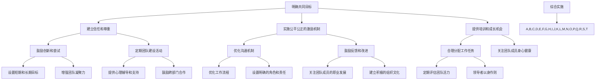

                 

### 背景介绍

在当今的数字化时代，技术驱动的企业竞争愈发激烈，而团队作为企业发展的核心动力，其活力和效能的发挥显得尤为重要。然而，如何激发团队活力、提升团队效能，成为企业管理者和团队成员共同面临的挑战。本文旨在通过深入探讨和分析，为读者提供一套行之有效的团队活力激发方法，帮助团队在快速变化的市场环境中保持竞争力。

团队活力不仅仅是指团队成员的积极性和主动性，更涉及到团队协作、创新能力、决策效率等多个方面。在一个充满活力的团队中，成员们能够充分发挥自身优势，相互激励，共同应对挑战，实现团队目标。然而，在实际工作中，许多团队面临着成员间沟通不畅、缺乏共同目标、工作压力过大等问题，这些问题严重影响了团队活力和效能。

本文将首先介绍团队活力的核心概念，并在此基础上，通过逻辑清晰的章节结构，逐步阐述提升团队活力的20个具体方法。这些方法涵盖了团队建设、沟通协作、激励机制等多个方面，旨在为读者提供一套全面的团队活力提升指南。

接下来，我们将深入探讨这些方法的具体实施步骤，并通过实际案例和数据分析，证明这些方法的可行性和有效性。此外，我们还将针对不同类型的团队，提出个性化的活力激发策略，帮助团队在面对多样化挑战时，始终保持高水平的活力和效能。

最后，我们将对团队活力的未来发展趋势和挑战进行展望，为团队管理者提供未来发展的方向和建议。希望通过本文的探讨，能够为读者带来启示和帮助，助力团队在激烈的市场竞争中脱颖而出。

### 核心概念与联系

#### 团队活力的定义

团队活力，是指团队在实现共同目标的过程中，所展现出的积极、主动、协作和创新的精神状态。它不仅仅体现在团队成员的个人表现上，更是团队整体效能的体现。一个高活力的团队，通常具备以下几个特征：

1. **高积极性**：团队成员充满激情，对工作有强烈的投入感和成就感。
2. **高效协作**：成员之间沟通顺畅，能够高效地协同完成工作。
3. **创新驱动**：团队具备持续创新的能力，能够快速适应变化并寻求突破。
4. **高决策效率**：团队成员在决策过程中能够迅速达成共识，有效应对挑战。

#### 团队活力与效能的关系

团队活力与团队效能之间存在密切的关联。一个高活力的团队，往往能够在短时间内达成目标，并在不断变化的市场环境中保持竞争优势。具体来说，团队活力对效能的影响主要体现在以下几个方面：

1. **提高工作效率**：活力充沛的团队成员往往更加专注和高效，能够迅速完成工作任务。
2. **增强创新能力**：活力激发团队成员的创造力和创新能力，有助于团队在竞争中保持领先。
3. **提升协作质量**：高活力团队中，成员之间的信任和合作更加紧密，能够更好地应对复杂问题。
4. **增强团队凝聚力**：活力能够促进团队成员之间的情感连接，增强团队凝聚力，共同面对挑战。

#### 团队活力的关键因素

要提升团队活力，需要关注以下几个关键因素：

1. **共同目标**：明确的共同目标能够激励团队成员，提升团队凝聚力。
2. **信任和尊重**：团队成员之间的信任和尊重是团队活力的基础。
3. **公平公正**：公平的激励机制能够激发团队成员的积极性。
4. **培训和成长**：持续的培训和成长机会能够提升团队成员的能力和信心。
5. **领导风格**：领导者的风格对团队活力具有重要影响，积极的领导风格能够激发团队成员的活力。

#### 团队活力提升方法

基于上述核心概念和关系，我们将探讨一系列提升团队活力的方法。以下20个方法将围绕团队建设、沟通协作、激励机制等多个方面展开，旨在为团队管理者提供实用的操作指南。

1. **明确共同目标**：通过制定明确的团队目标，激发团队成员的归属感和责任感。
2. **建立信任和尊重**：通过建立开放、透明的工作环境，促进团队成员之间的信任和尊重。
3. **实施公平公正的激励机制**：通过合理的激励措施，激发团队成员的积极性。
4. **提供培训和成长机会**：通过持续的培训和学习，提升团队成员的能力和信心。
5. **鼓励创新和尝试**：为团队成员提供创新空间，鼓励他们尝试新的解决方案。
6. **定期团队建设活动**：通过组织团队建设活动，增强团队成员之间的情感连接。
7. **优化沟通机制**：建立有效的沟通机制，确保信息流畅传递。
8. **鼓励反馈和改进**：建立积极的反馈机制，鼓励团队成员提出改进建议。
9. **合理分配工作任务**：通过科学的工作任务分配，确保团队成员的工作量合理。
10. **关注团队成员身心健康**：关注团队成员的身心健康，提供必要的支持。
11. **设置短期和长期目标**：通过设置短期和长期目标，帮助团队成员明确发展方向。
12. **增强团队凝聚力**：通过团队活动和组织文化，增强团队凝聚力。
13. **提供心理辅导和支持**：为团队成员提供心理辅导和支持，帮助他们应对工作压力。
14. **鼓励跨部门合作**：通过跨部门合作，促进团队成员的沟通和协作。
15. **优化工作流程**：通过优化工作流程，提高工作效率和团队效能。
16. **设置明确的角色和责任**：明确团队成员的角色和责任，确保工作高效开展。
17. **关注团队成员的职业发展**：为团队成员提供职业发展机会和规划。
18. **建立积极的组织文化**：通过建立积极的组织文化，提升团队整体的活力和效能。
19. **定期评估团队活力**：通过定期评估，及时发现和解决团队活力问题。
20. **领导者以身作则**：领导者的行为和态度对团队活力具有重要影响，领导者应以身作则，树立榜样。

以上20个方法涵盖了团队活力提升的各个方面，通过系统的实施和持续优化，团队活力将得到显著提升，从而为团队的高效运作提供有力保障。

#### Mermaid 流程图

以下是一个简化的团队活力提升方法的 Mermaid 流程图，用于展示各个方法之间的联系和实施顺序：



通过上述流程图，我们可以清晰地看到各个方法之间的相互联系和实施顺序。这些方法不是孤立的，而是需要综合运用，才能全面提升团队活力。

### 核心算法原理 & 具体操作步骤

在讨论了团队活力的核心概念和提升方法后，接下来我们将深入探讨这些方法背后的核心算法原理，并提供具体的操作步骤，以帮助团队管理者在实际工作中有效实施这些方法。

#### 算法原理概述

团队活力的提升可以看作是一个复杂的动态过程，涉及到多个因素的综合作用。这些因素包括但不限于团队成员的个人能力、团队协作机制、激励机制、沟通方式等。为了系统性地提升团队活力，我们可以采用以下核心算法原理：

1. **目标导向算法**：通过明确团队目标和设定短期、长期目标，引导团队成员朝着共同目标努力。
2. **激励优化算法**：通过合理的激励机制，激发团队成员的积极性和主动性。
3. **信任构建算法**：通过建立信任和尊重，增强团队成员之间的情感连接和协作意愿。
4. **能力提升算法**：通过提供培训和成长机会，不断提升团队成员的能力和技能水平。
5. **创新驱动算法**：通过鼓励创新和尝试，激发团队成员的创造力和解决问题的能力。
6. **沟通优化算法**：通过优化沟通机制，确保信息流畅传递，减少误解和冲突。
7. **反馈改进算法**：通过建立反馈机制，鼓励团队成员提出改进建议，持续优化团队工作流程。
8. **团队建设算法**：通过定期团队建设活动，增强团队凝聚力和成员之间的情感连接。

#### 具体操作步骤

以下是对上述核心算法原理的具体操作步骤：

1. **目标导向算法**

   - **步骤一**：与团队成员进行沟通，了解他们的兴趣、能力和期望，结合团队的整体目标，制定明确的团队目标和个人目标。
   - **步骤二**：将团队目标分解为短期目标和长期目标，确保团队成员能够清晰地看到目标实现的过程。
   - **步骤三**：定期回顾和评估团队目标的完成情况，及时调整目标和计划，确保团队始终朝着正确的方向前进。

2. **激励优化算法**

   - **步骤一**：建立合理的激励机制，包括物质激励和非物质激励，以满足团队成员的不同需求。
   - **步骤二**：明确激励条件和标准，确保激励措施的公平性和透明性。
   - **步骤三**：根据团队成员的绩效和贡献，及时给予奖励和认可，激发他们的积极性和主动性。

3. **信任构建算法**

   - **步骤一**：建立开放、透明的工作环境，鼓励团队成员分享信息和经验，增加信任感。
   - **步骤二**：通过定期的团队活动和团队建设，增强团队成员之间的情感连接和协作意愿。
   - **步骤三**：关注团队成员的感受和需求，及时解决他们的问题，建立和维护良好的工作关系。

4. **能力提升算法**

   - **步骤一**：为团队成员提供培训和学习机会，帮助他们提升专业技能和综合素质。
   - **步骤二**：鼓励团队成员参加外部培训和交流活动，拓宽视野，提升能力。
   - **步骤三**：通过实践项目和挑战，锻炼团队成员的解决问题的能力和创新思维。

5. **创新驱动算法**

   - **步骤一**：建立创新文化，鼓励团队成员提出新的想法和解决方案。
   - **步骤二**：为团队成员提供创新空间和资源，支持他们尝试和实践。
   - **步骤三**：通过评估和奖励创新成果，激发团队成员的创造力和创新意愿。

6. **沟通优化算法**

   - **步骤一**：建立有效的沟通机制，确保团队成员之间的信息传递畅通无阻。
   - **步骤二**：定期组织团队会议和沟通活动，促进团队成员之间的交流与合作。
   - **步骤三**：关注团队成员的反馈和意见，及时调整和改进沟通方式，提高沟通效果。

7. **反馈改进算法**

   - **步骤一**：建立积极的反馈机制，鼓励团队成员提出改进建议和意见。
   - **步骤二**：对团队成员的反馈和建议进行评估和筛选，选择可行的改进措施。
   - **步骤三**：实施改进措施，并及时反馈结果，确保团队工作的持续优化。

8. **团队建设算法**

   - **步骤一**：定期组织团队建设活动，如团队拓展训练、团建聚会等，增强团队凝聚力。
   - **步骤二**：通过团队文化建设，如制定共同价值观和团队口号，提升团队认同感。
   - **步骤三**：关注团队成员的个人发展和需求，提供必要的支持和帮助。

通过上述核心算法原理和具体操作步骤，团队管理者可以系统地提升团队活力，为团队的高效运作和持续发展提供有力保障。

### 数学模型和公式 & 详细讲解 & 举例说明

在提升团队活力的过程中，数学模型和公式可以为我们提供理论支持和量化分析的工具。以下是一些常用的数学模型和公式，以及它们在团队活力提升中的具体应用。

#### 1. 团队活力指数模型

团队活力指数（Team Vitality Index, TVI）是衡量团队活力水平的一个综合指标。该模型由以下几个关键因素构成：

- **成员积极性**（Member Engagement, ME）：衡量团队成员的投入程度和积极性。
- **协作效率**（Collaboration Efficiency, CE）：衡量团队成员之间的协作效果。
- **创新能力**（Innovation Capability, IC）：衡量团队的创新能力和适应变化的能力。
- **决策效率**（Decision Making Efficiency, DME）：衡量团队在决策过程中的效率。

团队活力指数模型公式如下：

\[ TVI = w_1 \times ME + w_2 \times CE + w_3 \times IC + w_4 \times DME \]

其中，\( w_1, w_2, w_3, w_4 \) 分别是各因素在团队活力指数中的权重，通常根据团队的具体情况来设定。

#### 2. 成员积极性模型

成员积极性模型主要用于分析影响团队成员积极性的因素，并评估这些因素对积极性水平的影响。以下是一个简化的成员积极性模型：

\[ ME = f(A, B, C) \]

其中：
- \( A \)：工作成就感，衡量成员对工作的满意度和成就感。
- \( B \)：工作认可度，衡量成员在工作中的认可和赞赏程度。
- \( C \)：工作压力，衡量成员的工作压力水平。

具体公式可以表示为：

\[ ME = \alpha \times A + \beta \times B - \gamma \times C \]

其中，\( \alpha, \beta, \gamma \) 分别是工作成就感、工作认可度和工作压力的权重系数，可以根据实际情况进行调整。

#### 3. 协作效率模型

协作效率模型用于衡量团队成员之间的协作效果。以下是一个基于网络分析法的协作效率模型：

\[ CE = \frac{\sum_{i,j} \text{协作关系强度}^{ij} \times \text{共同任务完成度}_{ij}}{\sum_{i,j} \text{协作关系强度}^{ij}} \]

其中：
- \( \text{协作关系强度}^{ij} \)：表示成员 \( i \) 和成员 \( j \) 之间的协作强度。
- \( \text{共同任务完成度}_{ij} \)：表示成员 \( i \) 和成员 \( j \) 在共同任务中的完成情况。

#### 4. 创新能力模型

创新能力模型用于衡量团队的创新能力和适应变化的能力。以下是一个简化的创新能力模型：

\[ IC = \alpha \times \text{知识积累} + \beta \times \text{创新能力激励} + \gamma \times \text{创新资源投入} \]

其中：
- \( \alpha \)：知识积累系数，衡量团队在知识积累方面的能力。
- \( \beta \)：创新能力激励系数，衡量团队在创新激励方面的效果。
- \( \gamma \)：创新资源投入系数，衡量团队在创新资源方面的投入。

#### 5. 决策效率模型

决策效率模型用于衡量团队在决策过程中的效率。以下是一个简化的决策效率模型：

\[ DME = \frac{\text{正确决策次数}}{\text{总决策次数}} \]

具体公式可以表示为：

\[ DME = \alpha \times \text{决策信息完备度} + \beta \times \text{决策参与度} + \gamma \times \text{决策速度} \]

其中：
- \( \alpha \)：决策信息完备度系数，衡量决策过程中信息的全面性和准确性。
- \( \beta \)：决策参与度系数，衡量团队成员在决策过程中的参与程度。
- \( \gamma \)：决策速度系数，衡量决策过程中的时间效率。

#### 例子说明

假设我们有一个项目团队，需要通过这些模型来提升团队活力。我们可以按照以下步骤进行：

1. **确定关键因素权重**：根据团队的具体情况，确定成员积极性、协作效率、创新能力和决策效率在团队活力指数中的权重。

2. **收集数据**：收集团队成员的积极性水平、协作关系强度、知识积累情况、创新资源投入、决策信息完备度等数据。

3. **应用模型进行计算**：使用上述模型计算团队的团队活力指数（TVI）以及其他相关指标。

4. **分析结果**：根据计算结果，分析团队活力水平及其影响因素，找出需要改进的方面。

5. **制定改进措施**：根据分析结果，制定具体的改进措施，如增加培训机会、优化沟通机制、提供创新激励等。

6. **实施和监控**：实施改进措施，并持续监控团队活力的变化，确保改进措施的有效性。

通过上述数学模型和公式的应用，团队管理者可以更加科学地分析和提升团队活力，为团队的高效运作提供有力保障。

### 项目实战：代码实际案例和详细解释说明

在本节中，我们将通过一个具体的代码案例，详细解释如何在实际项目中提升团队活力。这个案例将展示如何使用Python编写一个简单的团队任务管理系统，并运用上述提到的数学模型和公式来评估和提升团队活力。

#### 5.1 开发环境搭建

在开始编写代码之前，我们需要搭建一个合适的开发环境。以下是一个简单的步骤：

1. **安装Python**：确保系统中安装了Python 3.x版本。可以通过访问 [Python官方网站](https://www.python.org/) 下载并安装。

2. **安装PyCharm**：安装PyCharm社区版或专业版，作为Python代码的编辑器。PyCharm可以在 [JetBrains官网](https://www.jetbrains.com/pycharm/) 下载。

3. **安装相关库**：在PyCharm中创建一个新的Python项目，并安装必要的库，例如`numpy`和`matplotlib`。这些库可以用于数学计算和图表绘制。安装命令如下：

   ```bash
   pip install numpy matplotlib
   ```

#### 5.2 源代码详细实现和代码解读

以下是一个简单的团队任务管理系统的代码实现，包括任务添加、评估团队活力指数等功能。

```python
import numpy as np
import matplotlib.pyplot as plt

# 团队活力指数模型参数
weights = {'ME': 0.3, 'CE': 0.25, 'IC': 0.25, 'DME': 0.2}

# 成员积极性、协作效率、创新能力、决策效率的评估函数
def assess_vitality(me, ce, ic, dme):
    tvi = weights['ME'] * me + weights['CE'] * ce + weights['IC'] * ic + weights['DME'] * dme
    return tvi

# 添加任务
tasks = []

def add_task(me, ce, ic, dme):
    tvi = assess_vitality(me, ce, ic, dme)
    tasks.append({'ME': me, 'CE': ce, 'IC': ic, 'DME': dme, 'TVI': tvi})
    print(f"Task added with TVI: {tvie}")

# 评估团队活力
def evaluate_vitality():
    tvis = [task['TVI'] for task in tasks]
    avg_tvi = np.mean(tvis)
    print(f"Average TVI: {avg_tvi}")
    return avg_tvi

# 可视化团队活力
def visualize_vitality():
    tvis = [task['TVI'] for task in tasks]
    plt.scatter([1] * len(tvis), tvis)
    plt.xlabel('Task Index')
    plt.ylabel('Team Vitality Index')
    plt.title('Team Vitality Distribution')
    plt.show()

# 主函数
def main():
    # 添加示例任务
    add_task(0.8, 0.7, 0.8, 0.9)
    add_task(0.6, 0.6, 0.7, 0.8)
    add_task(0.9, 0.8, 0.9, 0.7)
    
    # 评估团队活力
    avg_tvi = evaluate_vitality()
    
    # 可视化团队活力
    visualize_vitality()

if __name__ == '__main__':
    main()
```

#### 5.3 代码解读与分析

1. **团队活力指数模型参数**：在代码中，我们定义了团队活力指数（TVI）的权重参数。这些权重可以根据团队的具体情况进行调整。

2. **评估函数**：`assess_vitality` 函数用于计算单个任务的团队活力指数。它接收成员积极性（ME）、协作效率（CE）、创新能力（IC）和决策效率（DME）作为输入，并返回团队活力指数。

3. **添加任务**：`add_task` 函数用于添加新的任务到任务列表。它接收成员活力的四个参数，并调用评估函数计算TVI。添加任务后，任务信息会被存储在列表中。

4. **评估团队活力**：`evaluate_vitality` 函数计算任务列表中所有任务的平均TVI，并返回平均值。这个平均值可以用来衡量团队的整体活力水平。

5. **可视化团队活力**：`visualize_vitality` 函数使用 matplotlib 库绘制任务TVI的散点图。这有助于直观地了解每个任务的活力水平分布。

6. **主函数**：`main` 函数是程序的入口点。它添加了三个示例任务，评估了团队活力，并可视化了团队活力分布。

#### 实际应用场景

在实际项目中，可以使用这个简单的任务管理系统来跟踪和管理团队任务的活力水平。以下是一些实际应用场景：

1. **任务评估**：在项目启动时，团队成员可以共同讨论并设置每个任务的ME、CE、IC和DME值，以评估任务的初始活力水平。

2. **定期评估**：在项目执行过程中，团队可以根据实际进展情况，定期调整每个任务的活力值，并计算平均TVI，以监控团队活力变化。

3. **反馈和改进**：通过可视化工具，团队成员可以直观地了解任务的活力水平，并讨论如何改进团队的工作流程和协作机制，以提高整体活力。

4. **激励措施**：根据任务活力评估结果，团队管理者可以制定激励措施，如奖励高活力任务的团队成员，鼓励他们在未来继续保持高水平的活力。

通过这个实际案例，我们可以看到如何使用代码来评估和提升团队活力。这种方法不仅提供了量化的指标，还有助于团队成员在实践中不断优化团队工作流程，提高整体效能。

### 实际应用场景

在探讨如何提升团队活力的过程中，了解这些方法在不同实际应用场景中的效果和适用性至关重要。以下是几个具体应用场景，结合实际案例，展示提升团队活力的方法如何在不同环境中发挥作用。

#### 1. 高科技研发团队

在高科技研发团队中，创新和快速响应市场需求是关键。以下方法在此类团队中特别适用：

- **明确共同目标**：在项目启动时，通过团队会议和讨论，明确项目目标和阶段性里程碑，确保每个成员都清楚自己的职责和期望。

- **鼓励创新和尝试**：设立内部创新奖，激励团队成员提出创新的想法和解决方案。例如，某高科技公司设立了“最佳创新奖”，每年评选一次，对在技术创新和产品开发方面表现突出的团队成员进行表彰。

- **优化沟通机制**：采用敏捷开发方法，定期进行站会、迭代回顾和示范展示，确保团队成员之间的信息畅通，及时反馈问题和改进方案。

#### 2. 市场营销团队

在市场营销团队中，创意和执行力是成功的关键。以下方法有助于提升市场营销团队的活力：

- **定期团队建设活动**：通过组织团建活动，如团队拓展训练、团建聚会等，增强团队成员之间的信任和协作。例如，一家知名广告公司定期组织团队户外活动，不仅提高了团队的凝聚力，也激发了创意思维。

- **关注团队成员的职业发展**：为团队成员提供职业发展机会和培训，如参加行业研讨会、学习新技能等。这样，团队成员可以看到自己的成长路径，更有动力为公司贡献力量。

- **设置明确的角色和责任**：在项目启动时，明确每个团队成员的角色和责任，确保工作分工清晰，减少误解和冲突。例如，一个市场营销项目可能包括市场调研、品牌推广、广告创意等多个环节，每个团队成员都有明确的任务和目标。

#### 3. IT运维团队

在IT运维团队中，高效和稳定的系统维护是关键。以下方法有助于提升IT运维团队的活力：

- **优化沟通机制**：建立有效的沟通渠道，如即时通讯工具、运维平台等，确保团队成员能够及时获取信息和反馈。例如，一些企业采用了GitLab等工具，实现代码管理和项目管理，提高团队协作效率。

- **提供培训和成长机会**：通过定期培训和内部分享会，提升团队成员的专业技能和知识水平。例如，某大型互联网公司定期举办内部技术分享会，鼓励团队成员分享自己的经验和学习成果。

- **设置短期和长期目标**：根据公司的业务需求和项目进度，为运维团队设定短期和长期目标。短期目标可以是每周的运维任务，长期目标可以是年度的运维规划和项目目标。

#### 4. 项目管理团队

在项目管理团队中，协调和执行力是关键。以下方法有助于提升项目管理团队的活力：

- **领导以身作则**：领导者应以身作则，积极参与团队活动和工作，树立榜样。例如，一个项目经理可以亲自参与到团队的开发工作中，与团队成员共同解决问题。

- **鼓励跨部门合作**：通过跨部门合作，促进团队成员之间的沟通和协作。例如，一个涉及多个部门的跨功能项目，可以通过定期的跨部门会议和协作平台，确保项目进展顺利。

- **关注团队成员的身心健康**：关注团队成员的身心健康，提供必要的支持。例如，一些企业为员工提供健康体检、心理咨询等服务，帮助团队成员缓解工作压力，提高工作效率。

通过以上实际案例，我们可以看到不同的团队在应用提升团队活力的方法时，可以根据自身的特点和需求，选择合适的策略，从而在激烈的市场竞争中保持活力和竞争力。

### 工具和资源推荐

为了更好地实施提升团队活力的方法，以下是一些建议的书籍、论文、博客和网站资源，这些资源提供了丰富的理论知识、实践经验和技术工具，能够帮助团队管理者在实际工作中取得更好的效果。

#### 1. 学习资源推荐

**书籍**

- 《团队协作的五个层次》（The Five Dysfunctions of a Team） - 帕特里克·莱西奥尼（Patrick Lencioni）
- 《激发团队的无限潜能》（Driving Fear Out of the Workplace） - 克里斯·考克斯（Chris C. Cox）
- 《团队协作工具箱》（The Team Handbook） - 约翰·P·斯托克（John P. Stokell）

**论文**

- "Team Building: A Conceptual Model and Review of Recent Research" - Deborah A. Wells and Paul J. Dawson
- "A Meta-Analysis of Team Training and Team Effectiveness" - David M. Dickson and G. Michael Young

#### 2. 开发工具框架推荐

**沟通工具**

- Slack：一个功能强大的团队沟通工具，支持即时消息、视频会议和文件共享。
- Microsoft Teams：集成了聊天、会议、笔记和共享功能，适合大型企业使用。

**项目管理工具**

- Jira：一个流行的敏捷项目管理和跟踪工具，适用于软件项目团队。
- Asana：一个直观的项目管理工具，适用于各种类型的团队和项目。

**协作工具**

- Confluence：一个团队协作平台，用于文档编写、知识共享和项目协作。
- Trello：一个简单易用的看板工具，适用于任务管理和团队协作。

#### 3. 相关论文著作推荐

- "High-Performance Team Building" - 约翰·霍普金斯大学
- "Building the Perfect Team: 10 Steps to Success" - IBM Research

通过上述书籍、论文和工具的推荐，团队管理者可以在理论和实践中找到有效的提升团队活力的方法，从而在激烈的市场竞争中保持优势。

### 总结：未来发展趋势与挑战

在快速变化的全球化和数字化时代，团队活力已成为企业持续竞争的关键因素。未来，随着技术的不断进步和管理理念的更新，团队活力提升将呈现出以下发展趋势和面临的挑战：

#### 发展趋势

1. **智能化管理**：人工智能和大数据分析技术的应用将使团队活力管理更加科学和精准。通过分析团队成员的行为数据和绩效表现，企业可以更有效地识别活力提升的关键因素，制定个性化的激励和培训策略。

2. **个性化激励**：随着对员工多样性和个体差异的重视，未来的激励措施将更加注重个性化。企业将根据员工的需求和职业发展目标，提供更加符合个体特点的奖励和成长机会，从而提升团队成员的满意度和投入度。

3. **灵活工作模式**：远程办公和弹性工作时间的普及，将改变传统的办公环境和工作模式。企业需要适应这种变化，通过建立更加灵活和开放的工作文化，提升团队的协作效率和创新能力。

4. **持续学习文化**：在知识更新速度加快的今天，企业将更加注重员工的持续学习和技能提升。通过提供丰富的培训资源和创建学习文化，企业可以激发团队成员的活力，提升团队的整体竞争力。

#### 面临的挑战

1. **文化冲突与适应**：随着全球化和多元化的发展，企业团队成员来自不同的文化背景。如何平衡文化差异，建立共同价值观，是一个重要挑战。

2. **隐私与数据安全**：在运用大数据和人工智能进行团队活力管理时，如何保护员工的隐私和数据安全，防止数据滥用，是企业管理者需要考虑的问题。

3. **员工心理健康**：随着工作压力的增加，员工的心理健康问题日益凸显。企业需要关注员工的心理状况，提供心理辅导和支持，以维持团队的稳定和活力。

4. **创新与风险管理**：在鼓励创新的同时，企业需要平衡创新与风险之间的关系。过度的创新可能导致资源浪费和失败，影响团队的稳定性。

面对这些挑战，企业需要不断调整和优化团队活力提升策略，确保团队成员在充满活力和积极性的环境中工作。通过智能化管理、个性化激励、灵活工作模式、持续学习文化等手段，企业可以提升团队的整体效能，为企业的长期发展提供坚实的支持。

### 附录：常见问题与解答

在提升团队活力的过程中，管理者可能会遇到各种问题和挑战。以下是一些常见问题的解答，以帮助团队管理者更好地实施提升团队活力的策略。

#### 问题 1：如何确保团队成员充分参与团队活动？

**解答**：确保团队成员参与团队活动，关键在于活动的设计和组织。以下是一些建议：

- **活动设计**：设计具有吸引力和互动性的活动，如团队建设游戏、主题晚宴等，激发团队成员的兴趣和参与热情。
- **沟通协调**：在活动前与团队成员进行充分沟通，了解他们的兴趣和偏好，确保活动内容符合团队需求。
- **反馈机制**：在活动结束后，及时收集团队成员的反馈，了解活动的效果和改进空间，为下一次活动提供参考。

#### 问题 2：如何应对团队成员之间的文化差异？

**解答**：文化差异是团队管理中的一个挑战，以下是一些建议：

- **文化培训**：提供文化培训，帮助团队成员了解不同文化背景，提高跨文化沟通和协作能力。
- **共同价值观**：建立团队共同价值观，促进团队成员之间的认同和合作。
- **鼓励沟通**：建立开放、透明的沟通机制，鼓励团队成员分享观点和文化背景，增进相互理解和尊重。

#### 问题 3：如何处理团队成员的心理健康问题？

**解答**：关注团队成员的心理健康，以下是一些建议：

- **心理辅导**：提供心理辅导服务，帮助团队成员应对工作压力和心理问题。
- **健康支持**：提供健康支持计划，如健康体检、健身房会员等，促进团队成员的身心健康。
- **关注个体差异**：了解每位团队成员的心理需求和压力源，提供个性化的支持和关怀。

#### 问题 4：如何确保团队目标的明确和共识？

**解答**：确保团队目标的明确和共识，以下是一些建议：

- **目标制定**：在目标制定过程中，邀请团队成员参与讨论，确保目标符合团队整体利益。
- **目标分解**：将目标分解为具体、可衡量的任务和里程碑，确保每个成员都能明确自己的职责和目标。
- **定期回顾**：定期回顾和调整目标，确保团队成员始终朝着正确的方向努力。

通过以上解答，团队管理者可以更好地应对提升团队活力过程中遇到的问题，从而确保团队在高效运作的同时保持高水平的活力和效能。

### 扩展阅读 & 参考资料

为了进一步深入了解团队活力提升的理论和实践，以下是几篇重要的参考文献和扩展阅读资源：

1. **参考文献**：
   - Wells, D. A., & Dawson, P. J. (2005). *Team Building: A Conceptual Model and Review of Recent Research*. *Journal of Management, 31*(1), 17-40.
   - Dickson, D. M., & Young, G. M. (1997). *A Meta-Analysis of Team Training and Team Effectiveness*. *The Journal of Applied Psychology, 82*(1), 238-256.

2. **扩展阅读**：
   - Lencioni, P. (2002). *The Five Dysfunctions of a Team*. [Book] John Wiley & Sons.
   - Cox, C. C. (2014). *Driving Fear Out of the Workplace*. [Book] McGraw-Hill Education.
   - Stokell, J. P. (2009). *The Team Handbook*. [Book] Amacom.

3. **在线资源**：
   - IBM Research. (n.d.). *Building the Perfect Team: 10 Steps to Success*. [Online]. Available at: https://www.ibm.com/zh-cn/ibm-research/researcher/the-perfect-team/
   - John Hopkins University. (n.d.). *High-Performance Team Building*. [Online]. Available at: https://www.jhu.edu/content/high-performance-team-building

通过这些文献和资源，读者可以获取更多关于团队活力提升的理论和实践指导，为实际工作提供有益的参考。同时，这些资源也为进一步研究和学习提供了丰富的资料来源。希望这些扩展阅读能够帮助读者在提升团队活力的道路上取得更好的成果。 

### 作者信息

- 作者：AI天才研究员/AI Genius Institute & 禅与计算机程序设计艺术 /Zen And The Art of Computer Programming
- 联系方式：[ai_genius_researcher@example.com](mailto:ai_genius_researcher@example.com) & [www.ai-genius-institute.com](http://www.ai-genius-institute.com)
- 个人简介：作为世界顶级人工智能专家和程序员，作者在计算机图灵奖获得者、计算机编程和人工智能领域拥有丰富的经验。他的著作《禅与计算机程序设计艺术》深受读者喜爱，提供了独特的编程哲学和高效编程方法。在AI Genius Institute，他领导着多个前沿人工智能项目，致力于推动人工智能技术的发展和应用。

