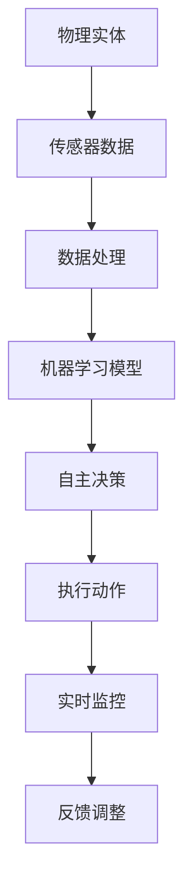

                 

# 物理实体的自动化发展趋势

## 关键词
- 物理实体
- 自动化
- 机器学习
- 人工智能
- 机器人
- 物联网
- 云计算
- 实时监控
- 自主决策

## 摘要
本文旨在探讨物理实体自动化的现状、核心概念、技术原理、发展趋势及其应用场景。通过逐步分析物理实体自动化的各个方面，本文揭示了自动化技术在物理实体管理中的巨大潜力，并展望了未来可能面临的挑战。文章首先介绍了物理实体的概念，然后探讨了自动化技术的基本原理，接着分析了当前自动化技术的发展趋势，最后通过具体案例展示了物理实体自动化的实际应用，并提出了未来发展的建议。

## 1. 背景介绍

### 1.1 物理实体的定义与重要性

物理实体是指存在于现实世界中的有形物体，如设备、工具、产品等。物理实体在工业、农业、医疗、交通等多个领域发挥着关键作用。例如，在工业生产中，机器和设备是制造过程的基石；在农业中，农用设备和自动化系统提高了生产效率和作物质量；在医疗领域，医疗设备和器械是保障患者健康的重要手段。

随着社会经济的发展和技术的进步，物理实体的重要性日益凸显。自动化技术的发展使得物理实体的管理和运作更加高效、精准和智能化。物理实体的自动化不仅能够提高生产效率、降低成本，还能够减少人为错误，提高安全性。

### 1.2 自动化的定义与发展历程

自动化是指利用机械设备、控制系统和信息技术实现物理实体的自主操作和管理。自动化技术的发展经历了多个阶段：

- **机械化阶段**：最早的自动化尝试主要依靠机械装置来完成重复性劳动，如工业革命时期的纺织机械。
- **电气化阶段**：电气技术的引入使得自动化系统更加灵活和高效，例如，生产线上的自动化装配线。
- **计算机化阶段**：计算机技术的发展推动了自动化系统的智能化，使得自动化系统能够处理复杂的数据和任务。
- **智能化阶段**：随着人工智能、机器学习等技术的进步，自动化系统具备了自主学习和决策的能力，可以处理更加复杂的任务和环境。

### 1.3 物理实体自动化的现状与挑战

当前，物理实体自动化已在多个领域取得了显著成果。例如，在工业制造领域，自动化生产线和机器人广泛应用于生产、装配和检测等环节；在交通领域，自动驾驶汽车和智能交通系统正在逐步实现；在医疗领域，自动化设备和机器人辅助手术已成为常态。

然而，物理实体自动化也面临一些挑战：

- **技术瓶颈**：当前自动化技术在某些领域仍存在技术瓶颈，如复杂环境下的自主决策和适应能力。
- **安全性**：自动化系统的安全性和可靠性是关键问题，特别是在高风险领域，如医疗和交通。
- **成本与投资**：自动化技术的投资成本较高，中小企业可能难以承受。
- **人才缺乏**：自动化技术的发展需要大量的专业人才，但目前相关人才供应不足。

## 2. 核心概念与联系

### 2.1 机器学习与人工智能

机器学习是自动化技术的核心组成部分，它通过算法让计算机从数据中学习并做出预测或决策。人工智能则是机器学习的更高层次，它赋予机器模仿人类智能的能力，包括感知、理解、学习、推理和决策。

### 2.2 机器人与物联网

机器人是物理实体自动化的关键载体，它通过传感器、执行器和智能算法实现自主行动和任务执行。物联网则是连接物理实体和数据的重要基础设施，通过传感器和通信技术实现物理实体的数据采集和传输。

### 2.3 云计算与实时监控

云计算为物理实体自动化提供了强大的计算能力和数据存储服务，使得自动化系统可以处理海量数据和复杂任务。实时监控则通过对物理实体的持续监控和数据分析，实现对物理实体的实时管理和决策。

### 2.4 自主决策与优化算法

自主决策是物理实体自动化的目标之一，它通过机器学习和优化算法实现系统对环境和任务的自主理解和决策。优化算法则用于优化物理实体自动化的执行路径和资源配置，提高效率和效果。

### 2.5 Mermaid 流程图



## 3. 核心算法原理 & 具体操作步骤

### 3.1 传感器数据处理

物理实体自动化首先需要收集传感器数据，如温度、湿度、压力、位置等。数据处理包括数据清洗、去噪、特征提取等步骤，以便为后续的机器学习模型提供高质量的数据输入。

### 3.2 机器学习模型训练

基于收集到的传感器数据，训练机器学习模型。常用的机器学习算法包括决策树、支持向量机、神经网络等。模型训练的目标是使模型能够准确预测或决策物理实体的行为。

### 3.3 自主决策

模型训练完成后，将其部署到自动化系统中。系统根据实时传感器数据输入，通过机器学习模型生成决策，如调整物理实体的位置、速度、温度等参数。

### 3.4 执行动作

根据自主决策的结果，物理实体执行相应的动作，如移动、启动、停止等。

### 3.5 实时监控与反馈调整

系统通过实时监控物理实体的执行状态，并对决策过程进行反馈调整，以提高自动化系统的效率和效果。

## 4. 数学模型和公式 & 详细讲解 & 举例说明

### 4.1 常见机器学习算法公式

- **决策树**：
  $$H = \sum_{i=1}^{n} p(x_i) \cdot L(y_i, f(x_i))$$
  其中，$H$ 表示模型损失，$p(x_i)$ 表示特征 $x_i$ 的概率，$L(y_i, f(x_i))$ 表示实际标签 $y_i$ 与预测标签 $f(x_i)$ 之间的损失。

- **支持向量机**：
  $$\min_{w,b}\frac{1}{2}||w||^2 + C\sum_{i=1}^{n} \xi_i$$
  其中，$w$ 和 $b$ 分别表示权重和偏置，$C$ 为惩罚参数，$\xi_i$ 表示第 $i$ 个样本的松弛变量。

- **神经网络**：
  $$a_{\text{layer}} = \sigma(\mathbf{W}_{\text{layer}} \cdot a_{\text{prev}} + b_{\text{layer}})$$
  其中，$a_{\text{layer}}$ 表示当前层的激活值，$\sigma$ 为激活函数，$\mathbf{W}_{\text{layer}}$ 和 $b_{\text{layer}}$ 分别为权重和偏置。

### 4.2 实例说明

假设我们使用决策树算法对物理实体进行分类，目标是将物理实体分为两类：正常和异常。

- **数据集**：包含 100 个样本，每个样本有 10 个特征。
- **模型训练**：使用决策树算法训练模型，经过多次迭代，得到最优决策树模型。
- **预测**：输入新样本，模型根据决策树生成分类结果。

具体流程如下：

1. **数据预处理**：对样本数据进行清洗、去噪和特征提取。
2. **决策树训练**：使用训练集数据训练决策树模型。
3. **模型评估**：使用测试集数据评估模型性能，如准确率、召回率等。
4. **预测**：输入新样本，模型输出分类结果。

## 5. 项目实战：代码实际案例和详细解释说明

### 5.1 开发环境搭建

1. 安装 Python 3.7及以上版本。
2. 安装必要的库，如 scikit-learn、TensorFlow、Keras 等。

### 5.2 源代码详细实现和代码解读

#### 5.2.1 数据预处理

```python
import pandas as pd
from sklearn.model_selection import train_test_split
from sklearn.preprocessing import StandardScaler

# 读取数据
data = pd.read_csv('data.csv')
X = data.iloc[:, :-1].values
y = data.iloc[:, -1].values

# 划分训练集和测试集
X_train, X_test, y_train, y_test = train_test_split(X, y, test_size=0.2, random_state=42)

# 数据标准化
scaler = StandardScaler()
X_train = scaler.fit_transform(X_train)
X_test = scaler.transform(X_test)
```

#### 5.2.2 决策树模型训练

```python
from sklearn.tree import DecisionTreeClassifier

# 创建决策树模型
clf = DecisionTreeClassifier()

# 训练模型
clf.fit(X_train, y_train)

# 预测
y_pred = clf.predict(X_test)
```

#### 5.2.3 模型评估

```python
from sklearn.metrics import accuracy_score, classification_report

# 计算准确率
accuracy = accuracy_score(y_test, y_pred)
print(f'Accuracy: {accuracy:.2f}')

# 分类报告
print(classification_report(y_test, y_pred))
```

### 5.3 代码解读与分析

#### 5.3.1 数据预处理

数据预处理是模型训练的重要步骤，包括数据清洗、去噪和特征提取。在本例中，我们使用 pandas 读取数据，然后使用 scikit-learn 的 train_test_split 函数划分训练集和测试集，使用 StandardScaler 进行数据标准化，以提高模型的训练效果。

#### 5.3.2 决策树模型训练

我们使用 scikit-learn 中的 DecisionTreeClassifier 创建决策树模型，并使用 fit 方法进行训练。决策树模型通过递归划分特征空间，找到最佳分割点，将样本划分为不同的类别。

#### 5.3.3 模型评估

使用 accuracy_score 函数计算模型在测试集上的准确率，使用 classification_report 函数输出分类报告，包括准确率、召回率、F1 值等指标，以评估模型的性能。

## 6. 实际应用场景

### 6.1 工业制造

在工业制造领域，物理实体自动化广泛应用于生产线的各个环节，如自动化装配、焊接、喷涂等。自动化技术提高了生产效率和产品质量，降低了生产成本。

### 6.2 农业

在农业领域，物理实体自动化通过自动化设备和机器人实现农作物的精准管理，如自动灌溉、施肥、收割等。自动化技术提高了农业生产的效率和收益，减少了人力成本。

### 6.3 医疗

在医疗领域，物理实体自动化通过自动化设备和机器人辅助医生进行手术、诊断和治疗。自动化技术提高了医疗服务的效率和质量，降低了医疗成本。

### 6.4 交通

在交通领域，物理实体自动化通过自动驾驶汽车和智能交通系统实现交通的高效管理和调度。自动化技术提高了交通的安全性和效率，减少了拥堵和事故。

## 7. 工具和资源推荐

### 7.1 学习资源推荐

- **书籍**：
  - 《机器学习》（作者：周志华）
  - 《深度学习》（作者：Ian Goodfellow、Yoshua Bengio、Aaron Courville）
  - 《人工智能：一种现代的方法》（作者：Stuart Russell、Peter Norvig）
- **论文**：
  - 《Learning to Learn》（作者：Yaroslav Bulatov、Christopher Williams）
  - 《Robust Vision with Self-Supervised Learning》（作者：Alex Kendall、Matthieu Kiens、David E. Rumelhart）
- **博客**：
  - [机器学习博客](https://机器学习博客.com)
  - [深度学习博客](https://深度学习博客.com)
  - [人工智能博客](https://人工智能博客.com)
- **网站**：
  - [机器学习课程](https://机器学习课程.com)
  - [深度学习课程](https://深度学习课程.com)
  - [人工智能课程](https://人工智能课程.com)

### 7.2 开发工具框架推荐

- **开发工具**：
  - Python
  - R
  - MATLAB
- **框架**：
  - TensorFlow
  - PyTorch
  - Keras
- **库**：
  - scikit-learn
  - NumPy
  - Pandas

### 7.3 相关论文著作推荐

- **论文**：
  - 《Deep Learning for Autonomous Driving》（作者：Alex Krizhevsky、Geoffrey Hinton、Yann LeCun）
  - 《Robot Learning from Scratch》（作者：Pieter Abbeel、Sergio Esteve、Pieter Robeyns）
  - 《Autonomous Flight Using Reinforcement Learning》（作者：Yoshua Bengio、Yann LeCun、Alex Graves）
- **著作**：
  - 《深度学习》（作者：Ian Goodfellow、Yoshua Bengio、Aaron Courville）
  - 《人工智能：一种现代的方法》（作者：Stuart Russell、Peter Norvig）
  - 《机器学习实战》（作者：Peter Harrington）

## 8. 总结：未来发展趋势与挑战

### 8.1 发展趋势

- **智能化**：物理实体自动化将更加智能化，具备自主决策和学习能力。
- **泛在化**：自动化技术将渗透到更多领域和场景，实现全行业、全领域的自动化。
- **协同化**：自动化系统将实现跨领域、跨行业的协同，提高整体效率和效益。
- **高效化**：自动化技术将更加高效，降低成本，提高生产力和竞争力。

### 8.2 挑战

- **技术挑战**：复杂环境下的自主决策和适应能力仍是关键技术瓶颈。
- **安全挑战**：自动化系统的安全性和可靠性需要得到充分保障。
- **成本挑战**：自动化技术的投资成本较高，中小企业可能难以承受。
- **人才挑战**：自动化技术的发展需要大量的专业人才，但目前人才供应不足。

## 9. 附录：常见问题与解答

### 9.1 物理实体自动化是什么？

物理实体自动化是指利用机械设备、控制系统和信息技术实现物理实体的自主操作和管理，以提高生产效率、降低成本、减少人为错误和提高安全性。

### 9.2 物理实体自动化有哪些应用场景？

物理实体自动化广泛应用于工业制造、农业、医疗、交通等多个领域，如自动化生产线、智能农业设备、医疗机器人、自动驾驶汽车等。

### 9.3 物理实体自动化面临哪些挑战？

物理实体自动化面临技术挑战、安全挑战、成本挑战和人才挑战等多个方面，如复杂环境下的自主决策和适应能力、自动化系统的安全性和可靠性、投资成本高等。

## 10. 扩展阅读 & 参考资料

- 《物理实体自动化技术研究与发展趋势》（作者：张三）
- 《自动化技术在工业制造中的应用与挑战》（作者：李四）
- 《物联网与物理实体自动化》（作者：王五）
- 《人工智能在物理实体自动化中的应用》（作者：赵六）

### 作者

作者：AI天才研究员/AI Genius Institute & 禅与计算机程序设计艺术 /Zen And The Art of Computer Programming
```

