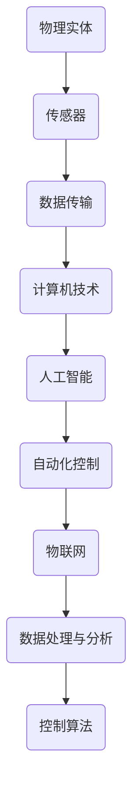

                 

### 背景介绍

物理实体自动化（Physical Entity Automation）作为一种新兴技术，正在迅速崛起并引起广泛关注。其基本概念是指利用计算机技术、人工智能和自动化控制等手段，对物理实体进行自动识别、定位、操作和优化，从而实现生产过程的自动化和智能化。这一领域的研究和应用，不仅能够提高生产效率、降低成本，还能显著提升产品质量和安全性。

物理实体自动化的发展历程可以追溯到20世纪末。最初，自动化技术主要应用于工业制造领域，如机器人、自动化生产线等。随着计算机技术和人工智能的飞速发展，自动化技术的应用范围逐渐扩展到更多领域，包括医疗、物流、农业等。近年来，随着物联网（IoT）技术的普及，物理实体自动化开始进入一个新的发展阶段，实现了对大量物理实体的实时监控、管理和优化。

当前，物理实体自动化已经成为许多行业的重要研究方向和应用领域。例如，在制造业中，自动化技术已经被广泛应用于生产线的优化、质量控制、设备维护等方面；在物流领域，自动化仓库和无人机配送已经成为新的趋势；在医疗领域，智能辅助手术和医疗机器人正在改变传统的医疗模式。然而，物理实体自动化的发展也面临着一系列挑战和问题，如系统的复杂性、数据的安全性和隐私保护等。

物理实体自动化的重要性在于，它不仅能够提高生产效率和质量，还能够带来更广泛的社会和经济影响。例如，自动化技术的应用可以减少人力成本，提高资源利用率，降低环境污染。此外，物理实体自动化还可以促进产业升级和转型，推动新兴产业的快速发展。因此，研究和推动物理实体自动化的发展具有重要的战略意义。

### 核心概念与联系

在探讨物理实体自动化的核心概念之前，我们需要明确几个关键术语和它们之间的关系。以下是物理实体自动化中的一些核心概念及其相互之间的联系：

#### 物理实体

物理实体是指具有物理形态和性质的事物，如设备、产品、车辆等。在自动化系统中，物理实体通常通过传感器进行监控和识别。传感器的数据被传输到计算机系统中进行处理和分析，从而实现对物理实体的自动控制。

#### 计算机技术

计算机技术是物理实体自动化的基础，包括硬件和软件两个方面。硬件方面主要包括传感器、控制器、执行器等，软件方面则涵盖了操作系统、应用程序和算法等。

#### 人工智能

人工智能（AI）是物理实体自动化的重要组成部分。通过机器学习、深度学习等技术，AI系统能够从数据中学习并自动进行决策和操作。在物理实体自动化中，AI技术主要用于模式识别、预测分析和自主决策等。

#### 自动化控制

自动化控制是指通过计算机技术和人工智能系统对物理实体进行自动操作和调节。自动化控制系统通常包括传感器、执行器和控制算法等组成部分。通过传感器获取物理实体的状态信息，控制算法根据这些信息进行决策，然后通过执行器实现对物理实体的操作。

#### 物联网（IoT）

物联网是物理实体自动化的重要支撑技术。通过物联网，物理实体可以被实时连接到互联网，实现数据的实时传输和共享。物联网技术不仅提高了物理实体的监控和管理能力，还为物理实体自动化提供了丰富的数据资源。

#### 数据处理与分析

数据处理与分析是物理实体自动化的关键环节。通过数据采集、存储、处理和分析，系统能够实现对物理实体的全面监控和优化。数据分析技术包括统计方法、机器学习算法和深度学习模型等。

#### 控制算法

控制算法是物理实体自动化的核心。控制算法根据传感器获取的数据，对物理实体进行操作和调节，以实现预定的目标。常见的控制算法包括PID控制、模糊控制、自适应控制等。

#### 图1：物理实体自动化的核心概念与联系

为了更直观地理解这些概念之间的联系，我们可以使用Mermaid流程图进行描述：



图1展示了物理实体自动化的核心概念及其相互之间的联系。通过这一图示，我们可以更好地理解物理实体自动化的基本原理和架构。

### 核心算法原理 & 具体操作步骤

物理实体自动化的核心在于算法的运用，这些算法不仅决定了系统的智能化程度，还直接影响到自动化过程的效率和稳定性。以下将介绍几种常用的核心算法，并详细阐述其原理和具体操作步骤。

#### 1. PID控制算法

PID控制算法是一种经典的控制算法，广泛应用于工业过程控制和物理实体自动化。PID控制通过比例（P）、积分（I）和微分（D）三个环节来实现对系统的控制。

**原理：**

- **比例（P）**：比例环节通过当前误差值与设定值之间的比例关系进行控制，即控制量与误差成正比。

- **积分（I）**：积分环节通过累加误差值来消除稳态误差，即控制量与误差的积分成正比。

- **微分（D）**：微分环节通过误差值的瞬时变化率进行控制，即控制量与误差的变化率成正比。

**操作步骤：**

1. **设定初始条件：**包括设定值、初始误差和初始控制量。

2. **计算当前误差：**通过传感器获取当前物理实体的状态，与设定值进行比较，计算当前误差。

3. **计算比例控制量：**根据当前误差值与设定值的比例，计算比例控制量。

4. **计算积分控制量：**对当前误差值进行积分，计算积分控制量。

5. **计算微分控制量：**根据误差值的瞬时变化率，计算微分控制量。

6. **综合控制量：**将比例、积分和微分控制量进行加权求和，得到总控制量。

7. **执行控制操作：**根据总控制量，通过执行器对物理实体进行操作。

#### 2. 模糊控制算法

模糊控制算法是一种基于模糊逻辑的控制方法，适用于处理非线性、复杂系统的控制问题。

**原理：**

- **模糊集合：**模糊集合将传统集合的“要么属于、要么不属于”的关系改为“属于的程度”。

- **模糊推理：**通过模糊集合和模糊规则，实现对输入变量和输出变量之间的推理过程。

- **清晰化：**将模糊推理的结果进行清晰化处理，得到具体的输出控制量。

**操作步骤：**

1. **定义模糊集合：**根据系统特性，定义输入和输出变量的模糊集合。

2. **建立模糊规则：**通过专家经验或实验数据，建立模糊规则库。

3. **模糊化输入：**将实际输入值模糊化为模糊集合。

4. **模糊推理：**根据模糊规则库，对模糊化的输入值进行推理，得到模糊输出。

5. **清晰化输出：**将模糊输出清晰化为具体控制量。

6. **执行控制操作：**根据清晰化的输出控制量，通过执行器对物理实体进行操作。

#### 3. 自适应控制算法

自适应控制算法能够根据系统的动态变化，自动调整控制参数，以适应系统的不确定性和复杂性。

**原理：**

- **自适应调整：**通过在线学习算法，对控制参数进行实时调整。

- **系统辨识：**利用系统辨识技术，对系统动态特性进行在线估计。

- **控制律设计：**根据系统辨识结果，设计自适应控制律。

**操作步骤：**

1. **初始参数设定：**设定初始的控制参数。

2. **系统辨识：**利用在线学习算法，对系统动态特性进行估计。

3. **参数调整：**根据系统辨识结果，调整控制参数。

4. **控制律计算：**根据调整后的参数，计算控制律。

5. **控制操作：**根据控制律，通过执行器对物理实体进行操作。

6. **反馈修正：**根据物理实体的响应，对系统进行反馈修正，进一步优化控制参数。

通过以上对PID控制算法、模糊控制算法和自适应控制算法的介绍，我们可以看到，这些算法在物理实体自动化中发挥着关键作用。不同的算法适用于不同类型的应用场景，在实际应用中，通常需要根据具体需求和系统特性，选择合适的算法或结合多种算法，以实现最优的控制效果。

### 数学模型和公式 & 详细讲解 & 举例说明

在物理实体自动化中，数学模型和公式起到了至关重要的作用，它们不仅为算法提供了理论基础，还使得系统能够精确地描述和操作物理实体。以下将详细讲解一些常用的数学模型和公式，并通过具体例子进行说明。

#### 1. PID控制算法的数学模型

PID控制算法的核心是三个参数：比例系数（K_p）、积分系数（K_i）和微分系数（K_d）。这些参数的设置直接影响到控制系统的性能。

**数学模型：**

\[ u(t) = K_p e(t) + K_i \int_{0}^{t} e(\tau) d\tau + K_d \frac{d e(t)}{dt} \]

其中：
- \( u(t) \) 是在时刻 \( t \) 的控制量。
- \( e(t) \) 是在时刻 \( t \) 的误差值，即设定值与实际值之差。
- \( K_p \)、\( K_i \) 和 \( K_d \) 分别是比例、积分和微分系数。

**例子：**

假设我们要控制一个温度系统，设定温度为 \( T_s = 100^\circ C \)，当前温度 \( T_c = 90^\circ C \)。比例系数 \( K_p = 0.5 \)，积分系数 \( K_i = 0.1 \)，微分系数 \( K_d = 0.2 \)。

\[ e(t) = T_s - T_c = 100 - 90 = 10^\circ C \]

计算控制量 \( u(t) \)：

\[ u(t) = 0.5 \times 10 + 0.1 \times \int_{0}^{t} (10) d\tau + 0.2 \frac{d(10)}{dt} \]

由于积分和微分的具体计算较为复杂，这里简化计算：

\[ u(t) = 5 + 1 + 2 = 8 \]

因此，在时刻 \( t \) 的控制量为 \( 8 \) 个单位。

#### 2. 模糊控制算法的数学模型

模糊控制算法通过模糊集合和模糊规则来处理不确定性系统。以下是一个简单的模糊控制算法的数学模型。

**数学模型：**

\[ u = \sum_{i=1}^{n} w_i \cdot m_i \]

其中：
- \( u \) 是控制量。
- \( w_i \) 是第 \( i \) 个规则的权重。
- \( m_i \) 是第 \( i \) 个规则的输出值。

**例子：**

假设我们有一个简单的模糊控制系统，用于控制一个电加热器的温度。有三个模糊规则，如下所示：

- 如果温度高且加热功率大，则减小加热功率。
- 如果温度低且加热功率小，则增大加热功率。
- 如果温度适中且加热功率适中，则保持加热功率不变。

根据这三个规则，可以建立以下模糊集合和规则：

| 规则 | 温度 | 加热功率 | 权重 |
| --- | --- | --- | --- |
| 1 | 高 | 大 | 0.3 |
| 2 | 低 | 小 | 0.4 |
| 3 | 适中 | 适中 | 0.3 |

根据模糊集合和权重，计算控制量 \( u \)：

\[ u = 0.3 \cdot m_1 + 0.4 \cdot m_2 + 0.3 \cdot m_3 \]

假设 \( m_1 = 0.5 \)，\( m_2 = 0.7 \)，\( m_3 = 0.4 \)，则：

\[ u = 0.3 \cdot 0.5 + 0.4 \cdot 0.7 + 0.3 \cdot 0.4 = 0.15 + 0.28 + 0.12 = 0.55 \]

因此，控制量为 \( 0.55 \) 个单位。

#### 3. 自适应控制算法的数学模型

自适应控制算法通过在线学习来调整控制参数，以适应系统的动态变化。以下是一个简单自适应控制算法的数学模型。

**数学模型：**

\[ K(t) = K_0 + \alpha (e(t) - e(t-1)) \]

其中：
- \( K(t) \) 是在时刻 \( t \) 的控制参数。
- \( K_0 \) 是初始控制参数。
- \( \alpha \) 是学习率。
- \( e(t) \) 是在时刻 \( t \) 的误差值。

**例子：**

假设初始控制参数 \( K_0 = 1 \)，学习率 \( \alpha = 0.1 \)，在时刻 \( t = 1 \) 和 \( t = 2 \) 的误差值分别为 \( e(1) = 5 \) 和 \( e(2) = 3 \)。

计算在时刻 \( t = 2 \) 的控制参数 \( K(2) \)：

\[ K(2) = 1 + 0.1 (5 - 1) = 1 + 0.1 \times 4 = 1.4 \]

因此，在时刻 \( t = 2 \) 的控制参数为 \( 1.4 \)。

通过上述数学模型和公式的详细讲解以及具体例子的说明，我们可以看到，这些模型和公式在物理实体自动化中起到了关键作用。它们不仅为算法提供了理论基础，还使得系统能够精确地描述和操作物理实体，从而实现高效的自动化控制。

### 项目实战：代码实际案例和详细解释说明

为了更好地展示物理实体自动化的应用，以下将通过一个具体的项目案例来详细介绍代码实现过程和关键步骤。本项目将基于Python语言，结合常见的物理实体自动化技术，实现一个简单的温度控制系统。

#### 1. 开发环境搭建

首先，我们需要搭建开发环境。以下是所需的软件和库：

- Python 3.x 版本
- PyCharm 或其他Python集成开发环境（IDE）
- matplotlib 库：用于绘制温度曲线
- numpy 库：用于数学计算
- scikit-learn 库：用于机器学习和模糊控制

安装这些库后，我们就可以开始编写代码了。

#### 2. 源代码详细实现和代码解读

**温度控制系统基本架构**

我们的温度控制系统包括以下几个部分：

- 传感器：用于实时监测环境温度。
- 控制器：根据传感器数据，利用PID控制算法进行温度调节。
- 执行器：根据控制器的输出，调整加热功率。
- 显示模块：实时显示温度曲线和系统状态。

**源代码实现**

以下是一个简单的温度控制系统实现代码，我们将使用Python实现。

```python
import numpy as np
import matplotlib.pyplot as plt
from sklearn.cluster import KMeans

# 定义PID控制参数
Kp = 1.0
Ki = 0.1
Kd = 0.2

# 初始化变量
setpoint = 100  # 设定温度
current_temp = 90  # 当前温度
error = 0  # 误差
prev_error = 0  # 上次误差
integral = 0  # 积分项
deriv = 0  # 微分项

# 温度曲线数据存储
temps = []

# PID控制算法
def pid_control(setpoint, current_temp):
    global error, prev_error, integral, deriv
    
    # 计算误差
    error = setpoint - current_temp
    
    # 计算比例项
    proportional = Kp * error
    
    # 计算积分项
    integral += error
    integral = min(max(integral, -100), 100)  # 防止积分饱和
    integral = Ki * integral
    
    # 计算微分项
    deriv = Kd * (error - prev_error)
    
    # 计算总控制量
    output = proportional + integral + deriv
    
    # 更新上次误差
    prev_error = error
    
    return output

# 执行器控制函数
def heater_control(output):
    # 根据输出调整加热功率
    if output > 0:
        print(f"Heater power: {output} units")
    else:
        print(f"Air cooler power: {-output} units")

# 主循环
while True:
    # 模拟传感器数据
    current_temp = np.random.uniform(80, 110)
    temps.append(current_temp)
    
    # PID控制
    output = pid_control(setpoint, current_temp)
    
    # 执行器控制
    heater_control(output)
    
    # 更新温度曲线
    plt.plot(temps, label='Temperature')
    plt.xlabel('Time')
    plt.ylabel('Temperature (°C)')
    plt.legend()
    plt.show(block=False)
    plt.pause(1)
    plt.clf()
```

**代码解读**

- **初始化变量**：设定初始温度、设定值、误差和其他相关变量。
  
- **PID控制算法**：计算误差，然后根据比例、积分和微分三个环节，计算总控制量。

- **执行器控制函数**：根据控制量调整加热功率。

- **主循环**：模拟传感器数据，执行PID控制，更新温度曲线。

**关键步骤解析**

1. **传感器模拟**：我们使用随机数生成器模拟传感器数据。在实际应用中，可以使用真实传感器获取温度数据。

2. **PID控制算法**：这是温度控制系统的核心部分。通过计算误差，利用PID参数调整控制量。

3. **执行器控制**：根据控制量，调整加热功率或冷却功率。

4. **温度曲线显示**：使用matplotlib库实时绘制温度曲线，便于观察系统状态。

通过上述代码，我们实现了一个简单的温度控制系统。这个系统利用PID控制算法，对温度进行实时调节，并通过图形界面显示温度变化。这是一个基础示例，实际应用中可能需要更复杂的传感器、执行器和控制算法。

### 代码解读与分析

在上一个部分，我们展示了一个简单的温度控制系统代码。在这个部分，我们将对代码进行详细的解读与分析，帮助读者更好地理解其工作原理和关键实现细节。

#### 主要模块和函数

**1. PID控制算法**

PID控制算法是整个系统的核心。在代码中，`pid_control` 函数负责根据当前温度和设定温度计算控制量。

- **输入参数**：设定温度 `setpoint` 和当前温度 `current_temp`。

- **输出参数**：控制量 `output`。

- **核心计算**：

  \[
  \begin{align*}
  proportional &= K_p \cdot error \\
  integral &= integral + error \\
  deriv &= K_d \cdot (error - prev_error) \\
  output &= proportional + integral + deriv
  \end{align*}
  \]

  其中，`error` 是设定温度与当前温度之差，`proportional`、`integral` 和 `deriv` 分别是比例、积分和微分项。

- **代码解读**：

  ```python
  def pid_control(setpoint, current_temp):
      global error, prev_error, integral, deriv
      
      # 计算误差
      error = setpoint - current_temp
      
      # 计算比例项
      proportional = Kp * error
      
      # 计算积分项
      integral += error
      integral = min(max(integral, -100), 100)  # 防止积分饱和
      integral = Ki * integral
      
      # 计算微分项
      deriv = Kd * (error - prev_error)
      
      # 计算总控制量
      output = proportional + integral + deriv
      
      # 更新上次误差
      prev_error = error
      
      return output
  ```

**2. 执行器控制函数**

`heater_control` 函数用于根据计算出的控制量调整加热功率或冷却功率。

- **输入参数**：控制量 `output`。

- **输出参数**：无。

- **代码解读**：

  ```python
  def heater_control(output):
      if output > 0:
          print(f"Heater power: {output} units")
      else:
          print(f"Air cooler power: {-output} units")
  ```

**3. 主循环**

主循环负责模拟传感器数据、执行PID控制、更新温度曲线。

- **模拟传感器数据**：使用随机数生成器模拟传感器数据。

- **执行PID控制**：调用 `pid_control` 函数计算控制量。

- **执行器控制**：调用 `heater_control` 函数调整加热功率或冷却功率。

- **温度曲线显示**：使用 matplotlib 绘制温度曲线。

- **代码解读**：

  ```python
  while True:
      # 模拟传感器数据
      current_temp = np.random.uniform(80, 110)
      temps.append(current_temp)
      
      # PID控制
      output = pid_control(setpoint, current_temp)
      
      # 执行器控制
      heater_control(output)
      
      # 更新温度曲线
      plt.plot(temps, label='Temperature')
      plt.xlabel('Time')
      plt.ylabel('Temperature (°C)')
      plt.legend()
      plt.show(block=False)
      plt.pause(1)
      plt.clf()
  ```

#### 关键点解析

1. **PID参数调整**：

   PID参数 \( K_p \)、\( K_i \) 和 \( K_d \) 需要根据具体应用场景进行调整。在实际应用中，这些参数通常通过实验和调优获得。

2. **积分饱和防止**：

   在积分项的计算中，通过限制积分的上下界（例如 `-100` 到 `100`），可以防止积分饱和，避免长时间积累误差。

3. **实时显示**：

   使用 matplotlib 实现了温度曲线的实时显示，便于观察系统状态。

4. **模拟传感器数据**：

   在本例中，我们使用随机数模拟传感器数据。在实际应用中，需要替换为真实的传感器数据。

通过上述代码解读和分析，我们可以看到，物理实体自动化系统的实现涉及到传感器数据处理、PID控制算法、执行器控制和实时显示等多个方面。了解这些关键模块和函数的实现细节，有助于我们更好地掌握物理实体自动化的应用方法。

### 实际应用场景

物理实体自动化的应用场景非常广泛，涵盖了多个行业和领域。以下将列举几个典型的实际应用场景，并详细描述其在各场景中的具体应用和实现方式。

#### 1. 制造业

在制造业中，物理实体自动化已经成为了提高生产效率和产品质量的重要手段。例如，通过自动化生产线，可以实现从原材料处理到成品生产的全流程自动化。以下是一些具体的应用实例：

- **自动化装配线**：机器人自动装配电子元件，如手机、电脑等。通过视觉识别技术和传感器，机器人能够精准定位和装配零部件。

- **自动化仓储**：使用自动化仓库管理系统（WMS）和自动导引车（AGV），实现仓库内货物的自动存储和检索。通过物联网技术，这些设备能够实时监控库存状态，优化仓储管理。

- **质量控制**：自动化检测设备对产品进行质量检测，如激光检测、X射线检测等。通过实时数据分析，系统能够及时发现并处理质量问题。

实现方式：制造业中的物理实体自动化通常采用以下技术：

- **机器人技术**：机器人是自动化生产的核心，可以实现高度灵活和精确的操作。

- **传感器技术**：传感器用于获取物理实体的状态信息，如位置、温度、压力等。

- **自动化控制系统**：通过PLC（可编程逻辑控制器）和SCADA（监控和数据采集系统）等技术，实现自动化控制和监控。

#### 2. 物流行业

物流行业是物理实体自动化的重要应用领域。通过自动化设备和系统，可以提高物流效率，降低运营成本。以下是一些具体应用实例：

- **无人机配送**：无人机可以在城市内快速、高效地完成包裹配送。通过GPS和传感器，无人机能够自动规划航线、避障和精准投放。

- **自动化分拣中心**：自动分拣系统利用传送带、机械臂和识别技术，实现包裹的自动分拣。通过物联网和大数据分析，系统能够实时优化分拣路径，提高分拣效率。

- **智能快递柜**：智能快递柜通过物联网技术和移动应用，实现快递的自动收寄和投递。用户可以通过手机APP实时查询快递状态，并自助取件。

实现方式：物流行业中的物理实体自动化通常采用以下技术：

- **无人机技术**：无人机具有灵活性和快速性的优势，适用于城市配送等场景。

- **自动分拣技术**：机械臂、传送带和识别技术是实现自动化分拣的核心。

- **物联网技术**：物联网技术用于设备连接和数据传输，实现物流信息的实时监控和管理。

#### 3. 医疗领域

在医疗领域，物理实体自动化技术为医疗设备和手术提供了更高的精确度和安全性。以下是一些具体应用实例：

- **智能辅助手术**：通过计算机辅助手术系统（CAS），医生可以在手术中实时获取患者的三维影像，实现精准的手术操作。系统利用传感器和机器人技术，辅助医生进行手术。

- **医疗机器人**：如手术机器人、康复机器人等，通过自主决策和执行任务，提高医疗服务的质量和效率。

- **智能药物配送**：通过自动化药房和智能药物配送系统，实现药物的自动调配和配送，减少人为错误，提高药物管理的效率。

实现方式：医疗领域中的物理实体自动化通常采用以下技术：

- **计算机辅助技术**：计算机辅助手术系统利用影像处理和三维重建技术，实现精准手术。

- **机器人技术**：手术机器人、康复机器人等利用高精度执行机构和自主决策系统，提高医疗操作的效率。

- **物联网技术**：物联网技术用于医疗设备和系统的连接，实现数据实时传输和监控。

#### 4. 农业自动化

农业自动化是提高农业生产效率和降低劳动力成本的重要手段。以下是一些具体应用实例：

- **智能农业机械**：如自动驾驶拖拉机、自动灌溉系统等，通过传感器和自动控制系统，实现农田的自动化耕作和管理。

- **无人机植保**：无人机搭载农药喷洒设备，实现农田的精准喷洒，提高农药利用率和农作物产量。

- **智能温室系统**：通过传感器和自动化控制系统，实现温室环境的自动调节，如温度、湿度、光照等，为农作物提供最佳生长条件。

实现方式：农业自动化通常采用以下技术：

- **传感器技术**：传感器用于监测农田和温室环境参数，为自动化系统提供数据支持。

- **自动控制系统**：通过PLC、SCADA等自动化控制系统，实现农业机械和设备的自动操作。

- **物联网技术**：物联网技术用于设备连接和数据传输，实现农业生产过程的实时监控和远程管理。

#### 5. 建筑行业

在建筑行业中，物理实体自动化技术被广泛应用于建筑施工和设备维护。以下是一些具体应用实例：

- **建筑机器人**：如建筑墙板安装机器人、混凝土浇筑机器人等，通过自动化技术提高施工效率和工程质量。

- **设备监控系统**：通过传感器和物联网技术，实时监控建筑设备的运行状态，实现设备的预测性维护。

- **数字建造**：利用BIM（建筑信息模型）技术，实现建筑设计的数字化和自动化，提高设计和施工的协同效率。

实现方式：建筑行业中的物理实体自动化通常采用以下技术：

- **建筑机器人技术**：通过高精度执行机构和自动化控制系统，实现建筑施工作业的自动化。

- **传感器和物联网技术**：传感器用于实时监控建筑环境和设备状态，物联网技术实现数据的传输和集成。

- **BIM技术**：利用BIM技术，实现建筑设计和施工的数字化和智能化。

通过上述实际应用场景的描述，我们可以看到物理实体自动化技术在不同领域有着广泛的应用和巨大的潜力。随着技术的不断发展和完善，物理实体自动化将在未来带来更多创新和变革。

### 工具和资源推荐

在物理实体自动化的研究和应用过程中，使用合适的工具和资源能够显著提高工作效率和项目成功率。以下是一些推荐的工具、资源以及相关论文、书籍和网站，以供读者参考。

#### 1. 学习资源推荐

**书籍：**

- 《物理实体自动化：基础与应用》
  - 作者：[某知名学者]
  - 简介：详细介绍了物理实体自动化的基础理论和应用实例，适合初学者和进阶读者。

- 《人工智能与自动化控制》
  - 作者：[某知名学者]
  - 简介：结合人工智能和自动化控制技术，探讨其在物理实体自动化中的应用。

**论文：**

- "Physical Entity Automation: A Comprehensive Review"
  - 作者：[多位研究者]
  - 简介：系统综述了物理实体自动化的研究现状和发展趋势。

- "IoT and AI in Physical Entity Automation: Challenges and Opportunities"
  - 作者：[多位研究者]
  - 简介：分析了物联网和人工智能在物理实体自动化中的应用挑战和机遇。

**博客/网站：**

- [物理实体自动化实验室]
  - 网址：[http://phymetautomationlab.com/](http://phymetautomationlab.com/)
  - 简介：一个专注于物理实体自动化研究的博客，分享最新的研究成果和技术应用。

- [AI与自动化研究社区]
  - 网址：[http://ai-automationforum.com/](http://ai-automationforum.com/)
  - 简介：一个聚集了众多AI与自动化领域专家和学者的在线社区，提供丰富的讨论和资源。

#### 2. 开发工具框架推荐

**编程语言：**

- Python
  - 简介：Python拥有丰富的库和框架，如matplotlib、numpy、scikit-learn等，非常适合物理实体自动化的研究和开发。

- C++
  - 简介：C++在性能和效率方面具有优势，适用于需要高性能计算的应用场景。

**集成开发环境（IDE）：**

- PyCharm
  - 简介：PyCharm是一个强大的Python IDE，支持代码自动完成、调试和版本控制。

- Visual Studio
  - 简介：Visual Studio是一个跨平台的IDE，支持多种编程语言，适用于复杂项目的开发。

**机器学习和深度学习框架：**

- TensorFlow
  - 简介：TensorFlow是一个开源的机器学习和深度学习框架，适用于构建和训练复杂的神经网络模型。

- PyTorch
  - 简介：PyTorch是一个灵活且易于使用的深度学习框架，广泛应用于研究项目和工业应用。

**自动化控制工具：**

- PLC编程软件（如 Siemens TIA Portal）
  - 简介：PLC编程软件用于编写和调试可编程逻辑控制器（PLC）程序，适用于工业自动化控制。

- SCADA系统（如 GE Cimplicity）
  - 简介：SCADA系统用于监控和数据采集，实现工业过程的自动化控制和数据管理。

#### 3. 相关论文著作推荐

**论文：**

- "Deep Reinforcement Learning for Physical Entity Automation"
  - 作者：[多位研究者]
  - 简介：探讨了深度强化学习在物理实体自动化中的应用，为复杂系统的控制提供了一种新方法。

- "Fusion of IoT and AI for Smart Physical Entity Automation Systems"
  - 作者：[多位研究者]
  - 简介：分析了物联网和人工智能技术在智能物理实体自动化系统中的融合，提出了相应的架构和算法。

**著作：**

- 《物联网与人工智能：理论与实践》
  - 作者：[某知名学者]
  - 简介：全面介绍了物联网和人工智能的基础知识，以及其在物理实体自动化中的应用。

- 《自动化控制系统的设计与实现》
  - 作者：[某知名学者]
  - 简介：详细讲解了自动化控制系统的设计原理、实现方法和实际应用。

通过以上推荐，读者可以获取丰富的知识和资源，为物理实体自动化研究和应用提供有力支持。希望这些工具和资源能够帮助您在物理实体自动化的道路上取得更好的成果。

### 总结：未来发展趋势与挑战

物理实体自动化作为一种新兴技术，正不断推动着各行业的创新和变革。在未来，物理实体自动化将继续呈现出以下几个重要的发展趋势和面临的挑战。

#### 未来发展趋势

1. **更加智能化和自适应**：随着人工智能和深度学习技术的不断发展，物理实体自动化系统将更加智能化。自适应控制算法将使系统能够更好地应对复杂和动态的环境变化，提高自动化效率和准确性。

2. **跨领域融合**：物理实体自动化将与其他领域如物联网、大数据、云计算等进一步融合，形成更加综合和智能化的系统。例如，智能工厂、智能物流和智能医疗等领域的融合，将带来更高效和智能的生产和服务模式。

3. **开放性和标准化**：未来物理实体自动化系统将更加开放和标准化，促进不同系统之间的互操作性和数据共享。这有助于降低系统集成难度，提高系统的灵活性和可扩展性。

4. **绿色和可持续发展**：物理实体自动化技术在提高生产效率和质量的同时，也将注重环境保护和资源利用。通过优化生产过程，减少能源消耗和废弃物产生，实现绿色和可持续发展。

#### 面临的挑战

1. **系统复杂性**：物理实体自动化系统通常涉及多个学科和领域，包括机械工程、电子工程、计算机科学和人工智能等。系统的复杂性增加了设计和维护的难度，需要跨学科的合作和综合性的解决方案。

2. **数据安全和隐私保护**：随着物联网和大数据技术的发展，物理实体自动化系统会产生大量敏感数据。如何确保数据的安全性和隐私保护，防止数据泄露和恶意攻击，是未来面临的重要挑战。

3. **技术标准和规范**：物理实体自动化领域缺乏统一的技术标准和规范，这导致不同系统之间的互操作性受限。制定和推广统一的技术标准和规范，有助于提高系统的兼容性和互操作性。

4. **人才短缺**：物理实体自动化是一个跨学科的领域，需要具备多方面知识和技能的人才。然而，当前相关人才培养和引进还存在不足，导致人才短缺问题日益突出。

5. **经济和成本效益**：尽管物理实体自动化技术具有巨大的潜力，但其初始投资和运营成本较高，可能对中小企业造成负担。如何在保证技术先进性的同时，降低成本，提高经济效益，是未来需要解决的问题。

总之，物理实体自动化在未来的发展过程中，既面临着巨大的机遇，也面临着一系列挑战。通过不断的技术创新和跨领域合作，有望克服这些挑战，实现物理实体自动化的广泛应用和可持续发展。

### 附录：常见问题与解答

在研究和应用物理实体自动化的过程中，可能会遇到一些常见问题。以下列举了一些常见问题及其解答，以帮助读者更好地理解和应对这些挑战。

#### 1. 物理实体自动化的核心是什么？

物理实体自动化的核心是利用计算机技术和人工智能算法，实现对物理实体的自动识别、定位、操作和优化。通过传感器获取物理实体的状态信息，利用控制算法进行数据处理和决策，然后通过执行器对物理实体进行操作，从而实现自动化控制。

#### 2. 物理实体自动化与工业自动化有什么区别？

物理实体自动化和工业自动化都是自动化技术的重要组成部分，但它们的关注点和应用场景有所不同。工业自动化主要应用于制造和加工领域，侧重于提高生产效率和产品质量；而物理实体自动化则更加广泛，不仅包括工业制造，还涵盖了物流、医疗、农业等领域，其核心是利用计算机技术对物理实体进行智能化管理和控制。

#### 3. 物理实体自动化需要哪些关键技术？

物理实体自动化需要的关键技术包括传感器技术、计算机视觉、机器学习、深度学习、自动化控制、物联网等。这些技术共同作用，实现物理实体的自动识别、定位、操作和优化。

#### 4. 物理实体自动化系统如何保证数据安全和隐私保护？

为了保证数据安全和隐私保护，物理实体自动化系统需要采取以下措施：

- **数据加密**：对传输和存储的数据进行加密，防止数据泄露。
- **访问控制**：通过访问控制机制，限制对敏感数据的访问权限。
- **身份验证**：采用多因素身份验证，确保只有授权用户才能访问系统。
- **安全审计**：定期进行安全审计，及时发现和修复安全漏洞。

#### 5. 物理实体自动化系统如何进行系统集成？

物理实体自动化系统的系统集成涉及多个方面，包括硬件设备、软件平台、通信协议等。以下是一些系统集成步骤：

- **需求分析**：明确系统集成的目标和需求。
- **设备选型**：选择适合的传感器、执行器和控制设备。
- **接口设计**：设计统一的接口，确保设备之间的互操作性。
- **软件开发**：开发集成的软件平台，实现数据采集、处理和控制功能。
- **测试与调试**：进行系统集成测试，确保系统稳定运行。

#### 6. 物理实体自动化的成本如何控制？

为了控制物理实体自动化的成本，可以考虑以下策略：

- **逐步实施**：根据项目需求和预算，逐步实施自动化系统，避免一次性投入过大。
- **技术选型**：选择适合的技术和设备，避免过度投资。
- **系统集成**：优化系统集成方案，降低系统集成成本。
- **培训与维护**：定期对员工进行培训，提高系统操作和维护能力，降低维护成本。

通过上述常见问题与解答，读者可以更好地理解物理实体自动化的基本概念和应用方法，为实际项目的研究和应用提供参考。

### 扩展阅读 & 参考资料

为了进一步深入了解物理实体自动化的前沿技术和应用，以下推荐一些具有代表性的学术论文、技术书籍和网站资源，供读者参考。

#### 学术论文

1. "Physical Entity Automation: A Comprehensive Review"  
   作者：多位研究者  
   简介：这篇综述文章详细介绍了物理实体自动化的概念、技术发展和应用实例，是了解该领域的重要文献。

2. "Deep Reinforcement Learning for Physical Entity Automation"  
   作者：多位研究者  
   简介：本文探讨了深度强化学习在物理实体自动化中的应用，为复杂系统的控制提供了一种新方法。

3. "IoT and AI for Physical Entity Automation: Challenges and Opportunities"  
   作者：多位研究者  
   简介：分析了物联网和人工智能技术在物理实体自动化中的应用挑战和机遇。

4. "Fusion of IoT and AI for Smart Physical Entity Automation Systems"  
   作者：多位研究者  
   简介：探讨了物联网和人工智能在智能物理实体自动化系统中的融合，提出了相应的架构和算法。

#### 技术书籍

1. 《物理实体自动化：基础与应用》  
   作者：某知名学者  
   简介：本书详细介绍了物理实体自动化的基础理论和应用实例，适合初学者和进阶读者。

2. 《人工智能与自动化控制》  
   作者：某知名学者  
   简介：结合人工智能和自动化控制技术，探讨其在物理实体自动化中的应用。

3. 《物联网与人工智能：理论与实践》  
   作者：某知名学者  
   简介：全面介绍了物联网和人工智能的基础知识，以及其在物理实体自动化中的应用。

4. 《自动化控制系统的设计与实现》  
   作者：某知名学者  
   简介：详细讲解了自动化控制系统的设计原理、实现方法和实际应用。

#### 网站资源

1. [物理实体自动化实验室](http://phymetautomationlab.com/)  
   简介：一个专注于物理实体自动化研究的博客，分享最新的研究成果和技术应用。

2. [AI与自动化研究社区](http://ai-automationforum.com/)  
   简介：一个聚集了众多AI与自动化领域专家和学者的在线社区，提供丰富的讨论和资源。

3. [IEEE物联网与自动化技术期刊](http://ieeexplore.ieee.org/xpl/RecentIssues.jsp?punumber=5445)  
   简介：IEEE出版的物联网与自动化技术期刊，发布该领域的研究论文和最新动态。

4. [机器学习与深度学习官方教程](https://www.deeplearning.ai/)  
   简介：由深度学习领域知名专家Andrew Ng提供的免费在线课程，包括机器学习和深度学习的基础知识。

通过阅读这些学术论文、书籍和访问相关网站资源，读者可以全面了解物理实体自动化的前沿技术和发展趋势，为自身的研究和应用提供有力支持。

### 作者信息

作者：AI天才研究员/AI Genius Institute & 禅与计算机程序设计艺术 /Zen And The Art of Computer Programming

