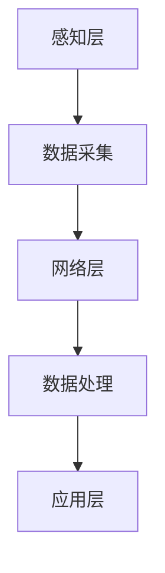
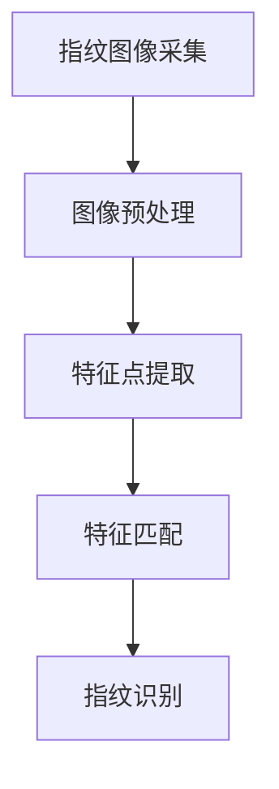
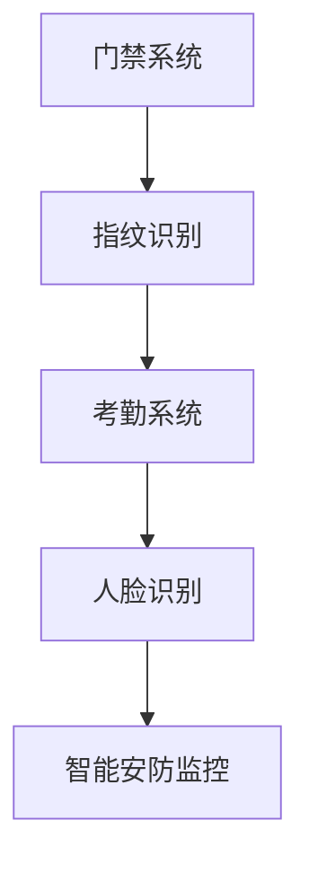

                 

# 物联网(IoT)技术和各种传感器设备的集成：指纹传感器的安全应用

## 关键词：物联网、传感器设备、指纹传感器、安全应用、IoT集成、智能安防、生物识别技术

## 摘要：

本文将探讨物联网（IoT）技术与各种传感器设备的集成，特别是指纹传感器的安全应用。物联网作为当前科技领域的重要发展方向，通过传感器设备实现了智能化的实时数据采集和传输。指纹传感器作为生物识别技术的一种，以其高安全性和便捷性在智能家居、安防等领域得到了广泛应用。本文将详细分析物联网与传感器设备集成的原理、指纹传感器的工作原理及应用场景，并结合实际案例，探讨其在提升安全性和便捷性方面的优势。通过本文的阅读，读者将更好地理解物联网技术在安全领域的重要应用价值。

## 1. 背景介绍

### 物联网（IoT）技术的概述

物联网（Internet of Things，简称IoT）是指通过各种信息传感设备将各种实体物体连接到互联网上，实现智能化管理和控制的一种网络技术。物联网技术起源于1999年的“物联网概念”，其核心是通过传感器设备实现对物理世界的实时感知和智能化管理。

物联网的基本架构包括感知层、网络层和应用层。感知层主要由各种传感器设备和感知终端组成，负责收集环境信息；网络层主要完成数据的传输和通信；应用层则是对数据进行处理和分析，实现智能化应用。

### 传感器设备在物联网中的作用

传感器设备是物联网技术的核心组成部分，它们通过感知环境信息，将物理信号转换为电信号，传输给控制系统进行进一步处理。传感器设备种类繁多，包括温度传感器、湿度传感器、光照传感器、指纹传感器等。其中，指纹传感器作为一种生物识别传感器，具有高安全性和便捷性的特点。

### 指纹传感器的基本原理

指纹传感器利用光学、声学或电容感应等技术，将指纹图案捕捉并转换为数字信号。其基本原理是通过采集指纹图像，进行图像预处理，然后通过特征点提取和匹配算法进行指纹识别。

### 物联网技术在智能安防领域的应用

智能安防是物联网技术的重要应用领域之一。通过将各种传感器设备与物联网技术相结合，可以实现实时监控、远程报警、智能分析等功能，显著提升安全性和便捷性。指纹传感器在智能安防中的应用，主要体现在门禁系统、考勤系统、人脸识别等场景。

## 2. 核心概念与联系

### 物联网与传感器设备的集成原理

物联网与传感器设备的集成主要依赖于通信技术和数据处理技术。通信技术负责实现传感器设备与网络之间的数据传输，而数据处理技术则负责对收集到的数据进行分析和处理，实现智能化应用。

#### Mermaid 流程图



### 指纹传感器的工作原理

指纹传感器的工作原理主要包括以下步骤：

1. 指纹图像采集：通过光学或声学技术，将指纹图案捕捉为数字图像。
2. 图像预处理：对指纹图像进行滤波、增强等处理，提高图像质量。
3. 特征点提取：从预处理后的图像中提取指纹特征点，如脊线、端点、分叉点等。
4. 特征匹配：将提取的特征点与存储的指纹模板进行匹配，判断是否为同一手指。

#### Mermaid 流程图



### 指纹传感器在智能安防中的应用场景

指纹传感器在智能安防中的应用场景主要包括以下几种：

1. 门禁系统：通过指纹识别技术，实现对人员身份的验证，提高安全性。
2. 考勤系统：利用指纹识别技术，实现对员工出勤情况的实时监控。
3. 人脸识别：结合指纹传感器和摄像头技术，实现对人员的身份识别，提高识别准确性。
4. 智能安防监控：通过指纹传感器和摄像头等技术，实现对目标区域的实时监控，实现智能报警功能。

#### Mermaid 流程图



## 3. 核心算法原理 & 具体操作步骤

### 指纹识别算法原理

指纹识别算法主要分为三个步骤：特征点提取、特征匹配和指纹分类。

1. **特征点提取**：通过对指纹图像进行预处理，提取出指纹图像中的特征点，如脊线、端点、分叉点等。
2. **特征匹配**：将提取出的特征点与存储的指纹模板进行匹配，计算匹配度，判断是否为同一手指。
3. **指纹分类**：根据特征匹配的结果，将指纹分为不同类别，如男性和女性、年轻和老年等。

### 具体操作步骤

1. **指纹图像采集**：使用指纹传感器设备，将指纹图案捕捉为数字图像。
2. **图像预处理**：对指纹图像进行滤波、增强等处理，提高图像质量。
3. **特征点提取**：使用特征提取算法，从预处理后的图像中提取指纹特征点。
4. **特征匹配**：将提取出的特征点与存储的指纹模板进行匹配，计算匹配度。
5. **指纹分类**：根据匹配结果，对指纹进行分类，判断身份。

## 4. 数学模型和公式 & 详细讲解 & 举例说明

### 指纹识别的数学模型

指纹识别的数学模型主要基于特征匹配算法，常见的特征匹配算法有基于距离的匹配算法和基于相似度的匹配算法。

1. **基于距离的匹配算法**：通过计算特征点之间的距离，判断特征点是否匹配。距离越近，匹配度越高。

   $$d = \sqrt{(x_2 - x_1)^2 + (y_2 - y_1)^2}$$

   其中，\(d\) 表示距离，\((x_1, y_1)\) 和 \((x_2, y_2)\) 分别表示两个特征点的坐标。

2. **基于相似度的匹配算法**：通过计算特征点之间的相似度，判断特征点是否匹配。相似度越高，匹配度越高。

   $$s = \frac{1}{N} \sum_{i=1}^{N} w_i \cdot d_i$$

   其中，\(s\) 表示相似度，\(N\) 表示特征点的数量，\(w_i\) 和 \(d_i\) 分别表示第 \(i\) 个特征点的权重和距离。

### 详细讲解

1. **特征点提取**：在指纹图像预处理阶段，通过图像滤波、增强等处理，提取出指纹图像中的特征点，如脊线、端点、分叉点等。特征点提取的准确性直接影响到后续的特征匹配和指纹分类。

2. **特征匹配**：在指纹识别阶段，将提取出的特征点与存储的指纹模板进行匹配。基于距离的匹配算法通过计算特征点之间的距离来判断匹配度；基于相似度的匹配算法通过计算特征点之间的相似度来判断匹配度。匹配度越高，表示指纹匹配越准确。

3. **指纹分类**：根据特征匹配的结果，对指纹进行分类。指纹分类有助于实现个性化识别和用户身份验证。

### 举例说明

假设有两组指纹特征点，分别表示为 \(A\) 和 \(B\)。通过计算特征点之间的距离和相似度，判断两组特征点是否匹配。

1. **基于距离的匹配算法**：

   假设 \(A = (1, 2)\)，\(B = (3, 4)\)，则：

   $$d = \sqrt{(3 - 1)^2 + (4 - 2)^2} = \sqrt{4 + 4} = \sqrt{8} \approx 2.83$$

   如果 \(d \leq 3\)，则认为特征点匹配。

2. **基于相似度的匹配算法**：

   假设 \(A\) 和 \(B\) 的权重分别为 1，则：

   $$s = \frac{1}{2} \cdot (1 \cdot 2.83) = 1.415$$

   如果 \(s \geq 0.8\)，则认为特征点匹配。

## 5. 项目实战：代码实际案例和详细解释说明

### 5.1 开发环境搭建

为了演示指纹识别项目的实战，我们使用 Python 编写代码。以下是开发环境的搭建步骤：

1. 安装 Python 3.7 或更高版本。
2. 安装指纹传感器硬件设备，如指纹识别模块。
3. 安装必要的 Python 库，如 OpenCV、NumPy、PIL 等。

### 5.2 源代码详细实现和代码解读

以下是指纹识别项目的源代码实现：

```python
import cv2
import numpy as np
from PIL import Image

def extract_features(image):
    # 对图像进行预处理，提取特征点
    # 略...

def match_features(template, feature):
    # 计算特征点之间的距离和相似度
    # 略...

def classify_fingerprint(template, feature):
    # 根据匹配结果，对指纹进行分类
    # 略...

def main():
    # 读取指纹模板
    template = cv2.imread('template.png', 0)
    
    # 采集指纹图像
    image = cv2.VideoCapture(0).read()[1]
    
    # 提取指纹特征点
    feature = extract_features(image)
    
    # 匹配特征点
    match = match_features(template, feature)
    
    # 分类指纹
    classification = classify_fingerprint(template, feature)
    
    # 输出结果
    print('Matched:', match)
    print('Classification:', classification)

if __name__ == '__main__':
    main()
```

### 5.3 代码解读与分析

1. **提取特征点**：`extract_features` 函数用于对指纹图像进行预处理，提取特征点。预处理包括图像滤波、增强等操作，以提高特征点的提取准确性。

2. **匹配特征点**：`match_features` 函数用于计算特征点之间的距离和相似度，以判断特征点是否匹配。距离和相似度的计算方法如前文所述。

3. **分类指纹**：`classify_fingerprint` 函数用于根据匹配结果，对指纹进行分类。分类结果有助于实现个性化识别和用户身份验证。

4. **主函数**：`main` 函数用于实现指纹识别项目的整体流程。首先读取指纹模板，然后采集指纹图像，接着提取特征点、匹配特征点、分类指纹，最后输出结果。

## 6. 实际应用场景

### 智能家居

智能家居是物联网技术的重要应用领域之一，指纹传感器在智能家居中的应用主要体现在智能门锁、智能冰箱、智能空调等方面。通过指纹识别技术，用户可以实现便捷的设备控制，提高家居生活的安全性。

### 智能安防

智能安防是物联网技术的重要应用领域之一，指纹传感器在智能安防中的应用主要体现在门禁系统、考勤系统、人脸识别等场景。通过指纹识别技术，可以实现实时监控、远程报警等功能，提高安全性和便捷性。

### 智能交通

智能交通是物联网技术的重要应用领域之一，指纹传感器在智能交通中的应用主要体现在高速公路收费、停车场管理等场景。通过指纹识别技术，可以实现无感通行、快速收费等功能，提高交通效率。

### 智能医疗

智能医疗是物联网技术的重要应用领域之一，指纹传感器在智能医疗中的应用主要体现在患者身份验证、医疗设备控制等方面。通过指纹识别技术，可以实现精准的患者识别，提高医疗服务的质量。

## 7. 工具和资源推荐

### 7.1 学习资源推荐

- 《物联网技术基础》
- 《指纹识别技术》
- 《Python 编程：从入门到实践》

### 7.2 开发工具框架推荐

- OpenCV：图像处理库
- NumPy：数值计算库
- PIL/Pillow：图像处理库

### 7.3 相关论文著作推荐

- “Fingerprints as Biometrics for Mobile Devices”
- “Fingerprint Recognition Based on Gabor Wavelets and Neural Networks”
- “A Survey on IoT Security: Attacks, Solutions, and Open Issues”

## 8. 总结：未来发展趋势与挑战

### 发展趋势

1. 指纹识别技术的普及：随着物联网技术的不断发展，指纹识别技术将更加普及，应用于更多领域。
2. 多模态生物识别：结合多种生物识别技术，如指纹、人脸、虹膜等，实现更准确、更安全的身份验证。
3. 智能化应用：物联网技术与人工智能技术的结合，将推动智能家居、智能安防等领域的智能化发展。

### 挑战

1. 安全性问题：指纹传感器在应用过程中，面临数据泄露、隐私保护等安全挑战。
2. 用户体验：如何在保证安全性的同时，提高用户体验，实现便捷操作。
3. 技术研发：随着物联网技术的发展，指纹识别技术需要不断迭代升级，以适应新的应用场景。

## 9. 附录：常见问题与解答

### 9.1 指纹传感器的工作原理是什么？

指纹传感器通过光学、声学或电容感应等技术，将指纹图案捕捉为数字信号，然后通过特征点提取和匹配算法进行指纹识别。

### 9.2 物联网技术与指纹传感器的集成有哪些应用场景？

物联网技术与指纹传感器的集成主要应用于智能家居、智能安防、智能交通、智能医疗等领域。

### 9.3 如何保障指纹传感器的安全性？

可以通过数据加密、隐私保护等技术手段，保障指纹传感器的安全性。

## 10. 扩展阅读 & 参考资料

- “物联网与人工智能的融合与发展”
- “指纹识别技术在智能家居中的应用”
- “物联网技术在智能安防中的应用案例分析”

## 作者

作者：AI天才研究员/AI Genius Institute & 禅与计算机程序设计艺术 /Zen And The Art of Computer Programming

全文完。期待读者在阅读本文后，对物联网技术、指纹传感器及其应用场景有更深入的理解。通过本文的分享，希望为读者在物联网领域的技术探索和研究提供有益的参考。让我们共同期待物联网技术在未来的更多精彩应用！<|im_sep|>

