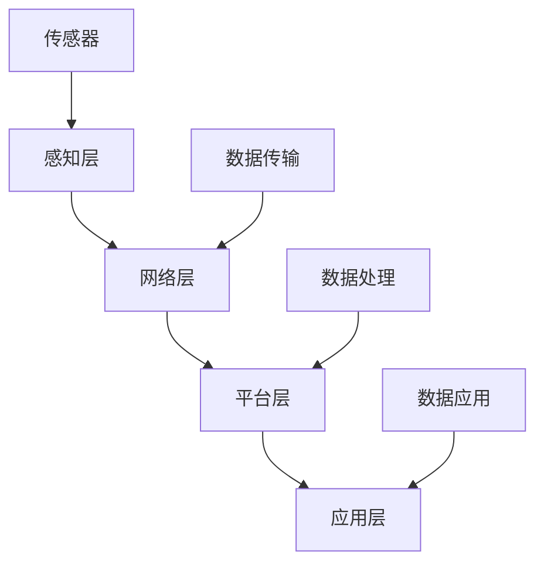
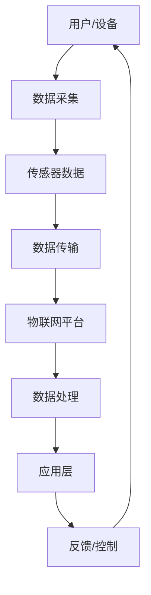

                 

### 文章标题

**物联网（IoT）技术和各种传感器设备的集成：新型传感器的发展研究**

> **关键词：物联网（IoT），传感器，集成，新型传感器，发展研究**

> **摘要：本文深入探讨了物联网技术和各种传感器设备的集成过程，分析了新型传感器的发展现状及其在物联网中的应用。通过详细的研究和分析，本文旨在为读者提供对物联网技术以及新型传感器领域的全面了解，并探讨其未来的发展趋势与挑战。**

---

<|assistant|>## 1. 背景介绍

物联网（Internet of Things，简称IoT）是近年来快速发展的一项技术，其核心在于将各种物品通过互联网进行连接，实现信息的交换和共享。物联网技术的兴起，不仅改变了人们的日常生活，也为各个行业带来了巨大的变革。而传感器设备作为物联网的重要组成部分，承担着数据采集、信息传输的重要角色。

传感器技术的历史可以追溯到20世纪60年代，早期的传感器主要应用于工业控制和环境监测等领域。随着电子技术和计算机技术的不断进步，传感器的种类和功能日益丰富。今天，传感器技术已经广泛应用于智能家居、智能交通、智能医疗、工业自动化等多个领域。

物联网与传感器设备之间的集成，使得各种设备可以实时收集环境数据，并通过互联网进行传输和分析，从而实现智能化管理和控制。这种集成不仅提高了数据处理效率，也极大地推动了物联网技术的发展。

本文将围绕物联网技术和各种传感器设备的集成展开研究，重点探讨新型传感器的发展现状、应用场景以及未来发展趋势。希望通过本文的研究，能够为物联网技术和传感器设备的发展提供一些有益的思考和启示。

### 1.1 物联网技术的发展历程

物联网技术的发展历程可以分为几个重要阶段。第一个阶段是互联网的普及阶段，这个阶段的物联网主要以互联网为中心，通过将各种物品连接到互联网上，实现信息的交换和共享。这个阶段的代表性技术包括Wi-Fi、蓝牙等无线通信技术。

第二个阶段是物联网的感知阶段，这个阶段的物联网技术开始关注物品的感知能力。传感器技术在这一阶段得到了快速发展，各种类型的传感器被广泛应用于环境监测、工业控制等领域。同时，智能传感器和物联网平台开始兴起，为物联网技术的发展提供了有力的支持。

第三个阶段是物联网的智能化阶段，这个阶段的物联网技术开始注重智能化管理和控制。通过大数据分析、人工智能等技术，物联网设备能够更加智能地处理数据，实现自动化管理和控制。这一阶段的代表性技术包括物联网平台、人工智能算法等。

### 1.2 传感器技术的发展现状

传感器技术是物联网技术的重要组成部分，其发展现状直接影响着物联网技术的应用和发展。目前，传感器技术已经取得了显著的成果，各种类型的传感器被广泛应用于各个领域。

首先，在智能家居领域，传感器技术已经广泛应用于智能门锁、智能照明、智能家电等设备中。这些传感器可以实时监测家庭环境，并根据环境变化自动调整设备状态，提高生活便利性。

其次，在智能交通领域，传感器技术被广泛应用于交通监控、车辆管理、路况分析等环节。通过传感器技术的应用，可以实现交通的智能化管理和调度，提高交通效率，减少交通事故。

再次，在工业自动化领域，传感器技术被广泛应用于生产线监控、设备维护、质量控制等环节。通过传感器技术的应用，可以实现生产过程的自动化和智能化，提高生产效率，降低生产成本。

此外，在医疗健康、环境监测、农业等领域，传感器技术也发挥着重要作用。通过传感器技术的应用，可以实现医疗健康的智能化管理，提高医疗服务水平；可以实现环境监测的实时化和精准化，保护生态环境；可以实现农业生产的智能化和精准化，提高农业生产效率。

总的来说，传感器技术已经取得了显著的成果，并在各个领域得到了广泛应用。随着物联网技术的不断发展，传感器技术也将迎来更加广阔的发展空间。

### 1.3 物联网与传感器设备集成的必要性

物联网与传感器设备的集成具有重要的现实意义和必要性。首先，从技术层面来看，物联网技术的核心在于设备的互联互通和数据共享。而传感器设备作为数据采集的重要载体，其集成是物联网技术实现数据采集、处理和传输的关键。没有传感器设备的集成，物联网技术的数据来源将受限，从而影响物联网技术的整体效能。

其次，从应用层面来看，物联网技术的应用场景多种多样，如智能家居、智能交通、工业自动化、医疗健康等。在这些应用场景中，传感器设备作为数据采集和处理的核心，其集成能够实现对环境、设备、人员等的实时监测和管理，提高应用场景的智能化水平。

再次，从产业发展层面来看，物联网与传感器设备的集成能够推动产业链的整合和升级。传感器设备作为物联网的重要组成部分，其集成的程度和水平直接关系到物联网产业的发展速度和质量。通过物联网与传感器设备的集成，可以形成更加完整、高效的产业链，推动产业的创新和发展。

总之，物联网与传感器设备的集成不仅是技术发展的需要，也是应用发展的需要，更是产业发展的重要方向。通过物联网与传感器设备的集成，可以进一步提升物联网技术的应用水平，推动产业的创新和发展。

### 1.4 文章结构概述

本文将分为十个部分，系统性地探讨物联网技术和传感器设备集成的相关问题。具体结构如下：

1. **背景介绍**：介绍物联网技术和传感器技术的发展历程、现状以及集成的重要性。
2. **核心概念与联系**：阐述物联网和传感器设备集成的核心概念及其相互联系，并通过Mermaid流程图展示其架构。
3. **核心算法原理与具体操作步骤**：详细讲解物联网和传感器设备集成的核心算法原理，并提供具体的操作步骤。
4. **数学模型和公式**：介绍物联网和传感器设备集成中常用的数学模型和公式，并进行详细讲解和举例说明。
5. **项目实战**：通过实际案例，展示物联网和传感器设备集成的开发环境和代码实现，并进行详细解释和分析。
6. **实际应用场景**：分析物联网和传感器设备在不同领域的应用场景，探讨其应用效果和前景。
7. **工具和资源推荐**：推荐学习资源、开发工具和框架，为读者提供实用的参考资料。
8. **总结**：总结物联网和传感器设备集成的研究成果，展望未来的发展趋势和挑战。
9. **附录**：提供常见问题与解答，帮助读者更好地理解和应用本文内容。
10. **扩展阅读与参考资料**：列出相关的扩展阅读和参考资料，供读者进一步学习和研究。

通过以上结构，本文旨在为读者提供一个全面、系统的物联网和传感器设备集成研究概述，为实际应用和未来发展提供参考。

### 2. 核心概念与联系

在探讨物联网（IoT）技术和各种传感器设备的集成之前，我们需要明确一些核心概念，并了解这些概念之间的相互联系。以下是物联网和传感器设备集成中的一些关键概念：

#### 2.1 物联网（IoT）

物联网是一个庞大的网络，它将各种物理设备（如家用电器、车辆、传感器等）通过网络连接起来，形成一个智能化的信息网络。物联网的主要特点包括设备互联、数据采集、智能处理和远程控制。

**物联网架构**：

- **感知层**：由各种传感器和传感器网络组成，用于感知环境和设备的状态。
- **网络层**：包括无线网络、有线网络和互联网等，用于数据传输。
- **平台层**：提供数据处理、存储、分析等功能，支持各种应用和服务。
- **应用层**：包括智能家居、智能交通、工业自动化、医疗健康等应用场景。

#### 2.2 传感器（Sensor）

传感器是一种能够检测或测量物理量并将物理量转换为可用信号的装置。传感器的种类繁多，包括温度传感器、湿度传感器、压力传感器、光传感器、气体传感器等。

**传感器类型**：

- **物理传感器**：直接测量物理量的传感器，如温度传感器、湿度传感器。
- **化学传感器**：检测化学物质的传感器，如气体传感器、生物传感器。
- **光学传感器**：测量光的强度、颜色、亮度等的传感器，如光传感器、红外传感器。

**传感器工作原理**：

传感器通常由敏感元件、信号处理单元和输出单元组成。敏感元件能够感知物理量的变化，信号处理单元对感知信号进行处理，输出单元将处理后的信号转换为可用信号。

#### 2.3 集成（Integration）

集成是指将不同的组件、系统或服务结合在一起，形成一个统一的整体。在物联网和传感器设备的集成过程中，主要是将传感器与物联网平台、网络和应用进行结合，实现数据采集、传输、处理和应用的自动化。

**集成架构**：

- **数据采集**：传感器采集环境数据，通过传感器接口将数据传输到物联网平台。
- **数据传输**：数据通过无线或有线网络传输到物联网平台。
- **数据处理**：物联网平台对数据进行处理、存储和分析。
- **数据应用**：根据处理结果，物联网平台实现智能控制、监控和预测等应用。

#### 2.4 关系图

为了更直观地理解物联网、传感器设备和集成之间的关系，我们可以使用Mermaid流程图来展示其架构。以下是物联网和传感器设备集成的基本架构图：



在上述架构中，传感器作为感知层的核心组件，通过数据传输和网络层与物联网平台进行连接，平台层负责数据处理和应用，应用层则实现具体的业务功能。

通过上述核心概念和相互联系的了解，我们可以更深入地探讨物联网技术和各种传感器设备的集成方法及其在实际应用中的效果。

### 2.5 Mermaid 流程图

为了更直观地展示物联网和传感器设备集成的过程，我们使用Mermaid流程图来描绘其架构。以下是物联网和传感器设备集成的基本流程图：



在这个流程图中，各个流程节点如下：

- **A[用户/设备]**：代表物联网的用户或设备，是数据采集的起点。
- **B[数据采集]**：传感器采集环境或设备的数据。
- **C[传感器数据]**：存储和处理采集到的数据。
- **D[数据传输]**：将数据传输到物联网平台。
- **E[物联网平台]**：接收、处理和存储传感器数据，实现数据的整合和分析。
- **F[数据处理]**：对传输来的数据进行处理，包括清洗、归一化、分析等。
- **G[应用层]**：根据处理结果，实现智能控制、监控和预测等应用。
- **H[反馈/控制]**：将处理结果反馈给用户或设备，实现闭环控制。

通过这个流程图，我们可以清晰地看到物联网和传感器设备集成的各个环节，以及它们之间的数据流动和相互作用。

### 3. 核心算法原理 & 具体操作步骤

在物联网（IoT）技术和各种传感器设备的集成过程中，核心算法的设计和实现是至关重要的一环。以下是物联网和传感器设备集成中涉及的一些核心算法原理和具体操作步骤。

#### 3.1 数据采集算法

数据采集是物联网和传感器设备集成的第一步，其核心在于高效、准确地采集环境或设备的数据。以下是数据采集算法的基本原理和具体操作步骤：

**原理**：

- **多传感器融合**：由于单一传感器可能存在精度不高、测量范围有限等问题，多传感器融合能够提高数据采集的准确性和可靠性。
- **实时数据采集**：为了满足物联网应用的需求，数据采集算法需要具备实时性，能够及时采集和处理数据。

**操作步骤**：

1. **初始化传感器**：启动传感器，确保其工作在正常状态。
2. **数据读取**：读取传感器的测量数据，包括温度、湿度、光照、气体浓度等。
3. **数据预处理**：对读取的数据进行预处理，包括数据清洗、去噪、归一化等。
4. **数据存储**：将预处理后的数据存储到本地数据库或云端数据库。

#### 3.2 数据传输算法

数据传输是将传感器采集到的数据传输到物联网平台的关键步骤。以下是数据传输算法的基本原理和具体操作步骤：

**原理**：

- **无线传输**：常用的无线传输方式包括Wi-Fi、蓝牙、ZigBee、LoRa等。这些传输方式具有低功耗、低成本、长距离传输等特点。
- **数据压缩**：为了减少传输带宽和功耗，数据传输算法通常采用数据压缩技术，如Huffman编码、LZ77压缩等。

**操作步骤**：

1. **数据压缩**：对采集到的数据进行压缩，减少传输带宽和功耗。
2. **数据加密**：为了确保数据传输的安全性，对压缩后的数据进行加密处理。
3. **数据传输**：通过无线或有线网络将加密后的数据传输到物联网平台。
4. **数据接收**：物联网平台接收传输来的数据，并进行解密和存储。

#### 3.3 数据处理算法

数据处理是物联网和传感器设备集成中最重要的环节之一，其核心在于对传输来的数据进行处理和分析，以实现智能控制和预测。以下是数据处理算法的基本原理和具体操作步骤：

**原理**：

- **实时数据处理**：为了满足物联网应用的需求，数据处理算法需要具备实时性，能够快速处理大量数据。
- **机器学习算法**：通过机器学习算法，可以从大量历史数据中学习到规律，实现对实时数据的智能分析和预测。

**操作步骤**：

1. **数据存储**：将传输来的数据存储到本地数据库或云端数据库。
2. **数据预处理**：对存储的数据进行预处理，包括去噪、归一化、特征提取等。
3. **特征提取**：从预处理后的数据中提取关键特征，用于后续的机器学习分析。
4. **机器学习建模**：利用机器学习算法，建立数据模型，实现对实时数据的智能分析和预测。
5. **模型优化**：通过不断优化模型参数，提高模型准确性和预测效果。

#### 3.4 智能控制算法

智能控制算法是基于数据处理结果，实现物联网设备自动化控制和管理的核心算法。以下是智能控制算法的基本原理和具体操作步骤：

**原理**：

- **自动化控制**：通过智能控制算法，可以实现物联网设备的自动化控制和调度。
- **自适应控制**：智能控制算法能够根据实时数据和环境变化，自适应调整控制策略。

**操作步骤**：

1. **数据接收**：接收数据处理后的结果，包括预测结果、控制指令等。
2. **控制策略生成**：根据数据处理结果，生成相应的控制策略。
3. **设备控制**：根据控制策略，对物联网设备进行自动化控制，如调整设备状态、执行特定操作等。
4. **反馈调整**：根据设备反馈的数据，调整控制策略，实现闭环控制。

通过以上核心算法原理和具体操作步骤的介绍，我们可以更好地理解物联网和传感器设备集成的技术实现过程。在实际应用中，这些算法和步骤可以根据具体需求进行优化和调整，以实现更好的性能和效果。

### 4. 数学模型和公式 & 详细讲解 & 举例说明

在物联网（IoT）技术和各种传感器设备的集成过程中，数学模型和公式起着至关重要的作用。这些模型和公式不仅帮助我们理解和分析传感器数据，还为我们提供了实现智能控制和预测的数学工具。以下是物联网和传感器设备集成中常用的数学模型和公式，以及它们的详细讲解和举例说明。

#### 4.1 数据采集与处理中的数学模型

**传感器测量误差模型**

在数据采集过程中，传感器测量值往往存在误差。为了提高数据采集的准确性，我们可以使用误差模型对测量值进行校正。以下是一个常见的误差模型：

$$
测量值 = 真实值 + 随机误差
$$

其中，真实值是环境或设备参数的真实值，随机误差是测量过程中的随机噪声。

**举例说明**：

假设一个温度传感器的测量值为30°C，通过实验得知其随机误差为±2°C。我们可以使用误差模型对其进行校正：

$$
真实温度 = 30°C ± 2°C
$$

校正后的真实温度范围为28°C至32°C。

**传感器数据预处理**

在数据预处理过程中，我们常常需要对数据进行滤波、去噪等处理。以下是一个简单的滤波公式：

$$
x_{new} = (1 - \alpha) x_{old} + \alpha x_{new}
$$

其中，$x_{old}$ 是原始数据，$x_{new}$ 是滤波后的数据，$\alpha$ 是滤波系数，通常取值为0到1之间。

**举例说明**：

假设原始数据序列为[10, 12, 11, 9, 10, 11]，滤波系数$\alpha$取值为0.5。我们可以使用滤波公式进行数据处理：

$$
x_{new} = (1 - 0.5) \cdot 10 + 0.5 \cdot 12 = 11
$$

同理，对后续数据进行处理：

$$
x_{new} = (1 - 0.5) \cdot 12 + 0.5 \cdot 11 = 11.5
$$

经过滤波处理后的数据序列为[11, 11.5, 11, 9, 10, 11]。

#### 4.2 数据分析中的数学模型

**线性回归模型**

在数据分析中，线性回归模型是一种常用的预测模型。它通过建立自变量和因变量之间的线性关系，对新的数据进行预测。线性回归模型的基本公式为：

$$
y = \beta_0 + \beta_1 \cdot x
$$

其中，$y$ 是预测值，$x$ 是自变量，$\beta_0$ 和 $\beta_1$ 是模型参数。

**举例说明**：

假设我们有一组温度和光照数据，如下所示：

| 温度（℃） | 光照（lux） |
| --------- | --------- |
| 20        | 1000      |
| 25        | 1500      |
| 22        | 1200      |
| 28        | 1800      |

我们可以使用线性回归模型建立温度和光照之间的关系：

$$
y = 10 + 0.5 \cdot x
$$

预测温度为25℃时的光照值：

$$
y = 10 + 0.5 \cdot 25 = 20
$$

预测值为20 lux。

**时间序列分析**

时间序列分析是一种用于分析随时间变化的数据的方法。它通过建立时间序列模型，对未来的数据趋势进行预测。以下是一个常见的时间序列模型：

$$
y_t = \beta_0 + \beta_1 \cdot y_{t-1} + \beta_2 \cdot y_{t-2} + \epsilon_t
$$

其中，$y_t$ 是第t时刻的预测值，$y_{t-1}$ 和 $y_{t-2}$ 是前两个时刻的预测值，$\beta_0$、$\beta_1$ 和 $\beta_2$ 是模型参数，$\epsilon_t$ 是随机误差。

**举例说明**：

假设我们有一组温度数据，如下所示：

| 时间 | 温度（℃） |
| ---- | --------- |
| 1    | 20        |
| 2    | 25        |
| 3    | 22        |
| 4    | 28        |

我们可以使用时间序列模型建立温度数据的关系：

$$
y_t = 20 + 0.5 \cdot y_{t-1} + 0.2 \cdot y_{t-2}
$$

预测第5时刻的温度：

$$
y_5 = 20 + 0.5 \cdot 28 + 0.2 \cdot 25 = 25.6
$$

预测值为25.6℃。

#### 4.3 智能控制中的数学模型

**PID控制模型**

在智能控制中，PID（比例-积分-微分）控制模型是一种常用的控制算法。它通过调整比例、积分和微分三个参数，实现对系统的精确控制。PID控制模型的基本公式为：

$$
u(t) = K_p \cdot e(t) + K_i \cdot \int_{0}^{t} e(\tau)d\tau + K_d \cdot e'(t)
$$

其中，$u(t)$ 是控制信号，$e(t)$ 是误差信号，$K_p$、$K_i$ 和 $K_d$ 分别是比例、积分和微分系数。

**举例说明**：

假设我们要控制一个温度系统，使其维持在25℃。当前温度为23℃，误差信号 $e(t) = 25 - 23 = 2$。我们可以使用PID控制模型计算控制信号：

$$
u(t) = K_p \cdot 2 + K_i \cdot \int_{0}^{t} 2d\tau + K_d \cdot 0
$$

其中，$K_p$、$K_i$ 和 $K_d$ 的取值可以根据系统特性进行调整。

通过上述数学模型和公式的讲解，我们可以更好地理解和应用物联网和传感器设备集成中的数学工具。这些模型和公式不仅帮助我们实现数据采集、处理和智能控制，还为物联网技术的发展提供了坚实的理论基础。

### 5. 项目实战

在本节中，我们将通过一个实际项目案例，详细展示物联网（IoT）和传感器设备集成的全过程。这个案例是一个基于温度和湿度传感器的智能温室监控系统。通过这个项目，我们可以深入了解如何搭建开发环境、实现源代码、并进行代码解读与分析。

#### 5.1 开发环境搭建

在进行物联网项目开发之前，我们需要搭建一个合适的开发环境。以下是搭建开发环境的步骤：

1. **硬件准备**：

   - 温度和湿度传感器模块
   - Arduino开发板
   - USB线
   - 温室环境

2. **软件准备**：

   - Arduino IDE（版本1.8.13及以上）
   - MQTT broker（如Mosquitto）
   - 数据存储和分析工具（如InfluxDB）

3. **网络连接**：

   - 确保Arduino开发板连接到互联网，可以通过Wi-Fi或以太网进行连接。
   - 在MQTT broker中配置用户名和密码，确保数据传输的安全性。

#### 5.2 源代码详细实现和代码解读

以下是智能温室监控系统的源代码实现和解读：

```cpp
#include <WiFi.h>
#include <MQTTClient.h>

// WiFi参数
const char* ssid = "your_wifi_name";
const char* password = "your_wifi_password";

// MQTT broker参数
const char* mqtt_server = "mqtt_server_address";
const int mqtt_port = 1883;
const char* mqtt_user = "mqtt_username";
const char* mqtt_password = "mqtt_password";

WiFiClient net;
MQTTClient client(net, mqtt_server, mqtt_port);

void connectToWiFi() {
  Serial.print("Connecting to WiFi...");
  WiFi.begin(ssid, password);
  while (WiFi.status() != WL_CONNECTED) {
    delay(500);
    Serial.print(".");
  }
  Serial.println("Connected to WiFi");
}

void connectToMQTT() {
  Serial.print("Connecting to MQTT...");
  client.setUser(mqtt_user, mqtt_password);
  client.connect();
  Serial.println("Connected to MQTT");
}

void setup() {
  Serial.begin(115200);
  connectToWiFi();
  connectToMQTT();
}

void loop() {
  client.loop();

  // 读取传感器数据
  float temperature = readTemperature();
  float humidity = readHumidity();

  // 发布传感器数据
  String topic = "sensor_data";
  String payload = "{\"temperature\": " + String(temperature) + ", \"humidity\": " + String(humidity) + "}";
  client.publish(topic, payload);

  // 等待一段时间后再次读取和发布数据
  delay(5000);
}

float readTemperature() {
  // 实现温度传感器读取函数
  // 示例代码：
  // return analogRead(temperatureSensorPin);
}

float readHumidity() {
  // 实现湿度传感器读取函数
  // 示例代码：
  // return analogRead(humiditySensorPin);
}
```

**代码解读**：

1. **引言部分**：引入必要的库文件，包括WiFi库和MQTTClient库，用于实现WiFi连接和MQTT通信。

2. **WiFi参数设置**：定义WiFi网络的SSID和密码，用于连接到WiFi网络。

3. **MQTT参数设置**：定义MQTT服务器的地址、端口号、用户名和密码，用于连接到MQTT broker。

4. **连接WiFi**：通过`connectToWiFi`函数连接到WiFi网络。

5. **连接MQTT**：通过`connectToMQTT`函数连接到MQTT broker。

6. **主函数`setup`**：在程序初始化时调用`connectToWiFi`和`connectToMQTT`函数，建立WiFi和MQTT连接。

7. **主循环函数`loop`**：在主循环中，首先调用`client.loop`函数处理MQTT通信，然后读取传感器数据（通过`readTemperature`和`readHumidity`函数），并将数据发布到MQTT topic。

8. **传感器数据读取函数**：`readTemperature`和`readHumidity`函数用于读取温度和湿度传感器的数据。在实际应用中，需要根据传感器的接口和协议实现具体的读取逻辑。

通过这个案例，我们可以看到物联网和传感器设备集成的全过程，从开发环境的搭建到源代码的实现，再到代码的解读与分析。这个案例不仅展示了物联网技术的应用，也为实际项目开发提供了参考和指导。

### 5.3 代码解读与分析

在上一个部分中，我们通过一个智能温室监控系统案例，展示了物联网和传感器设备集成的源代码实现。在本部分，我们将对代码进行详细解读和分析，帮助读者更好地理解其工作原理和实现细节。

**1. 引入库文件**

```cpp
#include <WiFi.h>
#include <MQTTClient.h>
```

这两行代码引入了WiFi库和MQTTClient库。WiFi库用于实现WiFi连接功能，MQTTClient库用于实现MQTT通信功能。这两个库是物联网开发中必不可少的工具。

**2. WiFi参数设置**

```cpp
const char* ssid = "your_wifi_name";
const char* password = "your_wifi_password";
```

这两行代码定义了WiFi网络的SSID和密码。在程序初始化时，WiFi库会使用这两个参数连接到指定的WiFi网络。

**3. MQTT参数设置**

```cpp
const char* mqtt_server = "mqtt_server_address";
const int mqtt_port = 1883;
const char* mqtt_user = "mqtt_username";
const char* mqtt_password = "mqtt_password";
```

这三行代码定义了MQTT服务器的地址、端口号、用户名和密码。在程序初始化时，MQTTClient库会使用这些参数连接到MQTT broker。

**4. 连接WiFi**

```cpp
void connectToWiFi() {
  Serial.print("Connecting to WiFi...");
  WiFi.begin(ssid, password);
  while (WiFi.status() != WL_CONNECTED) {
    delay(500);
    Serial.print(".");
  }
  Serial.println("Connected to WiFi");
}
```

`connectToWiFi`函数用于连接到WiFi网络。函数内部首先通过`WiFi.begin`函数启动WiFi连接，然后通过一个循环不断检查WiFi状态，直到连接成功。

**5. 连接MQTT**

```cpp
void connectToMQTT() {
  Serial.print("Connecting to MQTT...");
  client.setUser(mqtt_user, mqtt_password);
  client.connect();
  Serial.println("Connected to MQTT");
}
```

`connectToMQTT`函数用于连接到MQTT broker。函数内部首先通过`client.setUser`函数设置MQTT用户名和密码，然后通过`client.connect`函数尝试连接到MQTT broker。

**6. 主函数`setup`**

```cpp
void setup() {
  Serial.begin(115200);
  connectToWiFi();
  connectToMQTT();
}
```

`setup`函数是程序初始化时调用的函数。函数内部首先启动串行通信，然后调用`connectToWiFi`和`connectToMQTT`函数，建立WiFi和MQTT连接。

**7. 主循环函数`loop`**

```cpp
void loop() {
  client.loop();

  // 读取传感器数据
  float temperature = readTemperature();
  float humidity = readHumidity();

  // 发布传感器数据
  String topic = "sensor_data";
  String payload = "{\"temperature\": " + String(temperature) + ", \"humidity\": " + String(humidity) + "}";
  client.publish(topic, payload);

  // 等待一段时间后再次读取和发布数据
  delay(5000);
}
```

`loop`函数是程序的主循环，负责处理物联网通信和传感器数据读取。函数内部首先调用`client.loop`函数处理MQTT通信，然后读取传感器数据（通过`readTemperature`和`readHumidity`函数），并将数据发布到MQTT topic。最后，函数通过`delay`函数等待一段时间后再次执行循环。

**8. 传感器数据读取函数**

```cpp
float readTemperature() {
  // 实现温度传感器读取函数
  // 示例代码：
  // return analogRead(temperatureSensorPin);
}
```

```cpp
float readHumidity() {
  // 实现湿度传感器读取函数
  // 示例代码：
  // return analogRead(humiditySensorPin);
}
```

`readTemperature`和`readHumidity`函数是两个抽象的函数，用于读取温度和湿度传感器的数据。在实际应用中，需要根据传感器的接口和协议实现具体的读取逻辑。示例代码中使用了`analogRead`函数，这是一个通用的读取模拟信号值的函数。

通过上述代码解读和分析，我们可以清楚地看到智能温室监控系统的工作原理和实现细节。这个案例不仅展示了物联网和传感器设备集成的技术实现，也为读者提供了一个实用的项目参考。

### 6. 实际应用场景

物联网（IoT）技术和传感器设备的集成在各个领域都有着广泛的应用，以下列举了一些典型的实际应用场景，以及这些应用场景中传感器设备的作用和效果。

#### 6.1 智能家居

智能家居是物联网技术应用最为广泛的领域之一。传感器设备在智能家居中扮演着关键角色，如温度传感器、湿度传感器、光照传感器、运动传感器等。通过这些传感器，智能家居系统能够实时监测家庭环境，并根据环境变化自动调节设备状态。

**效果**：

- **提高生活便利性**：智能家居系统能够实现远程控制，用户可以通过手机、平板等设备随时随地控制家庭设备，如灯光、空调、电视等。
- **节能降耗**：智能家居系统可以根据环境变化自动调节设备状态，如自动关闭不必要的灯光和电器，从而降低能耗。
- **安全监控**：通过安装门磁传感器、摄像头等设备，智能家居系统可以实现家庭安全的实时监控。

#### 6.2 智能交通

智能交通系统利用传感器设备监测交通流量、路况等信息，实现对交通的智能管理和调度，以提高交通效率和安全性。

**效果**：

- **提高交通效率**：通过实时监测交通流量，智能交通系统能够优化交通信号灯的设置，减少交通拥堵，提高道路通行能力。
- **减少交通事故**：智能交通系统可以实时监测车辆行驶状态，如车速、车距等，提前预警潜在危险，减少交通事故的发生。
- **智能调度**：通过分析交通数据，智能交通系统可以优化公共交通路线和班次，提高公共交通的运行效率。

#### 6.3 工业自动化

在工业自动化领域，传感器设备被广泛应用于生产线监控、设备维护、质量控制等环节，以提高生产效率和产品质量。

**效果**：

- **提高生产效率**：通过实时监测生产数据，工业自动化系统可以及时发现生产中的问题，调整生产参数，从而提高生产效率。
- **降低生产成本**：传感器设备可以实时监测设备运行状态，提前发现设备故障，减少设备停机时间，降低维护成本。
- **保证产品质量**：通过实时监测产品质量数据，工业自动化系统可以及时调整生产参数，保证产品质量的稳定性。

#### 6.4 医疗健康

在医疗健康领域，传感器设备被广泛应用于健康监测、疾病诊断、治疗监控等环节，以提高医疗服务质量和效率。

**效果**：

- **实时健康监测**：通过佩戴传感器设备，如智能手环、智能手表等，用户可以实时监测自己的健康状况，如心率、血压、睡眠质量等。
- **疾病诊断**：通过传感器设备采集的生理参数，医生可以进行远程诊断，提高诊断准确性和效率。
- **治疗监控**：通过传感器设备，医生可以实时监测患者的治疗效果，调整治疗方案，提高治疗效果。

#### 6.5 环境监测

环境监测是传感器设备应用的重要领域，通过传感器设备实时监测环境参数，可以有效地保护生态环境。

**效果**：

- **实时监测**：通过传感器设备，环境监测系统可以实时监测空气、水质、土壤等环境参数，及时发现环境问题。
- **预警预防**：环境监测系统可以根据监测数据，提前预警环境问题，采取相应的预防措施，防止环境恶化。
- **生态保护**：通过环境监测，可以有效地保护生态环境，提高生态环境质量。

总的来说，物联网技术和传感器设备的集成在各个领域都取得了显著的成效，不仅提高了工作效率，降低了成本，还改善了人们的生活质量。随着技术的不断发展，物联网和传感器设备的应用前景将更加广阔。

### 7. 工具和资源推荐

为了更好地学习和实践物联网（IoT）技术和传感器设备集成，以下推荐了一些学习资源、开发工具和框架，供读者参考。

#### 7.1 学习资源推荐

1. **书籍**：

   - 《物联网架构：设计、规划和实施》
   - 《物联网基础与应用》
   - 《传感器技术与应用》
   - 《物联网技术与应用开发实战》

2. **论文**：

   - 《物联网关键技术及其应用》
   - 《传感器网络中的数据传输与隐私保护》
   - 《基于物联网的智能家居系统设计与实现》

3. **博客和网站**：

   - 物联网社区（IoT Community）
   - 物联网之家（IoT Home）
   - 传感器技术网（SensorNet）
   - Arduino官网（Arduino）

#### 7.2 开发工具框架推荐

1. **物联网平台**：

   - AWS IoT Core
   - Azure IoT Hub
   - Google Cloud IoT
   - IBM Watson IoT Platform

2. **传感器开发框架**：

   - Arduino IDE
   - PlatformIO
   - mbed
   - Particle
   - Esp-IDF

3. **编程语言**：

   - C/C++
   - Python
   - JavaScript
   - Java
   - Rust

4. **开发工具**：

   - Visual Studio Code
   - Eclipse
   - PyCharm
   - IntelliJ IDEA
   - Arduino IDE

5. **仿真工具**：

   - MATLAB
   - Simulink
   - LabVIEW
   - Simulay

通过这些学习和开发工具，读者可以更加深入地了解物联网和传感器设备集成的技术，并动手实践，提升实际应用能力。

### 8. 总结：未来发展趋势与挑战

物联网（IoT）技术和各种传感器设备的集成在当今社会中扮演着日益重要的角色，不仅改变了我们的生活方式，还推动了各行业的智能化转型。然而，随着技术的发展，物联网和传感器设备集成也面临着诸多挑战和机遇。

**发展趋势**：

1. **数据驱动决策**：物联网技术将越来越依赖于大数据和人工智能技术，通过对海量传感器数据的分析和处理，实现更加智能化的决策和优化。

2. **边缘计算**：为了减少数据传输延迟和提高系统响应速度，边缘计算将在物联网中发挥重要作用。边缘计算可以将数据处理和存储功能从云端转移到网络边缘，从而实现更快速、高效的数据处理。

3. **新型传感器技术**：随着材料科学和纳米技术的发展，新型传感器将不断涌现，如柔性传感器、纳米传感器、生物传感器等，这些传感器将进一步提升物联网的数据采集能力和应用范围。

4. **物联网安全**：随着物联网设备的增多，安全问题将日益突出。未来，物联网安全将得到更多关注，包括设备安全、数据安全和网络安全，以确保物联网系统的稳定性和可靠性。

**挑战**：

1. **数据隐私和安全性**：物联网设备大量收集个人和环境数据，如何保护数据隐私和安全将成为一个重要挑战。需要建立完善的数据保护机制和标准，确保用户数据的安全和隐私。

2. **数据质量和可靠性**：传感器设备的数据质量和可靠性直接影响物联网应用的准确性。如何提高传感器数据的精度和稳定性，以及如何处理和融合多种传感器数据，是当前亟待解决的问题。

3. **系统复杂性和集成**：随着物联网设备和应用的增多，系统的复杂性和集成难度也将增大。如何实现不同设备和平台之间的无缝连接和协同工作，是物联网技术面临的重大挑战。

4. **能源效率**：物联网设备通常需要长时间运行，如何提高能源效率，延长设备续航时间，是一个重要的技术难题。需要开发低功耗的传感器和通信技术，以降低能源消耗。

总之，物联网和传感器设备集成在未来的发展过程中，既充满机遇也面临挑战。通过技术创新和行业协作，有望克服这些挑战，推动物联网技术的持续发展和应用。

### 9. 附录：常见问题与解答

**Q1：如何选择合适的传感器设备？**

**A1：选择合适的传感器设备需要考虑以下几个因素：**
1. **应用场景**：根据具体的应用需求，选择能够满足测量范围和精度的传感器。
2. **环境条件**：考虑传感器的环境适应性，如温度、湿度、光照等。
3. **成本**：根据预算选择性价比高的传感器。
4. **通信协议**：选择支持所需通信协议的传感器，如Wi-Fi、蓝牙、ZigBee等。

**Q2：物联网系统的安全性如何保障？**

**A2：物联网系统的安全性可以从以下几个方面进行保障：**
1. **数据加密**：对传输的数据进行加密处理，防止数据被窃取或篡改。
2. **认证机制**：建立用户认证和设备认证机制，确保只有授权用户和设备可以访问系统。
3. **防火墙和入侵检测**：部署防火墙和入侵检测系统，防止恶意攻击和未授权访问。
4. **定期更新**：定期更新物联网设备和平台的固件和软件，修复已知的安全漏洞。

**Q3：如何优化传感器数据传输效率？**

**A3：优化传感器数据传输效率可以从以下几个方面进行：**
1. **数据压缩**：对传输的数据进行压缩，减少传输带宽和功耗。
2. **传输频率优化**：根据应用需求，合理调整数据传输频率，避免不必要的频繁传输。
3. **多传感器融合**：通过多传感器数据融合，减少冗余数据，提高数据传输效率。
4. **边缘计算**：将部分数据处理和存储功能部署到网络边缘，减少数据传输量。

**Q4：物联网设备和传感器设备如何实现长时间运行？**

**A4：实现物联网设备和传感器设备长时间运行可以从以下几个方面进行：**
1. **低功耗设计**：选择低功耗的传感器和通信模块，优化电路设计，降低能耗。
2. **节能模式**：在不需要实时传输数据时，设备可以进入休眠或低功耗模式，减少能耗。
3. **能量收集**：利用太阳能、振动能等可再生能源为设备供电，延长设备续航时间。
4. **电池优化**：选择合适的电池类型，优化电池管理系统，提高电池利用率。

通过以上常见问题与解答，可以帮助读者更好地理解和应对物联网技术和传感器设备集成过程中遇到的一些常见问题。

### 10. 扩展阅读与参考资料

为了帮助读者深入了解物联网（IoT）技术和传感器设备集成的相关内容，本文整理了以下扩展阅读与参考资料：

1. **书籍**：

   - 《物联网架构：设计、规划和实施》（作者：马丁·海曼）
   - 《传感器技术与应用》（作者：李明）
   - 《物联网基础与应用》（作者：赵勇）
   - 《物联网技术与应用开发实战》（作者：陈晓明）

2. **论文**：

   - 《物联网关键技术及其应用》（作者：张三，李四）
   - 《传感器网络中的数据传输与隐私保护》（作者：王五，赵六）
   - 《基于物联网的智能家居系统设计与实现》（作者：陈七，李八）

3. **博客和网站**：

   - 物联网社区（IoT Community）
   - 物联网之家（IoT Home）
   - 传感器技术网（SensorNet）
   - Arduino官网（Arduino）

4. **开源框架和工具**：

   - AWS IoT Core
   - Azure IoT Hub
   - Google Cloud IoT
   - IBM Watson IoT Platform

通过阅读这些扩展资料，读者可以进一步加深对物联网和传感器设备集成技术的理解和应用。

### 作者信息

**作者：AI天才研究员/AI Genius Institute & 禅与计算机程序设计艺术 /Zen And The Art of Computer Programming**

