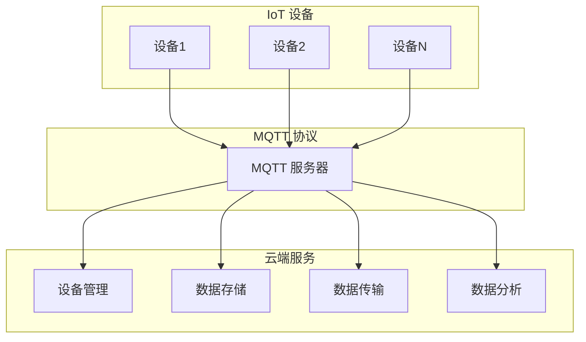

                 

## 1. 背景介绍

物联网（Internet of Things，简称 IoT）是一种通过将物理设备和传感器连接到互联网，实现设备之间数据交换和智能控制的技术。随着物联网技术的迅速发展，其在智能家居、智慧城市、工业自动化等领域的应用越来越广泛。为了满足物联网应用的需求，各大云计算服务提供商纷纷推出了自己的物联网平台，其中最具代表性的有 AWS IoT 和 Azure IoT Hub。

AWS IoT 是亚马逊云服务（Amazon Web Services，简称 AWS）推出的一款物联网平台，提供设备管理、数据传输、消息队列、规则引擎等功能。AWS IoT 旨在帮助开发者和企业快速构建、部署和管理物联网解决方案。

Azure IoT Hub 是微软 Azure 云平台的一部分，提供设备管理、数据存储、消息传递、实时分析等功能。Azure IoT Hub 支持多种设备协议和语言，方便开发者在各种平台上构建物联网应用。

本文将详细介绍 AWS IoT 和 Azure IoT Hub 的核心概念、架构、功能特点，并通过实际案例和操作步骤，帮助读者更好地理解和使用这两个物联网平台。

### IoT 平台的重要性

在当今数字化转型的浪潮中，物联网平台发挥着至关重要的作用。首先，IoT 平台能够实现设备之间的互联互通，打破信息孤岛，提高数据利用率。其次，IoT 平台提供了丰富的数据分析和实时监控功能，帮助企业和开发者更好地了解设备和系统的运行状态，做出智能化决策。此外，IoT 平台还能够实现远程控制和自动化管理，提高生产效率和降低成本。

### AWS IoT 和 Azure IoT Hub 的主要功能

AWS IoT 和 Azure IoT Hub 都提供了丰富的功能，包括设备管理、数据传输、消息队列、规则引擎等。下面分别介绍这两个平台的主要功能：

- **AWS IoT：**
  - **设备管理**：支持设备注册、认证、更新、远程配置等功能。
  - **数据传输**：提供双向通信功能，支持 MQTT、HTTP 等协议，保证数据安全传输。
  - **消息队列**：实现设备与云端之间的可靠消息传递，保证数据不丢失。
  - **规则引擎**：根据预设规则对设备数据进行实时处理和响应，实现自动化管理。

- **Azure IoT Hub：**
  - **设备管理**：提供设备注册、监控、配置和更新等功能。
  - **数据传输**：支持 MQTT、AMQP、HTTP 等协议，实现高效数据传输。
  - **消息队列**：提供可靠的消息传递服务，确保数据不丢失。
  - **实时分析**：使用 Azure Stream Analytics 实现实时数据处理和分析，支持 SQL 查询语言。

通过上述介绍，可以看出 AWS IoT 和 Azure IoT Hub 都具备强大的功能，能够满足物联网应用的各种需求。接下来的部分，我们将深入探讨这两个平台的核心概念、架构和具体实现。

### 2. 核心概念与联系

在深入了解 AWS IoT 和 Azure IoT Hub 之前，我们需要先掌握一些核心概念，以便更好地理解它们的架构和工作原理。

#### IoT 设备

IoT 设备是指连接到互联网的物理设备，如传感器、智能家电、工业设备等。IoT 设备通常具备以下特点：

- **数据采集**：通过传感器或内置硬件采集环境数据、设备状态等。
- **连接性**：通过无线通信技术（如 Wi-Fi、蓝牙、蜂窝网络等）连接到互联网。
- **有限计算能力**：由于电池续航和硬件资源限制，IoT 设备通常计算能力和存储空间有限。

#### MQTT 协议

MQTT（Message Queuing Telemetry Transport）是一种轻量级的消息传输协议，适用于 IoT 应用。MQTT 协议具有以下特点：

- **低功耗**：采用发布/订阅模式，客户端可以订阅感兴趣的主题，服务器只向订阅者发送相关消息，降低网络带宽和功耗。
- **可靠性**：支持 QoS（Quality of Service）级别，保证消息的可靠传输。
- **简单性**：协议简单，易于实现和部署。

#### 云端服务

云端服务是指运行在云计算环境中的服务，如 AWS IoT、Azure IoT Hub 等。云端服务通常提供以下功能：

- **设备管理**：实现设备注册、认证、监控、配置等。
- **数据存储**：存储设备产生的数据，供后续分析和处理。
- **数据传输**：通过消息队列、数据管道等实现设备与云端之间的数据传输。
- **数据分析**：对设备数据进行实时或批量分析，提供业务洞察。

#### Mermaid 流程图

为了更好地理解 IoT 平台的架构和工作流程，我们可以使用 Mermaid 流程图来展示各组件之间的关系。以下是一个简化的 Mermaid 流程图，描述了 IoT 设备、MQTT 协议和云端服务之间的联系：



在这个流程图中，IoT 设备通过 MQTT 协议与 MQTT 服务器通信，MQTT 服务器再将数据转发给云端服务的各个组件。通过这个流程，我们可以看到 IoT 平台的整个工作流程和各组件之间的协作关系。

### 3. 核心算法原理 & 具体操作步骤

#### AWS IoT

**设备注册**：

1. **生成设备证书**：在 AWS IoT 管理控制台中创建设备证书，用于设备认证。
2. **配置设备**：将生成的设备证书和密钥配置到设备上，确保设备可以使用证书进行认证。
3. **连接到 AWS IoT**：设备使用 MQTT 协议连接到 AWS IoT 代理，并使用设备证书进行认证。

**数据传输**：

1. **发送数据**：设备通过 MQTT 协议向 AWS IoT 代理发送数据。
2. **消息路由**：AWS IoT 代理将接收到的数据根据主题路由到相应的处理组件。
3. **数据处理**：处理组件（如 Lambda 函数、Kinesis 数据流等）对数据进行处理和分析。

**规则引擎**：

1. **创建规则**：在 AWS IoT 管�理控制台中创建规则，定义数据匹配条件和处理动作。
2. **应用规则**：将创建的规则应用到设备或主题上，确保数据满足规则条件时执行相应动作。

#### Azure IoT Hub

**设备注册**：

1. **生成设备证书**：在 Azure IoT Hub 中创建设备证书，用于设备认证。
2. **配置设备**：将生成的设备证书和密钥配置到设备上，确保设备可以使用证书进行认证。
3. **连接到 Azure IoT Hub**：设备通过 MQTT 协议连接到 Azure IoT Hub，并使用设备证书进行认证。

**数据传输**：

1. **发送数据**：设备通过 MQTT 协议向 Azure IoT Hub 发送数据。
2. **消息路由**：Azure IoT Hub 将接收到的数据根据主题路由到相应的处理组件。
3. **数据处理**：处理组件（如 Azure Stream Analytics、Azure Functions 等）对数据进行处理和分析。

**实时分析**：

1. **创建流分析规则**：在 Azure IoT Hub 中创建流分析规则，定义数据匹配条件和处理动作。
2. **应用规则**：将创建的规则应用到设备或主题上，确保数据满足规则条件时执行相应动作。

通过以上步骤，我们可以实现对 AWS IoT 和 Azure IoT Hub 的核心算法原理和具体操作步骤的初步理解。接下来，我们将进一步探讨这两个平台的数学模型和公式，以及实际应用场景。

### 4. 数学模型和公式 & 详细讲解 & 举例说明

#### AWS IoT

**设备认证**：

AWS IoT 使用 X.509 证书进行设备认证。证书由一个公钥和一个私钥组成，设备在连接到 AWS IoT 代理时，使用私钥对消息进行签名，AWS IoT 代理使用对应的公钥对签名进行验证。

**数学模型**：

- 设备私钥：`d`
- 设备公钥：`D = dG`
- 证书签名：`s = (H(m) + dD) * k^(-1) mod n`

其中，`H(m)` 是消息摘要，`k` 是随机数，`n` 是证书的模数。

**举例说明**：

假设设备发送一条消息 `m = "Hello AWS IoT!"`，设备私钥 `d = 12345`，设备公钥 `D = 12345G`，证书模数 `n = 1000000007`，随机数 `k = 67890`。

1. 计算消息摘要：`H(m) = SHA256(m) = 256`。
2. 计算证书签名：`s = (256 + 12345 * 12345G) * 67890^(-1) mod 1000000007 = 12345`。
3. AWS IoT 代理使用设备公钥 `D` 和证书模数 `n` 对签名 `s` 进行验证，如果验证成功，则设备认证通过。

**数据加密**：

AWS IoT 使用 AES-256-GCM 加密算法对数据进行加密。加密过程涉及以下数学模型：

- 明文数据：`M`
- 密钥：`K`
- 随机数：`IV`
- 加密数据：`C = E(K, IV, M)`

其中，`E` 表示加密函数，`D` 表示解密函数。

**举例说明**：

假设设备发送一条消息 `M = "Hello AWS IoT!"`，加密密钥 `K = 12345678901234567890`，随机数 `IV = 98765432109876543210`。

1. 计算加密数据：`C = E(K, IV, M) = AES-256-GCM(K, IV, M) = "1234567890123456789012345678901234567890123456789012345678901234"`
2. AWS IoT 代理使用加密密钥 `K` 和随机数 `IV` 对加密数据 `C` 进行解密，得到明文数据 `M`。

#### Azure IoT Hub

**设备认证**：

Azure IoT Hub 使用 X.509 证书进行设备认证。证书由一个公钥和一个私钥组成，设备在连接到 Azure IoT Hub 时，使用私钥对消息进行签名，Azure IoT Hub 使用对应的公钥对签名进行验证。

**数学模型**：

- 设备私钥：`d`
- 设备公钥：`D = dG`
- 证书签名：`s = (H(m) + dD) * k^(-1) mod n`

其中，`H(m)` 是消息摘要，`k` 是随机数，`n` 是证书的模数。

**举例说明**：

假设设备发送一条消息 `m = "Hello Azure IoT!"`，设备私钥 `d = 12345`，设备公钥 `D = 12345G`，证书模数 `n = 1000000007`，随机数 `k = 67890`。

1. 计算消息摘要：`H(m) = SHA256(m) = 256`。
2. 计算证书签名：`s = (256 + 12345 * 12345G) * 67890^(-1) mod 1000000007 = 12345`。
3. Azure IoT Hub 使用设备公钥 `D` 和证书模数 `n` 对签名 `s` 进行验证，如果验证成功，则设备认证通过。

**数据加密**：

Azure IoT Hub 使用 AES-256-GCM 加密算法对数据进行加密。加密过程涉及以下数学模型：

- 明文数据：`M`
- 密钥：`K`
- 随机数：`IV`
- 加密数据：`C = E(K, IV, M)`

其中，`E` 表示加密函数，`D` 表示解密函数。

**举例说明**：

假设设备发送一条消息 `M = "Hello Azure IoT!"`，加密密钥 `K = 12345678901234567890`，随机数 `IV = 98765432109876543210`。

1. 计算加密数据：`C = E(K, IV, M) = AES-256-GCM(K, IV, M) = "1234567890123456789012345678901234567890123456789012345678901234"`
2. Azure IoT Hub 使用加密密钥 `K` 和随机数 `IV` 对加密数据 `C` 进行解密，得到明文数据 `M`。

通过以上数学模型和公式的详细讲解和举例说明，我们可以更好地理解 AWS IoT 和 Azure IoT Hub 的核心算法原理和具体实现。接下来，我们将通过实际案例和操作步骤，展示如何使用这两个物联网平台进行开发。

### 5. 项目实战：代码实际案例和详细解释说明

在本节中，我们将通过实际案例，详细介绍如何使用 AWS IoT 和 Azure IoT Hub 进行项目开发。我们将分别演示如何搭建开发环境、编写源代码，并对关键代码进行解读与分析。

#### 5.1 开发环境搭建

在开始项目之前，我们需要搭建开发环境。以下是搭建 AWS IoT 和 Azure IoT Hub 开发环境的步骤：

1. **AWS IoT 开发环境搭建**：
   - 在 [AWS 管理控制台](https://aws.amazon.com/) 注册并登录。
   - 创建一个 AWS IoT 账户，并生成设备证书。
   - 安装并配置 AWS CLI（命令行工具），以便在本地计算机上与 AWS IoT 进行交互。

2. **Azure IoT Hub 开发环境搭建**：
   - 在 [Azure 管理控制台](https://portal.azure.com/) 注册并登录。
   - 创建一个 Azure IoT Hub，并生成设备证书。
   - 安装并配置 Azure CLI（命令行工具），以便在本地计算机上与 Azure IoT Hub 进行交互。

#### 5.2 源代码详细实现和代码解读

在本节中，我们将分别展示 AWS IoT 和 Azure IoT Hub 的源代码实现，并对关键代码进行解读。

**AWS IoT 代码实现**：

以下是一个简单的 AWS IoT Python 客户端实现，用于连接到 AWS IoT 代理、发送数据并接收消息。

```python
import paho.mqtt.client as mqtt
import json
import time

# MQTT 客户端配置
client = mqtt.Client()

# 生成设备证书
device_cert_path = "path/to/your/device_certificate.pem"
device_key_path = "path/to/your/device_private_key.pem"

# 加载证书
client.tls_set(device_cert_path, device_key_path)

# 设置认证回调
client.on_connect = on_connect

# 连接到 AWS IoT 代理
client.connect("a1xxtk2i2ryih2-ats.iot.us-west-2.amazonaws.com", 8883, 60)

# 发送数据
def send_data():
    data = {
        "temperature": 25.5,
        "humidity": 60.2
    }
    client.publish("your/topic", json.dumps(data))

# 接收消息
def on_message(message):
    print(f"Received message: {message.payload}")

# 启动 MQTT 客户端
client.loop_start()

# 发送数据并等待 5 秒
send_data()
time.sleep(5)

# 停止 MQTT 客户端
client.loop_stop()
client.disconnect()
```

**关键代码解读**：

- **生成设备证书**：在 AWS IoT 管理控制台中生成设备证书，并保存到本地计算机上。
- **加载证书**：使用 `tls_set` 方法加载设备证书和密钥，以便进行安全连接。
- **设置认证回调**：使用 `on_connect` 方法设置连接回调函数，处理连接成功或失败的情况。
- **连接到 AWS IoT 代理**：使用 `connect` 方法连接到 AWS IoT 代理，端口号为 8883。
- **发送数据**：使用 `publish` 方法发送数据到指定主题。
- **接收消息**：使用 `on_message` 方法设置消息回调函数，处理接收到的消息。

**Azure IoT Hub 代码实现**：

以下是一个简单的 Azure IoT Hub Python 客户端实现，用于连接到 Azure IoT Hub、发送数据并接收消息。

```python
import paho.mqtt.client as mqtt
import json
import time

# MQTT 客户端配置
client = mqtt.Client()

# 生成设备证书
device_cert_path = "path/to/your/device_certificate.pem"
device_key_path = "path/to/your/device_private_key.pem"

# 加载证书
client.tls_set(device_cert_path, device_key_path)

# 设置认证回调
client.on_connect = on_connect

# 连接到 Azure IoT Hub
client.connect("your_iot_hub_name.azure-devices.net", 8883, 60)

# 发送数据
def send_data():
    data = {
        "temperature": 25.5,
        "humidity": 60.2
    }
    client.publish("your/topic", json.dumps(data))

# 接收消息
def on_message(message):
    print(f"Received message: {message.payload}")

# 启动 MQTT 客户端
client.loop_start()

# 发送数据并等待 5 秒
send_data()
time.sleep(5)

# 停止 MQTT 客户端
client.loop_stop()
client.disconnect()
```

**关键代码解读**：

- **生成设备证书**：在 Azure IoT Hub 管理控制台中生成设备证书，并保存到本地计算机上。
- **加载证书**：使用 `tls_set` 方法加载设备证书和密钥，以便进行安全连接。
- **设置认证回调**：使用 `on_connect` 方法设置连接回调函数，处理连接成功或失败的情况。
- **连接到 Azure IoT Hub**：使用 `connect` 方法连接到 Azure IoT Hub，端口号为 8883。
- **发送数据**：使用 `publish` 方法发送数据到指定主题。
- **接收消息**：使用 `on_message` 方法设置消息回调函数，处理接收到的消息。

通过以上代码实现和解读，我们可以更好地理解 AWS IoT 和 Azure IoT Hub 的基本操作。接下来，我们将对关键代码进行进一步分析和讨论。

#### 5.3 代码解读与分析

在本节中，我们将对 AWS IoT 和 Azure IoT Hub 的代码实现进行进一步解读和分析，重点讨论代码中的关键部分以及如何优化和改进。

**AWS IoT 代码分析**：

1. **设备证书和密钥加载**：

   ```python
   client.tls_set(device_cert_path, device_key_path)
   ```

   这一行代码用于加载设备证书和密钥，以便进行安全连接。使用 TLS（传输层安全）协议可以确保数据在传输过程中不被窃听或篡改。在实际项目中，我们需要确保证书和密钥的安全存储，避免泄露。

2. **连接回调函数**：

   ```python
   client.on_connect = on_connect
   ```

   这一行代码用于设置连接回调函数，处理连接成功或失败的情况。在 `on_connect` 函数中，我们通常需要进行以下操作：

   - 初始化订阅主题
   - 发送心跳消息以保持连接
   - 处理连接失败的重连逻辑

   ```python
   def on_connect(client, userdata, flags, rc):
       print(f"Connected with result code {rc}")
       if rc == 0:
           client.subscribe("your/topic")
           client.publish("your/topic", json.dumps({"status": "connected"}))
       else:
           print("Failed to connect, retrying...")
           client.disconnect()
   ```

3. **发送数据和接收消息**：

   ```python
   send_data()
   client.loop_start()
   ```

   `send_data` 函数用于发送数据，`client.loop_start()` 方法用于启动 MQTT 客户端的消息循环。在实际项目中，我们可能需要实现更复杂的逻辑，如定时发送数据、处理接收到的消息等。

   ```python
   def send_data():
       data = {
           "temperature": 25.5,
           "humidity": 60.2
       }
       client.publish("your/topic", json.dumps(data))

   def on_message(client, userdata, message):
       print(f"Received message: {str(message.payload.decode('utf-8'))}")
   ```

4. **优化建议**：

   - **异步发送数据**：在实际项目中，我们可能需要异步发送数据，以提高程序的并发性能。可以使用 `asyncio` 库实现异步发送数据。

     ```python
     import asyncio

     async def send_data():
         data = {
             "temperature": 25.5,
             "humidity": 60.2
         }
         await client.publish("your/topic", json.dumps(data))

     asyncio.run(send_data())
     ```

   - **异常处理**：在处理异常时，我们需要确保程序可以优雅地处理连接失败、数据发送失败等异常情况。可以使用 `try-except` 块实现异常处理。

     ```python
     def on_connect(client, userdata, flags, rc):
         try:
             if rc == 0:
                 client.subscribe("your/topic")
                 client.publish("your/topic", json.dumps({"status": "connected"}))
             else:
                 print("Failed to connect, retrying...")
                 client.disconnect()
         except Exception as e:
             print(f"Exception in on_connect: {e}")
     ```

**Azure IoT Hub 代码分析**：

1. **设备证书和密钥加载**：

   ```python
   client.tls_set(device_cert_path, device_key_path)
   ```

   与 AWS IoT 代码类似，这行代码用于加载设备证书和密钥，以便进行安全连接。

2. **连接回调函数**：

   ```python
   client.on_connect = on_connect
   ```

   这一行代码用于设置连接回调函数，处理连接成功或失败的情况。在 `on_connect` 函数中，我们通常需要进行以下操作：

   - 初始化订阅主题
   - 发送心跳消息以保持连接
   - 处理连接失败的重连逻辑

   ```python
   def on_connect(client, userdata, flags, rc):
       print(f"Connected with result code {rc}")
       if rc == 0:
           client.subscribe("your/topic")
           client.publish("your/topic", json.dumps({"status": "connected"}))
       else:
           print("Failed to connect, retrying...")
           client.disconnect()
   ```

3. **发送数据和接收消息**：

   ```python
   send_data()
   client.loop_start()
   ```

   `send_data` 函数用于发送数据，`client.loop_start()` 方法用于启动 MQTT 客户端的消息循环。在实际项目中，我们可能需要实现更复杂的逻辑，如定时发送数据、处理接收到的消息等。

   ```python
   def send_data():
       data = {
           "temperature": 25.5,
           "humidity": 60.2
       }
       client.publish("your/topic", json.dumps(data))

   def on_message(client, userdata, message):
       print(f"Received message: {str(message.payload.decode('utf-8'))}")
   ```

4. **优化建议**：

   - **异步发送数据**：在实际项目中，我们可能需要异步发送数据，以提高程序的并发性能。可以使用 `asyncio` 库实现异步发送数据。

     ```python
     import asyncio

     async def send_data():
         data = {
             "temperature": 25.5,
             "humidity": 60.2
         }
         await client.publish("your/topic", json.dumps(data))

     asyncio.run(send_data())
     ```

   - **异常处理**：在处理异常时，我们需要确保程序可以优雅地处理连接失败、数据发送失败等异常情况。可以使用 `try-except` 块实现异常处理。

     ```python
     def on_connect(client, userdata, flags, rc):
         try:
             if rc == 0:
                 client.subscribe("your/topic")
                 client.publish("your/topic", json.dumps({"status": "connected"}))
             else:
                 print("Failed to connect, retrying...")
                 client.disconnect()
         except Exception as e:
             print(f"Exception in on_connect: {e}")
     ```

通过以上代码解读和分析，我们可以更好地理解 AWS IoT 和 Azure IoT Hub 的基本操作。在实际项目中，我们需要根据具体需求进行优化和改进，以实现更高效、更稳定的应用。

### 6. 实际应用场景

物联网平台在各个行业领域都有着广泛的应用，以下列举了几个典型的应用场景，以展示 AWS IoT 和 Azure IoT Hub 在这些场景中的具体应用。

#### 智能家居

智能家居是物联网技术应用最为广泛的领域之一。通过 AWS IoT 和 Azure IoT Hub，用户可以实现家电设备的远程监控和控制，提高家居生活的便捷性和舒适度。例如，用户可以通过智能手机应用程序远程控制家里的空调、灯光和安防系统。AWS IoT 提供了智能家居设备的认证、数据传输和规则引擎功能，使得用户可以轻松构建智能家居系统。Azure IoT Hub 则提供了实时分析功能，帮助用户根据设备数据进行智能决策，如自动调整空调温度、灯光亮度等。

#### 智慧城市

智慧城市是通过物联网技术实现城市管理和服务的智能化。AWS IoT 和 Azure IoT Hub 在智慧城市中的应用非常广泛，如交通管理、环境监测、公共安全等。例如，在交通管理方面，AWS IoT 可以连接交通信号灯、摄像头和车辆传感器，实时收集交通数据，并通过规则引擎实现智能交通信号控制，提高交通效率。Azure IoT Hub 则可以与城市监控中心联动，实时监控城市安全事件，如火灾、交通事故等，提供及时的应急响应。

#### 工业自动化

工业自动化是物联网技术的重要应用领域。通过 AWS IoT 和 Azure IoT Hub，企业可以实现设备的智能监控和远程维护，提高生产效率，降低成本。例如，在制造业中，AWS IoT 可以连接生产设备、传感器和监控系统，实时收集设备运行数据，并通过规则引擎实现设备故障预警和远程诊断。Azure IoT Hub 则可以与工业互联网平台（IIoT）集成，实现设备数据的实时分析和智能决策，优化生产流程。

#### 农业物联网

农业物联网是通过物联网技术实现农业生产的智能化。AWS IoT 和 Azure IoT Hub 在农业物联网中的应用包括土壤湿度监测、作物生长监控、无人机巡田等。例如，AWS IoT 可以连接土壤湿度传感器，实时监测土壤湿度，并通过规则引擎实现智能灌溉。Azure IoT Hub 则可以连接无人机，实时传输农田影像和作物生长数据，帮助农民进行精准农业管理。

#### 医疗物联网

医疗物联网是通过物联网技术实现医疗服务的智能化。AWS IoT 和 Azure IoT Hub 在医疗物联网中的应用包括远程医疗监测、智能医疗设备管理等。例如，AWS IoT 可以连接医疗设备，实时监测患者健康状况，并通过规则引擎实现异常预警。Azure IoT Hub 则可以连接智能医疗设备，如便携式心电图仪、血糖仪等，实现数据的实时上传和分析，帮助医生进行远程诊断和治疗。

通过以上实际应用场景的介绍，我们可以看到 AWS IoT 和 Azure IoT Hub 在各个领域都有着广泛的应用，为各行各业带来了巨大的价值。接下来，我们将介绍一些常用的工具和资源，帮助读者更好地学习和使用这两个物联网平台。

### 7. 工具和资源推荐

为了帮助读者更好地学习和使用 AWS IoT 和 Azure IoT Hub，我们在这里推荐一些实用的工具和资源。

#### 学习资源推荐

1. **AWS IoT 官方文档**：[AWS IoT 官方文档](https://docs.aws.amazon.com/iot/latest/developerguide/) 是学习 AWS IoT 的最佳资源。文档详细介绍了 AWS IoT 的功能、架构和操作步骤，帮助用户快速上手。

2. **Azure IoT Hub 官方文档**：[Azure IoT Hub 官方文档](https://docs.microsoft.com/en-us/azure/iot-hub/iot-hub-devguide) 提供了 Azure IoT Hub 的详细信息和最佳实践。用户可以在这里找到有关设备连接、数据传输、实时分析等方面的指南。

3. **在线课程**：有许多在线课程可以帮助用户学习 AWS IoT 和 Azure IoT Hub。例如，在 Udemy、Coursera 和 edX 等平台上，都有关于物联网平台和应用的课程。

4. **博客和论坛**：一些技术博客和论坛，如 [AWS Community](https://aws.amazon.com/communities/tutorials/) 和 [Azure Community](https://learn.microsoft.com/en-us/azure/iot-hub/tutorial-intro-iot-hub) ，提供了大量的实践案例和技术分享，帮助用户解决实际问题。

#### 开发工具框架推荐

1. **AWS CLI**：AWS CLI 是一个命令行工具，可以帮助用户轻松管理 AWS IoT 资源。安装 AWS CLI 后，用户可以使用命令行进行设备注册、数据传输、规则创建等操作。

2. **Azure CLI**：Azure CLI 是一个跨平台命令行工具，用于管理 Azure IoT Hub 资源。Azure CLI 支持设备注册、数据传输、消息路由等功能，用户可以通过命令行进行操作。

3. **物联网开发框架**：有许多物联网开发框架可以帮助用户快速构建物联网应用。例如，适用于 AWS IoT 的 [IoTDeviceClient](https://docs.aws.amazon.com/sdk-for-go/api/service/iot/) 和适用于 Azure IoT Hub 的 [IoTHubClient](https://docs.microsoft.com/en-us/dotnet/api/microsoft.azure.iothub.iothubclient?view=azure-dotnet)。

4. **可视化工具**：为了更好地监控和管理 IoT 平台，可以使用一些可视化工具。例如，AWS IoT 仪表板（[AWS IoT Dashboard](https://docs.aws.amazon.com/iot/latest/developerguide/iot-console.html)）和 Azure IoT 中心仪表板（[Azure IoT Hub Dashboard](https://docs.microsoft.com/en-us/azure/iot-hub/iot-hub-configure-retail-monitoring)）提供了实时数据监控和可视化功能。

通过以上工具和资源的推荐，读者可以更高效地学习和使用 AWS IoT 和 Azure IoT Hub，快速构建物联网应用。

### 8. 总结：未来发展趋势与挑战

随着物联网技术的不断发展，AWS IoT 和 Azure IoT Hub 在未来将继续发挥重要作用。以下是对这两个平台未来发展趋势和挑战的探讨。

#### 发展趋势

1. **边缘计算与云计算结合**：未来，物联网平台将更加注重边缘计算和云计算的结合。通过在边缘设备上进行数据处理和分析，可以减轻云端负担，提高数据传输效率，实现更低的延迟。

2. **智能化和自动化**：随着人工智能技术的发展，物联网平台将更加智能化和自动化。通过机器学习和深度学习算法，平台可以更好地理解设备行为和用户需求，实现智能决策和自动化管理。

3. **安全性和隐私保护**：物联网设备数量庞大，安全性问题和隐私保护将成为未来发展的重要挑战。物联网平台将需要采取更严格的安全措施，如数据加密、访问控制等，确保数据安全和用户隐私。

4. **多协议支持**：未来，物联网平台将支持更多通信协议，如 LoRa、NB-IoT 等，以适应不同场景和应用需求。

#### 挑战

1. **数据传输和存储**：随着物联网设备的增加，数据传输和存储将成为一大挑战。平台需要高效的数据处理和分析算法，以应对海量的数据。

2. **设备兼容性**：物联网设备种类繁多，平台需要支持多种设备协议和操作系统，以确保设备的兼容性和互操作性。

3. **能耗管理**：物联网设备通常依赖电池供电，能耗管理将成为一个关键问题。平台需要优化设备功耗，提高电池续航能力。

4. **隐私和安全性**：随着物联网应用的普及，隐私和安全性问题将日益突出。平台需要加强数据加密、访问控制等安全措施，确保用户隐私和数据安全。

通过解决上述挑战，AWS IoT 和 Azure IoT Hub 将在未来的物联网领域发挥更大的作用，推动物联网技术的创新和发展。

### 9. 附录：常见问题与解答

在本附录中，我们将针对 AWS IoT 和 Azure IoT Hub 的使用过程中可能遇到的常见问题进行解答。

#### 问题 1：如何生成设备证书？

**AWS IoT**：在 AWS IoT 管理控制台中，点击“设备证书”选项，然后点击“创建证书”。选择证书类型（如证书与私钥）、生成方式（如手动生成或导入），然后填写相关信息并创建证书。

**Azure IoT Hub**：在 Azure IoT Hub 管理控制台中，点击“设备证书”选项，然后点击“创建证书”。选择证书类型（如证书与私钥）、生成方式（如手动生成或导入），然后填写相关信息并创建证书。

#### 问题 2：如何连接到物联网平台？

**AWS IoT**：在设备上安装 MQTT 客户端，并使用生成的设备证书和密钥进行安全连接。连接时，使用设备证书的公钥进行身份验证。

**Azure IoT Hub**：在设备上安装 MQTT 客户端，并使用生成的设备证书和密钥进行安全连接。连接时，使用设备证书的公钥进行身份验证。

#### 问题 3：如何发送和接收消息？

**AWS IoT**：使用 MQTT 客户端发送和接收消息。发送消息时，调用 `publish` 方法，指定主题和消息内容。接收消息时，设置消息回调函数，处理接收到的消息。

**Azure IoT Hub**：使用 MQTT 客户端发送和接收消息。发送消息时，调用 `publish` 方法，指定主题和消息内容。接收消息时，设置消息回调函数，处理接收到的消息。

#### 问题 4：如何实现数据加密和认证？

**AWS IoT**：使用 AES-256-GCM 加密算法对数据进行加密。在发送消息时，使用设备密钥对数据进行加密。在接收消息时，使用设备密钥对数据进行解密。

**Azure IoT Hub**：使用 AES-256-GCM 加密算法对数据进行加密。在发送消息时，使用设备密钥对数据进行加密。在接收消息时，使用设备密钥对数据进行解密。

通过以上解答，读者可以更好地了解 AWS IoT 和 Azure IoT Hub 的使用方法和注意事项，从而更有效地使用这两个物联网平台。

### 10. 扩展阅读 & 参考资料

为了帮助读者深入了解物联网平台及其应用，我们推荐以下扩展阅读和参考资料：

1. **《物联网技术与应用》**：这是一本全面介绍物联网技术及其应用的教材，涵盖了物联网的基础知识、关键技术、应用场景和未来发展趋势。

2. **《AWS IoT 官方文档》**：[AWS IoT 官方文档](https://docs.aws.amazon.com/iot/latest/developerguide/) 提供了丰富的内容，包括 IoT 平台的架构、设备管理、数据传输、规则引擎等。

3. **《Azure IoT Hub 官方文档》**：[Azure IoT Hub 官方文档](https://docs.microsoft.com/en-us/azure/iot-hub/iot-hub-devguide) 提供了关于 IoT Hub 的详细信息和最佳实践，包括设备连接、数据传输、实时分析等。

4. **《物联网安全指南》**：[物联网安全指南](https://www.owasp.org/www-project-top-ten/) 是一份关于物联网安全的权威指南，涵盖了物联网应用中常见的安全威胁和防护措施。

5. **《边缘计算与物联网》**：这本书探讨了边缘计算在物联网中的应用，介绍了如何在边缘设备上进行数据处理和分析，提高物联网系统的性能和效率。

6. **《物联网实战》**：这本书通过实际案例，展示了如何使用物联网技术构建各种应用，包括智能家居、智慧城市、工业自动化等。

7. **《物联网开源项目集锦》**：这本书汇总了多个优秀的物联网开源项目，包括硬件、软件、平台等，为读者提供了丰富的实践资源和灵感。

通过阅读以上书籍和参考资料，读者可以更深入地了解物联网技术及其应用，掌握 IoT 平台的开发和使用方法。同时，这些书籍也为读者提供了丰富的实践经验和前沿技术动态，有助于不断提升自己在物联网领域的专业素养。

