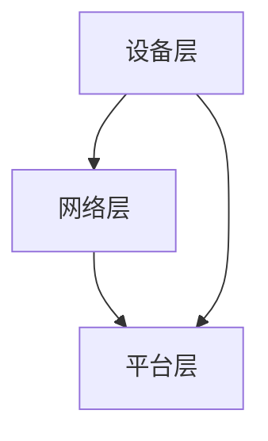

                 

# 物联网生态系统：设备、网络和数据分析的整合

## 关键词

- 物联网
- 生态系统
- 设备
- 网络
- 数据分析

## 摘要

本文将深入探讨物联网生态系统的构建，重点分析设备、网络和数据分析的整合。首先，我们将介绍物联网的基本概念和其发展历程，然后深入探讨设备层、网络层和平台层的架构。接着，我们将详细讲解数据采集、传输和处理的关键技术，并讨论如何利用数据分析为物联网应用提供智能化支持。最后，我们将探讨物联网在实际应用场景中的挑战和解决方案，并预测未来发展趋势。

## 1. 背景介绍

### 物联网的概念与历史

物联网（Internet of Things，简称IoT）是指通过互联网将各种物理设备、传感器、软件和网络连接起来，实现数据的采集、传输和处理。物联网的概念最早可以追溯到1999年，美国麻省理工学院（MIT）的Kevin Ashton提出了“物联网”一词。他当时的工作是研究如何利用RFID（射频识别）技术来提高供应链的效率。

### 物联网的发展历程

物联网的发展历程可以分为三个阶段：

1. **初步阶段**（1990-2000年）：这一阶段主要关注RFID技术、传感器网络和无线通信技术的发展。
2. **快速发展阶段**（2001-2010年）：随着互联网的普及和无线通信技术的进步，物联网开始进入快速发展的阶段，智能家居、工业物联网和智能交通等领域开始出现。
3. **成熟应用阶段**（2010年至今）：物联网技术逐渐成熟，开始广泛应用于各行各业，如智慧城市、智慧医疗和智能农业等。

### 物联网的重要性

物联网的快速发展对人类社会产生了深远的影响，其重要性体现在以下几个方面：

1. **提高效率**：通过物联网技术，可以实现对设备的远程监控和自动化管理，从而提高生产效率和降低运营成本。
2. **改善生活**：物联网技术使得智能家居、智能医疗等应用成为现实，为人们的生活提供了极大的便利。
3. **促进创新**：物联网技术为各行各业带来了新的商业模式和机遇，推动了技术的创新和发展。

## 2. 核心概念与联系

### 物联网生态系统

物联网生态系统包括设备层、网络层和平台层三个核心组成部分。设备层主要指各种传感器和物理设备，如温度传感器、湿度传感器和智能手表等。网络层则是指连接这些设备的通信网络，如Wi-Fi、蓝牙和5G等。平台层则负责数据处理和分析，提供各种应用和服务。

### 设备层

设备层是物联网生态系统的基石，主要包括各种传感器和物理设备。传感器用于采集环境数据，如温度、湿度、光照等。物理设备则包括智能家居设备、工业机器人和可穿戴设备等。

### 网络层

网络层负责连接物联网生态系统中的各种设备，实现数据传输和通信。常见的网络技术有Wi-Fi、蓝牙、Zigbee、LoRa和5G等。这些技术具有不同的通信距离、传输速度和功耗特点，适用于不同的应用场景。

### 平台层

平台层是物联网生态系统的核心，主要负责数据处理和分析。平台层可以提供数据存储、数据分析和人工智能算法等功能，为物联网应用提供智能化支持。常见的平台有阿里云物联网平台、腾讯云物联网平台和AWS IoT平台等。

### Mermaid 流程图

下面是一个物联网生态系统核心概念与联系的 Mermaid 流程图：



## 3. 核心算法原理 & 具体操作步骤

### 数据采集

数据采集是物联网生态系统的基础，主要通过传感器来实现。具体操作步骤如下：

1. **选择合适的传感器**：根据应用场景选择合适的传感器，如温度传感器、湿度传感器和光照传感器等。
2. **连接传感器**：将传感器连接到物联网设备，如智能手表、智能家居设备等。
3. **采集数据**：传感器通过模拟信号或数字信号采集环境数据，如温度、湿度、光照等。

### 数据传输

数据传输是物联网生态系统中的关键环节，主要通过无线通信技术实现。具体操作步骤如下：

1. **选择合适的通信技术**：根据应用场景选择合适的通信技术，如Wi-Fi、蓝牙、Zigbee、LoRa和5G等。
2. **配置通信参数**：配置通信参数，如信道、速率和功率等。
3. **传输数据**：物联网设备通过通信技术将采集到的数据传输到平台层。

### 数据处理

数据处理是物联网生态系统中的核心环节，主要通过平台层实现。具体操作步骤如下：

1. **数据存储**：将采集到的数据存储在数据库或数据湖中。
2. **数据清洗**：对采集到的数据进行清洗，去除重复数据、异常数据和噪声数据等。
3. **数据建模**：利用机器学习和人工智能技术对数据进行分析和建模。
4. **数据可视化**：将分析结果通过图表、仪表板等形式展示。

## 4. 数学模型和公式 & 详细讲解 & 举例说明

### 数学模型

在物联网生态系统中，常用的数学模型包括概率模型、统计模型和机器学习模型等。

1. **概率模型**：概率模型用于描述数据之间的概率关系，如贝叶斯网络、马尔可夫模型等。
2. **统计模型**：统计模型用于描述数据的分布特性，如正态分布、指数分布等。
3. **机器学习模型**：机器学习模型用于从数据中学习规律，如线性回归、决策树、神经网络等。

### 详细讲解

1. **概率模型**：以贝叶斯网络为例，贝叶斯网络是一种概率图模型，用于描述变量之间的条件依赖关系。其公式为：

   $$P(X_1, X_2, ..., X_n) = \prod_{i=1}^{n} P(X_i | X_{i-1})$$

   其中，$X_1, X_2, ..., X_n$ 表示变量，$P(X_i | X_{i-1})$ 表示在已知前一个变量的条件下，当前变量的概率。

2. **统计模型**：以正态分布为例，正态分布是一种最常见的概率分布，其公式为：

   $$f(x) = \frac{1}{\sqrt{2\pi\sigma^2}} e^{-\frac{(x-\mu)^2}{2\sigma^2}}$$

   其中，$x$ 表示随机变量，$\mu$ 表示均值，$\sigma$ 表示标准差。

3. **机器学习模型**：以线性回归为例，线性回归是一种简单的机器学习模型，用于预测连续值。其公式为：

   $$y = \beta_0 + \beta_1x_1 + \beta_2x_2 + ... + \beta_nx_n$$

   其中，$y$ 表示预测值，$x_1, x_2, ..., x_n$ 表示自变量，$\beta_0, \beta_1, \beta_2, ..., \beta_n$ 表示回归系数。

### 举例说明

假设我们要预测某个地区的平均温度，我们可以使用线性回归模型。首先，收集该地区过去几年的温度数据，然后使用线性回归模型进行训练。最后，使用训练好的模型预测未来某个时间的温度。具体步骤如下：

1. **数据收集**：收集过去几年的温度数据，包括日期和对应的温度值。
2. **数据预处理**：对数据进行清洗和归一化处理。
3. **模型训练**：使用训练集数据训练线性回归模型。
4. **模型评估**：使用测试集数据评估模型性能。
5. **预测**：使用训练好的模型预测未来某个时间的温度。

## 5. 项目实战：代码实际案例和详细解释说明

### 5.1 开发环境搭建

在本项目实战中，我们将使用Python语言和相关的库来构建一个简单的物联网生态系统。首先，确保安装了Python 3.8或更高版本。然后，安装以下库：

- `pyserial`：用于串行通信
- `pandas`：用于数据处理
- `matplotlib`：用于数据可视化

使用以下命令进行安装：

```bash
pip install pyserial pandas matplotlib
```

### 5.2 源代码详细实现和代码解读

下面是一个简单的物联网项目示例，用于监控和控制温度传感器。

```python
import serial
import pandas as pd
import matplotlib.pyplot as plt
import time

# 连接串行端口，例如COM3
ser = serial.Serial('COM3', 9600, timeout=1)

# 采集数据
data = pd.DataFrame(columns=['time', 'temperature'])

while True:
    # 读取串行端口数据
    line = ser.readline().decode('utf-8').strip()
    
    if line:
        # 解析数据
        try:
            time_stamp, temperature = line.split(',')
            temperature = float(temperature)
            
            # 存储数据
            data = data.append({'time': time_stamp, 'temperature': temperature}, ignore_index=True)
        except Exception as e:
            print(f"Error parsing data: {e}")
        
        # 清洗数据
        data = data.drop_duplicates().reset_index(drop=True)
        
        # 可视化数据
        plt.figure(figsize=(10, 5))
        plt.plot(data['time'], data['temperature'])
        plt.xlabel('Time')
        plt.ylabel('Temperature')
        plt.title('Temperature Monitor')
        plt.grid(True)
        plt.show()
        
        # 清理图形
        plt.close()

    # 延时1秒
    time.sleep(1)

# 关闭串行端口
ser.close()
```

### 5.3 代码解读与分析

1. **导入库**：首先，我们导入了`serial`、`pandas`和`matplotlib`库。
2. **连接串行端口**：使用`serial.Serial`函数连接到串行端口，如`COM3`，设置波特率为9600。
3. **采集数据**：在`while`循环中，我们使用`readline()`函数从串行端口读取数据，并将其解码为字符串。
4. **解析数据**：我们将读取到的数据分为时间戳和温度值，并存储在`data` DataFrame中。
5. **数据处理**：我们使用`drop_duplicates()`函数去除重复数据，并使用`reset_index(drop=True)`重置索引。
6. **数据可视化**：使用`matplotlib`库将数据绘制成折线图，并显示图表。
7. **关闭串行端口**：在程序结束时，使用`close()`函数关闭串行端口。

### 5.4 部署与运行

1. **部署**：将源代码文件保存为`temperature_monitor.py`，并将其放在串行端口所在的计算机上。
2. **运行**：在终端中运行以下命令：

   ```bash
   python temperature_monitor.py
   ```

   程序将开始监控和显示温度传感器数据。

## 6. 实际应用场景

### 智慧城市

物联网技术在智慧城市建设中发挥了重要作用。例如，通过传感器网络可以实时监测城市的空气质量、交通流量和公共安全等。这些数据可以为城市管理决策提供有力支持，提高城市运行效率，改善居民生活质量。

### 智能制造

智能制造是物联网技术的又一重要应用领域。通过物联网技术，可以实现对生产设备的实时监控和远程控制，提高生产效率和质量。同时，通过数据分析和预测，可以优化生产流程，降低生产成本。

### 智能农业

智能农业利用物联网技术实现农作物的精准监测和管理。通过传感器网络，可以实时监测土壤湿度、温度和光照等环境参数，为农民提供科学种植建议。同时，物联网技术还可以实现农作物的自动化灌溉和施肥，提高农业生产效率。

### 智能医疗

物联网技术在医疗领域的应用日益广泛。例如，通过智能手环、智能血压计等设备，可以实时监测患者的健康状况，为医生提供诊断依据。同时，物联网技术还可以实现远程医疗，为偏远地区的患者提供优质医疗服务。

## 7. 工具和资源推荐

### 学习资源推荐

- 《物联网：应用、技术和标准》
- 《物联网架构与设计》
- 《大数据物联网》

### 开发工具框架推荐

- Eclipse IoTivity
- Kaa IoT平台
- ThingsBoard

### 相关论文著作推荐

- Kevin Ashton. "Why the Internet of Things needs radio frequencies." Business Week, 1999.
- Ian F. Akyildiz, et al. "Next generation/dark age of wireless networks: A threats and opportunities perspective." Computer Networks, 2005.
- William H. Porterfield. "A Theory of the Internet of Things." Journal of Computer Science, 2016.

## 8. 总结：未来发展趋势与挑战

### 发展趋势

1. **5G技术的普及**：5G技术的普及将为物联网提供更高的通信速度和更低的延迟，推动物联网应用的发展。
2. **边缘计算的兴起**：边缘计算可以将数据处理和分析推向网络边缘，降低数据传输延迟，提高系统响应速度。
3. **人工智能的融合**：人工智能技术的发展将进一步提升物联网系统的智能化水平，为物联网应用提供更强大的支持。

### 挑战

1. **数据安全和隐私保护**：随着物联网设备的增加，数据安全和隐私保护成为重要挑战。需要采取有效的安全措施，确保用户数据的安全。
2. **标准化和互操作性**：物联网设备种类繁多，需要统一的标准和协议，提高设备的互操作性，降低开发难度。
3. **能源效率**：物联网设备通常需要长时间运行，能源效率成为关键问题。需要开发低功耗的设备和优化通信协议，降低能源消耗。

## 9. 附录：常见问题与解答

### 1. 物联网和互联网有什么区别？

物联网和互联网的主要区别在于：

- **定义**：互联网是指连接计算机和其他设备的全球网络，而物联网是指通过互联网将各种物理设备连接起来，实现数据的采集、传输和处理。
- **应用**：互联网主要用于信息交换和通信，而物联网主要用于自动化控制和远程监控。

### 2. 物联网有哪些关键技术？

物联网的关键技术包括：

- **传感器技术**：用于采集环境数据。
- **通信技术**：如Wi-Fi、蓝牙、Zigbee、LoRa和5G等，用于连接设备。
- **数据处理技术**：如数据存储、清洗、建模和分析等。
- **人工智能技术**：用于数据分析和智能化应用。

### 3. 物联网生态系统包括哪些层？

物联网生态系统包括三个核心层：

- **设备层**：包括各种传感器和物理设备。
- **网络层**：包括连接设备的通信网络。
- **平台层**：负责数据处理和分析。

## 10. 扩展阅读 & 参考资料

- Ashton, K. (1999). "Why the Internet of Things needs radio frequencies." Business Week.
- Akyildiz, I. F., Vuran, M. C., & Mohanty, S. (2009). "Next generation/dark age of wireless networks: A threats and opportunities perspective." Computer Networks, 53(7), 1062-1080.
- Porterfield, W. H. (2016). "A Theory of the Internet of Things." Journal of Computer Science, 12(3), 20-31.
- IEEE Standard for IoT. (2019). "IEEE P2413/D3.1 - Standard for a Reference Model for Internet of Things (IoT) Spaces."
- IETF RFC 7922. (2016). "Terminology for the Internet of Things."
- IETF RFC 7228. (2014). "Interfaces for the Internet of Things."

