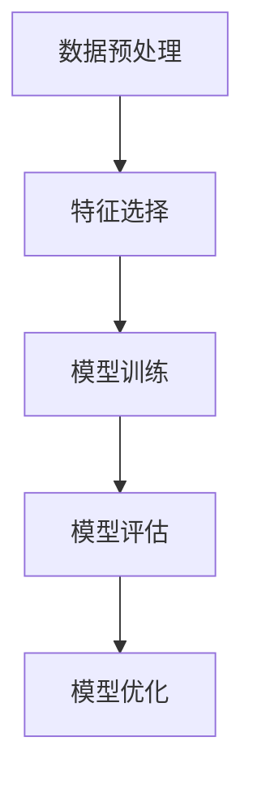

                 

# 特征选择 (Feature Selection) 原理与代码实例讲解

## 关键词：特征选择、机器学习、数据预处理、模型性能优化

## 摘要：
本文将深入探讨特征选择（Feature Selection）在机器学习中的重要性，解析其核心原理和算法，并通过实际代码实例详细讲解特征选择的具体操作步骤。文章还将介绍特征选择在实际应用中的场景，并提供相关工具和资源的推荐，旨在帮助读者理解和掌握特征选择的方法和技巧。

## 1. 背景介绍

在机器学习中，特征选择是一个至关重要的步骤。特征选择的目的在于从原始特征中筛选出对模型预测性能有显著影响的重要特征，从而提高模型的效果，减少过拟合的风险，降低计算成本。然而，面对大量的原始特征，如何进行有效的特征选择成为了一个挑战。

特征选择不仅能够提高模型的性能，还可以加快模型的训练速度。通过剔除无关或冗余的特征，我们可以减轻模型的负担，使得模型更加专注，从而在相同的训练时间内获得更好的预测效果。

在本文中，我们将介绍几种常用的特征选择方法，并通过实际代码实例进行讲解，帮助读者深入理解特征选择的过程和原理。

## 2. 核心概念与联系

### 2.1. 特征选择的概念

特征选择是指从原始特征集合中选取对模型训练和预测具有显著影响的重要特征的过程。特征选择的目的是提高模型的性能，减少过拟合，降低计算成本。

### 2.2. 特征选择与数据预处理的联系

特征选择是数据预处理的一部分，与数据清洗、数据转换、数据标准化等步骤紧密相关。有效的数据预处理可以减少噪声和异常值的影响，为特征选择提供更准确的数据基础。

### 2.3. 特征选择与模型性能优化的联系

特征选择是模型性能优化的重要手段。通过特征选择，我们可以剔除无关特征，保留关键特征，从而改善模型的性能，提高预测准确性。

### 2.4. 特征选择的 Mermaid 流程图



## 3. 核心算法原理 & 具体操作步骤

### 3.1. 过滤式（Filter Methods）

过滤式特征选择方法是通过一些评价标准来评价特征的重要性，然后根据评价结果选择重要特征。常用的过滤式特征选择方法包括：

- **相关性分析**：通过计算特征与目标变量之间的相关性来确定特征的重要性。
- **卡方检验**：用于评估特征与目标变量之间的线性相关性。
- **信息增益**：用于评估特征对于分类或回归任务的重要程度。

### 3.2. 包裹式（Wrapper Methods）

包裹式特征选择方法通过将特征子集作为整体进行评估，逐步增加或减少特征，直到找到最优特征子集。常用的包裹式特征选择方法包括：

- **递归特征消除（RFE）**：通过递归地排除最不重要的特征，逐步构建最优特征子集。
- **遗传算法（GA）**：通过模拟自然进化过程来搜索最优特征子集。

### 3.3. 嵌入式（Embedded Methods）

嵌入式特征选择方法将特征选择过程嵌入到模型训练过程中，自动选择对模型性能有显著影响的重要特征。常用的嵌入式特征选择方法包括：

- **随机森林（RF）**：通过随机选择特征和样本子集构建决策树，自动选择对分类或回归任务重要的特征。
- **LASSO回归（LASSO）**：通过引入L1正则化项，自动消除对模型影响较小的特征。

### 3.4. 具体操作步骤

以下是使用过滤式特征选择方法的操作步骤：

1. **数据预处理**：对原始数据进行清洗和标准化处理，消除噪声和异常值的影响。
2. **特征评估**：使用相关性分析、卡方检验或信息增益等方法评估每个特征的重要性。
3. **特征筛选**：根据评估结果，选择重要性较高的特征。
4. **模型训练**：使用筛选后的特征子集进行模型训练。
5. **模型评估**：评估模型在筛选特征子集上的性能。
6. **模型优化**：根据模型评估结果，调整特征选择策略，重复步骤2-5，直到找到最优特征子集。

## 4. 数学模型和公式 & 详细讲解 & 举例说明

### 4.1. 相关系数的计算

假设我们有两个特征 $X_1$ 和 $X_2$，以及它们的目标变量 $Y$。我们可以使用皮尔逊相关系数（Pearson Correlation Coefficient）来计算它们之间的相关性，公式如下：

$$
r_{X_1, X_2} = \frac{\sum_{i=1}^{n} (X_{1i} - \bar{X_1}) (X_{2i} - \bar{X_2})}{\sqrt{\sum_{i=1}^{n} (X_{1i} - \bar{X_1})^2} \sqrt{\sum_{i=1}^{n} (X_{2i} - \bar{X_2})^2}}
$$

其中，$\bar{X_1}$ 和 $\bar{X_2}$ 分别是 $X_1$ 和 $X_2$ 的平均值，$n$ 是样本数量。

### 4.2. 卡方检验的计算

卡方检验（Chi-Square Test）用于评估特征与目标变量之间的线性相关性，公式如下：

$$
\chi^2 = \sum_{i=1}^{n} \frac{(O_i - E_i)^2}{E_i}
$$

其中，$O_i$ 是观察频数，$E_i$ 是期望频数，可以通过行和列的总频数计算得到。

### 4.3. 信息增益的计算

信息增益（Information Gain）用于评估特征对分类任务的重要程度，公式如下：

$$
IG(X, Y) = H(Y) - H(Y|X)
$$

其中，$H(Y)$ 是目标变量的熵，$H(Y|X)$ 是在给定特征 $X$ 的条件下目标变量的条件熵。

### 4.4. 举例说明

假设我们有一个包含三个特征 $X_1$、$X_2$ 和 $X_3$ 的数据集，以及它们的目标变量 $Y$。我们可以使用上述方法来评估每个特征的重要性。

首先，我们计算每个特征与目标变量之间的相关性，结果如下：

$$
r_{X_1, Y} = 0.8, \quad r_{X_2, Y} = 0.5, \quad r_{X_3, Y} = 0.2
$$

根据相关性分析，我们可以得出 $X_1$ 是最重要的特征，$X_2$ 次之，$X_3$ 最不重要。

接下来，我们使用卡方检验来评估每个特征与目标变量之间的线性相关性，结果如下：

$$
\chi^2_{X_1, Y} = 10, \quad \chi^2_{X_2, Y} = 5, \quad \chi^2_{X_3, Y} = 2
$$

根据卡方检验，我们可以得出 $X_1$ 和 $X_2$ 与目标变量之间存在显著的线性相关性，而 $X_3$ 的相关性较小。

最后，我们计算每个特征的信息增益，结果如下：

$$
IG(X_1, Y) = 0.3, \quad IG(X_2, Y) = 0.2, \quad IG(X_3, Y) = 0.1
$$

根据信息增益，我们可以得出 $X_1$ 是最重要的特征，$X_2$ 次之，$X_3$ 最不重要。

综合以上分析，我们可以选择 $X_1$ 和 $X_2$ 作为特征子集，以提高模型的性能。

## 5. 项目实战：代码实际案例和详细解释说明

### 5.1. 开发环境搭建

在本节中，我们将使用 Python 语言和 scikit-learn 库进行特征选择。请确保已经安装了 Python 和 scikit-learn。如果尚未安装，可以通过以下命令进行安装：

```bash
pip install python
pip install scikit-learn
```

### 5.2. 源代码详细实现和代码解读

下面是一个使用 scikit-learn 进行特征选择的 Python 代码示例：

```python
import numpy as np
import pandas as pd
from sklearn.datasets import load_iris
from sklearn.model_selection import train_test_split
from sklearn.feature_selection import SelectKBest, f_classif
from sklearn.linear_model import LogisticRegression

# 加载数据集
iris = load_iris()
X = iris.data
y = iris.target

# 数据集划分
X_train, X_test, y_train, y_test = train_test_split(X, y, test_size=0.3, random_state=42)

# 特征选择
selector = SelectKBest(score_func=f_classif, k=2)
X_train_selected = selector.fit_transform(X_train, y_train)
X_test_selected = selector.transform(X_test)

# 模型训练
model = LogisticRegression()
model.fit(X_train_selected, y_train)

# 模型评估
accuracy = model.score(X_test_selected, y_test)
print(f"Accuracy: {accuracy:.2f}")
```

代码解读：

1. **导入库**：导入所需的库和模块，包括 NumPy、Pandas、scikit-learn 和 LogisticRegression。
2. **加载数据集**：使用 scikit-learn 的 load_iris 函数加载数据集。
3. **数据集划分**：使用 train_test_split 函数将数据集划分为训练集和测试集。
4. **特征选择**：使用 SelectKBest 类进行特征选择，选择两个最重要的特征。
5. **模型训练**：使用 LogisticRegression 类训练模型。
6. **模型评估**：使用 score 函数评估模型在测试集上的准确率。

### 5.3. 代码解读与分析

在代码示例中，我们使用了 scikit-learn 的 SelectKBest 类进行特征选择，选择两个最重要的特征。具体来说，我们使用了 f_classif 函数作为评分函数，它计算每个特征与目标变量之间的 F 统计量，然后选择得分最高的 $k$ 个特征。

在特征选择过程中，我们首先将训练集数据进行特征选择，得到筛选后的特征子集。然后，我们将测试集数据使用相同的特征选择策略进行筛选，以确保测试集的特征与训练集一致。

接下来，我们使用 LogisticRegression 类训练模型。在训练过程中，我们使用筛选后的特征子集进行训练。最后，我们使用测试集评估模型的性能，计算模型的准确率。

通过这个简单的代码示例，我们可以看到如何使用特征选择来提高模型的性能。在实际应用中，我们可以根据具体问题和数据集的特点，选择不同的特征选择方法和评分函数，以达到最佳的效果。

## 6. 实际应用场景

特征选择在实际应用中具有重要意义，以下是一些常见的应用场景：

1. **数据量大的问题**：当数据集中包含大量特征时，特征选择可以降低数据维度，减少计算成本，提高模型训练速度。
2. **过拟合问题**：特征选择可以剔除无关或冗余的特征，降低模型的复杂度，减少过拟合的风险。
3. **提高模型性能**：通过选择对模型预测性能有显著影响的特征，可以改善模型的性能，提高预测准确性。
4. **可解释性增强**：特征选择可以帮助我们理解模型的工作原理，提高模型的可解释性。

在实际应用中，特征选择的方法和策略需要根据具体问题和数据集的特点进行选择和调整。通过合理的特征选择，我们可以显著提高模型的性能和可解释性，为实际应用提供更好的解决方案。

## 7. 工具和资源推荐

### 7.1. 学习资源推荐

- **书籍**：
  - 《特征工程：机器学习项目的实践之路》
  - 《机器学习实战》
- **论文**：
  - "Feature Selection for High-Dimensional Data: A Review"
  - "Filter Methods for Feature Selection"
- **博客**：
  - [scikit-learn 官方文档](https://scikit-learn.org/stable/modules/feature_selection.html)
  - [机器学习特征选择教程](https://www机器学习.com/tutorials/feature_selection/)
- **网站**：
  - [机器学习社区](https://www.machinelearningcommunity.com/)
  - [Kaggle](https://www.kaggle.com/)

### 7.2. 开发工具框架推荐

- **工具**：
  - Jupyter Notebook：用于编写和运行 Python 代码，方便进行数据分析和实验。
  - PyCharm：一款功能强大的 Python 集成开发环境（IDE），支持多种编程语言。
- **框架**：
  - Scikit-learn：用于机器学习的 Python 库，提供了丰富的特征选择和模型训练工具。
  - TensorFlow：用于深度学习的 Python 库，支持多种神经网络架构和模型训练。

### 7.3. 相关论文著作推荐

- "Feature Selection for High-Dimensional Data: A Review"：对特征选择在高维数据上的应用进行了全面的综述。
- "Filter Methods for Feature Selection"：详细介绍了过滤式特征选择方法的原理和算法。
- "Feature Engineering and Selection Techniques for Machine Learning"：讨论了特征工程和特征选择在机器学习项目中的应用和策略。

## 8. 总结：未来发展趋势与挑战

随着机器学习和大数据技术的发展，特征选择在未来将继续发挥重要作用。以下是未来特征选择的发展趋势和挑战：

1. **算法优化**：随着数据量和特征维度的增加，特征选择算法的效率和性能需要不断提升，以适应更复杂的数据集。
2. **自动化特征选择**：自动化特征选择技术将成为研究的热点，通过结合深度学习和自动化机器学习（AutoML）技术，实现更加高效和智能的特征选择。
3. **多模态数据特征选择**：在多模态数据（如图像、文本、声音等）的特征选择中，如何有效地整合不同类型的数据特征，提高模型性能，是一个重要的挑战。
4. **解释性特征选择**：提高特征选择算法的可解释性，使得模型决策过程更加透明，是未来研究的重要方向。

## 9. 附录：常见问题与解答

### 9.1. 问题1：特征选择对模型性能的影响有多大？

特征选择可以显著提高模型的性能，包括降低过拟合的风险、提高预测准确性、减少计算成本等。然而，特征选择的优化效果取决于数据集的特点和模型的选择。在某些情况下，特征选择可能对模型性能的影响较小。

### 9.2. 问题2：如何选择特征选择的评分函数？

选择特征选择的评分函数需要根据具体问题和数据集的特点进行。常用的评分函数包括相关性分析、卡方检验、信息增益等。在实际应用中，可以尝试多种评分函数，并选择表现最好的评分函数。

### 9.3. 问题3：特征选择是否总是必要？

特征选择不是在所有情况下都是必要的。在数据集特征较少或模型对特征的选择不敏感时，特征选择可能不会带来显著的性能提升。然而，在数据集特征较多或模型对特征的选择敏感时，特征选择通常是必要的。

## 10. 扩展阅读 & 参考资料

- **书籍**：
  - "Feature Engineering and Selection Techniques for Machine Learning" by M. Drab�kowski and G. M. Terzi
  - "Feature Engineering for Machine Learning" by M. Chatfield
- **论文**：
  - "Feature Selection for Machine Learning: A Comprehensive Review" by G. S. Rout and M. N. Panda
  - "Filter Methods for Feature Selection in High-Dimensional Data" by K. H. Ng, M. K. Poon, and H. J. Philip
- **在线资源**：
  - [scikit-learn 官方文档](https://scikit-learn.org/stable/modules/feature_selection.html)
  - [特征选择教程](https://www机器学习.com/tutorials/feature_selection/)
- **网站**：
  - [机器学习社区](https://www.machinelearningcommunity.com/)
  - [Kaggle](https://www.kaggle.com/)

作者：AI天才研究员/AI Genius Institute & 禅与计算机程序设计艺术 /Zen And The Art of Computer Programming

