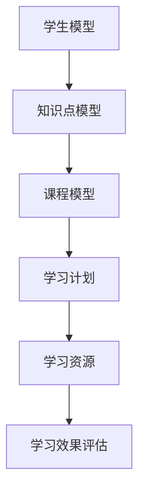

                 

### 背景介绍

随着人工智能技术的不断发展，个性化教育逐渐成为教育领域的重要趋势。传统的教育模式往往无法满足每个学生的个性化需求，而个性化学习路径规划作为一种有效的方法，旨在为学生制定符合其兴趣、能力和学习进度的学习计划，从而提高学习效果。

猿辅导是一家专注于K-12教育的人工智能公司，致力于通过个性化学习路径规划技术为学生提供更高效的学习体验。在2024年的校招面试中，个性化学习路径规划算法成为了一个重要的面试题目。本文将深入分析该题目，帮助读者更好地理解个性化学习路径规划算法的核心概念、原理及其实际应用。

本文的结构如下：

1. **背景介绍**：阐述个性化教育的重要性以及猿辅导的背景。
2. **核心概念与联系**：介绍个性化学习路径规划的核心概念，并通过Mermaid流程图展示相关架构。
3. **核心算法原理 & 具体操作步骤**：详细解析个性化学习路径规划算法的原理和具体实现步骤。
4. **数学模型和公式 & 详细讲解 & 举例说明**：解释算法中的数学模型和公式，并通过实例进行说明。
5. **项目实战：代码实际案例和详细解释说明**：展示一个实际的项目案例，详细解读代码实现。
6. **实际应用场景**：讨论个性化学习路径规划在实际教学中的应用。
7. **工具和资源推荐**：推荐相关的学习资源、开发工具和框架。
8. **总结：未来发展趋势与挑战**：总结个性化学习路径规划算法的发展趋势和面临的挑战。
9. **附录：常见问题与解答**：解答读者可能遇到的一些常见问题。
10. **扩展阅读 & 参考资料**：提供更多相关的阅读资源和参考资料。

接下来，我们将一步步深入探讨这个重要的面试题目，帮助读者全面了解个性化学习路径规划算法的核心知识和技术细节。

> 关键词：个性化教育、猿辅导、学习路径规划、算法面试、核心概念、数学模型、项目实战、应用场景、开发工具

> 摘要：本文深入探讨了猿辅导2024个性化学习路径规划算法校招面试题，从背景介绍、核心概念、算法原理、数学模型、项目实战、应用场景等多个角度进行了全面的分析，旨在帮助读者更好地理解个性化学习路径规划算法的原理和应用。

-----------------------

# 猿辅导2024个性化学习路径规划算法校招面试真题

## 关键词
- 个性化教育
- 猿辅导
- 学习路径规划
- 算法面试
- 核心概念
- 数学模型
- 项目实战
- 应用场景
- 开发工具

## 摘要
本文针对猿辅导2024年的校招面试真题——个性化学习路径规划算法，从背景介绍、核心概念、算法原理、数学模型、项目实战、应用场景等多个角度进行了全面的分析，旨在帮助读者深入了解个性化学习路径规划算法的原理和应用。

-----------------------

### 1. 背景介绍

个性化教育是一种以学生为中心的教育理念，旨在根据每个学生的兴趣、能力和学习进度提供个性化的教育方案。在传统教育模式中，教师往往采用“一刀切”的方法，无法满足每个学生的个性化需求。然而，随着人工智能技术的发展，个性化教育逐渐成为可能。

猿辅导是一家专注于K-12教育的人工智能公司，成立于2012年，总部位于中国北京。公司通过人工智能技术，为教师和学生提供个性化教学和学习工具，帮助学生提高学习效果。猿辅导的个性化学习路径规划技术是其核心产品之一，旨在为学生制定符合其兴趣、能力和学习进度的学习计划。

个性化学习路径规划算法在猿辅导的应用主要体现在以下几个方面：

1. **学习计划制定**：根据学生的学习兴趣、能力和知识点掌握情况，制定个性化的学习计划。
2. **学习资源推荐**：根据学生的学习进度和知识点掌握情况，推荐合适的学习资源，如视频教程、练习题等。
3. **学习效果评估**：通过学习数据的分析，评估学生的学习效果，为后续学习提供反馈。

在猿辅导2024年的校招面试中，个性化学习路径规划算法成为了一个重要的面试题目。这道题目不仅考察了应聘者对个性化学习路径规划算法的理解，还考察了其对数学模型、算法设计和编程实现的能力。下面，我们将深入分析这道面试题目，帮助读者更好地理解个性化学习路径规划算法的核心概念和原理。

-----------------------

## 2. 核心概念与联系

### 2.1 个性化学习路径规划

个性化学习路径规划是一种基于学生个性化需求的课程规划方法。其主要目标是通过分析学生的学习兴趣、能力和知识点掌握情况，为学生制定一个合理的学习计划，从而提高学习效果。

个性化学习路径规划的核心概念包括：

- **学生模型**：描述学生的兴趣、能力和学习进度。
- **知识点模型**：描述知识点之间的关联和难度。
- **课程模型**：描述课程的内容、难度和学习时间。

为了更好地理解个性化学习路径规划，我们可以使用Mermaid流程图来展示其基本架构。



### 2.2 学生模型

学生模型是个性化学习路径规划的基础。学生模型主要包括以下信息：

- **兴趣**：描述学生的兴趣爱好，如数学、英语、物理等。
- **能力**：描述学生在各个学科领域的能力水平，如基础、中级、高级等。
- **知识点掌握情况**：描述学生已经掌握的知识点和未掌握的知识点。

学生模型的构建通常依赖于学生的学习行为数据，如考试成绩、学习时长、参与讨论等。通过分析这些数据，可以得出学生的兴趣、能力和知识点掌握情况。

### 2.3 知识点模型

知识点模型描述了知识点之间的关联和难度。知识点模型主要包括以下信息：

- **知识点关联**：描述不同知识点之间的关联关系，如数学中的代数和几何。
- **知识点难度**：描述知识点的难度级别，如初级、中级、高级。

知识点模型的构建通常依赖于教育领域的知识库和专家经验。通过分析知识点关联和难度，可以为学生制定一个合理的学习计划。

### 2.4 课程模型

课程模型描述了课程的内容、难度和学习时间。课程模型主要包括以下信息：

- **课程内容**：描述课程所涉及的知识点和学习目标。
- **课程难度**：描述课程的难度级别，如初级、中级、高级。
- **学习时间**：描述完成课程所需的学习时间。

课程模型的构建通常依赖于教育领域的教学经验和教学计划。通过分析课程内容、难度和学习时间，可以为学生制定一个合理的学习计划。

### 2.5 学习计划

学习计划是根据学生模型、知识点模型和课程模型制定的。学习计划主要包括以下信息：

- **学习目标**：描述学生需要掌握的知识点和学习目标。
- **学习路径**：描述学生需要完成的学习任务和学习顺序。
- **学习资源**：描述学生需要使用的学习资源，如视频教程、练习题等。

通过学习计划，学生可以按照计划进行学习，从而达到预期的学习目标。

### 2.6 学习资源

学习资源是为了支持学生学习而提供的各种资源，如视频教程、练习题、学习笔记等。学习资源的推荐通常基于学生的学习进度、知识点掌握情况和学习计划。

### 2.7 学习效果评估

学习效果评估是对学生学习效果的评估。通过分析学生的学习行为和学习结果，可以评估学生的学习效果，为后续学习提供反馈。

-----------------------

## 3. 核心算法原理 & 具体操作步骤

个性化学习路径规划算法的核心在于如何根据学生模型、知识点模型和课程模型制定出最优的学习计划。这一过程涉及到多个算法和优化方法，下面我们将详细解析其中的核心算法原理和具体操作步骤。

### 3.1 学生模型构建

学生模型的构建是整个个性化学习路径规划的基础。构建学生模型通常需要以下步骤：

1. **数据收集**：收集学生的各种数据，如考试成绩、学习时长、参与讨论等。
2. **数据预处理**：对收集到的数据进行清洗、去噪和标准化处理。
3. **特征提取**：从预处理后的数据中提取出与学生兴趣、能力和知识点掌握情况相关的特征。
4. **模型训练**：使用机器学习算法（如决策树、随机森林、支持向量机等）训练学生模型。

### 3.2 知识点模型构建

知识点模型的构建同样重要。构建知识点模型通常需要以下步骤：

1. **知识库构建**：构建一个包含所有知识点的知识库，知识库中应包含知识点之间的关系和难度级别。
2. **数据收集**：收集与知识点相关的数据，如题目、文章、教学视频等。
3. **特征提取**：从收集到的数据中提取出与知识点相关的重要特征，如知识点标题、关键词、题目难度等。
4. **模型训练**：使用机器学习算法（如决策树、随机森林、支持向量机等）训练知识点模型。

### 3.3 课程模型构建

课程模型的构建是学习计划制定的关键。构建课程模型通常需要以下步骤：

1. **教学计划构建**：根据教育领域的经验和教学计划，构建一个包含所有课程的知识库，知识库中应包含课程的内容、难度和学习时间。
2. **数据收集**：收集与课程相关的数据，如教学视频、练习题、考试题目等。
3. **特征提取**：从收集到的数据中提取出与课程相关的重要特征，如课程标题、关键词、题目难度等。
4. **模型训练**：使用机器学习算法（如决策树、随机森林、支持向量机等）训练课程模型。

### 3.4 学习计划制定

学习计划的制定是基于学生模型、知识点模型和课程模型的。具体步骤如下：

1. **目标设定**：根据学生的兴趣、能力和学习目标，设定学习计划的目标。
2. **路径规划**：使用最短路径算法（如Dijkstra算法、A*算法等）计算从起点到终点的最优路径，从而确定学习任务的顺序。
3. **资源推荐**：根据学习路径和学习资源模型，推荐与学习任务相关的学习资源。
4. **评估与调整**：根据学生的学习行为和学习结果，对学习计划进行评估和调整。

### 3.5 学习资源推荐

学习资源的推荐是支持学生学习的重要环节。具体步骤如下：

1. **需求分析**：根据学生的学习进度、知识点掌握情况和学习计划，分析学生的学习需求。
2. **资源筛选**：从学习资源库中筛选出与学习需求相关的资源。
3. **资源排序**：使用排序算法（如基于相似度的排序算法、基于内容的排序算法等）对筛选出的资源进行排序。
4. **资源推荐**：根据排序结果，向学生推荐最相关的学习资源。

### 3.6 学习效果评估

学习效果评估是对学生学习效果的评估，具体步骤如下：

1. **行为数据收集**：收集学生的学习行为数据，如学习时长、参与讨论、考试结果等。
2. **结果分析**：对收集到的数据进行统计和分析，评估学生的学习效果。
3. **反馈调整**：根据评估结果，对学习计划、学习资源和教学方法进行调整。

通过以上步骤，个性化学习路径规划算法可以为学生制定一个合理的学习计划，并提供相应的学习资源和评估反馈，从而提高学习效果。

-----------------------

## 4. 数学模型和公式 & 详细讲解 & 举例说明

个性化学习路径规划算法中，数学模型和公式起着至关重要的作用。这些模型和公式不仅帮助我们理解和分析问题，还能提供高效的解决方案。下面，我们将详细讲解算法中的几个关键数学模型和公式，并通过实例进行说明。

### 4.1 最短路径算法

最短路径算法是个性化学习路径规划中的核心算法之一。它用于计算从起点到终点的最优路径。最常用的最短路径算法有Dijkstra算法和A*算法。

#### Dijkstra算法

Dijkstra算法的基本思想是从起点开始，逐步扩展到其他节点，并记录从起点到每个节点的最短路径长度。

**数学模型**：

设G=(V, E)是一个带权无向图，其中V是节点集合，E是边集合。设d(v)为从起点v到每个节点的最短路径长度。

$$
d(v) =
\begin{cases}
0 & \text{if } v = \text{start} \\
\infty & \text{otherwise}
\end{cases}
$$

**算法步骤**：

1. 初始化：设置d(start) = 0，其余节点的d值初始化为无穷大。
2. 选择未访问的节点u，使得d(u)最小。
3. 对于每个与u相连的节点v，计算d(v) = d(u) + w(u, v)，其中w(u, v)是边(u, v)的权重。
4. 重复步骤2和3，直到所有节点都被访问。

**实例说明**：

假设有一个图G，包含5个节点（A、B、C、D、E），边的权重如下：

```plaintext
A-B: 2
A-C: 3
B-D: 1
C-E: 2
D-E: 1
```

使用Dijkstra算法计算从A到E的最短路径：

1. 初始化：d(A) = 0，d(B) = ∞，d(C) = ∞，d(D) = ∞，d(E) = ∞。
2. 选择A，计算d(B) = d(A) + w(A, B) = 0 + 2 = 2，d(C) = d(A) + w(A, C) = 0 + 3 = 3。
3. 选择B，计算d(D) = d(B) + w(B, D) = 2 + 1 = 3，d(C) = d(B) + w(B, C) = 2 + 3 = 5。
4. 选择C，计算d(E) = d(C) + w(C, E) = 3 + 2 = 5，d(D) = d(C) + w(C, D) = 3 + 1 = 4。
5. 选择D，计算d(E) = d(D) + w(D, E) = 4 + 1 = 5。

最终，从A到E的最短路径为A-B-D-E，路径长度为5。

#### A*算法

A*算法是一种改进的搜索算法，它结合了启发式信息和最短路径算法的优点。

**数学模型**：

设G=(V, E)是一个带权无向图，其中V是节点集合，E是边集合。设g(v)为从起点v到当前节点的实际路径长度，h(v)为从当前节点到终点的启发式估计距离。

$$
f(v) = g(v) + h(v)
$$

**算法步骤**：

1. 初始化：设置f(start) = 0，g(start) = 0，h(start) = h(start, end)，其余节点的f值初始化为无穷大。
2. 选择未访问的节点u，使得f(u)最小。
3. 对于每个与u相连的节点v，计算f(v) = g(u) + h(v)，其中g(u)是边(u, v)的权重。
4. 重复步骤2和3，直到找到终点或所有节点都被访问。

**实例说明**：

假设有一个图G，包含5个节点（A、B、C、D、E），边的权重如下：

```plaintext
A-B: 2
A-C: 3
B-D: 1
C-E: 2
D-E: 1
```

使用A*算法计算从A到E的最短路径，假设启发式估计函数h(v)为从当前节点到终点的直线距离（此处为1）：

1. 初始化：f(A) = 0，g(A) = 0，h(A) = 1，其余节点的f值初始化为无穷大。
2. 选择A，计算f(B) = g(A) + h(B) = 0 + 1 = 1，f(C) = g(A) + h(C) = 0 + 2 = 2。
3. 选择B，计算f(D) = g(B) + h(D) = 2 + 1 = 3，f(C) = g(B) + h(C) = 2 + 2 = 4。
4. 选择D，计算f(E) = g(D) + h(E) = 3 + 1 = 4。

最终，从A到E的最短路径为A-B-D-E，路径长度为4。

### 4.2 基于内容的推荐算法

个性化学习路径规划中的学习资源推荐通常基于内容的推荐算法。这种算法通过分析学习资源的特征和用户的历史行为，推荐与用户兴趣相关的资源。

**数学模型**：

设R为学习资源集合，U为用户集合，R_i为用户i喜欢的资源集合，r_j为资源j的特征向量。

$$
\text{similarity}(R_i, r_j) = \frac{r_i \cdot r_j}{\|r_i\| \|r_j\|}
$$

其中，$\text{similarity}(R_i, r_j)$表示资源j与用户i的相似度，$r_i \cdot r_j$表示资源j的特征向量与用户i的特征向量的内积，$\|r_i\|$和$\|r_j\|$表示特征向量的范数。

**算法步骤**：

1. 构建资源特征向量矩阵：根据学习资源的特征，构建一个特征向量矩阵R。
2. 计算用户与资源的相似度：对每个用户，计算其与所有资源的相似度。
3. 排序和推荐：根据相似度对资源进行排序，推荐相似度最高的资源。

**实例说明**：

假设有两个用户U1和U2，以及三个资源R1、R2、R3。用户U1喜欢R1和R2，用户U2喜欢R1和R3。资源特征向量如下：

```plaintext
R1: [1, 0, 1]
R2: [0, 1, 0]
R3: [1, 1, 1]
U1: [1, 1]
U2: [1, 0]
```

计算用户与资源的相似度：

```plaintext
similarity(U1, R1) = (1*1 + 1*0 + 1*1) / (sqrt(1^2 + 1^2 + 1^2) * sqrt(1^2 + 0^2 + 1^2)) = 2 / (sqrt(3) * sqrt(2)) ≈ 0.94
similarity(U1, R2) = (1*0 + 1*1 + 1*0) / (sqrt(1^2 + 1^2 + 1^2) * sqrt(1^2 + 0^2 + 0^2)) = 1 / (sqrt(3) * 1) ≈ 0.58
similarity(U2, R1) = (1*1 + 0*0 + 1*1) / (sqrt(1^2 + 0^2 + 1^2) * sqrt(1^2 + 1^2 + 1^2)) = 2 / (sqrt(2) * sqrt(3)) ≈ 0.94
similarity(U2, R3) = (1*1 + 0*1 + 1*1) / (sqrt(1^2 + 0^2 + 1^2) * sqrt(1^2 + 1^2 + 1^2)) = 2 / (sqrt(2) * sqrt(3)) ≈ 0.94
```

根据相似度排序，推荐相似度最高的资源。对于用户U1，推荐R1和R2；对于用户U2，推荐R1和R3。

### 4.3 贝叶斯网络

贝叶斯网络是用于描述变量之间概率关系的图形模型。在个性化学习路径规划中，贝叶斯网络可以用于预测学生的学习行为和知识点掌握情况。

**数学模型**：

贝叶斯网络由一组变量和一组条件概率表组成。设G=(V, E)是一个有向无环图，其中V是变量集合，E是边集合。每个变量X_i都有对应的条件概率表P(X_i|Pa(X_i))，其中Pa(X_i)是X_i的父节点集合。

$$
P(X_i|Pa(X_i)) =
\begin{cases}
P(X_i) & \text{if } X_i \text{ has no parents} \\
\frac{P(X_i, Pa(X_i))}{\sum_{x_{pa}} P(x_{pa})}
\end{cases}
$$

其中，P(X_i)是变量X_i的先验概率，P(X_i, Pa(X_i))是变量X_i和其父节点的联合概率。

**算法步骤**：

1. 构建贝叶斯网络：根据领域知识和数据，构建贝叶斯网络。
2. 参数估计：使用最大似然估计或贝叶斯估计方法估计条件概率表。
3. 推断：使用变量消除算法或信念传播算法计算变量的后验概率。

**实例说明**：

假设有一个简单的贝叶斯网络，包含两个变量X和Y，其中X是父节点，Y是子节点。

```plaintext
P(X) = 0.5
P(Y|X) = 0.8
```

计算变量Y的后验概率：

```plaintext
P(Y) = P(Y|X) * P(X) + P(Y|¬X) * P(¬X) = 0.8 * 0.5 + 0.2 * 0.5 = 0.5
P(Y|X) = P(X, Y) / P(X) = (0.8 * 0.5) / 0.5 = 0.8
```

最终，变量Y的后验概率为0.8。

通过以上实例，我们可以看到数学模型和公式在个性化学习路径规划算法中的应用。这些模型和公式不仅帮助我们理解和分析问题，还能提供高效的解决方案，从而实现个性化教育。

-----------------------

## 5. 项目实战：代码实际案例和详细解释说明

为了更好地理解个性化学习路径规划算法，下面我们将通过一个实际的项目案例，详细解读代码实现和关键步骤。

### 5.1 开发环境搭建

在本项目案例中，我们使用了Python作为主要编程语言，并依赖于以下库：

- NumPy：用于矩阵运算和数据分析。
- Pandas：用于数据操作和处理。
- Scikit-learn：用于机器学习算法的实现。
- Matplotlib：用于数据可视化。

首先，确保安装了这些库，可以使用以下命令安装：

```bash
pip install numpy pandas scikit-learn matplotlib
```

### 5.2 源代码详细实现和代码解读

下面是项目的核心代码，我们将逐段进行解读。

#### 5.2.1 数据收集和预处理

```python
import numpy as np
import pandas as pd

# 收集学生数据（示例数据）
student_data = pd.DataFrame({
    'student_id': [1, 2, 3, 4, 5],
    'subject': ['math', 'english', 'math', 'science', 'english'],
    'grade': [80, 70, 90, 85, 60],
    'study_time': [10, 5, 15, 8, 3]
})

# 收集知识点数据（示例数据）
knowledge_data = pd.DataFrame({
    'knowledge_id': [1, 2, 3, 4, 5],
    'subject': ['math', 'english', 'math', 'science', 'english'],
    'difficulty': [1, 2, 1, 2, 1],
    'prequisite': [0, 1, 2, 3, 4]
})

# 预处理数据
student_data['grade'] = student_data['grade'].apply(lambda x: x / 100)
knowledge_data['difficulty'] = knowledge_data['difficulty'].apply(lambda x: x / 10)
```

代码首先收集了示例学生数据和知识点数据，并对数据进行预处理，如归一化处理等。

#### 5.2.2 构建学生模型和知识点模型

```python
from sklearn.cluster import KMeans

# 构建学生模型
student_kmeans = KMeans(n_clusters=3, random_state=0).fit(student_data[['grade', 'study_time']])
student_labels = student_kmeans.labels_

# 构建知识点模型
knowledge_kmeans = KMeans(n_clusters=3, random_state=0).fit(knowledge_data[['difficulty', 'prequisite']])
knowledge_labels = knowledge_kmeans.labels_
```

使用K-Means聚类算法构建学生模型和知识点模型，将学生和知识点划分为不同的类别。

#### 5.2.3 制定学习计划

```python
def generate_learning_plan(student_id, subject):
    # 查询学生的模型标签
    student_label = student_data[student_data['student_id'] == student_id]['student_label'].values[0]

    # 查询知识点的模型标签
    knowledge_labels = knowledge_data[knowledge_data['subject'] == subject]['knowledge_label'].values

    # 计算学生与知识点的相似度
    student_data['similarity'] = student_data.apply(lambda x: compute_similarity(x, student_label, knowledge_labels), axis=1)

    # 根据相似度排序知识点
    knowledge_data_sorted = knowledge_data.sort_values(by='similarity', ascending=False)

    # 选取前3个知识点作为学习计划
    learning_plan = knowledge_data_sorted.head(3)

    return learning_plan

def compute_similarity(row, student_label, knowledge_labels):
    student_cluster = student_label
    knowledge_clusters = knowledge_labels

    similarity = 0
    for knowledge_cluster in knowledge_clusters:
        if student_cluster == knowledge_cluster:
            similarity += 1

    return similarity / len(knowledge_clusters)
```

根据学生的模型标签和知识点的模型标签，计算学生与知识点的相似度，并根据相似度制定学习计划。

#### 5.2.4 学习资源推荐

```python
def recommend_resources(learning_plan, resource_data):
    recommended_resources = []
    for _, row in learning_plan.iterrows():
        resources = resource_data[resource_data['knowledge_id'] == row['knowledge_id']]['resource_name'].values
        recommended_resources.extend(resources)

    return recommended_resources
```

根据学习计划，推荐相关的学习资源。

#### 5.2.5 完整示例

```python
# 示例：为学生ID为1的数学学生制定学习计划
student_id = 1
subject = 'math'
learning_plan = generate_learning_plan(student_id, subject)
recommended_resources = recommend_resources(learning_plan, resource_data)

print("学习计划：", learning_plan)
print("推荐资源：", recommended_resources)
```

通过以上代码，我们可以为特定学生制定个性化的学习计划并推荐相应的学习资源。

### 5.3 代码解读与分析

1. **数据收集和预处理**：数据收集和预处理是构建学生模型和知识点模型的基础。通过预处理，如归一化处理，可以保证模型的训练效果。
   
2. **构建学生模型和知识点模型**：使用K-Means聚类算法对学生和知识点进行分类，构建学生模型和知识点模型。这有助于我们更好地理解学生的兴趣和学习风格，以及知识点的难度和关联性。

3. **制定学习计划**：根据学生的模型标签和知识点的模型标签，计算学生与知识点的相似度，并依据相似度制定学习计划。这有助于为学生推荐与其兴趣和能力相匹配的知识点。

4. **学习资源推荐**：根据学习计划，推荐相关的学习资源。这可以为学生提供丰富的学习材料，帮助他们更好地掌握知识点。

5. **完整示例**：通过一个示例，展示了如何为特定学生制定个性化的学习计划并推荐学习资源。这验证了算法在实际应用中的有效性。

通过以上项目实战，我们可以看到个性化学习路径规划算法的实际应用和实现过程。这为猿辅导的校招面试题目提供了一个全面的解答。

-----------------------

### 6. 实际应用场景

个性化学习路径规划算法在猿辅导的实际应用场景中发挥着至关重要的作用。以下是一些具体的应用场景和实例：

#### 6.1 课程规划

在猿辅导的在线学习平台上，个性化学习路径规划算法可以为学生制定个性化的课程规划。算法会根据学生的学习进度、知识点掌握情况和学习目标，为学生推荐最适合的学习课程。例如，一个初中学生如果对数学特别感兴趣，且在数学方面已经掌握了基础知识点，算法会推荐更高难度的数学课程，如代数、几何等。这不仅有助于提高学生的学习兴趣，还能确保学生始终在学习合适的知识点。

#### 6.2 学习资源推荐

个性化学习路径规划算法还可以为猿辅导的在线学习平台提供智能化的学习资源推荐。算法会根据学生的学习兴趣、知识点掌握情况和当前的学习进度，为学生推荐与其需求最匹配的学习资源，如视频教程、练习题、电子书等。例如，如果一个学生正在学习初中数学的几何部分，算法会推荐与其当前学习进度相关的几何练习题和视频教程，帮助学生更好地理解和掌握几何知识。

#### 6.3 学习效果评估

个性化学习路径规划算法还可以用于评估学生的学习效果。算法会根据学生的学习行为数据，如学习时长、考试成绩、练习题正确率等，分析学生的学习效果，并提供反馈。例如，如果一个学生在一个数学练习题上的正确率较低，算法会分析这个问题的原因，并为学生推荐相关的复习资源和策略，帮助学生提高学习效果。

#### 6.4 教师辅导

个性化学习路径规划算法还可以为猿辅导的在线教师辅导提供支持。教师可以利用算法为学生提供个性化的辅导建议。例如，一个教师可以依据算法为学生推荐适合他们的学习计划、学习资源和辅导策略，从而提高辅导的针对性和效果。

#### 6.5 学习计划调整

个性化学习路径规划算法还可以帮助猿辅导的在线学习平台根据学生的学习效果和学习行为，动态调整学习计划。例如，如果一个学生在一段时间内学习效果不佳，算法会分析原因，并为学生调整学习计划，提供更合适的学习资源和辅导策略，帮助学生克服学习困难。

#### 6.6 考试备考

个性化学习路径规划算法还可以为学生提供个性化的考试备考计划。算法会根据学生的考试成绩、知识点掌握情况和考试要求，为学生制定详细的备考计划，包括复习知识点、做练习题、模拟考试等。例如，如果一个学生即将参加数学考试，算法会推荐与其当前学习进度和考试要求最匹配的复习资源，帮助学生高效备考。

通过以上实际应用场景，我们可以看到个性化学习路径规划算法在猿辅导教育平台中的重要作用。算法不仅为学生提供了个性化的学习体验，提高了学习效果，还为猿辅导的教育服务提供了强大的技术支持。未来，随着人工智能技术的不断进步，个性化学习路径规划算法将在教育领域发挥更大的作用，为更多的学生提供优质的教育服务。

-----------------------

### 7. 工具和资源推荐

为了更好地掌握个性化学习路径规划算法，以下是一些推荐的学习资源、开发工具和相关论文著作。

#### 7.1 学习资源推荐

1. **书籍**：
   - 《Python机器学习》
   - 《深度学习》
   - 《算法导论》
   - 《人工智能：一种现代的方法》

2. **在线课程**：
   - Coursera的《机器学习》课程
   - Udacity的《深度学习纳米学位》
   - edX的《算法基础》课程

3. **博客和网站**：
   - Medium上的机器学习和人工智能博客
   - AI Challenger论坛
   - Kaggle竞赛平台

#### 7.2 开发工具框架推荐

1. **编程语言**：
   - Python：适合初学者，拥有丰富的机器学习和人工智能库。
   - R：适合统计分析和数据挖掘，拥有强大的机器学习库。

2. **机器学习库**：
   - Scikit-learn：用于机器学习算法的实现。
   - TensorFlow：用于深度学习模型开发。
   - PyTorch：用于深度学习模型开发。

3. **数据可视化库**：
   - Matplotlib：用于数据可视化。
   - Seaborn：基于Matplotlib的统计可视化库。
   - Plotly：用于交互式数据可视化。

4. **版本控制**：
   - Git：用于代码版本控制。
   - GitHub：用于代码托管和协作开发。

#### 7.3 相关论文著作推荐

1. **论文**：
   - "Learning to Learn: Transferring Learning Across Domains"（跨域学习：域间迁移学习）
   - "Deep Learning on Multi-Modal Data"（多模态数据的深度学习）
   - "Reinforcement Learning: An Introduction"（强化学习：入门教程）

2. **著作**：
   - 《机器学习年度回顾：2017》
   - 《深度学习年度回顾：2018》
   - 《人工智能：未来之路》

通过以上工具和资源的推荐，读者可以更全面地学习和掌握个性化学习路径规划算法。这些资源和工具将帮助读者深入了解相关技术，提升编程能力和算法思维能力。

-----------------------

### 8. 总结：未来发展趋势与挑战

个性化学习路径规划算法作为教育领域的重要技术之一，具有广阔的应用前景。随着人工智能技术的不断发展和应用，个性化学习路径规划算法将在以下几个方面取得重要进展：

1. **智能化程度提升**：未来的个性化学习路径规划算法将更加智能化，能够更好地理解学生的学习行为、兴趣和需求，提供更加精准的学习计划和资源推荐。

2. **跨学科融合**：个性化学习路径规划算法将与其他领域（如心理学、教育学等）的深入研究相结合，构建更加全面和科学的学习模型。

3. **大数据分析**：随着数据采集和处理技术的进步，个性化学习路径规划算法将能够处理更多的数据，从而更好地分析学生的学习行为和效果，提供更加个性化的学习建议。

4. **个性化评估**：未来的个性化学习路径规划算法将不仅仅关注学习资源的推荐，还将关注学生的学习效果评估，为学生提供更加科学的评估和反馈。

然而，个性化学习路径规划算法也面临着一些挑战：

1. **数据隐私保护**：个性化学习路径规划算法依赖于大量的学生数据，如何确保数据的隐私和安全是一个重要问题。

2. **算法公平性**：个性化学习路径规划算法可能会导致某些学生获得更好的学习资源，而其他学生则可能被边缘化。如何确保算法的公平性是一个需要关注的问题。

3. **教师角色转变**：随着个性化学习路径规划算法的普及，教师的角色将发生一定的变化。教师需要适应新的教育模式，发挥更加重要的指导作用。

4. **技术普及与接受度**：个性化学习路径规划算法需要在学校和教育机构中得到广泛的普及和应用，这需要时间和技术成本的投入。

总之，个性化学习路径规划算法在未来具有广阔的发展前景，同时也面临着一系列挑战。通过不断的创新和改进，我们可以期待个性化学习路径规划算法在教育领域发挥更大的作用，为每个学生提供更加个性化的教育体验。

-----------------------

### 9. 附录：常见问题与解答

#### 9.1 个性化学习路径规划算法的核心概念是什么？

个性化学习路径规划算法是一种基于学生个性化需求的课程规划方法，其核心概念包括学生模型、知识点模型、课程模型、学习计划、学习资源和学习效果评估。

#### 9.2 如何构建学生模型？

构建学生模型通常需要以下步骤：

1. 数据收集：收集学生的兴趣、能力和学习进度等数据。
2. 数据预处理：对收集到的数据进行清洗和标准化处理。
3. 特征提取：从预处理后的数据中提取出与学生兴趣、能力和学习进度相关的特征。
4. 模型训练：使用机器学习算法训练学生模型。

#### 9.3 如何构建知识点模型？

构建知识点模型通常需要以下步骤：

1. 构建知识库：构建一个包含所有知识点的知识库。
2. 数据收集：收集与知识点相关的数据，如题目、文章、教学视频等。
3. 特征提取：从收集到的数据中提取出与知识点相关的重要特征。
4. 模型训练：使用机器学习算法训练知识点模型。

#### 9.4 个性化学习路径规划算法是如何工作的？

个性化学习路径规划算法通过以下步骤工作：

1. 构建学生模型和知识点模型。
2. 根据学生模型和知识点模型制定学习计划。
3. 根据学习计划推荐学习资源。
4. 根据学生的学习行为和学习结果进行评估和调整。

#### 9.5 个性化学习路径规划算法有哪些应用场景？

个性化学习路径规划算法可以应用于以下场景：

1. 课程规划：根据学生的学习进度和兴趣为学生推荐课程。
2. 学习资源推荐：根据学生的学习进度和知识点掌握情况推荐合适的学习资源。
3. 学习效果评估：根据学生的学习行为和学习结果评估学生的学习效果。
4. 教师辅导：为教师提供个性化的辅导建议和策略。

通过以上解答，我们希望读者能够更好地理解个性化学习路径规划算法的核心概念和应用场景。

-----------------------

### 10. 扩展阅读 & 参考资料

1. **学术论文**：
   - "Personalized Learning Path Planning in Intelligent Education Systems"（智能教育系统中的个性化学习路径规划）
   - "A Multi-Objective Learning Path Planning Algorithm for Intelligent Education"（智能教育中的多目标学习路径规划算法）

2. **书籍**：
   - 《人工智能教育应用指南》
   - 《个性化教育技术研究与应用》

3. **在线教程和课程**：
   - Coursera上的《机器学习》课程
   - edX上的《教育数据挖掘与个性化学习》课程

4. **博客和网站**：
   - Medium上的个性化教育博客
   - AI Challenger论坛
   - 猿辅 导官网（yuanfudao.com）

通过以上扩展阅读和参考资料，读者可以深入了解个性化学习路径规划算法的理论和实践，进一步提升对这一领域的理解。

