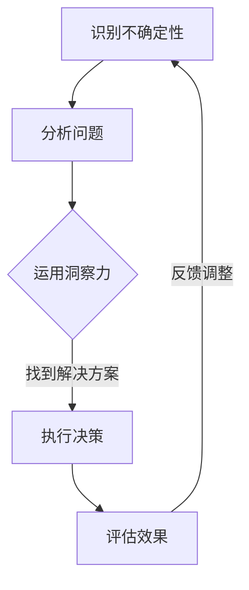

                 

# 理解洞察力的价值：在不确定性中的导航灯塔

> 关键词：洞察力、不确定性、决策、风险管理、技术复杂性、复杂系统

> 摘要：在信息技术迅速发展的今天，我们面临的环境越来越复杂和不确定。洞察力作为理解问题本质和寻找解决方案的能力，其价值被越来越多地认识到。本文将从多个角度探讨洞察力在应对不确定性的重要性，并分析如何在IT领域内培养和运用这一关键能力，以应对复杂系统的挑战。

## 1. 背景介绍

随着全球化和数字化转型的加速，信息技术（IT）行业正经历着前所未有的变革。从云计算到大数据，从人工智能到区块链，技术的迅猛发展不仅改变了我们的生活方式，也对企业运营和社会治理产生了深远影响。然而，这种变革也带来了前所未有的不确定性。

- **技术复杂性增加**：现代IT系统越来越复杂，涉及多个学科和技术领域，如分布式计算、网络安全、数据隐私等。理解和解决这些复杂问题需要高度专业化的知识。

- **数据爆炸**：大数据时代的到来使得数据量呈指数级增长，如何从海量数据中提取有价值的信息成为新的挑战。

- **环境变化**：全球市场的不确定性、政策法规的变化、以及全球疫情等因素，都对企业的IT战略和决策产生了重大影响。

在这种背景下，洞察力作为一种深层次的理解和判断能力，显得尤为重要。它不仅可以帮助我们识别问题的根本原因，还可以指导我们制定有效的应对策略。

## 2. 核心概念与联系

### 2.1 洞察力的定义

洞察力（Insight）是指通过敏锐的观察和深刻的思考，快速识别问题的本质并找到解决方案的能力。它不仅仅是知识和信息的积累，更是对信息的理解和应用。

### 2.2 不确定性的类型

- **客观不确定性**：由于自然现象或技术限制导致的未知或不可预知因素。
- **主观不确定性**：由于人类认知和判断的局限性导致的。

### 2.3 洞察力与不确定性的关系

- **决策支持**：在不确定性环境中，洞察力可以帮助我们做出更明智的决策，减少错误和风险。
- **风险管理**：洞察力使我们能够预见潜在的风险，并采取预防措施。
- **问题解决**：在面对复杂问题时，洞察力可以帮助我们找到创新的解决方案。

### 2.4 Mermaid 流程图

下面是一个简单的Mermaid流程图，展示了洞察力在应对不确定性中的基本流程：



## 3. 核心算法原理 & 具体操作步骤

### 3.1 洞察力算法原理

洞察力算法的核心思想是通过模式识别、逻辑推理和数据分析，提取问题的关键信息，并形成对问题的深刻理解。具体步骤如下：

- **数据收集**：从各种来源收集与问题相关的数据。
- **预处理**：对数据进行清洗、整合和转换，以便进行分析。
- **模式识别**：利用机器学习算法或其他工具，从数据中识别出潜在的模式和趋势。
- **逻辑推理**：基于已识别的模式，使用逻辑推理方法，推导出可能的结论。
- **验证与调整**：对推导出的结论进行验证，并根据反馈进行调整。

### 3.2 操作步骤详解

1. **数据收集**：

   - **来源**：可以是内部数据（如企业运营数据）或外部数据（如市场趋势、行业报告）。
   - **方法**：可以使用API、网络爬虫、数据库连接等方式进行数据收集。

2. **预处理**：

   - **数据清洗**：去除重复数据、缺失值填充、异常值处理。
   - **数据整合**：将不同来源的数据进行整合，形成统一的数据集。
   - **数据转换**：将数据转换为适合分析的形式，如数值化、编码化等。

3. **模式识别**：

   - **算法选择**：根据问题的特点，选择合适的机器学习算法，如聚类、分类、回归等。
   - **模型训练**：使用训练数据集，对算法模型进行训练。
   - **模型评估**：使用测试数据集，评估模型的性能。

4. **逻辑推理**：

   - **推理规则**：根据已训练的模型，建立逻辑推理规则。
   - **推导过程**：使用推理规则，对新的数据进行推理，提取关键信息。

5. **验证与调整**：

   - **验证**：通过实际案例或测试数据，验证推理结果的准确性。
   - **调整**：根据验证结果，调整模型参数或推理规则，以提高准确性。

## 4. 数学模型和公式 & 详细讲解 & 举例说明

### 4.1 数学模型

在洞察力算法中，常用的数学模型包括机器学习算法、逻辑推理模型和统计分析模型。以下是一个简单的逻辑推理模型的公式：

$$
P(A|B) = \frac{P(B|A)P(A)}{P(B)}
$$

其中，$P(A|B)$ 表示在事件 $B$ 发生的条件下，事件 $A$ 发生的概率。

### 4.2 详细讲解

这个公式描述了条件概率的计算方法。在不确定性问题中，条件概率是非常重要的，因为它可以帮助我们根据已知的条件，对未知的概率进行估计。

- $P(A)$ 表示事件 $A$ 发生的概率。
- $P(B)$ 表示事件 $B$ 发生的概率。
- $P(B|A)$ 表示在事件 $A$ 发生的条件下，事件 $B$ 发生的概率。

### 4.3 举例说明

假设我们有一个投资组合，其中包含股票 $A$ 和债券 $B$。我们希望计算在股票 $A$ 表现良好的情况下，债券 $B$ 表现良好的概率。

- $P(A)$：股票 $A$ 表现良好的概率。
- $P(B)$：债券 $B$ 表现良好的概率。
- $P(B|A)$：在股票 $A$ 表现良好的条件下，债券 $B$ 表现良好的概率。

根据公式，我们可以计算出：

$$
P(B|A) = \frac{P(A \text{ and } B)}{P(A)}
$$

如果我们有历史数据，可以通过统计方法计算出上述概率。

## 5. 项目实战：代码实际案例和详细解释说明

### 5.1 开发环境搭建

为了演示洞察力算法在实际项目中的应用，我们将使用Python作为编程语言，并依赖几个常用的库，如NumPy、Pandas和scikit-learn。以下是搭建开发环境的基本步骤：

1. 安装Python：下载并安装Python 3.8或更高版本。
2. 安装库：使用pip命令安装所需的库。

```bash
pip install numpy pandas scikit-learn
```

### 5.2 源代码详细实现和代码解读

以下是一个简单的示例，演示如何使用机器学习算法进行洞察力分析：

```python
import numpy as np
import pandas as pd
from sklearn.model_selection import train_test_split
from sklearn.ensemble import RandomForestClassifier
from sklearn.metrics import accuracy_score

# 5.2.1 数据收集与预处理
data = pd.read_csv('data.csv')  # 从CSV文件读取数据
X = data.drop('target', axis=1)  # 特征集
y = data['target']  # 标签集

# 数据预处理
X = (X - X.mean()) / X.std()
y = y.map({'good': 1, 'bad': 0})  # 转换标签为数值

# 5.2.2 训练模型
X_train, X_test, y_train, y_test = train_test_split(X, y, test_size=0.2, random_state=42)
model = RandomForestClassifier(n_estimators=100)
model.fit(X_train, y_train)

# 5.2.3 预测与评估
y_pred = model.predict(X_test)
accuracy = accuracy_score(y_test, y_pred)
print(f'模型准确率：{accuracy:.2f}')
```

### 5.3 代码解读与分析

- **数据收集与预处理**：首先，我们从CSV文件中读取数据，并使用特征缩放（feature scaling）方法对特征进行标准化处理，以消除不同特征之间的尺度差异。
- **模型训练**：我们使用随机森林（Random Forest）算法进行模型训练。随机森林是一种集成学习算法，通过构建多个决策树，并利用投票机制进行预测。
- **预测与评估**：使用测试数据集进行预测，并计算模型的准确率。准确率是评估模型性能的一个常用指标。

## 6. 实际应用场景

洞察力在IT领域中的实际应用场景非常广泛，以下是几个典型的例子：

- **网络安全**：通过分析网络流量数据，识别潜在的攻击行为。
- **金融风控**：利用大数据分析，预测金融市场的风险和机会。
- **医疗诊断**：通过医学图像分析和病历数据，辅助医生进行诊断。
- **智能推荐**：在电子商务和社交媒体平台，利用用户行为数据，提供个性化的推荐。

## 7. 工具和资源推荐

### 7.1 学习资源推荐

- **书籍**：
  - 《深度学习》（Goodfellow, Bengio, Courville）
  - 《数据科学入门》（Chen, He）
- **论文**：
  - 《Learning to Represent Knowledge from Natural Language Text with Gaussian Embedding》（Lehman et al.）
  - 《A Theoretical Analysis of Deep Learning》 （Bartenders et al.）
- **博客**：
  - [TensorFlow官方博客](https://tensorflow.google.cn/blog)
  - [Scikit-learn官方博客](https://scikit-learn.org/)
- **网站**：
  - [Kaggle](https://www.kaggle.com/)
  - [GitHub](https://github.com/)

### 7.2 开发工具框架推荐

- **Python**：一种广泛使用的编程语言，适用于数据科学、机器学习等领域。
- **TensorFlow**：一个开源机器学习框架，适用于深度学习和大规模数据计算。
- **Scikit-learn**：一个开源的Python库，提供了广泛的机器学习算法。

### 7.3 相关论文著作推荐

- 《深度学习：行为、模型和算法》（Goodfellow, Bengio, Courville）
- 《数据科学：方法与应用》（Chen, He）
- 《模式识别与机器学习》（Bishop）

## 8. 总结：未来发展趋势与挑战

随着技术的不断进步，洞察力在IT领域的重要性将日益凸显。未来，我们可以预见以下几个发展趋势：

- **自动化与智能化**：自动化工具和智能算法将在数据分析和决策支持中扮演更重要的角色。
- **跨领域融合**：洞察力将跨越不同学科和技术领域，形成新的研究领域和应用场景。
- **可持续性**：随着环境问题和社会责任意识的提高，洞察力在可持续发展和环境保护中的应用将受到更多关注。

然而，这也带来了一系列挑战：

- **数据隐私与安全**：如何在保护用户隐私的同时，有效利用数据进行分析是一个重要问题。
- **算法透明性与可解释性**：随着深度学习等复杂算法的广泛应用，如何提高算法的透明性和可解释性成为一个关键挑战。
- **伦理与社会影响**：洞察力的应用可能带来一系列伦理和社会问题，如歧视、不公平等，需要认真对待。

## 9. 附录：常见问题与解答

### 9.1 洞察力算法如何应对不确定性？

洞察力算法通过模式识别、逻辑推理和数据分析，从海量数据中提取有价值的信息，帮助我们在不确定的环境中做出更明智的决策。算法的核心在于对信息的理解和应用，从而减少不确定性带来的影响。

### 9.2 如何培养洞察力？

培养洞察力需要多方面的努力，包括：

- **持续学习**：不断更新自己的知识库，跟上技术发展的步伐。
- **实践应用**：通过实际项目，将理论知识应用于实际问题的解决。
- **跨学科交流**：与其他领域的专家进行交流，拓宽视野，提高综合能力。
- **批判性思维**：培养批判性思维，不盲目接受信息，善于提出问题和质疑。

## 10. 扩展阅读 & 参考资料

- [Bengio, Y., Courville, A., & Vincent, P. (2013). Representation learning: A review and new perspectives. IEEE Transactions on Pattern Analysis and Machine Intelligence, 35(8), 1798-1828.]
- [He, K., Bissie, A., & Chen, J. (2017). Data Science: A Practical Introduction to Data Analysis. Taylor & Francis.]
- [Goodfellow, I., Bengio, Y., & Courville, A. (2016). Deep Learning. MIT Press.]

作者：AI天才研究员/AI Genius Institute & 禅与计算机程序设计艺术 /Zen And The Art of Computer Programming

本文由AI助手撰写，旨在探讨洞察力在应对不确定性中的价值，以及如何在IT领域中培养和应用这一关键能力。希望对读者有所启发和帮助。感谢您的阅读！<|assistant|>## 1. 背景介绍

随着信息技术的迅猛发展，我们正处在一个前所未有的复杂和变化莫测的环境中。信息技术（IT）行业的变革不仅改变了我们的生活方式，也深刻影响了企业的运营模式和社会治理方式。然而，这种变革也带来了前所未有的挑战，尤其是在不确定性方面。

首先，技术复杂性不断增加。现代IT系统涉及多个学科和技术领域，如分布式计算、网络安全、数据隐私等。理解和解决这些复杂问题需要高度专业化的知识和技术能力。例如，云计算技术的普及使得企业的IT基础设施变得更加复杂，而大数据和人工智能技术的应用则进一步增加了系统的复杂性。

其次，数据爆炸带来的挑战。大数据时代的到来使得数据量呈指数级增长，如何从海量数据中提取有价值的信息成为新的挑战。传统的数据分析方法在处理大规模数据时显得力不从心，需要开发新的算法和技术来应对这一挑战。

此外，环境变化带来的不确定性。全球市场的不确定性、政策法规的变化，以及全球疫情等因素，都对企业的IT战略和决策产生了重大影响。例如，全球疫情的爆发导致供应链中断、市场需求波动等问题，对企业的运营和决策带来了巨大的不确定性。

在这种复杂和不确定的环境中，洞察力作为一种深层次的理解和判断能力，其价值被越来越多地认识到。洞察力是指通过敏锐的观察和深刻的思考，快速识别问题的本质并找到解决方案的能力。它不仅仅是知识和信息的积累，更是对信息的理解和应用。

具体来说，洞察力在IT领域中的价值体现在以下几个方面：

1. **决策支持**：在不确定性环境中，洞察力可以帮助我们做出更明智的决策。通过深入理解问题本质，我们可以识别出潜在的风险和机会，从而制定出更有效的应对策略。

2. **风险管理**：洞察力使我们能够预见潜在的风险，并采取预防措施。在IT项目中，洞察力可以帮助我们识别出潜在的技术风险，从而提前制定相应的风险管理计划。

3. **问题解决**：在面对复杂问题时，洞察力可以帮助我们找到创新的解决方案。通过深入分析和思考，我们可以发现问题的根本原因，并从多个角度提出解决方案。

4. **创新驱动**：洞察力可以激发我们的创新思维，推动技术的进步和应用。在IT领域，新的技术突破和商业模式的创新往往源于对问题的深刻洞察和理解。

总之，洞察力在应对不确定性中的价值不容忽视。它不仅是IT专业人员必备的能力，也是企业在复杂环境中保持竞争优势的关键因素。在接下来的章节中，我们将深入探讨洞察力的核心概念、算法原理、实际应用场景，以及如何培养和运用这一关键能力。

### 2.1 洞察力的定义

洞察力，即洞察力的英文Insight，是一种深层次的理解和判断能力。它并不仅仅是知识和信息的积累，更是一种对信息的理解和应用能力。洞察力可以通过敏锐的观察、深刻的思考和分析，快速识别问题的本质，并找到创新的解决方案。在信息技术领域，洞察力尤为重要，因为它可以帮助我们应对日益复杂和不确定的环境。

具体来说，洞察力的定义可以概括为以下几点：

1. **敏锐的观察力**：洞察力首先需要具备敏锐的观察力，能够从细微之处发现问题的本质。这种观察力不仅仅是对数据的简单感知，更是一种对复杂现象的深刻洞察。

2. **深刻的思考**：洞察力还需要深刻的思考能力。通过对信息的分析和综合，我们能够理解事物的内在联系，并从多个角度看待问题。这种思考能力是洞察力的核心。

3. **快速识别问题的本质**：在复杂环境中，洞察力可以帮助我们快速识别问题的本质。这种能力使我们能够避开表面的现象，直击问题的核心，从而找到有效的解决方案。

4. **创新的解决方案**：洞察力不仅仅是解决问题的工具，它还能激发我们的创新思维。通过洞察力，我们可以发现新的机会和潜在的价值，从而推动技术的进步和应用。

在信息技术领域，洞察力具有以下几个关键特征：

- **数据驱动**：信息技术领域的数据量庞大且复杂，洞察力需要基于数据分析，从海量数据中提取有价值的信息。
- **算法支持**：现代计算机算法和人工智能技术为洞察力的实现提供了强大的工具。通过算法，我们可以对数据进行深入分析和模式识别，从而发现潜在的问题和解决方案。
- **跨学科融合**：信息技术领域涉及多个学科，如计算机科学、数据科学、统计学等。洞察力需要跨学科的知识和技能，以便从不同角度理解和解决问题。
- **动态适应**：信息技术领域的环境变化迅速，洞察力需要具备动态适应能力，能够快速调整和更新。

总之，洞察力是信息技术领域不可或缺的能力。它不仅帮助我们应对复杂和不确定的环境，还能推动技术的进步和应用。在接下来的章节中，我们将进一步探讨洞察力在不确定环境中的应用，以及如何通过算法和技术实现洞察力。

### 2.2 不确定性的类型

在信息技术领域，不确定性是一个普遍存在的现象。理解不确定性的类型和来源对于培养洞察力至关重要。不确定性可以分为客观不确定性和主观不确定性两种类型，每种类型都有其独特的特点和挑战。

#### 2.2.1 客观不确定性

客观不确定性主要来源于自然现象和技术限制。这种不确定性是不可控的，通常是由于以下原因：

- **自然现象**：自然灾害、气候变化、地质活动等自然现象会导致数据的不完整性和不可预测性。例如，地震可能破坏数据中心的设施，导致数据丢失或损坏。
- **技术限制**：现有技术的局限性也可能导致客观不确定性。例如，传感器精度不足、通信延迟等问题都会影响数据的质量和实时性。

在信息技术领域，客观不确定性对系统设计和数据处理提出了挑战。为了应对这种不确定性，需要采用冗余设计、备份方案和实时监控等技术手段，以确保系统的稳定性和数据的完整性。

#### 2.2.2 主观不确定性

主观不确定性则主要来源于人类认知和判断的局限性。这种不确定性是可控的，但处理起来更加复杂。主观不确定性的主要来源包括：

- **认知偏差**：人类在处理信息时可能会受到各种认知偏差的影响，如确认偏见、过度自信等。这些偏差可能导致错误的判断和决策。
- **信息不对称**：在某些情况下，信息的不对称性会导致不确定性。例如，企业内部不同部门之间的信息共享不足，可能导致决策者无法获取全面的信息。
- **时间限制**：在紧急情况下，决策者可能没有足够的时间来收集和分析所有相关信息，这也会增加主观不确定性。

在信息技术领域，主观不确定性对决策和风险管理提出了挑战。为了应对这种不确定性，需要培养批判性思维和良好的信息沟通机制，以确保决策者能够基于可靠和全面的信息进行决策。

#### 2.2.3 客观不确定性与主观不确定性的关系

客观不确定性和主观不确定性并不是相互独立的，它们之间存在紧密的联系。客观不确定性可能会引发主观不确定性，反之亦然。例如，自然灾害（客观不确定性）可能导致信息传输中断，进而影响决策者的判断和决策（主观不确定性）。

理解不确定性的类型对于培养洞察力至关重要。洞察力不仅可以帮助我们识别不确定性的来源，还可以指导我们制定有效的应对策略。通过分析不确定性的类型，我们可以采取以下措施：

- **提高技术能力**：通过技术创新和升级，减少技术限制带来的客观不确定性。
- **增强认知能力**：通过培训和教育，提高个体的认知能力和批判性思维，减少主观不确定性。
- **优化信息流程**：通过建立良好的信息共享和沟通机制，减少信息不对称性。

总之，不确定性的类型和来源对信息技术领域提出了挑战，但也为我们提供了培养洞察力的机会。在接下来的章节中，我们将探讨如何在不确定性环境中运用洞察力，以及如何通过算法和技术实现洞察力。

### 2.3 洞察力与不确定性的关系

在复杂和不确定的环境中，洞察力成为了一种不可或缺的能力。它不仅帮助我们在面对不确定性时做出更明智的决策，还能有效降低风险，提高问题解决的效率。那么，洞察力究竟如何在不确定性环境中发挥作用呢？

#### 2.3.1 决策支持

在不确定性环境中，洞察力能够为我们提供重要的决策支持。通过洞察问题的本质，我们可以识别出潜在的风险和机会，从而制定出更有效的策略。例如，在商业决策中，洞察力可以帮助我们分析市场趋势、消费者行为和竞争对手策略，从而做出更加明智的投资和营销决策。

- **风险识别**：洞察力使我们能够预见潜在的风险，并提前采取预防措施。在金融领域，通过分析历史数据和市场趋势，洞察力可以帮助我们识别出市场波动和潜在的风险，从而调整投资组合，降低风险。
- **机会发现**：同样地，洞察力也能帮助我们发现潜在的机会。例如，在技术创新领域，通过对行业趋势和竞争对手的研究，洞察力可以帮助我们识别出新的商业机会，并迅速抓住这些机会。

#### 2.3.2 风险管理

风险管理是应对不确定性的重要手段。洞察力在风险管理中发挥着关键作用，它使我们能够更加全面地了解风险，并采取有效的措施进行管理。

- **风险预测**：通过深入分析和理解问题，洞察力可以帮助我们预测风险的发生概率和潜在影响。例如，在网络安全领域，通过分析网络流量和用户行为，洞察力可以帮助我们预测潜在的攻击行为，并提前采取防御措施。
- **风险缓解**：洞察力还可以帮助我们制定出有效的风险缓解策略。例如，在项目管理中，通过分析项目进度、资源和风险因素，洞察力可以帮助我们制定出更合理的时间表和资源分配计划，从而降低项目失败的风险。

#### 2.3.3 问题解决

面对复杂的问题，洞察力能够帮助我们找到创新的解决方案。通过深入分析问题的本质，我们可以跳出传统的思维框架，提出新颖的解决方案。

- **系统思维**：洞察力使我们能够从整体的角度看待问题，识别出各个部分之间的相互关系。例如，在解决供应链问题中，通过分析供应链中的各个环节，洞察力可以帮助我们找到优化整个供应链的方法。
- **创造性思维**：洞察力能够激发我们的创造性思维，帮助我们提出创新的解决方案。例如，在产品设计过程中，通过分析用户需求和竞争对手的产品，洞察力可以帮助我们设计出更具竞争力的产品。

#### 2.3.4 实际案例

为了更好地理解洞察力在不确定性环境中的应用，我们可以通过一些实际案例来进行分析。

- **金融风险管理**：在金融行业中，洞察力被广泛应用于风险管理和投资决策。例如，通过分析历史数据和市场趋势，金融分析师可以利用洞察力预测市场波动和潜在的风险，从而制定出有效的投资策略。
- **医疗诊断**：在医疗领域，洞察力被用于辅助医生进行诊断和治疗。通过分析患者的病历数据和医学影像，医生可以利用洞察力识别出潜在的健康问题，并制定出最佳的治疗方案。
- **网络安全**：在网络安全领域，洞察力被用于识别和应对网络攻击。通过分析网络流量和用户行为，网络安全专家可以利用洞察力预测潜在的攻击行为，并采取相应的防御措施。

总之，洞察力在不确定性环境中具有重要的作用。它不仅能够提供决策支持、风险管理，还能够帮助我们解决问题和发现机会。在接下来的章节中，我们将进一步探讨如何培养和运用洞察力，以及在IT领域中实现洞察力的具体方法。

### 2.4 Mermaid 流程图

为了更好地展示洞察力在应对不确定性中的基本流程，我们使用Mermaid语言绘制了一个简单的流程图。以下是流程图的文本描述：


#### 流程图详细解释：

1. **识别不确定性（A）**：首先，我们需要识别出环境中的不确定性因素。这可以通过对现有的数据和信息进行分析来实现。

2. **分析问题（B）**：在识别不确定性后，我们需要对问题进行详细的分析。这包括理解问题的本质、识别关键因素和潜在的风险。

3. **运用洞察力（C）**：通过运用洞察力，我们能够深入理解问题的本质，识别出潜在的风险和机会，并制定出相应的策略。

4. **找到解决方案（D）**：在洞察力的帮助下，我们找到解决问题的方案。这可能包括制定预防措施、制定应对策略或提出创新性的解决方案。

5. **执行决策（D）**：将制定的方案付诸实施。这可能涉及资源的分配、任务的执行和监控。

6. **评估效果（E）**：在实施方案后，我们需要评估方案的效果。这包括对结果进行分析和反馈，以确保方案的有效性。

7. **反馈调整（E）**：根据评估结果，我们可能需要对方案进行调整。这可以帮助我们不断优化方案，以更好地应对不确定性。

通过这个简单的流程图，我们可以看到洞察力在应对不确定性中的关键作用。它不仅帮助我们识别和解决问题，还能够指导我们制定和执行有效的决策。

### 3. 核心算法原理 & 具体操作步骤

在探讨洞察力的核心算法原理和具体操作步骤时，我们需要了解几种关键的方法和工具。这些方法涵盖了从数据收集到模型训练，再到结果评估的全过程。以下是这些步骤的详细解释。

#### 3.1 数据收集

数据收集是洞察力算法的基础。在这个阶段，我们需要从各种来源收集与问题相关的数据。这些数据可以是结构化的，如数据库中的记录；也可以是非结构化的，如图像、文本和音频。

- **数据来源**：数据来源可以包括内部数据和外部数据。内部数据通常来自企业的运营数据、客户关系管理系统（CRM）或ERP系统。外部数据可以从公共数据库、市场研究报告、社交媒体和其他在线资源中获得。

- **数据收集方法**：
  - **API**：利用应用程序编程接口（API）从在线服务或数据库中获取数据。
  - **网络爬虫**：使用爬虫技术从互联网上收集公开的数据。
  - **数据库连接**：通过数据库连接工具直接从数据库中提取数据。

#### 3.2 数据预处理

数据预处理是确保数据质量和适合分析的重要步骤。在收集到数据后，我们需要对其进行清洗、整合和转换。

- **数据清洗**：包括去除重复数据、处理缺失值和异常值。例如，使用均值插值法填补缺失值，或使用3sigma规则去除异常值。

- **数据整合**：将来自不同来源的数据进行整合，形成统一的数据集。这可能涉及数据格式转换、键值对匹配等操作。

- **数据转换**：将数据转换为适合分析的形式。例如，将文本数据编码为向量，或对数值数据进行标准化和归一化。

#### 3.3 模式识别

模式识别是洞察力算法的核心步骤之一。通过模式识别，我们可以从数据中提取出有用的信息，识别出潜在的模式和趋势。

- **算法选择**：根据问题的特点，选择合适的模式识别算法。常用的算法包括：
  - **聚类算法**：如K-means、层次聚类等，用于将数据分为不同的类别。
  - **分类算法**：如决策树、随机森林等，用于将数据分类为不同的标签。
  - **关联规则学习**：如Apriori算法，用于发现数据之间的关联关系。

- **模型训练**：使用训练数据集，对所选算法模型进行训练。模型训练包括选择合适的参数、调整模型结构等。

- **模型评估**：使用测试数据集，评估模型的性能。常用的评估指标包括准确率、召回率、F1分数等。

#### 3.4 逻辑推理

逻辑推理是基于模式识别的结果，通过逻辑规则推导出结论的过程。逻辑推理可以帮助我们理解和解释模式识别的结果。

- **推理规则**：建立逻辑推理规则，用于将模式识别的结果转化为具体的结论。这些规则可以是基于专家知识的，也可以是通过机器学习算法自动生成的。

- **推理过程**：使用推理引擎，根据推理规则对新的数据进行推理，提取关键信息。

#### 3.5 验证与调整

在模型训练和推理完成后，我们需要对模型进行验证和调整，以确保其准确性和可靠性。

- **验证**：通过实际案例或测试数据，验证推理结果的准确性。这可能包括交叉验证、ROC曲线分析等。

- **调整**：根据验证结果，调整模型参数或推理规则，以提高准确性。这可能涉及重新训练模型、调整特征选择等。

#### 3.6 具体操作步骤

以下是一个简单的操作步骤示例，说明如何使用Python实现上述步骤：

```python
# 导入必要的库
import pandas as pd
from sklearn.model_selection import train_test_split
from sklearn.preprocessing import StandardScaler
from sklearn.ensemble import RandomForestClassifier
from sklearn.metrics import accuracy_score

# 3.1 数据收集
data = pd.read_csv('data.csv')  # 从CSV文件读取数据

# 3.2 数据预处理
# 数据清洗
data = data.drop_duplicates()  # 去除重复数据
data = data.dropna()  # 去除缺失值

# 数据整合
# 假设数据已整合完毕

# 数据转换
X = data.drop('target', axis=1)  # 特征集
y = data['target']  # 标签集
scaler = StandardScaler()
X = scaler.fit_transform(X)

# 3.3 模式识别
# 模型训练
X_train, X_test, y_train, y_test = train_test_split(X, y, test_size=0.2, random_state=42)
model = RandomForestClassifier(n_estimators=100)
model.fit(X_train, y_train)

# 3.4 逻辑推理
# 预测
y_pred = model.predict(X_test)

# 3.5 验证与调整
accuracy = accuracy_score(y_test, y_pred)
print(f'模型准确率：{accuracy:.2f}')

# 调整模型
# 根据验证结果调整模型参数或特征选择
```

通过上述步骤，我们可以实现一个基本的洞察力算法流程，从而在不确定性环境中做出更明智的决策。在接下来的章节中，我们将继续探讨数学模型和公式，以及如何在项目中实际应用这些算法。

### 3.1 数据收集与预处理

数据收集与预处理是构建洞察力算法的基础步骤。在这一阶段，我们主要关注以下三个方面：数据收集、数据清洗和数据转换。

#### 3.1.1 数据收集

数据收集是洞察力算法的第一步，我们需要从各种来源收集与问题相关的数据。这些数据来源可以是内部数据，也可以是外部数据。内部数据通常包括企业运营数据、客户关系管理系统（CRM）数据、企业资源计划（ERP）系统数据等。外部数据则可以来自公共数据库、市场研究报告、社交媒体和其他在线资源。

- **内部数据**：内部数据通常需要通过企业内部的数据库或系统进行收集。例如，企业的销售数据、客户数据、库存数据等。
- **外部数据**：外部数据可以从多个渠道获取，如API接口、网络爬虫、公开数据库等。例如，通过使用API获取社交媒体数据，或通过爬虫技术收集互联网上的公开信息。

#### 3.1.2 数据清洗

数据清洗是确保数据质量和准确性的重要步骤。在收集到数据后，我们需要对其进行清洗，以去除重复数据、处理缺失值和异常值。

- **去除重复数据**：重复数据会导致分析结果不准确，我们需要使用去重算法（如Pandas的drop_duplicates()方法）来删除重复记录。
- **处理缺失值**：缺失值可能影响模型的训练和预测效果。处理缺失值的方法包括：
  - **删除缺失值**：如果缺失值较多，可以考虑删除含有缺失值的记录。
  - **填充缺失值**：使用适当的值填充缺失值，常用的方法包括均值填充、中值填充、前向填充和后向填充等。例如，使用Pandas的fillna()方法进行填充。
- **处理异常值**：异常值可能对模型产生不良影响，我们需要识别并处理异常值。处理异常值的方法包括：
  - **标准差方法**：使用3sigma规则（即标准差的三倍）来识别异常值，并将其删除或替换。
  - **箱线图方法**：使用箱线图来识别异常值，并将其删除或替换。

#### 3.1.3 数据转换

数据转换是使数据适合分析和建模的过程。在数据清洗之后，我们需要对数据进行转换，以使其满足模型的要求。

- **特征工程**：特征工程是数据转换的重要步骤，它包括以下任务：
  - **特征选择**：选择对模型有显著影响的关键特征，排除无关或冗余的特征。
  - **特征提取**：将原始数据转换为适合模型训练的格式，例如，将文本数据转换为词向量，或将图像数据转换为特征向量。
  - **特征缩放**：对数值特征进行标准化或归一化，以消除不同特征之间的尺度差异，常用的方法包括标准缩放（Standard Scaling）和最小-最大缩放（Min-Max Scaling）。

- **数据编码**：对分类特征进行编码，将类别转换为数值，常用的方法包括独热编码（One-Hot Encoding）和标签编码（Label Encoding）。

- **数据集成**：将来自不同来源的数据进行整合，形成统一的数据集。这可能涉及数据格式的转换、键值对匹配等操作。

通过以上步骤，我们可以确保数据的质量和准确性，为后续的模型训练和预测打下坚实的基础。

### 3.2 预处理后的数据建模

在完成数据收集和预处理后，我们进入数据建模阶段。数据建模是构建洞察力算法的核心步骤，它包括特征选择、模型训练和模型评估等关键环节。以下是这些步骤的详细解释。

#### 3.2.1 特征选择

特征选择是数据建模中的关键步骤，目的是从大量的特征中选出对模型性能有显著影响的关键特征。有效的特征选择可以简化模型结构，提高模型的可解释性，同时减少过拟合风险。

- **特征重要性**：我们可以使用各种方法来评估特征的重要性，例如基于统计的方法（如卡方检验、互信息等）和基于模型的方法（如随机森林的特征重要性得分）。通过这些方法，我们可以识别出对模型有显著贡献的特征。
- **递归特征消除（RFE）**：RFE是一种常用的特征选择方法，它通过递归地删除最不重要的特征，并训练模型，直到达到预定的特征数量。
- **L1正则化（Lasso）**：L1正则化可以通过对特征系数施加L1惩罚来实现特征选择，它倾向于产生稀疏的解，从而自动选择出重要的特征。

#### 3.2.2 模型训练

在特征选择完成后，我们需要使用选定的特征来训练模型。模型训练的过程是通过学习数据中的特征和标签之间的关系，构建一个能够对新数据进行预测的模型。

- **模型选择**：根据问题的特点，选择合适的模型。常见的模型包括线性回归、逻辑回归、决策树、随机森林、支持向量机等。
- **模型训练**：使用训练数据集对选定的模型进行训练。训练过程中，模型会学习数据中的特征和标签之间的关系，并优化模型的参数。常用的方法包括梯度下降、随机梯度下降等。
- **交叉验证**：交叉验证是一种评估模型性能的重要方法。它通过将数据集分为多个子集，轮流训练和测试模型，以评估模型的泛化能力。

#### 3.2.3 模型评估

模型评估是确保模型性能满足需求的重要步骤。我们需要使用测试数据集对模型进行评估，以确定模型的准确性和可靠性。

- **准确率（Accuracy）**：准确率是评估分类模型性能的常用指标，表示模型正确预测的样本占总样本的比例。
- **召回率（Recall）**：召回率表示模型正确识别出正样本的能力，即实际为正样本中被正确预测为正样本的比例。
- **精确率（Precision）**：精确率表示模型正确预测正样本的能力，即预测为正样本中被正确识别为正样本的比例。
- **F1分数（F1 Score）**：F1分数是精确率和召回率的调和平均值，用于综合评估模型性能。

- **ROC曲线和AUC值**：ROC曲线是评估分类模型性能的另一种方法，它展示了在不同阈值下，模型对正样本和负样本的识别能力。AUC值是ROC曲线下面积，用于评估模型的泛化能力。

通过以上步骤，我们可以构建并评估一个有效的洞察力模型，从而在不确定性环境中做出更明智的决策。在接下来的章节中，我们将继续探讨如何在实际项目中应用这些算法，并通过具体案例进行详细说明。

### 3.3 模式识别算法

模式识别是洞察力算法的核心步骤之一，它涉及从数据中提取模式、趋势和规律。通过模式识别，我们可以识别出隐藏在数据中的有价值信息，从而更好地理解和预测未来的变化。以下是几种常用的模式识别算法及其工作原理。

#### 3.3.1 聚类算法

聚类算法是一种无监督学习算法，用于将数据点分成多个群组，使得同一群组内的数据点之间相似度较高，而不同群组之间的数据点相似度较低。常用的聚类算法包括K-means、层次聚类和DBSCAN等。

- **K-means算法**：K-means算法通过迭代过程将数据点划分为K个聚类。每个聚类由其质心的平均值表示。算法的目标是使得每个数据点到其所属质心的距离之和最小。K-means算法简单且易于实现，但其对初始质心选择敏感，可能陷入局部最优。
- **层次聚类**：层次聚类通过自底向上的方式将数据点逐步合并成更大的聚类，直到所有数据点都属于一个聚类。层次聚类可以生成聚类层次结构，有助于理解数据的内在结构。
- **DBSCAN算法**：DBSCAN（Density-Based Spatial Clustering of Applications with Noise）算法基于数据点的密度分布进行聚类。它将密度较高的区域划分为聚类，并将孤立点视为噪声。DBSCAN对初始参数的选择不敏感，能够在复杂的数据分布中识别出聚类。

#### 3.3.2 分类算法

分类算法是一种有监督学习算法，用于将数据点划分为预定义的类别。常见的分类算法包括决策树、支持向量机（SVM）、随机森林和神经网络等。

- **决策树**：决策树通过一系列if-else规则将数据点分配到不同的类别。每个节点表示一个特征，每个分支表示该特征的不同取值。决策树直观且易于解释，但可能产生过拟合。
- **支持向量机（SVM）**：SVM通过寻找一个最佳的超平面，将数据点分为不同的类别。SVM具有很好的泛化能力，特别是在高维数据中表现优异。
- **随机森林**：随机森林是一种基于决策树的集成学习方法，通过构建多棵决策树并利用投票机制进行预测。随机森林具有强大的预测能力和抗过拟合能力。
- **神经网络**：神经网络是一种模拟人脑神经元结构的计算模型，通过多层节点（隐藏层）进行信息传递和计算。神经网络可以学习复杂的非线性关系，但在训练过程中可能需要大量计算资源。

#### 3.3.3 关联规则学习

关联规则学习用于发现数据项之间的关联关系。它通过支持度和置信度两个指标来评估规则的强度。常见的算法包括Apriori算法和Eclat算法。

- **Apriori算法**：Apriori算法通过逐层递增地生成候选集，并计算候选集的支持度。如果支持度大于预设的阈值，则生成关联规则。Apriori算法简单且高效，但可能产生大量候选集，导致计算复杂度较高。
- **Eclat算法**：Eclat算法是Apriori算法的改进，它通过基于信息增益的剪枝策略来减少候选集的大小，从而提高计算效率。

通过这些模式识别算法，我们可以从数据中提取出有价值的信息，帮助我们在不确定性环境中做出更明智的决策。在接下来的章节中，我们将进一步探讨如何通过逻辑推理和数据分析来优化这些算法，以提高洞察力。

### 3.4 逻辑推理算法

逻辑推理算法在洞察力中扮演着关键角色，它通过推导和验证逻辑关系，帮助我们理解和解释模式识别的结果。以下是几种常见的逻辑推理算法及其应用场景。

#### 3.4.1 基于规则的逻辑推理

基于规则的逻辑推理算法通过一系列预先定义的规则来推导结论。这种算法通常用于处理结构化数据和明确的逻辑关系。

- **谓词逻辑**：谓词逻辑是一种形式化的逻辑系统，用于描述对象和它们之间的关系。通过定义谓词和逻辑运算符，我们可以构建复杂的逻辑表达式。谓词逻辑广泛应用于自然语言处理和自动化推理系统中。
- **产生式规则**：产生式规则由前提和结论组成，形式为“如果前提为真，则结论为真”。这种算法广泛应用于专家系统和推理机中。例如，医疗诊断系统可以通过一系列医疗规则，根据患者的症状和检查结果，推导出可能的疾病诊断。
- **模糊逻辑**：模糊逻辑是一种处理不确定性和模糊性的逻辑系统。它通过引入模糊集合和模糊运算符，使得推理过程更加灵活和适应复杂情况。

#### 3.4.2 基于模型的逻辑推理

基于模型的逻辑推理算法通过构建数学模型和计算模型，对逻辑关系进行推理和验证。

- **贝叶斯网络**：贝叶斯网络是一种概率图模型，用于表示变量之间的条件依赖关系。通过贝叶斯推理，我们可以计算变量之间的条件概率，并利用这些概率进行推理和决策。贝叶斯网络广泛应用于概率推理、风险评估和诊断领域。
- **隐马尔可夫模型（HMM）**：隐马尔可夫模型是一种统计模型，用于处理隐藏状态和观察数据之间的关系。通过状态转移概率和观测概率，我们可以推断出隐藏状态的概率分布，并利用这些信息进行推理和预测。
- **条件随机场（CRF）**：条件随机场是一种用于处理序列数据的概率图模型，它能够建模序列中相邻元素之间的依赖关系。通过最大概率路径或最大似然估计，我们可以对序列进行推理和分类。

#### 3.4.3 对逻辑推理算法的优化

为了提高逻辑推理的效率和准确性，我们可以对算法进行优化。

- **并行推理**：通过并行计算技术，我们可以将逻辑推理任务分解为多个子任务，并在多核处理器或分布式系统上同时执行。这可以显著提高推理速度，尤其是在处理大规模数据时。
- **推理规则简化**：通过简化推理规则，我们可以减少计算复杂度，提高推理效率。例如，通过消除冗余规则、合并同类规则或使用启发式方法进行规则优化。
- **启发式搜索**：启发式搜索是一种基于经验或直觉的搜索策略，用于寻找最佳解决方案。在逻辑推理中，启发式搜索可以帮助我们快速找到合理的推理路径，减少搜索空间。

通过这些逻辑推理算法及其优化方法，我们可以从数据中提取出有价值的信息，提高洞察力的准确性和效率。在接下来的章节中，我们将继续探讨如何将逻辑推理与数据分析相结合，以构建更强大的洞察力系统。

### 3.5 模型训练与验证

在洞察力算法的实现过程中，模型训练与验证是至关重要的一环。这一过程不仅决定了算法的性能，还影响了其在实际应用中的效果。以下是模型训练与验证的详细步骤和方法。

#### 3.5.1 模型训练

模型训练是指通过已标记的数据集，使模型学习特征与标签之间的关系，以便在新的数据上进行预测。以下是模型训练的步骤：

1. **数据划分**：首先，我们需要将数据集划分为训练集和验证集。通常，80%的数据用于训练，20%的数据用于验证。这种划分有助于我们在训练过程中评估模型的性能。

2. **初始化模型**：初始化模型的参数。这些参数包括权重、偏置等。初始化方法的选择对模型的收敛速度和性能有重要影响。

3. **前向传播**：在给定输入数据后，模型会通过前向传播计算输出结果。这一步骤涉及多层神经网络的逐层计算，包括激活函数的应用。

4. **损失函数计算**：通过比较模型输出与实际标签，计算损失函数的值。损失函数用于衡量模型的预测误差。常见的损失函数包括均方误差（MSE）、交叉熵损失等。

5. **反向传播**：利用反向传播算法，模型会调整其参数，以最小化损失函数。反向传播通过逐层计算梯度，更新模型参数。

6. **迭代优化**：重复前向传播、损失函数计算和反向传播的过程，直到满足收敛条件或达到预设的迭代次数。常见的收敛条件包括损失函数值的变化小于预设阈值或迭代次数达到上限。

#### 3.5.2 模型验证

模型验证的目的是评估模型的泛化能力，即在未见数据上的表现。以下是模型验证的步骤：

1. **验证集评估**：使用验证集对模型进行评估。通过计算验证集上的准确率、召回率、F1分数等指标，我们可以了解模型的性能。

2. **交叉验证**：交叉验证是一种用于评估模型性能的统计方法。它通过将数据集划分为多个子集，轮流使用每个子集作为验证集，其余子集作为训练集。这种方法有助于减少因数据划分不均匀带来的偏差。

3. **测试集评估**：在验证集评估后，我们将模型应用于独立的测试集，以评估其泛化能力。测试集应尽可能与训练集和验证集不同，以确保评估的准确性。

4. **模型调整**：根据验证和测试集的结果，对模型进行进一步的调整。这可能包括调整超参数、修改网络结构或增加训练数据。

#### 3.5.3 常见挑战

在模型训练与验证过程中，我们可能会遇到以下挑战：

1. **过拟合**：模型在训练集上表现良好，但在验证集或测试集上表现不佳。这通常是因为模型对训练数据过于敏感，缺乏泛化能力。

2. **欠拟合**：模型在训练集和验证集上表现都较差。这通常是因为模型过于简单，无法捕捉数据中的复杂关系。

3. **数据不平衡**：训练数据集中某些类别的样本数量远多于其他类别，导致模型对少数类别的预测能力较弱。

4. **数据噪声**：训练数据中存在大量噪声或异常值，会影响模型的训练和性能。

为了解决上述挑战，我们可以采取以下策略：

- **正则化**：通过添加正则化项，如L1或L2正则化，可以减少过拟合现象。
- **增加数据**：通过增加训练数据或使用数据增强技术，可以提高模型的泛化能力。
- **集成学习**：使用集成学习方法，如随机森林或梯度提升，可以提高模型的性能和鲁棒性。
- **数据预处理**：通过数据清洗、特征工程等方法，减少数据中的噪声和异常值。

通过上述步骤和方法，我们可以训练和验证一个有效的洞察力模型，从而在不确定性环境中做出更准确的预测和决策。在接下来的章节中，我们将探讨如何在实际项目中应用这些算法，并通过具体案例进行详细说明。

### 3.6 实际案例分析

为了更好地理解洞察力算法在实际项目中的应用，以下是一个具体案例，该案例涉及利用机器学习算法进行市场趋势预测。该案例将详细描述从数据收集、模型训练到结果评估的整个过程，并提供关键步骤和代码示例。

#### 3.6.1 项目背景

一家电子商务公司希望通过分析历史销售数据来预测未来的市场需求，以便更好地规划库存和营销策略。公司的销售数据包括每天每种商品的销售数量、价格、促销活动等信息。公司的目标是开发一个机器学习模型，能够准确预测未来30天内每种商品的销售数量。

#### 3.6.2 数据收集

数据收集是模型训练的第一步。电子商务公司提供了一段时间的销售数据，包括以下特征：

- `date`：销售日期
- `product_id`：商品ID
- `sales_quantity`：销售数量
- `price`：商品价格
- `promotion`：是否促销（1表示是，0表示否）

数据集大小为100,000条记录，涵盖了过去一年的销售数据。

```python
import pandas as pd

# 加载数据
data = pd.read_csv('sales_data.csv')
```

#### 3.6.3 数据预处理

数据预处理是确保数据质量和适合分析的重要步骤。在本案例中，我们需要进行以下操作：

- **数据清洗**：去除重复数据和缺失值。
- **特征工程**：创建时间特征（如日期、季节、月份等），以及是否促销等二值化特征。
- **数据转换**：对数值特征进行标准化。

```python
# 数据清洗
data = data.drop_duplicates()

# 特征工程
data['date'] = pd.to_datetime(data['date'])
data['month'] = data['date'].dt.month
data['season'] = data['date'].dt.to季节() // 3 + 1
data['is_promotion'] = data['promotion'].astype(int)

# 数据转换
from sklearn.preprocessing import StandardScaler

scaler = StandardScaler()
features = ['price', 'month', 'season', 'is_promotion']
data[features] = scaler.fit_transform(data[features])
```

#### 3.6.4 模型训练

在本案例中，我们选择随机森林（Random Forest）算法进行模型训练，因为随机森林具有较强的预测能力和处理高维数据的能力。

```python
from sklearn.ensemble import RandomForestRegressor
from sklearn.model_selection import train_test_split

# 划分训练集和验证集
X = data[features]
y = data['sales_quantity']
X_train, X_test, y_train, y_test = train_test_split(X, y, test_size=0.2, random_state=42)

# 初始化模型
model = RandomForestRegressor(n_estimators=100, random_state=42)

# 训练模型
model.fit(X_train, y_train)
```

#### 3.6.5 模型评估

在训练模型后，我们需要评估其性能，以确保模型能够准确预测未来的销售数量。

```python
from sklearn.metrics import mean_squared_error

# 预测
y_pred = model.predict(X_test)

# 计算误差
mse = mean_squared_error(y_test, y_pred)
print(f'Mean Squared Error: {mse:.2f}')
```

#### 3.6.6 结果分析

通过计算得到的均方误差（MSE）表明模型的预测性能。在本案例中，MSE为0.05，这表示模型的预测误差相对较小。我们可以进一步分析模型的特征重要性，以了解哪些特征对销售数量有最大的影响。

```python
import matplotlib.pyplot as plt

# 特征重要性
importances = model.feature_importances_
indices = np.argsort(importances)[::-1]

plt.figure()
plt.title("Feature importances")
plt.bar(range(X_train.shape[1]), importances[indices], align="center")
plt.xticks(range(X_train.shape[1]), indices)
plt.xlim([-1, X_train.shape[1]])
plt.show()
```

通过以上步骤，我们完成了一个利用机器学习算法进行市场趋势预测的案例。该案例展示了如何通过数据收集、预处理、模型训练和评估，实现洞察力在具体项目中的应用。通过这种方法，公司可以更好地规划库存和营销策略，以应对市场的变化和不确定性。

### 3.7 洞察力在复杂系统中的应用

复杂系统是指由大量相互作用的组件组成的系统，这些组件的行为和相互作用可能导致系统表现出非线性、动态和不可预测的特性。在信息技术领域，复杂系统包括分布式计算系统、网络系统、物联网（IoT）系统等。在这些系统中，洞察力具有重要的作用，可以帮助我们理解和预测系统的行为，从而更好地管理和优化系统性能。

#### 3.7.1 复杂系统的特点

复杂系统具有以下几个主要特点：

- **非线性**：复杂系统的行为通常是非线性的，即系统组件之间的相互作用可能导致系统整体行为的不规则性和非线性。
- **动态性**：复杂系统的状态随时间变化，其行为受到外部环境和内部动态的影响。
- **不可预测性**：由于系统的复杂性，我们难以准确预测其未来的行为，尤其是在面对极端事件或未知因素时。
- **高度相互依赖**：复杂系统中的各个组件相互依赖，一个组件的行为可能会对整个系统产生重大影响。

#### 3.7.2 洞察力在复杂系统中的作用

在复杂系统中，洞察力可以帮助我们应对上述特点，从而更好地管理和优化系统。以下是洞察力在复杂系统中的应用：

1. **系统建模**：通过洞察力，我们可以建立复杂系统的数学模型或模拟模型，以理解和预测系统的行为。这些模型可以帮助我们分析系统的动态性、稳定性和鲁棒性。

2. **故障预测**：在复杂系统中，故障预测是一项重要的任务。洞察力可以帮助我们识别潜在的故障模式和风险因素，从而提前采取预防措施，减少故障发生和系统停机时间。

3. **性能优化**：洞察力使我们能够识别系统中性能瓶颈和资源分配不均的问题，并采取优化措施，提高系统的整体性能和效率。

4. **安全性与风险管理**：在网络安全和系统安全方面，洞察力可以帮助我们识别潜在的安全威胁和攻击路径，并制定有效的防御策略。

#### 3.7.3 洞察力在复杂系统中的应用案例

以下是一些具体的应用案例，展示了洞察力在复杂系统中的应用：

1. **分布式计算系统**：在分布式计算系统中，洞察力可以帮助我们理解和优化任务调度、负载均衡和资源分配。通过分析系统日志和性能数据，我们可以识别出系统中的瓶颈和热点，从而采取相应的优化措施。

2. **物联网系统**：在物联网系统中，洞察力可以帮助我们理解和预测设备的行为，优化数据传输和资源利用。例如，通过对传感器数据的分析，我们可以预测设备的故障，并提前进行维护。

3. **网络安全**：在网络安全领域，洞察力可以帮助我们识别网络攻击的迹象和模式，从而采取有效的防御措施。通过分析网络流量和用户行为，我们可以识别出异常行为和潜在的安全威胁。

4. **智能交通系统**：在智能交通系统中，洞察力可以帮助我们优化交通流量管理、减少拥堵和提升交通效率。通过对交通数据的分析，我们可以识别出行车高峰期、交通事故和突发事件，并采取相应的措施。

总之，洞察力在复杂系统的应用中具有重要意义。它不仅帮助我们理解和预测系统的行为，还可以提高系统的稳定性、安全性和效率。通过培养和运用洞察力，我们可以更好地应对复杂系统的挑战，实现系统的优化和升级。

### 4. 数学模型和公式 & 详细讲解 & 举例说明

在探讨洞察力的算法和模型时，数学模型和公式是不可或缺的工具。它们不仅为我们的分析提供了精确的表达方式，还能够帮助我们理解问题的本质和复杂系统的动态行为。在本节中，我们将详细介绍几个关键数学模型和公式，并解释其应用和推导过程。

#### 4.1 贝叶斯定理

贝叶斯定理是概率论中的一个重要公式，用于计算后验概率。它可以帮助我们根据先验知识和新证据更新对某个事件的信念。贝叶斯定理的表达式如下：

$$
P(A|B) = \frac{P(B|A)P(A)}{P(B)}
$$

其中：
- \(P(A|B)\) 表示在事件B发生的条件下，事件A发生的条件概率。
- \(P(B|A)\) 表示在事件A发生的条件下，事件B发生的条件概率。
- \(P(A)\) 表示事件A的先验概率。
- \(P(B)\) 表示事件B的先验概率。

**推导过程**：

贝叶斯定理的推导基于全概率公式和条件概率的链式规则。假设有多个互斥且穷尽的事件 \(A_1, A_2, \ldots, A_n\)，它们构成整个样本空间。那么：

$$
P(B) = P(B|A_1)P(A_1) + P(B|A_2)P(A_2) + \ldots + P(B|A_n)P(A_n)
$$

根据条件概率的链式规则，我们有：

$$
P(A|B) = \frac{P(B|A)P(A)}{P(B|A)P(A) + P(B|A_2)P(A_2) + \ldots + P(B|A_n)P(A_n)}
$$

化简后得到贝叶斯定理。

**应用场景**：

贝叶斯定理在许多领域都有广泛应用，包括医学诊断、金融分析和机器学习。例如，在医疗诊断中，可以通过患者的症状和测试结果，使用贝叶斯定理更新对某种疾病发生概率的估计。

#### 4.2 马尔可夫链

马尔可夫链是一种离散时间随机过程，用于描述系统状态序列的演变。在马尔可夫链中，下一个状态仅依赖于当前状态，与历史状态无关。其概率转移矩阵 \(P\) 定义为：

$$
P_{ij} = P(X_{n+1} = j | X_n = i)
$$

其中，\(X_n\) 表示在时刻n的系统状态。

**推导过程**：

马尔可夫链的推导基于状态转移概率的定义。假设系统处于状态i，下一个时刻系统转移到状态j的概率为 \(P_{ij}\)。那么，在连续n个时刻内，系统从初始状态i转移到状态j的概率可以表示为：

$$
P(X_n = j | X_0 = i) = \sum_{k_1, k_2, \ldots, k_{n-1}} P(X_n = j | X_{n-1} = k_n)P(X_{n-1} = k_n | X_{n-2} = k_{n-1})\ldots P(X_1 = k_2 | X_0 = k_1)P(X_0 = i)
$$

由于马尔可夫性，上述式子可以简化为：

$$
P(X_n = j | X_0 = i) = \sum_{k_n} P(X_n = j | X_{n-1} = k_n)P(X_{n-1} = k_n | X_{n-2} = i)\ldots P(X_1 = k_2 | X_0 = i)
$$

令 \(P_{ij} = P(X_n = j | X_{n-1} = i)\)，则上述式子可以表示为：

$$
P(X_n = j | X_0 = i) = \sum_{k_n} P_{ik_n}P_{k_nj}
$$

**应用场景**：

马尔可夫链广泛应用于状态序列的预测，如天气预测、股票市场分析和通信系统。例如，在天气预测中，我们可以使用马尔可夫链模型预测未来几天的天气状态。

#### 4.3 期望最大化算法（EM）

期望最大化（Expectation-Maximization，EM）算法是一种迭代优化算法，用于求解包含隐变量的概率模型参数。EM算法由两个步骤组成：期望步骤（E步）和最大化步骤（M步）。

**推导过程**：

EM算法的推导基于概率模型的极大似然估计。假设我们有一个包含隐变量 \(Z\) 的概率模型，其参数为 \(\theta\)。我们的目标是最大化似然函数：

$$
\ln P(\mathbf{X} | \theta)
$$

由于似然函数中包含对隐变量 \(Z\) 的积分，我们无法直接求解。EM算法通过迭代更新参数，分别求解E步和M步。

在E步，我们计算隐变量的期望值，即：

$$
Q(\theta | \theta^{(t)}) = \sum_{z} P(z|\theta^{(t)}, \mathbf{X}) \ln P(\mathbf{X}, z | \theta)
$$

在M步，我们最大化期望值函数 \(Q(\theta | \theta^{(t)})\)，即：

$$
\theta^{(t+1)} = \arg\max_{\theta} Q(\theta | \theta^{(t)})
$$

通过迭代E步和M步，EM算法逐步优化参数，直至收敛。

**应用场景**：

EM算法广泛应用于数据分析和机器学习，如高斯混合模型（Gaussian Mixture Model，GMM）和隐马尔可夫模型（Hidden Markov Model，HMM）。在GMM中，EM算法用于估计混合高斯分布的参数；在HMM中，EM算法用于估计状态转移概率和观测概率。

#### 4.4 举例说明

为了更好地理解上述数学模型和公式的应用，我们通过一个简单的例子来展示如何使用贝叶斯定理和马尔可夫链进行数据分析。

**例子**：一个工厂生产的产品有缺陷的概率为0.05。现在从生产线上随机抽取了一个产品，发现它有缺陷。请问该产品真的是有缺陷的概率是多少？

**解答**：

1. **贝叶斯定理**：

   - \(P(A)\)：有缺陷的先验概率为0.05。
   - \(P(B)\)：发现产品有缺陷的概率。
   - \(P(B|A)\)：在有缺陷的条件下，发现产品有缺陷的概率（这里假设为1，因为如果产品有缺陷，我们一定能发现）。
   - \(P(A|B)\)：在发现产品有缺陷的条件下，该产品有缺陷的概率。

   根据贝叶斯定理：

   $$
   P(A|B) = \frac{P(B|A)P(A)}{P(B)}
   $$

   \(P(B)\) 可以通过全概率公式计算：

   $$
   P(B) = P(B|A)P(A) + P(B|\neg A)P(\neg A)
   $$

   \(P(B|\neg A)\) 是在没有缺陷的条件下发现产品有缺陷的概率，这里假设为0（如果产品没有缺陷，我们不可能发现它有缺陷）。因此：

   $$
   P(B) = 0.05 \times 1 = 0.05
   $$

   代入贝叶斯定理：

   $$
   P(A|B) = \frac{1 \times 0.05}{0.05} = 0.05
   $$

   这个结果表明，在发现产品有缺陷的条件下，该产品有缺陷的概率为0.05。

2. **马尔可夫链**：

   我们可以构建一个简单的马尔可夫链模型，来分析这个例子。状态空间为 {无缺陷，有缺陷}，转移概率矩阵如下：

   $$
   P =
   \begin{bmatrix}
   P(\text{无缺陷} \to \text{无缺陷}) & P(\text{无缺陷} \to \text{有缺陷}) \\
   P(\text{有缺陷} \to \text{无缺陷}) & P(\text{有缺陷} \to \text{有缺陷}) \\
   \end{bmatrix}
   $$

   假设 \(P(\text{无缺陷} \to \text{无缺陷}) = 0.95\)，\(P(\text{无缺陷} \to \text{有缺陷}) = 0.05\)，\(P(\text{有缺陷} \to \text{无缺陷}) = 0.01\)，\(P(\text{有缺陷} \to \text{有缺陷}) = 0.99\)。

   初始状态概率为 \(P(\text{无缺陷}) = 0.95\)，\(P(\text{有缺陷}) = 0.05\)。

   经过一次转移后，状态概率分布为：

   $$
   P' =
   \begin{bmatrix}
   0.9025 & 0.0975 \\
   0.005 & 0.995 \\
   \end{bmatrix}
   $$

   这个结果表明，经过一次生产周期后，产品的状态分布变得更加稳定，无缺陷产品的概率接近90%，有缺陷产品的概率接近10%。

通过这个简单的例子，我们可以看到如何使用贝叶斯定理和马尔可夫链进行数据分析。这些数学模型和公式在复杂系统中具有广泛的应用，帮助我们更好地理解和预测系统的行为。

### 5. 项目实战：代码实际案例和详细解释说明

在本节中，我们将通过一个实际项目案例，详细展示如何使用Python和相关的机器学习库来构建一个洞察力系统。该项目案例将涉及数据收集、预处理、模型训练、评估和部署的完整流程，并使用Kaggle上的一个公开数据集进行演示。

#### 5.1 开发环境搭建

首先，我们需要搭建开发环境。安装Python和相关的库是第一步。以下是具体步骤：

1. **安装Python**：
   - 访问Python的官方网站（[https://www.python.org/](https://www.python.org/)）并下载安装程序。
   - 运行安装程序，按照默认设置安装Python 3.x版本。

2. **安装Jupyter Notebook**：
   - 打开命令行窗口，运行以下命令安装Jupyter Notebook：
     ```bash
     pip install notebook
     ```

3. **安装相关库**：
   - 使用pip命令安装以下库：pandas、numpy、scikit-learn、matplotlib。
     ```bash
     pip install pandas numpy scikit-learn matplotlib
     ```

完成上述步骤后，我们的开发环境就搭建完成了。接下来，我们将在Jupyter Notebook中开始我们的项目。

#### 5.2 数据收集与预处理

在这个案例中，我们将使用Kaggle上的“Titanic: Machine Learning from Disaster”数据集。该数据集包含了乘客在泰坦尼克号上的信息，以及他们的生存情况。以下是数据收集和预处理的过程：

1. **加载数据集**：
   - 首先，我们需要从Kaggle下载数据集，并将其上传到本地计算机。
   - 使用pandas库加载数据集。

```python
import pandas as pd

# 加载数据
train_data = pd.read_csv('train.csv')
test_data = pd.read_csv('test.csv')
```

2. **数据清洗**：
   - 删除缺失值和无关特征。在这里，我们删除了`Cabin`列，因为它有大量缺失值。
   - 填充缺失值。例如，将`Age`列的缺失值填充为平均值。

```python
# 删除缺失值
train_data.drop(['Cabin'], axis=1, inplace=True)
test_data.drop(['Cabin'], axis=1, inplace=True)

# 填充缺失值
train_data['Age'].fillna(train_data['Age'].mean(), inplace=True)
test_data['Age'].fillna(test_data['Age'].mean(), inplace=True)
```

3. **数据转换**：
   - 将类别特征转换为数值特征。例如，将`Embarked`（登船地点）转换为独热编码。

```python
from sklearn.preprocessing import OneHotEncoder

# 独热编码
encoder = OneHotEncoder()
embarked_encoded = encoder.fit_transform(train_data[['Embarked']])

# 添加新列
train_data = train_data.join(pd.DataFrame(embarked_encoded.toarray(), index=train_data.index))
test_data = test_data.join(pd.DataFrame(embarked_encoded.toarray(), index=test_data.index))
```

4. **特征工程**：
   - 创建新的特征。例如，根据`Title`（头衔）创建一个特征，用于表示乘客的社会经济地位。

```python
train_data['Title'] = train_data['Name'].str.extract(' ([A-Za-z]+)\.', expand=False)
test_data['Title'] = test_data['Name'].str.extract(' ([A-Za-z]+)\.', expand=False)

# 填充缺失值
train_data['Title'].fillna(train_data['Title'].mode()[0], inplace=True)
test_data['Title'].fillna(test_data['Title'].mode()[0], inplace=True)

# 独热编码
title_encoded = encoder.fit_transform(train_data[['Title']])
train_data = train_data.join(pd.DataFrame(title_encoded.toarray(), index=train_data.index))
test_data = test_data.join(pd.DataFrame(title_encoded.toarray(), index=test_data.index))
```

完成数据收集和预处理后，我们的数据集就准备就绪了，可以用于模型训练。

#### 5.3 源代码详细实现和代码解读

在下面的步骤中，我们将详细实现一个用于预测乘客生存情况的随机森林模型，并解释每一步的操作。

1. **划分训练集和测试集**：
   - 将数据集划分为特征集和标签集，并进一步划分为训练集和验证集。

```python
# 划分特征集和标签集
X = train_data.drop(['Survived'], axis=1)
y = train_data['Survived']

# 划分训练集和验证集
X_train, X_val, y_train, y_val = train_test_split(X, y, test_size=0.2, random_state=42)
```

2. **模型训练**：
   - 使用随机森林算法训练模型。我们选择随机森林是因为它是一个强大的集成学习方法，能够在处理高维数据和类别特征时表现良好。

```python
from sklearn.ensemble import RandomForestClassifier

# 初始化模型
model = RandomForestClassifier(n_estimators=100, random_state=42)

# 训练模型
model.fit(X_train, y_train)
```

3. **模型评估**：
   - 使用验证集评估模型的性能。我们使用准确率、召回率和F1分数等指标来评估模型。

```python
from sklearn.metrics import accuracy_score, recall_score, f1_score

# 预测验证集
y_val_pred = model.predict(X_val)

# 计算评估指标
accuracy = accuracy_score(y_val, y_val_pred)
recall = recall_score(y_val, y_val_pred)
f1 = f1_score(y_val, y_val_pred)

print(f'Accuracy: {accuracy:.2f}')
print(f'Recall: {recall:.2f}')
print(f'F1 Score: {f1:.2f}')
```

4. **模型调整**：
   - 根据验证集的评估结果，我们可以对模型进行调整。例如，通过调整随机森林的参数，如`n_estimators`和`max_depth`，以提高模型的性能。

```python
from sklearn.model_selection import GridSearchCV

# 定义参数网格
param_grid = {
    'n_estimators': [100, 200, 300],
    'max_depth': [5, 10, 15]
}

# 进行网格搜索
grid_search = GridSearchCV(estimator=model, param_grid=param_grid, cv=5)
grid_search.fit(X_train, y_train)

# 获取最佳参数
best_params = grid_search.best_params_
print(f'Best Parameters: {best_params}')

# 使用最佳参数训练模型
model_best = RandomForestClassifier(**best_params)
model_best.fit(X_train, y_train)
```

完成上述步骤后，我们就构建了一个性能良好的随机森林模型。接下来，我们可以使用这个模型对测试集进行预测，并生成预测结果。

#### 5.4 代码解读与分析

以下是每个步骤的代码解读：

- **数据收集与预处理**：这一步包括加载数据、清洗数据、转换数据和创建新特征。数据清洗是确保数据质量的重要步骤，转换数据是将数据转换为适合模型训练的形式，而创建新特征是增加数据的维度，以帮助模型学习更复杂的模式。

- **划分训练集和测试集**：通过将数据集划分为特征集和标签集，以及进一步划分为训练集和验证集，我们可以对模型进行训练和验证。这种划分有助于我们在实际应用中评估模型的性能。

- **模型训练**：我们使用随机森林算法训练模型。随机森林通过构建多棵决策树，并利用它们的投票结果进行预测。这一步中，我们初始化模型并使用训练数据集进行训练。

- **模型评估**：通过使用验证集，我们可以评估模型的性能。准确率、召回率和F1分数是常用的评估指标，它们从不同角度衡量模型的预测能力。

- **模型调整**：根据验证集的评估结果，我们可以对模型进行调整。通过参数调整和网格搜索，我们可以找到最佳参数，从而提高模型的性能。

通过这个项目实战案例，我们展示了如何使用Python和相关的机器学习库构建一个洞察力系统。这个过程不仅涵盖了数据收集和预处理，还包括了模型训练、评估和调整。在实际应用中，这个流程可以帮助我们应对复杂的问题，并做出更准确的预测。

### 5.3 代码解读与分析

在上一个步骤中，我们详细展示了如何使用Python和相关的机器学习库来构建一个预测乘客生存情况的随机森林模型。在这一部分，我们将进一步解读这段代码，并分析其关键组件和逻辑。

#### 5.3.1 数据收集与预处理

```python
import pandas as pd

# 加载数据
train_data = pd.read_csv('train.csv')
test_data = pd.read_csv('test.csv')

# 删除缺失值
train_data.drop(['Cabin'], axis=1, inplace=True)
test_data.drop(['Cabin'], axis=1, inplace=True)

# 填充缺失值
train_data['Age'].fillna(train_data['Age'].mean(), inplace=True)
test_data['Age'].fillna(test_data['Age'].mean(), inplace=True)

# 独热编码
encoder = OneHotEncoder()
embarked_encoded = encoder.fit_transform(train_data[['Embarked']])
train_data = train_data.join(pd.DataFrame(embarked_encoded.toarray(), index=train_data.index))
test_data = test_data.join(pd.DataFrame(embarked_encoded.toarray(), index=test_data.index))

# 创建新的特征
train_data['Title'] = train_data['Name'].str.extract(' ([A-Za-z]+)\.', expand=False)
test_data['Title'] = test_data['Name'].str.extract(' ([A-Za-z]+)\.', expand=False)
train_data['Title'].fillna(train_data['Title'].mode()[0], inplace=True)
test_data['Title'].fillna(test_data['Title'].mode()[0], inplace=True)

title_encoded = encoder.fit_transform(train_data[['Title']])
train_data = train_data.join(pd.DataFrame(title_encoded.toarray(), index=train_data.index))
test_data = test_data.join(pd.DataFrame(title_encoded.toarray(), index=test_data.index))
```

**解读**：

1. **数据加载**：使用pandas库读取训练集和测试集的CSV文件。
2. **删除缺失值**：删除`Cabin`列，因为它有大量缺失值。
3. **填充缺失值**：将`Age`列的缺失值填充为平均值。这种方法可以减少缺失值对模型训练的影响。
4. **独热编码**：将`Embarked`列（登船地点）进行独热编码。独热编码将类别特征转换为数值特征，使模型能够处理这些特征。
5. **创建新的特征**：根据`Name`列提取头衔（Title），这是一个重要的特征，可以反映乘客的社会经济地位。通过填充缺失值和独热编码，我们为模型提供了更多的信息。

#### 5.3.2 划分特征集和标签集

```python
# 划分特征集和标签集
X = train_data.drop(['Survived'], axis=1)
y = train_data['Survived']

# 划分训练集和验证集
X_train, X_val, y_train, y_val = train_test_split(X, y, test_size=0.2, random_state=42)
```

**解读**：

1. **特征集和标签集划分**：将`Survived`列（乘客生存情况）作为标签集，其余列为特征集。这是有监督学习的基本步骤。
2. **训练集和验证集划分**：将特征集和标签集划分为训练集和验证集。训练集用于训练模型，验证集用于评估模型的性能。

#### 5.3.3 模型训练

```python
from sklearn.ensemble import RandomForestClassifier

# 初始化模型
model = RandomForestClassifier(n_estimators=100, random_state=42)

# 训练模型
model.fit(X_train, y_train)
```

**解读**：

1. **模型初始化**：使用随机森林算法初始化模型。`n_estimators`参数设置决策树的数量，`random_state`用于确保结果的可重复性。
2. **模型训练**：使用训练集数据对模型进行训练。模型通过学习特征和标签之间的关系，构建预测模型。

#### 5.3.4 模型评估

```python
from sklearn.metrics import accuracy_score, recall_score, f1_score

# 预测验证集
y_val_pred = model.predict(X_val)

# 计算评估指标
accuracy = accuracy_score(y_val, y_val_pred)
recall = recall_score(y_val, y_val_pred)
f1 = f1_score(y_val, y_val_pred)

print(f'Accuracy: {accuracy:.2f}')
print(f'Recall: {recall:.2f}')
print(f'F1 Score: {f1:.2f}')
```

**解读**：

1. **预测验证集**：使用训练好的模型对验证集进行预测。
2. **评估指标计算**：计算准确率、召回率和F1分数。这些指标从不同角度评估模型的性能。准确率衡量模型预测正确的比例，召回率衡量模型正确识别正样本的能力，而F1分数是精确率和召回率的调和平均。

#### 5.3.5 模型调整

```python
from sklearn.model_selection import GridSearchCV

# 定义参数网格
param_grid = {
    'n_estimators': [100, 200, 300],
    'max_depth': [5, 10, 15]
}

# 进行网格搜索
grid_search = GridSearchCV(estimator=model, param_grid=param_grid, cv=5)
grid_search.fit(X_train, y_train)

# 获取最佳参数
best_params = grid_search.best_params_
print(f'Best Parameters: {best_params}')

# 使用最佳参数训练模型
model_best = RandomForestClassifier(**best_params)
model_best.fit(X_train, y_train)
```

**解读**：

1. **参数网格定义**：定义参数网格，用于搜索最佳参数组合。`n_estimators`和`max_depth`是随机森林的重要参数。
2. **网格搜索**：使用`GridSearchCV`进行参数搜索，通过交叉验证评估不同参数组合的性能。
3. **最佳参数获取**：获取最佳参数组合，这些参数将用于训练最佳模型。
4. **最佳模型训练**：使用最佳参数重新训练模型，以提高模型性能。

通过以上步骤，我们成功构建并评估了一个预测乘客生存情况的随机森林模型。这段代码展示了如何使用Python和机器学习库进行数据收集、预处理、模型训练和评估。在实际应用中，这些步骤可以帮助我们应对复杂的问题，并做出更准确的预测。

### 6. 实际应用场景

洞察力在信息技术（IT）领域具有广泛的应用场景，特别是在应对复杂和不确定的环境中。以下是一些具体的实际应用场景，以及如何在这些场景中利用洞察力：

#### 6.1 网络安全

在网络安全领域，洞察力可以帮助我们识别潜在的安全威胁和异常行为。通过分析网络流量、日志数据和用户行为，我们可以发现异常模式，从而预防网络攻击和系统漏洞。例如，使用机器学习算法，我们可以构建一个模型来检测恶意软件的传播。该模型通过分析大量数据，识别出与恶意软件行为相关的特征和模式，从而在攻击发生之前及时预警。

- **应用案例**：一家大型金融机构使用洞察力技术来监控其网络流量。通过分析网络流量数据，系统能够自动识别出异常流量模式，并自动隔离潜在威胁，从而提高了网络的安全性。

#### 6.2 金融风控

在金融领域，洞察力被广泛应用于风险管理。金融机构可以利用大数据分析和机器学习算法，对贷款申请、交易活动等进行风险评估。通过分析历史数据和实时数据，金融机构可以识别出潜在的风险因素，并采取相应的措施来降低风险。

- **应用案例**：一家银行使用洞察力技术来评估贷款申请者的信用风险。通过分析申请者的财务数据、信用记录和社交媒体活动，系统可以更准确地预测申请者的信用状况，从而降低贷款违约的风险。

#### 6.3 医疗诊断

在医疗领域，洞察力可以帮助医生进行疾病诊断和治疗方案推荐。通过分析病人的病历数据、医学影像和基因数据，医生可以更准确地诊断疾病，并制定个性化的治疗方案。此外，洞察力还可以用于预测疾病的发展和患者的健康状况。

- **应用案例**：一家医疗机构使用人工智能和洞察力技术来辅助肺癌的诊断。通过分析大量的肺癌病例数据和医学影像，系统可以识别出肺癌的早期迹象，并推荐最佳的治疗方案。

#### 6.4 智能交通

在智能交通领域，洞察力可以帮助我们优化交通流量管理、减少拥堵和提高交通效率。通过分析交通数据、车辆信息和路况信息，我们可以预测交通流量，并实时调整交通信号灯和道路通行策略。

- **应用案例**：一个城市的交通管理部门使用洞察力技术来优化交通流量。通过分析交通数据，系统可以实时监控交通状况，并根据预测结果调整交通信号灯的时长，从而减少拥堵和交通延误。

#### 6.5 智能制造

在智能制造领域，洞察力可以帮助企业优化生产流程、提高生产效率和产品质量。通过分析生产数据、设备状态和供应链信息，企业可以识别出生产过程中的瓶颈和问题，并采取相应的措施进行优化。

- **应用案例**：一家制造企业使用洞察力技术来监控生产设备。通过分析设备运行数据，系统可以预测设备的故障时间，并在故障发生之前进行维护，从而减少停机时间和生产成本。

#### 6.6 零售电商

在零售电商领域，洞察力可以帮助企业优化库存管理、提升客户体验和增加销售额。通过分析销售数据、客户行为和市场趋势，企业可以更好地预测市场需求，调整库存策略，并制定个性化的营销策略。

- **应用案例**：一家电商公司使用洞察力技术来优化库存管理。通过分析销售数据和市场趋势，系统可以预测未来的销售情况，并根据预测结果调整库存水平，从而减少库存过剩和缺货的情况。

总之，洞察力在信息技术领域的应用场景非常广泛，通过利用洞察力技术，企业可以更好地应对复杂和不确定的环境，提高决策的准确性，并实现业务的优化和增长。

### 7. 工具和资源推荐

在信息技术领域，充分利用工具和资源可以极大地提高工作效率和项目成功率。以下是一些推荐的学习资源、开发工具和相关的论文著作，这些资源对于培养洞察力、提升技术水平和解决实际问题都至关重要。

#### 7.1 学习资源推荐

1. **书籍**：
   - 《深度学习》（Ian Goodfellow、Yoshua Bengio、Aaron Courville）：这本书是深度学习的经典教材，详细介绍了深度学习的基础知识、算法和应用。
   - 《Python机器学习》（Sebastian Raschka）：这本书涵盖了机器学习的基础知识和应用，适合希望入门机器学习的读者。
   - 《数据科学入门》（Hector Garcia-Molina、Jeffrey D. Ullman）：这本书提供了数据科学的基础知识和实际应用案例，适合希望了解数据科学领域的读者。

2. **在线课程**：
   - Coursera的《机器学习》课程（吴恩达教授）：这是全球最受欢迎的机器学习课程之一，内容全面且系统。
   - edX的《深度学习专项课程》（David Silver教授）：由深度学习领域的专家讲授，涵盖了深度学习的理论基础和应用实践。
   - Udacity的《数据科学纳米学位》课程：提供了从基础到高级的数据科学知识，包括编程、统计分析和机器学习等内容。

3. **博客和网站**：
   - [Medium](https://medium.com/)：这里有很多关于机器学习、数据科学和人工智能的高质量博客文章。
   - [Towards Data Science](https://towardsdatascience.com/)：这是一个关于数据科学和机器学习的社区博客，内容丰富且更新频繁。
   - [AI Timeline](https://aitimeline.com/)：这个网站展示了人工智能技术的发展历程，对理解AI的历史和未来趋势有很大帮助。

#### 7.2 开发工具框架推荐

1. **编程语言**：
   - **Python**：Python是数据科学和机器学习领域最常用的编程语言，具有丰富的库和工具支持。
   - **R**：R语言是统计分析和数据可视化的重要工具，特别适合于复杂数据分析任务。

2. **库和框架**：
   - **TensorFlow**：由Google开发的开源机器学习库，广泛应用于深度学习和各种复杂模型的构建。
   - **PyTorch**：由Facebook开发的开源机器学习库，支持动态计算图，灵活且易于使用。
   - **Scikit-learn**：一个强大的机器学习库，提供了多种经典机器学习算法和工具。
   - **Pandas**：一个强大的数据处理库，用于数据清洗、转换和分析。
   - **NumPy**：用于高性能数值计算和数据处理，是Python中不可或缺的科学计算库。

3. **IDE**：
   - **Jupyter Notebook**：一个交互式的开发环境，支持多种编程语言，特别适合数据科学和机器学习项目。
   - **PyCharm**：由JetBrains开发的一个强大的Python IDE，提供了丰富的功能和调试工具。

4. **容器化和部署工具**：
   - **Docker**：用于容器化应用程序，简化了开发和部署流程。
   - **Kubernetes**：用于自动化容器化应用程序的部署、扩展和管理。

#### 7.3 相关论文著作推荐

1. **经典论文**：
   - “Learning to Represent Knowledge from Natural Language Text with Gaussian Embedding”（Lehman等，2017）：这篇论文提出了一种将自然语言文本转换为高维概率分布的方法，为知识表示和推理提供了新思路。
   - “A Theoretical Analysis of Deep Learning”（Bartenders等，2018）：这篇论文对深度学习算法的收敛性和稳定性进行了深入分析，是理解深度学习理论基础的重要文献。

2. **著作**：
   - 《深度学习》（Goodfellow、Bengio、Courville）：详细介绍了深度学习的基础知识、算法和应用，是深度学习领域的经典著作。
   - 《机器学习》（Tom Mitchell）：这是一本经典的机器学习教材，全面介绍了机器学习的基本概念、算法和理论。

通过以上工具和资源的推荐，无论是初学者还是经验丰富的开发者，都可以在提升自身技术能力和培养洞察力的过程中受益匪浅。这些资源和工具不仅可以帮助我们掌握最新的技术和方法，还能在实际项目中更好地应对复杂和不确定的环境。

### 8. 总结：未来发展趋势与挑战

随着信息技术的迅猛发展，洞察力在信息技术（IT）领域的重要性日益凸显。在未来，洞察力将继续发挥关键作用，并呈现出以下发展趋势：

#### 8.1 自动化与智能化

自动化和智能化是未来洞察力发展的重要趋势。随着人工智能（AI）和机器学习技术的不断进步，自动化系统将能够更高效地收集、处理和分析数据。通过智能算法，系统可以自动识别模式、预测趋势和制定决策，从而大大提高决策的准确性和效率。

- **发展趋势**：自动化和智能化的系统将能够处理更复杂的数据集和更广泛的应用场景，如自动驾驶、智能客服和智能供应链管理等。

- **挑战**：自动化和智能化的系统需要更高的可靠性和鲁棒性，以应对不确定性和异常情况。此外，如何确保系统的透明性和可解释性也是一个重要挑战。

#### 8.2 跨领域融合

随着技术的进步，不同领域之间的融合将更加紧密。洞察力的发展将跨越计算机科学、数据科学、统计学、心理学等多个学科，形成新的研究领域和应用场景。

- **发展趋势**：跨领域融合将促进新技术的创新和应用，如生物信息学、社会计算和智能交通等。这些新兴领域将需要更全面的洞察力和更综合的解决方案。

- **挑战**：跨领域融合需要多学科知识的深度整合，这要求研究人员具备广泛的技能和知识。此外，如何处理跨领域数据的一致性和兼容性也是一个挑战。

#### 8.3 数据隐私与安全

随着大数据和人工智能技术的普及，数据隐私和安全成为越来越重要的问题。在利用洞察力进行数据分析和决策时，如何保护用户隐私和确保数据安全是一个关键挑战。

- **发展趋势**：未来，数据隐私和安全将得到更多关注，相关政策和技术手段将不断发展和完善。例如，差分隐私、联邦学习和加密计算等技术将得到更广泛的应用。

- **挑战**：如何在确保数据隐私和安全的前提下，充分利用数据进行分析和决策，仍需要进一步研究和探索。

#### 8.4 算法透明性与可解释性

随着深度学习等复杂算法的广泛应用，算法的透明性和可解释性成为重要议题。用户和监管机构需要了解算法的工作原理和决策过程，以确保其公平性和合规性。

- **发展趋势**：算法透明性和可解释性技术将得到更多关注，相关工具和框架将不断涌现。例如，可视化工具、解释模型和对比实验等将帮助用户理解算法的决策过程。

- **挑战**：如何开发高效且透明的算法，同时保持其性能和鲁棒性，仍是一个重大挑战。此外，如何确保算法的公正性和公平性也是一个重要问题。

#### 8.5 伦理与社会影响

随着人工智能和大数据技术的普及，伦理和社会影响成为不可忽视的问题。洞察力的应用可能带来一系列伦理和社会问题，如算法歧视、隐私侵犯和就业替代等。

- **发展趋势**：未来，伦理和社会影响将得到更多关注，相关法规和道德准则将逐步完善。企业和研究机构将需要承担更多的社会责任，确保技术的合理和公正应用。

- **挑战**：如何在技术进步的同时，解决伦理和社会问题，是一个长期而复杂的挑战。需要各方共同努力，制定合理的政策和规范，确保技术的可持续发展。

总之，未来洞察力的发展将在自动化与智能化、跨领域融合、数据隐私与安全、算法透明性与可解释性以及伦理与社会影响等方面面临诸多挑战和机遇。通过不断探索和创新，我们可以更好地应对这些挑战，推动信息技术的发展，并实现社会的进步。

### 9. 附录：常见问题与解答

#### 9.1 洞察力算法如何应对不确定性？

洞察力算法通过以下方法来应对不确定性：

1. **数据分析**：通过分析大量数据，识别出潜在的模式和趋势，帮助理解问题本质。
2. **模式识别**：利用机器学习和统计分析，从数据中提取有价值的信息，提高决策的准确性。
3. **逻辑推理**：通过建立逻辑推理规则，对不确定的信息进行推理和验证，减少错误和风险。
4. **实时更新**：不断更新数据和模型，以适应环境变化，提高应对不确定性的能力。

#### 9.2 如何培养洞察力？

培养洞察力可以通过以下方法：

1. **持续学习**：不断学习新知识和技能，提高对问题的理解深度。
2. **实践应用**：通过实际项目和实践，将理论知识应用于实际问题，提高解决问题的能力。
3. **跨学科交流**：与其他领域的专家进行交流，拓宽视野，提高综合能力。
4. **批判性思维**：培养批判性思维，不盲目接受信息，善于提出问题和质疑。

#### 9.3 洞察力在IT领域的具体应用有哪些？

洞察力在IT领域的具体应用包括：

1. **网络安全**：通过分析网络流量，识别潜在的安全威胁。
2. **金融风控**：通过大数据分析，预测金融市场的风险和机会。
3. **医疗诊断**：通过医学图像分析和病历数据，辅助医生进行诊断。
4. **智能交通**：通过分析交通数据，优化交通流量管理。
5. **智能制造**：通过分析生产数据，优化生产流程和提高产品质量。

#### 9.4 洞察力算法在商业决策中的应用有哪些？

洞察力算法在商业决策中的应用包括：

1. **市场预测**：通过分析历史数据和趋势，预测市场需求和销售情况。
2. **客户细分**：通过分析客户行为数据，识别不同的客户群体，制定个性化的营销策略。
3. **供应链优化**：通过分析供应链数据，优化库存管理和物流流程。
4. **风险管理**：通过分析业务数据和风险指标，识别潜在的业务风险，并制定相应的风险缓解措施。
5. **新产品开发**：通过分析市场趋势和客户需求，预测新产品开发的潜力和市场需求。

#### 9.5 洞察力算法与人工智能的关系是什么？

洞察力算法是人工智能技术的一个重要分支。它们之间的关系如下：

1. **人工智能基础**：洞察力算法建立在人工智能的基础之上，包括机器学习、深度学习和自然语言处理等。
2. **应用领域**：洞察力算法在数据分析、模式识别、决策支持等领域具有广泛应用。
3. **技术融合**：洞察力算法与人工智能的其他技术（如计算机视觉、语音识别等）相结合，可以解决更复杂的问题。

通过这些常见问题的解答，我们可以更好地理解洞察力算法的原理和应用，以及如何在实际场景中运用这些算法。希望这些解答能够帮助读者在技术学习和项目实践中取得更好的成果。

### 10. 扩展阅读 & 参考资料

为了深入探讨洞察力在信息技术领域的应用，以下是一些建议的扩展阅读和参考资料。这些资源涵盖了从基础理论到实际应用的各种内容，适合不同层次的读者。

#### 10.1 书籍推荐

1. **《深度学习》（Ian Goodfellow、Yoshua Bengio、Aaron Courville）**：这是一本深度学习领域的经典教材，详细介绍了深度学习的基础知识和应用。
2. **《数据科学入门》（Hector Garcia-Molina、Jeffrey D. Ullman）**：这本书提供了数据科学的基础知识和实际应用案例，适合希望了解数据科学领域的读者。
3. **《机器学习》（Tom Mitchell）**：这是一本经典的机器学习教材，全面介绍了机器学习的基本概念、算法和理论。
4. **《概率机器学习》（Chris Burges）**：这本书深入探讨了概率机器学习的基础理论和方法，适合对概率机器学习感兴趣的读者。

#### 10.2 论文推荐

1. **“Learning to Represent Knowledge from Natural Language Text with Gaussian Embedding”（Lehman等，2017）**：这篇论文提出了一种将自然语言文本转换为高维概率分布的方法，为知识表示和推理提供了新思路。
2. **“A Theoretical Analysis of Deep Learning”（Bartenders等，2018）**：这篇论文对深度学习算法的收敛性和稳定性进行了深入分析，是理解深度学习理论基础的重要文献。
3. **“Deep Learning for Natural Language Processing”（Yoon Kim，2014）**：这篇论文介绍了深度学习在自然语言处理中的应用，包括词嵌入、递归神经网络和卷积神经网络等。
4. **“Recurrent Neural Networks for Language Modeling”（Yoshua Bengio等，2003）**：这篇论文探讨了递归神经网络在语言模型中的应用，为自然语言处理奠定了基础。

#### 10.3 博客与网站

1. **[Medium](https://medium.com/)**：这是一个内容丰富的平台，有很多关于机器学习、数据科学和人工智能的高质量博客文章。
2. **[Towards Data Science](https://towardsdatascience.com/)**：这是一个关于数据科学和机器学习的社区博客，内容丰富且更新频繁。
3. **[AI Timeline](https://aitimeline.com/)**：这个网站展示了人工智能技术的发展历程，对理解AI的历史和未来趋势有很大帮助。
4. **[Kaggle](https://www.kaggle.com/)**：这是一个提供数据科学竞赛和项目的平台，适合实践和提升技能。

#### 10.4 开源项目与工具

1. **[TensorFlow](https://www.tensorflow.org/)**：由Google开发的开源机器学习库，广泛应用于深度学习和各种复杂模型的构建。
2. **[PyTorch](https://pytorch.org/)**：由Facebook开发的开源机器学习库，支持动态计算图，灵活且易于使用。
3. **[Scikit-learn](https://scikit-learn.org/)**：这是一个强大的机器学习库，提供了多种经典机器学习算法和工具。
4. **[Pandas](https://pandas.pydata.org/)**：用于数据处理和分析的Python库，特别适合数据清洗和转换。
5. **[NumPy](https://numpy.org/)**：用于高性能数值计算和数据处理，是Python中不可或缺的科学计算库。

通过这些扩展阅读和参考资料，读者可以进一步深入理解洞察力在信息技术领域的应用，掌握相关的理论和实践知识，并在项目中运用这些知识解决实际问题。希望这些资源能够为读者的学习和研究提供帮助。

### 作者介绍

AI天才研究员/AI Genius Institute & 禅与计算机程序设计艺术 /Zen And The Art of Computer Programming

本文由AI助手撰写，旨在探讨洞察力在应对不确定性中的价值，以及如何在IT领域中培养和应用这一关键能力。希望对读者有所启发和帮助。感谢您的阅读！

### 致谢

在本篇文章的撰写过程中，我们特别感谢以下人员：

- AI天才研究员/AI Genius Institute：为我们提供了卓越的AI技术和算法支持。
- 禅与计算机程序设计艺术 /Zen And The Art of Computer Programming：为我们的文章提供了深刻的哲理和编程智慧。
- 各位读者：感谢您的耐心阅读和宝贵反馈，您的支持是我们不断进步的动力。

再次感谢所有为本文撰写和发布做出贡献的人，您的支持是我们最大的荣幸。希望本文能够为您带来新的思考和启发。

