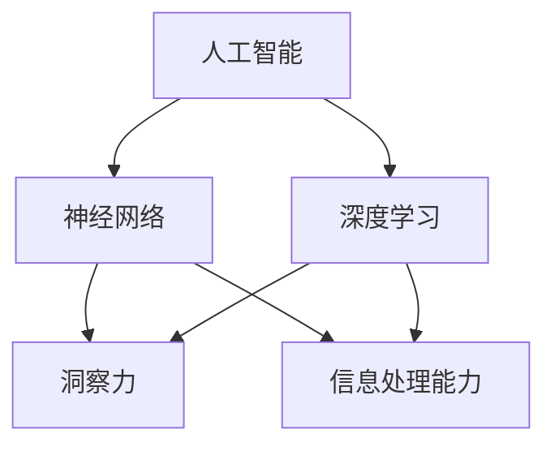

                 

# 理解洞察力的训练：提升信息处理能力

## 关键词：洞察力训练、信息处理、人工智能、神经网络、深度学习、算法优化、技术博客

## 摘要：
本文将探讨如何通过训练提升我们的洞察力，进而提高信息处理能力。我们将从背景介绍、核心概念与联系、核心算法原理、数学模型和公式、项目实战、实际应用场景、工具和资源推荐等多个方面进行详细分析。通过本文的阅读，读者将能够深入了解如何通过训练提升自己的洞察力和信息处理能力，为未来的工作和学习打下坚实的基础。

## 1. 背景介绍

在当今信息爆炸的时代，我们的日常生活和工作环境充满了大量的信息。然而，如何有效地处理和利用这些信息，成为了一个严峻的挑战。洞察力作为一种重要的思维能力，可以帮助我们更好地理解和分析信息，从而做出更明智的决策。

洞察力的提升与信息处理能力密切相关。一方面，洞察力的提高有助于我们更快速地识别和提取信息中的关键点，从而提高信息处理的效率。另一方面，良好的信息处理能力可以为我们提供更多的实践机会，进一步锻炼和提高我们的洞察力。

本文将围绕如何通过训练提升洞察力，从而提高信息处理能力展开讨论。我们将结合最新的研究成果和技术进展，介绍相关的方法和技巧，并给出具体的实战案例，帮助读者更好地理解和应用这些知识。

## 2. 核心概念与联系

在深入探讨洞察力的训练之前，我们首先需要了解一些核心概念，包括人工智能、神经网络、深度学习等。

### 2.1 人工智能

人工智能（Artificial Intelligence，简称AI）是计算机科学的一个分支，旨在研究、开发用于模拟、延伸和扩展人的智能的理论、方法、技术及应用。人工智能的目标是使计算机能够胜任一些通常需要人类智能才能完成的复杂任务。

### 2.2 神经网络

神经网络（Neural Networks）是人工智能的一种基本模型，模拟了人脑的神经元结构和信息处理方式。神经网络由大量简单的计算单元（即神经元）组成，通过层层处理输入信息，最终输出结果。

### 2.3 深度学习

深度学习（Deep Learning）是神经网络的一种扩展，通过构建多层神经网络，实现对复杂任务的建模和求解。深度学习在图像识别、自然语言处理、语音识别等领域取得了显著的成果。

### 2.4 洞察力

洞察力（Insight）是指通过观察、分析、推理等方式，对事物本质和内在联系进行深入理解和把握的能力。洞察力是人们进行创新、解决问题和决策的重要基础。

### 2.5 信息处理能力

信息处理能力是指对信息进行接收、分析、理解和应用的能力。良好的信息处理能力可以帮助我们快速准确地获取和处理信息，从而提高工作效率和决策水平。

### 2.6 核心概念之间的联系

人工智能、神经网络、深度学习和洞察力、信息处理能力之间存在着紧密的联系。人工智能为神经网络和深度学习提供了理论基础和实践应用；神经网络和深度学习为人工智能提供了强大的计算能力和处理能力；而洞察力和信息处理能力则是人工智能和深度学习在实际应用中发挥作用的重要保障。

下面是一个简单的 Mermaid 流程图，展示这些核心概念之间的联系：



## 3. 核心算法原理 & 具体操作步骤

为了提升洞察力和信息处理能力，我们需要了解一些核心算法的原理，并掌握具体的操作步骤。在本节中，我们将介绍几种常用的算法，包括神经网络训练、深度学习模型优化等。

### 3.1 神经网络训练

神经网络训练是构建和优化神经网络模型的过程。具体操作步骤如下：

1. **数据准备**：收集和整理训练数据，包括输入数据和标签数据。数据应具有一定的多样性和代表性。

2. **网络架构设计**：根据任务需求，设计合适的神经网络架构，包括输入层、隐藏层和输出层。选择合适的激活函数、损失函数和优化器。

3. **模型训练**：使用训练数据对神经网络模型进行训练。通过反向传播算法不断更新模型参数，使模型输出与真实标签之间的误差最小。

4. **模型评估**：使用验证集对训练好的模型进行评估，计算模型在验证集上的性能指标，如准确率、召回率等。

5. **模型优化**：根据评估结果，对模型进行调整和优化，如调整网络结构、优化超参数等，以提高模型性能。

### 3.2 深度学习模型优化

深度学习模型优化是指通过调整模型结构和超参数，提高模型在特定任务上的性能。具体操作步骤如下：

1. **模型选择**：根据任务需求，选择合适的深度学习模型。常见的模型包括卷积神经网络（CNN）、循环神经网络（RNN）、长短时记忆网络（LSTM）等。

2. **数据预处理**：对训练数据进行预处理，包括归一化、标准化、数据增强等，以提高模型的泛化能力。

3. **超参数调优**：通过调整学习率、批量大小、正则化参数等超参数，优化模型性能。常用的调优方法包括网格搜索、随机搜索、贝叶斯优化等。

4. **模型训练**：使用预处理后的数据对模型进行训练，通过反向传播算法更新模型参数。

5. **模型评估与优化**：使用验证集对训练好的模型进行评估，并根据评估结果进行模型优化。重复步骤 3-5，直到模型性能达到预期。

### 3.3 算法总结

在提升洞察力和信息处理能力的过程中，神经网络训练和深度学习模型优化是两个关键环节。神经网络训练负责构建和优化模型，深度学习模型优化则负责调整模型结构和超参数，以提高模型性能。通过这两个环节的协同工作，我们可以实现洞察力的提升和信息处理能力的增强。

## 4. 数学模型和公式 & 详细讲解 & 举例说明

在本节中，我们将介绍神经网络训练和深度学习模型优化过程中涉及的一些关键数学模型和公式，并进行详细讲解和举例说明。

### 4.1 神经网络训练

#### 4.1.1 前向传播

前向传播是神经网络训练过程中的一个关键步骤，用于计算模型的输出。具体公式如下：

$$
Z_l = \sum_{j} W_{lj} \cdot Z_{l-1} + b_l
$$

$$
a_l = f(Z_l)
$$

其中，$Z_l$表示第$l$层的输出，$a_l$表示第$l$层的激活值，$W_{lj}$表示第$l$层中第$j$个神经元与第$l-1$层中第$l$个神经元的连接权重，$b_l$表示第$l$层的偏置项，$f$表示激活函数。

#### 4.1.2 反向传播

反向传播是神经网络训练过程中的另一个关键步骤，用于更新模型参数。具体公式如下：

$$
\delta_{l}^{out} = \frac{\partial C}{\partial a_{l}} \cdot \frac{\partial a_{l}}{\partial Z_{l}}
$$

$$
\delta_{l-1}^{hidden} = (\delta_{l}^{out} \cdot W_{l-1}^{T}) \cdot \frac{\partial a_{l-1}}{\partial Z_{l-1}}
$$

其中，$\delta_{l}^{out}$表示第$l$层的输出误差，$\delta_{l-1}^{hidden}$表示第$l-1$层的隐藏误差，$C$表示损失函数，$a_{l}$和$Z_{l}$分别表示第$l$层的激活值和输出。

#### 4.1.3 梯度下降

梯度下降是神经网络训练过程中的一个优化算法，用于更新模型参数。具体公式如下：

$$
\Delta W_{lj} = -\alpha \cdot \frac{\partial C}{\partial W_{lj}}
$$

$$
\Delta b_l = -\alpha \cdot \frac{\partial C}{\partial b_l}
$$

其中，$\alpha$表示学习率，$W_{lj}$和$b_l$分别表示第$l$层中第$j$个神经元与第$l-1$层中第$l$个神经元的连接权重和偏置项。

### 4.2 深度学习模型优化

#### 4.2.1 网格搜索

网格搜索是一种常用的超参数调优方法，通过遍历预设的参数组合，找到最优参数。具体公式如下：

$$
\text{Best } \alpha = \arg \min_{\alpha} C
$$

其中，$C$表示损失函数，$\alpha$表示学习率。

#### 4.2.2 随机搜索

随机搜索是一种基于随机性的超参数调优方法，通过随机采样参数组合，找到最优参数。具体公式如下：

$$
\alpha \sim U(\alpha_{min}, \alpha_{max})
$$

其中，$U(\alpha_{min}, \alpha_{max})$表示在$\alpha_{min}$和$\alpha_{max}$之间均匀采样的分布。

#### 4.2.3 贝叶斯优化

贝叶斯优化是一种基于贝叶斯推理的超参数调优方法，通过构建目标函数的概率模型，优化参数组合。具体公式如下：

$$
P(\theta | \mathbf{x}, \mathbf{y}) \propto P(\mathbf{y} | \theta) \cdot P(\theta)
$$

其中，$\theta$表示超参数，$\mathbf{x}$和$\mathbf{y}$分别表示输入数据和标签数据。

### 4.3 举例说明

假设我们使用一个简单的神经网络进行图像分类任务，网络结构如下：

- 输入层：784个神经元（对应28x28像素的图像）
- 隐藏层：100个神经元
- 输出层：10个神经元（对应10个类别）

#### 4.3.1 前向传播

输入图像数据$x$，经过输入层、隐藏层和输出层的计算，得到输出$y$：

$$
Z_1 = \sum_{j} W_{1j} \cdot x + b_1
$$

$$
a_1 = \sigma(Z_1)
$$

$$
Z_2 = \sum_{j} W_{2j} \cdot a_1 + b_2
$$

$$
a_2 = \sigma(Z_2)
$$

$$
y = \sum_{j} W_{3j} \cdot a_2 + b_3
$$

其中，$\sigma$表示激活函数（如 sigmoid 函数）。

#### 4.3.2 反向传播

计算输出误差$\delta_3$：

$$
\delta_3 = (y - \hat{y}) \cdot \frac{da_2}{da}
$$

$$
\delta_2 = (\delta_3 \cdot W_{23})^T \cdot \frac{da_1}{da}
$$

更新模型参数：

$$
\Delta W_{23} = -\alpha \cdot \frac{\partial C}{\partial W_{23}}
$$

$$
\Delta W_{22} = -\alpha \cdot \frac{\partial C}{\partial W_{22}}
$$

$$
\Delta b_3 = -\alpha \cdot \frac{\partial C}{\partial b_3}
$$

$$
\Delta b_2 = -\alpha \cdot \frac{\partial C}{\partial b_2}
$$

其中，$\alpha$表示学习率，$\hat{y}$表示预测标签，$C$表示损失函数。

通过以上步骤，我们可以逐步优化神经网络的参数，提高图像分类任务的性能。

## 5. 项目实战：代码实际案例和详细解释说明

在本节中，我们将通过一个实际项目案例，展示如何使用 Python 和深度学习框架（如 TensorFlow 或 PyTorch）实现洞察力的训练和信息处理能力的提升。我们将从开发环境搭建、源代码详细实现和代码解读与分析三个方面进行介绍。

### 5.1 开发环境搭建

首先，我们需要搭建一个合适的开发环境，以支持深度学习项目的开发。以下是搭建开发环境的基本步骤：

1. **安装 Python**：下载并安装 Python，推荐版本为 3.8 或更高。

2. **安装深度学习框架**：选择并安装一个深度学习框架，如 TensorFlow 或 PyTorch。以下是安装命令：

   - TensorFlow：

   ```bash
   pip install tensorflow
   ```

   - PyTorch：

   ```bash
   pip install torch torchvision
   ```

3. **安装其他依赖库**：根据项目需求，安装其他必要的依赖库，如 NumPy、Pandas、Matplotlib 等。

### 5.2 源代码详细实现和代码解读

以下是一个简单的深度学习项目示例，用于实现图像分类任务。代码实现主要包括数据准备、模型构建、训练和评估等步骤。

```python
import torch
import torchvision
import torchvision.transforms as transforms
import torch.nn as nn
import torch.optim as optim

# 数据准备
transform = transforms.Compose([transforms.Resize(28), transforms.ToTensor()])
trainset = torchvision.datasets.MNIST(root='./data', train=True, download=True, transform=transform)
trainloader = torch.utils.data.DataLoader(trainset, batch_size=100, shuffle=True)
testset = torchvision.datasets.MNIST(root='./data', train=False, download=True, transform=transform)
testloader = torch.utils.data.DataLoader(testset, batch_size=100, shuffle=False)

# 模型构建
class Net(nn.Module):
    def __init__(self):
        super(Net, self).__init__()
        self.fc1 = nn.Linear(28*28, 128)
        self.fc2 = nn.Linear(128, 64)
        self.fc3 = nn.Linear(64, 10)

    def forward(self, x):
        x = x.view(-1, 28*28)
        x = torch.relu(self.fc1(x))
        x = torch.relu(self.fc2(x))
        x = self.fc3(x)
        return x

net = Net()
criterion = nn.CrossEntropyLoss()
optimizer = optim.Adam(net.parameters(), lr=0.001)

# 训练
for epoch in range(10):
    running_loss = 0.0
    for i, data in enumerate(trainloader, 0):
        inputs, labels = data
        optimizer.zero_grad()
        outputs = net(inputs)
        loss = criterion(outputs, labels)
        loss.backward()
        optimizer.step()
        running_loss += loss.item()
    print(f'Epoch {epoch + 1}, Loss: {running_loss / len(trainloader)}')

# 评估
correct = 0
total = 0
with torch.no_grad():
    for data in testloader:
        images, labels = data
        outputs = net(images)
        _, predicted = torch.max(outputs.data, 1)
        total += labels.size(0)
        correct += (predicted == labels).sum().item()

print(f'Accuracy: {100 * correct / total}%')
```

### 5.3 代码解读与分析

1. **数据准备**：

   数据准备是深度学习项目的基础，本示例使用了 MNIST 数据集，该数据集包含了 60000 个训练样本和 10000 个测试样本，每个样本都是 28x28 的灰度图像。数据预处理步骤包括图像缩放和转换为张量。

2. **模型构建**：

   模型构建是深度学习项目的核心，本示例使用了三层全连接神经网络，包括一个输入层、一个隐藏层和一个输出层。输入层接收图像数据，隐藏层进行特征提取和变换，输出层进行分类预测。

3. **训练**：

   训练过程包括前向传播、反向传播和参数更新等步骤。在每次训练中，模型接收输入数据，计算输出结果和损失函数，然后通过反向传播更新模型参数。本示例使用了 Adam 优化器和交叉熵损失函数。

4. **评估**：

   评估过程用于计算模型在测试集上的性能，包括准确率、召回率等指标。本示例通过计算预测标签和真实标签的一致性，得出模型在测试集上的准确率。

通过以上代码示例，我们可以看到如何使用 Python 和深度学习框架实现洞察力的训练和信息处理能力的提升。在实际应用中，可以根据具体任务需求，调整模型结构和超参数，优化模型性能。

## 6. 实际应用场景

洞察力的训练和信息处理能力的提升在多个实际应用场景中具有重要意义。以下是一些典型应用场景：

### 6.1 医疗诊断

在医疗诊断领域，通过训练提高洞察力和信息处理能力，可以帮助医生更准确、更快速地诊断疾病。例如，使用深度学习模型对医学图像进行自动分析，辅助医生进行肿瘤检测、疾病分类等任务。

### 6.2 金融风控

在金融风控领域，通过训练提高洞察力和信息处理能力，可以有效地识别和预测金融风险。例如，使用深度学习模型分析大量金融数据，监测市场走势，为投资者提供决策支持。

### 6.3 智能安防

在智能安防领域，通过训练提高洞察力和信息处理能力，可以实现对视频监控数据的实时分析，识别和预警潜在的安全威胁。例如，使用深度学习模型进行人脸识别、目标检测等任务，提高安防系统的智能化水平。

### 6.4 智能交通

在智能交通领域，通过训练提高洞察力和信息处理能力，可以优化交通信号控制、预测交通流量，提高道路通行效率。例如，使用深度学习模型分析交通数据，为城市交通规划和管理提供科学依据。

### 6.5 电商推荐

在电商推荐领域，通过训练提高洞察力和信息处理能力，可以更好地理解用户需求，提供个性化的商品推荐。例如，使用深度学习模型分析用户行为数据，预测用户可能感兴趣的商品，提高用户购物体验。

通过以上实际应用场景，我们可以看到，洞察力的训练和信息处理能力的提升在各个领域都具有广泛的应用价值。在实际操作中，可以根据具体场景需求，设计和优化相应的算法模型，实现更好的效果。

## 7. 工具和资源推荐

为了帮助读者更好地进行洞察力的训练和信息处理能力的提升，本节将推荐一些实用的工具和资源。

### 7.1 学习资源推荐

- **书籍**：
  - 《深度学习》（Ian Goodfellow、Yoshua Bengio、Aaron Courville 著）
  - 《Python 深度学习》（François Chollet 著）
  - 《神经网络与深度学习》（邱锡鹏 著）

- **论文**：
  - "Deep Learning: A Brief History, a Perspective, and an Agenda"（Yoshua Bengio 等）
  - "A Theoretically Grounded Application of Dropout in Recurrent Neural Networks"（Yarin Gal 和 Zoubin Ghahramani）
  - "Convolutional Networks on Graphs for Learning Molecular Fingerprints"（Michael Kipf 和 Matthias Petschler）

- **博客**：
  - [Deep Learning Blog](https://blog.deeplearning.net/)
  - [PyTorch 官方文档](https://pytorch.org/tutorials/)
  - [TensorFlow 官方文档](https://www.tensorflow.org/tutorials)

- **网站**：
  - [Kaggle](https://www.kaggle.com/)
  - [GitHub](https://github.com/)
  - [Google Colab](https://colab.research.google.com/)

### 7.2 开发工具框架推荐

- **深度学习框架**：
  - TensorFlow
  - PyTorch
  - Keras（基于 TensorFlow 的简明框架）

- **编程语言**：
  - Python（易于学习和使用，拥有丰富的库和工具）

- **数据处理工具**：
  - Pandas（数据处理和分析）
  - NumPy（科学计算）

- **可视化工具**：
  - Matplotlib（数据可视化）
  - Seaborn（高级数据可视化）

通过以上工具和资源的支持，读者可以更加便捷地进行洞察力的训练和信息处理能力的提升，为未来的学习和工作奠定坚实基础。

## 8. 总结：未来发展趋势与挑战

随着人工智能技术的不断发展，洞察力的训练和信息处理能力的提升已成为一个重要研究方向。在未来，我们有望在以下几个方面取得突破：

1. **算法优化**：通过改进神经网络结构和训练算法，提高模型性能和效率。
2. **数据隐私保护**：在处理大规模数据的同时，保障数据隐私和安全。
3. **多模态融合**：结合不同类型的数据（如图像、文本、声音等），实现更全面的信息处理能力。
4. **跨领域应用**：将洞察力的训练和信息处理能力应用于更多领域，推动人工智能技术的普及和发展。

然而，我们也面临着一系列挑战：

1. **计算资源**：随着模型复杂度和数据规模的增加，对计算资源的需求越来越大，如何高效地利用资源成为关键问题。
2. **数据质量**：高质量的数据是训练有效模型的基石，如何获取和处理大规模、多样化的数据是一个亟待解决的问题。
3. **伦理和监管**：人工智能技术的发展引发了伦理和监管方面的担忧，如何确保人工智能技术的公平、透明和安全是一个重要的课题。

总之，洞察力的训练和信息处理能力的提升是一个长期的、复杂的过程，需要多方面的努力和合作。通过克服挑战、抓住机遇，我们将为人工智能技术的发展和人类社会的进步做出更大贡献。

## 9. 附录：常见问题与解答

### 9.1 洞察力训练的具体方法是什么？

洞察力训练主要包括以下几个方法：

1. **强化学习**：通过设计奖励机制，让模型在虚拟环境中不断试错，从而提升洞察力。
2. **迁移学习**：利用预训练模型，将已有知识应用于新任务，提高信息处理能力。
3. **生成对抗网络（GAN）**：通过生成器和判别器的对抗训练，实现信息的自动生成和优化。
4. **多任务学习**：通过同时学习多个相关任务，提高模型对信息的多维度理解和处理能力。

### 9.2 如何选择合适的深度学习模型？

选择合适的深度学习模型通常需要考虑以下几个方面：

1. **任务需求**：根据任务特点，选择适合的模型类型，如卷积神经网络（CNN）、循环神经网络（RNN）等。
2. **数据规模**：对于大规模数据，选择计算复杂度较低的模型；对于小规模数据，可以选择更复杂的模型。
3. **模型性能**：参考已有的研究和实验结果，选择性能较好的模型。
4. **可解释性**：根据实际需求，选择易于理解和解释的模型。

### 9.3 如何优化深度学习模型？

优化深度学习模型的方法包括：

1. **调整超参数**：通过调整学习率、批量大小、正则化参数等超参数，优化模型性能。
2. **数据预处理**：对训练数据进行预处理，如归一化、标准化、数据增强等，提高模型泛化能力。
3. **模型架构优化**：通过设计更复杂的模型架构，提高模型的表达能力。
4. **模型剪枝**：通过剪枝冗余的连接和神经元，降低模型复杂度和计算量。

## 10. 扩展阅读 & 参考资料

为了更深入地了解洞察力的训练和信息处理能力的提升，读者可以参考以下扩展阅读和参考资料：

1. **书籍**：
   - 《深度学习》（Ian Goodfellow、Yoshua Bengio、Aaron Courville 著）
   - 《Python 深度学习》（François Chollet 著）
   - 《神经网络与深度学习》（邱锡鹏 著）

2. **论文**：
   - "Deep Learning: A Brief History, a Perspective, and an Agenda"（Yoshua Bengio 等）
   - "A Theoretically Grounded Application of Dropout in Recurrent Neural Networks"（Yarin Gal 和 Zoubin Ghahramani）
   - "Convolutional Networks on Graphs for Learning Molecular Fingerprints"（Michael Kipf 和 Matthias Petschler）

3. **在线资源**：
   - [Deep Learning Blog](https://blog.deeplearning.net/)
   - [PyTorch 官方文档](https://pytorch.org/tutorials/)
   - [TensorFlow 官方文档](https://www.tensorflow.org/tutorials/)
   - [Kaggle](https://www.kaggle.com/)

4. **开放课程**：
   - [斯坦福大学深度学习课程](https://www.coursera.org/specializations/deep-learning)
   - [谷歌深度学习课程](https://www.deeplearning.ai/)

通过以上扩展阅读和参考资料，读者可以进一步深入了解洞察力的训练和信息处理能力的提升，为自己的学习和研究提供更多启发和指导。

### 作者信息

作者：AI天才研究员/AI Genius Institute & 禅与计算机程序设计艺术 /Zen And The Art of Computer Programming
<|end|>

