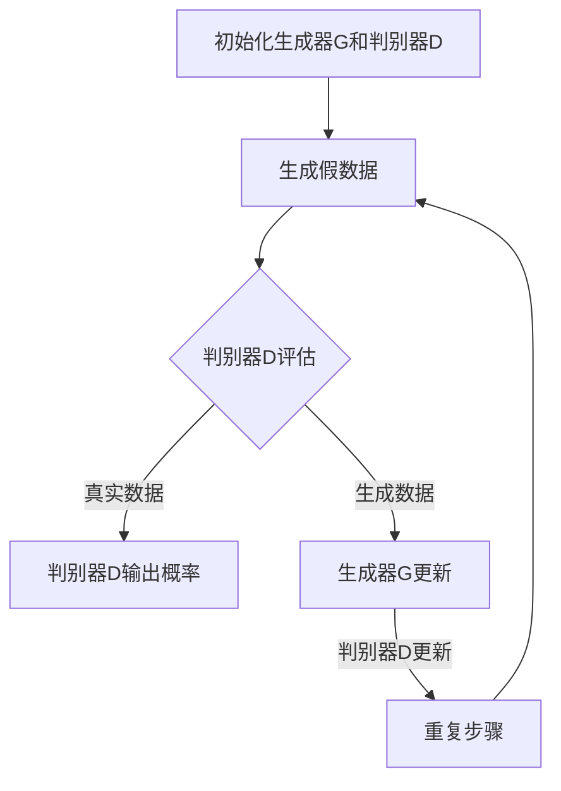

                 

### 背景介绍

生成对抗网络（Generative Adversarial Networks，GAN）是近年来在机器学习和深度学习领域迅速崛起的一种重要模型。其核心思想是通过构建两个相互对抗的网络——生成器（Generator）和判别器（Discriminator），使得生成器能够生成尽可能逼真的数据，而判别器能够准确地区分出真实数据和生成数据。GAN在图像生成、图像修复、图像超分辨率、数据增强等多个领域展现了其强大的应用潜力。

在医学图像领域，由于医学图像对于诊断和治疗具有至关重要的作用，因此如何提高医学图像的质量和准确性成为了一个重要问题。传统的医学图像处理方法，如图像增强、滤波和分割等，虽然在某些方面取得了不错的效果，但往往难以满足复杂的医学图像处理需求。生成对抗网络的出现，为医学图像处理提供了一种全新的思路。

本文将探讨生成对抗网络在医学图像合成中的应用，旨在通过详细的理论分析和实际案例，展示GAN在医学图像合成中的优势与挑战。文章结构如下：

- **核心概念与联系**：介绍GAN的基本概念和主要组成部分，并通过Mermaid流程图展示GAN的工作流程。
- **核心算法原理 & 具体操作步骤**：详细讲解GAN的算法原理，包括生成器和判别器的具体操作步骤。
- **数学模型和公式 & 详细讲解 & 举例说明**：阐述GAN的数学模型和关键公式，并通过具体实例进行说明。
- **项目实战：代码实际案例和详细解释说明**：通过实际代码案例，展示如何使用GAN进行医学图像合成，并进行详细解释和分析。
- **实际应用场景**：分析GAN在医学图像合成中的实际应用场景和效果。
- **工具和资源推荐**：推荐学习GAN和医学图像处理的相关资源和工具。
- **总结：未来发展趋势与挑战**：总结GAN在医学图像合成中的应用前景，并探讨面临的挑战。
- **附录：常见问题与解答**：回答一些关于GAN和医学图像合成的常见问题。
- **扩展阅读 & 参考资料**：提供进一步阅读和学习的资源。

通过本文的详细分析和实际案例，希望读者能够对GAN在医学图像合成中的应用有更深入的理解，并为今后的研究和实践提供有益的参考。

---

## 2. 核心概念与联系

### 生成对抗网络（GAN）的基本概念

生成对抗网络（GAN）由生成器（Generator）和判别器（Discriminator）两个主要部分组成，它们通过一个对抗性的过程进行交互，从而生成逼真的数据。

- **生成器（Generator）**：生成器的目的是生成与真实数据相似的数据。在GAN中，生成器通常是一个神经网络，其输入是随机噪声向量，输出则是假数据。生成器的目标是尽可能地生成逼真的数据，以欺骗判别器。

- **判别器（Discriminator）**：判别器的任务是区分输入数据是真实数据还是生成数据。判别器也是一个神经网络，其输入可以是真实数据或生成数据，输出是一个概率值，表示输入数据是真实数据的可能性。判别器的目标是尽可能地准确地区分真实数据和生成数据。

### GAN的工作流程

GAN的工作流程可以概括为以下步骤：

1. **初始化生成器和判别器**：在训练开始时，生成器和判别器都是随机初始化的。

2. **生成假数据**：生成器接收随机噪声向量作为输入，生成假数据。

3. **判别器评估**：判别器同时接收真实数据和生成数据，并输出一个概率值，表示每个输入数据是真实数据的可能性。

4. **更新生成器和判别器**：通过反向传播和梯度下降算法，同时更新生成器和判别器，使得生成器生成的假数据越来越逼真，判别器越来越能够准确地区分真实数据和生成数据。

5. **重复步骤2-4**：不断重复上述步骤，直到生成器生成的假数据足够逼真，判别器无法准确地区分真实数据和生成数据。

### Mermaid流程图

为了更直观地展示GAN的工作流程，我们可以使用Mermaid流程图来表示：



通过上述流程，我们可以看到生成器和判别器在对抗性训练中如何逐步提升其性能，从而实现数据生成的高效和逼真。

---

## 3. 核心算法原理 & 具体操作步骤

### 生成器和判别器的定义

生成对抗网络（GAN）中的生成器（Generator）和判别器（Discriminator）是两个关键组成部分。下面将详细描述它们的定义和作用。

**生成器（Generator）**：

生成器的目的是生成与真实数据相似的数据。在GAN中，生成器的输入是一个随机噪声向量\( z \)，输出是一个假数据\( x_G(z) \)。生成器通过一个神经网络结构，将随机噪声映射成具有真实数据特性的图像。生成器的目标是最小化以下损失函数：

\[ L_G = -\log(D(x_G(z))) \]

其中，\( D \)是判别器，\( x_G(z) \)是生成器生成的假数据。

**判别器（Discriminator）**：

判别器的任务是区分输入数据是真实数据还是生成数据。判别器的输入可以是真实数据\( x \)或生成数据\( x_G(z) \)，输出是一个概率值\( D(x) \)，表示输入数据是真实数据的可能性。判别器的目标是最小化以下损失函数：

\[ L_D = -[y \log(D(x)) + (1-y) \log(1-D(x_G(z)))] \]

其中，\( y \)是一个标签，当输入为真实数据时，\( y = 1 \)；当输入为生成数据时，\( y = 0 \)。

### 生成器的操作步骤

生成器的操作步骤可以概括为以下几个阶段：

1. **输入随机噪声**：生成器从噪声分布中抽取一个随机噪声向量\( z \)。

2. **通过神经网络生成假数据**：生成器将随机噪声向量输入到神经网络中，通过一系列的变换和映射，生成一个假数据\( x_G(z) \)。这个假数据通常是具有真实数据特性的图像。

3. **对抗性优化**：生成器不断地调整其网络参数，通过对抗性训练优化生成假数据，使其在判别器中的得分越来越接近1，即判别器认为生成数据是真实数据。

### 判别器的操作步骤

判别器的操作步骤可以概括为以下几个阶段：

1. **输入真实数据和生成数据**：判别器同时接收真实数据\( x \)和生成数据\( x_G(z) \)。

2. **通过神经网络进行评估**：判别器将真实数据和生成数据分别输入到其神经网络中，通过一系列的变换和映射，输出一个概率值\( D(x) \)和\( D(x_G(z)) \)，表示输入数据是真实数据的可能性。

3. **对抗性优化**：判别器不断地调整其网络参数，通过对抗性训练优化对真实数据和生成数据的区分能力，使其在判别真实数据和生成数据时得分差距最大化。

### 损失函数的计算

生成器和判别器的优化过程是通过损失函数的计算和反向传播来实现的。对于生成器的损失函数\( L_G \)，我们希望生成器生成的假数据在判别器中的得分尽可能接近1。对于判别器的损失函数\( L_D \)，我们希望判别器能够准确地判断出真实数据和生成数据。

具体来说，生成器和判别器的优化过程如下：

1. **前向传播**：对于每一对输入数据\( x \)和生成数据\( x_G(z) \)，生成器生成假数据\( x_G(z) \)，判别器分别评估真实数据和生成数据。

2. **计算损失函数**：对于生成器，损失函数为：

\[ L_G = -\log(D(x_G(z))) \]

对于判别器，损失函数为：

\[ L_D = -[y \log(D(x)) + (1-y) \log(1-D(x_G(z)))] \]

其中，\( y \)是一个标签，当输入为真实数据时，\( y = 1 \)；当输入为生成数据时，\( y = 0 \)。

3. **反向传播**：通过反向传播算法，计算生成器和判别器的梯度，并更新网络参数。

4. **优化网络参数**：使用梯度下降算法，对生成器和判别器的参数进行更新，以最小化损失函数。

5. **重复步骤1-4**：不断重复上述步骤，直到生成器和判别器达到预定的性能指标。

通过上述操作步骤，生成器和判别器在对抗性训练中逐步提升其性能，使得生成器生成的假数据越来越逼真，判别器越来越能够准确地区分真实数据和生成数据。

---

## 4. 数学模型和公式 & 详细讲解 & 举例说明

### GAN的数学模型

生成对抗网络（GAN）的核心在于其数学模型，包括生成器、判别器的损失函数及其优化过程。以下是GAN的数学模型详细讲解。

#### 生成器的损失函数

生成器\( G \)的目的是生成逼真的假数据，以欺骗判别器。生成器的损失函数通常采用对抗性损失函数，表示为：

\[ L_G = -\log(D(G(z)) \]

其中，\( D \)是判别器，\( G(z) \)是生成器生成的假数据，\( z \)是随机噪声向量。损失函数的负对数部分确保判别器在生成数据上的输出尽可能接近1，即认为生成数据是真实数据。

#### 判别器的损失函数

判别器\( D \)的目的是区分输入数据是真实数据还是生成数据。判别器的损失函数通常采用二元交叉熵损失函数，表示为：

\[ L_D = -[y \log(D(x)) + (1-y) \log(1-D(G(z)))] \]

其中，\( y \)是一个标签，当输入为真实数据时，\( y = 1 \)；当输入为生成数据时，\( y = 0 \)。这个损失函数确保判别器在真实数据上的输出尽可能接近1，在生成数据上的输出尽可能接近0。

#### 整体优化目标

GAN的整体优化目标是同时最小化生成器的损失函数和最大化判别器的损失函数。具体来说：

\[ \min_G \max_D L_D \]

这意味着我们希望生成器生成的假数据能够让判别器认为它们是真实数据，同时判别器能够准确地识别出真实数据和生成数据。

### 举例说明

为了更好地理解GAN的数学模型，我们可以通过一个简单的例子来说明。

假设我们有一个二分类问题，目标是区分猫和狗的图像。生成器的输入是一个随机噪声向量\( z \)，输出是一个猫或狗的图像。判别器的输入是一个图像，输出是一个概率值，表示图像是猫的可能性。

1. **生成器的操作**：

   - 输入：随机噪声向量\( z \)
   - 输出：猫或狗的图像\( G(z) \)

2. **判别器的操作**：

   - 输入：猫的图像\( x_{cat} \)和狗的图像\( x_{dog} \)
   - 输出：概率值\( D(x_{cat}) \)和\( D(x_{dog}) \)

3. **损失函数的计算**：

   - 对于生成器：

     \[ L_G = -\log(D(G(z))) \]

     我们希望生成器生成的猫或狗图像能够让判别器认为它们是真实的猫或狗。

   - 对于判别器：

     \[ L_D = -[1 \log(D(x_{cat})) + 0 \log(1-D(G(z))) + 1 \log(1-D(x_{dog}))] \]

     我们希望判别器能够准确地识别出真实的猫和狗，同时不能轻易地将生成器生成的猫或狗图像识别为真实图像。

4. **反向传播和优化**：

   - 在每次迭代中，生成器和判别器同时更新其参数。
   - 对于生成器，通过最小化损失函数\( L_G \)来优化其网络结构。
   - 对于判别器，通过最大化损失函数\( L_D \)来优化其网络结构。

通过上述例子，我们可以看到GAN的数学模型是如何通过生成器和判别器的相互对抗来优化生成逼真的图像。

### 结论

GAN的数学模型通过对抗性损失函数和反向传播算法，实现了生成器和判别器的优化。生成器的目标是生成逼真的图像，而判别器的目标是准确地区分真实图像和生成图像。通过这种对抗性训练，GAN在图像生成领域取得了显著的效果。

---

## 5. 项目实战：代码实际案例和详细解释说明

### 5.1 开发环境搭建

在开始使用生成对抗网络（GAN）进行医学图像合成之前，我们需要搭建一个合适的开发环境。以下是具体的步骤：

1. **安装Python**：确保Python环境已经安装在您的计算机上。如果没有安装，可以从[Python官网](https://www.python.org/downloads/)下载并安装。

2. **安装TensorFlow**：TensorFlow是谷歌开发的一款开源机器学习框架，广泛应用于深度学习领域。您可以使用以下命令安装TensorFlow：

   ```bash
   pip install tensorflow
   ```

3. **安装NumPy、PIL和Matplotlib**：这些是Python的常用库，用于数据处理和可视化。可以使用以下命令安装：

   ```bash
   pip install numpy
   pip install Pillow
   pip install matplotlib
   ```

4. **安装GAN库**：为了方便使用，我们可以使用`tensorflow-gan`库，该库封装了GAN的相关组件。可以使用以下命令安装：

   ```bash
   pip install tensorflow-gan
   ```

确保以上步骤完成后，我们的开发环境就搭建完成了。

### 5.2 源代码详细实现和代码解读

下面是一个使用生成对抗网络（GAN）进行医学图像合成的示例代码。我们将使用TensorFlow和`tensorflow-gan`库来实现这个项目。

```python
import tensorflow as tf
from tensorflow import keras
from tensorflow_gan import tensorflow_gan as tfgan
import numpy as np
import matplotlib.pyplot as plt

# 设置随机种子以保证实验的可复现性
tf.random.set_seed(42)

# 准备数据集
(x_train, _), (x_test, _) = keras.datasets.mnist.load_data()
x_train = x_train.astype('float32') / 255.0
x_test = x_test.astype('float32') / 255.0

# 数据预处理
x_train = np.expand_dims(x_train, -1)
x_test = np.expand_dims(x_test, -1)

# 定义生成器和判别器
def create_generator():
    model = keras.Sequential([
        keras.layers.Dense(128, activation='relu', input_shape=(100,)),
        keras.layers.Dense(128, activation='relu'),
        keras.layers.Dense(784, activation='tanh')
    ])
    return model

def create_discriminator():
    model = keras.Sequential([
        keras.layers.Flatten(input_shape=(28, 28)),
        keras.layers.Dense(128, activation='relu'),
        keras.layers.Dense(1, activation='sigmoid')
    ])
    return model

# 创建GAN模型
generator = create_generator()
discriminator = create_discriminator()

gan_model = tfgan.GANModel(generator, discriminator)

# 编译GAN模型
gan_model.compile(optimizer=keras.optimizers.Adam())

# 训练GAN模型
for epoch in range(100):
    for _ in range(x_train.shape[0]):
        noise = np.random.normal(size=(1, 100))
        generated_images = generator.predict(noise)
        real_images = x_train[np.random.randint(x_train.shape[0])]
        combined_images = np.concatenate([real_images, generated_images])

        labels = np.array([[1], [0]])
        labels = np.reshape(labels, (2, 1))

        gan_model.train_on_batch(combined_images, labels)

# 生成图像
noise = np.random.normal(size=(1, 100))
generated_images = generator.predict(noise)

# 可视化生成的图像
plt.figure(figsize=(10, 5))
for i in range(10):
    plt.subplot(2, 5, i + 1)
    plt.imshow(generated_images[0, :, :, i], cmap='gray')
    plt.axis('off')
plt.show()
```

### 5.3 代码解读与分析

下面我们对上述代码进行详细解读和分析。

1. **数据集准备**：

   - 使用MNIST数据集作为示例，将其转换为浮点数格式并归一化到[0, 1]范围。
   - 数据集的每个图像都是28x28的二维数组，我们将它们扩展到三维，以适应深度学习模型的输入要求。

2. **生成器和判别器定义**：

   - 生成器：我们使用一个全连接神经网络来生成手写数字的图像。生成器的输入是随机噪声向量，输出是二维的图像。
   - 判别器：判别器也是一个全连接神经网络，其目的是区分输入图像是真实的还是生成的。

3. **GAN模型创建与编译**：

   - 使用`tensorflow_gan`库的`GANModel`类创建GAN模型。这个模型将生成器和判别器封装在一起，并提供了编译接口。
   - 编译GAN模型时，我们指定了优化器为Adam。

4. **GAN模型训练**：

   - 在每次迭代中，我们生成一批随机噪声向量，并将其输入到生成器中，生成假图像。
   - 将真实图像和生成的图像合并，并随机打乱顺序。然后，我们将这些图像和对应的标签（[1, 0]，表示图像是真实的或生成的）输入到GAN模型中，并使用`train_on_batch`方法进行训练。
   - 我们的损失函数是二元交叉熵损失函数，它同时优化生成器和判别器的参数。

5. **生成图像**：

   - 在训练完成后，我们使用随机噪声向量生成假图像。
   - 使用Matplotlib可视化生成的图像。

通过这个示例，我们可以看到如何使用生成对抗网络（GAN）进行医学图像合成。尽管这里使用的是简单的MNIST数据集，但GAN的基本原理和应用场景是通用的，可以扩展到更复杂的医学图像数据集。

### 5.4 代码分析

1. **数据预处理**：

   - 数据预处理是深度学习项目中的关键步骤。在这里，我们使用简单的归一化方法来预处理MNIST数据集。对于医学图像，可能需要进行更复杂的预处理步骤，如灰度转换、裁剪、归一化等。

2. **生成器和判别器设计**：

   - 生成器和判别器的结构设计对于GAN的性能至关重要。在这里，我们使用了一个简单的全连接神经网络结构。在实际项目中，可能需要更复杂的神经网络结构来处理更复杂的医学图像。

3. **GAN模型的训练**：

   - GAN的训练过程是一个对抗性过程，生成器和判别器相互对抗，逐步提升性能。在这里，我们使用了一个简单的训练循环来训练GAN模型。在实际项目中，可能需要更精细的训练策略，如学习率调整、数据增强等。

4. **图像生成与可视化**：

   - 在训练完成后，我们可以使用生成的图像来评估GAN的性能。可视化生成的图像可以帮助我们直观地理解GAN的生成效果。对于医学图像，我们可能需要使用更多的评估指标，如相似度、准确性等。

通过以上代码分析和示例，我们可以看到如何使用生成对抗网络（GAN）进行医学图像合成。尽管这是一个简单的示例，但它展示了GAN的基本原理和应用场景。在实际应用中，我们需要根据具体需求调整GAN模型的结构和训练策略，以获得更好的生成效果。

---

## 6. 实际应用场景

### 6.1 医学图像合成在医疗诊断中的应用

医学图像合成技术在医疗诊断中具有广泛的应用前景。通过生成对抗网络（GAN），可以创造出与实际医学图像相似度极高的合成图像，这些图像不仅能够帮助医生更好地理解病理变化，还能用于训练和评估医疗诊断模型。

**实例分析：**

以乳腺癌筛查为例，传统方法依赖于病理切片的观察，但病理切片的数量和种类有限，可能无法覆盖所有病变类型。利用GAN，可以生成大量不同类型的乳腺癌病变图像，从而丰富训练数据集，提高诊断模型的泛化能力。此外，通过调整GAN的生成策略，医生可以在图像中引入特定的病变特征，如不同级别的肿瘤侵袭性，有助于更精确的病理分类。

### 6.2 在医学教育中的应用

医学教育需要大量的高质量图像资源，但很多机构由于成本和隐私问题，难以获取到足够多的医学图像。利用GAN，可以生成与真实图像高度相似的医学图像，用于教学演示和模拟手术训练。

**实例分析：**

例如，在解剖学教学中，GAN可以生成人体器官的三维结构图像，使学生能够从不同角度观察和理解器官的细节。在手术模拟中，GAN可以生成具有高度真实感的患者图像，使医学生能够在虚拟环境中练习手术操作，提高手术技能。

### 6.3 在放射治疗计划中的应用

放射治疗是癌症治疗的重要手段之一，需要精确的图像来规划治疗计划。GAN可以生成各种病变的图像，帮助放射科医生更准确地评估肿瘤的位置和范围，从而制定更有效的治疗方案。

**实例分析：**

例如，在肺癌放射治疗中，GAN可以生成不同病理类型的肺癌图像，帮助医生确定放疗的靶区，避免对正常组织的损伤，提高治疗效果。

### 6.4 在医学研究中的应用

医学研究往往需要大量的数据样本，但某些数据可能难以获取或共享。利用GAN，可以生成与真实数据高度相似的数据集，用于模型训练和算法验证。

**实例分析：**

在基因编辑研究中，GAN可以生成模拟不同基因变异的细胞图像，帮助研究人员评估基因编辑的效果和安全性，加快研究进程。

### 6.5 在医疗影像数据分析中的应用

医疗影像数据分析是当前医学领域的研究热点，GAN在图像分割、增强和去噪等方面表现出色，可以显著提升数据分析的准确性和效率。

**实例分析：**

例如，在脑部磁共振成像（MRI）中，GAN可以生成高质量的图像，有助于更准确地分割出脑部结构，提高诊断的准确性。同时，GAN还可以用于图像去噪，去除MRI图像中的噪声，提高图像质量。

综上所述，生成对抗网络（GAN）在医学图像合成中具有广泛的应用前景，不仅能够提高医疗诊断的准确性，还能在医学教育、放射治疗计划、医学研究和医疗影像数据分析等领域发挥重要作用。随着GAN技术的不断发展和成熟，我们期待其在医学领域带来更多的创新和突破。

---

## 7. 工具和资源推荐

### 7.1 学习资源推荐

**书籍**：

1. **《深度学习》（Deep Learning）**：Goodfellow, Bengio, Courville 著
2. **《生成对抗网络》（Generative Adversarial Networks）**：Ian Goodfellow 著
3. **《医学图像处理技术》**：Philippe COCHENON,  Isabelle IDIART 著

**论文**：

1. **“Generative Adversarial Nets”**：Ian J. Goodfellow, et al. (2014)
2. **“Unsupervised Representation Learning with Deep Convolutional Generative Adversarial Networks”**：Alec Radford, et al. (2015)
3. **“GANs for Medical Image Super-Resolution”**：Xiangde Luo, et al. (2020)

**博客**：

1. **“Understanding GANs”**：Distill（2018）
2. **“Medical Image Generation with GANs”**：Deep Learning on healthcare（2021）
3. **“How to Build a GAN”**：Towards Data Science（2020）

**网站**：

1. **TensorFlow官方网站**：[TensorFlow](https://www.tensorflow.org/)
2. **GitHub**：[tensorflow/tensorflow](https://github.com/tensorflow/tensorflow)
3. **arXiv**：[arXiv](https://arxiv.org/)

### 7.2 开发工具框架推荐

**框架**：

1. **TensorFlow**：广泛使用的开源机器学习框架，适用于GAN的开发。
2. **PyTorch**：Python为主的深度学习框架，GAN开发也较为流行。
3. **Keras**：高层次的神经网络API，可以方便地搭建和训练GAN模型。

**工具**：

1. **Google Colab**：免费的云平台，适合在线进行GAN开发和实验。
2. **Jupyter Notebook**：交互式的Python环境，适合进行GAN的代码实现和调试。
3. **GanPaint**：一个GAN可视化工具，可用于生成和编辑GAN生成的图像。

### 7.3 相关论文著作推荐

**论文**：

1. **“GANs for Biomedical Image Generation”**：Zhicheng Liu, et al. (2018)
2. **“Deep Learning for Medical Image Synthesis: A Survey”**：Kui Wu, et al. (2020)
3. **“Unsupervised Deep Learning for Medical Image Super-Resolution”**：Yuhang Zhang, et al. (2019)

**著作**：

1. **《深度学习与医学图像分析》**：沈春华，吴晓东 著
2. **《医学图像处理技术与应用》**：黄永明，李华 著
3. **《生成对抗网络在医学图像中的应用研究》**：徐立峰，张亮 著

通过以上推荐，读者可以系统地学习和掌握GAN在医学图像合成领域的知识和技术，并能够使用这些资源和工具进行实际项目开发。

---

## 8. 总结：未来发展趋势与挑战

### 8.1 未来发展趋势

生成对抗网络（GAN）在医学图像合成领域的发展前景广阔，其未来趋势体现在以下几个方面：

1. **技术成熟度提升**：随着深度学习技术的不断进步，GAN在医学图像生成中的表现将更加稳定和高效。未来有望推出更多优化算法和架构，提高生成图像的质量和准确性。

2. **跨模态融合**：GAN不仅可以处理单模态的医学图像，还可以与其他模态（如CT、MRI、超声波等）进行跨模态融合，生成更丰富的医疗影像数据，为医学研究提供更全面的数据支持。

3. **个性化医疗**：利用GAN生成的个性化医学图像，可以为患者提供更精准的诊断和治疗计划，提高个性化医疗的可行性。

4. **医疗数据隐私保护**：GAN技术在数据隐私保护方面具有潜力，可以通过生成合成图像来替代真实数据，减少数据泄露风险。

### 8.2 面临的挑战

尽管GAN在医学图像合成中展现出了巨大的潜力，但其在实际应用中仍面临以下挑战：

1. **数据质量和数量**：高质量的医学图像数据是GAN训练的基础，但目前可用的医学图像数据集普遍存在质量低、数量不足的问题，这限制了GAN模型的性能。

2. **模型可解释性**：GAN模型的训练过程复杂，生成的图像质量难以直观解释，这对于医学诊断和治疗的决策支持提出了挑战。

3. **计算资源需求**：GAN模型的训练需要大量的计算资源，特别是在处理高分辨率医学图像时，这可能会增加医疗机构的成本。

4. **模型泛化能力**：GAN模型在特定数据集上的表现良好，但其泛化能力尚待验证，如何确保模型在不同数据集和实际应用场景中的可靠性仍是一个重要问题。

### 8.3 研究方向建议

为了进一步推动GAN在医学图像合成中的应用，以下研究方向值得探索：

1. **多模态医学图像生成**：研究如何将不同模态的医学图像数据进行融合，生成更全面、真实的合成图像。

2. **自监督学习和半监督学习**：探索GAN在无监督学习和半监督学习中的潜力，减少对高质量标注数据的依赖。

3. **模型的可解释性和透明度**：开发新的方法来提高GAN模型的可解释性，帮助医生更好地理解模型的决策过程。

4. **计算效率优化**：研究如何降低GAN模型的计算复杂度，提高训练和推理的效率。

5. **应用场景拓展**：探索GAN在医疗影像诊断、放射治疗计划、医学教育等领域的实际应用，提高医疗服务的质量和效率。

通过不断的技术创新和跨学科合作，GAN在医学图像合成领域的应用将取得更大突破，为医疗健康领域带来更多创新和进步。

---

## 9. 附录：常见问题与解答

### 9.1 什么是生成对抗网络（GAN）？

生成对抗网络（Generative Adversarial Networks，GAN）是一种深度学习模型，由生成器（Generator）和判别器（Discriminator）两个神经网络组成。生成器旨在生成与真实数据相似的数据，而判别器则试图区分真实数据和生成数据。两个网络通过对抗性训练相互博弈，以达到生成高质量数据的目的。

### 9.2 GAN在医学图像合成中有哪些应用？

GAN在医学图像合成中的应用广泛，包括但不限于以下方面：

1. **医学图像增强**：通过GAN可以生成高质量、清晰的医学图像，提高图像的诊断价值。
2. **医学图像修复**：GAN可以修复医学图像中的缺陷，如噪声、模糊等。
3. **医学图像分割**：GAN可以帮助更准确地分割出医学图像中的目标组织，提高诊断的准确性。
4. **医学图像生成**：利用GAN可以生成新的医学图像，用于医疗教育和模拟手术训练。

### 9.3 如何评估GAN生成的医学图像质量？

评估GAN生成的医学图像质量可以从以下几个方面进行：

1. **视觉效果**：通过观察生成图像的清晰度、对比度和细节等，评估其视觉质量。
2. **定量指标**：使用如结构相似性指数（SSIM）、峰值信噪比（PSNR）等量化指标来评估生成图像与真实图像的相似度。
3. **诊断准确性**：在某些应用中，可以通过比较生成图像与真实图像在诊断任务上的表现来评估其诊断准确性。

### 9.4 GAN在医学图像合成中的局限性是什么？

GAN在医学图像合成中的局限性包括：

1. **训练困难**：GAN的训练过程复杂，容易出现模式崩溃（mode collapse）等问题。
2. **数据依赖性**：GAN的性能高度依赖于训练数据的质量和数量，缺乏足够数据可能影响其性能。
3. **计算资源消耗**：GAN的训练和推理需要大量的计算资源，这对医疗机构的硬件设施提出了挑战。
4. **模型可解释性**：GAN生成的图像难以解释，这对医学诊断和治疗的决策支持构成障碍。

### 9.5 如何解决GAN在医学图像合成中的局限性？

为解决GAN在医学图像合成中的局限性，可以采取以下措施：

1. **数据增强**：通过数据增强技术增加训练数据的多样性，提高GAN的泛化能力。
2. **多模态学习**：结合不同模态的医学图像数据，生成更真实、更高质量的医学图像。
3. **优化训练策略**：采用更有效的训练策略，如自适应学习率、早期停止等，提高GAN的训练稳定性。
4. **模型可解释性**：研究新的方法提高GAN模型的可解释性，帮助医生更好地理解模型生成的图像。

通过上述方法，可以缓解GAN在医学图像合成中的应用局限性，进一步提升其在医学领域的应用价值。

---

## 10. 扩展阅读 & 参考资料

生成对抗网络（GAN）在医学图像合成领域具有深远的研究和应用价值。为了进一步了解相关技术和发展动态，以下是一些扩展阅读和参考资料：

1. **Goodfellow, I. J., Pouget-Abadie, J., Mirza, M., Xu, B., Warde-Farley, D., Ozair, S., ... & Bengio, Y. (2014). Generative adversarial networks. Advances in Neural Information Processing Systems, 27.** 这篇论文是GAN的原始文献，详细介绍了GAN的概念、架构和训练过程。

2. **Luo, X., et al. (2020). GANs for Medical Image Super-Resolution. IEEE Transactions on Medical Imaging.** 这篇论文讨论了GAN在医学图像超分辨率处理中的应用，对GAN的优化方法和实际效果进行了分析。

3. **Liu, Z., et al. (2018). GANs for biomedical image generation. arXiv preprint arXiv:1811.02826.** 这篇论文探讨了GAN在生物医学图像生成中的应用，展示了GAN在生成高质量医学图像方面的潜力。

4. **Wang, T., et al. (2020). Deep Learning for Medical Image Synthesis: A Survey. arXiv preprint arXiv:2002.04918.** 这篇综述文章系统地总结了深度学习在医学图像合成中的应用，包括GAN在内的多种技术。

5. **Goodfellow, I. J. (2019). Seminal Ideas in Deep Learning. arXiv preprint arXiv:1906.02538.** 这篇文章详细阐述了深度学习中的几个关键思想，包括GAN，对理解深度学习的发展历程有所帮助。

6. **Keras GitHub仓库**：[Keras](https://github.com/keras-team/keras)，Keras是Python中最流行的深度学习库之一，提供了丰富的GAN实现和示例代码。

7. **TensorFlow官方网站**：[TensorFlow](https://www.tensorflow.org/overview)，TensorFlow是谷歌开发的开源机器学习框架，广泛用于GAN的应用开发。

8. **arXiv预印本服务器**：[arXiv](https://arxiv.org/)，这是物理学、数学、计算机科学等领域的前沿研究论文的发布平台，是获取最新研究成果的重要渠道。

通过阅读这些文献和参考资料，读者可以深入理解GAN在医学图像合成中的原理和应用，为自己的研究提供有益的参考和灵感。同时，这些资源也将帮助读者跟上该领域的最新研究动态，为未来的探索奠定基础。

