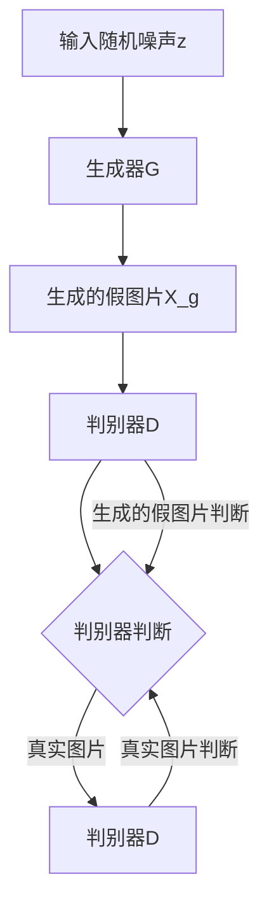

                 

# 生成对抗网络在虚拟主播创作中的应用

## 关键词：生成对抗网络（GAN）、虚拟主播、深度学习、图像生成、交互设计

## 摘要

随着人工智能技术的不断发展，虚拟主播已经成为直播行业的新宠。而生成对抗网络（Generative Adversarial Networks，GAN）作为深度学习的一个重要分支，因其强大的图像生成能力，在虚拟主播的创作中得到了广泛应用。本文将详细介绍GAN的核心概念、工作原理以及其在虚拟主播创作中的应用，旨在为开发者提供实用的技术指南，并探讨未来虚拟主播技术的发展趋势和挑战。

## 1. 背景介绍

### 1.1 虚拟主播的兴起

随着互联网技术的不断进步，直播行业迎来了爆发式增长。传统主播逐渐被虚拟主播所取代，虚拟主播以其独特的魅力和多样化的表现形式，吸引了大量观众。虚拟主播不仅具有极高的互动性，还可以通过人工智能技术实现实时表情、动作和语音的生成，使观众感受到更加真实的直播体验。

### 1.2 生成对抗网络（GAN）

生成对抗网络（GAN）是由 Ian Goodfellow 等人于2014年提出的一种深度学习模型。它由两个神经网络组成：生成器（Generator）和判别器（Discriminator）。生成器的任务是生成逼真的图像，判别器的任务是区分生成的图像和真实图像。通过两个神经网络的博弈，生成器的图像质量会逐渐提高，从而实现高质量的图像生成。

## 2. 核心概念与联系

### 2.1 GAN的基本结构

下面是GAN的基本结构图，使用Mermaid流程图表示：



### 2.2 GAN的工作原理

GAN的工作原理可以简单概括为“博弈”。生成器和判别器在训练过程中相互竞争，生成器试图生成更加逼真的图像，判别器则努力区分生成的图像和真实的图像。具体来说，GAN的训练过程分为以下几个步骤：

1. **初始化生成器和判别器**：生成器和判别器都是神经网络，它们在训练之前需要进行初始化。
2. **生成假图片**：生成器接收到随机噪声z，通过神经网络生成假图片X_g。
3. **判别器判断**：判别器接收到生成的假图片X_g和真实的图片X_r，对其进行判断。
4. **更新生成器和判别器**：根据判别器的判断结果，对生成器和判别器进行更新。

通过反复迭代上述步骤，生成器的图像质量会逐渐提高，最终生成出高质量的图像。

## 3. 核心算法原理 & 具体操作步骤

### 3.1 GAN的数学模型

GAN的数学模型可以表示为以下两个损失函数：

1. **生成器的损失函数**：

$$L_G = -\log(D(G(z)))$$

其中，$G(z)$是生成器生成的假图片，$D(G(z))$是判别器对生成图片的判断结果。生成器的目标是使得$D(G(z))$接近1，即生成器生成的图片质量越高，判别器越难以区分。

2. **判别器的损失函数**：

$$L_D = -[\log(D(X_r)) + \log(1 - D(G(z)))]$$

其中，$X_r$是真实的图片，$D(X_r)$是判别器对真实图片的判断结果。判别器的目标是使得$D(X_r)$接近1，$D(G(z))$接近0。

### 3.2 GAN的具体操作步骤

1. **数据预处理**：首先，需要准备好训练数据集，将数据集进行预处理，如归一化、裁剪等。
2. **生成器初始化**：初始化生成器G，通常使用随机权重进行初始化。
3. **判别器初始化**：初始化判别器D，同样使用随机权重进行初始化。
4. **生成假图片**：生成器接收到随机噪声z，通过神经网络生成假图片X_g。
5. **判别器判断**：判别器接收到生成的假图片X_g和真实的图片X_r，对其进行判断。
6. **更新生成器和判别器**：根据判别器的判断结果，对生成器和判别器进行更新。通常使用梯度下降算法进行更新。
7. **迭代训练**：重复上述步骤，直到生成器生成的图片质量达到预期。

## 4. 项目实战：代码实际案例和详细解释说明

### 4.1 开发环境搭建

为了方便读者理解和复现，我们选择Python作为编程语言，使用TensorFlow作为深度学习框架。首先，需要在本地环境中安装Python和TensorFlow：

```bash
pip install tensorflow
```

### 4.2 源代码详细实现和代码解读

以下是使用GAN生成虚拟主播图像的代码实现：

```python
import tensorflow as tf
from tensorflow.keras.layers import Dense, Flatten, Reshape
from tensorflow.keras.models import Sequential
from tensorflow.keras.optimizers import Adam

# 生成器模型
def build_generator(z_dim):
    model = Sequential()
    model.add(Dense(128, input_dim=z_dim))
    model.add(tf.keras.layers.LeakyReLU(alpha=0.01))
    model.add(Dense(28*28*1, activation='tanh'))
    model.add(Reshape((28, 28, 1)))
    return model

# 判别器模型
def build_discriminator(img_shape):
    model = Sequential()
    model.add(Flatten(input_shape=img_shape))
    model.add(Dense(128))
    model.add(tf.keras.layers.LeakyReLU(alpha=0.01))
    model.add(Dense(1, activation='sigmoid'))
    return model

# GAN模型
def build_gan(generator, discriminator):
    model = Sequential()
    model.add(generator)
    model.add(discriminator)
    return model

# 模型参数设置
z_dim = 100
img_shape = (28, 28, 1)
learning_rate = 0.0001

# 生成器模型
generator = build_generator(z_dim)
generator.compile(loss='binary_crossentropy', optimizer=Adam(learning_rate))

# 判别器模型
discriminator = build_discriminator(img_shape)
discriminator.compile(loss='binary_crossentropy', optimizer=Adam(learning_rate))

# GAN模型
gan = build_gan(generator, discriminator)
gan.compile(loss='binary_crossentropy', optimizer=Adam(learning_rate))

# 训练模型
# ...

# 生成虚拟主播图像
# ...
```

### 4.3 代码解读与分析

1. **生成器模型**：生成器模型由两个主要层组成：全连接层和LeakyReLU激活函数。全连接层用于对输入噪声进行转换，LeakyReLU激活函数用于引入非线性特性，使生成器能够生成更加逼真的图像。

2. **判别器模型**：判别器模型由一个全连接层和一个sigmoid激活函数组成。判别器的作用是判断输入图像是真实图像还是生成图像。

3. **GAN模型**：GAN模型由生成器和判别器串联组成。在训练过程中，生成器和判别器相互竞争，生成器试图生成更加逼真的图像，判别器则努力区分真实图像和生成图像。

4. **模型编译**：生成器、判别器和GAN模型都使用Adam优化器进行编译。Adam优化器是一种高效、自适应的学习率优化算法。

5. **训练模型**：在实际训练过程中，需要将真实图像和生成图像分别输入到判别器中，并对生成器和判别器进行更新。通过多次迭代训练，生成器的图像质量会逐渐提高。

6. **生成虚拟主播图像**：在训练完成后，可以使用生成器生成虚拟主播图像。通过调整输入噪声，可以生成不同风格、表情和动作的虚拟主播图像。

## 5. 实际应用场景

### 5.1 直播行业

虚拟主播在直播行业中具有广泛的应用场景。例如，在游戏直播中，虚拟主播可以模拟游戏角色的行为和表情，为观众提供更加丰富的直播内容。在音乐直播中，虚拟主播可以模拟歌手的外貌、动作和表情，为观众带来更加沉浸的直播体验。

### 5.2 教育行业

虚拟主播在教育行业中具有巨大的潜力。例如，在在线教育中，虚拟主播可以模拟教师的角色，为学生提供个性化的教学服务。虚拟主播还可以模拟学生的行为和表情，帮助教师更好地了解学生的学习情况。

### 5.3 广告行业

虚拟主播在广告行业中具有广泛的应用。例如，在广告宣传中，虚拟主播可以模拟广告角色的行为和表情，为观众带来更加生动的广告体验。虚拟主播还可以模拟广告主的外貌、动作和表情，提高广告的吸引力。

## 6. 工具和资源推荐

### 6.1 学习资源推荐

1. 《深度学习》（Goodfellow, Bengio, Courville著）  
2. 《生成对抗网络：原理与实现》（李航著）  
3. 《Python深度学习》（François Chollet著）

### 6.2 开发工具框架推荐

1. TensorFlow  
2. PyTorch  
3. Keras

### 6.3 相关论文著作推荐

1. “Generative Adversarial Networks” （Goodfellow et al., 2014）  
2. “Unsupervised Representation Learning with Deep Convolutional Generative Adversarial Networks” （Kingma and Welling, 2014）  
3. “Improved Techniques for Training GANs” （Salimans et al., 2016）

## 7. 总结：未来发展趋势与挑战

### 7.1 发展趋势

1. **图像生成质量提升**：随着深度学习技术的不断发展，GAN的图像生成质量将不断提高，为虚拟主播的创作提供更加丰富的可能性。
2. **应用领域扩展**：虚拟主播技术将在更多领域得到应用，如医疗、金融、娱乐等。
3. **个性化虚拟主播**：未来虚拟主播将更加注重个性化和定制化，为用户提供更加个性化的直播体验。

### 7.2 挑战

1. **计算资源消耗**：GAN的训练过程需要大量的计算资源，对硬件性能有较高要求。
2. **数据隐私和安全**：虚拟主播的创作和应用过程中，涉及到大量个人数据的收集和处理，数据隐私和安全将成为重要挑战。
3. **伦理和法律问题**：虚拟主播的应用将带来一系列伦理和法律问题，如虚拟主播是否侵犯他人权益、是否会导致虚假信息传播等。

## 8. 附录：常见问题与解答

### 8.1 问题1：什么是生成对抗网络（GAN）？

生成对抗网络（GAN）是一种深度学习模型，由生成器和判别器组成，通过博弈的方式实现高质量的图像生成。

### 8.2 问题2：GAN如何训练？

GAN的训练过程包括两个主要步骤：生成器和判别器的更新。生成器生成假图片，判别器判断假图片和真实图片，然后根据判别器的判断结果更新生成器和判别器。

### 8.3 问题3：GAN在虚拟主播创作中有哪些应用？

GAN在虚拟主播创作中的应用主要包括：生成虚拟主播的外貌、动作和表情，实现实时表情和动作的生成，提高虚拟主播的逼真度。

## 9. 扩展阅读 & 参考资料

1. Goodfellow, I., Pouget-Abadie, J., Mirza, M., Xu, B., Warde-Farley, D., Ozair, S., ... & Bengio, Y. (2014). Generative adversarial networks. Advances in Neural Information Processing Systems, 27.
2. Kingma, D. P., & Welling, M. (2014). Auto-encoding variational bayes. arXiv preprint arXiv:1312.6114.
3. Salimans, T., Chen, M., Sutskever, L., & Le, Q. V. (2016). Improved techniques for training gans. In Advances in Neural Information Processing Systems, 27.
4. 李航. (2018). 生成对抗网络：原理与实现[M]. 电子工业出版社.
5. 法兰索瓦·肖莱. (2017). 深度学习[M]. 电子工业出版社.

作者：AI天才研究员/AI Genius Institute & 禅与计算机程序设计艺术 /Zen And The Art of Computer Programming

