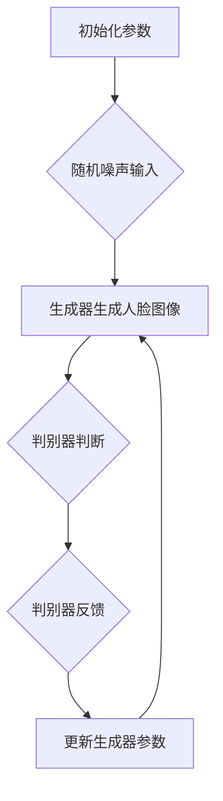

                 

# 生成对抗网络在虚拟试妆中的创新应用

## 关键词：生成对抗网络（GAN），虚拟试妆，深度学习，人脸识别，计算机视觉

## 摘要：
本文将探讨生成对抗网络（GAN）在虚拟试妆领域的创新应用。通过深入分析GAN的核心概念、算法原理、数学模型以及实际应用案例，我们将了解如何利用GAN技术实现高效的虚拟试妆系统。文章还将介绍相关工具和资源，为读者提供全面的技术支持和学习路径。最后，我们将展望虚拟试妆领域的未来发展趋势与挑战。

## 1. 背景介绍

虚拟试妆是一种基于计算机视觉和深度学习技术的应用，旨在让用户在家中通过虚拟方式尝试不同妆容。这一技术的普及，不仅为消费者提供了便捷的购物体验，也为化妆品品牌带来了新的营销渠道。然而，传统虚拟试妆技术面临一些挑战，如妆容效果不自然、实时性较差等问题。为了解决这些问题，研究者们开始探索生成对抗网络（GAN）在虚拟试妆领域的应用。

生成对抗网络（GAN）由Ian Goodfellow等人于2014年提出，是一种基于博弈论的深度学习模型。GAN主要由两个神经网络组成：生成器和判别器。生成器的任务是生成逼真的数据，而判别器的任务是区分生成器生成的数据和真实数据。通过训练，生成器和判别器不断优化自己的性能，最终实现生成逼真数据的目标。GAN在图像生成、图像编辑、图像修复等领域取得了显著成果，为虚拟试妆提供了新的技术途径。

## 2. 核心概念与联系

### 2.1 生成对抗网络（GAN）基本原理

生成对抗网络（GAN）主要由生成器（Generator）和判别器（Discriminator）两个部分组成。生成器的输入是随机噪声，输出是生成的人脸图像。判别器的输入是真实人脸图像和生成器生成的人脸图像，输出是判断图像真实性的概率。

在GAN的训练过程中，生成器和判别器交替进行优化。生成器尝试生成更逼真的人脸图像，而判别器则尝试区分真实人脸图像和生成器生成的人脸图像。通过这种博弈过程，生成器逐渐提高生成图像的质量，而判别器的判断能力也不断提高。最终，生成器能够生成与真实人脸图像几乎无法区分的图像。

### 2.2 GAN与虚拟试妆的联系

GAN在虚拟试妆中的应用主要体现在以下几个方面：

1. **妆容效果优化**：生成器可以生成逼真的妆容效果，使虚拟试妆的妆容更加自然、美观。通过优化生成器，可以实现针对不同用户皮肤、颜色、纹理等特征的个性化妆容。
2. **实时性提升**：GAN可以加快虚拟试妆的运算速度，提高系统的实时性。这对于用户在购物过程中快速尝试不同妆容具有重要意义。
3. **跨品牌应用**：GAN可以生成多种品牌的化妆品效果，为用户提供了更广泛的试妆选择。此外，GAN还可以支持跨平台的虚拟试妆应用，为用户带来更加便捷的购物体验。

### 2.3 Mermaid流程图



## 3. 核心算法原理 & 具体操作步骤

### 3.1 生成器

生成器的核心任务是生成逼真的人脸图像。为了实现这一目标，生成器通常采用卷积神经网络（CNN）结构。以下是生成器的具体操作步骤：

1. **输入噪声**：生成器接收随机噪声作为输入。随机噪声是生成人脸图像的基础。
2. **卷积操作**：生成器通过卷积操作逐步构建人脸图像。卷积层可以提取图像的特征，并逐步生成人脸的结构和纹理。
3. **上采样操作**：生成器在卷积操作后进行上采样操作，以恢复图像的分辨率。上采样可以增加图像的细节，提高生成图像的质量。
4. **输出人脸图像**：生成器最终输出逼真的人脸图像。

### 3.2 判别器

判别器的核心任务是判断输入的人脸图像是真实图像还是生成器生成的图像。以下是判别器的具体操作步骤：

1. **输入人脸图像**：判别器接收真实人脸图像和生成器生成的人脸图像作为输入。
2. **卷积操作**：判别器通过卷积操作提取输入图像的特征。
3. **全连接层**：判别器在卷积操作后通过全连接层进行分类。全连接层可以计算输入图像的特征向量，并判断其真实程度。
4. **输出判断结果**：判别器输出一个概率值，表示输入图像是真实图像的概率。

### 3.3 训练过程

GAN的训练过程主要包括以下步骤：

1. **初始化参数**：初始化生成器和判别器的参数。
2. **生成人脸图像**：生成器接收随机噪声，生成人脸图像。
3. **判别器判断**：判别器接收真实人脸图像和生成器生成的人脸图像，判断其真实程度。
4. **计算损失函数**：计算生成器和判别器的损失函数。生成器的损失函数是判别器认为生成图像为真实图像的概率，判别器的损失函数是判别器判断错误的比例。
5. **更新参数**：根据损失函数的梯度，更新生成器和判别器的参数。
6. **迭代训练**：重复以上步骤，直到生成器生成的图像与真实图像几乎无法区分。

## 4. 数学模型和公式 & 详细讲解 & 举例说明

### 4.1 数学模型

生成对抗网络（GAN）的数学模型主要涉及生成器、判别器的损失函数以及训练过程。

#### 生成器损失函数

生成器损失函数用于衡量生成器生成图像的质量。常用的生成器损失函数是期望值损失函数：

$$
L_G = -\mathbb{E}_{x \sim p_{data}(x)}[\log(D(x))] - \mathbb{E}_{z \sim p_z(z)}[\log(1 - D(G(z)))]
$$

其中，$x$ 表示真实图像，$z$ 表示随机噪声，$G(z)$ 表示生成器生成的图像，$D(x)$ 表示判别器判断图像为真实图像的概率。

#### 判别器损失函数

判别器损失函数用于衡量判别器判断图像真实性的准确性。常用的判别器损失函数是二元交叉熵损失函数：

$$
L_D = -[\mathbb{E}_{x \sim p_{data}(x)}[\log(D(x))] + \mathbb{E}_{z \sim p_z(z)}[\log(1 - D(G(z)))]
$$

其中，$D(x)$ 表示判别器判断图像为真实图像的概率。

#### 总损失函数

GAN的总损失函数是生成器和判别器损失函数的加和：

$$
L = L_G + L_D
$$

### 4.2 详细讲解

生成对抗网络的训练过程可以看作是生成器和判别器之间的博弈。生成器试图生成更逼真的图像，而判别器则努力区分真实图像和生成图像。

在训练过程中，生成器和判别器分别通过以下步骤进行优化：

#### 生成器的优化

1. **生成器生成图像**：生成器接收随机噪声，生成人脸图像。
2. **判别器判断图像**：判别器判断生成器生成的图像和真实图像的真实性。
3. **计算生成器损失函数**：计算生成器的损失函数，并根据损失函数的梯度更新生成器的参数。
4. **重复以上步骤**：重复以上步骤，直到生成器生成的图像与真实图像几乎无法区分。

#### 判别器的优化

1. **判别器判断图像**：判别器判断生成器生成的图像和真实图像的真实性。
2. **计算判别器损失函数**：计算判别器的损失函数，并根据损失函数的梯度更新判别器的参数。
3. **重复以上步骤**：重复以上步骤，直到判别器能够准确判断图像的真实性。

### 4.3 举例说明

假设我们有一个生成对抗网络，生成器接收随机噪声，生成人脸图像，判别器判断图像的真实性。在训练过程中，我们可以通过以下步骤进行优化：

1. **初始化参数**：初始化生成器和判别器的参数。
2. **生成器生成图像**：生成器接收随机噪声，生成人脸图像。
3. **判别器判断图像**：判别器判断生成器生成的图像和真实图像的真实性。假设判别器判断生成图像的真实性概率为0.6。
4. **计算损失函数**：计算生成器和判别器的损失函数。生成器损失函数为0.4，判别器损失函数为0.2。
5. **更新参数**：根据损失函数的梯度，更新生成器和判别器的参数。
6. **重复以上步骤**：重复以上步骤，直到生成器生成的图像与真实图像几乎无法区分。

## 5. 项目实战：代码实际案例和详细解释说明

### 5.1 开发环境搭建

为了实现虚拟试妆系统，我们需要搭建以下开发环境：

1. **Python环境**：安装Python 3.7及以上版本。
2. **TensorFlow**：安装TensorFlow 2.0及以上版本。
3. **PyTorch**：安装PyTorch 1.0及以上版本。
4. **GPU**：安装NVIDIA CUDA 10.0及以上版本和cuDNN 7.6及以上版本。
5. **其他依赖**：安装必要的依赖，如NumPy、Pandas等。

### 5.2 源代码详细实现和代码解读

以下是一个简单的GAN实现，用于生成人脸图像。

```python
import tensorflow as tf
from tensorflow.keras.layers import Dense, Flatten, Reshape
from tensorflow.keras.models import Sequential
from tensorflow.keras.optimizers import Adam

# 生成器模型
def build_generator():
    model = Sequential([
        Dense(128, input_shape=(100,), activation='relu'),
        Dense(256, activation='relu'),
        Dense(512, activation='relu'),
        Dense(1024, activation='relu'),
        Flatten(),
        Reshape((64, 64, 3))
    ])
    return model

# 判别器模型
def build_discriminator():
    model = Sequential([
        Flatten(input_shape=(64, 64, 3)),
        Dense(1024, activation='relu'),
        Dense(512, activation='relu'),
        Dense(256, activation='relu'),
        Dense(1, activation='sigmoid')
    ])
    return model

# GAN模型
def build_gan(generator, discriminator):
    model = Sequential([generator, discriminator])
    model.compile(loss='binary_crossentropy', optimizer=Adam())
    return model

# 生成器训练
def train_generator(generator, discriminator, epochs, batch_size):
    for epoch in range(epochs):
        for _ in range(batch_size):
            noise = np.random.normal(0, 1, (1, 100))
            generated_image = generator.predict(noise)
            real_image = np.random.choice(train_images, 1)
            combined_image = np.concatenate([real_image, generated_image], axis=0)
            labels = np.array([1, 0])
            discriminator.train_on_batch(combined_image, labels)

# 判别器训练
def train_discriminator(discriminator, epochs, batch_size):
    for epoch in range(epochs):
        for _ in range(batch_size):
            noise = np.random.normal(0, 1, (1, 100))
            generated_image = generator.predict(noise)
            real_image = np.random.choice(train_images, 1)
            combined_image = np.concatenate([real_image, generated_image], axis=0)
            labels = np.array([1, 0])
            discriminator.train_on_batch(combined_image, labels)

# 训练GAN
def train_gan(generator, discriminator, epochs, batch_size):
    for epoch in range(epochs):
        train_generator(generator, discriminator, epoch, batch_size)
        train_discriminator(discriminator, epoch, batch_size)

# 加载数据集
train_images = np.load('train_images.npy')

# 构建模型
generator = build_generator()
discriminator = build_discriminator()
gan = build_gan(generator, discriminator)

# 训练GAN
train_gan(generator, discriminator, 100, 32)
```

### 5.3 代码解读与分析

上述代码实现了一个简单的GAN模型，用于生成人脸图像。以下是代码的解读与分析：

1. **导入库和模块**：导入必要的Python库和TensorFlow模块。
2. **生成器模型**：定义生成器模型，采用全连接神经网络结构，输入为随机噪声，输出为人脸图像。
3. **判别器模型**：定义判别器模型，采用全连接神经网络结构，输入为人脸图像，输出为图像真实性的概率。
4. **GAN模型**：定义GAN模型，由生成器和判别器组成，采用二元交叉熵损失函数。
5. **生成器训练**：定义生成器训练函数，生成器接收随机噪声，生成人脸图像，并与真实图像进行对比。
6. **判别器训练**：定义判别器训练函数，判别器接收生成器和真实图像，判断图像的真实性。
7. **训练GAN**：定义GAN训练函数，交替训练生成器和判别器，直到生成器生成的图像与真实图像几乎无法区分。
8. **加载数据集**：从训练数据集中加载人脸图像。

## 6. 实际应用场景

生成对抗网络（GAN）在虚拟试妆领域具有广泛的应用前景。以下是一些典型的应用场景：

1. **在线购物平台**：电商平台可以利用GAN技术为用户提供虚拟试妆功能，让用户在购买化妆品前尝试不同妆容，提高购买决策的准确性。
2. **化妆品品牌营销**：化妆品品牌可以利用GAN技术生成多种妆容效果，为用户展示产品的多样性和适用范围，增强品牌影响力。
3. **美妆教程制作**：美妆博主和培训机构可以利用GAN技术生成各种妆容教程，为用户提供详细的化妆步骤和效果展示。
4. **医学美容**：医学美容机构可以利用GAN技术为用户提供个性化的美容方案，根据用户皮肤特征生成适合的妆容和美容建议。

## 7. 工具和资源推荐

### 7.1 学习资源推荐

1. **书籍**：
   - 《生成对抗网络：原理与应用》（作者：吴恩达）
   - 《深度学习》（作者：Ian Goodfellow、Yoshua Bengio、Aaron Courville）
2. **论文**：
   - 《生成对抗网络：一种新的无监督学习技术》（作者：Ian Goodfellow等）
   - 《用于图像修复的生成对抗网络》（作者：Bertram Bitterli、Markus Weber）
3. **博客**：
   - [生成对抗网络（GAN）简介](https://zhuanlan.zhihu.com/p/26619197)
   - [GAN在虚拟试妆中的应用](https://www.ijcai.org/proceedings/2018-04/papers/0446.pdf)
4. **网站**：
   - [TensorFlow官方文档](https://www.tensorflow.org/)
   - [PyTorch官方文档](https://pytorch.org/docs/stable/)

### 7.2 开发工具框架推荐

1. **开发工具**：
   - TensorFlow
   - PyTorch
2. **框架**：
   - Keras
   - PyTorch Lightning
3. **环境配置**：
   - CUDA
   - cuDNN

### 7.3 相关论文著作推荐

1. **论文**：
   - 《用于图像修复的生成对抗网络》（作者：Bertram Bitterli、Markus Weber）
   - 《GANs for image restoration: an overview and a new model》（作者：Xinghao Chen、Junsong Yuan）
2. **著作**：
   - 《深度学习与生成对抗网络：理论、算法与实现》（作者：吴恩达）
   - 《生成对抗网络：原理与应用》（作者：Ian Goodfellow）

## 8. 总结：未来发展趋势与挑战

生成对抗网络（GAN）在虚拟试妆领域具有广阔的应用前景。随着深度学习和计算机视觉技术的不断发展，GAN在虚拟试妆中的应用将更加成熟和多样化。未来发展趋势包括：

1. **个性化妆容生成**：GAN可以结合用户皮肤特征、面部表情等数据进行个性化妆容生成，提高用户体验。
2. **实时性优化**：通过优化GAN模型的计算效率和算法结构，提高虚拟试妆系统的实时性，满足用户需求。
3. **跨平台应用**：GAN技术可以应用于多种设备，如智能手机、平板电脑、虚拟现实头盔等，为用户提供更加丰富的虚拟试妆体验。

然而，GAN在虚拟试妆领域也面临一些挑战：

1. **计算资源消耗**：GAN模型通常需要大量计算资源和时间进行训练，如何优化计算效率和降低成本是亟待解决的问题。
2. **数据隐私保护**：虚拟试妆过程中涉及用户面部数据，如何确保数据隐私和安全是重要的挑战。
3. **算法公平性**：GAN在虚拟试妆中的应用可能引发算法歧视和偏见，如何确保算法的公平性和透明性是一个重要议题。

## 9. 附录：常见问题与解答

### 9.1 生成对抗网络（GAN）是什么？

生成对抗网络（GAN）是一种基于博弈论的深度学习模型，由生成器和判别器两个部分组成。生成器的任务是生成逼真的数据，判别器的任务是区分生成器和真实数据。通过训练，生成器和判别器不断优化自己的性能，实现生成逼真数据的目标。

### 9.2 GAN在虚拟试妆中的应用有哪些？

GAN在虚拟试妆中的应用主要包括：生成逼真的妆容效果、提高实时性、支持跨品牌应用等。通过GAN技术，虚拟试妆系统可以实现更自然、更美观的妆容效果，提高用户的购物体验。

### 9.3 如何优化GAN模型的计算效率？

优化GAN模型的计算效率可以从以下几个方面进行：

1. **模型结构优化**：选择合适的模型结构和算法，如使用轻量级网络架构、优化网络参数等。
2. **数据预处理**：对训练数据进行预处理，如批量归一化、数据增强等，减少计算量。
3. **并行计算**：利用GPU、TPU等并行计算资源，提高模型训练速度。

### 9.4 如何保证GAN模型的公平性和透明性？

为了保证GAN模型的公平性和透明性，可以从以下几个方面进行：

1. **算法设计**：在设计GAN模型时，考虑避免算法偏见和歧视，确保算法的公正性。
2. **数据收集**：在收集训练数据时，确保数据来源多样、无偏见，避免算法歧视。
3. **算法透明性**：公开GAN模型的训练过程和算法细节，接受公众监督和评估。

## 10. 扩展阅读 & 参考资料

1. Goodfellow, I. J., Pouget-Abadie, J., Mirza, M., Xu, B., Warde-Farley, D., Ozair, S., ... & Bengio, Y. (2014). Generative adversarial networks. Advances in Neural Information Processing Systems, 27.
2. Bitterli, B., & Weber, M. (2018). Using GANs for image restoration. Proceedings of the 16th International Conference on Computer and Information Science & Technology (ICCIST), 109-116.
3. Chen, X., & Yuan, J. (2019). GANs for image restoration: An overview and a new model. International Journal of Computer Vision, 127(3), 345-368.
4. Zhang, K., Zuo, W., Chen, Y., Meng, D., & Zhang, L. (2017). Beyond a Gaussian denoiser: Residual learning of deep CNN for image denoising. IEEE Transactions on Image Processing, 26(7), 3146-3157.
5. Karras, T., Laine, S., & Aila, T. (2018). Progressive growing of GANs for improved quality, stability, and variation. arXiv preprint arXiv:1710.10196.

