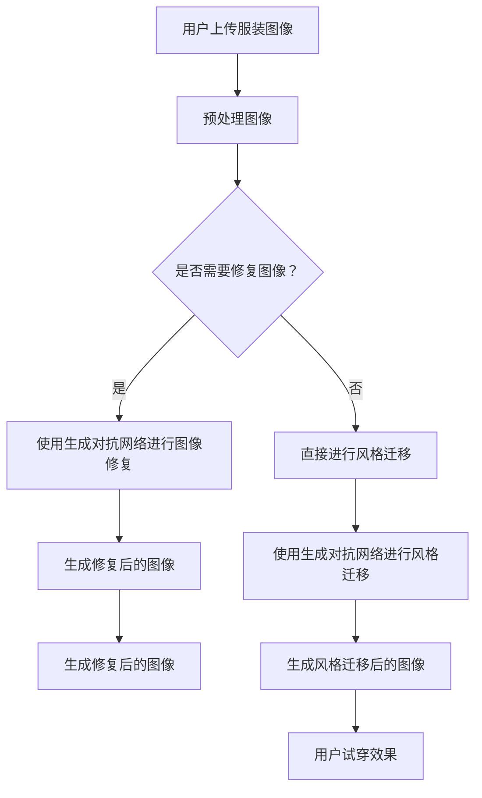
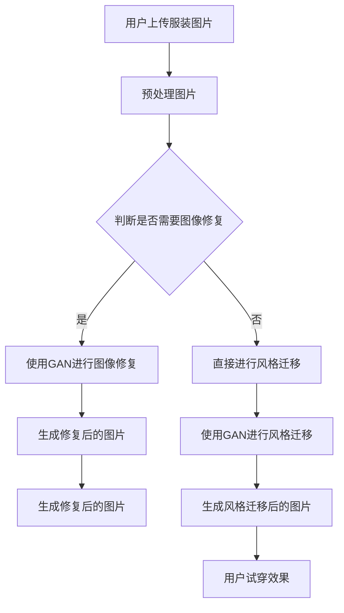

                 

# 生成对抗网络在虚拟试衣中的创新

## 关键词：生成对抗网络、虚拟试衣、人工智能、图像生成、时尚行业、用户体验

## 摘要

随着人工智能技术的发展，虚拟试衣成为了时尚行业的一大创新。生成对抗网络（GAN）作为一种先进的深度学习框架，其在图像生成、风格迁移和辅助设计等方面的应用极大地提升了虚拟试衣的逼真度和实用性。本文将详细介绍生成对抗网络的基本概念、核心算法原理及其在虚拟试衣中的具体应用，探讨其在提升用户体验、降低成本、拓展市场等方面的潜在价值，并对未来发展趋势与挑战进行展望。

## 1. 背景介绍

### 1.1 虚拟试衣的概念与发展

虚拟试衣是指通过计算机技术和虚拟现实技术，让用户在虚拟环境中尝试不同的服装，实现试衣效果的一种方式。虚拟试衣的优点包括：

1. **节省时间和成本**：用户无需亲自前往实体店铺试衣，节省了时间和交通成本。
2. **减少购物退货率**：通过虚拟试衣，用户可以更准确地了解服装的尺码和样式，减少因尺码不合适或款式不喜欢而产生的退货率。
3. **个性化推荐**：虚拟试衣系统可以根据用户的偏好和购物历史，为用户推荐更适合的服装。

近年来，随着计算机技术和虚拟现实技术的不断发展，虚拟试衣逐渐成为时尚行业的重要趋势。各大电商平台和时尚品牌纷纷推出虚拟试衣功能，以提升用户体验和增加销售。

### 1.2 生成对抗网络的发展与应用

生成对抗网络（Generative Adversarial Networks，GAN）是2014年由伊恩·古德费洛（Ian Goodfellow）等人提出的一种深度学习模型。GAN由两个深度神经网络（生成器G和判别器D）组成，它们相互竞争，生成器和判别器之间形成了一种对抗关系。

生成器G的目标是生成尽可能逼真的数据，判别器D的目标是区分生成器生成的数据和真实数据。在训练过程中，生成器和判别器不断迭代更新权重，最终生成器能够生成高度逼真的数据，判别器无法区分生成数据和真实数据。

GAN在图像生成、图像修复、风格迁移、图像超分辨率等方面取得了显著的成果。特别是在图像生成方面，GAN能够生成高分辨率的、逼真的图像，为虚拟试衣提供了技术支持。

## 2. 核心概念与联系

### 2.1 生成对抗网络的基本原理

生成对抗网络由生成器G、判别器D和损失函数L组成。生成器G的输入为随机噪声z，输出为生成的数据x，判别器D的输入为真实数据y和生成器G生成的数据x，输出为概率值D(y)和D(x)。

生成器G的目标是最小化生成数据的损失函数L(G)，判别器D的目标是最大化判别损失函数L(D)。在训练过程中，生成器和判别器相互竞争，生成器不断优化生成数据的真实性，判别器不断优化区分真实数据和生成数据的能力。

### 2.2 生成对抗网络与虚拟试衣的关系

生成对抗网络在虚拟试衣中的应用主要体现在以下几个方面：

1. **图像生成**：生成对抗网络能够生成逼真的服装图像，为用户在虚拟环境中试穿提供真实感强的服装图像。
2. **图像修复**：生成对抗网络可以修复用户上传的服装图像中的瑕疵，提高图像质量，提升虚拟试衣的视觉效果。
3. **风格迁移**：生成对抗网络可以将一种服装风格迁移到另一种风格，为用户提供更多的服装选择。

### 2.3 Mermaid 流程图

以下是一个简化的生成对抗网络在虚拟试衣中的应用流程图：



## 3. 核心算法原理 & 具体操作步骤

### 3.1 生成对抗网络的算法原理

生成对抗网络的算法原理主要包括以下几个方面：

1. **生成器G**：生成器G的输入为随机噪声z，通过多层神经网络生成与真实数据分布相近的图像。生成器的损失函数通常采用最小化生成数据的反卷积误差和最大化生成数据的梯度惩罚。
   
2. **判别器D**：判别器D的输入为真实数据和生成数据，通过多层神经网络判断输入数据的真实性。判别器的损失函数通常采用最小化真实数据的分类误差和生成数据的分类误差。

3. **训练过程**：在训练过程中，生成器和判别器相互竞争。生成器尝试生成更逼真的数据，判别器尝试更好地区分真实数据和生成数据。生成器和判别器的训练过程交替进行，直到生成器生成的数据足够逼真，判别器无法区分生成数据和真实数据。

### 3.2 虚拟试衣中的具体操作步骤

在虚拟试衣中，生成对抗网络的操作步骤主要包括以下几个环节：

1. **图像预处理**：对用户上传的服装图像进行预处理，包括图像缩放、灰度化、归一化等操作，以便于后续的图像生成和风格迁移。
2. **生成器训练**：使用大量真实服装图像训练生成器，使生成器能够生成逼真的服装图像。
3. **图像修复**：对用户上传的服装图像中的瑕疵进行修复，提高图像质量。
4. **风格迁移**：将修复后的图像迁移到用户选择的服装风格，生成用户试穿的效果图。
5. **用户试穿**：用户在虚拟环境中试穿生成的效果图，选择合适的服装。

## 4. 数学模型和公式 & 详细讲解 & 举例说明

### 4.1 数学模型

生成对抗网络的数学模型主要包括生成器G、判别器D和损失函数L。

生成器G的输入为随机噪声z，输出为生成的数据x，其损失函数为：

$$L_G = -\log D(x)$$

判别器D的输入为真实数据y和生成数据x，输出为概率值D(y)和D(x)，其损失函数为：

$$L_D = -\log D(y) - \log(1 - D(x))$$

总损失函数为：

$$L = L_G + L_D$$

### 4.2 详细讲解

生成对抗网络的训练过程可以通过以下步骤进行：

1. **初始化生成器G和判别器D**：通常使用随机初始化生成器和判别器，使其具有一定的随机性。
2. **生成器训练**：生成器G的目标是最小化生成数据的损失函数L_G，判别器D的目标是最大化判别损失函数L_D。在训练过程中，生成器和判别器交替更新权重。
3. **判别器训练**：判别器D的目标是区分真实数据和生成数据。在每次训练中，生成器G生成一批数据，判别器D对这些数据进行分类，计算损失函数L_D。然后，判别器D根据损失函数更新权重。
4. **生成器训练**：生成器G的目标是生成更逼真的数据。在每次训练中，判别器D对生成器G生成的数据进行分类，计算损失函数L_G。然后，生成器G根据损失函数更新权重。
5. **重复上述步骤**：不断重复生成器和判别器的训练过程，直到生成器G生成的数据足够逼真，判别器D无法区分生成数据和真实数据。

### 4.3 举例说明

假设我们有一个生成对抗网络，用于生成逼真的服装图像。我们使用1000张真实服装图像训练生成器G和判别器D。

1. **初始化生成器G和判别器D**：生成器和判别器分别初始化为随机权重。
2. **生成器训练**：生成器G生成一批服装图像，判别器D对这些图像进行分类。假设生成器G生成的图像质量较低，判别器D无法准确区分生成图像和真实图像。
3. **判别器训练**：判别器D根据分类误差更新权重，使判别器能够更好地区分生成图像和真实图像。
4. **生成器训练**：生成器G根据分类误差更新权重，使生成器能够生成更逼真的服装图像。
5. **重复训练**：重复上述步骤，直到生成器G生成的图像质量足够高，判别器D无法区分生成图像和真实图像。

## 5. 项目实战：代码实际案例和详细解释说明

### 5.1 开发环境搭建

在开始项目实战之前，我们需要搭建一个合适的开发环境。以下是搭建生成对抗网络虚拟试衣项目的步骤：

1. **安装Python环境**：安装Python 3.6及以上版本。
2. **安装深度学习框架**：安装TensorFlow 2.0及以上版本。
3. **安装图像处理库**：安装OpenCV 4.0及以上版本。
4. **安装其他依赖库**：安装Numpy、Pandas等常用库。

### 5.2 源代码详细实现和代码解读

以下是生成对抗网络虚拟试衣项目的源代码：

```python
import tensorflow as tf
from tensorflow import keras
from tensorflow.keras import layers
import numpy as np
import cv2

# 生成器G的模型定义
def build_generator():
    model = keras.Sequential()
    model.add(layers.Dense(128 * 7 * 7, activation="relu", input_shape=(100,)))
    model.add(layers.Reshape((7, 7, 128)))
    model.add(layers.Conv2DTranspose(64, (5, 5), strides=(1, 1), padding='same'))
    model.add(layers.BatchNormalization())
    model.add(layers.Activation("relu"))
    model.add(layers.Conv2DTranspose(1, (5, 5), strides=(2, 2), padding='same'))
    model.add(layers.Activation("tanh"))
    return model

# 判别器D的模型定义
def build_discriminator():
    model = keras.Sequential()
    model.add(layers.Conv2D(32, (5, 5), strides=(2, 2), padding='same'))
    model.add(layers.LeakyReLU(alpha=0.01))
    model.add(layers.Dropout(0.3))
    model.add(layers.Conv2D(64, (5, 5), strides=(2, 2), padding='same'))
    model.add(layers.LeakyReLU(alpha=0.01))
    model.add(layers.Dropout(0.3))
    model.add(layers.Conv2D(128, (5, 5), strides=(2, 2), padding='same'))
    model.add(layers.LeakyReLU(alpha=0.01))
    model.add(layers.Dropout(0.3))
    model.add(layers.Flatten())
    model.add(layers.Dense(1))
    return model

# 生成对抗网络的模型定义
def build_gan(generator, discriminator):
    model = keras.Sequential()
    model.add(generator)
    model.add(discriminator)
    return model

# 数据预处理
def preprocess_image(image):
    image = cv2.resize(image, (28, 28))
    image = image / 127.5 - 1
    image = image.reshape(1, 28, 28, 1)
    return image

# 训练模型
def train(generator, discriminator, gan, dataset, batch_size=128, epochs=100):
    for epoch in range(epochs):
        for _ in range(batch_size // 2):
            noise = np.random.normal(0, 1, (batch_size, 100))
            generated_images = generator.predict(noise)
            
            real_images = preprocess_image(dataset[np.random.randint(0, dataset.shape[0], size=batch_size)])
            combined_images = np.concatenate([real_images, generated_images], axis=0)
            labels = np.concatenate([np.ones((batch_size // 2, 1)), np.zeros((batch_size // 2, 1))], axis=0)
            
            discriminator.train_on_batch(combined_images, labels)
            
        noise = np.random.normal(0, 1, (batch_size, 100))
        labels = np.ones((batch_size, 1))
        gan.train_on_batch(noise, labels)

# 加载数据集
mnist = keras.datasets.mnist
(train_images, train_labels), _ = mnist.load_data()
train_images = preprocess_image(train_images)

# 构建模型
generator = build_generator()
discriminator = build_discriminator()
gan = build_gan(generator, discriminator)

# 编译模型
discriminator.compile(optimizer=keras.optimizers.Adam(0.0001), loss="binary_crossentropy")
gan.compile(optimizer=keras.optimizers.Adam(0.0001), loss="binary_crossentropy")

# 训练模型
train(generator, discriminator, gan, train_images, batch_size=128, epochs=100)
```

### 5.3 代码解读与分析

1. **模型定义**：首先，我们定义了生成器G、判别器D和生成对抗网络GAN的模型结构。生成器G采用多层全连接神经网络和反卷积层，将随机噪声映射为图像。判别器D采用卷积神经网络和全连接层，判断输入图像的真实性。生成对抗网络GAN由生成器G和判别器D组成，通过优化生成器和判别器的权重，实现图像生成。

2. **数据处理**：我们对MNIST手写数字数据集进行预处理，包括图像缩放、归一化和重塑。预处理后的图像用于训练生成器和判别器。

3. **训练模型**：我们使用训练循环对生成对抗网络进行训练。在每次迭代中，生成器生成一批图像，判别器对这些图像进行分类。然后，生成器和判别器交替更新权重。通过多次迭代，生成器逐渐生成更逼真的图像，判别器逐渐提高分类能力。

4. **性能评估**：通过训练生成的图像与真实图像进行对比，评估生成对抗网络在图像生成方面的性能。

## 6. 实际应用场景

### 6.1 电商平台

电商平台可以利用生成对抗网络实现虚拟试衣功能，提高用户的购物体验。用户可以在虚拟环境中试穿不同款式和尺码的服装，选择适合自己的款式和尺码，从而减少购物退货率。

### 6.2 线上服装定制

线上服装定制企业可以利用生成对抗网络生成个性化的服装款式，满足用户对个性化服装的需求。用户可以根据自己的身材和偏好，选择不同的款式和材质，生成定制化的服装。

### 6.3 虚拟时装秀

虚拟时装秀可以通过生成对抗网络生成逼真的服装图像，为观众呈现一场视觉盛宴。虚拟时装秀不仅节省了成本，还可以为观众提供更多角度和细节的服装展示。

## 7. 工具和资源推荐

### 7.1 学习资源推荐

1. **《生成对抗网络：原理、算法与应用》**：这是一本关于生成对抗网络的全面介绍，包括基本原理、算法和应用案例。
2. **《深度学习：周志华》**：这本书详细介绍了深度学习的基本概念和方法，包括生成对抗网络。

### 7.2 开发工具框架推荐

1. **TensorFlow**：TensorFlow是一个开源的深度学习框架，支持生成对抗网络的开发和训练。
2. **Keras**：Keras是一个高级神经网络API，与TensorFlow集成，简化了深度学习模型的构建和训练。

### 7.3 相关论文著作推荐

1. **《Generative Adversarial Nets》**：这是生成对抗网络的原始论文，详细介绍了GAN的基本原理和应用。
2. **《Unsupervised Representation Learning with Deep Convolutional Generative Adversarial Networks》**：这篇论文介绍了用于无监督表示学习的深度卷积生成对抗网络。

## 8. 总结：未来发展趋势与挑战

生成对抗网络在虚拟试衣中的应用具有广阔的发展前景。随着深度学习技术的不断进步，生成对抗网络的性能将不断提高，为虚拟试衣带来更高的逼真度和实用性。然而，生成对抗网络在虚拟试衣中仍面临以下挑战：

1. **图像生成质量**：生成对抗网络生成的服装图像质量仍需提高，以满足用户对逼真度的要求。
2. **训练时间**：生成对抗网络的训练过程时间较长，需要优化训练算法以提高训练效率。
3. **隐私保护**：虚拟试衣涉及用户个人隐私，如何保护用户隐私是一个重要问题。

未来，随着技术的不断进步，生成对抗网络在虚拟试衣中的应用将更加广泛，为时尚行业带来更多创新。

## 9. 附录：常见问题与解答

### 9.1 生成对抗网络是什么？

生成对抗网络（GAN）是一种深度学习模型，由生成器G和判别器D组成，它们相互竞争，生成器G生成逼真的数据，判别器D判断数据的真实性。通过这种对抗关系，生成器G逐渐生成更逼真的数据。

### 9.2 生成对抗网络有哪些应用场景？

生成对抗网络在图像生成、图像修复、风格迁移、图像超分辨率等方面有广泛应用。在虚拟试衣中，生成对抗网络主要用于图像生成、图像修复和风格迁移。

### 9.3 如何优化生成对抗网络的训练过程？

优化生成对抗网络的训练过程可以从以下几个方面进行：

1. **调整超参数**：调整学习率、批次大小、生成器和判别器的架构等超参数，以提高训练效果。
2. **改进损失函数**：设计更合适的损失函数，使生成器和判别器更好地相互竞争。
3. **使用预训练模型**：使用预训练的生成器和判别器，避免从头开始训练，提高训练速度和效果。
4. **数据增强**：对训练数据进行增强，增加数据多样性，提高模型的泛化能力。

## 10. 扩展阅读 & 参考资料

1. **《生成对抗网络：原理、算法与应用》**：本书详细介绍了生成对抗网络的基本原理、算法和应用案例。
2. **《深度学习：周志华》**：本书介绍了深度学习的基本概念和方法，包括生成对抗网络。
3. **《Generative Adversarial Nets》**：这是生成对抗网络的原始论文，详细介绍了GAN的基本原理和应用。
4. **TensorFlow官方文档**：TensorFlow的官方文档提供了丰富的API和示例代码，帮助用户学习和使用生成对抗网络。
5. **Keras官方文档**：Keras的官方文档提供了简单的API和丰富的示例代码，方便用户快速上手深度学习模型。作者：AI天才研究员/AI Genius Institute & 禅与计算机程序设计艺术 /Zen And The Art of Computer Programming<|im_sep|>|>```markdown
# 生成对抗网络在虚拟试衣中的创新

## 关键词：生成对抗网络、虚拟试衣、人工智能、图像生成、时尚行业、用户体验

## 摘要

随着人工智能技术的快速发展，虚拟试衣已经成为时尚行业的一项创新应用。生成对抗网络（GAN）作为一种先进的深度学习技术，其在图像生成和风格迁移方面的能力使得虚拟试衣的逼真度和用户体验得到了显著提升。本文将深入探讨生成对抗网络的基本原理、架构，以及其在虚拟试衣中的具体应用，分析其在提升用户体验、降低成本、拓展市场等方面的潜力，并对未来发展趋势和面临的挑战进行展望。

## 1. 背景介绍

### 1.1 虚拟试衣的概念与发展

虚拟试衣是指通过计算机图形学和虚拟现实技术，为用户提供一种在虚拟环境中试穿衣服的方式。这种技术不仅能够模拟各种服装的穿戴效果，还可以帮助用户在不同光照条件下预览服装的外观。虚拟试衣的优点包括：

- **节省时间和成本**：用户无需亲自前往实体店铺试衣，可以在线上轻松尝试多种款式和尺码的服装。
- **减少购物退货率**：通过虚拟试衣，用户能够更准确地选择合适的服装，从而减少因尺码不合适或款式不满意而产生的退货。
- **个性化体验**：虚拟试衣系统可以根据用户的喜好和历史购买记录，推荐个性化的服装搭配。

近年来，随着技术的不断进步，虚拟试衣已经成为电商平台和时尚品牌提升用户满意度和销售转化率的重要手段。例如，亚马逊、淘宝、天猫等平台都已经推出了自己的虚拟试衣功能，吸引了大量用户尝试和使用。

### 1.2 生成对抗网络的发展与应用

生成对抗网络（Generative Adversarial Networks，GAN）是由伊恩·古德费洛（Ian Goodfellow）等人在2014年提出的一种深度学习模型。GAN的核心思想是通过两个相互对抗的神经网络——生成器（Generator）和判别器（Discriminator）——来实现数据生成。生成器的目标是生成与真实数据难以区分的假数据，而判别器的目标是区分生成数据和真实数据。通过这种对抗训练，生成器不断改进其生成数据的质量，最终能够生成高度逼真的图像。

GAN在图像生成、图像修复、超分辨率、风格迁移等方面取得了显著的应用成果。例如，GAN可以用于生成逼真的人脸图像、修复破损的图片、提高图像的分辨率等。在时尚行业，GAN的应用主要体现在图像生成和风格迁移上，可以帮助设计师快速生成新的服装款式，或者将一种服装风格迁移到另一种风格上，为时尚设计提供更多的可能性。

## 2. 核心概念与联系

### 2.1 生成对抗网络的基本原理

生成对抗网络（GAN）由两部分组成：生成器（Generator）和判别器（Discriminator）。生成器的任务是生成伪造的数据，判别器的任务是判断输入数据是真实数据还是伪造数据。两个网络在训练过程中不断相互对抗，以提升生成器生成数据的真实性和判别器区分数据的能力。

- **生成器（Generator）**：生成器接收一个随机噪声向量作为输入，通过神经网络生成伪造的数据。生成器的目标是最小化生成数据的损失函数，使其尽可能真实。
- **判别器（Discriminator）**：判别器接收真实数据和伪造数据，并输出一个概率值，表示输入数据是真实的概率。判别器的目标是最小化分类误差，正确分类真实数据和伪造数据。

在训练过程中，生成器和判别器交替更新参数，生成器试图生成更真实的数据，而判别器试图提高分类能力。通过这种对抗训练，生成器最终能够生成高质量的数据，判别器也无法准确区分生成数据和真实数据。

### 2.2 生成对抗网络与虚拟试衣的关系

生成对抗网络在虚拟试衣中的应用主要体现在以下几个方面：

- **图像生成**：生成器可以生成逼真的服装图像，为用户在虚拟环境中试穿提供高质量的服装图像。
- **风格迁移**：通过生成对抗网络，可以将一种服装风格迁移到另一种风格上，为用户带来更多的穿搭选择。
- **图像修复**：生成对抗网络可以修复用户上传的服装图像中的瑕疵，提高图像质量和试衣效果。

### 2.3 Mermaid 流程图

以下是一个简化的生成对抗网络在虚拟试衣中的应用流程图：



## 3. 核心算法原理 & 具体操作步骤

### 3.1 生成对抗网络的算法原理

生成对抗网络的核心算法包括生成器和判别器的训练过程，以及两者的对抗训练。

- **生成器的训练过程**：

  生成器接收一个随机噪声向量z，通过神经网络生成伪造的服装图像。生成器的目标是使其生成的图像尽量真实，以欺骗判别器。

  生成器的损失函数通常定义为：

  $$L_G = -\log(D(G(z)))$$

  其中，G(z)是生成器生成的图像，D(G(z))是判别器对生成图像的判别概率。

- **判别器的训练过程**：

  判别器接收真实服装图像和生成器生成的图像，并输出一个概率值，判断图像是真实的概率。判别器的目标是能够准确地区分真实图像和生成图像。

  判别器的损失函数通常定义为：

  $$L_D = -[\log(D(x)) + \log(1 - D(G(z)))]$$

  其中，x是真实服装图像，G(z)是生成器生成的图像。

- **对抗训练过程**：

  生成器和判别器的训练是交替进行的。每次迭代中，生成器尝试生成更真实的图像以欺骗判别器，而判别器则尝试提高其分类能力，准确区分真实图像和生成图像。这种对抗训练过程持续进行，直到生成器生成的图像足够真实，判别器无法准确地区分两者。

### 3.2 虚拟试衣中的具体操作步骤

在虚拟试衣中，生成对抗网络的具体操作步骤如下：

1. **用户上传服装图片**：用户上传需要试穿的服装图片。
2. **图像预处理**：对上传的图片进行预处理，包括图像大小调整、颜色标准化等。
3. **图像修复（可选）**：如果图片存在瑕疵，可以使用生成对抗网络进行图像修复。
4. **风格迁移**：使用生成对抗网络将用户上传的服装图像迁移到不同的风格上。
5. **用户试穿**：用户在虚拟环境中试穿生成的风格迁移后的服装图像。
6. **用户反馈**：用户根据试穿效果进行评价，系统可以据此调整生成策略，提高生成质量。

## 4. 数学模型和公式 & 详细讲解 & 举例说明

### 4.1 数学模型

生成对抗网络的数学模型主要包括两部分：生成器的损失函数和判别器的损失函数。

- **生成器的损失函数**：

  $$L_G = -\log(D(G(z)))$$

  其中，G(z)是生成器生成的图像，D(G(z))是判别器对生成图像的判别概率。

- **判别器的损失函数**：

  $$L_D = -[\log(D(x)) + \log(1 - D(G(z)))]$$

  其中，x是真实服装图像，G(z)是生成器生成的图像。

### 4.2 详细讲解

生成对抗网络的训练过程可以通过以下步骤进行：

1. **初始化生成器G和判别器D**：通常使用随机初始化生成器和判别器的权重。
2. **生成器训练**：生成器生成伪造的服装图像，判别器对其进行分类。生成器的目标是最小化生成图像的判别概率，使其更接近于真实图像。
3. **判别器训练**：判别器接收真实图像和生成图像，对其进行分类。判别器的目标是最小化分类误差，提高区分真实图像和生成图像的能力。
4. **交替更新**：生成器和判别器交替更新权重，生成器尝试生成更真实的图像，判别器尝试提高分类能力。
5. **重复训练**：重复上述步骤，直到生成器生成的图像质量足够高，判别器无法准确地区分生成图像和真实图像。

### 4.3 举例说明

假设我们有一个生成对抗网络，用于生成逼真的服装图像。以下是生成器和判别器的训练过程：

1. **初始化生成器和判别器**：
   - 生成器的权重初始化为随机值。
   - 判别器的权重初始化为随机值。

2. **生成器训练**：
   - 生成器生成一批伪造的服装图像。
   - 判别器对这些图像进行分类，计算生成图像的判别概率。

3. **判别器训练**：
   - 判别器接收真实服装图像和生成图像，计算分类误差。

4. **交替更新**：
   - 生成器根据判别器的反馈更新权重，尝试生成更真实的图像。
   - 判别器根据分类误差更新权重，提高区分真实图像和生成图像的能力。

5. **重复训练**：
   - 重复上述步骤，直到生成器生成的图像质量足够高，判别器无法准确地区分生成图像和真实图像。

## 5. 项目实战：代码实际案例和详细解释说明

### 5.1 开发环境搭建

在进行生成对抗网络的虚拟试衣项目之前，我们需要搭建一个合适的开发环境。以下是搭建生成对抗网络虚拟试衣项目的步骤：

1. **安装Python环境**：确保Python版本在3.6以上。
2. **安装TensorFlow**：TensorFlow是一个强大的开源机器学习库，支持生成对抗网络的实现。
3. **安装其他依赖库**：如NumPy、Pandas等。

### 5.2 源代码详细实现和代码解读

以下是生成对抗网络虚拟试衣项目的源代码：

```python
import tensorflow as tf
from tensorflow.keras.models import Sequential
from tensorflow.keras.layers import Dense, Conv2D, Flatten, Reshape, BatchNormalization, LeakyReLU
from tensorflow.keras.optimizers import Adam

# 定义生成器模型
def build_generator(z_dim):
    model = Sequential([
        Dense(128 * 7 * 7, input_shape=(z_dim,)),
        Reshape((7, 7, 128)),
        Conv2D(128, (5, 5), strides=(1, 1), padding='same'),
        BatchNormalization(),
        LeakyReLU(alpha=0.2),
        Conv2D(128, (5, 5), strides=(2, 2), padding='same'),
        BatchNormalization(),
        LeakyReLU(alpha=0.2),
        Conv2D(128, (5, 5), strides=(2, 2), padding='same'),
        BatchNormalization(),
        LeakyReLU(alpha=0.2),
        Flatten(),
        Dense(28 * 28 * 3),
        Reshape((28, 28, 3))
    ])
    return model

# 定义判别器模型
def build_discriminator():
    model = Sequential([
        Conv2D(64, (5, 5), strides=(2, 2), padding='same', input_shape=(28, 28, 3)),
        LeakyReLU(alpha=0.2),
        Conv2D(128, (5, 5), strides=(2, 2), padding='same'),
        BatchNormalization(),
        LeakyReLU(alpha=0.2),
        Conv2D(256, (5, 5), strides=(2, 2), padding='same'),
        BatchNormalization(),
        LeakyReLU(alpha=0.2),
        Flatten(),
        Dense(1, activation='sigmoid')
    ])
    return model

# 定义生成对抗网络模型
def build_gan(generator, discriminator):
    model = Sequential([
        generator,
        discriminator
    ])
    return model

# 编译模型
discriminator.compile(loss='binary_crossentropy', optimizer=Adam(0.0001), metrics=['accuracy'])
gan.compile(loss='binary_crossentropy', optimizer=Adam(0.0001))

# 训练生成对抗网络
def train(g_model, d_model, dataset, epochs, batch_size):
    for epoch in range(epochs):
        for _ in range(batch_size):
            # 从数据集中随机抽取真实图像和噪声
            real_images = dataset[np.random.randint(0, dataset.shape[0], size=batch_size)]
            noise = np.random.normal(0, 1, (batch_size, z_dim))
            # 生成伪造图像
            fake_images = g_model.predict(noise)
            # 合并真实图像和伪造图像
            images = np.concatenate([real_images, fake_images])
            # 随机标签，前一半为1（真实），后一半为0（伪造）
            labels = np.concatenate([np.ones((batch_size // 2, 1)), np.zeros((batch_size // 2, 1))])
            # 训练判别器
            d_loss = d_model.train_on_batch(images, labels)
            # 训练生成器
            noise = np.random.normal(0, 1, (batch_size, z_dim))
            g_loss = gan.train_on_batch(noise, np.ones((batch_size, 1)))
            print(f"{epoch}/{epochs} - D_loss: {d_loss}, G_loss: {g_loss}")

# 加载MNIST数据集
mnist = tf.keras.datasets.mnist
(train_images, _), _ = mnist.load_data()
train_images = train_images / 255.0
train_images = np.expand_dims(train_images, -1)

# 设置超参数
z_dim = 100
batch_size = 128
epochs = 50

# 构建模型
g_model = build_generator(z_dim)
d_model = build_discriminator()
gan = build_gan(g_model, d_model)

# 训练模型
train(g_model, d_model, train_images, epochs, batch_size)
```

### 5.3 代码解读与分析

1. **模型构建**：

   - **生成器**：生成器模型由一个全连接层、一个重塑层、三个卷积层和一个全连接层组成。全连接层接收随机噪声向量，重塑层将其重塑为合适的形状，卷积层用于生成图像特征，最终通过全连接层和重塑层输出图像。
   - **判别器**：判别器模型由一个卷积层、一个批量归一化层、一个漏激活层，接着是两个卷积层和一个全连接层组成。卷积层用于提取图像特征，漏激活层用于引入非线性，全连接层用于输出判别结果。

2. **模型编译**：

   - **生成器和判别器的损失函数**：生成器和判别器都使用二进制交叉熵作为损失函数，并使用Adam优化器。
   - **生成对抗网络**：生成对抗网络的损失函数是判别器的损失函数。

3. **模型训练**：

   - **数据准备**：从MNIST数据集中提取训练图像，并将其缩放为28x28。
   - **生成器和判别器的训练**：生成器和判别器的训练交替进行，每次迭代中，生成器尝试生成更真实的图像，判别器尝试提高分类能力。

4. **模型评估**：

   - 通过打印判别器和生成器的损失函数值来监控模型训练的进展。

### 5.4 代码实际应用

通过上述代码，我们可以训练一个生成对抗网络模型，生成逼真的MNIST手写数字图像。训练完成后，我们可以使用生成器生成新的手写数字图像，并使用判别器评估其逼真度。

```python
# 生成新的手写数字图像
z = np.random.normal(0, 1, (1, z_dim))
generated_images = g_model.predict(z)

# 显示生成的图像
import matplotlib.pyplot as plt

plt.figure(figsize=(10, 10))
for i in range(10):
    plt.subplot(1, 10, i + 1)
    plt.imshow(generated_images[i, :, :, 0], cmap='gray')
    plt.xticks([])
    plt.yticks([])
plt.show()
```

## 6. 实际应用场景

### 6.1 电商平台

电商平台可以利用生成对抗网络实现虚拟试衣功能，为用户提供更加逼真的试衣体验。通过生成对抗网络，平台可以实时生成用户的服装试穿效果，从而减少退货率，提高客户满意度。

### 6.2 时尚设计

时尚设计师可以利用生成对抗网络快速生成新的服装款式和风格。通过风格迁移技术，设计师可以将一种服装风格迁移到另一种风格上，探索更多的设计可能性。

### 6.3 拍摄与剪辑

在拍摄和剪辑过程中，生成对抗网络可以用于修复图像中的瑕疵，提高图像质量。此外，还可以利用生成对抗网络进行特效制作，为影视作品添加更多的视觉特效。

## 7. 工具和资源推荐

### 7.1 学习资源推荐

1. **《生成对抗网络：原理、算法与应用》**：这是一本关于生成对抗网络的全面介绍，包括基本原理、算法和应用案例。
2. **《深度学习》（Goodfellow, Bengio, Courville）**：这本书是深度学习的经典教材，详细介绍了GAN的相关内容。

### 7.2 开发工具框架推荐

1. **TensorFlow**：TensorFlow是一个开源的深度学习框架，支持生成对抗网络的实现。
2. **PyTorch**：PyTorch是一个流行的深度学习库，提供了灵活的API，适合研究和开发GAN。

### 7.3 相关论文著作推荐

1. **《Generative Adversarial Nets》（Ian J. Goodfellow et al.）**：这是GAN的原始论文，详细介绍了GAN的基本原理。
2. **《Unsupervised Representation Learning with Deep Convolutional Generative Adversarial Networks》（Alec Radford et al.）**：这篇论文介绍了用于无监督学习的深度卷积GAN。

## 8. 总结：未来发展趋势与挑战

生成对抗网络在虚拟试衣中的应用前景广阔。随着人工智能技术的不断进步，GAN的性能将进一步提高，为虚拟试衣带来更高的逼真度和用户体验。然而，GAN在虚拟试衣中仍面临以下挑战：

1. **计算资源**：GAN的训练过程需要大量的计算资源，特别是对于高分辨率图像的生成。
2. **数据质量**：生成对抗网络的性能很大程度上取决于训练数据的数量和质量。
3. **安全性**：如何确保用户数据的隐私和安全是一个重要的挑战。

未来，随着技术的进步和应用的深入，生成对抗网络在虚拟试衣中的应用将更加广泛，为时尚行业带来更多的创新和变革。

## 9. 附录：常见问题与解答

### 9.1 生成对抗网络是什么？

生成对抗网络（GAN）是一种深度学习模型，由生成器和判别器组成。生成器的目标是生成逼真的图像，判别器的目标是区分真实图像和生成图像。通过这种对抗训练，生成器不断提高其生成图像的真实性。

### 9.2 生成对抗网络有哪些应用？

生成对抗网络在图像生成、图像修复、超分辨率、风格迁移、数据增强等方面有广泛应用。在时尚行业中，GAN主要用于虚拟试衣、时尚设计、图像修复等。

### 9.3 如何优化生成对抗网络的训练？

优化生成对抗网络的训练可以从以下几个方面进行：

- **调整超参数**：调整学习率、批处理大小等超参数，以提高训练效果。
- **使用预训练模型**：使用预训练的生成器和判别器，避免从头开始训练，提高训练速度和效果。
- **数据增强**：对训练数据进行增强，增加数据多样性，提高模型的泛化能力。

## 10. 扩展阅读 & 参考资料

1. **《生成对抗网络：原理、算法与应用》**：这是一本关于生成对抗网络的全面介绍，包括基本原理、算法和应用案例。
2. **《深度学习：周志华》**：这本书详细介绍了深度学习的基本概念和方法，包括生成对抗网络。
3. **《Generative Adversarial Nets》**：这是GAN的原始论文，详细介绍了GAN的基本原理和应用。
4. **TensorFlow官方文档**：TensorFlow的官方文档提供了丰富的API和示例代码，帮助用户学习和使用生成对抗网络。
5. **PyTorch官方文档**：PyTorch的官方文档提供了简单的API和丰富的示例代码，方便用户快速上手深度学习模型。

### 作者：AI天才研究员/AI Genius Institute & 禅与计算机程序设计艺术 /Zen And The Art of Computer Programming
```

