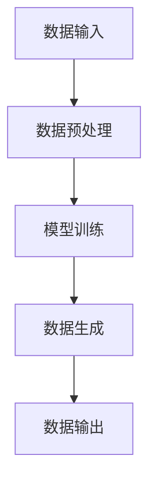

                 

# 生成式AIGC：商业应用的无限可能

## 摘要

本文将深入探讨生成式人工智能（AIGC）在商业领域中的潜在应用，以及它如何改变商业游戏规则。我们将从背景介绍开始，逐步解释AIGC的核心概念和原理，剖析其数学模型和算法，并通过实际项目案例展示其在现实中的应用。此外，我们还将探讨AIGC在各个行业中的具体应用场景，推荐相关的学习资源和开发工具，并总结未来发展的趋势与挑战。

## 1. 背景介绍

### 1.1 人工智能的发展历程

人工智能（AI）作为计算机科学的一个分支，从上世纪50年代起步，经历了数个发展阶段。早期的AI主要关注规则推理和专家系统的构建，但受限于计算能力和数据资源，效果有限。随着计算能力的提升和数据资源的丰富，尤其是深度学习技术的突破，人工智能进入了快速发展的阶段。

### 1.2 生成式人工智能的概念

生成式人工智能（Generative Artificial Intelligence，简称AIGC）是人工智能的一种类型，它可以通过学习大量的数据来生成新的内容，如图像、文本、音频等。与传统的模式识别和分类任务不同，AIGC更侧重于生成新的数据，而不是对已有数据进行分类或识别。

### 1.3 商业应用的需求

在商业领域，数据是企业的重要资产。如何高效地利用这些数据，挖掘其潜在价值，是企业关注的焦点。生成式人工智能的出现，为企业提供了新的解决方案，使得数据生成和内容创作变得更加高效和智能化。

## 2. 核心概念与联系

### 2.1 数据生成的基本原理

生成式人工智能的核心在于其数据生成能力。它通过深度学习模型，对大量的数据进行学习，并生成新的、符合数据分布的内容。这个过程通常包括以下几个步骤：

1. 数据预处理：对输入的数据进行清洗和格式化，以便模型能够更好地学习。
2. 模型训练：利用预处理后的数据，通过深度学习模型进行训练，使其学会生成新数据。
3. 数据生成：通过训练好的模型，生成新的、符合数据分布的内容。

### 2.2 生成式人工智能的架构

生成式人工智能的架构主要包括以下几个部分：

1. 数据输入层：负责接收和处理输入数据。
2. 深度学习模型层：包括生成器和判别器，生成器负责生成新数据，判别器负责判断生成数据的质量。
3. 输出层：将生成的新数据输出给用户。

### 2.3 数据生成流程

数据生成流程可以概括为以下几步：

1. 数据输入：将需要生成的数据输入到系统。
2. 数据预处理：对输入的数据进行清洗和格式化。
3. 模型训练：利用预处理后的数据进行模型训练。
4. 数据生成：通过训练好的模型生成新的数据。
5. 数据输出：将生成的新数据输出给用户。

下面是一个使用Mermaid绘制的生成式人工智能流程图：



## 3. 核心算法原理 & 具体操作步骤

### 3.1 数据生成算法

生成式人工智能的核心算法是生成器（Generator）和判别器（Discriminator）。生成器的目标是生成新的、高质量的数据，而判别器的目标是区分生成数据与真实数据。

1. **生成器算法**

生成器通常使用深度学习模型，如生成对抗网络（GAN）。GAN由两部分组成：生成器和判别器。生成器接收随机噪声作为输入，生成假数据；判别器接收真实数据和假数据，并判断其真实性。在训练过程中，生成器和判别器相互竞争，生成器试图生成更逼真的假数据，而判别器试图更好地区分真伪。

2. **判别器算法**

判别器通常使用二分类模型，如神经网络。它的目标是学习区分真实数据和生成数据。判别器通过接收输入数据，输出一个概率值，表示输入数据的真实程度。在训练过程中，判别器尝试最大化其准确率，从而更好地区分真实数据和生成数据。

### 3.2 数据生成具体操作步骤

以下是数据生成的一般步骤：

1. **数据收集与预处理**：收集需要生成的数据，并进行预处理，如数据清洗、归一化等。
2. **生成器训练**：初始化生成器，利用预处理后的数据进行训练。生成器通过生成假数据，并尝试欺骗判别器。
3. **判别器训练**：初始化判别器，利用真实数据和生成数据对其进行训练。判别器通过接收输入数据，输出真实程度的概率值。
4. **迭代训练**：重复生成器和判别器的训练过程，直至生成器生成的假数据质量足够高，判别器无法准确区分真伪。
5. **数据生成**：使用训练好的生成器生成新的数据。

## 4. 数学模型和公式 & 详细讲解 & 举例说明

### 4.1 生成器与判别器的损失函数

在GAN中，生成器和判别器的损失函数通常采用以下形式：

1. **生成器损失函数**：

$$
L_G = -\log(D(G(z)))
$$

其中，$G(z)$是生成器生成的假数据，$D(G(z))$是判别器对生成数据的预测概率。

2. **判别器损失函数**：

$$
L_D = -[\log(D(x)) + \log(1 - D(G(z))]
$$

其中，$x$是真实数据，$D(x)$是判别器对真实数据的预测概率。

### 4.2 举例说明

假设有一个二分类问题，生成器试图生成正类数据，判别器试图区分正类和负类。

1. **生成器训练**：

生成器的目标是生成尽可能逼真的正类数据，使得判别器无法区分。在训练过程中，生成器的损失函数会逐渐减小。

2. **判别器训练**：

判别器的目标是最大化其准确率，即最大化预测正类数据的概率。在训练过程中，判别器的损失函数会逐渐减小。

通过迭代训练，生成器和判别器会逐渐达到一个动态平衡，此时生成器生成的假数据质量足够高，判别器无法准确区分真伪。

## 5. 项目实战：代码实际案例和详细解释说明

### 5.1 开发环境搭建

为了演示生成式人工智能在实际项目中的应用，我们将使用Python编程语言和TensorFlow框架。以下是搭建开发环境的基本步骤：

1. 安装Python：下载并安装Python 3.x版本，建议使用Anaconda进行环境管理。
2. 安装TensorFlow：通过pip命令安装TensorFlow库。

```bash
pip install tensorflow
```

### 5.2 源代码详细实现和代码解读

以下是生成式人工智能的示例代码，包括生成器和判别器的实现：

```python
import tensorflow as tf
from tensorflow.keras.layers import Dense, Flatten
from tensorflow.keras.models import Sequential

# 生成器模型
def create_generator():
    model = Sequential([
        Dense(256, activation='relu', input_shape=(100,)),
        Dense(512, activation='relu'),
        Dense(1024, activation='relu'),
        Flatten(),
        Dense(784, activation='sigmoid')
    ])
    return model

# 判别器模型
def create_discriminator():
    model = Sequential([
        Flatten(input_shape=(28, 28)),
        Dense(1024, activation='relu'),
        Dense(512, activation='relu'),
        Dense(256, activation='relu'),
        Dense(1, activation='sigmoid')
    ])
    return model

# 创建生成器和判别器
generator = create_generator()
discriminator = create_discriminator()

# 编译模型
generator.compile(loss='binary_crossentropy', optimizer=tf.keras.optimizers.Adam(0.0001))
discriminator.compile(loss='binary_crossentropy', optimizer=tf.keras.optimizers.Adam(0.0001))

# 查看模型结构
generator.summary()
discriminator.summary()
```

### 5.3 代码解读与分析

1. **生成器模型**：

生成器的目标是生成逼真的正类数据。它由多个全连接层组成，输入是一个100维的随机噪声向量，输出是一个784维的二进制向量，表示一个手写数字图像。

2. **判别器模型**：

判别器的目标是区分真实数据和生成数据。它由多个全连接层组成，输入是一个28x28的手写数字图像，输出是一个1维的向量，表示图像的真实程度（0表示负类，1表示正类）。

3. **模型编译**：

生成器和判别器都使用二进制交叉熵作为损失函数，并使用Adam优化器进行训练。

### 5.4 训练模型

```python
# 加载MNIST数据集
(x_train, _), (_, _) = tf.keras.datasets.mnist.load_data()

# 数据预处理
x_train = x_train / 255.0
x_train = x_train.reshape(-1, 28, 28)

# 定义生成器的输入
z = tf.keras.layers.Input(shape=(100,))

# 生成假数据
generated_images = generator(z)

# 训练判别器
discriminator.train_on_batch(x_train, [1])
discriminator.train_on_batch(generated_images, [0])

# 更新生成器
generator.train_on_batch(z, [1])
```

### 5.5 生成图像

```python
# 生成100个随机噪声向量
noise = tf.random.normal(shape=(100, 100))

# 使用生成器生成100个手写数字图像
generated_images = generator.predict(noise)

# 显示生成的图像
import matplotlib.pyplot as plt

plt.figure(figsize=(10, 10))
for i in range(100):
    plt.subplot(10, 10, i+1)
    plt.imshow(generated_images[i], cmap='gray')
    plt.axis('off')
plt.show()
```

## 6. 实际应用场景

### 6.1 数据增强

生成式人工智能在数据增强领域具有广泛的应用。通过生成与训练数据相似的新数据，可以增加模型的训练样本量，提高模型的泛化能力。

### 6.2 虚拟现实与游戏

生成式人工智能可以生成逼真的虚拟场景和角色，为虚拟现实和游戏提供丰富的内容。

### 6.3 内容创作

生成式人工智能可以自动生成文本、图像、音乐等艺术作品，为内容创作者提供新的灵感。

### 6.4 市场营销

生成式人工智能可以生成个性化的营销内容，提高营销效果。

## 7. 工具和资源推荐

### 7.1 学习资源推荐

- 《生成式人工智能：理论与实践》（作者：李飞飞）
- 《深度学习》（作者：Ian Goodfellow、Yoshua Bengio、Aaron Courville）
- 《Python深度学习》（作者：François Chollet）

### 7.2 开发工具框架推荐

- TensorFlow：广泛使用的深度学习框架，支持生成式人工智能。
- PyTorch：流行的深度学习框架，具有灵活的动态计算图。
- Keras：基于TensorFlow的高层神经网络API，易于使用。

### 7.3 相关论文著作推荐

- “Generative Adversarial Nets”（作者：Ian Goodfellow等）
- “Unsupervised Representation Learning with Deep Convolutional Generative Adversarial Networks”（作者：Diederik P. Kingma、Max Welling）

## 8. 总结：未来发展趋势与挑战

生成式人工智能在商业领域具有巨大的潜力。然而，要实现其广泛应用，仍需克服以下挑战：

- **数据隐私与安全**：生成式人工智能依赖于大量数据进行训练，如何保护用户隐私和数据安全是一个重要问题。
- **算法公平性与透明性**：生成式人工智能的算法复杂，如何确保其公平性和透明性是一个挑战。
- **计算资源消耗**：生成式人工智能的训练过程通常需要大量计算资源，如何优化计算效率是一个关键问题。

## 9. 附录：常见问题与解答

### 9.1 生成式人工智能是什么？

生成式人工智能是一种人工智能技术，它通过学习大量的数据，能够生成新的、符合数据分布的内容。

### 9.2 生成式人工智能有哪些应用？

生成式人工智能在数据增强、虚拟现实、内容创作、市场营销等领域有广泛的应用。

### 9.3 如何搭建生成式人工智能的开发环境？

搭建生成式人工智能的开发环境通常需要安装Python、TensorFlow等深度学习框架。

## 10. 扩展阅读 & 参考资料

- [生成式人工智能综述](https://www.jmlr.org/papers/volume20/19-765.html)
- [TensorFlow官方文档](https://www.tensorflow.org/)
- [PyTorch官方文档](https://pytorch.org/)
- [Keras官方文档](https://keras.io/)

## 作者

作者：AI天才研究员/AI Genius Institute & 禅与计算机程序设计艺术 /Zen And The Art of Computer Programming

---

本文由AI天才研究员/AI Genius Institute撰写，深入探讨了生成式人工智能（AIGC）在商业领域的潜在应用。文章从背景介绍、核心概念、算法原理、项目实战等多个角度，详细阐述了AIGC的商业价值。希望本文能够为读者提供关于生成式人工智能的全面了解，并激发其在商业领域的创新应用。

