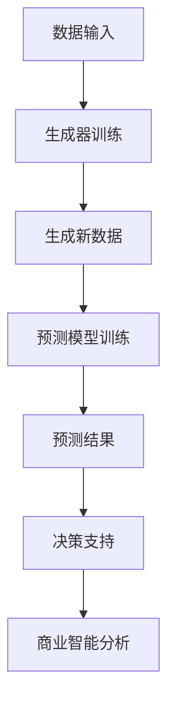
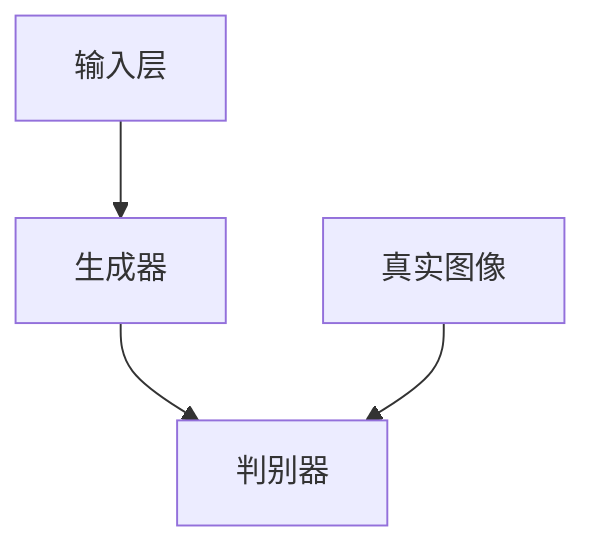

                 

# 生成式AIGC：商业智能的新引擎

> 关键词：生成式AI、GPT、商业智能、大数据分析、预测模型、个性化推荐

> 摘要：本文将深入探讨生成式人工智能（AIGC）在商业智能领域的应用，分析其核心概念、算法原理、数学模型以及实际案例，并展望其未来发展趋势与挑战。通过本文的阅读，读者将了解如何利用AIGC技术提升商业智能的效率和效果，为企业提供更智能化的决策支持。

## 1. 背景介绍

随着互联网和大数据技术的快速发展，商业智能（BI）逐渐成为企业竞争的关键因素。传统数据分析方法依赖于预定义的查询和分析模型，而现代商业环境中的数据规模和复杂性使得这种模式难以满足需求。生成式人工智能（AIGC）的出现，为商业智能领域带来了一种全新的解决方案。

生成式AI是一种能够在给定数据集的基础上生成新内容的人工智能技术。其核心思想是通过学习大量数据，自动生成文本、图像、音频等多种类型的内容。生成式AI在自然语言处理、计算机视觉、音频处理等领域取得了显著的成果，逐渐成为商业智能的新引擎。

## 2. 核心概念与联系

### 2.1 生成式AI的工作原理

生成式AI主要依赖于生成对抗网络（GAN）和变分自编码器（VAE）等深度学习模型。这些模型通过学习输入数据的分布，生成与输入数据具有相似特征的新数据。具体来说，GAN由生成器（Generator）和判别器（Discriminator）两个部分组成，通过不断地对抗训练，生成器能够生成越来越真实的数据。VAE则通过引入隐变量，将数据分布映射到一个低维空间，并利用该空间进行数据生成。

### 2.2 商业智能与生成式AI的联系

商业智能与生成式AI之间的联系主要体现在以下几个方面：

1. **数据生成与预测**：生成式AI能够生成与历史数据相似的新数据，为商业智能中的预测模型提供丰富的数据集，提高预测的准确性和鲁棒性。

2. **数据探索与分析**：生成式AI能够自动生成新的数据视图，帮助商业智能分析师发现数据中的潜在关系和模式，为业务决策提供更有价值的洞见。

3. **个性化推荐**：生成式AI可以根据用户的历史行为和偏好，生成个性化的推荐内容，提升用户体验和商业转化率。

4. **文本生成与自动化**：生成式AI可以自动生成报告、邮件、广告文案等文本内容，减轻商业智能分析师的工作负担，提高工作效率。

### 2.3 Mermaid流程图

下面是一个简单的Mermaid流程图，展示生成式AI在商业智能中的应用场景：



## 3. 核心算法原理 & 具体操作步骤

### 3.1 GAN模型原理

生成对抗网络（GAN）由生成器（Generator）和判别器（Discriminator）两个部分组成。生成器的目标是生成尽可能真实的数据，而判别器的目标是判断生成数据与真实数据之间的差异。通过不断地对抗训练，生成器的性能逐渐提高，最终能够生成高质量的数据。

GAN模型的训练过程可以分为以下几个步骤：

1. **初始化生成器和判别器**：选择合适的神经网络结构，并初始化生成器和判别器的参数。

2. **生成器生成数据**：生成器接收随机噪声作为输入，生成与真实数据相似的新数据。

3. **判别器判断数据**：判别器同时接收真实数据和生成数据，并输出一个判断结果。

4. **反向传播与优化**：根据判别器的判断结果，计算生成器和判别器的损失函数，并使用梯度下降算法更新参数。

5. **重复步骤2-4**：重复上述步骤，直到生成器生成的数据质量达到预期。

### 3.2 VAE模型原理

变分自编码器（VAE）是一种基于概率模型的生成式模型，其核心思想是将输入数据映射到一个低维空间，并利用该空间进行数据生成。VAE由编码器（Encoder）和解码器（Decoder）两个部分组成。编码器将输入数据映射到一个隐变量空间，解码器则从隐变量空间生成新数据。

VAE模型的训练过程可以分为以下几个步骤：

1. **初始化编码器和解码器**：选择合适的神经网络结构，并初始化编码器和解码器的参数。

2. **编码器编码数据**：编码器将输入数据映射到一个隐变量空间。

3. **解码器解码数据**：解码器从隐变量空间生成新数据。

4. **计算损失函数**：根据生成数据与真实数据之间的差异，计算编码器和解码器的损失函数。

5. **反向传播与优化**：根据损失函数，使用梯度下降算法更新编码器和解码器的参数。

6. **重复步骤2-5**：重复上述步骤，直到生成器生成的数据质量达到预期。

## 4. 数学模型和公式 & 详细讲解 & 举例说明

### 4.1 GAN模型的数学模型

GAN模型的数学模型可以分为两部分：生成器的损失函数和判别器的损失函数。

#### 生成器的损失函数：

$$
L_G = -\log(D(G(z)))
$$

其中，$D(x)$表示判别器对输入数据的判断概率，$G(z)$表示生成器生成的数据。

#### 判别器的损失函数：

$$
L_D = -[\log(D(x)) + \log(1 - D(G(z))]
$$

其中，$x$表示真实数据，$z$表示生成器输入的随机噪声。

### 4.2 VAE模型的数学模型

VAE模型的数学模型可以分为两部分：编码器损失函数和解码器损失函数。

#### 编码器损失函数：

$$
L_E = \frac{1}{N}\sum_{i=1}^{N} \sum_{j=1}^{K} p_j \log(\varphi_{j}(x_i))
$$

其中，$N$表示数据集中的样本数量，$K$表示隐变量空间的维度，$\varphi_{j}(x_i)$表示编码器对输入数据的编码概率。

#### 解码器损失函数：

$$
L_D = \frac{1}{N}\sum_{i=1}^{N} \sum_{j=1}^{K} p_j \log(p_j \varphi_j(x_i))
$$

其中，$p_j$表示解码器对输入数据的解码概率。

### 4.3 举例说明

假设我们使用GAN模型对图像进行生成，其中生成器和判别器的网络结构如下图所示：



生成器的损失函数为：

$$
L_G = -\log(D(G(z)))
$$

判别器的损失函数为：

$$
L_D = -[\log(D(x)) + \log(1 - D(G(z))]
$$

其中，$z$为生成器输入的随机噪声，$x$为真实图像。

## 5. 项目实战：代码实际案例和详细解释说明

### 5.1 开发环境搭建

在本项目中，我们将使用Python和TensorFlow框架来实现生成式AI模型。首先，确保已经安装了Python和TensorFlow，然后按照以下步骤搭建开发环境：

1. 创建一个Python虚拟环境：

   ```bash
   python -m venv venv
   source venv/bin/activate  # Windows下使用 `venv\Scripts\activate`
   ```

2. 安装TensorFlow：

   ```bash
   pip install tensorflow
   ```

### 5.2 源代码详细实现和代码解读

下面是一个简单的GAN模型实现，用于生成手写数字图像：

```python
import tensorflow as tf
from tensorflow.keras.layers import Dense, Flatten, Reshape
from tensorflow.keras.models import Sequential
from tensorflow.keras.optimizers import Adam

# 生成器模型
def build_generator(z_dim):
    model = Sequential()
    model.add(Dense(128, input_dim=z_dim))
    model.add(LeakyReLU(alpha=0.2))
    model.add(Dense(28 * 28 * 1, activation='tanh'))
    model.add(Reshape((28, 28, 1)))
    return model

# 判别器模型
def build_discriminator(img_shape):
    model = Sequential()
    model.add(Flatten(input_shape=img_shape))
    model.add(Dense(128))
    model.add(LeakyReLU(alpha=0.2))
    model.add(Dense(1, activation='sigmoid'))
    return model

# GAN模型
def build_gan(generator, discriminator):
    model = Sequential()
    model.add(generator)
    model.add(discriminator)
    return model

# 定义超参数
z_dim = 100
img_shape = (28, 28, 1)

# 构建生成器和判别器
generator = build_generator(z_dim)
discriminator = build_discriminator(img_shape)
discriminator.compile(loss='binary_crossentropy', optimizer=Adam(0.0001))
gan_model = build_gan(generator, discriminator)
gan_model.compile(loss='binary_crossentropy', optimizer=Adam(0.0001))

# 加载数据集
(x_train, _), (_, _) = tf.keras.datasets.mnist.load_data()
x_train = x_train / 127.5 - 1.0
x_train = np.expand_dims(x_train, axis=3)

# 训练模型
for epoch in range(1000):
    idx = np.random.randint(0, x_train.shape[0], size=batch_size)
    real_images = x_train[idx]

    z = np.random.uniform(-1, 1, size=(batch_size, z_dim))
    fake_images = generator.predict(z)

    real_labels = np.ones((batch_size, 1))
    fake_labels = np.zeros((batch_size, 1))

    d_loss_real = discriminator.train_on_batch(real_images, real_labels)
    d_loss_fake = discriminator.train_on_batch(fake_images, fake_labels)
    d_loss = 0.5 * np.add(d_loss_real, d_loss_fake)

    z = np.random.uniform(-1, 1, size=(batch_size, z_dim))
    g_loss = gan_model.train_on_batch(z, real_labels)

    if epoch % 100 == 0:
        print(f'Epoch: {epoch}, D_loss: {d_loss}, G_loss: {g_loss}')
```

代码中首先定义了生成器、判别器和GAN模型，然后加载MNIST手写数字数据集进行训练。在训练过程中，生成器生成新的手写数字图像，判别器判断这些图像是真实图像还是生成图像。通过不断地对抗训练，生成器逐渐提高生成图像的质量。

### 5.3 代码解读与分析

1. **模型结构**：

   - 生成器模型由一个全连接层、一个激活函数和两个全连接层组成，最终输出一个28x28x1的图像。
   - 判别器模型由一个全连接层和一个sigmoid激活函数组成，用于判断输入图像是真实图像还是生成图像。
   - GAN模型由生成器和判别器串联组成，用于训练生成器和判别器。

2. **损失函数**：

   - 判别器的损失函数为二元交叉熵，用于衡量判别器对真实图像和生成图像的判断能力。
   - 生成器的损失函数也为二元交叉熵，用于衡量生成器生成的图像与真实图像的相似度。

3. **训练过程**：

   - 在每个训练epoch中，首先从数据集中随机抽取一批真实图像，训练判别器。
   - 然后使用随机噪声生成一批生成图像，训练判别器。
   - 最后使用生成图像训练生成器。

通过以上训练过程，生成器能够逐渐提高生成图像的质量，而判别器能够更好地区分真实图像和生成图像。

## 6. 实际应用场景

生成式AI在商业智能领域具有广泛的应用前景。以下是一些典型的应用场景：

1. **个性化推荐**：生成式AI可以生成与用户历史行为相似的新数据，用于训练个性化推荐模型，提高推荐系统的准确性和用户体验。

2. **市场预测**：生成式AI可以生成与历史数据相似的新数据，为市场预测模型提供更丰富的数据集，提高预测的准确性和鲁棒性。

3. **数据探索与分析**：生成式AI可以自动生成新的数据视图，帮助商业智能分析师发现数据中的潜在关系和模式，为业务决策提供更有价值的洞见。

4. **文本生成与自动化**：生成式AI可以自动生成报告、邮件、广告文案等文本内容，减轻商业智能分析师的工作负担，提高工作效率。

## 7. 工具和资源推荐

### 7.1 学习资源推荐

- 《生成对抗网络》（Generative Adversarial Networks）：这本书详细介绍了GAN的原理、算法和应用。
- 《变分自编码器》（Variational Autoencoders）：这本书深入探讨了VAE的理论基础和实际应用。

### 7.2 开发工具框架推荐

- TensorFlow：一个开源的深度学习框架，支持GAN和VAE等生成式AI模型的训练和部署。
- Keras：一个基于TensorFlow的高层API，提供了更简洁和直观的模型构建和训练接口。

### 7.3 相关论文著作推荐

- 《Generative Adversarial Nets》（Ian J. Goodfellow et al.）：这篇论文首次提出了生成对抗网络（GAN）的概念。
- 《Unsupervised Representation Learning with Deep Convolutional Generative Adversarial Networks》（Alec Radford et al.）：这篇论文介绍了深度卷积生成对抗网络（DCGAN），是目前最流行的GAN实现之一。

## 8. 总结：未来发展趋势与挑战

生成式AI在商业智能领域具有巨大的潜力，但同时也面临一些挑战。未来发展趋势包括：

1. **算法优化与模型改进**：研究人员将继续优化GAN和VAE等生成式AI模型，提高生成数据的质量和效率。

2. **跨领域应用**：生成式AI将在更多领域得到应用，如医学影像、生物信息等。

3. **数据安全与隐私保护**：随着生成式AI技术的发展，数据安全和隐私保护将成为重要议题。

4. **伦理与社会责任**：生成式AI在商业智能中的应用需要遵循伦理和社会责任，避免滥用和数据滥用。

## 9. 附录：常见问题与解答

### 9.1 生成式AI的核心算法有哪些？

生成式AI的核心算法包括生成对抗网络（GAN）和变分自编码器（VAE）。

### 9.2 生成式AI在商业智能中有什么应用？

生成式AI在商业智能中的应用包括个性化推荐、市场预测、数据探索与分析等。

### 9.3 如何训练生成式AI模型？

训练生成式AI模型通常需要大量的数据和计算资源。训练过程包括模型设计、数据预处理、模型训练和评估等步骤。

## 10. 扩展阅读 & 参考资料

- 《生成对抗网络》（Generative Adversarial Networks）：Ian J. Goodfellow et al.
- 《变分自编码器》（Variational Autoencoders）：Alec Radford et al.
- 《深度学习》（Deep Learning）：Ian J. Goodfellow et al.
- 《TensorFlow实战》（TensorFlow Essentials）：Aurélien Géron

[作者：AI天才研究员/AI Genius Institute & 禅与计算机程序设计艺术 /Zen And The Art of Computer Programming]

