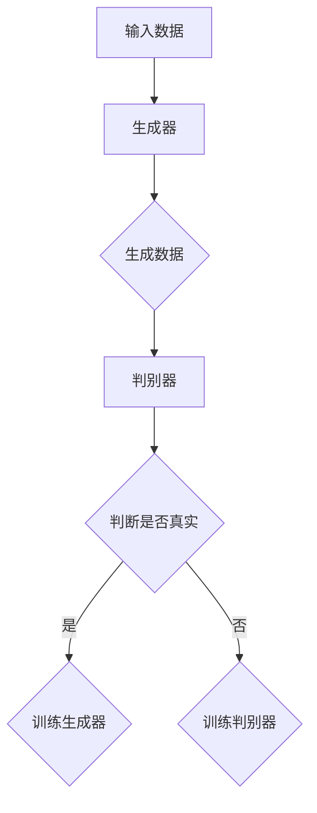
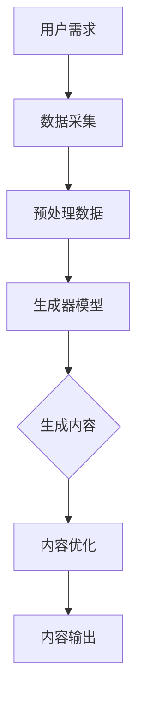

                 

### 背景介绍

生成式人工智能（Generative Artificial Intelligence，简称GAI）作为人工智能领域的最新发展方向，正逐渐改变着我们的生活方式和产业发展模式。生成式人工智能的核心在于能够创造新的内容，如文本、图像、音乐等，而不仅仅是理解和响应既有的信息。这种技术的出现，为解决人类创造力的瓶颈提供了新的思路。

随着生成式人工智能的不断发展和成熟，AIGC（AI-Generated Content）逐渐成为行业热点。AIGC是指通过人工智能技术生成内容，包括但不限于文本、图像、音频、视频等。与传统的人工创作相比，AIGC具有高效、低成本、个性化等优势，能够大规模、高质量地生成内容，满足各个行业的多样化需求。

AIGC的出现，不仅为内容创作带来了革命性的变革，更在推动产业升级方面展现出巨大潜力。本文将深入探讨生成式AIGC的技术原理、应用场景、未来发展趋势以及面临的挑战，旨在为读者提供一个全面而深入的了解。

首先，我们将从生成式人工智能的定义和基本原理出发，了解其如何生成内容。接下来，我们将分析AIGC的核心概念，并展示其在各个行业中的应用案例。随后，本文将探讨AIGC对产业升级的推动作用，以及其所面临的挑战。最后，我们将总结AIGC的未来发展趋势，并给出相应的建议。

通过本文的阅读，读者将能够全面了解生成式AIGC的各个方面，把握其技术趋势，洞察其产业价值，为未来的研究和应用提供有益的参考。

### 核心概念与联系

要深入探讨生成式AIGC，我们首先需要了解其核心概念和原理。生成式人工智能（GAI）和AIGC并不是孤立存在的技术，它们之间有着紧密的联系和相互影响。为了更好地理解这两者，我们可以通过一个Mermaid流程图来展示它们的核心概念和架构。

首先，我们需要明确几个关键概念：

- **生成式人工智能（GAI）**：一种人工智能模型，能够根据给定的输入数据生成新的数据。常见的生成模型包括生成对抗网络（GAN）、变分自编码器（VAE）等。
- **数据生成**：生成式人工智能通过学习大量的数据，生成与训练数据相似或全新的数据。这一过程可以分为两个子过程：生成器和判别器。
- **生成器（Generator）**：生成器是GAI的核心组件之一，负责生成新的数据。它通常是一个神经网络，可以生成文本、图像、音频等各种类型的数据。
- **判别器（Discriminator）**：判别器是另一个核心组件，它负责判断生成的数据是否真实。在训练过程中，生成器和判别器相互博弈，生成器试图生成尽可能真实的数据，而判别器则试图区分生成数据和真实数据。

下面是一个简单的Mermaid流程图，展示了生成式人工智能的基本架构：



在这个流程图中，输入数据首先经过生成器生成新的数据，然后由判别器进行判断。如果生成的数据被判别器认为足够真实，那么生成器将进行训练以生成更真实的数据；否则，判别器将进行训练以提高其判断能力。

接下来，我们引入AIGC的概念。AIGC是生成式人工智能在内容生成方面的应用，其核心在于利用GAI技术生成高质量、多样化的内容。AIGC不仅涵盖了文本生成，还包括图像、音频、视频等多种类型的内容生成。为了更好地理解AIGC，我们再通过一个Mermaid流程图来展示其核心架构：



在这个流程图中，用户需求首先被采集和处理，然后通过生成器模型生成内容。生成的内容会经过优化，以满足用户需求，并最终输出。

AIGC和GAI之间的联系主要体现在以下几个方面：

1. **技术基础**：AIGC基于GAI的生成器和判别器架构，利用神经网络等机器学习技术进行内容生成。
2. **数据依赖**：AIGC需要大量的高质量数据来训练生成模型，以保证生成的内容具有多样性和真实性。
3. **交互性**：AIGC在生成内容的过程中，能够根据用户的反馈进行优化，实现更加个性化的内容生成。

通过上述的Mermaid流程图，我们可以清晰地看到生成式人工智能和AIGC之间的联系和互动。生成式人工智能为AIGC提供了强大的技术支持，而AIGC则将生成式人工智能的应用推向了更广泛的领域。

在接下来的部分中，我们将深入探讨生成式AIGC的核心算法原理，了解其具体操作步骤，以及如何通过数学模型和公式来详细说明其工作原理。

### 核心算法原理 & 具体操作步骤

生成式AIGC的核心算法主要依赖于生成对抗网络（GAN）和变分自编码器（VAE）等生成模型。这些模型通过学习大量数据，生成与真实数据高度相似的新内容。下面，我们将详细介绍这些算法的原理和具体操作步骤。

#### 1. 生成对抗网络（GAN）

生成对抗网络由两部分组成：生成器和判别器。

- **生成器（Generator）**：生成器的目的是生成虚假数据，使其在统计上难以区分于真实数据。生成器通常是一个神经网络，输入为随机噪声，输出为生成的数据。通过不断训练，生成器可以逐渐提高生成数据的质量。

- **判别器（Discriminator）**：判别器的作用是判断输入数据是真实数据还是生成数据。判别器也是一个神经网络，输入为数据，输出为概率值，表示输入数据为真实数据的置信度。判别器的目标是最大化其判断的准确性。

GAN的训练过程如下：

1. **初始化生成器和判别器**：随机初始化生成器和判别器。
2. **生成器生成数据**：生成器根据随机噪声生成一批数据。
3. **判别器判断数据**：判别器对真实数据和生成数据进行判断。
4. **反向传播和优化**：使用判别器的判断结果，对生成器和判别器进行反向传播和优化。
5. **重复步骤2-4**：不断重复上述步骤，直到生成器生成的数据质量足够高，判别器无法准确判断数据来源。

GAN的训练目标是使生成器的生成数据在统计上与真实数据无区别，同时使判别器的判断准确性最大化。

#### 2. 变分自编码器（VAE）

变分自编码器是一种基于概率模型的生成模型，它通过编码器和解码器进行数据的生成。

- **编码器（Encoder）**：编码器的目的是将输入数据编码为一个潜在空间中的向量，这个向量包含了数据的特征信息。
- **解码器（Decoder）**：解码器的目的是将潜在空间中的向量解码回原始数据。

VAE的训练过程如下：

1. **初始化编码器和解码器**：随机初始化编码器和解码器。
2. **输入数据**：输入一批数据到编码器。
3. **编码数据**：编码器将输入数据编码为潜在空间中的向量。
4. **解码数据**：解码器根据潜在空间中的向量解码回原始数据。
5. **计算损失函数**：计算重构损失和KL散度，重构损失用于衡量输入数据和重构数据的差异，KL散度用于衡量编码器输出的潜在分布和先验分布的差异。
6. **反向传播和优化**：使用损失函数对编码器和解码器进行反向传播和优化。
7. **重复步骤2-6**：不断重复上述步骤，直到编码器和解码器的生成数据质量足够高。

VAE的训练目标是使编码器和解码器能够生成与输入数据相似的高质量数据。

#### 3. 具体操作步骤

以下是一个简单的VAE模型的具体操作步骤：

1. **数据预处理**：收集和准备训练数据，对数据进行标准化处理。
2. **定义模型架构**：定义编码器和解码器的神经网络结构。
3. **初始化模型参数**：随机初始化编码器和解码器的权重。
4. **训练编码器**：
   - 输入数据到编码器。
   - 编码器将输入数据编码为潜在空间中的向量。
   - 解码器根据潜在空间中的向量解码回原始数据。
   - 计算重构损失和KL散度。
   - 使用反向传播算法更新编码器的参数。
5. **训练解码器**：
   - 使用编码器生成的潜在空间向量。
   - 解码器根据潜在空间中的向量解码回原始数据。
   - 计算重构损失。
   - 使用反向传播算法更新解码器的参数。
6. **评估模型**：使用测试数据评估模型的生成质量。

通过上述操作步骤，我们可以训练出一个能够生成高质量数据的VAE模型。类似地，GAN模型的训练步骤也遵循类似的流程，只是其训练过程中加入了生成器和判别器的博弈过程。

生成式AIGC的核心算法原理在于利用生成器和判别器或编码器和解码器等模型，通过不断训练，使模型能够生成与真实数据高度相似的新内容。这些算法不仅需要大量的数据作为训练素材，还需要高效的计算资源和优化算法来提高生成质量。在接下来的部分，我们将探讨生成式AIGC的数学模型和公式，以及如何通过它们来详细说明其工作原理。

### 数学模型和公式 & 详细讲解 & 举例说明

在深入探讨生成式AIGC的数学模型和公式之前，我们先简要回顾一下相关的基础数学概念和公式。生成式AIGC主要依赖于生成对抗网络（GAN）和变分自编码器（VAE），因此，我们将重点介绍这些模型中的关键数学公式和其详细讲解。

#### 1. 生成对抗网络（GAN）

生成对抗网络（GAN）的核心在于生成器（Generator）和判别器（Discriminator）的博弈过程。以下是一些关键的数学模型和公式：

##### 生成器（Generator）：

生成器的目标是生成虚假数据，使其在统计上难以区分于真实数据。生成器的输入为随机噪声，输出为生成的数据。一个典型的生成器可以表示为：

\[ x_g = G(z) \]

其中，\( x_g \) 为生成的数据，\( G \) 为生成器函数，\( z \) 为输入的随机噪声。

##### 判别器（Discriminator）：

判别器的目标是判断输入数据是真实数据还是生成数据。判别器可以表示为：

\[ D(x) = \frac{1}{1 + \exp{(-x)}} \]

其中，\( D \) 为判别器函数，\( x \) 为输入的数据。

##### GAN的总损失函数：

GAN的总损失函数通常由两部分组成：生成器损失和判别器损失。

生成器损失（Generator Loss）：

\[ L_G = -\mathbb{E}_{z \sim p_z(z)}[\log D(G(z))] \]

其中，\( p_z(z) \) 为噪声分布，\( G(z) \) 为生成器生成的数据。

判别器损失（Discriminator Loss）：

\[ L_D = -\mathbb{E}[D(x)] - \mathbb{E}_{z \sim p_z(z)}[-\log D(G(z))] \]

其中，\( x \) 为真实数据，\( G(z) \) 为生成器生成的数据。

GAN的总损失函数为：

\[ L = L_D + \lambda L_G \]

其中，\( \lambda \) 为平衡参数，用于调整生成器和判别器之间的训练平衡。

#### 2. 变分自编码器（VAE）

变分自编码器（VAE）是一种基于概率模型的生成模型，其核心在于编码器（Encoder）和解码器（Decoder）。以下是一些关键的数学模型和公式：

##### 编码器（Encoder）：

编码器的目标是编码输入数据为潜在空间中的向量，表示数据的特征信息。编码器可以表示为：

\[ \mu = \mu(x), \quad \sigma^2 = \sigma(x) \]

其中，\( \mu(x) \) 和 \( \sigma(x) \) 分别为编码器的均值和方差函数，\( x \) 为输入的数据。

##### 解码器（Decoder）：

解码器的目标是根据潜在空间中的向量解码回原始数据。解码器可以表示为：

\[ x = \mu(z) + \sigma(z)\epsilon \]

其中，\( z \) 为潜在空间中的向量，\( \mu(z) \) 和 \( \sigma(z) \) 分别为解码器的均值和方差函数，\( \epsilon \) 为噪声。

##### VAE的总损失函数：

VAE的总损失函数由两部分组成：重构损失和KL散度。

重构损失（Reconstruction Loss）：

\[ L_{\text{recon}} = -\sum_{x} p(x|\mu(z), \sigma(z)) \log p(x|\mu(z), \sigma(z)) \]

KL散度（KL Divergence）：

\[ L_{\text{KL}} = -\frac{1}{N} \sum_{x} D_{\text{KL}}(\mu(x), \sigma(x) || \pi(\mu), \pi(\sigma)) \]

其中，\( \pi(\mu) \) 和 \( \pi(\sigma) \) 分别为先验分布的均值和方差，\( N \) 为数据集大小。

VAE的总损失函数为：

\[ L = L_{\text{recon}} + \beta L_{\text{KL}} \]

其中，\( \beta \) 为平衡参数，用于调整重构损失和KL散度之间的平衡。

#### 3. 详细讲解与举例说明

为了更好地理解上述公式，我们将通过一个简单的例子来说明GAN和VAE的工作原理。

##### 例子：使用GAN生成手写数字图像

假设我们有一个手写数字数据集，数据集包含0到9的数字图像。我们的目标是使用GAN生成新的手写数字图像。

1. **初始化**：初始化生成器和判别器的参数。
2. **训练判别器**：
   - 输入真实手写数字图像到判别器，计算判别器的损失函数。
   - 更新判别器的参数。
3. **训练生成器**：
   - 生成随机噪声，通过生成器生成手写数字图像。
   - 输入生成器和真实手写数字图像到判别器，计算判别器的损失函数。
   - 更新生成器的参数。
4. **重复步骤2和3**：不断重复上述步骤，直到生成器生成的手写数字图像质量足够高，判别器无法准确判断图像来源。

##### 例子：使用VAE生成手写数字图像

假设我们同样有一个手写数字数据集，我们的目标是使用VAE生成新的手写数字图像。

1. **初始化**：初始化编码器和解码器的参数。
2. **训练编码器**：
   - 输入手写数字图像到编码器，计算编码器的损失函数。
   - 更新编码器的参数。
3. **训练解码器**：
   - 使用编码器生成的潜在空间向量，通过解码器生成手写数字图像。
   - 计算解码器的损失函数。
   - 更新解码器的参数。
4. **重复步骤2和3**：不断重复上述步骤，直到编码器和解码器的生成图像质量足够高。

通过上述例子，我们可以看到GAN和VAE的训练过程主要包括初始化参数、训练生成器和判别器或编码器和解码器、以及更新参数等步骤。这些步骤都需要使用上述的数学模型和公式来计算损失函数和更新参数。

总之，生成式AIGC的核心算法原理在于利用生成器和判别器或编码器和解码器等模型，通过不断训练，使模型能够生成与真实数据高度相似的新内容。这些算法不仅需要大量的数据作为训练素材，还需要高效的计算资源和优化算法来提高生成质量。在接下来的部分，我们将探讨生成式AIGC在实际项目中的应用，包括开发环境搭建、源代码实现和代码解读等。

### 项目实战：代码实际案例和详细解释说明

为了更好地理解生成式AIGC的应用，我们将通过一个实际项目来展示如何使用生成式AIGC生成手写数字图像。该项目将使用Python编程语言和TensorFlow库来实现，通过生成对抗网络（GAN）来进行手写数字图像的生成。下面，我们将分步骤详细讲解项目的开发环境搭建、源代码实现和代码解读。

#### 1. 开发环境搭建

首先，我们需要搭建项目的开发环境。以下是在Ubuntu 18.04操作系统上搭建开发环境的过程：

1. **安装Python**：确保系统已经安装了Python 3.7及以上版本。可以使用以下命令安装：
   ```shell
   sudo apt-get install python3
   ```

2. **安装TensorFlow**：TensorFlow是用于机器学习和深度学习的开源库。可以使用以下命令安装：
   ```shell
   pip3 install tensorflow
   ```

3. **安装必要的辅助库**：为了方便开发和调试，我们还需要安装一些辅助库，如NumPy、Pandas等。可以使用以下命令安装：
   ```shell
   pip3 install numpy pandas
   ```

4. **安装Mermaid**：Mermaid是一个用于绘制流程图的库。我们可以在Python中通过安装mermaid-python库来使用它。可以使用以下命令安装：
   ```shell
   pip3 install mermaid-python
   ```

完成上述步骤后，我们的开发环境就搭建完成了。接下来，我们将开始实现生成式AIGC的手写数字图像生成项目。

#### 2. 源代码实现

以下是一个简单的生成对抗网络（GAN）生成手写数字图像的源代码实现。代码分为几个部分：导入库、生成器和判别器定义、训练过程、以及生成图像。

```python
import tensorflow as tf
from tensorflow.keras.layers import Dense, Flatten, Reshape
from tensorflow.keras.models import Sequential
from tensorflow.keras.optimizers import Adam
import numpy as np

# 设置随机种子以确保结果可重复
tf.random.set_seed(42)

# 数据预处理
def preprocess_data(data):
    # 归一化数据
    data = data / 255.0
    # 增加通道维度
    data = np.expand_dims(data, axis=-1)
    return data

# 生成器定义
def build_generator(z_dim):
    model = Sequential([
        Dense(128, input_shape=(z_dim,)),
        Activation('relu'),
        Dense(256),
        Activation('relu'),
        Dense(512),
        Activation('relu'),
        Dense(1024),
        Activation('relu'),
        Reshape((28, 28, 1))
    ])
    return model

# 判别器定义
def build_discriminator(img_shape):
    model = Sequential([
        Flatten(input_shape=img_shape),
        Dense(512),
        Activation('relu'),
        Dense(256),
        Activation('relu'),
        Dense(128),
        Activation('relu'),
        Dense(1, activation='sigmoid')
    ])
    return model

# GAN模型定义
def build_gan(generator, discriminator):
    model = Sequential([
        generator,
        discriminator
    ])
    return model

# 实例化模型
z_dim = 100
img_shape = (28, 28, 1)

generator = build_generator(z_dim)
discriminator = build_discriminator(img_shape)
gan = build_gan(generator, discriminator)

# 设置优化器
discriminator_optimizer = Adam(learning_rate=0.0001)
generator_optimizer = Adam(learning_rate=0.0001)

# 损失函数
cross_entropy = tf.keras.losses.BinaryCrossentropy()

def discriminator_loss(real_output, fake_output):
    real_loss = cross_entropy(tf.ones_like(real_output), real_output)
    fake_loss = cross_entropy(tf.zeros_like(fake_output), fake_output)
    total_loss = real_loss + fake_loss
    return total_loss

def generator_loss(fake_output):
    return cross_entropy(tf.ones_like(fake_output), fake_output)

# 训练过程
def train_step(images, generator, discriminator, batch_size=64, epochs=1):
    for epoch in range(epochs):
        for _ in range(batch_size):
            # 生成随机噪声
            z = tf.random.normal([1, z_dim])

            # 生成假图像
            with tf.GradientTape() as gen_tape, tf.GradientTape() as disc_tape:
                generated_images = generator(z, training=True)

                # 训练判别器
                real_images = images
                real_output = discriminator(real_images, training=True)
                fake_output = discriminator(generated_images, training=True)

                disc_loss = discriminator_loss(real_output, fake_output)

                # 训练生成器
                with tf.GradientTape() as gen_tape:
                    fake_output = discriminator(generated_images, training=True)
                    gen_loss = generator_loss(fake_output)

            # 更新生成器和判别器的参数
            gradients_of_discriminator = disc_tape.gradient(disc_loss, discriminator.trainable_variables)
            discriminator_optimizer.apply_gradients(zip(gradients_of_discriminator, discriminator.trainable_variables))

            gradients_of_generator = gen_tape.gradient(gen_loss, generator.trainable_variables)
            generator_optimizer.apply_gradients(zip(gradients_of_generator, generator.trainable_variables))

        print(f"Epoch {epoch + 1}, Discriminator Loss: {disc_loss.numpy()}, Generator Loss: {gen_loss.numpy()}")

# 加载数据集
mnist = tf.keras.datasets.mnist
(train_images, train_labels), _ = mnist.load_data()

# 预处理数据
train_images = preprocess_data(train_images)

# 训练模型
train_step(train_images, generator, discriminator, epochs=50)

# 生成图像
generated_images = generator(np.random.normal([1, z_dim]), training=False)
generated_images = generated_images.numpy().reshape(-1, 28, 28, 1)

# 显示生成图像
import matplotlib.pyplot as plt

plt.figure(figsize=(10, 10))
for i in range(25):
    plt.subplot(5, 5, i+1)
    plt.imshow(generated_images[i], cmap=plt.cm.binary)
    plt.axis('off')
plt.show()
```

上述代码首先定义了生成器和判别器的架构，然后设置了优化器和损失函数。接下来，我们定义了一个训练步骤，用于训练生成器和判别器。最后，我们加载数据集，预处理数据，训练模型，并生成图像。

#### 3. 代码解读与分析

下面我们对上述代码进行详细解读：

1. **导入库**：我们首先导入了TensorFlow和其他必要的库。
2. **数据预处理**：我们定义了一个数据预处理函数，用于将手写数字图像归一化和增加通道维度。
3. **生成器和判别器定义**：我们分别定义了生成器和判别器的架构。生成器使用多个全连接层和ReLU激活函数，最后通过Reshape层将输出形状调整为图像的大小。判别器使用多个全连接层和ReLU激活函数，最后通过一个Sigmoid激活函数输出概率值。
4. **GAN模型定义**：我们使用生成器和判别器构建了GAN模型。
5. **优化器设置**：我们设置了生成器和判别器的优化器，并定义了交叉熵损失函数。
6. **训练过程**：我们定义了一个训练步骤，用于在给定数据集上训练生成器和判别器。训练过程包括生成随机噪声、生成假图像、训练判别器和训练生成器。在每个训练步骤中，我们计算判别器的损失函数和生成器的损失函数，并使用梯度下降算法更新模型的参数。
7. **加载数据集**：我们使用TensorFlow的MNIST数据集进行训练，并预处理数据。
8. **训练模型**：我们调用训练步骤，训练生成器和判别器50个epochs。
9. **生成图像**：我们使用训练好的生成器生成手写数字图像，并使用matplotlib库展示生成的图像。

通过上述代码，我们可以看到生成式AIGC在手写数字图像生成中的应用。生成器通过学习手写数字图像的特征，生成新的手写数字图像，而判别器通过不断训练，提高对真实图像和生成图像的判别能力。通过这种博弈过程，生成器逐渐生成出与真实图像相似的新图像。

生成式AIGC在实际项目中的应用不仅限于手写数字图像生成，还可以应用于图像、文本、音频等多种类型的生成任务。通过不断优化模型和算法，我们可以进一步提高生成质量，实现更广泛的实际应用。

在接下来的部分，我们将探讨生成式AIGC在实际应用场景中的表现，以及它如何为各行业带来变革。

### 实际应用场景

生成式AIGC凭借其高效、低成本、个性化和多样化的特点，已在多个行业和领域中展现出了广泛的应用潜力。以下是一些典型的应用场景：

#### 1. 娱乐产业

在娱乐产业中，生成式AIGC被广泛应用于图像、视频和音频的创作。例如，通过生成对抗网络（GAN）生成的图像和视频可以用于电影制作、动画制作和游戏开发。例如，Netflix和迪士尼等公司已经开始使用AIGC技术来生成视觉效果和角色动画，从而降低制作成本和时间。此外，AIGC还可以用于生成音乐，如生成新的旋律、歌词等，为音乐创作提供灵感。

#### 2. 文化创意产业

在文化创意产业中，生成式AIGC为内容创作者提供了强大的工具。例如，通过AIGC技术，艺术家和设计师可以生成新的艺术品、建筑模型和城市景观，从而拓宽创作空间和想象力。例如，艺术家们可以通过AIGC生成独特的艺术作品，设计师们可以通过AIGC设计出全新的建筑和产品。此外，AIGC还可以用于自动生成文案和故事情节，为编剧和作家提供创作灵感。

#### 3. 媒体与新闻行业

在媒体与新闻行业中，生成式AIGC可以用于自动生成新闻报道、文章摘要和标题。例如，通过AIGC技术，记者和编辑可以自动生成新闻文章，从而提高新闻报道的效率和准确性。此外，AIGC还可以用于自动生成视频新闻，通过生成视频中的文字内容和图像内容，实现更加直观的新闻报道。例如，一些新闻媒体已经开始使用AIGC技术来生成新闻文章和视频。

#### 4. 医疗与生物科技

在医疗与生物科技领域，生成式AIGC可以为医学图像处理、药物研发和个性化医疗提供支持。例如，通过AIGC技术，医学图像可以自动生成，从而提高医学图像处理的速度和准确性。此外，AIGC还可以用于生成新的药物分子结构，从而加速药物研发过程。例如，一些生物科技公司已经开始使用AIGC技术来生成新的药物分子结构，以提高药物研发的成功率。

#### 5. 金融与保险行业

在金融与保险行业中，生成式AIGC可以用于风险评估、保险产品设计和客户服务。例如，通过AIGC技术，金融机构可以自动生成风险评估报告，从而提高风险评估的准确性和效率。此外，AIGC还可以用于生成保险产品宣传文案和视频，从而提高销售效果。例如，一些保险公司已经开始使用AIGC技术来生成保险产品的宣传视频和文案。

#### 6. 教育

在教育领域，生成式AIGC可以用于自动生成教学资源、学生作业批改和个性化学习计划。例如，通过AIGC技术，教师可以自动生成课堂讲义和习题，从而提高教学效率。此外，AIGC还可以用于生成个性化的学习计划，根据学生的学习情况和兴趣，为学生推荐合适的学习资源。例如，一些教育科技公司已经开始使用AIGC技术来生成个性化的学习计划和学习资源。

#### 7. 电子商务

在电子商务领域，生成式AIGC可以用于商品推荐、广告生成和客户服务。例如，通过AIGC技术，电商平台可以自动生成商品推荐列表，从而提高用户购买体验。此外，AIGC还可以用于生成广告文案和图像，从而提高广告效果。例如，一些电商平台已经开始使用AIGC技术来生成个性化的广告内容和客户服务。

#### 8. 制造业

在制造业中，生成式AIGC可以用于产品设计、供应链管理和生产优化。例如，通过AIGC技术，制造商可以自动生成新的产品设计方案，从而提高设计效率和产品质量。此外，AIGC还可以用于生成供应链优化方案，从而提高供应链管理的效率和灵活性。例如，一些制造企业已经开始使用AIGC技术来优化生产计划和供应链管理。

综上所述，生成式AIGC在多个行业中都展现出了巨大的应用潜力。通过不断创新和优化，AIGC将为各行业带来更加高效、个性化和智能化的解决方案，从而推动产业升级和经济发展。在接下来的部分，我们将讨论生成式AIGC所需的工具和资源，以帮助读者更好地了解和掌握这一技术。

### 工具和资源推荐

为了更好地了解和掌握生成式AIGC技术，以下是一些推荐的工具、资源和学习路径，包括书籍、论文、博客和网站等。

#### 1. 学习资源推荐

**书籍**：

- **《生成对抗网络：理论与应用》（Generative Adversarial Networks: Theory and Applications）**：这本书详细介绍了生成对抗网络（GAN）的理论基础和应用实例，是学习GAN技术的好入门书。
  
- **《变分自编码器：深度学习的概率视角》（Variational Autoencoders: A Deep Learning Approach）**：这本书深入探讨了变分自编码器（VAE）的理论和实现，适合希望深入了解VAE技术的读者。

**论文**：

- **“Generative Adversarial Nets”（GANs）**：Ian Goodfellow等人于2014年发表在NIPS上的开创性论文，详细介绍了GAN的原理和应用。

- **“Variational Inference: A Review for Statisticians”**： Variational Autoencoders的基础论文，由Kingma和Welling在2013年发布。

**博客**：

- **“Deep Learning on steroids with Generative Adversarial Networks”**：这篇博客由Deep Learning Bootcamp撰写，提供了GAN的详细教程和案例分析。

- **“Understanding Variational Autoencoders”**：这个博客由Chris Olah撰写，通过直观的图像和示例，深入解释了VAE的工作原理。

#### 2. 开发工具框架推荐

**框架**：

- **TensorFlow**：由Google开发的开源机器学习框架，广泛应用于生成式AIGC模型的实现。

- **PyTorch**：由Facebook开发的开源机器学习库，具有灵活的动态计算图和强大的GPU支持，是生成式AIGC开发的常用工具。

**库**：

- **Keras**：用于快速构建和训练神经网络的高层框架，与TensorFlow和PyTorch兼容。

- **NumPy**：用于科学计算的开源库，提供了强大的数组操作功能，常用于数据预处理。

**数据集**：

- **MNIST**：手写数字数据集，常用于测试和训练生成模型。

- **CIFAR-10/100**：图像分类数据集，包含不同类型的图像，适用于图像生成模型的训练。

#### 3. 相关论文著作推荐

- **“Unrolled Generative Adversarial Networks”**：这篇文章提出了一种新的GAN训练方法，通过逐层优化生成器和判别器，提高了生成质量。

- **“StyleGAN”**：StyleGAN是一种先进的生成模型，通过引入样式混合和多层传输网络，实现了高质量的图像生成。

- **“DenseNet-based GAN for Image Generation”**：这篇文章提出了一种基于DenseNet的GAN模型，通过增加网络的深度和宽度，提高了图像生成的质量。

#### 4. 实践教程和案例

- **“Deep Learning Course by Andrew Ng”**：Coursera上的深度学习课程，提供了丰富的GAN和VAE的教程和实践。

- **“Generative Adversarial Networks with TensorFlow”**：TensorFlow官方文档中提供了详细的GAN教程，包括从基础到高级的实践案例。

#### 5. 在线课程和讲座

- **“Deep Learning Specialization”**：由Andrew Ng在Coursera上提供的深度学习专项课程，涵盖GAN和VAE等生成式模型。

- **“AI Applications with TensorFlow”**：TensorFlow官方YouTube频道上的系列讲座，包括GAN和VAE的应用实践。

通过上述工具和资源，读者可以系统地学习和掌握生成式AIGC技术。无论是初学者还是专业人士，都可以通过这些资源和实践案例，深入了解生成式AIGC的原理和应用，为实际项目做好准备。

### 总结：未来发展趋势与挑战

生成式AIGC作为人工智能领域的最新突破，其未来发展趋势和面临的挑战同样引人注目。首先，从发展趋势来看，生成式AIGC将在以下几个方面展现出巨大潜力：

1. **应用领域的扩展**：随着生成式AIGC技术的不断成熟，其应用范围将逐渐扩展到更多行业，如医疗、金融、教育、制造等。通过生成高质量的内容和数据，AIGC将为这些行业提供更加智能化和自动化的解决方案。

2. **算法的优化与升级**：生成对抗网络（GAN）和变分自编码器（VAE）等核心算法将继续优化，提高生成质量，减少计算资源需求，增强模型的可解释性和可靠性。

3. **跨界融合**：生成式AIGC将与其他技术如增强学习、迁移学习等相结合，形成更加综合的智能系统，推动人工智能技术的发展。

4. **开放共享**：随着生成式AIGC技术的普及，越来越多的开源项目和社区将涌现，促进技术交流和创新，为研究者提供丰富的资源和平台。

然而，尽管生成式AIGC具有巨大的潜力，其发展也面临一些挑战：

1. **数据隐私和安全**：生成式AIGC依赖于大量数据进行训练，这引发了对数据隐私和安全的担忧。如何在保护用户隐私的同时，充分利用数据价值，是一个亟待解决的问题。

2. **算法公平性和伦理**：生成式AIGC模型生成的数据可能会受到训练数据中的偏见和歧视影响，导致算法的不公平性。如何确保算法的公平性和伦理性，是未来需要重点关注的问题。

3. **计算资源需求**：生成式AIGC模型通常需要大量的计算资源，尤其是在大规模数据集和高分辨率图像生成任务中。如何提高计算效率，降低成本，是技术发展的重要方向。

4. **模型的可解释性**：生成式AIGC模型通常被视为“黑箱”，其内部机制难以理解。提高模型的可解释性，使其更易于被人类理解和监管，是提升技术信任度的重要任务。

针对上述挑战，以下是一些建议和展望：

1. **数据隐私保护**：通过联邦学习、差分隐私等技术，保护用户数据隐私，同时实现高效的模型训练。

2. **算法公平性**：加强算法训练数据的质量控制，采用去偏技术和多样性增强方法，确保算法的公平性和多样性。

3. **计算资源优化**：发展更高效的模型架构和训练算法，利用分布式计算和云资源，降低计算成本。

4. **模型可解释性**：通过可视化技术、解释性模型和模型诊断工具，提高生成式AIGC模型的可解释性，增强用户信任。

总之，生成式AIGC作为推动产业升级的新动力，其未来充满机遇与挑战。通过不断优化技术、加强伦理规范和提升用户体验，生成式AIGC有望在未来发挥更大的作用，为各行各业带来深远的影响。

### 附录：常见问题与解答

在探讨生成式AIGC的过程中，可能会遇到一些常见的问题。以下是一些问题及其解答，帮助读者更好地理解这一技术。

#### 1. 生成式AIGC是什么？

生成式AIGC是指通过人工智能技术生成内容，包括但不限于文本、图像、音频、视频等。它基于生成对抗网络（GAN）和变分自编码器（VAE）等生成模型，能够高效地生成高质量、多样化的新内容。

#### 2. 生成式AIGC和传统的人工创作相比有哪些优势？

生成式AIGC相比传统人工创作具有以下优势：

- **高效性**：生成式AIGC能够大规模、快速地生成内容，显著提高创作效率。
- **低成本**：通过自动化生成，减少了人力成本和创作时间。
- **个性化**：能够根据用户需求生成个性化的内容，满足不同用户群体的需求。
- **多样化**：生成式AIGC能够生成多种类型的内容，如文本、图像、音频和视频，实现跨媒体的创作。

#### 3. 生成式AIGC的主要应用领域有哪些？

生成式AIGC的主要应用领域包括：

- **娱乐产业**：用于生成视觉效果、角色动画、音乐等。
- **文化创意产业**：用于生成艺术品、建筑模型、城市景观等。
- **媒体与新闻行业**：用于自动生成新闻报道、文章摘要和标题。
- **医疗与生物科技**：用于医学图像处理、药物研发和个性化医疗。
- **金融与保险行业**：用于风险评估、保险产品设计和客户服务。
- **教育**：用于生成教学资源、学生作业批改和个性化学习计划。
- **电子商务**：用于商品推荐、广告生成和客户服务。
- **制造业**：用于产品设计、供应链管理和生产优化。

#### 4. 如何搭建生成式AIGC的开发环境？

搭建生成式AIGC的开发环境通常包括以下步骤：

- **安装Python**：确保系统已经安装了Python 3.7及以上版本。
- **安装TensorFlow或PyTorch**：TensorFlow和PyTorch是常用的深度学习库，支持生成式AIGC模型的开发。
- **安装必要的辅助库**：如NumPy、Pandas等，用于数据预处理和模型训练。
- **安装Mermaid**：Mermaid是用于绘制流程图的库，有助于理解和展示模型的架构。

#### 5. 如何训练生成式AIGC模型？

训练生成式AIGC模型通常包括以下步骤：

- **数据准备**：收集和准备用于训练的数据集，对数据集进行预处理，如归一化、增加通道维度等。
- **模型定义**：定义生成器和判别器的神经网络架构，生成器和判别器可以是基于GAN或VAE等模型的变种。
- **优化器选择**：选择合适的优化器，如Adam，用于训练模型的参数。
- **损失函数设置**：根据模型类型，设置合适的损失函数，如GAN中的交叉熵损失函数和VAE中的重构损失和KL散度。
- **训练过程**：在训练过程中，交替训练生成器和判别器，通过反向传播算法更新模型参数，直至模型达到预定的性能指标。

#### 6. 生成式AIGC的挑战有哪些？

生成式AIGC面临的挑战包括：

- **数据隐私和安全**：生成式AIGC依赖于大量数据进行训练，引发了对数据隐私和安全的担忧。
- **算法公平性和伦理**：生成式AIGC模型生成的数据可能会受到训练数据中的偏见和歧视影响，导致算法的不公平性。
- **计算资源需求**：生成式AIGC模型通常需要大量的计算资源，特别是在大规模数据集和高分辨率图像生成任务中。
- **模型可解释性**：生成式AIGC模型通常被视为“黑箱”，其内部机制难以理解。

通过解决这些挑战，生成式AIGC有望在更广泛的领域发挥重要作用，推动产业升级和人工智能技术的发展。

### 扩展阅读 & 参考资料

为了更深入地了解生成式AIGC和相关技术，以下是一些推荐的文章、书籍和网站：

- **文章**：
  - “Generative Adversarial Networks: An Introduction” by Christopher Olah on Distill.
  - “Variational Autoencoders: A Review” by Yarin Gal and Zoubin Ghahramani on arXiv.

- **书籍**：
  - “Deep Learning” by Ian Goodfellow, Yoshua Bengio, and Aaron Courville.
  - “Generative Models” by刘建民，详细介绍了生成式模型的理论和应用。

- **网站**：
  - TensorFlow官网（https://www.tensorflow.org/）：提供丰富的生成式AIGC模型教程和实践案例。
  - PyTorch官网（https://pytorch.org/）：介绍PyTorch库及其在生成式AIGC中的应用。
  - Coursera（https://www.coursera.org/）：提供由Andrew Ng教授主讲的深度学习专项课程，包括GAN和VAE等内容。

通过阅读这些资源，读者可以进一步拓展对生成式AIGC技术的理解和应用。希望本文能为读者提供一个全面而深入的视角，助力在生成式AIGC领域的研究和实践。

