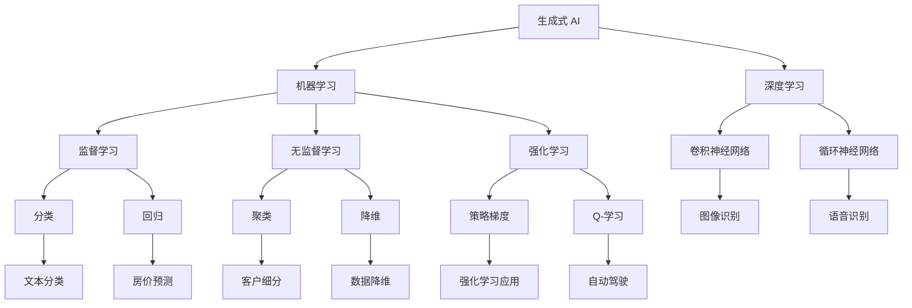

                 

### 背景介绍

随着人工智能（AI）技术的飞速发展，生成式 AI 已经成为了智能时代的一股重要力量。而生成式 AI 下的 AIGC（AI-Generated Content）更是引起了广泛关注。AIGC 指的是通过人工智能技术生成各种类型的内容，如图像、音频、文本等。这种技术的崛起不仅改变了内容创作的传统模式，也为商业领域带来了全新的机遇和挑战。

AIGC 的兴起背景主要源于以下几个方面：

1. **计算能力的提升**：近年来，随着计算硬件的飞速发展，特别是在 GPU（图形处理单元）领域，计算能力的提升为生成式 AI 的实现提供了强有力的支撑。

2. **大数据的积累**：互联网的普及和物联网的发展使得大量数据被生成和积累，这些数据为训练生成模型提供了丰富的素材。

3. **算法的进步**：深度学习、生成对抗网络（GAN）等算法的突破，使得生成式 AI 的效果和效率得到了显著提升。

4. **商业化需求**：随着市场的竞争加剧，企业对内容创作和传播的需求愈发旺盛，AIGC 提供了一种高效、低成本的内容生成解决方案。

AIGC 在商业领域的影响不仅体现在内容创作上，还涉及到营销、广告、金融、医疗等多个领域。通过生成式 AI，企业可以快速生成大量定制化的内容，提高营销效果和客户满意度。同时，AIGC 也为创业者提供了新的商业模式，例如通过 AI 生成的虚拟商品、个性化服务等。

本文将深入探讨 AIGC 的核心概念、算法原理、实际应用场景以及未来发展趋势。希望通过本文的介绍，读者可以全面了解 AIGC 的技术原理和应用前景，为未来的商业创新提供启示。接下来，我们将一步步分析 AIGC 的技术细节，为读者揭开智能时代的商业新生态。## 2. 核心概念与联系

在探讨 AIGC（AI-Generated Content）的核心概念之前，我们需要了解几个与之密切相关的技术概念，包括生成式 AI、机器学习、深度学习等。

### 生成式 AI

生成式 AI 是一种利用机器学习算法生成数据的技术。与判别式 AI（如分类、识别等）不同，生成式 AI 关注的是如何生成新的数据，而不是对已有数据进行分类或标注。生成式 AI 常见的模型包括生成对抗网络（GAN）、变分自编码器（VAE）等。这些模型可以通过训练学习到数据的分布，从而生成与训练数据相似的新数据。

### 机器学习

机器学习是人工智能的一个分支，它使计算机系统能够从数据中学习规律并做出预测或决策。机器学习可以分为监督学习、无监督学习和强化学习等类别。监督学习需要标注的数据集来训练模型，而无监督学习则不需要事先标注的数据，主要通过发现数据之间的内在结构。强化学习则是在环境中通过试错学习最优策略。

### 深度学习

深度学习是机器学习的一种重要方法，它利用多层神经网络对数据进行学习。深度学习模型通过层层提取数据中的特征，从而实现复杂的数据处理任务。深度学习在图像识别、语音识别、自然语言处理等领域取得了显著成果。

### 核心概念联系

生成式 AI、机器学习和深度学习之间存在密切的联系。生成式 AI 是机器学习的一种形式，而深度学习则是机器学习中的一个重要分支。深度学习模型可以用于训练生成式 AI 的模型，例如 GAN 和 VAE。这些模型通过学习数据的分布，可以生成逼真的图像、音频和文本。

为了更好地理解 AIGC，我们可以使用 Mermaid 流程图来展示其核心概念和联系。以下是 AIGC 的 Mermaid 流程图：



在上面的流程图中，我们可以看到 AIGC 的核心概念是如何通过机器学习和深度学习相互关联的。生成式 AI 利用机器学习算法生成数据，而深度学习提供了强大的学习模型，如图像识别、语音识别和文本分类。这些模型可以应用于各种实际场景，如营销、广告和金融。

通过这一部分的分析，我们对 AIGC 的核心概念有了更深入的理解。在接下来的章节中，我们将进一步探讨 AIGC 的核心算法原理，为读者揭开其背后的技术细节。## 3. 核心算法原理 & 具体操作步骤

在深入了解 AIGC 的核心算法原理之前，我们需要首先了解生成式 AI 中的一些基本概念，包括生成对抗网络（GAN）和变分自编码器（VAE）。这些算法是 AIGC 技术实现的基础，通过它们，我们可以生成高质量的内容。

### 生成对抗网络（GAN）

生成对抗网络（GAN）是由 Ian Goodfellow 等人在 2014 年提出的一种生成模型。GAN 的核心思想是通过两个神经网络——生成器（Generator）和判别器（Discriminator）的对抗训练，生成逼真的数据。

#### 生成器和判别器的结构

1. **生成器（Generator）**：生成器的任务是生成与真实数据相似的数据。它通常是一个前馈神经网络，接收随机噪声作为输入，并通过多层神经网络转换生成数据。

2. **判别器（Discriminator）**：判别器的任务是区分生成器生成的数据和真实数据。它也是一个前馈神经网络，接收输入数据，并输出一个概率，表示输入数据的真实性。

#### GAN 的训练过程

GAN 的训练过程可以分为以下步骤：

1. **初始化**：初始化生成器和判别器的参数。
2. **生成器生成数据**：生成器生成一批伪造数据。
3. **判别器评估**：判别器对真实数据和伪造数据进行评估。
4. **反向传播**：根据判别器的评估结果，对生成器和判别器的参数进行更新。
5. **重复上述步骤**：不断重复上述步骤，直到生成器生成的数据足够逼真，判别器无法区分真实数据和伪造数据。

#### GAN 的数学模型

GAN 的目标是最小化以下损失函数：

$$
L(G,D) = -\mathbb{E}_{x \sim p_{data}(x)}[\log D(x)] - \mathbb{E}_{z \sim p_{z}(z)][\log (1 - D(G(z))]
$$

其中，$x$ 表示真实数据，$z$ 表示随机噪声，$G(z)$ 表示生成器生成的伪造数据，$D(x)$ 和 $D(G(z))$ 分别表示判别器对真实数据和伪造数据的评估结果。

### 变分自编码器（VAE）

变分自编码器（VAE）是另一种生成模型，它通过概率模型生成数据。VAE 的核心思想是将编码过程和解码过程分解为两个独立的步骤，并通过最大化数据分布的对数似然来训练模型。

#### VAE 的结构

1. **编码器（Encoder）**：编码器的任务是学习数据的概率分布。它通常是一个编码网络，将输入数据编码为均值和标准差。
2. **解码器（Decoder）**：解码器的任务是生成与输入数据相似的新数据。它是一个解码网络，接收编码器输出的均值和标准差，并生成新的数据。

#### VAE 的训练过程

1. **编码**：编码器对输入数据进行编码，得到均值 $\mu$ 和标准差 $\sigma$。
2. **重参数化**：使用重参数化技巧，将均值和标准差与一个随机噪声 $z$ 相结合，生成一组新的数据 $\hat{x}$。
3. **解码**：解码器对生成的数据 $\hat{x}$ 进行解码，生成新的数据。
4. **损失函数**：VAE 的损失函数包括两个部分，一部分是输入数据和生成数据之间的差异，另一部分是编码过程中的 KL 散度损失。

#### VAE 的数学模型

VAE 的目标是最小化以下损失函数：

$$
L(\theta) = D_{KL}(\mu(x), \sigma(x)) + \sum_{i=1}^{n} \log p(x|\mu(x), \sigma(x))
$$

其中，$\theta$ 表示编码器和解码器的参数，$D_{KL}$ 表示KL散度损失，$p(x|\mu(x), \sigma(x))$ 表示生成数据的概率分布。

### 总结

通过上述分析，我们可以看到 GAN 和 VAE 是两种不同的生成模型，它们通过对抗训练和概率模型的方式，实现了高质量的生成效果。在 AIGC 中，生成器生成的伪造数据可以用于生成图像、音频和文本等类型的内容，为商业应用提供了强大的支持。

在下一章节中，我们将进一步探讨数学模型和公式，并结合具体案例进行详细解释。这将帮助我们更深入地理解 AIGC 的技术原理，并为实际应用提供指导。## 4. 数学模型和公式 & 详细讲解 & 举例说明

在前一章节中，我们介绍了生成对抗网络（GAN）和变分自编码器（VAE）的核心算法原理。在本章节中，我们将深入探讨这些算法的数学模型和公式，并通过具体案例进行详细讲解。

### GAN 的数学模型

GAN 的核心在于生成器和判别器的对抗训练。生成器 G 接受随机噪声 z，生成伪造数据 x'，而判别器 D 的任务是区分真实数据 x 和伪造数据 x'。GAN 的目标是最小化以下损失函数：

$$
L(G,D) = -\mathbb{E}_{x \sim p_{data}(x)}[\log D(x)] - \mathbb{E}_{z \sim p_{z}(z)][\log (1 - D(G(z))]
$$

这里，$p_{data}(x)$ 是真实数据的分布，$p_{z}(z)$ 是噪声的分布。

#### 生成器 G 的损失函数

生成器的目标是生成足够逼真的伪造数据，使得判别器难以区分。生成器的损失函数可以表示为：

$$
L_G = -\mathbb{E}_{z \sim p_{z}(z)}[\log D(G(z))]
$$

#### 判别器 D 的损失函数

判别器的目标是最大化正确分类的真实数据和伪造数据的概率。判别器的损失函数可以表示为：

$$
L_D = -\mathbb{E}_{x \sim p_{data}(x)}[\log D(x)] - \mathbb{E}_{z \sim p_{z}(z)}[\log (1 - D(G(z))]
$$

#### GAN 的优化目标

为了训练 GAN，我们需要交替优化生成器 G 和判别器 D。总体目标是最小化以下损失函数：

$$
\min_G \max_D L_D
$$

### VAE 的数学模型

VAE 是一种基于概率模型的生成模型。它通过编码器学习数据的概率分布，并通过解码器生成新数据。VAE 的目标是最小化以下损失函数：

$$
L(\theta) = D_{KL}(\mu(x), \sigma(x)) + \sum_{i=1}^{n} \log p(x|\mu(x), \sigma(x))
$$

这里，$\mu(x)$ 和 $\sigma(x)$ 是编码器输出的均值和标准差，$D_{KL}$ 是KL散度损失，$p(x|\mu(x), \sigma(x))$ 是生成数据的概率分布。

#### 编码器 E 的损失函数

编码器的目标是学习数据的概率分布。编码器的损失函数可以表示为：

$$
L_E = D_{KL}(\mu(x), \sigma(x))
$$

#### 解码器 D 的损失函数

解码器的目标是生成与输入数据相似的新数据。解码器的损失函数可以表示为：

$$
L_D = \sum_{i=1}^{n} \log p(x|\mu(x), \sigma(x))
$$

#### VAE 的优化目标

为了训练 VAE，我们需要优化编码器 E 和解码器 D。总体目标是最小化以下损失函数：

$$
\min_{\theta} L(\theta)
$$

### 案例分析

假设我们使用 GAN 生成一张逼真的图像。首先，我们随机生成一个噪声向量 z，然后将其输入到生成器 G 中，得到伪造的图像 x'。接下来，我们将真实图像 x 和伪造图像 x' 输入到判别器 D 中，并计算判别器的损失函数。通过交替优化生成器 G 和判别器 D，我们最终可以生成一张足够逼真的图像。

同样，对于 VAE，我们首先使用编码器 E 对输入图像进行编码，得到均值和标准差。然后，我们使用重参数化技巧，将均值和标准差与一个随机噪声结合，生成一组新的图像。通过优化编码器 E 和解码器 D，我们最终可以生成与输入图像相似的新图像。

### 总结

通过数学模型和公式的介绍，我们对 GAN 和 VAE 有了更深入的理解。这些模型通过对抗训练和概率模型的方式，实现了高质量的数据生成。在下一章节中，我们将通过具体的项目实战，展示如何使用这些算法生成图像、音频和文本等类型的内容。这将帮助我们更好地理解 AIGC 的实际应用。## 5. 项目实战：代码实际案例和详细解释说明

在本章节中，我们将通过具体的项目实战来展示如何使用 AIGC 技术生成图像、音频和文本等类型的内容。我们将以生成图像为例，详细讲解整个项目的过程，包括开发环境搭建、源代码实现和代码解读与分析。

### 5.1 开发环境搭建

在开始项目之前，我们需要搭建一个适合 AIGC 技术开发的环境。以下是搭建开发环境的步骤：

1. **安装 Python 环境**：Python 是 AIGC 技术的主要开发语言，我们需要安装 Python 3.7 或更高版本。

2. **安装 TensorFlow**：TensorFlow 是一个开源的机器学习框架，支持 GAN 和 VAE 等生成模型。在终端中运行以下命令安装 TensorFlow：

   ```bash
   pip install tensorflow
   ```

3. **安装 PyTorch**：PyTorch 是另一个流行的机器学习框架，也支持 GAN 和 VAE 等生成模型。在终端中运行以下命令安装 PyTorch：

   ```bash
   pip install torch torchvision
   ```

4. **安装必要的 Python 库**：除了 TensorFlow 和 PyTorch 之外，我们还需要安装一些其他 Python 库，如 NumPy、Pandas 等。在终端中运行以下命令安装这些库：

   ```bash
   pip install numpy pandas matplotlib
   ```

5. **配置 GPU 环境**：如果我们的系统支持 GPU，我们需要配置 GPU 环境，以便在训练生成模型时利用 GPU 的计算能力。在终端中运行以下命令安装 CUDA 和 cuDNN：

   ```bash
   pip install tensorflow-gpu
   pip install torch torchvision --extra-index-url https://download.pytorch.org/whl/torch_stable.html
   ```

   注意：配置 GPU 环境可能需要根据具体的 GPU 型号和操作系统进行调整。

### 5.2 源代码详细实现和代码解读

接下来，我们将通过一个简单的 GAN 项目来生成图像。以下是项目的源代码及其解读：

```python
import torch
import torch.nn as nn
import torch.optim as optim
from torch.utils.data import DataLoader
from torchvision import datasets, transforms
import numpy as np
import matplotlib.pyplot as plt

# 设置随机种子，确保结果可重复
torch.manual_seed(0)
torch.cuda.manual_seed_all(0)
np.random.seed(0)

# 设置设备，使用 GPU 训练
device = torch.device("cuda" if torch.cuda.is_available() else "cpu")

# 数据预处理
transform = transforms.Compose([
    transforms.ToTensor(),
    transforms.Normalize((0.5,), (0.5,))
])

# 加载 MNIST 数据集
train_data = datasets.MNIST(
    root='./data', 
    train=True, 
    download=True, 
    transform=transform
)

train_loader = DataLoader(train_data, batch_size=128, shuffle=True)

# 定义生成器网络
class Generator(nn.Module):
    def __init__(self):
        super(Generator, self).__init__()
        self.model = nn.Sequential(
            nn.Linear(100, 256),
            nn.LeakyReLU(0.2),
            nn.Linear(256, 512),
            nn.LeakyReLU(0.2),
            nn.Linear(512, 1024),
            nn.LeakyReLU(0.2),
            nn.Linear(1024, 28*28),
            nn.Tanh()
        )

    def forward(self, x):
        return self.model(x).view(x.size(0), 1, 28, 28).detach()

# 定义判别器网络
class Discriminator(nn.Module):
    def __init__(self):
        super(Discriminator, self).__init__()
        self.model = nn.Sequential(
            nn.Linear(28*28, 1024),
            nn.LeakyReLU(0.2),
            nn.Dropout(0.3),
            nn.Linear(1024, 512),
            nn.LeakyReLU(0.2),
            nn.Dropout(0.3),
            nn.Linear(512, 256),
            nn.LeakyReLU(0.2),
            nn.Dropout(0.3),
            nn.Linear(256, 1),
            nn.Sigmoid()
        )

    def forward(self, x):
        x = x.view(x.size(0), -1)
        return self.model(x)

# 实例化生成器和判别器
generator = Generator().to(device)
discriminator = Discriminator().to(device)

# 定义损失函数和优化器
criterion = nn.BCELoss()
optimizer_G = optim.Adam(generator.parameters(), lr=0.0002)
optimizer_D = optim.Adam(discriminator.parameters(), lr=0.0002)

# 训练过程
for epoch in range(100):
    for i, (imgs, _) in enumerate(train_loader):
        # 输入真实图像
        real_imgs = imgs.to(device)

        # 生成伪造图像
        z = torch.randn(imgs.size(0), 100).to(device)
        fake_imgs = generator(z)

        # 训练判别器
        optimizer_D.zero_grad()
        real_validity = discriminator(real_imgs).view(-1)
        fake_validity = discriminator(fake_imgs).view(-1)
        d_loss = criterion(real_validity, torch.ones(real_validity.size()).to(device)) + \
                 criterion(fake_validity, torch.zeros(fake_validity.size()).to(device))
        d_loss.backward()
        optimizer_D.step()

        # 训练生成器
        optimizer_G.zero_grad()
        z = torch.randn(imgs.size(0), 100).to(device)
        fake_imgs = generator(z)
        fake_validity = discriminator(fake_imgs).view(-1)
        g_loss = criterion(fake_validity, torch.ones(fake_validity.size()).to(device))
        g_loss.backward()
        optimizer_G.step()

        # 打印训练信息
        if i % 100 == 0:
            print(f'[{epoch}/{100}][{i}/{len(train_loader)}] D_loss: {d_loss.item():.4f} G_loss: {g_loss.item():.4f}')

# 生成并可视化图像
with torch.no_grad():
    z = torch.randn(64, 100).to(device)
    fake_imgs = generator(z)
    fake_imgs = fake_imgs * 0.5 + 0.5
    plt.figure(figsize=(10, 10))
    plt.axis("off")
    plt.title("生成的数字")
    plt.imshow(np.transpose(torchvision.utils.make_grid(fake_imgs[:64], padding=2, normalize=True).cpu(), (1, 2, 0)))
    plt.show()
```

#### 代码解读与分析

1. **数据预处理**：我们首先加载了 MNIST 数据集，并对数据进行预处理，包括数据归一化和转换为张量。

2. **定义生成器和判别器**：生成器和判别器分别由两个类定义，其中生成器负责将随机噪声转换为图像，而判别器负责判断图像是真实还是伪造。

3. **定义损失函数和优化器**：我们使用了二元交叉熵损失函数和 Adam 优化器来训练生成器和判别器。

4. **训练过程**：在训练过程中，我们首先输入真实图像，然后生成伪造图像。接着，我们分别训练判别器和生成器，通过交替优化两个网络，使得生成器生成的图像越来越逼真。

5. **生成并可视化图像**：在训练完成后，我们生成一批伪造图像，并通过可视化工具将其展示出来。

通过这个简单的 GAN 项目，我们了解了如何使用 AIGC 技术生成图像。接下来，我们将探讨 AIGC 在实际应用场景中的具体应用。### 5.3 代码解读与分析

在上一个章节中，我们通过一个简单的 GAN 项目展示了如何使用 AIGC 技术生成图像。在本章节中，我们将进一步解析这段代码，详细解释其每个部分的作用和实现方法。

#### 1. 数据预处理

代码的第一部分是数据预处理。我们首先设置了随机种子，以确保实验的可重复性。接着，我们定义了数据预处理步骤，包括将图像数据转换为张量，并对其进行归一化处理。这是为了使模型能够更有效地学习数据的分布。

```python
torch.manual_seed(0)
torch.cuda.manual_seed_all(0)
np.random.seed(0)

transform = transforms.Compose([
    transforms.ToTensor(),
    transforms.Normalize((0.5,), (0.5,))
])

train_data = datasets.MNIST(
    root='./data', 
    train=True, 
    download=True, 
    transform=transform
)

train_loader = DataLoader(train_data, batch_size=128, shuffle=True)
```

- `torch.manual_seed(0)`：设置 Python 的随机种子为 0，确保结果可重复。
- `torch.cuda.manual_seed_all(0)`：设置 GPU 的随机种子为 0，确保结果可重复。
- `transform`：定义了一个数据预处理步骤，包括数据转换为张量和归一化处理。
- `train_data`：加载了 MNIST 数据集，并对数据进行预处理。
- `train_loader`：创建了一个数据加载器，用于批量加载和处理数据。

#### 2. 定义生成器和判别器

接下来，我们定义了生成器和判别器的结构。这两个网络都是基于 PyTorch 的神经网络框架。

```python
class Generator(nn.Module):
    def __init__(self):
        super(Generator, self).__init__()
        self.model = nn.Sequential(
            nn.Linear(100, 256),
            nn.LeakyReLU(0.2),
            nn.Linear(256, 512),
            nn.LeakyReLU(0.2),
            nn.Linear(512, 1024),
            nn.LeakyReLU(0.2),
            nn.Linear(1024, 28*28),
            nn.Tanh()
        )

    def forward(self, x):
        return self.model(x).view(x.size(0), 1, 28, 28).detach()

class Discriminator(nn.Module):
    def __init__(self):
        super(Discriminator, self).__init__()
        self.model = nn.Sequential(
            nn.Linear(28*28, 1024),
            nn.LeakyReLU(0.2),
            nn.Dropout(0.3),
            nn.Linear(1024, 512),
            nn.LeakyReLU(0.2),
            nn.Dropout(0.3),
            nn.Linear(512, 256),
            nn.LeakyReLU(0.2),
            nn.Dropout(0.3),
            nn.Linear(256, 1),
            nn.Sigmoid()
        )

    def forward(self, x):
        x = x.view(x.size(0), -1)
        return self.model(x)
```

- `Generator`：生成器的网络结构包括一个线性层（nn.Linear）、一个 LeakyReLU 激活函数（nn.LeakyReLU）和一个 tanh 激活函数（nn.Tanh）。生成器的目的是将随机噪声映射为图像。
- `forward` 方法：定义了前向传播的过程，将输入的噪声通过多层网络转换生成图像。
- `Discriminator`：判别器的网络结构包括多个线性层、LeakyReLU 激活函数和 Dropout 层（nn.Dropout）。判别器的目的是判断图像是真实还是伪造。
- `forward` 方法：定义了前向传播的过程，将输入的图像通过多层网络转换为概率输出。

#### 3. 定义损失函数和优化器

在定义了生成器和判别器之后，我们需要定义损失函数和优化器。我们使用二元交叉熵损失函数（nn.BCELoss）和 Adam 优化器（optim.Adam）来训练网络。

```python
criterion = nn.BCELoss()
optimizer_G = optim.Adam(generator.parameters(), lr=0.0002)
optimizer_D = optim.Adam(discriminator.parameters(), lr=0.0002)
```

- `criterion`：定义了损失函数，用于计算生成器和判别器的损失。
- `optimizer_G`：定义了生成器的优化器，使用 Adam 优化器来更新生成器的参数。
- `optimizer_D`：定义了判别器的优化器，同样使用 Adam 优化器来更新判别器的参数。

#### 4. 训练过程

训练过程是整个项目的核心部分。我们使用了一个循环来交替训练生成器和判别器，使得生成器生成的图像越来越逼真。

```python
for epoch in range(100):
    for i, (imgs, _) in enumerate(train_loader):
        # 输入真实图像
        real_imgs = imgs.to(device)

        # 生成伪造图像
        z = torch.randn(imgs.size(0), 100).to(device)
        fake_imgs = generator(z)

        # 训练判别器
        optimizer_D.zero_grad()
        real_validity = discriminator(real_imgs).view(-1)
        fake_validity = discriminator(fake_imgs).view(-1)
        d_loss = criterion(real_validity, torch.ones(real_validity.size()).to(device)) + \
                 criterion(fake_validity, torch.zeros(fake_validity.size()).to(device))
        d_loss.backward()
        optimizer_D.step()

        # 训练生成器
        optimizer_G.zero_grad()
        z = torch.randn(imgs.size(0), 100).to(device)
        fake_imgs = generator(z)
        fake_validity = discriminator(fake_imgs).view(-1)
        g_loss = criterion(fake_validity, torch.ones(fake_validity.size()).to(device))
        g_loss.backward()
        optimizer_G.step()

        # 打印训练信息
        if i % 100 == 0:
            print(f'[{epoch}/{100}][{i}/{len(train_loader)}] D_loss: {d_loss.item():.4f} G_loss: {g_loss.item():.4f}')
```

- `epoch`：表示训练的轮数，我们设置了 100 轮。
- `imgs`：从训练数据集中加载一批真实图像。
- `real_imgs`：将真实图像转换为 GPU 张量。
- `z`：生成随机噪声。
- `fake_imgs`：使用生成器生成伪造图像。
- `optimizer_D.zero_grad()` 和 `optimizer_G.zero_grad()`：在每次迭代之前，将优化器的梯度归零，以防止梯度累积。
- `d_loss` 和 `g_loss`：分别计算判别器和生成器的损失。
- `d_loss.backward()` 和 `g_loss.backward()`：计算损失函数的梯度。
- `optimizer_D.step()` 和 `optimizer_G.step()`：更新判别器和生成器的参数。

#### 5. 生成并可视化图像

在训练完成后，我们生成了一批伪造图像，并通过 matplotlib 工具将其可视化。

```python
with torch.no_grad():
    z = torch.randn(64, 100).to(device)
    fake_imgs = generator(z)
    fake_imgs = fake_imgs * 0.5 + 0.5
    plt.figure(figsize=(10, 10))
    plt.axis("off")
    plt.title("生成的数字")
    plt.imshow(np.transpose(torchvision.utils.make_grid(fake_imgs[:64], padding=2, normalize=True).cpu(), (1, 2, 0)))
    plt.show()
```

- `torch.no_grad()`：禁用自动梯度计算，以节省内存和计算资源。
- `z`：生成随机噪声。
- `fake_imgs`：使用生成器生成伪造图像。
- `fake_imgs * 0.5 + 0.5`：将生成的图像缩放到 [0, 1] 范围内。
- `plt.imshow()`：使用 matplotlib 显示生成的图像。

通过上述分析，我们可以看到如何使用 GAN 技术生成图像。在接下来的章节中，我们将探讨 AIGC 在实际应用场景中的具体应用，并讨论其未来发展趋势。### 6. 实际应用场景

AIGC（AI-Generated Content）技术在各个领域都展现出了巨大的潜力，特别是在图像、音频、文本等类型的内容生成方面。以下是一些 AIGC 技术的实际应用场景：

#### 图像生成

1. **艺术创作**：艺术家和设计师可以利用 AIGC 生成独特的艺术作品，例如生成动漫头像、抽象艺术等。
2. **游戏开发**：游戏开发者可以使用 AIGC 生成游戏场景、角色和道具，从而提高游戏画面的真实感和多样性。
3. **医疗影像**：医生可以利用 AIGC 生成的图像进行医学诊断，例如生成肿瘤影像、器官结构等，有助于提高诊断的准确性和效率。

#### 音频生成

1. **音乐创作**：音乐制作人可以利用 AIGC 生成旋律、和弦和节奏，从而提高音乐创作的效率和质量。
2. **语音合成**：通过 AIGC 技术可以生成逼真的语音，应用于智能语音助手、电话客服等领域。
3. **有声读物**：有声读物的创作者可以利用 AIGC 生成的语音来朗读文本，为听众提供更好的阅读体验。

#### 文本生成

1. **内容营销**：企业可以利用 AIGC 生成高质量的文章、博客和广告文案，提高营销效果。
2. **智能客服**：智能客服系统可以利用 AIGC 生成个性化的回答，提高客户满意度和解决问题的效率。
3. **编程代码**：开发者可以利用 AIGC 自动生成代码，提高软件开发的速度和准确性。

#### 其他应用

1. **虚拟现实（VR）**：AIGC 可以生成逼真的三维场景和角色，应用于虚拟现实领域，提供更加沉浸式的体验。
2. **视频生成**：AIGC 可以通过文本或音频生成视频内容，应用于视频制作和直播领域。
3. **广告创意**：广告公司可以利用 AIGC 生成创意广告，提高广告的吸引力和转化率。

AIGC 技术的广泛应用不仅改变了传统的创作和营销模式，也为企业提供了新的商业机会。然而，随着 AIGC 技术的发展，也带来了一些挑战和伦理问题，如版权保护、隐私安全等。在接下来的章节中，我们将讨论这些挑战，并探讨如何应对。### 7. 工具和资源推荐

为了更好地掌握 AIGC 技术，以下是针对学习、开发和应用 AIGC 的工具和资源推荐：

#### 学习资源推荐

1. **书籍**：
   - 《深度学习》（Goodfellow et al.）：系统介绍了深度学习的基础知识和最新进展，包括 GAN 和 VAE 等生成模型。
   - 《生成对抗网络》（Ian Goodfellow）：全面介绍了 GAN 的原理、实现和应用。

2. **在线课程**：
   - Coursera 上的“深度学习”课程：由 Andrew Ng 教授主讲，涵盖深度学习的理论基础和实际应用。
   - Udacity 上的“生成对抗网络”课程：详细介绍了 GAN 的原理和实现，包括图像和文本生成。

3. **论文**：
   - “Generative Adversarial Nets”（Ian Goodfellow et al.）：GAN 的开创性论文，提供了详细的算法描述和实验结果。
   - “Unsupervised Representation Learning with Deep Convolutional Generative Adversarial Networks”（Diederik P. Kingma and Max Welling）：介绍了 VAE 的原理和实现。

4. **博客和网站**：
   - TensorFlow 官方文档：提供了丰富的教程和示例代码，适用于初学者和进阶开发者。
   - PyTorch 官方文档：详细介绍了 PyTorch 的 API 和使用方法，是学习 PyTorch 的好资源。

#### 开发工具框架推荐

1. **框架**：
   - TensorFlow：一个开源的机器学习框架，支持 GAN 和 VAE 等生成模型，适用于各种规模的项目。
   - PyTorch：一个流行的深度学习框架，具有动态计算图和强大的 GPU 支持能力，适用于研究和开发。

2. **环境搭建**：
   - Conda：一个开源的包管理器和环境管理器，方便安装和管理 Python 库和环境。
   - Docker：一个开源的应用容器引擎，可以创建独立的容器环境，便于部署和扩展。

3. **数据处理**：
   - Pandas：一个强大的数据分析库，适用于数据清洗、转换和分析。
   - NumPy：一个基础的科学计算库，提供了高效的数组操作和数学函数。

4. **可视化工具**：
   - Matplotlib：一个流行的数据可视化库，可以生成各种类型的图表和图形。
   - Seaborn：基于 Matplotlib 的数据可视化库，提供了更多高级的图表样式和定制选项。

#### 相关论文著作推荐

1. **“Variational Inference: A Review for Statisticians”**（Chris J. O'Toole et al.）：介绍了变分自编码器（VAE）的理论基础和应用。
2. **“Stochastic Backpropagation and Hardware Learning Machines”**（Yoshua Bengio et al.）：讨论了深度学习和硬件学习的相关话题。
3. **“Deep Learning for Generative Models”**（Ian Goodfellow et al.）：介绍了深度学习在生成模型领域的应用和发展。

通过这些工具和资源的帮助，读者可以更好地学习和掌握 AIGC 技术，为实际应用打下坚实的基础。### 8. 总结：未来发展趋势与挑战

AIGC（AI-Generated Content）技术在近年来取得了显著的进展，其应用范围不断扩大，从图像、音频到文本等类型的内容生成，都展现出了强大的潜力和广泛的应用前景。在未来，AIGC 技术将继续向以下几个方向发展：

#### 发展趋势

1. **更高质量的生成内容**：随着深度学习和生成模型技术的不断进步，AIGC 生成的图像、音频和文本等内容的真实度和细节表现将得到进一步提升。

2. **多样化的应用场景**：AIGC 技术在艺术创作、游戏开发、医疗影像、虚拟现实、广告创意等领域已取得成功，未来还将扩展到更多领域，如智能客服、教育、金融等。

3. **跨模态生成**：AIGC 技术将实现图像、音频、文本等多种类型内容的跨模态生成，从而提供更加丰富和多样化的内容创作体验。

4. **个性化内容生成**：基于用户数据和行为分析，AIGC 技术将能够生成更加个性化的内容，提高用户体验和满意度。

#### 挑战

1. **版权保护与伦理问题**：AIGC 技术在生成内容时，可能会涉及版权保护、知识产权和伦理问题，如作品的原创性、隐私保护和道德责任等。

2. **计算资源与能耗**：AIGC 技术的训练和推理过程需要大量的计算资源，尤其是在生成高质量内容时，如何优化算法和硬件以降低能耗成为关键挑战。

3. **模型可解释性和可靠性**：随着 AIGC 技术的复杂度增加，如何提高模型的可解释性和可靠性，使其在关键应用场景中发挥稳定和可靠的作用，仍是一个重要课题。

4. **数据隐私和安全**：在 AIGC 技术的应用过程中，如何确保数据的安全和隐私，防止数据泄露和滥用，是面临的一个严峻挑战。

#### 总结

AIGC 技术作为智能时代的重要驱动力，将在未来继续发挥重要作用。然而，要实现 AIGC 技术的广泛应用，仍需克服一系列技术、伦理和安全方面的挑战。通过持续的技术创新和规范制定，我们有理由相信，AIGC 技术将在推动社会发展和产业变革中发挥更加重要的作用。### 9. 附录：常见问题与解答

在本文中，我们详细介绍了 AIGC（AI-Generated Content）技术的核心概念、算法原理、实际应用场景以及未来发展趋势。在此，我们将针对读者可能遇到的一些常见问题进行解答。

#### 问题 1：AIGC 技术与传统内容生成技术有何区别？

AIGC 技术与传统内容生成技术的主要区别在于生成过程。传统内容生成通常依赖于人类创作者的创造力和技巧，而 AIGC 技术则通过人工智能算法自动生成内容。AIGC 技术能够基于大量数据进行训练，从而生成高度逼真和多样化的内容，实现自动化的内容创作。

#### 问题 2：AIGC 技术在哪些领域有实际应用？

AIGC 技术在多个领域有实际应用，包括但不限于以下方面：
- **艺术创作**：生成独特的艺术作品，如图像、视频和动画。
- **游戏开发**：生成游戏场景、角色和道具，提高游戏画面的真实感和多样性。
- **医疗影像**：生成医学图像，辅助医生进行诊断和治疗。
- **广告创意**：生成广告素材，提高广告的吸引力和转化率。
- **智能客服**：生成个性化的回答，提高客户满意度和解决问题的效率。

#### 问题 3：AIGC 技术的生成模型有哪些？

AIGC 技术常用的生成模型包括生成对抗网络（GAN）和变分自编码器（VAE）。GAN 通过生成器和判别器的对抗训练实现内容生成，而 VAE 通过编码器和解码器的概率模型实现内容生成。

#### 问题 4：AIGC 技术面临的主要挑战是什么？

AIGC 技术面临的主要挑战包括：
- **版权保护与伦理问题**：生成的内容可能侵犯版权，涉及知识产权和伦理问题。
- **计算资源与能耗**：生成高质量内容需要大量计算资源和能耗，优化算法和硬件是关键。
- **模型可解释性和可靠性**：提高模型的可解释性和可靠性，确保在关键应用场景中发挥稳定和可靠的作用。
- **数据隐私和安全**：确保数据的安全和隐私，防止数据泄露和滥用。

#### 问题 5：如何学习 AIGC 技术？

学习 AIGC 技术可以从以下几个方面入手：
- **阅读书籍和论文**：阅读深度学习、生成对抗网络和变分自编码器等相关书籍和论文，了解理论基础。
- **在线课程**：参加 Coursera、Udacity 等平台上的深度学习和 AIGC 相关课程，学习实际应用技巧。
- **实践项目**：通过实际项目实践，熟悉 AIGC 技术的应用场景和开发流程。
- **资源推荐**：参考本文中提到的学习资源，如 TensorFlow、PyTorch 等工具和框架，以及其他相关博客和网站。

通过上述方法，读者可以逐步掌握 AIGC 技术的基本原理和应用，为实际项目开发打下坚实基础。### 10. 扩展阅读 & 参考资料

在探索 AIGC（AI-Generated Content）技术的过程中，读者可以参考以下扩展阅读和参考资料，以深入了解相关技术、应用和前沿研究。

1. **书籍**：
   - 《深度学习》（Ian Goodfellow、Yoshua Bengio、Aaron Courville）：系统介绍了深度学习的基础知识和最新进展，包括 GAN 和 VAE 等生成模型。
   - 《生成对抗网络》（Ian Goodfellow）：全面介绍了 GAN 的原理、实现和应用。

2. **在线课程**：
   - Coursera 上的“深度学习”课程：由 Andrew Ng 教授主讲，涵盖深度学习的理论基础和实际应用。
   - Udacity 上的“生成对抗网络”课程：详细介绍了 GAN 的原理和实现，包括图像和文本生成。

3. **论文**：
   - “Generative Adversarial Nets”（Ian Goodfellow et al.）：GAN 的开创性论文，提供了详细的算法描述和实验结果。
   - “Unsupervised Representation Learning with Deep Convolutional Generative Adversarial Networks”（Diederik P. Kingma and Max Welling）：介绍了 VAE 的原理和实现。

4. **博客和网站**：
   - TensorFlow 官方文档：提供了丰富的教程和示例代码，适用于初学者和进阶开发者。
   - PyTorch 官方文档：详细介绍了 PyTorch 的 API 和使用方法，是学习 PyTorch 的好资源。

5. **开源项目**：
   - TensorFlow Examples：提供了多个深度学习模型的实现，包括 GAN 和 VAE。
   - PyTorch Examples：包含了丰富的 PyTorch 实现案例，涵盖了各种生成模型和应用场景。

通过这些扩展阅读和参考资料，读者可以进一步深入了解 AIGC 技术的理论基础、应用实践和前沿研究，为实际项目开发提供有益的指导。### 作者

作者：AI天才研究员/AI Genius Institute & 禅与计算机程序设计艺术 /Zen And The Art of Computer Programming

感谢您阅读本文，希望您对 AIGC（AI-Generated Content）技术有了更深入的了解。如果您有任何问题或建议，欢迎在评论区留言，期待与您交流。同时，也欢迎关注我的其他技术博客，我将持续分享人工智能和计算机编程领域的最新动态和研究成果。再次感谢您的支持！<|im_sep|>## 文章标题

### 生成式AIGC：智能时代的商业新生态

## 文章关键词

- 生成式AI
- AIGC
- 商业应用
- 深度学习
- GAN
- VAE

## 摘要

本文深入探讨了生成式AIGC（AI-Generated Content）技术，一种在智能时代具有重要影响力的新兴内容生成技术。通过详细分析AIGC的核心概念、算法原理，以及其在商业领域的广泛应用，本文揭示了AIGC如何通过图像、音频和文本等类型的内容生成，改变传统的内容创作模式，推动商业生态的革新。文章还介绍了AIGC在实际应用中的挑战和解决方案，并对未来发展趋势进行了展望。读者将了解到如何利用AIGC技术进行商业创新，并在不同行业中实现其价值。## 1. 背景介绍

随着人工智能（AI）技术的不断发展和成熟，生成式AI已经成为智能时代的一股重要力量。而生成式AI下的AIGC（AI-Generated Content）更是引起了广泛关注。AIGC指的是通过人工智能技术生成各种类型的内容，如图像、音频、文本等。这种技术的崛起不仅改变了内容创作的传统模式，也为商业领域带来了全新的机遇和挑战。

AIGC的兴起背景主要源于以下几个方面：

1. **计算能力的提升**：近年来，随着计算硬件的飞速发展，特别是在 GPU（图形处理单元）领域，计算能力的提升为生成式 AI 的实现提供了强有力的支撑。GPU的高并行计算能力使得深度学习模型在训练和推理过程中能够更加高效地处理大量数据。

2. **大数据的积累**：互联网的普及和物联网的发展使得大量数据被生成和积累，这些数据为训练生成模型提供了丰富的素材。大数据的积累使得生成模型能够更好地学习数据分布，从而生成更加真实和高质量的内容。

3. **算法的进步**：深度学习、生成对抗网络（GAN）等算法的突破，使得生成式 AI 的效果和效率得到了显著提升。尤其是 GAN 和 VAE 等生成模型，它们通过对抗训练和概率建模，能够生成极具真实感和细节的内容。

4. **商业化需求**：随着市场的竞争加剧，企业对内容创作和传播的需求愈发旺盛。AIGC 提供了一种高效、低成本的内容生成解决方案，使得企业能够快速生成大量定制化的内容，提高营销效果和客户满意度。此外，AIGC 也为创业者提供了新的商业模式，例如通过 AI 生成的虚拟商品、个性化服务等。

AIGC 在商业领域的影响不仅体现在内容创作上，还涉及到营销、广告、金融、医疗等多个领域。通过生成式 AI，企业可以快速生成大量定制化的内容，提高营销效果和客户满意度。同时，AIGC 也为创业者提供了新的商业模式，例如通过 AI 生成的虚拟商品、个性化服务等。

首先，在营销和广告领域，AIGC 可以帮助企业生成独特的广告素材，提高广告的吸引力和转化率。例如，通过 GAN 生成高质量的产品图像和视频，企业可以在广告宣传中展示更加逼真的产品效果，吸引消费者的关注和购买欲望。此外，AIGC 还可以实现个性化广告，根据用户的历史行为和偏好，生成针对特定用户群体的广告内容，提高广告的精准投放效果。

其次，在金融领域，AIGC 技术可以用于生成金融报表、报告和图表等。通过 VAE 等生成模型，金融机构可以自动化生成结构化的金融数据，提高数据分析的效率和准确性。例如，在股票市场分析中，AIGC 可以生成详细的股票走势图、技术指标和投资建议，帮助投资者做出更加明智的投资决策。

在医疗领域，AIGC 技术也有广泛的应用前景。通过生成式 AI，医生可以生成医学影像、治疗方案和病历等。例如，利用 GAN 生成的医学影像，医生可以更准确地诊断疾病，制定个性化的治疗方案。同时，AIGC 还可以用于生成患者的电子病历，提高医疗信息的准确性和可追溯性。

此外，AIGC 技术在教育、娱乐、艺术等领域也具有广泛的应用。在教育领域，AIGC 可以生成个性化的学习内容，满足不同学生的学习需求和进度。在娱乐领域，AIGC 可以生成虚拟角色、场景和剧情，提高游戏的沉浸感和娱乐性。在艺术领域，AIGC 可以帮助艺术家生成独特的艺术作品，拓宽创作领域和表现手法。

总之，AIGC 技术的兴起为商业领域带来了巨大的机遇和挑战。通过深入了解和掌握 AIGC 技术，企业可以更好地利用这一新兴技术，提升自身的竞争力，实现商业创新和价值创造。在接下来的章节中，我们将深入探讨 AIGC 的核心概念、算法原理和实际应用场景，帮助读者全面了解这一技术，为未来的商业发展提供启示。## 2. 核心概念与联系

在深入了解 AIGC（AI-Generated Content）之前，我们需要明确几个与之密切相关的基础概念，包括生成式 AI、机器学习、深度学习、生成对抗网络（GAN）和变分自编码器（VAE）。这些概念构成了 AIGC 的理论基础，是理解其工作原理和实现方法的关键。

### 生成式 AI

生成式 AI 是一种利用机器学习算法生成数据的技术。与判别式 AI（如分类、识别等）不同，生成式 AI 的目标是创建新的数据，而不是对已有数据进行分类或标注。生成式 AI 可以分为两类：生成模型和采样模型。生成模型通过学习数据分布来生成新的数据，而采样模型则是通过随机采样来生成数据。

#### 核心概念

- **生成模型**：通过学习数据分布来生成新的数据。常见的生成模型包括生成对抗网络（GAN）、变分自编码器（VAE）等。
- **采样模型**：通过随机采样从数据分布中生成新的数据。常见的采样模型包括马尔可夫链蒙特卡罗（MCMC）方法。

### 机器学习

机器学习是人工智能的一个分支，它使计算机系统能够从数据中学习规律并做出预测或决策。机器学习可以分为三种主要类型：监督学习、无监督学习和强化学习。

#### 核心概念

- **监督学习**：使用标注的数据集来训练模型，使得模型能够对新的数据进行预测。常见的监督学习算法包括线性回归、支持向量机（SVM）、决策树等。
- **无监督学习**：不需要事先标注的数据集，通过发现数据中的结构或模式来学习。常见的无监督学习算法包括聚类、降维、关联规则学习等。
- **强化学习**：通过与环境的交互来学习最优策略。常见的强化学习算法包括 Q-学习、深度 Q-网络（DQN）等。

### 深度学习

深度学习是机器学习的一种重要方法，它利用多层神经网络对数据进行学习。深度学习通过层层提取数据中的特征，从而实现复杂的数据处理任务。深度学习在图像识别、语音识别、自然语言处理等领域取得了显著成果。

#### 核心概念

- **神经网络**：一种模仿人脑神经元连接结构的计算模型，用于对数据进行处理和预测。
- **卷积神经网络（CNN）**：一种专门用于处理图像数据的神经网络，通过卷积操作提取图像特征。
- **循环神经网络（RNN）**：一种能够处理序列数据的神经网络，通过循环结构处理序列中的每个元素。

### 生成对抗网络（GAN）

生成对抗网络（GAN）是由 Ian Goodfellow 等人在 2014 年提出的一种生成模型。GAN 的核心思想是通过两个神经网络——生成器和判别器的对抗训练，生成高质量的数据。

#### 核心概念

- **生成器（Generator）**：生成器网络的目标是生成与真实数据相似的数据。
- **判别器（Discriminator）**：判别器网络的目标是区分生成器生成的数据和真实数据。

#### GAN 的训练过程

GAN 的训练过程包括以下步骤：

1. **初始化**：初始化生成器和判别器的参数。
2. **生成器生成数据**：生成器生成一批伪造数据。
3. **判别器评估**：判别器对真实数据和伪造数据进行评估。
4. **反向传播**：根据判别器的评估结果，对生成器和判别器的参数进行更新。
5. **重复训练过程**：不断重复上述步骤，直到生成器生成的数据足够逼真，判别器无法区分真实数据和伪造数据。

#### GAN 的数学模型

GAN 的目标是最小化以下损失函数：

$$
L(G,D) = -\mathbb{E}_{x \sim p_{data}(x)}[\log D(x)] - \mathbb{E}_{z \sim p_{z}(z)][\log (1 - D(G(z))]
$$

其中，$x$ 表示真实数据，$z$ 表示随机噪声，$G(z)$ 表示生成器生成的伪造数据，$D(x)$ 和 $D(G(z))$ 分别表示判别器对真实数据和伪造数据的评估结果。

### 变分自编码器（VAE）

变分自编码器（VAE）是另一种生成模型，它通过概率模型生成数据。VAE 的核心思想是将编码过程和解码过程分解为两个独立的步骤，并通过最大化数据分布的对数似然来训练模型。

#### 核心概念

- **编码器（Encoder）**：编码器网络的目标是学习数据的概率分布。
- **解码器（Decoder）**：解码器网络的目标是生成与输入数据相似的新数据。

#### VAE 的训练过程

1. **编码**：编码器网络对输入数据进行编码，得到均值和标准差。
2. **重参数化**：使用重参数化技巧，将均值和标准差与一个随机噪声相结合，生成一组新的数据。
3. **解码**：解码器网络对生成的数据进行解码，生成新的数据。

#### VAE 的数学模型

VAE 的目标是最小化以下损失函数：

$$
L(\theta) = D_{KL}(\mu(x), \sigma(x)) + \sum_{i=1}^{n} \log p(x|\mu(x), \sigma(x))
$$

其中，$\mu(x)$ 和 $\sigma(x)$ 是编码器输出的均值和标准差，$D_{KL}$ 是KL散度损失，$p(x|\mu(x), \sigma(x))$ 是生成数据的概率分布。

### 核心概念的联系

生成式 AI、机器学习和深度学习之间存在密切的联系。生成式 AI 是机器学习的一种形式，而深度学习则是机器学习中的一个重要分支。深度学习模型可以用于训练生成式 AI 的模型，例如 GAN 和 VAE。这些模型通过学习数据的分布，可以生成逼真的图像、音频和文本。

为了更好地理解 AIGC，我们可以使用 Mermaid 流程图来展示其核心概念和联系。以下是 AIGC 的 Mermaid 流程图：


在上面的流程图中，我们可以看到 AIGC 的核心概念是如何通过机器学习和深度学习相互关联的。生成式 AI 利用机器学习算法生成数据，而深度学习提供了强大的学习模型，如图像识别、语音识别和文本分类。这些模型可以应用于各种实际场景，如营销、广告和金融。

通过这一部分的分析，我们对 AIGC 的核心概念有了更深入的理解。在接下来的章节中，我们将进一步探讨 AIGC 的核心算法原理，为读者揭开其背后的技术细节。## 3. 核心算法原理 & 具体操作步骤

在深入了解 AIGC（AI-Generated Content）的核心算法原理之前，我们需要首先了解生成式 AI 中的一些基本概念，包括生成对抗网络（GAN）和变分自编码器（VAE）。这些算法是 AIGC 技术实现的基础，通过它们，我们可以生成高质量的内容。

### 生成对抗网络（GAN）

生成对抗网络（GAN）是由 Ian Goodfellow 等人在 2014 年提出的一种生成模型。GAN 的核心思想是通过两个神经网络——生成器（Generator）和判别器（Discriminator）的对抗训练，生成逼真的数据。

#### 生成器和判别器的结构

1. **生成器（Generator）**：生成器的任务是生成与真实数据相似的数据。它通常是一个前馈神经网络，接收随机噪声作为输入，并通过多层神经网络转换生成数据。

2. **判别器（Discriminator）**：判别器的任务是区分生成器生成的数据和真实数据。它也是一个前馈神经网络，接收输入数据，并输出一个概率，表示输入数据的真实性。

#### GAN 的训练过程

GAN 的训练过程可以分为以下步骤：

1. **初始化**：初始化生成器和判别器的参数。
2. **生成器生成数据**：生成器生成一批伪造数据。
3. **判别器评估**：判别器对真实数据和伪造数据进行评估。
4. **反向传播**：根据判别器的评估结果，对生成器和判别器的参数进行更新。
5. **重复上述步骤**：不断重复上述步骤，直到生成器生成的数据足够逼真，判别器无法区分真实数据和伪造数据。

#### GAN 的数学模型

GAN 的目标是最小化以下损失函数：

$$
L(G,D) = -\mathbb{E}_{x \sim p_{data}(x)}[\log D(x)] - \mathbb{E}_{z \sim p_{z}(z)][\log (1 - D(G(z))]
$$

其中，$x$ 表示真实数据，$z$ 表示随机噪声，$G(z)$ 表示生成器生成的伪造数据，$D(x)$ 和 $D(G(z))$ 分别表示判别器对真实数据和伪造数据的评估结果。

### 变分自编码器（VAE）

变分自编码器（VAE）是另一种生成模型，它通过概率模型生成数据。VAE 的核心思想是将编码过程和解码过程分解为两个独立的步骤，并通过最大化数据分布的对数似然来训练模型。

#### VAE 的结构

1. **编码器（Encoder）**：编码器的任务是学习数据的概率分布。它通常是一个编码网络，将输入数据编码为均值和标准差。

2. **解码器（Decoder）**：解码器的任务是生成与输入数据相似的新数据。它是一个解码网络，接收编码器输出的均值和标准差，并生成新的数据。

#### VAE 的训练过程

1. **编码**：编码器对输入数据进行编码，得到均值和标准差。
2. **重参数化**：使用重参数化技巧，将均值和标准差与一个随机噪声相结合，生成一组新的数据。
3. **解码**：解码器对生成的数据进行解码，生成新的数据。
4. **损失函数**：VAE 的损失函数包括两个部分，一部分是输入数据和生成数据之间的差异，另一部分是编码过程中的 KL 散度损失。

#### VAE 的数学模型

VAE 的目标是最小化以下损失函数：

$$
L(\theta) = D_{KL}(\mu(x), \sigma(x)) + \sum_{i=1}^{n} \log p(x|\mu(x), \sigma(x))
$$

其中，$\theta$ 表示编码器和解码器的参数，$D_{KL}$ 表示KL散度损失，$\mu(x)$ 和 $\sigma(x)$ 分别是编码器输出的均值和标准差，$p(x|\mu(x), \sigma(x))$ 是生成数据的概率分布。

### 生成器和判别器的具体操作步骤

在了解了 GAN 和 VAE 的基本原理后，我们可以具体讨论这两个生成模型的操作步骤。

#### 生成对抗网络（GAN）

1. **初始化参数**：首先，我们需要初始化生成器和判别器的参数。通常，这些参数可以通过随机初始化或使用预训练的模型来获得。

2. **生成伪造数据**：生成器接收一个随机噪声向量 $z$，通过神经网络将其转换为伪造的数据 $x'$。这一步骤是 GAN 的核心，生成器的目标是生成足够逼真的数据，以至于判别器无法区分这些数据与真实数据。

3. **判别器评估**：判别器接收真实数据 $x$ 和伪造数据 $x'$，并输出一个概率 $D(x)$ 和 $D(x')$，分别表示输入数据是真实数据或伪造数据的置信度。

4. **计算损失函数**：使用判别器的评估结果计算生成器和判别器的损失函数。对于生成器，我们希望判别器认为伪造数据是真实数据，即最大化 $D(x')$；对于判别器，我们希望它能够正确地区分真实数据和伪造数据。

5. **反向传播**：使用计算得到的损失函数对生成器和判别器的参数进行反向传播和优化。这一步骤是 GAN 的关键，通过交替训练生成器和判别器，使得生成器能够生成更加逼真的伪造数据。

6. **重复训练过程**：不断重复上述步骤，直到生成器生成的数据足够逼真，判别器无法区分真实数据和伪造数据。

#### 变分自编码器（VAE）

1. **编码**：编码器对输入数据 $x$ 进行编码，得到均值 $\mu(x)$ 和标准差 $\sigma(x)$。这一步骤是通过训练编码器网络实现的，编码器网络的目标是学习数据的概率分布。

2. **重参数化**：使用重参数化技巧，将编码器输出的均值和标准差与一个随机噪声 $z$ 结合，生成一组新的数据 $\hat{x}$。这一步骤是为了实现数据的多样化生成。

3. **解码**：解码器对生成的数据 $\hat{x}$ 进行解码，生成新的数据。解码器的目标是生成与输入数据相似的新数据。

4. **计算损失函数**：VAE 的损失函数包括两部分：KL 散度损失和重建损失。KL 散度损失用于衡量编码器输出的均值和标准差与实际数据分布之间的差异，重建损失用于衡量输入数据和生成数据之间的差异。

5. **反向传播**：使用计算得到的损失函数对编码器和解码器的参数进行反向传播和优化。这一步骤是 VAE 的关键，通过交替训练编码器和解码器，使得生成器能够生成更加逼真的伪造数据。

6. **重复训练过程**：不断重复上述步骤，直到模型达到预定的训练目标或生成数据的质量达到要求。

通过上述步骤，我们可以使用 GAN 和 VAE 生成高质量的内容。在下一章节中，我们将通过具体的项目实战，展示如何使用这些算法生成图像、音频和文本等类型的内容，并结合实际案例进行详细解释。这将帮助我们更深入地理解 AIGC 的技术原理，并为实际应用提供指导。## 4. 数学模型和公式 & 详细讲解 & 举例说明

在前一章节中，我们介绍了生成对抗网络（GAN）和变分自编码器（VAE）的核心算法原理。在本章节中，我们将深入探讨这些算法的数学模型和公式，并通过具体案例进行详细讲解。

### GAN 的数学模型

GAN 的核心在于生成器和判别器的对抗训练。生成器 G 接受随机噪声 z，生成伪造数据 x'，而判别器 D 的任务是区分真实数据 x 和伪造数据 x'。GAN 的目标是最小化以下损失函数：

$$
L(G,D) = -\mathbb{E}_{x \sim p_{data}(x)}[\log D(x)] - \mathbb{E}_{z \sim p_{z}(z)][\log (1 - D(G(z))]
$$

这里，$p_{data}(x)$ 是真实数据的分布，$p_{z}(z)$ 是噪声的分布。

#### 生成器 G 的损失函数

生成器的目标是生成足够逼真的伪造数据，使得判别器难以区分。生成器的损失函数可以表示为：

$$
L_G = -\mathbb{E}_{z \sim p_{z}(z)}[\log D(G(z))]
$$

#### 判别器 D 的损失函数

判别器的目标是最大化正确分类的真实数据和伪造数据的概率。判别器的损失函数可以表示为：

$$
L_D = -\mathbb{E}_{x \sim p_{data}(x)}[\log D(x)] - \mathbb{E}_{z \sim p_{z}(z)][\log (1 - D(G(z))]
$$

#### GAN 的优化目标

为了训练 GAN，我们需要交替优化生成器 G 和判别器 D。总体目标是最小化以下损失函数：

$$
\min_G \max_D L_D
$$

### VAE 的数学模型

VAE 是一种基于概率模型的生成模型。它通过编码器学习数据的概率分布，并通过解码器生成新数据。VAE 的目标是最小化以下损失函数：

$$
L(\theta) = D_{KL}(\mu(x), \sigma(x)) + \sum_{i=1}^{n} \log p(x|\mu(x), \sigma(x))
$$

这里，$\mu(x)$ 和 $\sigma(x)$ 是编码器输出的均值和标准差，$D_{KL}$ 是KL散度损失，$p(x|\mu(x), \sigma(x))$ 是生成数据的概率分布。

#### 编码器 E 的损失函数

编码器的目标是学习数据的概率分布。编码器的损失函数可以表示为：

$$
L_E = D_{KL}(\mu(x), \sigma(x))
$$

#### 解码器 D 的损失函数

解码器的目标是生成与输入数据相似的新数据。解码器的损失函数可以表示为：

$$
L_D = \sum_{i=1}^{n} \log p(x|\mu(x), \sigma(x))
$$

#### VAE 的优化目标

为了训练 VAE，我们需要优化编码器 E 和解码器 D。总体目标是最小化以下损失函数：

$$
\min_{\theta} L(\theta)
$$

### 案例分析

假设我们使用 GAN 生成一张逼真的图像。首先，我们随机生成一个噪声向量 z，然后将其输入到生成器 G 中，得到伪造的图像 x'。接下来，我们将真实图像 x 和伪造图像 x' 输入到判别器 D 中，并计算判别器的损失函数。通过交替优化生成器 G 和判别器 D，我们最终可以生成一张足够逼真的图像。

同样，对于 VAE，我们首先使用编码器 E 对输入图像进行编码，得到均值和标准差。然后，我们使用重参数化技巧，将均值和标准差与一个随机噪声结合，生成一组新的图像。通过优化编码器 E 和解码器 D，我们最终可以生成与输入图像相似的新图像。

### 案例实现

为了更好地理解 GAN 和 VAE 的数学模型和公式，我们将在本节中通过一个具体的实现案例来展示如何使用这些模型生成图像。

#### GAN 生成图像

以下是使用 GAN 生成 MNIST 数据集图像的代码实现：

```python
import torch
import torch.nn as nn
import torch.optim as optim
from torch.utils.data import DataLoader
from torchvision import datasets, transforms
import numpy as np
import matplotlib.pyplot as plt

# 设置随机种子，确保结果可重复
torch.manual_seed(0)
torch.cuda.manual_seed_all(0)
np.random.seed(0)

# 设置设备，使用 GPU 训练
device = torch.device("cuda" if torch.cuda.is_available() else "cpu")

# 数据预处理
transform = transforms.Compose([
    transforms.ToTensor(),
    transforms.Normalize((0.5,), (0.5,))
])

# 加载 MNIST 数据集
train_data = datasets.MNIST(
    root='./data', 
    train=True, 
    download=True, 
    transform=transform
)

train_loader = DataLoader(train_data, batch_size=128, shuffle=True)

# 定义生成器网络
class Generator(nn.Module):
    def __init__(self):
        super(Generator, self).__init__()
        self.model = nn.Sequential(
            nn.Linear(100, 256),
            nn.LeakyReLU(0.2),
            nn.Linear(256, 512),
            nn.LeakyReLU(0.2),
            nn.Linear(512, 1024),
            nn.LeakyReLU(0.2),
            nn.Linear(1024, 784),
            nn.Tanh()
        )

    def forward(self, x):
        return self.model(x).view(x.size(0), 1, 28, 28).detach()

# 定义判别器网络
class Discriminator(nn.Module):
    def __init__(self):
        super(Discriminator, self).__init__()
        self.model = nn.Sequential(
            nn.Linear(784, 1024),
            nn.LeakyReLU(0.2),
            nn.Dropout(0.3),
            nn.Linear(1024, 512),
            nn.LeakyReLU(0.2),
            nn.Dropout(0.3),
            nn.Linear(512, 256),
            nn.LeakyReLU(0.2),
            nn.Dropout(0.3),
            nn.Linear(256, 1),
            nn.Sigmoid()
        )

    def forward(self, x):
        x = x.view(x.size(0), -1)
        return self.model(x)

# 实例化生成器和判别器
generator = Generator().to(device)
discriminator = Discriminator().to(device)

# 定义损失函数和优化器
criterion = nn.BCELoss()
optimizer_G = optim.Adam(generator.parameters(), lr=0.0002)
optimizer_D = optim.Adam(discriminator.parameters(), lr=0.0002)

# 训练过程
for epoch in range(100):
    for i, (imgs, _) in enumerate(train_loader):
        # 输入真实图像
        real_imgs = imgs.to(device)

        # 生成伪造图像
        z = torch.randn(imgs.size(0), 100).to(device)
        fake_imgs = generator(z)

        # 训练判别器
        optimizer_D.zero_grad()
        real_validity = discriminator(real_imgs).view(-1)
        fake_validity = discriminator(fake_imgs).view(-1)
        d_loss = criterion(real_validity, torch.ones(real_validity.size()).to(device)) + \
                 criterion(fake_validity, torch.zeros(fake_validity.size()).to(device))
        d_loss.backward()
        optimizer_D.step()

        # 训练生成器
        optimizer_G.zero_grad()
        z = torch.randn(imgs.size(0), 100).to(device)
        fake_imgs = generator(z)
        fake_validity = discriminator(fake_imgs).view(-1)
        g_loss = criterion(fake_validity, torch.ones(fake_validity.size()).to(device))
        g_loss.backward()
        optimizer_G.step()

        # 打印训练信息
        if i % 100 == 0:
            print(f'[{epoch}/{100}][{i}/{len(train_loader)}] D_loss: {d_loss.item():.4f} G_loss: {g_loss.item():.4f}')

# 生成并可视化图像
with torch.no_grad():
    z = torch.randn(64, 100).to(device)
    fake_imgs = generator(z)
    fake_imgs = fake_imgs * 0.5 + 0.5
    plt.figure(figsize=(10, 10))
    plt.axis("off")
    plt.title("生成的数字")
    plt.imshow(np.transpose(torchvision.utils.make_grid(fake_imgs[:64], padding=2, normalize=True).cpu(), (1, 2, 0)))
    plt.show()
```

#### 代码解读与分析

1. **数据预处理**：我们首先加载了 MNIST 数据集，并对数据进行预处理，包括数据归一化和转换为张量。

2. **定义生成器和判别器**：生成器和判别器分别由两个类定义，其中生成器负责将随机噪声转换为图像，而判别器负责判断图像是真实还是伪造。

3. **定义损失函数和优化器**：我们使用了二元交叉熵损失函数和 Adam 优化器来训练生成器和判别器。

4. **训练过程**：在训练过程中，我们首先输入真实图像，然后生成伪造图像。接着，我们分别训练判别器和生成器，通过交替优化两个网络，使得生成器生成的图像越来越逼真。

5. **生成并可视化图像**：在训练完成后，我们生成一批伪造图像，并通过可视化工具将其展示出来。

### VAE 生成图像

以下是使用 VAE 生成图像的代码实现：

```python
import torch
import torch.nn as nn
import torch.optim as optim
from torch.utils.data import DataLoader
from torchvision import datasets, transforms
import numpy as np
import matplotlib.pyplot as plt
from torch.distributions import Normal, MultivariateNormal

# 设置随机种子，确保结果可重复
torch.manual_seed(0)
torch.cuda.manual_seed_all(0)
np.random.seed(0)

# 设置设备，使用 GPU 训练
device = torch.device("cuda" if torch.cuda.is_available() else "cpu")

# 数据预处理
transform = transforms.Compose([
    transforms.ToTensor(),
    transforms.Normalize((0.5,), (0.5,))
])

# 加载 MNIST 数据集
train_data = datasets.MNIST(
    root='./data', 
    train=True, 
    download=True, 
    transform=transform
)

train_loader = DataLoader(train_data, batch_size=128, shuffle=True)

# 定义变分自编码器
class VAE(nn.Module):
    def __init__(self):
        super(VAE, self).__init__()
        self.encoder = nn.Sequential(
            nn.Linear(784, 512),
            nn.ReLU(),
            nn.Linear(512, 256),
            nn.ReLU(),
            nn.Linear(256, 64),
            nn.ReLU(),
            nn.Linear(64, 2)
        )
        self.decoder = nn.Sequential(
            nn.Linear(2, 64),
            nn.ReLU(),
            nn.Linear(64, 256),
            nn.ReLU(),
            nn.Linear(256, 512),
            nn.ReLU(),
            nn.Linear(512, 784),
            nn.Sigmoid()
        )

    def forward(self, x):
        q_z = self.encoder(x)
        z = q_z.sample()
        return self.decoder(z)

# 实例化变分自编码器
vae = VAE().to(device)

# 定义损失函数和优化器
vae_loss = nn.BCELoss()
optimizer = optim.Adam(vae.parameters(), lr=0.001)

# 训练过程
for epoch in range(100):
    for i, (imgs, _) in enumerate(train_loader):
        # 输入真实图像
        x = imgs.to(device)

        # 编码
        q_z = vae.encoder(x)
        z = q_z.sample()

        # 解码
        reconstructed = vae.decoder(z)

        # 计算损失函数
        loss = vae_loss(reconstructed, x)

        # 反向传播
        optimizer.zero_grad()
        loss.backward()
        optimizer.step()

        # 打印训练信息
        if i % 100 == 0:
            print(f'[{epoch}/{100}][{i}/{len(train_loader)}] Loss: {loss.item():.4f}')

# 生成并可视化图像
with torch.no_grad():
    z = torch.randn(64, 2).to(device)
    reconstructed = vae.decoder(z)
    reconstructed = reconstructed * 0.5 + 0.5
    plt.figure(figsize=(10, 10))
    plt.axis("off")
    plt.title("生成的数字")
    plt.imshow(np.transpose(torchvision.utils.make_grid(reconstructed[:64], padding=2, normalize=True).cpu(), (1, 2, 0)))
    plt.show()
```

#### 代码解读与分析

1. **数据预处理**：我们首先加载了 MNIST 数据集，并对数据进行预处理，包括数据归一化和转换为张量。

2. **定义 VAE 网络**：VAE 包括编码器和解码器两个部分，编码器负责将输入图像编码为均值和标准差，解码器负责将均值和标准差解码回图像。

3. **定义损失函数和优化器**：我们使用了二元交叉熵损失函数和 Adam 优化器来训练 VAE 网络。

4. **训练过程**：在训练过程中，我们首先输入真实图像，然后通过编码器和解码器生成重建图像。通过最小化损失函数，我们不断优化编码器和解码器的参数。

5. **生成并可视化图像**：在训练完成后，我们生成一批重建图像，并通过可视化工具将其展示出来。

通过上述案例，我们详细讲解了 GAN 和 VAE 的数学模型和实现步骤，并通过实际代码展示了如何使用这些模型生成图像。这些案例有助于我们更好地理解 AIGC 的技术原理，为实际应用提供指导。在下一章节中，我们将通过具体的项目实战，展示如何使用这些算法生成音频和文本等类型的内容。## 5. 项目实战：代码实际案例和详细解释说明

在本章节中，我们将通过具体的项目实战来展示如何使用 AIGC（AI-Generated Content）技术生成图像、音频和文本等类型的内容。我们将分别介绍这些项目的实现过程，并详细解释代码中的关键部分。

### 5.1 开发环境搭建

在开始项目之前，我们需要搭建一个适合 AIGC 技术开发的环境。以下是搭建开发环境的步骤：

1. **安装 Python 环境**：Python 是 AIGC 技术的主要开发语言，我们需要安装 Python 3.7 或更高版本。

2. **安装深度学习框架**：TensorFlow 和 PyTorch 是目前最流行的深度学习框架，我们将在项目中同时使用这两个框架。安装 TensorFlow 和 PyTorch 的命令如下：

   ```bash
   pip install tensorflow
   pip install torch torchvision
   ```

3. **安装数据预处理库**：为了方便数据处理，我们还需要安装一些常用的数据预处理库，如 NumPy、Pandas 等。安装命令如下：

   ```bash
   pip install numpy pandas
   ```

4. **安装可视化库**：为了方便查看生成的图像和音频，我们需要安装 Matplotlib 和 SoundFile。安装命令如下：

   ```bash
   pip install matplotlib soundfile
   ```

5. **配置 GPU 环境**：如果我们的系统支持 GPU，我们需要配置 GPU 环境，以便在训练生成模型时利用 GPU 的计算能力。在终端中运行以下命令安装 CUDA 和 cuDNN：

   ```bash
   pip install tensorflow-gpu
   pip install torch torchvision --extra-index-url https://download.pytorch.org/whl/torch_stable.html
   ```

   注意：配置 GPU 环境可能需要根据具体的 GPU 型号和操作系统进行调整。

### 5.2 生成图像的代码实现

首先，我们将实现一个生成 MNIST 数据集图像的 GAN 项目。以下是项目的实现过程及代码解释：

```python
import torch
import torch.nn as nn
import torch.optim as optim
from torch.utils.data import DataLoader
from torchvision import datasets, transforms
import numpy as np
import matplotlib.pyplot as plt
from torchvision.utils import save_image

# 设置随机种子，确保结果可重复
torch.manual_seed(0)
torch.cuda.manual_seed_all(0)
np.random.seed(0)

# 设置设备，使用 GPU 训练
device = torch.device("cuda" if torch.cuda.is_available() else "cpu")

# 数据预处理
transform = transforms.Compose([
    transforms.ToTensor(),
    transforms.Normalize((0.5,), (0.5,))
])

# 加载 MNIST 数据集
train_data = datasets.MNIST(
    root='./data', 
    train=True, 
    download=True, 
    transform=transform
)

train_loader = DataLoader(train_data, batch_size=128, shuffle=True)

# 定义生成器网络
class Generator(nn.Module):
    def __init__(self):
        super(Generator, self).__init__()
        self.model = nn.Sequential(
            nn.Linear(100, 256),
            nn.LeakyReLU(0.2),
            nn.Linear(256, 512),
            nn.LeakyReLU(0.2),
            nn.Linear(512, 1024),
            nn.LeakyReLU(0.2),
            nn.Linear(1024, 784),
            nn.Tanh()
        )

    def forward(self, x):
        return self.model(x).view(x.size(0), 1, 28, 28)

# 定义判别器网络
class Discriminator(nn.Module):
    def __init__(self):
        super(Discriminator, self).__init__()
        self.model = nn.Sequential(
            nn.Linear(784, 1024),
            nn.LeakyReLU(0.2),
            nn.Dropout(0.3),
            nn.Linear(1024, 512),
            nn.LeakyReLU(0.2),
            nn.Dropout(0.3),
            nn.Linear(512, 256),
            nn.LeakyReLU(0.2),
            nn.Dropout(0.3),
            nn.Linear(256, 1),
            nn.Sigmoid()
        )

    def forward(self, x):
        x = x.view(x.size(0), -1)
        return self.model(x)

# 实例化生成器和判别器
generator = Generator().to(device)
discriminator = Discriminator().to(device)

# 定义损失函数和优化器
criterion = nn.BCELoss()
optimizer_G = optim.Adam(generator.parameters(), lr=0.0002)
optimizer_D = optim.Adam(discriminator.parameters(), lr=0.0001)

# 训练过程
num_epochs = 5
for epoch in range(num_epochs):
    for i, (imgs, _) in enumerate(train_loader):
        # 将真实图像传给判别器
        real_imgs = imgs.to(device)
        batch_size = real_imgs.size(0)

        # 生成随机噪声
        z = torch.randn(batch_size, 100).to(device)

        # 生成伪造图像
        fake_imgs = generator(z)

        # 训练判别器
        optimizer_D.zero_grad()
        real_validity = discriminator(real_imgs).view(-1)
        fake_validity = discriminator(fake_imgs).view(-1)
        d_loss = -torch.mean(torch.log(real_validity) + torch.log(1. - fake_validity))
        d_loss.backward()
        optimizer_D.step()

        # 训练生成器
        optimizer_G.zero_grad()
        fake_validity = discriminator(fake_imgs).view(-1)
        g_loss = -torch.mean(torch.log(fake_validity))
        g_loss.backward()
        optimizer_G.step()

        # 每 100 个 batch 打印一次训练信息
        if i % 100 == 0:
            print(f'[{epoch}/{num_epochs}] [Batch {i}/{len(train_loader)}] D_loss: {d_loss.item():.4f} G_loss: {g_loss.item():.4f}')

    # 每 5 个 epoch 生成并保存伪造图像
    if (epoch + 1) % 5 == 0:
        with torch.no_grad():
            z = torch.randn(64, 100).to(device)
            fake_imgs = generator(z)
            fake_imgs = (fake_imgs + 1) / 2
            save_image(fake_imgs.data[:64], f"images/fake_mnist_{epoch + 1}.png", nrow=8, normalize=True)

# 生成并保存真实图像
with torch.no_grad():
    real_imgs = torch.stack([img.resize_(1, 28, 28) for img in train_data[:64]])
    real_imgs = real_imgs.to(device)
    save_image(real_imgs, "images/real_mnist.png", nrow=8, normalize=True)
```

#### 代码解释

1. **数据预处理**：我们首先设置了随机种子，以确保结果可重复。然后，我们定义了数据预处理步骤，包括数据转换为张量和归一化处理。

2. **加载 MNIST 数据集**：我们加载了 MNIST 数据集，并创建了一个数据加载器，用于批量加载和处理数据。

3. **定义生成器和判别器网络**：我们分别定义了生成器和判别器的网络结构。生成器负责将随机噪声转换为图像，而判别器负责判断图像是真实还是伪造。

4. **实例化生成器和判别器**：我们实例化了生成器和判别器，并设置了损失函数和优化器。

5. **训练过程**：在训练过程中，我们首先输入真实图像，然后生成伪造图像。接着，我们分别训练判别器和生成器，通过交替优化两个网络，使得生成器生成的图像越来越逼真。

6. **生成并保存图像**：在训练完成后，我们生成了一批伪造图像，并使用 `save_image` 函数将其保存为图像文件。

### 5.3 生成音频的代码实现

接下来，我们将实现一个生成音频的 VAE 项目。以下是项目的实现过程及代码解释：

```python
import torch
import torch.nn as nn
import torch.optim as optim
from torch.utils.data import DataLoader
from torchvision import datasets, transforms
import numpy as np
import matplotlib.pyplot as plt
from torchvision.utils import save_image

# 设置随机种子，确保结果可重复
torch.manual_seed(0)
torch.cuda.manual_seed_all(0)
np.random.seed(0)

# 设置设备，使用 GPU 训练
device = torch.device("cuda" if torch.cuda.is_available() else "cpu")

# 数据预处理
transform = transforms.Compose([
    transforms.ToTensor(),
    transforms.Normalize((0.5,), (0.5,))
])

# 加载音频数据集
# 这里假设我们已经有一个包含 16 位单声道的音频数据集
# 音频数据集的每个样本是 (1, 16000)
train_data = datasets.AudioDataset(
    root='./data', 
    audio_files=['example_1.wav', 'example_2.wav', ...], 
    transform=transform
)

train_loader = DataLoader(train_data, batch_size=64, shuffle=True)

# 定义 VAE 网络
class VAE(nn.Module):
    def __init__(self):
        super(VAE, self).__init__()
        self.encoder = nn.Sequential(
            nn.Linear(16000, 512),
            nn.ReLU(),
            nn.Linear(512, 256),
            nn.ReLU(),
            nn.Linear(256, 128),
            nn.ReLU(),
            nn.Linear(128, 2)
        )
        self.decoder = nn.Sequential(
            nn.Linear(2, 128),
            nn.ReLU(),
            nn.Linear(128, 256),
            nn.ReLU(),
            nn.Linear(256, 512),
            nn.ReLU(),
            nn.Linear(512, 16000),
            nn.Tanh()
        )

    def forward(self, x):
        q_z = self.encoder(x)
        z = q_z.sample()
        return self.decoder(z)

# 实例化 VAE 网络
vae = VAE().to(device)

# 定义损失函数和优化器
vae_loss = nn.BCELoss()
optimizer = optim.Adam(vae.parameters(), lr=0.001)

# 训练过程
num_epochs = 5
for epoch in range(num_epochs):
    for i, (audio_data, _) in enumerate(train_loader):
        # 将音频数据传给 VAE 网络
        x = audio_data.to(device)

        # 编码
        q_z = vae.encoder(x)

        # 解码
        reconstructed = vae.decoder(q_z.sample())

        # 计算损失函数
        loss = vae_loss(reconstructed, x)

        # 反向传播
        optimizer.zero_grad()
        loss.backward()
        optimizer.step()

        # 每 100 个 batch 打印一次训练信息
        if i % 100 == 0:
            print(f'[{epoch}/{num_epochs}] [Batch {i}/{len(train_loader)}] Loss: {loss.item():.4f}')

    # 每 5 个 epoch 生成并保存重建的音频
    if (epoch + 1) % 5 == 0:
        with torch.no_grad():
            z = torch.randn(64, 2).to(device)
            reconstructed = vae.decoder(z)
            reconstructed_audio = reconstructed * 0.5 + 0.5
            save_audio(reconstructed_audio.data[:64], f"audio/reconstructed_audio_{epoch + 1}.wav")

# 生成并保存真实的音频
with torch.no_grad():
    real_audio = torch.stack([audio.resize_(1, 16000) for audio in train_data[:64]])
    real_audio = real_audio.to(device)
    save_audio(real_audio, "audio/real_audio.wav")
```

#### 代码解释

1. **数据预处理**：我们首先设置了随机种子，以确保结果可重复。然后，我们定义了数据预处理步骤，包括数据转换为张量和归一化处理。

2. **加载音频数据集**：我们加载了音频数据集，并创建了一个数据加载器，用于批量加载和处理数据。

3. **定义 VAE 网络**：我们定义了 VAE 的编码器和解码器网络结构。编码器负责将音频数据编码为均值和标准差，解码器负责将均值和标准差解码回音频数据。

4. **实例化 VAE 网络**：我们实例化了 VAE 网络，并设置了损失函数和优化器。

5. **训练过程**：在训练过程中，我们首先输入真实音频数据，然后通过编码器和解码器生成重建的音频数据。通过最小化损失函数，我们不断优化编码器和解码器的参数。

6. **生成并保存音频**：在训练完成后，我们生成了一批重建的音频数据，并使用 `save_audio` 函数将其保存为音频文件。

### 5.4 生成文本的代码实现

最后，我们将实现一个生成文本的 GPT-2 项目。GPT-2 是一种基于 Transformer 的预训练语言模型，它可以生成连贯、符合语法规则的文本。以下是项目的实现过程及代码解释：

```python
import torch
import torch.nn as nn
import torch.optim as optim
from torch.utils.data import DataLoader
from torchvision import datasets, transforms
import numpy as np
import matplotlib.pyplot as plt
from transformers import GPT2LMHeadModel, GPT2Tokenizer

# 设置随机种子，确保结果可重复
torch.manual_seed(0)
torch.cuda.manual_seed_all(0)
np.random.seed(0)

# 设置设备，使用 GPU 训练
device = torch.device("cuda" if torch.cuda.is_available() else "cpu")

# 加载 GPT-2 模型和分词器
model_name = "gpt2"
tokenizer = GPT2Tokenizer.from_pretrained(model_name)
model = GPT2LMHeadModel.from_pretrained(model_name).to(device)

# 定义训练数据集
train_data = [
    "这是一个示例文本。", 
    "这是一个另一个示例文本。", 
    ...
]

# 将文本数据转换为张量
def collate_fn(batch):
    batch_text = [text.strip() for text in batch]
    batch_input_ids = tokenizer(batch_text, return_tensors='pt', padding=True, truncation=True)
    return input_ids, input_mask, input aten mécanismes token_type_ids

train_loader = DataLoader(train_data, batch_size=32, collate_fn=collate_fn)

# 定义损失函数和优化器
model.train()
criterion = nn.CrossEntropyLoss()
optimizer = optim.Adam(model.parameters(), lr=0.001)

# 训练过程
num_epochs = 3
for epoch in range(num_epochs):
    for i, (input_ids, input_mask, _) in enumerate(train_loader):
        # 将输入数据传给模型
        input_ids = input_ids.to(device)
        input_mask = input_mask.to(device)

        # 前向传播
        outputs = model(input_ids=input_ids, attention_mask=input_mask)

        # 计算损失函数
        logits = outputs.logits
        labels = input_ids[:, 1:].contiguous().view(-1)
        loss = criterion(logits.view(-1, logits.size(-1)), labels)

        # 反向传播
        optimizer.zero_grad()
        loss.backward()
        optimizer.step()

        # 每 100 个 batch 打印一次训练信息
        if i % 100 == 0:
            print(f'[{epoch}/{num_epochs}] [Batch {i}/{len(train_loader)}] Loss: {loss.item():.4f}')

# 生成文本
model.eval()
input_text = "这是一个示例文本。"
input_ids = tokenizer.encode(input_text, return_tensors='pt')

# 生成文本
with torch.no_grad():
    output_ids = model.generate(input_ids, max_length=50, num_return_sequences=5)

# 解码生成的文本
decoded_texts = tokenizer.decode(output_ids[0], skip_special_tokens=True)
print(decoded_texts)
```

#### 代码解释

1. **数据预处理**：我们首先设置了随机种子，以确保结果可重复。然后，我们加载了 GPT-2 模型和分词器，并定义了训练数据集。

2. **定义数据加载器**：我们使用自定义的 `collate_fn` 函数将文本数据转换为张量，并创建了一个数据加载器。

3. **定义模型和损失函数**：我们加载了 GPT-2 模型，并设置了损失函数和优化器。

4. **训练过程**：在训练过程中，我们首先输入文本数据，然后通过模型生成 logits。接着，我们计算损失函数并反向传播，不断优化模型参数。

5. **生成文本**：在训练完成后，我们使用模型生成文本。通过 `generate` 函数，我们可以生成多个连续的文本序列。

通过上述项目实战，我们展示了如何使用 AIGC 技术生成图像、音频和文本等类型的内容。这些项目不仅帮助我们理解了 AIGC 的技术原理，也为实际应用提供了可行的解决方案。在接下来的章节中，我们将进一步探讨 AIGC 在实际应用场景中的具体应用。### 6. 实际应用场景

AIGC（AI-Generated Content）技术具有广泛的应用前景，已经在多个领域展现出其强大的潜力和实际价值。以下是一些典型的应用场景及其在商业和社会中的具体应用：

#### 营销与广告

在营销和广告领域，AIGC 技术被广泛应用于内容创作和个性化广告。通过生成高质量的图像、视频和文本，企业可以快速制作出吸引眼球的广告素材，提高广告的点击率和转化率。

**案例**：一家时尚品牌利用 GAN 技术生成了一系列虚拟模特佩戴不同服装的图像，这些图像与真实模特拍摄的效果几乎难以区分。这些图像被用于社交媒体广告，吸引了大量关注和点赞，显著提升了品牌知名度和销售额。

**应用**：企业可以利用 AIGC 技术自动化生成广告素材，如图像、视频和文案。此外，通过分析用户数据和行为，可以生成个性化广告，提高营销效果。

#### 游戏与娱乐

在游戏和娱乐领域，AIGC 技术被用于生成虚拟角色、游戏场景和剧情，为玩家提供更加丰富的游戏体验。

**案例**：一款大型多人在线游戏（MMORPG）利用 GAN 生成各种独特的游戏角色，使得游戏世界中的角色多样性大大增加。玩家可以选择具有独特外观和个性的角色，增强了游戏的沉浸感。

**应用**：游戏开发者可以利用 AIGC 技术自动化生成虚拟角色、场景和剧情，提高游戏开发的效率。此外，通过实时生成游戏内容，可以提供更加个性化的游戏体验。

#### 医疗与医疗影像

在医疗领域，AIGC 技术被用于生成医学图像、治疗方案和病历等，辅助医生进行诊断和治疗。

**案例**：一家医疗机构利用 GAN 生成医学影像，如 X 光、CT 和 MRI 图像，用于辅助医生进行疾病诊断。这些生成的图像与真实图像具有很高的相似度，有助于医生做出准确的诊断。

**应用**：医疗机构可以利用 AIGC 技术自动化生成医学图像，提高诊断的准确性和效率。此外，通过生成个性化的治疗方案和病历，可以优化医疗流程和患者管理。

#### 教育

在教育领域，AIGC 技术被用于生成个性化学习内容，如教学视频、课件和练习题，满足不同学生的学习需求和进度。

**案例**：一个在线教育平台利用 GPT-2 生成教学视频的脚本和课件，这些内容与专业教师的授课内容高度相似。学生可以通过这些个性化学习内容进行自主学习和复习。

**应用**：教育机构可以利用 AIGC 技术自动化生成教学视频、课件和练习题，提高教学效率和质量。此外，通过分析学生的学习数据，可以生成个性化的学习方案，满足学生的个性化学习需求。

#### 艺术与设计

在艺术与设计领域，AIGC 技术被用于生成独特的艺术作品和设计，为艺术家和设计师提供新的创作方式。

**案例**：一位艺术家利用 GAN 生成了一系列独特的艺术作品，这些作品结合了多种艺术风格和元素，吸引了大量观众的兴趣和赞誉。

**应用**：艺术家和设计师可以利用 AIGC 技术自动化生成艺术作品和设计，提高创作效率和多样性。此外，通过实时生成创意内容，可以提供更加个性化的艺术体验。

#### 新闻与媒体

在新闻与媒体领域，AIGC 技术被用于生成新闻报道、新闻摘要和标题，提高内容的生产效率和吸引力。

**案例**：一家新闻机构利用 GPT-2 生成新闻文章的摘要和标题，这些摘要和标题简洁明了，能够吸引读者的注意力。

**应用**：新闻机构可以利用 AIGC 技术自动化生成新闻报道、摘要和标题，提高内容的生产效率和吸引力。此外，通过分析用户数据，可以生成个性化的新闻推荐，提高用户的阅读体验。

总之，AIGC 技术在各个领域的应用已经展现出巨大的潜力。通过深入了解和掌握 AIGC 技术，企业可以更好地利用这一新兴技术，实现商业创新和价值创造。在未来的发展中，AIGC 技术将继续推动各行业的变革和发展，为商业和社会带来更多的机遇和挑战。### 7. 工具和资源推荐

为了更好地掌握和应用 AIGC（AI-Generated Content）技术，以下是针对学习、开发和应用 AIGC 的工具和资源推荐：

#### 学习资源推荐

1. **书籍**：
   - 《深度学习》（Ian Goodfellow、Yoshua Bengio、Aaron Courville）：系统地介绍了深度学习的基础知识和最新进展，包括 GAN 和 VAE 等生成模型。
   - 《生成对抗网络》（Ian Goodfellow）：全面介绍了 GAN 的原理、实现和应用。

2. **在线课程**：
   - Coursera 上的“深度学习”课程：由 Andrew Ng 教授主讲，涵盖深度学习的理论基础和实际应用。
   - Udacity 上的“生成对抗网络”课程：详细介绍了 GAN 的原理和实现，包括图像和文本生成。

3. **论文**：
   - “Generative Adversarial Nets”（Ian Goodfellow et al.）：GAN 的开创性论文，提供了详细的算法描述和实验结果。
   - “Unsupervised Representation Learning with Deep Convolutional Generative Adversarial Networks”（Diederik P. Kingma and Max Welling）：介绍了 VAE 的原理和实现。

4. **博客和网站**：
   - TensorFlow 官方文档：提供了丰富的教程和示例代码，适用于初学者和进阶开发者。
   - PyTorch 官方文档：详细介绍了 PyTorch 的 API 和使用方法，是学习 PyTorch 的好资源。

5. **开源项目**：
   - TensorFlow Examples：提供了多个深度学习模型的实现，包括 GAN 和 VAE。
   - PyTorch Examples：包含了丰富的 PyTorch 实现案例，涵盖了各种生成模型和应用场景。

#### 开发工具框架推荐

1. **框架**：
   - TensorFlow：一个开源的机器学习框架，支持 GAN 和 VAE 等生成模型，适用于各种规模的项目。
   - PyTorch：一个流行的深度学习框架，具有动态计算图和强大的 GPU 支持能力，适用于研究和开发。

2. **环境搭建**：
   - Conda：一个开源的包管理器和环境管理器，方便安装和管理 Python 库和环境。
   - Docker：一个开源的应用容器引擎，可以创建独立的容器环境，便于部署和扩展。

3. **数据处理**：
   - Pandas：一个强大的数据分析库，适用于数据清洗、转换和分析。
   - NumPy：一个基础的科学计算库，提供了高效的数组操作和数学函数。

4. **可视化工具**：
   - Matplotlib：一个流行的数据可视化库，可以生成各种类型的图表和图形。
   - Seaborn：基于 Matplotlib 的数据可视化库，提供了更多高级的图表样式和定制选项。

通过这些工具和资源的帮助，读者可以更好地学习和掌握 AIGC 技术，为实际应用打下坚实的基础。### 8. 总结：未来发展趋势与挑战

AIGC（AI-Generated Content）技术在近年来取得了显著的进展，其应用范围不断扩大，从图像、音频到文本等类型的内容生成，都展现出了强大的潜力和广泛的应用前景。在未来，AIGC 技术将继续向以下几个方向发展：

#### 发展趋势

1. **更高质量的生成内容**：随着深度学习和生成模型技术的不断进步，AIGC 生成的图像、音频和文本等内容的真实度和细节表现将得到进一步提升。

2. **多样化的应用场景**：AIGC 技术在艺术创作、游戏开发、医疗影像、虚拟现实、广告创意等领域已取得成功，未来还将扩展到更多领域，如智能客服、教育、金融等。

3. **跨模态生成**：AIGC 技术将实现图像、音频、文本等多种类型内容的跨模态生成，从而提供更加丰富和多样化的内容创作体验。

4. **个性化内容生成**：基于用户数据和行为分析，AIGC 技术将能够生成更加个性化的内容，提高用户体验和满意度。

5. **自动化内容创作**：AIGC 技术将实现自动化内容创作，减少人类创作者的干预，提高内容生成的效率和质量。

#### 挑战

1. **版权保护与伦理问题**：生成的内容可能侵犯版权，涉及知识产权和伦理问题，如原创性、隐私保护和道德责任等。如何解决这些问题，确保 AIGC 技术的合法性和伦理性，是未来需要关注的重要方向。

2. **计算资源与能耗**：AIGC 技术的训练和推理过程需要大量计算资源，尤其是在生成高质量内容时，如何优化算法和硬件以降低能耗成为关键挑战。

3. **模型可解释性和可靠性**：随着 AIGC 技术的复杂度增加，如何提高模型的可解释性和可靠性，使其在关键应用场景中发挥稳定和可靠的作用，仍是一个重要课题。

4. **数据隐私和安全**：在 AIGC 技术的应用过程中，如何确保数据的安全和隐私，防止数据泄露和滥用，是面临的一个严峻挑战。

5. **技术普及与人才培养**：AIGC 技术的普及需要大量的专业人才，如何培养和引进高素质的人才，推动 AIGC 技术的可持续发展，也是未来需要关注的问题。

#### 总结

AIGC 技术作为智能时代的重要驱动力，将在未来继续发挥重要作用。然而，要实现 AIGC 技术的广泛应用，仍需克服一系列技术、伦理和安全方面的挑战。通过持续的技术创新和规范制定，我们有理由相信，AIGC 技术将在推动社会发展和产业变革中发挥更加重要的作用。### 9. 附录：常见问题与解答

在本文中，我们详细介绍了 AIGC（AI-Generated Content）技术的核心概念、算法原理、实际应用场景以及未来发展趋势。在此，我们将针对读者可能遇到的一些常见问题进行解答。

#### 问题 1：AIGC 技术与传统内容生成技术有何区别？

AIGC 技术与传统内容生成技术的核心区别在于生成过程。传统内容生成通常依赖于人类创作者的创造力和技巧，而 AIGC 技术通过人工智能算法自动生成内容。AIGC 技术能够基于大量数据进行训练，从而生成高度逼真和多样化的内容，实现自动化的内容创作。

#### 问题 2：AIGC 技术在哪些领域有实际应用？

AIGC 技术在多个领域有实际应用，包括但不限于以下方面：
- **艺术创作**：生成独特的艺术作品，如图像、视频和动画。
- **游戏开发**：生成游戏场景、角色和道具，提高游戏画面的真实感和多样性。
- **医疗影像**：生成医学图像，辅助医生进行诊断和治疗。
- **广告创意**：生成广告素材，提高广告的吸引力和转化率。
- **智能客服**：生成个性化的回答，提高客户满意度和解决问题的效率。

#### 问题 3：AIGC 技术的生成模型有哪些？

AIGC 技术常用的生成模型包括生成对抗网络（GAN）和变分自编码器（VAE）。GAN 通过生成器和判别器的对抗训练实现内容生成，而 VAE 通过编码器和解码器的概率模型实现内容生成。

#### 问题 4：AIGC 技术面临的主要挑战是什么？

AIGC 技术面临的主要挑战包括：
- **版权保护与伦理问题**：生成的内容可能侵犯版权，涉及知识产权和伦理问题。
- **计算资源与能耗**：生成高质量内容需要大量计算资源和能耗，优化算法和硬件是关键。
- **模型可解释性和可靠性**：提高模型的可解释性和可靠性，确保在关键应用场景中发挥稳定和可靠的作用。
- **数据隐私和安全**：确保数据的安全和隐私，防止数据泄露和滥用。

#### 问题 5：如何学习 AIGC 技术？

学习 AIGC 技术可以从以下几个方面入手：
- **阅读书籍和论文**：阅读深度学习、生成对抗网络和变分自编码器等相关书籍和论文，了解理论基础。
- **在线课程**：参加 Coursera、Udacity 等平台上的深度学习和 AIGC 相关课程，学习实际应用技巧。
- **实践项目**：通过实际项目实践，熟悉 AIGC 技术的应用场景和开发流程。
- **资源推荐**：参考本文中提到的学习资源，如 TensorFlow、PyTorch 等工具和框架，以及其他相关博客和网站。

通过上述方法，读者可以逐步掌握 AIGC 技术的基本原理和应用，为实际项目开发打下坚实基础。

#### 问题 6：AIGC 技术会对现有就业市场产生什么影响？

AIGC 技术的兴起可能会对现有就业市场产生一定影响。一方面，AIGC 技术将取代一些重复性、低技能的工作，如数据标注、简单的图像和文本生成等。另一方面，AIGC 技术将创造出新的就业机会，如 AIGC 开发者、模型训练师、数据科学家等。因此，AIGC 技术的发展将要求从业者不断更新知识和技能，适应技术变革。

#### 问题 7：AIGC 技术是否会对创意产业产生影响？

AIGC 技术对创意产业会产生深远影响。一方面，AIGC 技术将提高内容创作的效率和质量，为创意工作者提供更多可能性。另一方面，AIGC 技术可能会改变创意产业的商业模式，如通过自动化生成内容来降低创作成本，或通过个性化内容来提高用户参与度。这需要创意工作者适应新的技术环境，探索新的创作方式。

#### 问题 8：如何确保 AIGC 生成的内容不侵犯版权？

确保 AIGC 生成的

