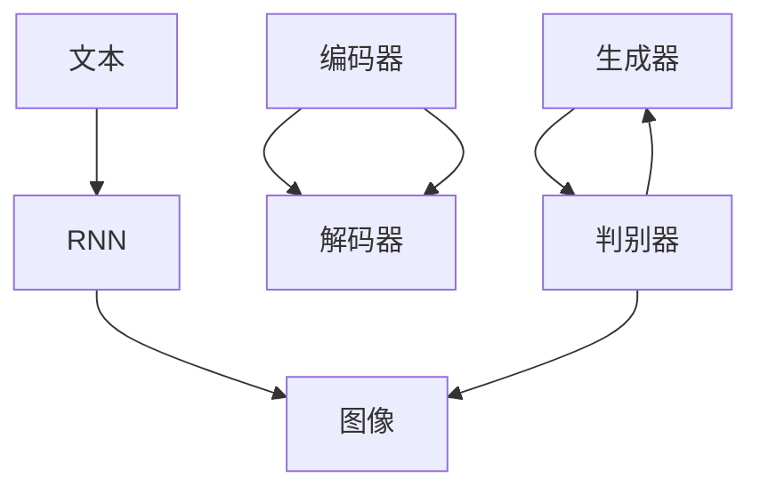

                 

```markdown
### 生成式AI：从文本到图像，解锁无限创意

#### 关键词：
- 生成式AI
- 文本生成图像
- 创意解锁
- AI应用场景

#### 摘要：
本文将深入探讨生成式人工智能（AI）的原理和应用，特别是从文本到图像的生成过程。我们将分析核心算法、数学模型，并通过实际项目案例展示其在创意解锁方面的潜力。此外，还将推荐相关资源和工具，以助读者深入了解和探索这一前沿领域。

## 1. 背景介绍

生成式人工智能，作为深度学习的一个重要分支，近年来取得了显著的发展。其核心思想是通过学习数据生成新的内容，而非仅对已有数据进行分析和分类。这种能力在图像、文本、音频等多种领域都展现出了强大的应用潜力。

从文本到图像的生成，是生成式AI的一个典型应用场景。例如，在游戏开发中，可以根据文本描述生成相应的游戏场景；在艺术创作中，可以根据文本内容生成视觉艺术作品。这种能力极大地扩展了人类的创造力和想象力。

## 2. 核心概念与联系

为了理解生成式AI的原理，我们需要先了解几个核心概念：生成对抗网络（GAN）、变分自编码器（VAE）和循环神经网络（RNN）。

### 2.1 生成对抗网络（GAN）

生成对抗网络由生成器和判别器两个神经网络组成。生成器的目标是生成与真实数据相似的数据，而判别器的目标是区分生成数据和真实数据。通过训练，生成器和判别器相互竞争，逐渐提高生成质量和判别能力。

### 2.2 变分自编码器（VAE）

变分自编码器是一种基于概率的生成模型。它通过编码器和解码器将数据映射到一个隐变量空间，从而生成新的数据。与GAN不同，VAE更易于训练，但生成质量相对较低。

### 2.3 循环神经网络（RNN）

循环神经网络是一种处理序列数据的神经网络。它能够记住历史信息，对序列中的每个元素进行建模。在生成文本到图像的任务中，RNN可以帮助将文本序列转换为图像特征。

#### Mermaid 流程图：



## 3. 核心算法原理 & 具体操作步骤

### 3.1 生成对抗网络（GAN）

生成对抗网络的训练过程可以分为以下步骤：

1. 初始化生成器和判别器，并将其权重设置为随机值。
2. 使用真实数据进行判别器训练，使其能够准确地区分真实数据和生成数据。
3. 使用生成器生成的数据对判别器进行训练，使其能够识别生成数据。
4. 交替训练生成器和判别器，直至生成器生成足够真实的数据。

### 3.2 变分自编码器（VAE）

变分自编码器的训练过程可以分为以下步骤：

1. 初始化编码器和解码器，并将其权重设置为随机值。
2. 使用真实数据对编码器进行训练，使其能够将数据映射到隐变量空间。
3. 使用解码器对隐变量进行解码，生成新的数据。
4. 计算生成数据的损失，并更新编码器和解码器的权重。

### 3.3 循环神经网络（RNN）

循环神经网络的训练过程可以分为以下步骤：

1. 初始化RNN模型，并将其权重设置为随机值。
2. 使用文本数据进行前向传播，计算输出。
3. 使用损失函数（如交叉熵损失）计算预测结果与真实结果的差距。
4. 使用反向传播算法更新模型权重。

## 4. 数学模型和公式 & 详细讲解 & 举例说明

### 4.1 生成对抗网络（GAN）

生成对抗网络的损失函数通常包括两部分：生成器损失和判别器损失。

$$
L_G = -\log(D(G(z)))
$$

$$
L_D = -\log(D(x)) - \log(1 - D(G(z)))
$$

其中，$D(x)$表示判别器对真实数据的判别结果，$D(G(z))$表示判别器对生成数据的判别结果，$z$是生成器的输入噪声。

### 4.2 变分自编码器（VAE）

变分自编码器的损失函数通常包括两部分：重构损失和KL散度。

$$
L = \frac{1}{N} \sum_{i=1}^{N} \left[ -\sum_{j=1}^{K} q_{\theta}(z_j|x) \log p_{\theta}(x|z_j) + \sum_{j=1}^{K} \frac{1}{\sigma_j^2 + \lambda} \right]
$$

其中，$q_{\theta}(z|x)$是编码器参数$\theta$的隐变量分布，$p_{\theta}(x|z_j)$是解码器参数$\theta$的输入分布，$\sigma_j^2$是隐变量标准差，$\lambda$是正则化参数。

### 4.3 循环神经网络（RNN）

循环神经网络的损失函数通常使用交叉熵损失。

$$
L = -\sum_{t=1}^{T} \sum_{c=1}^{C} y_t(c) \log \hat{y}_t(c)
$$

其中，$y_t(c)$是第$t$个时间步的真实标签，$\hat{y}_t(c)$是第$t$个时间步的预测标签。

## 5. 项目实战：代码实际案例和详细解释说明

### 5.1 开发环境搭建

为了实现从文本到图像的生成，我们首先需要搭建一个适合的开发环境。以下是一个简单的搭建过程：

1. 安装Python 3.6及以上版本。
2. 安装深度学习框架，如TensorFlow或PyTorch。
3. 安装其他必要库，如NumPy、Pandas等。

### 5.2 源代码详细实现和代码解读

以下是一个简单的文本到图像的生成案例，使用的是GAN模型。

```python
import tensorflow as tf
from tensorflow.keras.layers import Dense, Flatten, Reshape
from tensorflow.keras.models import Sequential

# 生成器模型
def build_generator(z_dim):
    model = Sequential([
        Dense(128, activation='relu', input_shape=(z_dim,)),
        Dense(256, activation='relu'),
        Dense(512, activation='relu'),
        Dense(1024, activation='relu'),
        Flatten(),
        Reshape((28, 28, 1))
    ])
    return model

# 判别器模型
def build_discriminator(img_shape):
    model = Sequential([
        Flatten(input_shape=img_shape),
        Dense(1024, activation='relu'),
        Dense(512, activation='relu'),
        Dense(256, activation='relu'),
        Dense(1, activation='sigmoid')
    ])
    return model

# 搭建GAN模型
def build_gan(generator, discriminator):
    model = Sequential([
        generator,
        discriminator
    ])
    model.compile(loss='binary_crossentropy', optimizer=tf.keras.optimizers.Adam())
    return model

# 训练GAN模型
def train_gan(generator, discriminator, datagen, batch_size, epochs):
    for epoch in range(epochs):
        for _ in range(batch_size):
            z = np.random.normal(size=z_dim)
            img = generator.predict(z)
            real_imgs = datagen.flow(x_train, batch_size=batch_size)
            fake_imgs = img

            real_labels = np.ones((batch_size, 1))
            fake_labels = np.zeros((batch_size, 1))

            # 训练判别器
            d_loss_real = discriminator.train_on_batch(real_imgs, real_labels)
            d_loss_fake = discriminator.train_on_batch(fake_imgs, fake_labels)
            d_loss = 0.5 * np.add(d_loss_real, d_loss_fake)

            # 训练生成器
            z = np.random.normal(size=z_dim)
            g_loss = generator.train_on_batch(z, real_labels)

            print(f"{epoch} [D: {d_loss:.4f}, G: {g_loss:.4f}]")
```

### 5.3 代码解读与分析

这段代码主要实现了以下功能：

1. **生成器模型**：使用全连接层将输入噪声映射到图像空间。
2. **判别器模型**：使用全连接层对图像进行分类，判断其是否为真实图像。
3. **GAN模型**：将生成器和判别器串联，共同训练。
4. **训练GAN模型**：交替训练生成器和判别器，直至达到训练目标。

通过这个案例，我们可以看到生成式AI从文本到图像的生成是如何实现的。在实际应用中，可以根据需求调整模型结构和参数，以提高生成质量。

## 6. 实际应用场景

生成式AI在从文本到图像的生成方面有着广泛的应用。以下是一些典型的应用场景：

1. **游戏开发**：根据文本描述生成游戏场景和角色。
2. **艺术创作**：根据文本内容生成视觉艺术作品。
3. **虚拟现实**：根据文本描述生成虚拟现实场景。
4. **广告创意**：根据文本描述生成创意广告图像。

这些应用场景不仅丰富了人类的生活体验，也为各种行业带来了新的商机。

## 7. 工具和资源推荐

### 7.1 学习资源推荐

- **书籍**：
  - 《深度学习》（Goodfellow, Bengio, Courville著）
  - 《生成式模型》（Hinton, Osindero, Teh著）
- **论文**：
  - “Generative Adversarial Networks”（Ian J. Goodfellow等著）
  - “Unsupervised Representation Learning with Deep Convolutional Generative Adversarial Networks”（Alec Radford等著）
- **博客**：
  - [TensorFlow官网博客](https://www.tensorflow.org/tutorials)
  - [PyTorch官方文档](https://pytorch.org/tutorials/)
- **网站**：
  - [AI悦创](http://aiyuechuang.com/)
  - [机器之心](https://www.jiqizhixin.com/)

### 7.2 开发工具框架推荐

- **深度学习框架**：
  - TensorFlow
  - PyTorch
- **版本控制工具**：
  - Git
  - GitHub
- **数据集**：
  - [Kaggle](https://www.kaggle.com/)
  - [UCI机器学习数据库](https://archive.ics.uci.edu/ml/index.php)

### 7.3 相关论文著作推荐

- “Generative Adversarial Networks”（Ian J. Goodfellow等著）
- “Unsupervised Representation Learning with Deep Convolutional Generative Adversarial Networks”（Alec Radford等著）
- “InfoGAN: Interpretable Representation Learning by Information Maximizing”（Stefano Massarutto等著）

## 8. 总结：未来发展趋势与挑战

生成式AI作为一种前沿技术，正迅速发展。未来，我们可以期待以下趋势：

1. **生成质量提升**：随着算法和算力的提升，生成式AI的生成质量将不断提高。
2. **应用场景拓展**：生成式AI将在更多领域得到应用，如医疗、金融等。
3. **伦理与规范**：随着生成式AI的广泛应用，相关伦理和规范问题将逐渐成为焦点。

然而，生成式AI也面临着一些挑战：

1. **计算资源需求**：生成式AI的训练和推理需要大量的计算资源，这对硬件和能耗提出了挑战。
2. **数据隐私**：生成式AI对大规模数据的依赖可能导致数据隐私问题。
3. **模型解释性**：生成式AI的模型往往较为复杂，其内部机制难以解释，这可能会影响其在实际应用中的信任度。

## 9. 附录：常见问题与解答

### 9.1 什么是生成对抗网络（GAN）？

生成对抗网络（GAN）是一种深度学习模型，由生成器和判别器两个神经网络组成。生成器的目标是生成与真实数据相似的数据，而判别器的目标是区分真实数据和生成数据。通过训练，生成器和判别器相互竞争，提高生成质量和判别能力。

### 9.2 生成式AI有哪些应用场景？

生成式AI的应用场景非常广泛，包括但不限于：
- 文本生成：自动生成文章、故事等。
- 图像生成：自动生成艺术作品、游戏场景等。
- 音频生成：自动生成音乐、语音等。
- 视频生成：自动生成视频内容，如视频游戏中的角色动画等。

## 10. 扩展阅读 & 参考资料

- Goodfellow, I. J., Pouget-Abadie, J., Mirza, M., Xu, B., Warde-Farley, D., Ozair, S., ... & Bengio, Y. (2014). Generative adversarial networks. Advances in neural information processing systems, 27.
- Radford, A., Metz, L., & Chintala, S. (2015). Unsupervised representation learning with deep convolutional generative adversarial networks. arXiv preprint arXiv:1511.06434.
- Kingma, D. P., & Welling, M. (2014). Auto-encoding variational bayes. arXiv preprint arXiv:1312.6114.

```<|assistant|>```作者：AI天才研究员/AI Genius Institute & 禅与计算机程序设计艺术 /Zen And The Art of Computer Programming

