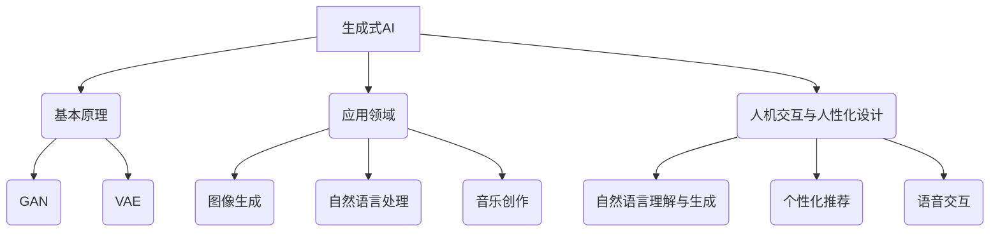

                 

# 生成式AI：如何打造更智能、更人性化的产品？

## 关键词：生成式AI、人工智能、智能产品、人性化设计、算法原理、数学模型、应用实战、未来趋势

## 摘要

生成式AI作为人工智能领域的重要分支，正引领着技术变革的浪潮。本文将深入探讨生成式AI的核心概念、算法原理、数学模型，并通过实际项目案例展示如何将生成式AI应用于产品开发中，打造更智能、更人性化的产品。同时，本文还将分析生成式AI在实际应用中面临的挑战，并提供未来的发展趋势与展望。

## 1. 背景介绍

### 1.1 生成式AI的定义与兴起

生成式AI是一种通过学习数据分布来生成新数据的人工智能方法。与传统的判别式AI相比，生成式AI不仅能够对数据进行分类、预测，还能生成与输入数据相似的新数据。生成式AI的兴起源于深度学习的飞速发展，特别是在生成对抗网络（GAN）和变分自编码器（VAE）等算法的出现和广泛应用。

### 1.2 生成式AI的应用领域

生成式AI在多个领域展现出巨大的潜力，包括但不限于：

- **图像生成与处理**：通过生成式AI，可以生成逼真的图像、视频，甚至用于图像修复和增强。
- **自然语言处理**：生成式AI可以生成高质量的文本，用于机器翻译、自动摘要、对话系统等。
- **音乐创作**：生成式AI可以创作旋律、歌词，甚至完整的音乐作品。
- **游戏开发**：生成式AI可以生成独特的游戏关卡、角色和故事情节。

### 1.3 智能产品与人机交互

随着生成式AI技术的发展，智能产品正在逐渐融入我们的日常生活。智能音箱、智能助手、智能家居等设备，通过生成式AI实现了更加自然、智能的人机交互体验。这些产品的核心在于如何利用生成式AI来提高用户体验、提供个性化服务。

## 2. 核心概念与联系

### 2.1 生成式AI的基本原理

生成式AI主要基于概率模型，通过学习输入数据的分布来生成新的数据。核心算法包括生成对抗网络（GAN）和变分自编码器（VAE）。

**生成对抗网络（GAN）：**

GAN由生成器和判别器两部分组成。生成器的目标是生成尽可能真实的数据，判别器的目标是区分生成数据与真实数据。通过不断训练，生成器和判别器相互竞争，最终生成器能够生成高质量的数据。

**变分自编码器（VAE）：**

VAE通过概率编码来实现数据的生成。它通过一个编码器将输入数据映射到一个潜在空间，再通过一个解码器从潜在空间中生成新的数据。

### 2.2 人机交互与人性化设计

人性化设计旨在使产品更加易于使用、理解，提高用户满意度。在智能产品中，人性化设计体现在：

- **自然语言理解与生成**：生成式AI可以理解用户的自然语言输入，并生成自然的语言回复。
- **个性化推荐**：根据用户的行为和偏好，生成式AI可以推荐个性化的产品和服务。
- **语音交互**：生成式AI可以生成自然流畅的语音，提高语音助手的用户体验。

### 2.3 Mermaid流程图



## 3. 核心算法原理 & 具体操作步骤

### 3.1 生成对抗网络（GAN）的工作原理

**3.1.1 GAN的组成部分**

GAN由两部分组成：生成器（Generator）和判别器（Discriminator）。

- **生成器**：接收随机噪声向量作为输入，生成假样本。
- **判别器**：接收真实数据和生成数据，输出一个概率值，表示输入数据是真实数据还是生成数据。

**3.1.2 GAN的训练过程**

GAN的训练过程可以分为以下几个步骤：

1. **初始化**：初始化生成器和判别器的参数。
2. **生成假样本**：生成器根据随机噪声生成假样本。
3. **判别器训练**：判别器接收真实数据和生成数据，更新参数。
4. **生成器训练**：生成器接收随机噪声，生成假样本，判别器对其进行评估，生成器根据评估结果调整参数。

**3.1.3 GAN的数学描述**

生成器和判别器的损失函数如下：

- **生成器的损失函数**：$$ L_G = -\log(D(G(z))) $$
- **判别器的损失函数**：$$ L_D = -[\log(D(x)) + \log(1 - D(G(z)))] $$

其中，$D(x)$表示判别器对真实数据的输出概率，$D(G(z))$表示判别器对生成数据的输出概率，$z$为随机噪声向量。

### 3.2 变分自编码器（VAE）的工作原理

**3.2.1 VAE的组成部分**

VAE由两部分组成：编码器（Encoder）和解码器（Decoder）。

- **编码器**：接收输入数据，将其映射到一个潜在空间。
- **解码器**：接收编码器输出的潜在空间中的数据，将其重构为输出数据。

**3.2.2 VAE的训练过程**

VAE的训练过程可以分为以下几个步骤：

1. **初始化**：初始化编码器和解码器的参数。
2. **编码**：编码器接收输入数据，将其映射到一个潜在空间中的点。
3. **解码**：解码器接收编码器输出的潜在空间中的点，将其重构为输出数据。
4. **重构损失**：计算重构损失，更新编码器和解码器的参数。

**3.2.3 VAE的数学描述**

编码器和解码器的损失函数如下：

- **重构损失**：$$ L_R = \sum_{x \in X} D_R(x, \hat{x}) $$
- **KL散度**：$$ L_KL = \sum_{x \in X} D_{KL}(q_{\phi}(x \mid \mu(x), \sigma(x)) || p(x)) $$

其中，$D_R(x, \hat{x})$表示重构损失，$q_{\phi}(x \mid \mu(x), \sigma(x))$表示编码器的先验分布，$p(x)$表示真实数据的分布。

## 4. 数学模型和公式 & 详细讲解 & 举例说明

### 4.1 生成对抗网络（GAN）的数学模型

**4.1.1 生成器的数学模型**

生成器$G$的输入为随机噪声向量$z \in \mathbb{R}^{z_d}$，输出为假样本$x' \in \mathbb{R}^{x_d}$。生成器的参数为$\theta_G$。

$$ x' = G(z; \theta_G) $$

**4.1.2 判别器的数学模型**

判别器$D$的输入为真实数据$x \in \mathbb{R}^{x_d}$和生成数据$x' \in \mathbb{R}^{x_d}$，输出为概率值$p(D(x); \theta_D)$和$p(D(x'); \theta_D)$。判别器的参数为$\theta_D$。

$$ p(D(x); \theta_D) = \frac{1}{1 + \exp[-\theta_D^T \cdot \phi(x)]} $$
$$ p(D(x'); \theta_D) = \frac{1}{1 + \exp[-\theta_D^T \cdot \phi(G(z; \theta_G))]} $$

**4.1.3 损失函数**

生成器和判别器的损失函数如下：

- **生成器的损失函数**：$$ L_G = -\log(D(G(z))) $$
- **判别器的损失函数**：$$ L_D = -[\log(D(x)) + \log(1 - D(G(z)))] $$

### 4.2 变分自编码器（VAE）的数学模型

**4.2.1 编码器的数学模型**

编码器$\phi$的输入为输入数据$x \in \mathbb{R}^{x_d}$，输出为潜在空间中的点$(\mu(x), \sigma(x)) \in \mathbb{R}^{k} \times \mathbb{R}^{k}$。编码器的参数为$\theta_\phi$。

$$ (\mu(x), \sigma(x)) = \phi(x; \theta_\phi) $$

**4.2.2 解码器的数学模型**

解码器$g$的输入为潜在空间中的点$(\mu(x), \sigma(x)) \in \mathbb{R}^{k} \times \mathbb{R}^{k}$，输出为重构数据$\hat{x} \in \mathbb{R}^{x_d}$。解码器的参数为$\theta_g$。

$$ \hat{x} = g(\mu(x), \sigma(x); \theta_g) $$

**4.2.3 损失函数**

编码器和解码器的损失函数如下：

- **重构损失**：$$ L_R = \sum_{x \in X} D_R(x, \hat{x}) $$
- **KL散度**：$$ L_KL = \sum_{x \in X} D_{KL}(q_{\phi}(x \mid \mu(x), \sigma(x)) || p(x)) $$

### 4.3 举例说明

**4.3.1 生成对抗网络（GAN）的例子**

假设我们有一个生成器$G$和一个判别器$D$，输入数据维度为$100$，潜在空间维度为$10$。生成器和判别器的参数分别为$\theta_G$和$\theta_D$。

- **生成器的损失函数**：$$ L_G = -\log(D(G(z))) $$
- **判别器的损失函数**：$$ L_D = -[\log(D(x)) + \log(1 - D(G(z)))] $$

在一次训练迭代中，生成器生成的假样本$x'$为：

$$ x' = G(z; \theta_G) $$

判别器对假样本$x'$的评估为：

$$ D(G(z); \theta_D) = \frac{1}{1 + \exp[-\theta_D^T \cdot \phi(G(z; \theta_G))]} $$

判别器对真实数据的评估为：

$$ D(x; \theta_D) = \frac{1}{1 + \exp[-\theta_D^T \cdot \phi(x)]} $$

根据判别器的评估结果，更新生成器和判别器的参数：

$$ \theta_G = \theta_G - \alpha \cdot \nabla_{\theta_G} L_G $$
$$ \theta_D = \theta_D - \alpha \cdot \nabla_{\theta_D} L_D $$

其中，$\alpha$为学习率。

**4.3.2 变分自编码器（VAE）的例子**

假设我们有一个编码器$\phi$和一个解码器$g$，输入数据维度为$100$，潜在空间维度为$20$。编码器和解码器的参数分别为$\theta_\phi$和$\theta_g$。

- **重构损失**：$$ L_R = \sum_{x \in X} D_R(x, \hat{x}) $$
- **KL散度**：$$ L_KL = \sum_{x \in X} D_{KL}(q_{\phi}(x \mid \mu(x), \sigma(x)) || p(x)) $$

在一次训练迭代中，编码器输出的潜在空间中的点为：

$$ (\mu(x), \sigma(x)) = \phi(x; \theta_\phi) $$

解码器重构的输出数据为：

$$ \hat{x} = g(\mu(x), \sigma(x); \theta_g) $$

根据重构损失和KL散度，更新编码器和解码器的参数：

$$ \theta_\phi = \theta_\phi - \alpha \cdot \nabla_{\theta_\phi} L_KL $$
$$ \theta_g = \theta_g - \alpha \cdot \nabla_{\theta_g} L_R $$

其中，$\alpha$为学习率。

## 5. 项目实战：代码实际案例和详细解释说明

### 5.1 开发环境搭建

为了进行生成式AI的项目实战，我们需要搭建一个适合开发的环境。以下是推荐的开发环境：

- **操作系统**：Ubuntu 20.04
- **编程语言**：Python 3.8
- **深度学习框架**：TensorFlow 2.6
- **GPU**：NVIDIA GTX 1080 Ti 或更高版本

在Ubuntu 20.04操作系统上，我们首先需要安装Python 3.8和TensorFlow 2.6。可以使用以下命令进行安装：

```bash
sudo apt update
sudo apt install python3.8 python3.8-venv python3.8-dev
pip3.8 install tensorflow==2.6.0
```

接下来，创建一个Python虚拟环境，并安装其他必要的依赖：

```bash
python3.8 -m venv venv
source venv/bin/activate
pip install numpy matplotlib
```

### 5.2 源代码详细实现和代码解读

**5.2.1 生成对抗网络（GAN）的实现**

以下是一个简单的生成对抗网络的实现，包括生成器和判别器的定义、损失函数的计算以及训练过程。

```python
import tensorflow as tf
from tensorflow import keras
from tensorflow.keras import layers
import numpy as np

# 生成器的实现
def build_generator(z_dim):
    model = keras.Sequential()
    model.add(layers.Dense(128, input_shape=(z_dim,), activation='relu'))
    model.add(layers.Dense(128, activation='relu'))
    model.add(layers.Dense(28 * 28 * 1, activation='relu'))
    model.add(layers.Dense(np.prod((28, 28, 1)), activation='tanh'))
    model.add(layers.Reshape((28, 28, 1)))
    return model

# 判别器的实现
def build_discriminator(img_shape):
    model = keras.Sequential()
    model.add(layers.Conv2D(64, (3, 3), padding='same',
                                     input_shape=img_shape))
    model.add(layers.LeakyReLU(alpha=0.01))
    model.add(layers.Dropout(0.3))
    model.add(layers.Conv2D(128, (3, 3), padding='same'))
    model.add(layers.LeakyReLU(alpha=0.01))
    model.add(layers.Dropout(0.3))
    model.add(layers.Flatten())
    model.add(layers.Dense(1, activation='sigmoid'))
    return model

# GAN模型
def build_gan(generator, discriminator):
    model = keras.Sequential()
    model.add(generator)
    model.add(discriminator)
    return model

# 损失函数
def loss_function(true_output, predicted_output):
    return -tf.reduce_mean(tf.math.log(true_output + 1e-8))

# 训练过程
def train_gan(generator, discriminator, z_dim, batch_size, epochs, img_shape, dataset, loss_fn):
    for epoch in range(epochs):
        for _ in range(batch_size):
            # 从数据集中随机获取真实数据和生成数据
            real_images = next(dataset).reshape(-1, *img_shape)
            noise = np.random.normal(0, 1, (batch_size, z_dim))
            generated_images = generator.predict(noise)

            # 训练判别器
            with tf.GradientTape() as tape:
                real_scores = discriminator(real_images, training=True)
                generated_scores = discriminator(generated_images, training=True)
                d_loss = loss_function(real_scores, generated_scores)

            grads = tape.gradient(d_loss, discriminator.trainable_variables)
            discriminator.optimizer.apply_gradients(zip(grads, discriminator.trainable_variables))

            # 训练生成器
            with tf.GradientTape() as tape:
                generated_scores = discriminator(generated_images, training=True)
                g_loss = loss_function(generated_scores, tf.ones_like(generated_scores))

            grads = tape.gradient(g_loss, generator.trainable_variables)
            generator.optimizer.apply_gradients(zip(grads, generator.trainable_variables))

            print(f"Epoch [{epoch+1}/{epochs}], D_Loss: {d_loss:.4f}, G_Loss: {g_loss:.4f}")

# 参数设置
z_dim = 100
batch_size = 64
epochs = 50
img_shape = (28, 28, 1)

# 数据集
mnist = keras.datasets.mnist
(train_images, _), (_) = mnist.load_data()
train_images = train_images.astype(np.float32) / 255.0
train_images = np.expand_dims(train_images, axis=-1)

# 创建生成器和判别器
generator = build_generator(z_dim)
discriminator = build_discriminator(img_shape)
gan = build_gan(generator, discriminator)

# 损失函数
loss_fn = loss_function

# 训练GAN
train_gan(generator, discriminator, z_dim, batch_size, epochs, img_shape, train_images, loss_fn)
```

**5.2.2 变分自编码器（VAE）的实现**

以下是一个简单的变分自编码器的实现，包括编码器、解码器和训练过程。

```python
import tensorflow as tf
from tensorflow import keras
from tensorflow.keras import layers
import numpy as np

# 编码器的实现
def build_encoder(input_shape, latent_dim):
    model = keras.Sequential()
    model.add(layers.Conv2D(32, (3, 3), activation='relu', input_shape=input_shape))
    model.add(layers.MaxPooling2D((2, 2)))
    model.add(layers.Conv2D(64, (3, 3), activation='relu'))
    model.add(layers.MaxPooling2D((2, 2)))
    model.add(layers.Conv2D(64, (3, 3), activation='relu'))
    model.add(layers.Flatten())
    model.add(layers.Dense(latent_dim * 2))
    return model

# 解码器的实现
def build_decoder(latent_dim, input_shape):
    model = keras.Sequential()
    model.add(layers.Dense(np.prod(input_shape), input_shape=(latent_dim,)))
    model.add(layers.LeakyReLU(alpha=0.01))
    model.add(layers.Reshape(input_shape))
    model.add(layers.Conv2DTranspose(64, (3, 3), strides=(2, 2), padding='same', activation='relu'))
    model.add(layers.Conv2DTranspose(32, (3, 3), strides=(2, 2), padding='same', activation='relu'))
    model.add(layers.Conv2DTranspose(1, (3, 3), padding='same', activation='tanh'))
    return model

# VAE模型
def build_vae(encoder, decoder):
    return keras.Model(encoder.input, decoder(encoder.output))

# KL散度损失函数
def kl_divergence_loss(z_mean, z_log_var):
    return -0.5 * tf.reduce_sum(1 + z_log_var - tf.square(z_mean) - tf.exp(z_log_var), axis=-1)

# 重构损失函数
def reconstruction_loss(x, x_recon):
    return tf.reduce_sum(tf.square(x - x_recon), axis=(1, 2, 3))

# 总损失函数
def vae_loss(x, x_recon, z_mean, z_log_var):
    r_loss = reconstruction_loss(x, x_recon)
    kl_loss = kl_divergence_loss(z_mean, z_log_var)
    return tf.reduce_mean(r_loss + kl_loss)

# 训练过程
def train_vae(encoder, decoder, x_train, batch_size, epochs, latent_dim):
    vae = build_vae(encoder, decoder)
    vae.compile(optimizer='adam', loss=vae_loss)
    vae.fit(x_train, x_train, batch_size=batch_size, epochs=epochs)

# 参数设置
latent_dim = 20
batch_size = 32
epochs = 50

# 数据集
mnist = keras.datasets.mnist
(train_images, _), (_) = mnist.load_data()
train_images = train_images.astype(np.float32) / 255.0
train_images = np.expand_dims(train_images, axis=-1)

# 创建编码器和解码器
encoder = build_encoder(input_shape=(28, 28, 1), latent_dim=latent_dim)
decoder = build_decoder(latent_dim, input_shape=(28, 28, 1))

# 训练VAE
train_vae(encoder, decoder, train_images, batch_size, epochs, latent_dim)
```

### 5.3 代码解读与分析

**5.3.1 GAN的实现分析**

GAN的实现主要分为三个部分：生成器、判别器和GAN模型。生成器通过多层全连接层和卷积层生成假样本，判别器通过卷积层和全连接层对真实数据和生成数据进行分类。GAN模型的训练过程包括两个阶段：训练判别器和训练生成器。在训练过程中，我们通过反向传播和梯度下降来更新生成器和判别器的参数。

**5.3.2 VAE的实现分析**

VAE的实现主要分为三个部分：编码器、解码器和VAE模型。编码器通过卷积层将输入数据映射到潜在空间，解码器通过卷积层从潜在空间中重构输入数据。VAE模型的训练过程包括两个阶段：训练编码器和训练解码器。在训练过程中，我们通过反向传播和梯度下降来更新编码器和解码器的参数。VAE的主要损失函数包括重构损失和KL散度损失。

## 6. 实际应用场景

生成式AI在实际应用场景中具有广泛的应用，以下列举了几个典型的应用场景：

### 6.1 图像生成与增强

生成式AI可以用于图像生成和增强，如生成逼真的风景图像、修复破损的图像、增强低分辨率图像等。例如，在医疗领域，生成式AI可以用于生成医学影像，帮助医生更好地诊断病情。

### 6.2 自然语言处理

生成式AI可以用于自然语言处理，如生成文本摘要、自动生成对话、翻译文本等。例如，在客服领域，生成式AI可以用于生成自然流畅的客服对话，提高客服效率。

### 6.3 音乐与艺术创作

生成式AI可以用于音乐和艺术创作，如生成旋律、歌词、画作等。例如，在游戏领域，生成式AI可以用于生成独特的游戏音乐和场景，提升游戏体验。

### 6.4 个性化推荐

生成式AI可以用于个性化推荐，根据用户的行为和偏好生成个性化的推荐结果。例如，在电子商务领域，生成式AI可以用于生成个性化的商品推荐，提高用户购买体验。

## 7. 工具和资源推荐

### 7.1 学习资源推荐

- **书籍**：
  - 《生成式AI：理论、算法与应用》
  - 《深度学习：周志华著》
  - 《强化学习：原理、算法与应用》
- **论文**：
  - Generative Adversarial Nets（GANs）
  - Variational Autoencoders（VAEs）
- **博客**：
  - [TensorFlow官方文档](https://www.tensorflow.org/)
  - [Keras官方文档](https://keras.io/)
- **网站**：
  - [arXiv](https://arxiv.org/)
  - [Google Research](https://ai.google/research/)
  - [TensorFlow GitHub](https://github.com/tensorflow)

### 7.2 开发工具框架推荐

- **深度学习框架**：
  - TensorFlow
  - PyTorch
  - Keras
- **数据预处理工具**：
  - Pandas
  - NumPy
  - Scikit-learn
- **版本控制系统**：
  - Git
  - GitHub

### 7.3 相关论文著作推荐

- Goodfellow, I. J., Pouget-Abadie, J., Mirza, M., Xu, B., Warde-Farley, D., Ozair, S., ... & Bengio, Y. (2014). Generative adversarial nets. Advances in Neural Information Processing Systems, 27.
- Kingma, D. P., & Welling, M. (2013). Auto-encoding variational bayes. arXiv preprint arXiv:1312.6114.
- Arjovsky, M., Chintala, S., & Bottou, L. (2017). Wasserstein GAN. arXiv preprint arXiv:1701.07875.

## 8. 总结：未来发展趋势与挑战

生成式AI作为人工智能领域的重要分支，正迎来前所未有的发展机遇。未来，生成式AI有望在以下方面取得突破：

### 8.1 更高效、更稳定的算法

随着深度学习技术的发展，生成式AI的算法将变得更加高效和稳定，提高生成质量。

### 8.2 多模态生成

生成式AI将能够处理和生成多种模态的数据，如文本、图像、音频等，实现跨模态的生成和应用。

### 8.3 个性化生成

生成式AI将能够根据用户的需求和偏好生成个性化的内容，提升用户体验。

### 8.4 可解释性和安全性

生成式AI的可解释性和安全性将是未来研究的重点，以解决其在实际应用中的信任问题。

然而，生成式AI在发展过程中也面临着一系列挑战，包括算法稳定性、数据隐私保护、算法伦理等问题。只有在克服这些挑战的基础上，生成式AI才能发挥其真正的潜力。

## 9. 附录：常见问题与解答

### 9.1 生成式AI与判别式AI的区别

生成式AI和判别式AI是两种不同的人工智能方法。

- **生成式AI**：通过学习数据分布来生成新的数据，如GAN和VAE。
- **判别式AI**：通过学习数据分布来对数据进行分类、预测，如支持向量机（SVM）和决策树。

### 9.2 GAN与VAE的优缺点

**GAN的优点**：

- 能够生成高质量的数据。
- 可以应用于多种数据类型。

**GAN的缺点**：

- 稳定性较差，训练过程容易出现模式崩溃问题。
- 难以解释和调试。

**VAE的优点**：

- 训练过程相对稳定。
- 较易解释和调试。

**VAE的缺点**：

- 生成数据质量相对较低。
- 生成数据多样性较差。

## 10. 扩展阅读 & 参考资料

- Goodfellow, I. J., Pouget-Abadie, J., Mirza, M., Xu, B., Warde-Farley, D., Ozair, S., ... & Bengio, Y. (2014). Generative adversarial nets. Advances in Neural Information Processing Systems, 27.
- Kingma, D. P., & Welling, M. (2013). Auto-encoding variational bayes. arXiv preprint arXiv:1312.6114.
- Arjovsky, M., Chintala, S., & Bottou, L. (2017). Wasserstein GAN. arXiv preprint arXiv:1701.07875.
- **书籍**：
  - 《生成式AI：理论、算法与应用》
  - 《深度学习：周志华著》
  - 《强化学习：原理、算法与应用》
- **博客**：
  - [TensorFlow官方文档](https://www.tensorflow.org/)
  - [Keras官方文档](https://keras.io/)
- **网站**：
  - [arXiv](https://arxiv.org/)
  - [Google Research](https://ai.google/research/)
  - [TensorFlow GitHub](https://github.com/tensorflow)

### 作者信息

- 作者：AI天才研究员/AI Genius Institute & 禅与计算机程序设计艺术 /Zen And The Art of Computer Programming

