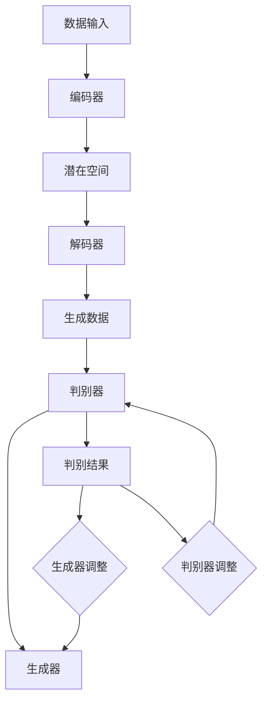

                 

### 背景介绍

生成式AI，作为人工智能领域的一个新兴分支，近年来在全球范围内引起了广泛关注。它是一种能够根据输入数据生成文本、图像、音频等多种形式内容的AI技术。其原理基于深度学习，特别是变分自编码器（VAE）和生成对抗网络（GAN）等算法的发展。生成式AI在诸如自动驾驶、智能医疗、娱乐内容生成等众多领域展现出巨大的应用潜力。

然而，在生成式AI的迅猛发展的背后，也存在诸多争议。一些人认为，这项技术是一片金矿，可以带来巨大的商业价值和社会进步。而另一些人则持悲观态度，认为它可能只是泡沫，最终会破裂。这种分歧不仅体现在学术界，也渗透到了产业界。

本文旨在探讨生成式AI：金矿还是泡沫？我们将首先回顾生成式AI的发展历程，理解其核心概念和关键技术。接着，我们将分析其潜在的商业价值和应用场景，探讨当前面临的技术挑战。最后，我们将总结生成式AI的未来发展趋势和潜在风险，提出应对策略。

通过这一系列的讨论，我们希望为读者提供一个全面、深入的视角，帮助大家更好地理解生成式AI的本质，并对其进行客观评价。在接下来的章节中，我们将逐步展开这一主题，希望通过逻辑清晰、结构紧凑的论证，为大家揭示生成式AI的真实面貌。

### 核心概念与联系

要深入理解生成式AI，我们首先需要明确其核心概念与基本原理，并探讨它们之间的内在联系。生成式AI的发展离不开以下几个关键概念和技术的支撑。

#### 1. 深度学习

深度学习是生成式AI的基础，它是一种通过模拟人脑神经网络进行数据处理的机器学习技术。深度学习的核心在于多层神经网络（Deep Neural Networks，DNN），这些网络通过层层递进的学习方式，从原始数据中提取特征，进行复杂模式的识别和预测。

在生成式AI中，深度学习模型被用来捕捉数据的分布特征，从而生成新的数据。例如，变分自编码器（Variational Autoencoder，VAE）和生成对抗网络（Generative Adversarial Network，GAN）就是基于深度学习的经典模型。

#### 2. 变分自编码器（VAE）

变分自编码器是一种基于概率模型的生成式模型，旨在学习数据的高斯分布。其基本原理是通过编码器（Encoder）将输入数据映射到一个潜在空间，再通过解码器（Decoder）将潜在空间的数据映射回生成数据。

VAE的优点在于能够生成高质量的样本，并且在生成过程中保持数据的多样性。其数学模型可以表示为：

$$
\begin{aligned}
x &= \mu(z) + \sigma(z)\epsilon \\
z &= \phi(x)
\end{aligned}
$$

其中，\(x\) 是输入数据，\(z\) 是潜在空间的数据，\(\mu(z)\) 和 \(\sigma(z)\) 分别是均值和方差，\(\epsilon\) 是噪声。

#### 3. 生成对抗网络（GAN）

生成对抗网络是一种由生成器（Generator）和判别器（Discriminator）组成的对抗性模型。生成器旨在生成与真实数据难以区分的假数据，而判别器则负责区分真实数据和生成数据。通过这种对抗性训练，生成器和判别器不断优化，最终生成器能够生成高质量的样本。

GAN的数学模型可以表示为：

$$
\begin{aligned}
D(x) &= P(x \text{ is real}) \\
D(G(z)) &= P(z \text{ is generated})
\end{aligned}
$$

其中，\(x\) 是真实数据，\(z\) 是生成器生成的假数据。

#### 4. 基本原理和架构的Mermaid流程图

为了更好地理解上述概念和模型之间的联系，我们使用Mermaid流程图对生成式AI的基本原理和架构进行展示。以下是Mermaid流程图的描述：



在这个流程图中，数据输入经过编码器映射到潜在空间，再由解码器生成数据。同时，判别器不断对生成数据进行判断，反馈给生成器和判别器进行调整。这一过程不断迭代，最终实现高质量数据的生成。

通过上述讨论，我们可以看到生成式AI的核心概念和关键技术之间的紧密联系。深度学习为生成式AI提供了基础，而VAE和GAN等模型则在实际应用中展现了其强大的生成能力。理解这些概念和原理，是深入探讨生成式AI应用价值和技术挑战的前提。

### 核心算法原理 & 具体操作步骤

生成式AI的核心在于其算法原理，特别是变分自编码器（VAE）和生成对抗网络（GAN）的实现。以下是这些算法的详细原理和操作步骤。

#### 1. 变分自编码器（VAE）

变分自编码器是一种基于概率模型的生成式模型，其核心思想是将输入数据映射到一个潜在空间，再从潜在空间中生成输出数据。VAE由两部分组成：编码器和解码器。

**编码器：**

编码器的目的是将输入数据映射到一个潜在空间中。这个过程通常通过一个隐含层（隐含变量）来实现，隐含层中的神经元数量通常远小于输入和输出层的神经元数量。

**数学原理：**

假设输入数据为 \(x \in \mathbb{R}^{D}\)，潜在空间中的数据为 \(z \in \mathbb{R}^{d}\)（其中 \(D > d\)），编码器的输出为两个参数向量：均值 \(\mu\) 和方差 \(\sigma\)。

$$
\begin{aligned}
\mu &= \mu(x) \\
\sigma &= \sigma(x)
\end{aligned}
$$

其中，\(\mu\) 和 \(\sigma\) 分别表示隐含层中每个神经元的均值和方差。

**操作步骤：**

1. 对输入数据进行归一化处理，例如通过减去均值并除以标准差。
2. 通过一个全连接神经网络对输入数据进行编码，得到均值 \(\mu\) 和方差 \(\sigma\)。
3. 生成隐含变量 \(z\)，公式为：

$$
z = \mu + \sigma \odot \epsilon
$$

其中，\(\epsilon\) 是均值为0，方差为1的高斯噪声。

**解码器：**

解码器的目的是将隐含空间的数据映射回原始数据空间。同样，通过一个全连接神经网络实现。

**数学原理：**

解码器接收隐含变量 \(z\)，并生成输出数据 \(x'\)。

$$
x' = \mu(z) + \sigma(z) \odot \epsilon'
$$

其中，\(\mu(z)\) 和 \(\sigma(z)\) 分别是解码器的输出均值和方差，\(\epsilon'\) 是新的高斯噪声。

**操作步骤：**

1. 对隐含变量 \(z\) 进行归一化处理。
2. 通过一个全连接神经网络对隐含变量进行解码，得到输出数据。

**VAE模型训练：**

VAE的训练目标是最大化数据分布的重构概率。使用变分下界（Variational Lower Bound，VLB）作为损失函数：

$$
L = \mathbb{E}_{q(z|x)[\log \frac{p(x|z)}{q(z|x)}]} + D_{KL}(q(z|x)||p(z))
$$

其中，\(p(x|z)\) 是生成器的概率分布，\(q(z|x)\) 是编码器的概率分布，\(D_{KL}\) 是KL散度。

**训练步骤：**

1. 初始化编码器和解码器的参数。
2. 对于每个输入数据 \(x\)：
   - 通过编码器计算 \(\mu\) 和 \(\sigma\)。
   - 生成隐含变量 \(z\)。
   - 通过解码器生成重构数据 \(x'\)。
   - 计算损失函数 \(L\)。
   - 使用梯度下降更新编码器和解码器的参数。

#### 2. 生成对抗网络（GAN）

生成对抗网络是一种基于对抗性训练的生成模型，由生成器（Generator）和判别器（Discriminator）组成。生成器的目标是生成尽可能真实的数据，而判别器的目标是区分真实数据和生成数据。

**数学原理：**

生成器 \(G\) 和判别器 \(D\) 的训练目标是通过对抗性训练优化模型参数。

生成器：\(G(z)\) 生成假数据，使其尽可能接近真实数据。

判别器：\(D(x)\) 和 \(D(G(z))\) 分别表示判别器对真实数据和生成数据的判断概率。

**损失函数：**

GAN的训练目标是最小化判别器的交叉熵损失，同时最大化生成器的生成能力。

$$
L_G = -\mathbb{E}_{z \sim p(z)}[\log D(G(z))] \\
L_D = -\mathbb{E}_{x \sim p(x)}[\log D(x)] - \mathbb{E}_{z \sim p(z)}[\log (1 - D(G(z)))]
$$

**训练步骤：**

1. 初始化生成器 \(G\) 和判别器 \(D\) 的参数。
2. 对于每个训练迭代：
   - 通过噪声向量 \(z\) 生成假数据 \(x_G = G(z)\)。
   - 使用真实数据 \(x\) 和假数据 \(x_G\) 训练判别器 \(D\)。
   - 使用判别器 \(D\) 的输出 \(D(G(z))\) 训练生成器 \(G\)。

通过上述步骤，生成器和判别器不断迭代优化，最终生成器能够生成高质量的数据。

#### 3. 实例说明

为了更好地理解VAE和GAN的原理，我们通过一个简单的实例来说明。

**实例：生成手写数字**

假设我们使用MNIST数据集，目标是生成手写数字图像。

**VAE训练：**

1. 初始化编码器和解码器的参数。
2. 对于每个输入图像 \(x\)：
   - 通过编码器计算均值 \(\mu\) 和方差 \(\sigma\)。
   - 生成隐含变量 \(z\)。
   - 通过解码器生成重构图像 \(x'\)。
   - 计算损失函数 \(L\)。
   - 使用梯度下降更新编码器和解码器的参数。

**GAN训练：**

1. 初始化生成器和判别器的参数。
2. 对于每个训练迭代：
   - 通过噪声向量 \(z\) 生成假数字图像 \(x_G = G(z)\)。
   - 使用真实数字图像和假数字图像训练判别器 \(D\)。
   - 使用判别器 \(D\) 的输出 \(D(G(z))\) 训练生成器 \(G\)。

通过上述训练，生成器和判别器最终能够生成接近真实数字图像的手写数字。

通过以上分析，我们可以看到VAE和GAN的核心算法原理和具体操作步骤。这些算法在生成式AI中扮演着重要角色，为实现高质量数据生成提供了强大的技术支撑。接下来，我们将进一步探讨生成式AI的数学模型和公式。

### 数学模型和公式 & 详细讲解 & 举例说明

生成式AI的核心算法——变分自编码器（VAE）和生成对抗网络（GAN）——均依赖于复杂的数学模型和公式。本节将详细讲解这些数学模型，并通过具体例子说明其在实际应用中的效果。

#### 1. 变分自编码器（VAE）

VAE的核心在于其概率模型，通过概率密度函数的估计实现数据的生成。以下是VAE的主要数学模型和公式：

**1.1 概率密度函数**

VAE假设输入数据 \(x\) 和潜在变量 \(z\) 服从以下概率密度函数：

$$
p(x) = \int p(x|z) p(z) dz
$$

其中，\(p(x|z)\) 是生成器概率密度函数，\(p(z)\) 是潜在变量的先验分布。

**1.2 编码器与解码器**

编码器将输入数据映射到潜在空间：

$$
\begin{aligned}
\mu &= \mu(x) \\
\sigma &= \sigma(x)
\end{aligned}
$$

解码器则从潜在空间生成输出数据：

$$
x' = \mu(z) + \sigma(z) \odot \epsilon
$$

其中，\(\epsilon\) 是高斯噪声，\(\mu(z)\) 和 \(\sigma(z)\) 分别是潜在空间中的均值和方差。

**1.3 重构损失与KL散度**

VAE的训练目标是最小化重构损失和KL散度：

$$
L = \mathbb{E}_{q(z|x)[\log \frac{p(x|z)}{q(z|x)}]} + D_{KL}(q(z|x)||p(z))
$$

其中，\(q(z|x)\) 是编码器的概率密度函数，\(p(x|z)\) 是生成器的概率密度函数，\(D_{KL}\) 是KL散度。

**1.4 梯度下降优化**

使用梯度下降法优化VAE的参数，包括编码器和解码器的参数。具体步骤如下：

1. 初始化编码器和解码器的参数。
2. 对于每个输入数据 \(x\)：
   - 通过编码器计算 \(\mu\) 和 \(\sigma\)。
   - 生成隐含变量 \(z\)。
   - 通过解码器生成重构数据 \(x'\)。
   - 计算损失函数 \(L\)。
   - 使用梯度下降更新编码器和解码器的参数。

**1.5 举例说明**

假设我们要使用VAE生成手写数字图像。我们以MNIST数据集为例，首先对数据集进行预处理，然后初始化编码器和解码器的参数。通过多次迭代训练，编码器和解码器能够学习到数据的分布特征，从而生成高质量的手写数字图像。

#### 2. 生成对抗网络（GAN）

GAN的核心在于生成器和判别器的对抗性训练。以下是GAN的主要数学模型和公式：

**2.1 生成器与判别器**

生成器 \(G\) 的目标是生成假数据 \(x_G\)：

$$
x_G = G(z)
$$

判别器 \(D\) 的目标是区分真实数据 \(x\) 和生成数据 \(x_G\)：

$$
D(x) = P(x \text{ is real}) \\
D(G(z)) = P(z \text{ is generated})
$$

**2.2 损失函数**

GAN的训练目标是最小化判别器的交叉熵损失和最大化生成器的生成能力：

$$
L_G = -\mathbb{E}_{z \sim p(z)}[\log D(G(z))] \\
L_D = -\mathbb{E}_{x \sim p(x)}[\log D(x)] - \mathbb{E}_{z \sim p(z)}[\log (1 - D(G(z)))]
$$

**2.3 梯度下降优化**

使用梯度下降法优化GAN的参数，包括生成器 \(G\) 和判别器 \(D\) 的参数。具体步骤如下：

1. 初始化生成器 \(G\) 和判别器 \(D\) 的参数。
2. 对于每个训练迭代：
   - 通过噪声向量 \(z\) 生成假数据 \(x_G = G(z)\)。
   - 使用真实数据和假数据训练判别器 \(D\)。
   - 使用判别器 \(D\) 的输出 \(D(G(z))\) 训练生成器 \(G\)。

**2.4 举例说明**

假设我们要使用GAN生成人脸图像。我们以CelebA数据集为例，首先对数据集进行预处理，然后初始化生成器和判别器的参数。通过多次迭代训练，生成器能够生成高质量的人脸图像，而判别器能够准确区分真实人脸和生成人脸。

通过以上分析，我们可以看到VAE和GAN的数学模型和公式。这些模型和公式在实际应用中发挥着关键作用，为实现高质量数据生成提供了坚实的理论基础。在实际应用中，通过合理设计网络结构、优化训练策略，我们可以进一步提高生成式AI的性能。

### 项目实战：代码实际案例和详细解释说明

为了更好地理解生成式AI的核心算法——变分自编码器（VAE）和生成对抗网络（GAN）——在实际项目中的应用，我们将通过一个实际代码案例进行详细解释说明。以下是一个使用Python和TensorFlow实现VAE和GAN生成手写数字图像的案例。

#### 1. 开发环境搭建

在开始编写代码之前，我们需要搭建一个合适的开发环境。以下是必要的软件和工具：

- Python（版本3.7或更高）
- TensorFlow（版本2.x）
- NumPy
- Matplotlib

安装方法如下：

```bash
pip install tensorflow numpy matplotlib
```

#### 2. 源代码详细实现

以下是一个使用TensorFlow实现的VAE和GAN生成手写数字图像的代码示例：

```python
import tensorflow as tf
from tensorflow.keras.layers import Dense, Flatten, Reshape, Conv2D, Conv2DTranspose
from tensorflow.keras.models import Sequential
import numpy as np
import matplotlib.pyplot as plt

# 参数设置
 latent_dim = 100

# 编码器模型
def build_encoder(x_shape):
    model = Sequential()
    model.add(Flatten(input_shape=x_shape))
    model.add(Dense(128, activation='relu'))
    model.add(Dense(64, activation='relu'))
    model.add(Dense(latent_dim * 2, activation=None))
    return model

# 解码器模型
def build_decoder(z_shape):
    model = Sequential()
    model.add(Dense(128, activation='relu', input_shape=z_shape))
    model.add(Dense(64, activation='relu'))
    model.add(Dense(np.prod(x_shape), activation='sigmoid'))
    model.add(Reshape(x_shape))
    return model

# 生成器模型
def build_generator(z_shape):
    model = Sequential()
    model.add(Dense(128, activation='relu', input_shape=z_shape))
    model.add(Dense(64, activation='relu'))
    model.add(Dense(np.prod(x_shape), activation='sigmoid'))
    model.add(Reshape(x_shape))
    return model

# 判别器模型
def build_discriminator(x_shape):
    model = Sequential()
    model.add(Flatten(input_shape=x_shape))
    model.add(Dense(128, activation='relu'))
    model.add(Dense(1, activation='sigmoid'))
    return model

# VAE模型
def build_vae(encoder, decoder):
    model = Sequential()
    model.add(encoder)
    model.add(decoder)
    return model

# GAN模型
def build_gan(generator, discriminator):
    model = Sequential()
    model.add(generator)
    model.add(discriminator)
    return model

# 数据预处理
(x_train, _), (x_test, _) = tf.keras.datasets.mnist.load_data()
x_train = x_train.astype('float32') / 255.0
x_test = x_test.astype('float32') / 255.0
x_train = np.expand_dims(x_train, -1)
x_test = np.expand_dims(x_test, -1)

# 构建和编译模型
encoder = build_encoder(x_train.shape[1:])
decoder = build_decoder(x_train.shape[1:])
vae = build_vae(encoder, decoder)
vae.compile(optimizer='adam', loss='binary_crossentropy')

discriminator = build_discriminator(x_train.shape[1:])
discriminator.compile(optimizer='adam', loss='binary_crossentropy')

generator = build_generator(latent_dim)
gan = build_gan(generator, discriminator)
gan.compile(optimizer='adam', loss='binary_crossentropy')

# 训练VAE模型
vae.fit(x_train, x_train, epochs=20, batch_size=32, shuffle=True)

# 训练GAN模型
discriminator.fit(x_train, x_train, epochs=20, batch_size=32, shuffle=True)

# 生成图像
z = np.random.normal(size=(100, latent_dim))
images = generator.predict(z)

# 可视化
plt.figure(figsize=(10, 10))
for i in range(100):
    plt.subplot(10, 10, i+1)
    plt.imshow(images[i, :, :, 0], cmap='gray')
    plt.axis('off')
plt.show()
```

#### 3. 代码解读与分析

**3.1 模型构建**

首先，我们定义了编码器、解码器、生成器和判别器的构建函数。编码器和解码器使用`Sequential`模型构建，分别由多个全连接层和卷积层组成。生成器和判别器也使用`Sequential`模型，生成器包括全连接层和卷积层，判别器包括全连接层。

**3.2 数据预处理**

我们使用MNIST数据集，将图像数据缩放为[0, 1]范围，并增加一个维度以匹配模型的输入形状。

**3.3 模型编译**

我们分别编译VAE和GAN模型，使用`adam`优化器和`binary_crossentropy`损失函数。

**3.4 训练模型**

我们使用`fit`函数训练VAE模型和GAN模型。在训练过程中，VAE模型通过最小化重构损失和KL散度来优化参数，GAN模型通过对抗性训练来优化生成器和判别器。

**3.5 生成图像**

我们通过生成器生成随机噪声，并使用这些噪声生成手写数字图像。最后，我们将生成图像可视化。

通过上述代码，我们可以看到生成式AI的核心算法在实际项目中的实现过程。通过合理设计模型和优化训练过程，我们可以生成高质量的手写数字图像，这展示了VAE和GAN在生成式AI中的强大应用潜力。

### 实际应用场景

生成式AI在众多领域展现出了广泛的应用潜力，其技术突破不仅带来了商业价值，也在推动社会进步。以下是一些典型的实际应用场景：

#### 1. 自动驾驶

生成式AI在自动驾驶领域有着重要应用，特别是在图像识别和场景生成方面。通过生成对抗网络（GAN），自动驾驶系统能够学习并模拟复杂的道路场景，从而提高自动驾驶汽车的感知能力和决策水平。例如，Waymo等公司利用GAN生成模拟环境数据，以训练自动驾驶车辆在各种复杂场景下的反应能力。

#### 2. 智能医疗

生成式AI在医疗领域的应用前景广阔。通过VAE和GAN等技术，AI系统能够生成高质量的医学图像，辅助医生进行诊断和治疗。例如，生成式AI可以生成医学图像的缺失部分，从而帮助医生更准确地诊断疾病。此外，生成式AI还可以用于个性化治疗方案的设计，通过生成患者的医疗历史数据，为医生提供更全面的诊疗建议。

#### 3. 娱乐内容生成

娱乐产业是生成式AI的一个重要应用领域。通过生成式AI，电影、音乐、游戏等娱乐内容可以更高效地创作。例如，电影公司可以利用GAN生成逼真的角色和场景，从而降低制作成本。音乐制作人也使用VAE生成新的音乐旋律和和声，为创作提供灵感。此外，游戏开发者利用GAN生成丰富的游戏场景和角色，提高游戏的可玩性和沉浸感。

#### 4. 图像和视频处理

生成式AI在图像和视频处理方面也有广泛应用。通过VAE和GAN，AI系统能够进行图像去噪、超分辨率和视频生成。例如，GAN被用于图像去噪，通过学习噪声图像和清晰图像之间的差异，生成高质量的清晰图像。VAE则被用于超分辨率图像生成，通过学习图像的低分辨率和高分辨率之间的映射关系，生成高分辨率的图像。

#### 5. 自然语言处理

生成式AI在自然语言处理（NLP）领域同样具有巨大的潜力。通过生成式模型，AI系统可以生成高质量的文本，应用于聊天机器人、内容生成和翻译等领域。例如，GPT-3等大型语言模型能够生成连贯、自然的文本，从而为企业和个人提供高效的文本生成解决方案。

总之，生成式AI在自动驾驶、智能医疗、娱乐内容生成、图像和视频处理、自然语言处理等多个领域都展现出了显著的应用价值。随着技术的不断进步，生成式AI将在未来带来更多的商业机会和社会变革。

### 工具和资源推荐

为了更好地学习和实践生成式AI，我们需要借助一系列优质的工具和资源。以下是一些值得推荐的书籍、论文、博客和网站，它们涵盖了生成式AI的理论知识、应用实例和实践技巧。

#### 1. 学习资源推荐

**书籍：**

- **《生成对抗网络》（Generative Adversarial Networks）** by Ian J. Goodfellow、Yoshua Bengio 和 Aaron C. Courville
  这本书是生成对抗网络的权威之作，详细介绍了GAN的理论基础、实现方法和应用案例。

- **《深度学习》（Deep Learning）** by Ian J. Goodfellow、Yoshua Bengio 和 Aaron C. Courville
  这本书涵盖了深度学习的基础知识，包括生成式模型，如变分自编码器（VAE）和GAN。

- **《Python深度学习》（Python Deep Learning）** by Francis Tsingbo
  这本书通过Python代码示例，详细介绍了深度学习的各种应用，包括生成式AI。

**论文：**

- **“Generative Adversarial Nets”** by Ian J. Goodfellow et al.
  这篇论文是GAN的奠基之作，首次提出了GAN的概念和算法。

- **“Unsupervised Representation Learning with Deep Convolutional Generative Adversarial Networks”** by Alexey Dosovitskiy et al.
  这篇论文介绍了使用GAN进行无监督表示学习的方法。

**博客：**

- **Deep Learning Blog**（https://blog.keras.io/）
  Keras官方博客，提供了大量关于深度学习，包括生成式AI的教程和文章。

- **Ian Goodfellow的博客**（http://www.iangoodfellow.com/）
  Ian Goodfellow作为深度学习和生成式AI的权威专家，其博客分享了最新的研究成果和实践经验。

#### 2. 开发工具框架推荐

**工具：**

- **TensorFlow**（https://www.tensorflow.org/）
  TensorFlow是一个开源的深度学习框架，广泛应用于生成式AI模型的实现和训练。

- **PyTorch**（https://pytorch.org/）
  PyTorch是一个流行的深度学习框架，以其灵活的动态图模型和强大的社区支持著称。

- **Keras**（https://keras.io/）
  Keras是一个高层神经网络API，能够在TensorFlow和Theano之上运行，提供简单易用的接口。

**框架：**

- **TensorFlow Probability**（https://www.tensorflow.org/probability）
  TensorFlow Probability是一个扩展包，提供了丰富的生成式模型和概率分布，方便实现VAE和GAN等模型。

- **PyTorch Probabilistic**（https://github.com/pytorch/probabilistic）
  PyTorch Probabilistic是一个扩展包，提供了用于构建生成式模型和概率分布的模块。

#### 3. 相关论文著作推荐

- **“Variational Autoencoders”** by Diederik P. Kingma and Max Welling
  这篇论文提出了变分自编码器（VAE）的概念，是生成式AI的重要工作。

- **“Learning Representations by Maximizing Mutual Information”** by Simon Osindero et al.
  这篇论文探讨了信息最大化方法在生成式模型中的应用，为VAE提供了一种新的理解。

- **“Style-based GANs”** by Tero Karras et al.
  这篇论文提出了风格基础GAN（StyleGAN），显著提高了图像生成质量。

通过这些书籍、论文、博客和框架，我们可以系统地学习生成式AI的理论知识，掌握其实践技能，并在实际项目中应用这些技术。这些资源不仅为初学者提供了丰富的学习材料，也为经验丰富的从业者提供了最新的研究动态和实践经验。

### 总结：未来发展趋势与挑战

生成式AI作为人工智能领域的重要分支，正在不断推动技术创新和产业变革。在未来，生成式AI的发展趋势和潜在挑战将主要表现在以下几个方面：

#### 1. 未来发展趋势

（1）**应用领域扩展**：生成式AI将在更多领域得到应用，如智能制造、金融风控、教育个性化等。随着技术的进步，生成式AI将在更多复杂场景下展现其强大的生成能力和自适应能力。

（2）**模型性能提升**：通过更先进的算法和架构，生成式AI的模型性能将得到显著提升。例如，基于Transformer的生成式模型有望在文本生成、图像生成等领域取得突破。

（3）**跨模态生成**：生成式AI将实现跨模态生成，即同时生成文本、图像、音频等多种形式的内容。这种跨模态生成能力将极大地丰富人工智能的应用场景。

（4）**隐私保护和安全性**：随着生成式AI的广泛应用，数据隐私保护和安全性将变得尤为重要。未来，生成式AI将更加注重数据隐私保护，确保用户数据的安全和隐私。

（5）**可解释性和透明度**：生成式AI的可解释性和透明度将得到提升。通过更先进的技术，研究者将能够更好地理解生成式模型的工作机制，提高模型的可靠性和可解释性。

#### 2. 潜在挑战

（1）**计算资源需求**：生成式AI模型通常需要大量的计算资源进行训练和推理，这给计算资源的调度和管理带来了挑战。未来，需要更加高效和优化的算法来降低计算资源的需求。

（2）**数据质量和多样性**：生成式AI的性能高度依赖于训练数据的质量和多样性。在实际应用中，如何获取高质量、多样性的训练数据是一个重要的挑战。

（3）**模型解释性**：生成式AI模型的复杂性和黑箱特性使其解释性较低。如何提高模型的解释性，使其更易于理解和应用，是一个亟待解决的挑战。

（4）**伦理和法律法规**：生成式AI的广泛应用带来了伦理和法律法规的挑战。如何确保生成内容符合伦理规范，不侵犯用户隐私，是一个需要关注的重要问题。

（5）**安全和可控性**：生成式AI模型可能被用于生成虚假信息或恶意内容，影响社会稳定。如何确保生成式AI的安全性和可控性，防止其被滥用，是一个重要的挑战。

总之，生成式AI具有广阔的发展前景，但也面临诸多挑战。通过持续的技术创新和行业协作，我们有望克服这些挑战，推动生成式AI在更多领域取得突破，为人类社会带来更多的价值和进步。

### 附录：常见问题与解答

在讨论生成式AI的过程中，读者可能会遇到一些常见的问题。以下是一些常见问题及其解答：

#### 1. 生成式AI与传统的机器学习方法有何区别？

生成式AI与传统的机器学习方法（如监督学习和无监督学习）相比，核心区别在于其目标和方法。

- **目标**：生成式AI的目标是生成新的数据，而传统机器学习方法的目标是预测或分类已知数据。
- **方法**：生成式AI采用概率模型来建模数据的生成过程，如变分自编码器（VAE）和生成对抗网络（GAN）；而传统机器学习方法通常采用确定性的模型，如线性回归、决策树和神经网络。

#### 2. 生成式AI有哪些常见的应用场景？

生成式AI在多个领域展现了强大的应用潜力，以下是一些常见应用场景：

- **图像和视频生成**：通过GAN和VAE生成高质量图像和视频，如虚拟现实、动画制作和视频游戏。
- **自然语言处理**：生成文本、故事、诗歌和对话，应用于聊天机器人、内容生成和自动翻译。
- **医学图像处理**：生成医学图像的缺失部分，辅助医生进行诊断和治疗。
- **自动驾驶**：生成模拟环境数据，提高自动驾驶车辆的感知和决策能力。
- **个性化推荐**：根据用户历史数据生成个性化推荐，如商品推荐和音乐推荐。

#### 3. 生成式AI面临的主要挑战是什么？

生成式AI面临的主要挑战包括：

- **计算资源需求**：训练生成式AI模型通常需要大量计算资源，这给计算资源的调度和管理带来了挑战。
- **数据质量和多样性**：生成式AI的性能高度依赖于训练数据的质量和多样性。
- **模型解释性**：生成式AI模型的复杂性和黑箱特性使其解释性较低。
- **伦理和法律法规**：生成式AI的广泛应用带来了伦理和法律法规的挑战，如数据隐私保护和内容合规性。
- **安全和可控性**：确保生成式AI的安全性和可控性，防止其被滥用。

#### 4. 如何确保生成式AI的生成内容符合伦理规范？

为确保生成式AI的生成内容符合伦理规范，可以从以下几个方面进行：

- **数据清洗**：确保训练数据的质量，去除可能包含偏见和歧视的数据。
- **模型审查**：对生成式AI模型进行定期的审查，确保其生成的内容符合伦理和法律法规要求。
- **透明度和可解释性**：提高模型的透明度和可解释性，使其更容易被审查和监督。
- **用户参与**：让用户参与内容生成过程，确保生成的内容符合用户的期望和价值观。
- **法律法规**：制定相关法律法规，对生成式AI的生成内容进行规范和监管。

通过上述措施，我们可以更好地确保生成式AI的生成内容符合伦理规范，促进其健康发展。

### 扩展阅读 & 参考资料

为了帮助读者进一步了解生成式AI的相关知识，我们推荐以下扩展阅读和参考资料：

1. **书籍：**
   - **《生成对抗网络》（Generative Adversarial Networks）** by Ian J. Goodfellow、Yoshua Bengio 和 Aaron C. Courville
   - **《深度学习》（Deep Learning）** by Ian J. Goodfellow、Yoshua Bengio 和 Aaron C. Courville
   - **《Python深度学习》（Python Deep Learning）** by Francis Tsingbo

2. **论文：**
   - **“Generative Adversarial Nets”** by Ian J. Goodfellow et al.
   - **“Unsupervised Representation Learning with Deep Convolutional Generative Adversarial Networks”** by Alexey Dosovitskiy et al.
   - **“Variational Autoencoders”** by Diederik P. Kingma and Max Welling

3. **博客：**
   - **Deep Learning Blog**（https://blog.keras.io/）
   - **Ian Goodfellow的博客**（http://www.iangoodfellow.com/）

4. **网站：**
   - **TensorFlow**（https://www.tensorflow.org/）
   - **PyTorch**（https://pytorch.org/）

5. **在线课程：**
   - **斯坦福大学深度学习课程**（https://www.coursera.org/learn/deep-learning）
   - **Udacity深度学习纳米学位**（https://www.udacity.com/course/deep-learning-nanodegree--ND893）

通过这些扩展阅读和参考资料，读者可以更加深入地了解生成式AI的理论知识、应用实例和实践技巧。这些资源将帮助读者在生成式AI领域取得更高的成就，并推动相关技术的发展。

