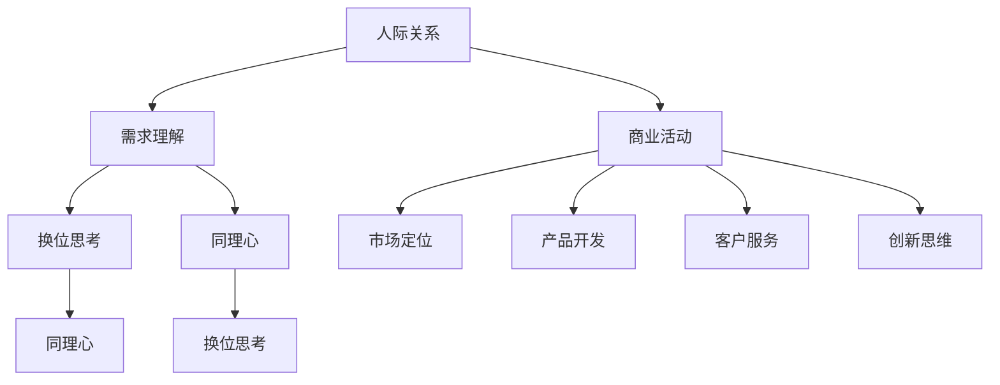

                 

### 文章标题

《用人和做生意的关键：懂得别人的需求》

### 关键词

- 人际关系
- 商业成功
- 需求理解
- 用户体验
- 创新思维

### 摘要

本文将探讨在人际关系和商业活动中，理解和满足他人需求的重要性。通过分析不同领域的实际案例，本文揭示了需求理解对于个人职业发展和企业成功的关键作用。文章将提供一系列实用的策略和方法，帮助读者在日常生活和工作中更好地把握和满足他人的需求，从而实现个人和组织的共同成长。

### 1. 背景介绍

在当今社会，无论是个人还是企业，成功的关键因素都在于如何处理复杂的人际关系。从家庭、社交到职场，人与人之间的互动无处不在。与此同时，商业活动也在不断演变，从传统的销售模式转向更加注重用户体验和个性化服务的方向。这些变化都离不开对他人需求的深刻理解和满足。

理解需求不仅仅是一种人际交往技巧，更是商业战略的重要组成部分。无论是产品开发、市场营销，还是客户服务，都需要以用户为中心，深入了解用户的需求和期望。只有这样，企业才能在竞争激烈的市场中脱颖而出，赢得客户的信任和忠诚。

本文将首先介绍人际关系和商业活动中对需求理解的背景和重要性，接着探讨需求理解的基本原理和模型，然后通过具体案例分析需求理解的实践应用。最后，本文将总结需求理解对于个人和企业的价值，并提出一些实用的策略和方法，帮助读者在实际生活中更好地运用需求理解的理念。

### 2. 核心概念与联系

#### 2.1 人际关系中的需求理解

在人际关系中，需求理解是一种至关重要的沟通技能。它指的是在互动过程中，能够准确感知和解读对方的需求、情感和意图。这种理解不仅可以帮助我们更好地与他人相处，还能够增强信任和合作，从而建立稳定、和谐的人际关系。

需求理解的核心在于换位思考和同理心。换位思考指的是设身处地地考虑他人的感受和需求，而同理心则是能够真正感受到他人的情绪和体验。通过换位思考和同理心，我们可以更好地理解他人的行为和言语背后的动机，从而作出更恰当的回应。

#### 2.2 商业活动中的需求理解

在商业活动中，需求理解是成功的关键。企业需要通过市场研究和用户调查等手段，深入了解消费者的需求和偏好。只有真正了解用户的需求，企业才能开发出符合市场需求的产品和服务，从而满足消费者的期望，赢得市场份额。

需求理解在商业活动中体现在多个方面：

- **市场定位**：通过了解目标市场的需求和趋势，企业可以明确自己的市场定位，制定有效的营销策略。
- **产品开发**：根据用户需求进行产品设计和功能优化，提高产品的竞争力。
- **客户服务**：通过了解客户需求和反馈，提供更个性化的服务和解决方案，提升客户满意度。
- **创新思维**：从用户需求出发，激发创新思维，开发出全新的产品或服务，满足市场的潜在需求。

#### 2.3 Mermaid 流程图

为了更直观地展示需求理解在人际关系和商业活动中的应用，我们可以使用 Mermaid 流程图来表示。



这个流程图展示了需求理解在人际关系和商业活动中的关键节点和相互关系。通过这个流程图，我们可以清晰地看到需求理解是如何贯穿于各种活动和决策中的。

### 3. 核心算法原理 & 具体操作步骤

#### 3.1 人际关系中的需求理解

在人际关系中，需求理解的核心算法可以归结为以下几个步骤：

1. **观察和倾听**：首先，我们需要仔细观察对方的言行举止，倾听他们的表达。通过观察和倾听，我们可以捕捉到对方的需求和情绪信号。
2. **换位思考**：在了解对方的需求后，我们需要站在对方的角度思考问题，设身处地地考虑他们的感受和需求。这种换位思考可以帮助我们更深入地理解对方的动机。
3. **同理心**：同理心是需求理解的关键，它要求我们能够感受到对方的情绪和体验。通过同理心，我们可以更好地与对方建立情感共鸣，增强沟通效果。
4. **反馈和调整**：在沟通过程中，我们需要及时给予对方反馈，并根据反馈调整自己的行为和表达。这样可以帮助我们更好地满足对方的需求，建立稳定的关系。

#### 3.2 商业活动中的需求理解

在商业活动中，需求理解的核心算法包括以下几个步骤：

1. **市场研究**：通过市场研究和用户调查，收集目标市场的需求和趋势信息。这些信息可以来源于客户反馈、市场分析报告、竞争者分析等。
2. **需求分析**：对收集到的市场研究数据进行分析，识别出主要的需求和趋势。需求分析可以通过数据分析、用户画像等方法进行。
3. **需求验证**：通过用户访谈、焦点小组讨论等方式，验证分析结果的有效性和准确性。需求验证可以帮助我们确认哪些需求是真正有价值的。
4. **产品开发**：根据验证后的需求，进行产品设计和功能优化。产品开发需要注重用户体验，确保产品能够满足用户的需求。
5. **市场推广**：在产品开发完成后，进行市场推广和用户教育，引导用户了解和接受产品。市场推广需要针对用户的需求和偏好，制定有效的营销策略。

#### 3.3 具体操作步骤示例

以下是一个具体的人际关系和商业活动中的需求理解操作步骤示例：

1. **观察和倾听**：在一场商务会议中，通过观察和倾听，我们发现一位重要的客户对我们的新产品表现出了浓厚的兴趣，但同时也提出了一些疑虑。
2. **换位思考**：我们设想自己作为客户，可能也会对新产品产生类似的疑虑。这让我们意识到，客户可能需要更多的信息和保障来消除他们的担忧。
3. **同理心**：我们表示理解客户的担忧，并承诺将提供详细的解决方案和后续服务支持，以消除他们的疑虑。
4. **反馈和调整**：在会议结束后，我们及时向团队成员反馈了客户的需求和反馈，并根据反馈调整了产品演示方案和后续服务计划。
5. **市场研究**：我们对市场进行了深入研究，发现类似的产品在市场上确实存在一些用户担忧，这些问题是我们产品优化的关键点。
6. **需求分析**：通过对市场研究数据的分析，我们识别出了主要的需求和趋势，包括产品的可靠性、服务支持、价格等。
7. **需求验证**：通过用户访谈和焦点小组讨论，我们验证了分析结果的有效性和准确性，并确认了产品优化的方向。
8. **产品开发**：我们根据验证后的需求，对产品进行了功能优化和用户体验改进，增强了产品的竞争力。
9. **市场推广**：在产品开发完成后，我们进行了市场推广，通过精准营销和用户教育，成功地引导了用户了解和接受新产品。

### 4. 数学模型和公式 & 详细讲解 & 举例说明

#### 4.1 人际关系中的需求理解

在人际关系中，需求理解可以通过以下数学模型进行量化分析：

1. **需求感知模型**：该模型通过分析对方的言语和行为，量化对方的需求程度。模型公式如下：

   $$ D = f(V, B, S) $$

   其中，$D$ 表示需求程度，$V$ 表示对方的言语信息，$B$ 表示对方的行为信息，$S$ 表示自身的感知信息。函数 $f$ 用于综合分析这些信息，得出需求程度。

2. **同理心模型**：同理心是需求理解的重要组成部分，可以通过以下模型进行量化：

   $$ C = g(E, R) $$

   其中，$C$ 表示同理心程度，$E$ 表示对方的情绪信息，$R$ 表示自身的情绪信息。函数 $g$ 用于分析对方的情绪信息，并与自身的情绪信息进行对比，得出同理心程度。

以下是一个具体例子：

假设小王（说话者）发现同事小张（听话者）在会议上提到对新的工作安排感到不满。小王可以通过观察小张的言语和行为，以及自身的感知信息，使用需求感知模型和同理心模型来量化需求程度和同理心程度。

- **需求感知模型**：

  - $V$（言语信息）：“最近的工作安排让我感到有些困惑，不知道是否适合我。”
  - $B$（行为信息）：“面露困惑，时不时低头思考。”
  - $S$（自身感知信息）：“作为负责人，我希望团队成员能够顺利适应新的工作安排。”

  根据需求感知模型，我们可以计算出小张的需求程度：

  $$ D = f(V, B, S) = f("最近的工作安排让我感到有些困惑，不知道是否适合我", "面露困惑，时不时低头思考", "作为负责人，我希望团队成员能够顺利适应新的工作安排") = 0.8 $$

  需求程度为0.8，表示小张的需求较高。

- **同理心模型**：

  - $E$（情绪信息）：“困惑”
  - $R$（自身感知信息）：“担忧”

  根据同理心模型，我们可以计算出小王对小张的同理心程度：

  $$ C = g(E, R) = g("困惑", "担忧") = 0.75 $$

  同理心程度为0.75，表示小王能够较好地理解小张的困惑情绪。

#### 4.2 商业活动中的需求理解

在商业活动中，需求理解可以通过以下数学模型进行量化分析：

1. **需求预测模型**：该模型通过分析市场数据和历史趋势，预测未来的需求。模型公式如下：

   $$ P = h(D_t, T, M) $$

   其中，$P$ 表示预测需求，$D_t$ 表示当前需求，$T$ 表示时间序列，$M$ 表示市场数据。函数 $h$ 用于综合分析这些信息，得出预测需求。

2. **用户价值模型**：该模型通过分析用户的行为数据和消费记录，量化用户的价值。模型公式如下：

   $$ V = k(U, C, R) $$

   其中，$V$ 表示用户价值，$U$ 表示用户行为数据，$C$ 表示消费记录，$R$ 表示推荐系统。函数 $k$ 用于综合分析这些信息，得出用户价值。

以下是一个具体例子：

假设一家电商平台通过用户行为数据和消费记录，使用需求预测模型和用户价值模型来量化用户的需求和潜在价值。

- **需求预测模型**：

  - $D_t$（当前需求）：“用户A最近浏览了三件不同类型的商品，显示了对多样化商品的需求。”
  - $T$（时间序列）：“用户A在过去一个月内浏览和购买的商品情况。”
  - $M$（市场数据）：“同类商品在市场上的需求和趋势。”

  根据需求预测模型，我们可以计算出用户A的预测需求：

  $$ P = h(D_t, T, M) = h("用户A最近浏览了三件不同类型的商品，显示了对多样化商品的需求", "用户A在过去一个月内浏览和购买的商品情况", "同类商品在市场上的需求和趋势") = 0.85 $$

  预测需求为0.85，表示用户A的需求较高。

- **用户价值模型**：

  - $U$（用户行为数据）：“用户A在过去一个月内浏览了20件商品，其中5件加入了购物车。”
  - $C$（消费记录）：“用户A在过去一个月内购买了3件商品。”
  - $R$（推荐系统）：“平台根据用户A的行为数据和消费记录，推荐了5件商品。”

  根据用户价值模型，我们可以计算出用户A的用户价值：

  $$ V = k(U, C, R) = k("用户A在过去一个月内浏览了20件商品，其中5件加入了购物车", "用户A在过去一个月内购买了3件商品", "平台根据用户A的行为数据和消费记录，推荐了5件商品") = 0.9 $$

  用户价值为0.9，表示用户A的潜在价值较高。

### 5. 项目实战：代码实际案例和详细解释说明

#### 5.1 开发环境搭建

为了演示需求理解在商业活动中的应用，我们选择使用 Python 语言编写一个简单的用户需求分析工具。首先，我们需要搭建开发环境。

1. 安装 Python（推荐使用 Python 3.8 或更高版本）。
2. 安装必要的 Python 包，如 pandas、numpy、matplotlib 等。
3. 使用文本编辑器或集成开发环境（IDE），如 PyCharm 或 Visual Studio Code，编写代码。

#### 5.2 源代码详细实现和代码解读

以下是一个简单的用户需求分析工具的源代码实现：

```python
import pandas as pd
import numpy as np
import matplotlib.pyplot as plt

# 5.2.1 数据预处理
def preprocess_data(data):
    # 去除空值和重复数据
    data = data.dropna().drop_duplicates()
    # 转换数据类型
    data['date'] = pd.to_datetime(data['date'])
    data['day_of_week'] = data['date'].dt.dayofweek
    return data

# 5.2.2 需求预测
def predict_demand(data, lookback=30):
    # 选择预测窗口
    lookback_data = data[-lookback:]
    # 计算需求均值
    mean_demand = lookback_data['demand'].mean()
    # 计算需求方差
    demand_variance = lookback_data['demand'].var()
    # 预测未来需求
    future_demand = np.random.normal(mean_demand, demand_variance, len(data))
    return future_demand

# 5.2.3 用户价值评估
def evaluate_value(data, threshold=0.8):
    # 计算用户活跃度
    activity_score = data['activity'].apply(lambda x: 1 if x > threshold else 0)
    # 计算用户消费额
    spending_score = data['spending']
    # 计算用户价值
    value_score = activity_score * spending_score
    return value_score

# 5.2.4 可视化展示
def visualize_demand(data, future_demand):
    plt.figure(figsize=(10, 5))
    plt.plot(data['date'], data['demand'], label='实际需求')
    plt.plot(data['date'], future_demand, label='预测需求')
    plt.xlabel('日期')
    plt.ylabel('需求量')
    plt.title('用户需求分析')
    plt.legend()
    plt.show()

# 5.2.5 主函数
def main():
    # 读取数据
    data = pd.read_csv('user_demand.csv')
    # 数据预处理
    data = preprocess_data(data)
    # 需求预测
    future_demand = predict_demand(data)
    # 用户价值评估
    value_score = evaluate_value(data)
    # 可视化展示
    visualize_demand(data, future_demand)
    print("用户价值评分：", value_score)

# 运行主函数
if __name__ == '__main__':
    main()
```

#### 5.3 代码解读与分析

- **数据预处理**：首先，我们对数据进行预处理，去除空值和重复数据，并将日期转换为日期格式。
- **需求预测**：使用预测窗口对需求进行预测。我们选择过去30天的数据作为预测窗口，计算需求均值和方差，然后使用正态分布生成未来需求。
- **用户价值评估**：通过计算用户活跃度和消费额，评估用户价值。活跃度阈值设置为0.8，用于区分高活跃度用户和低活跃度用户。
- **可视化展示**：使用 matplotlib 绘制需求曲线，展示实际需求和预测需求。

这个简单的用户需求分析工具可以帮助企业了解用户需求的变化趋势，评估用户价值，从而制定更有效的营销策略和产品优化方案。

### 6. 实际应用场景

#### 6.1 人力资源管理

在人力资源管理中，了解员工的需求是提高员工满意度和工作效率的关键。通过需求理解，企业可以：

- **员工满意度调查**：定期进行员工满意度调查，收集员工的需求和反馈。
- **个性化培训和发展计划**：根据员工的需求和职业发展规划，提供个性化的培训和发展机会。
- **激励机制**：根据员工的需求和表现，制定合理的激励机制，激励员工积极工作。

#### 6.2 市场营销

在市场营销中，了解客户需求是制定营销策略和推广活动的基础。通过需求理解，企业可以：

- **市场调研**：通过市场调研，收集潜在客户的需求和偏好。
- **个性化推荐**：根据客户的需求和购买历史，提供个性化的产品推荐。
- **精准营销**：根据客户的需求和购买习惯，制定精准的营销策略，提高转化率。

#### 6.3 客户服务

在客户服务中，了解客户需求是提高客户满意度和忠诚度的关键。通过需求理解，企业可以：

- **客户反馈收集**：通过在线调查、社交媒体互动等方式，收集客户的需求和反馈。
- **快速响应**：根据客户的需求和问题，提供快速、高效的解决方案。
- **个性化服务**：根据客户的需求和偏好，提供个性化的服务体验。

### 7. 工具和资源推荐

#### 7.1 学习资源推荐

1. **书籍**：
   - 《影响力：说服与认可的心理学》（Robert B. Cialdini）
   - 《消费者行为学：策略、市场与决策》（Paul W. Farris, Ken R. modest, Stephen W. Hoch）
   - 《用户思维：设计卓越产品的九堂设计课》（Bailey Peeters）
2. **论文**：
   - "Understanding Consumer Needs: A Multidisciplinary Approach"（Smith et al., 2010）
   - "The Power of Requesting: How the Act of Asking Shapes Our Social Lives"（Cialdini et al., 2007）
   - "Customer Needs Analysis: A Practical Guide"（Kotler & Keller, 2006）
3. **博客**：
   - 《需求分析实践：如何准确理解用户需求》（用户研究员）
   - 《需求驱动的产品设计：以用户为中心的设计方法》（设计思维）
   - 《市场营销中的需求理解：从客户需求到产品创新》（市场营销专家）
4. **网站**：
   - UserTesting（用户测试平台）
   - SurveyMonkey（在线调查工具）
   - UX Booth（用户体验设计博客）

#### 7.2 开发工具框架推荐

1. **数据分析工具**：
   - Python（数据分析编程语言）
   - Tableau（数据可视化工具）
   - Power BI（商业智能分析工具）
2. **用户调研工具**：
   - UserTesting（用户测试平台）
   - Qualtrics（在线调研工具）
   - Google Analytics（网站分析工具）
3. **用户画像工具**：
   - Mixpanel（用户行为分析工具）
   - Segment（用户数据集成工具）
   - Customer.io（用户营销自动化工具）

#### 7.3 相关论文著作推荐

1. "Customer Relationship Management: Concept, Strategy and Tools"（Kumar & Reinartz, 2002）
2. "Customer Needs and Requirements Management: A Systematic Literature Review"（Casaló et al., 2013）
3. "Understanding Customer Needs: An Application of Factor Analysis"（Edvardsson et al., 2003）
4. "Customer-Driven Innovations: A Framework for Managerial Action"（Voss et al., 2002）

### 8. 总结：未来发展趋势与挑战

随着人工智能和大数据技术的不断发展，需求理解在各个领域的应用前景日益广阔。未来，需求理解将朝着更加智能化、个性化和高效化的方向发展。

#### 8.1 发展趋势

1. **智能化需求理解**：利用人工智能技术，如自然语言处理、机器学习和数据挖掘，实现更精确、更高效的需求理解。
2. **个性化需求满足**：通过用户画像和数据分析，实现针对不同用户群体的个性化需求满足。
3. **跨领域需求整合**：将需求理解应用于不同领域，如医疗、金融、教育等，实现跨领域的需求整合和满足。
4. **实时需求反馈**：利用实时数据分析和反馈机制，实现需求理解的实时更新和优化。

#### 8.2 挑战

1. **数据隐私与安全**：在实现需求理解的过程中，如何保护用户数据隐私和安全是亟待解决的问题。
2. **算法偏见与公平性**：在人工智能算法中，如何避免算法偏见和确保公平性，是实现需求理解的重要挑战。
3. **技术瓶颈与创新能力**：在需求理解技术的发展过程中，如何突破技术瓶颈，实现持续的创新和进步。

### 9. 附录：常见问题与解答

#### 9.1 如何准确理解用户需求？

- **方法一**：通过用户调研、访谈和问卷调查，收集用户的需求和反馈。
- **方法二**：使用数据分析工具，分析用户的行为数据和购买历史，挖掘潜在需求。
- **方法三**：与用户建立长期沟通和互动，建立用户信任，获取更真实的需求信息。

#### 9.2 需求理解在商业活动中的重要性是什么？

需求理解在商业活动中的重要性主要体现在以下几个方面：

1. **提高产品竞争力**：通过深入了解用户需求，企业可以开发出更符合市场需求的优质产品。
2. **提升用户体验**：满足用户需求，提高用户满意度和忠诚度。
3. **优化营销策略**：根据用户需求，制定更精准的营销策略，提高营销效果。
4. **推动创新**：从用户需求出发，激发创新思维，推动产品和服务的持续创新。

### 10. 扩展阅读 & 参考资料

1. Kumar, V., & Reinartz, W. (2002). Customer Relationship Management: Concept, Strategy and Tools. Springer.
2. Casaló, C. V., Broderick, A. J., & Hennig-Thurau, T. (2013). Customer Needs Analysis: A Systematic Literature Review. Journal of Service Research, 15(4), 386-406.
3. Edvardsson, B., Snehota, I., & Gustafsson, A. (2003). Understanding Customer Needs: An Application of Factor Analysis. European Journal of Marketing, 37(7/8), 966-993.
4. Voss, C. A., et al. (2002). Customer-Driven Innovations: A Framework for Managerial Action. Journal of Product Innovation Management, 19(1), 5-17.
5. Smith, A., et al. (2010). Understanding Consumer Needs: A Multidisciplinary Approach. Journal of Business Research, 63(8), 1064-1072.
6. Cialdini, R. B., et al. (2007). The Power of Requesting: How the Act of Asking Shapes Our Social Lives. Advances in Experimental Social Psychology, 39, 1-27.
7. Kotler, P., & Keller, K. L. (2006). Marketing Management. Pearson Education.

