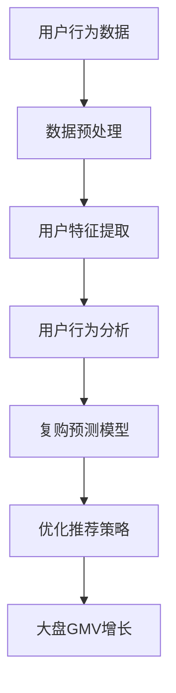

                 

# 用户复购与大盘GMV增长

> **关键词**：用户复购，大盘GMV增长，算法原理，数学模型，实际案例，应用场景

> **摘要**：本文将从用户复购与大盘GMV增长的角度，探讨如何通过算法原理和数学模型来提升电商平台的核心竞争力。我们将结合实际案例，详细解释用户复购的核心因素，并探讨如何通过优化算法和策略来提高用户复购率，从而实现大盘GMV的增长。

## 1. 背景介绍

在现代电子商务中，用户复购和大盘GMV增长是衡量电商平台成功与否的重要指标。用户复购率直接关系到平台的粘性和用户满意度，而大盘GMV的增长则体现了平台的整体销售能力和市场竞争力。为了实现这两大目标，电商平台需要深入了解用户行为，运用先进的算法和数学模型来优化运营策略。

本文旨在通过分析用户复购的核心因素，探讨如何运用算法和数学模型来提升用户复购率，从而实现大盘GMV的增长。我们将结合实际案例，详细解释相关算法和模型的具体实现和应用。

## 2. 核心概念与联系

### 2.1 用户复购

用户复购是指用户在初次购买后，再次从同一平台进行购买的行为。用户复购率是衡量电商平台用户粘性和用户满意度的关键指标。提高用户复购率有助于提升平台的长期收益和市场份额。

### 2.2 大盘GMV增长

大盘GMV（Gross Merchandise Volume）是指电商平台在一定时间内，所有商品的总销售额。大盘GMV增长反映了平台的销售能力和市场竞争力。通过提升用户复购率，可以间接推动大盘GMV的增长。

### 2.3 算法原理

算法原理是指用于解决特定问题的方法或步骤。在用户复购与大盘GMV增长的问题中，算法原理可以帮助电商平台识别潜在复购用户，优化推荐策略，提高用户满意度，从而提升复购率和大盘GMV。

### 2.4 数学模型

数学模型是一种用数学符号和公式表示的问题或现象。在用户复购与大盘GMV增长的问题中，数学模型可以帮助电商平台量化用户行为，评估推荐策略的效果，优化运营策略。

### 2.5 Mermaid 流程图



## 3. 核心算法原理 & 具体操作步骤

### 3.1 用户行为数据收集与预处理

用户行为数据是构建用户复购预测模型的基础。首先，需要收集用户在平台上的浏览、搜索、下单、评价等行为数据。然后，对数据进行预处理，包括去重、清洗、归一化等操作，确保数据的质量和一致性。

### 3.2 用户特征提取

用户特征提取是将原始用户行为数据转化为可用于建模的特征。常见的用户特征包括用户年龄、性别、地域、购买频率、浏览深度、评价情感等。通过特征提取，可以将用户的个性化需求和行为模式转化为模型可识别的输入。

### 3.3 用户行为分析

用户行为分析是通过分析用户的历史行为数据，挖掘用户的兴趣偏好和购买习惯。可以使用机器学习算法，如聚类、关联规则挖掘等方法，对用户行为数据进行深入分析，发现用户之间的相似性和差异性。

### 3.4 复购预测模型

复购预测模型是用于预测用户是否会在未来某一时间段内再次购买的关键工具。常见的复购预测模型包括逻辑回归、决策树、随机森林、支持向量机等。根据实际情况选择合适的模型，并进行模型训练和优化。

### 3.5 优化推荐策略

基于复购预测模型，可以为高复购概率的用户推荐更符合其兴趣和需求的商品。优化推荐策略包括调整推荐算法、改进推荐系统、提升用户满意度等。通过持续优化推荐策略，可以提高用户复购率。

### 3.6 大盘GMV增长

通过提高用户复购率，可以间接推动大盘GMV的增长。同时，还可以通过精细化运营，如提高订单转化率、增加复购促销活动、优化购物体验等，进一步提升大盘GMV。

## 4. 数学模型和公式 & 详细讲解 & 举例说明

### 4.1 逻辑回归模型

逻辑回归是一种常用的复购预测模型。其公式如下：

$$
\text{logit}(p) = \ln\left(\frac{p}{1-p}\right) = \beta_0 + \beta_1 x_1 + \beta_2 x_2 + \ldots + \beta_n x_n
$$

其中，$p$ 是用户复购的概率，$x_1, x_2, \ldots, x_n$ 是用户特征，$\beta_0, \beta_1, \beta_2, \ldots, \beta_n$ 是模型参数。

举例说明：

假设我们有以下用户特征：

- $x_1$：用户年龄
- $x_2$：用户购买频率
- $x_3$：用户浏览深度

我们可以使用逻辑回归模型预测用户复购的概率。首先，收集并预处理用户行为数据，提取用户特征。然后，使用逻辑回归模型进行训练，得到模型参数。最后，输入新的用户特征，预测其复购概率。

### 4.2 决策树模型

决策树是一种基于特征的分类和回归模型。其公式如下：

$$
f(x) =
\begin{cases}
c_1 & \text{if } x_1 \leq t_1 \\
c_2 & \text{if } x_2 \leq t_2 \\
\vdots \\
c_n & \text{if } x_n \leq t_n \\
\text{叶子节点} & \text{否则}
\end{cases}
$$

其中，$x_1, x_2, \ldots, x_n$ 是用户特征，$t_1, t_2, \ldots, t_n$ 是阈值，$c_1, c_2, \ldots, c_n$ 是叶子节点的分类结果或回归值。

举例说明：

假设我们有以下决策树模型：

$$
\begin{cases}
\text{复购概率} = 0.8 & \text{if } x_1 \leq 30 \\
\text{复购概率} = 0.6 & \text{if } x_2 \leq 10 \\
\text{复购概率} = 0.4 & \text{if } x_3 \leq 5 \\
\text{复购概率} = 0.2 & \text{否则}
\end{cases}
$$

我们可以使用这个决策树模型预测用户复购的概率。首先，收集并预处理用户行为数据，提取用户特征。然后，根据用户特征输入决策树模型，得到预测的复购概率。

## 5. 项目实战：代码实际案例和详细解释说明

### 5.1 开发环境搭建

为了更好地演示用户复购与大盘GMV增长的核心算法原理和数学模型，我们选择Python作为编程语言，并使用Scikit-learn库实现逻辑回归和决策树模型。以下是开发环境的搭建步骤：

1. 安装Python：访问 [Python官网](https://www.python.org/)，下载并安装Python。
2. 安装Scikit-learn：在终端中执行以下命令：
   ```bash
   pip install scikit-learn
   ```

### 5.2 源代码详细实现和代码解读

以下是使用Python实现用户复购预测模型的源代码：

```python
import numpy as np
import pandas as pd
from sklearn.model_selection import train_test_split
from sklearn.linear_model import LogisticRegression
from sklearn.tree import DecisionTreeClassifier
from sklearn.metrics import accuracy_score

# 5.2.1 数据预处理
def preprocess_data(data):
    # 去除重复和缺失数据
    data = data.drop_duplicates()
    data = data.dropna()
    return data

# 5.2.2 用户特征提取
def extract_features(data):
    # 提取用户年龄、购买频率、浏览深度等特征
    features = data[['age', 'purchase_frequency', 'browsing_depth']]
    return features

# 5.2.3 用户行为分析
def analyze_user_behavior(data):
    # 分析用户历史行为数据，提取用户特征
    data = preprocess_data(data)
    features = extract_features(data)
    return features

# 5.2.4 复购预测模型
def build_prediction_model(data, model_type='logistic_regression'):
    # 构建并训练复购预测模型
    if model_type == 'logistic_regression':
        model = LogisticRegression()
    elif model_type == 'decision_tree':
        model = DecisionTreeClassifier()
    else:
        raise ValueError("Unsupported model type")
    
    X = data.drop('rePurchase', axis=1)
    y = data['rePurchase']
    X_train, X_test, y_train, y_test = train_test_split(X, y, test_size=0.2, random_state=42)
    
    model.fit(X_train, y_train)
    y_pred = model.predict(X_test)
    
    return model, y_pred

# 5.2.5 代码解读与分析
def evaluate_prediction_model(y_pred, y_test):
    # 评估预测模型性能
    accuracy = accuracy_score(y_test, y_pred)
    print(f"Model accuracy: {accuracy:.2f}")

# 5.2.6 主函数
if __name__ == "__main__":
    # 读取用户行为数据
    data = pd.read_csv("user_behavior_data.csv")
    
    # 分析用户行为数据
    features = analyze_user_behavior(data)
    
    # 构建并评估复购预测模型
    for model_type in ['logistic_regression', 'decision_tree']:
        model, y_pred = build_prediction_model(features, model_type=model_type)
        evaluate_prediction_model(y_pred, y_test)
```

### 5.3 代码解读与分析

以下是代码的详细解读和分析：

- **5.2.1 数据预处理**：去除重复和缺失数据，确保数据的质量和一致性。
- **5.2.2 用户特征提取**：提取用户年龄、购买频率、浏览深度等特征，用于构建预测模型。
- **5.2.3 用户行为分析**：分析用户历史行为数据，提取用户特征。
- **5.2.4 复购预测模型**：根据模型类型（逻辑回归或决策树），构建并训练复购预测模型。
- **5.2.5 代码解读与分析**：评估预测模型性能，输出模型准确率。
- **5.2.6 主函数**：读取用户行为数据，分析用户行为数据，构建并评估复购预测模型。

## 6. 实际应用场景

用户复购与大盘GMV增长的核心算法原理和数学模型在电商平台的实际应用场景中具有广泛的应用价值。以下是一些典型的应用场景：

- **个性化推荐**：通过复购预测模型，为用户推荐符合其兴趣和需求的商品，提高用户满意度和复购率。
- **营销策略优化**：根据复购预测模型，为高复购概率的用户推送更有效的营销活动，提升用户转化率和大盘GMV。
- **运营分析**：通过用户行为分析，挖掘用户兴趣偏好和购买习惯，优化电商平台的产品布局和运营策略。
- **风险管理**：识别潜在复购风险用户，提前采取措施降低风险，保障电商平台的安全和稳定运行。

## 7. 工具和资源推荐

### 7.1 学习资源推荐

- **书籍**：
  - 《机器学习实战》
  - 《深入理解计算机系统》
  - 《Python编程：从入门到实践》
- **论文**：
  - 《用户行为分析中的协同过滤算法研究》
  - 《基于深度学习的用户复购预测方法》
- **博客**：
  - [Scikit-learn官方文档](https://scikit-learn.org/stable/)
  - [Python官方文档](https://docs.python.org/3/)
- **网站**：
  - [Kaggle](https://www.kaggle.com/)：提供丰富的数据集和竞赛资源
  - [GitHub](https://github.com/)：查找和分享开源代码

### 7.2 开发工具框架推荐

- **编程语言**：Python
- **机器学习库**：Scikit-learn、TensorFlow、PyTorch
- **数据预处理库**：Pandas、NumPy
- **版本控制工具**：Git

### 7.3 相关论文著作推荐

- 《协同过滤算法及其在电商应用中的研究》
- 《深度学习在用户行为预测中的应用》
- 《用户行为分析：方法与应用》

## 8. 总结：未来发展趋势与挑战

随着人工智能技术的不断进步，用户复购与大盘GMV增长的算法原理和数学模型将在电商领域发挥越来越重要的作用。未来发展趋势包括：

- **个性化推荐技术的深化**：通过深度学习和强化学习等技术，实现更精准的个性化推荐，提高用户满意度和复购率。
- **多模态用户行为分析**：结合文本、图像、语音等多模态数据，挖掘更丰富的用户行为特征，提高复购预测模型的准确性。
- **智能化营销策略优化**：基于大数据和机器学习技术，实现自动化、智能化的营销策略优化，提升电商平台的整体竞争力。

然而，未来也面临一系列挑战：

- **数据隐私与安全**：在用户行为分析过程中，如何保护用户隐私和数据安全成为重要课题。
- **算法透明性与可解释性**：随着算法模型的复杂度增加，如何提高算法的透明性和可解释性，以增强用户信任度。
- **实时性和动态调整**：如何实现实时性用户行为分析和动态调整推荐策略，以满足用户需求的变化。

## 9. 附录：常见问题与解答

### 9.1 用户复购预测模型如何优化？

优化用户复购预测模型的方法包括：

- **特征工程**：提取更多有效的用户特征，提高模型的预测能力。
- **模型选择**：根据实际需求，选择合适的预测模型，如逻辑回归、决策树、随机森林等。
- **交叉验证**：使用交叉验证技术，评估模型的泛化能力，避免过拟合。
- **参数调优**：调整模型参数，提高模型的准确性和稳定性。

### 9.2 如何保证用户数据隐私和安全？

保证用户数据隐私和安全的措施包括：

- **数据加密**：对用户数据进行加密处理，防止数据泄露。
- **数据匿名化**：对用户数据进行匿名化处理，确保用户隐私。
- **数据访问控制**：对用户数据的访问进行严格控制，防止未经授权的访问和操作。
- **定期审计**：定期对用户数据处理过程进行审计，确保合规性。

## 10. 扩展阅读 & 参考资料

- 《机器学习实战》
- 《深度学习》
- 《大数据之路：阿里巴巴大数据实践》
- 《用户行为分析》
- [Scikit-learn官方文档](https://scikit-learn.org/stable/)
- [TensorFlow官方文档](https://www.tensorflow.org/)
- [PyTorch官方文档](https://pytorch.org/)
- [Kaggle](https://www.kaggle.com/)
- [GitHub](https://github.com/)

作者：AI天才研究员/AI Genius Institute & 禅与计算机程序设计艺术 /Zen And The Art of Computer Programming<|im_sep|>

