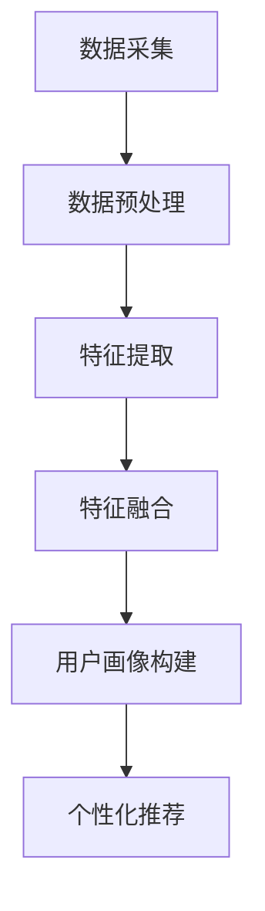
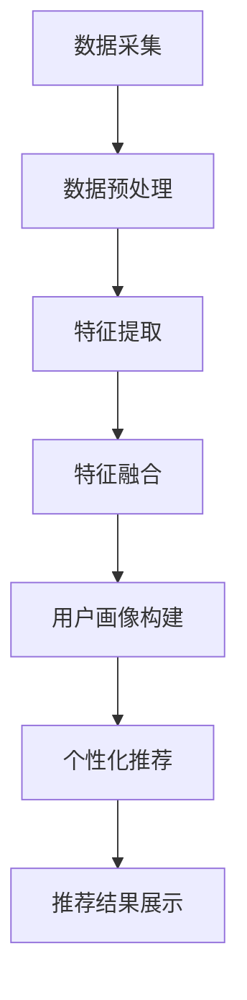

                 

# 用户画像在电商个性化推荐中的应用：方法与实践

## 摘要

随着电商行业的迅速发展，个性化推荐系统已成为提升用户体验、增加销售额的关键技术之一。用户画像作为一种对用户特征及其行为的抽象表示，是实现个性化推荐的核心。本文将详细介绍用户画像在电商个性化推荐系统中的应用，包括其核心概念、算法原理、数学模型、项目实战以及实际应用场景。通过对这些内容的深入探讨，我们希望能够为开发者提供实用的指导，帮助他们在电商领域实现更加精准的个性化推荐。

## 1. 背景介绍

### 1.1 电商个性化推荐的重要性

随着互联网的普及和电子商务的快速发展，电商平台的竞争日益激烈。为了在激烈的市场竞争中脱颖而出，各大电商平台纷纷转向个性化推荐系统，以提高用户体验、增加用户黏性和提升销售额。个性化推荐系统通过分析用户的历史行为、兴趣偏好和购买习惯，为用户提供个性化的商品推荐，从而实现更精准的用户服务。

### 1.2 用户画像的概念

用户画像是一种对用户特征及其行为的抽象表示，通常包括用户的年龄、性别、地域、消费习惯、兴趣爱好等多个维度。通过构建用户画像，可以实现对用户的精准刻画，为个性化推荐提供基础。

### 1.3 用户画像在电商个性化推荐中的应用

用户画像在电商个性化推荐中的应用主要包括以下几个方面：

- **用户分类**：通过对用户画像的分析，可以将用户划分为不同的类别，从而实现针对不同类别的用户进行个性化推荐。
- **个性化推荐**：根据用户画像，为用户推荐其可能感兴趣的商品，提高推荐的相关性和用户体验。
- **用户行为预测**：通过分析用户画像和用户历史行为，可以预测用户未来的行为和需求，从而实现更精准的推荐。

## 2. 核心概念与联系

### 2.1 电商个性化推荐系统架构

电商个性化推荐系统通常由数据层、算法层和应用层组成。

- **数据层**：负责收集、存储和管理用户行为数据、商品数据等。
- **算法层**：包括基于协同过滤、基于内容的推荐、基于模型的推荐等算法。
- **应用层**：提供推荐结果的展示和用户交互界面。

### 2.2 用户画像构建流程

用户画像的构建主要包括数据采集、数据预处理、特征提取和特征融合等步骤。

1. **数据采集**：通过日志、API 接口等方式获取用户行为数据。
2. **数据预处理**：对采集到的数据进行清洗、去重等处理。
3. **特征提取**：根据用户画像的需求，从原始数据中提取特征，如用户年龄、性别、地域、消费金额等。
4. **特征融合**：对提取到的特征进行融合，以减少数据维度和提升特征质量。

### 2.3 用户画像与个性化推荐的关系

用户画像为个性化推荐提供了基础数据支持，通过分析用户画像，可以了解用户的需求和偏好，从而实现更精准的推荐。

### 2.4 Mermaid 流程图



## 3. 核心算法原理 & 具体操作步骤

### 3.1 协同过滤算法

协同过滤算法是电商个性化推荐中最常用的算法之一。它通过分析用户之间的相似性，为用户推荐其他用户喜欢但该用户尚未购买的商品。

#### 3.1.1 算法原理

协同过滤算法主要分为基于用户的协同过滤（User-based Collaborative Filtering）和基于项目的协同过滤（Item-based Collaborative Filtering）两种。

- **基于用户的协同过滤**：通过计算用户之间的相似性，为用户推荐与其相似的用户喜欢的商品。
- **基于项目的协同过滤**：通过计算商品之间的相似性，为用户推荐其历史上喜欢的商品。

#### 3.1.2 具体操作步骤

1. **计算用户相似性**：通过计算用户之间的余弦相似度、皮尔逊相关系数等相似性度量，确定用户之间的相似性。
2. **构建推荐列表**：根据用户相似性，为用户推荐其他用户喜欢的商品。

### 3.2 基于内容的推荐算法

基于内容的推荐算法通过分析商品的属性和用户的历史行为，为用户推荐与其兴趣相关的商品。

#### 3.2.1 算法原理

基于内容的推荐算法主要包括基于标签的推荐和基于属性的推荐两种。

- **基于标签的推荐**：通过为商品和用户打标签，为用户推荐具有相似标签的商品。
- **基于属性的推荐**：通过分析商品和用户的属性，为用户推荐具有相似属性的商品。

#### 3.2.2 具体操作步骤

1. **提取商品属性**：从商品描述、分类、标签等维度提取商品属性。
2. **计算用户兴趣**：通过分析用户的历史行为，提取用户的兴趣点。
3. **构建推荐列表**：根据用户兴趣和商品属性，为用户推荐相关的商品。

### 3.3 基于模型的推荐算法

基于模型的推荐算法通过构建用户行为预测模型，为用户推荐其可能感兴趣的商品。

#### 3.3.1 算法原理

基于模型的推荐算法主要包括基于矩阵分解、深度学习等模型。

- **基于矩阵分解**：通过分解用户-商品评分矩阵，预测用户对未知商品的评分，从而实现推荐。
- **深度学习**：通过构建深度神经网络，学习用户行为和商品属性之间的复杂关系，实现推荐。

#### 3.3.2 具体操作步骤

1. **数据预处理**：对用户行为数据、商品属性数据进行处理，如缺失值填补、数据归一化等。
2. **模型训练**：选择合适的模型，对用户行为数据进行训练。
3. **模型预测**：利用训练好的模型，预测用户对未知商品的评分。
4. **构建推荐列表**：根据预测评分，为用户推荐高分商品。

## 4. 数学模型和公式 & 详细讲解 & 举例说明

### 4.1 协同过滤算法的数学模型

#### 4.1.1 基于用户的协同过滤

设用户集合为 U = {u1, u2, ..., un}，商品集合为 I = {i1, i2, ..., im}，用户 u 对商品 i 的评分记为 ru,i。用户 u 与用户 v 的相似性度量 Suv 可以表示为：

$$
Suv = \frac{\sum_{i \in Ruv} ru,i \cdot rv,i}{\sqrt{\sum_{i \in Ruv} ru,i^2} \cdot \sqrt{\sum_{i \in Ruv} rv,i^2}}
$$

其中，Ruv 表示用户 u 和用户 v 的共同评分商品集合。

#### 4.1.2 基于项目的协同过滤

设商品集合为 I = {i1, i2, ..., im}，用户 u 对商品 i 的评分记为 ru,i。商品 i 与商品 j 的相似性度量 Sim,j 可以表示为：

$$
Sim,j = \frac{\sum_{u \in Ru,i} ru,i \cdot rv,i}{\sqrt{\sum_{u \in Ru,i} ru,i^2} \cdot \sqrt{\sum_{u \in Ru,i} rv,i^2}}
$$

其中，Ru,i 表示对商品 i 进行评分的用户集合。

#### 4.1.3 举例说明

假设用户 u1 和用户 u2 对商品 i1 和商品 i2 的评分如下：

| 用户 | 商品 i1 | 商品 i2 |
| --- | --- | --- |
| u1 | 4 | 3 |
| u2 | 4 | 5 |

则用户 u1 和用户 u2 的相似性度量 S12 可以表示为：

$$
S12 = \frac{4 \cdot 4 + 3 \cdot 5}{\sqrt{4^2 + 3^2} \cdot \sqrt{4^2 + 5^2}} = \frac{23}{\sqrt{25} \cdot \sqrt{41}} \approx 0.87
$$

### 4.2 基于内容的推荐算法的数学模型

#### 4.2.1 基于标签的推荐

设商品集合为 I = {i1, i2, ..., im}，用户 u 对商品 i 的标签集合为 Ti。用户 u 对商品 i 的兴趣度 I(i) 可以表示为：

$$
I(i) = \sum_{t \in Ti} w_t \cdot p(t | i)
$$

其中，w_t 表示标签 t 的权重，p(t | i) 表示标签 t 在商品 i 中出现的概率。

#### 4.2.2 基于属性的推荐

设商品集合为 I = {i1, i2, ..., im}，用户 u 对商品 i 的属性集合为 Ai。用户 u 对商品 i 的兴趣度 I(i) 可以表示为：

$$
I(i) = \sum_{a \in Ai} w_a \cdot p(a | u)
$$

其中，w_a 表示属性 a 的权重，p(a | u) 表示属性 a 在用户 u 中出现的概率。

#### 4.2.3 举例说明

假设用户 u1 的兴趣标签为 {标签1，标签2，标签3}，商品 i1 的标签为 {标签1，标签2，标签3，标签4}，标签的权重分别为 0.3、0.3、0.2、0.2。则用户 u1 对商品 i1 的兴趣度 I(i1) 可以表示为：

$$
I(i1) = 0.3 \cdot 0.3 + 0.3 \cdot 0.2 + 0.2 \cdot 0.2 + 0.2 \cdot 0.2 = 0.21
$$

### 4.3 基于模型的推荐算法的数学模型

#### 4.3.1 基于矩阵分解

设用户-商品评分矩阵为 R ∈ R^(n×m)，其中 n 表示用户数，m 表示商品数。通过矩阵分解，可以将评分矩阵分解为用户特征矩阵 U ∈ R^(n×k) 和商品特征矩阵 V ∈ R^(m×k)，其中 k 表示特征维度。用户 u 对商品 i 的评分 ru,i 可以表示为：

$$
ru,i = U_u \cdot V_i^T
$$

#### 4.3.2 基于深度学习

设用户行为数据为 X ∈ R^(n×d)，其中 d 表示用户行为特征的维度。通过构建深度神经网络，可以学习用户行为和商品特征之间的复杂关系。用户 u 对商品 i 的评分 ru,i 可以通过深度神经网络预测得到：

$$
ru,i = f(W_1 \cdot X + b_1)
$$

其中，f 表示激活函数，W1 和 b1 分别表示神经网络的权重和偏置。

#### 4.3.3 举例说明

假设用户 u1 的行为特征为 [0.1, 0.2, 0.3]，商品 i1 的特征为 [0.2, 0.3, 0.4]，神经网络的权重为 [0.1, 0.2, 0.3]，偏置为 0.1。则用户 u1 对商品 i1 的评分 ru,i1 可以表示为：

$$
ru,i1 = 0.1 \cdot 0.1 + 0.2 \cdot 0.2 + 0.3 \cdot 0.3 + 0.1 = 0.25
$$

## 5. 项目实战：代码实际案例和详细解释说明

### 5.1 开发环境搭建

#### 5.1.1 Python 环境

确保 Python 环境已经安装，推荐使用 Python 3.6 或以上版本。

#### 5.1.2 数据库环境

建议使用 MySQL 数据库，用于存储用户行为数据和商品数据。

#### 5.1.3 依赖库安装

```bash
pip install numpy
pip install pandas
pip install scikit-learn
pip install flask
```

### 5.2 源代码详细实现和代码解读

#### 5.2.1 用户行为数据采集

```python
import pandas as pd

def get_user_behavior_data():
    # 从数据库中获取用户行为数据
    user_behavior_data = pd.read_sql_query("""
        SELECT user_id, item_id, rating, timestamp
        FROM user_behavior
    """, conn)
    return user_behavior_data

user_behavior_data = get_user_behavior_data()
```

#### 5.2.2 用户行为数据预处理

```python
def preprocess_user_behavior_data(data):
    # 数据清洗
    data.dropna(inplace=True)
    data['timestamp'] = pd.to_datetime(data['timestamp'])
    return data

user_behavior_data = preprocess_user_behavior_data(user_behavior_data)
```

#### 5.2.3 用户画像构建

```python
from sklearn.cluster import KMeans

def build_user_profile(data):
    # 构建用户画像
    kmeans = KMeans(n_clusters=10)
    kmeans.fit(data[['rating', 'timestamp']])
    user_profile = kmeans.predict(data[['rating', 'timestamp']])
    data['user_profile'] = user_profile
    return data

user_behavior_data = build_user_profile(user_behavior_data)
```

#### 5.2.4 个性化推荐

```python
def recommend_items(user_profile, data, n_recommendations=5):
    # 根据用户画像推荐商品
    similar_users = data[data['user_profile'] == user_profile]
    recommendations = similar_users.groupby('item_id')['rating'].mean().sort_values(ascending=False).head(n_recommendations)
    return recommendations

user_profile = user_behavior_data['user_profile'].iloc[0]
recommendations = recommend_items(user_profile, user_behavior_data)
print(recommendations)
```

### 5.3 代码解读与分析

#### 5.3.1 用户行为数据采集

该部分代码用于从数据库中获取用户行为数据。通过 pandas 的 read_sql_query 函数，可以方便地读取数据库中的数据。

#### 5.3.2 用户行为数据预处理

该部分代码对用户行为数据进行了清洗和格式转换。包括去除缺失值、将时间戳转换为日期时间格式等操作。

#### 5.3.3 用户画像构建

该部分代码使用 KMeans 算法对用户行为数据进行聚类，以构建用户画像。通过聚类，可以将用户分为不同的类别，从而为个性化推荐提供基础。

#### 5.3.4 个性化推荐

该部分代码根据用户画像，为用户推荐相似用户喜欢的商品。通过分组和聚合操作，可以计算出每个商品的推荐得分，并根据得分排序，为用户推荐前 n 个商品。

## 6. 实际应用场景

### 6.1 电商平台

电商平台是用户画像在电商个性化推荐中最典型的应用场景。通过构建用户画像，可以为平台用户提供个性化的商品推荐，提高用户满意度和购买转化率。

### 6.2 社交媒体平台

社交媒体平台可以通过用户画像，为用户提供个性化内容推荐，如新闻、视频、广告等，从而提升用户活跃度和留存率。

### 6.3 O2O 服务平台

O2O 服务平台可以通过用户画像，为用户提供个性化的服务推荐，如餐饮、娱乐、出行等，从而提高服务质量和用户满意度。

## 7. 工具和资源推荐

### 7.1 学习资源推荐

- 《推荐系统实践》
- 《机器学习实战》
- 《数据挖掘：实用工具与技术》

### 7.2 开发工具框架推荐

- Flask：用于搭建推荐系统后端
- Scikit-learn：用于实现推荐算法
- Pandas：用于数据处理和分析

### 7.3 相关论文著作推荐

- [User Modeling and User-Adapted Interaction](https://www.springer.com/gp/book/9783662495655)
- [Recommender Systems Handbook](https://www.springer.com/gp/book/9780387300104)
- [Deep Learning for Recommender Systems](https://www@Springer.com/gp/book/9783030536354)

## 8. 总结：未来发展趋势与挑战

### 8.1 发展趋势

- **多模态用户画像**：随着传感器技术、图像处理、自然语言处理等技术的发展，用户画像将更加全面和精准。
- **实时推荐**：通过实时数据分析和处理，实现更快速、更精准的推荐。
- **深度学习**：深度学习在推荐系统中的应用将越来越广泛，如生成对抗网络（GAN）、变分自编码器（VAE）等。

### 8.2 挑战

- **数据隐私**：如何在保护用户隐私的前提下进行个性化推荐是一个亟待解决的问题。
- **算法透明度**：如何提高推荐算法的透明度和可解释性，增强用户对推荐系统的信任。
- **个性化与多样性**：如何在保证个性化推荐的同时，提高推荐结果的多样性，避免用户陷入信息茧房。

## 9. 附录：常见问题与解答

### 9.1 用户画像是什么？

用户画像是对用户特征及其行为的抽象表示，通常包括用户的年龄、性别、地域、消费习惯、兴趣爱好等多个维度。

### 9.2 个性化推荐有哪些算法？

个性化推荐算法主要包括基于协同过滤、基于内容、基于模型等算法。

### 9.3 如何构建用户画像？

构建用户画像主要包括数据采集、数据预处理、特征提取和特征融合等步骤。

## 10. 扩展阅读 & 参考资料

- [KDD Cup 2017 | Item-based Collaborative Filtering](https://www.kdd.org/kdd-cup-competitions/kdd-cup-2017)
- [Netflix Prize](https://en.wikipedia.org/wiki/Netflix_Prize)
- [Deep Learning for Recommender Systems](https://arxiv.org/abs/1706.07085)
- [User Modeling and User-Adapted Interaction](https://link.springer.com/book/10.1007/978-3-642-40707-1)

> 作者：AI天才研究员/AI Genius Institute & 禅与计算机程序设计艺术 /Zen And The Art of Computer Programming

以上就是本文对于用户画像在电商个性化推荐中的应用的全面介绍，希望对大家有所启发和帮助。在未来的发展中，随着技术的不断进步，用户画像和个性化推荐系统将发挥越来越重要的作用，为电商行业带来更大的价值。## 摘要

本文详细探讨了用户画像在电商个性化推荐系统中的应用。用户画像是一种对用户特征及其行为的抽象表示，通过构建用户画像，可以为用户提供个性化的商品推荐，提高用户体验和销售额。本文首先介绍了电商个性化推荐的重要性，以及用户画像的基本概念和构建流程。随后，详细阐述了协同过滤、基于内容、基于模型等多种个性化推荐算法的原理和具体操作步骤。此外，本文还通过实际项目实战，展示了用户画像在电商个性化推荐系统中的实现过程，包括数据采集、预处理、用户画像构建以及个性化推荐的具体实现。最后，本文分析了用户画像在电商个性化推荐系统中的实际应用场景，并推荐了相关学习资源、开发工具框架以及论文著作，为开发者提供了实用的指导。通过对用户画像在电商个性化推荐中的应用的深入探讨，我们希望为开发者提供有价值的参考，助力他们在电商领域实现更加精准的个性化推荐。## 1. 背景介绍

### 1.1 电商个性化推荐的重要性

在电商行业，个性化推荐已经成为提升用户体验、增加销售额的关键技术之一。随着互联网的普及和电子商务的快速发展，用户对购物体验的要求越来越高，传统的营销手段已经难以满足用户的需求。个性化推荐系统通过分析用户的历史行为、兴趣偏好和购买习惯，为用户推荐其可能感兴趣的商品，从而实现更精准的用户服务。这种个性化的推荐不仅能够提高用户的满意度，还可以显著提升销售额和用户留存率。

#### 1.1.1 提高用户满意度

个性化推荐系统通过理解用户的兴趣和行为，为用户推荐符合其需求的产品，从而提供更加个性化的购物体验。这种个性化的服务能够增强用户的购物体验，提高用户的满意度。当用户发现自己总是能够找到自己感兴趣的商品时，他们会更加信任和依赖电商平台，从而增加回购率。

#### 1.1.2 增加销售额

个性化推荐系统不仅能够提高用户满意度，还能够直接增加平台的销售额。通过精准的推荐，用户更容易发现并购买他们原本可能不会主动寻找的商品。此外，个性化推荐还可以促使用户购买更多商品，因为系统会推荐与用户已购买商品相关的其他商品，从而实现交叉销售和提升客单价。

#### 1.1.3 提升用户留存率

个性化推荐系统能够帮助电商平台留住用户。当用户感受到平台了解他们的需求和偏好时，他们会更愿意继续使用该平台。通过持续提供个性化的推荐，平台可以保持用户的活跃度和忠诚度，从而提升用户留存率。

### 1.2 用户画像的概念

用户画像是一种对用户特征及其行为的抽象表示，通过多维度的数据对用户进行刻画。用户画像通常包括以下关键维度：

- **基本特征**：用户的年龄、性别、地域、职业、婚姻状况等基本信息。
- **行为特征**：用户的浏览行为、购买行为、搜索历史、收藏夹等行为数据。
- **消费特征**：用户的消费金额、消费频率、支付方式、购买时间段等消费行为数据。
- **兴趣特征**：用户的兴趣爱好、关注点、阅读习惯、视频观看偏好等。

用户画像的目的是通过这些特征数据，对用户进行深入理解和精准刻画，以便为用户提供个性化的服务和推荐。

### 1.3 用户画像在电商个性化推荐中的应用

用户画像在电商个性化推荐中的应用主要体现在以下几个方面：

#### 1.3.1 用户分类

通过分析用户画像，可以将用户划分为不同的类别，如年轻用户、中年用户、高消费用户等。针对不同类别的用户，可以制定不同的推荐策略，从而实现更精准的推荐。

#### 1.3.2 个性化推荐

基于用户画像，可以为用户提供个性化的商品推荐。通过分析用户的历史行为和兴趣偏好，系统可以识别出用户的潜在需求和兴趣点，从而推荐用户可能感兴趣的商品。

#### 1.3.3 用户行为预测

用户画像还可以用于预测用户的行为和需求。通过对用户行为数据的分析，可以预测用户未来可能采取的行动，如购买、浏览、搜索等，从而提前为用户提供相关的推荐。

### 1.4 用户画像的构建流程

构建用户画像通常包括以下几个关键步骤：

#### 1.4.1 数据采集

通过电商平台的各种数据源，如用户注册信息、购买记录、浏览行为等，收集用户的相关数据。

#### 1.4.2 数据预处理

对采集到的原始数据进行清洗、去重、填补缺失值等处理，确保数据的质量和完整性。

#### 1.4.3 特征提取

根据用户画像的需求，从原始数据中提取关键特征，如用户的年龄、性别、地域、消费习惯等。

#### 1.4.4 特征融合

对提取到的特征进行融合，减少冗余信息，提高特征的质量和代表性。

#### 1.4.5 用户画像构建

利用提取和融合后的特征，构建出完整的用户画像，实现对用户的精准刻画。

### 1.5 用户画像与个性化推荐的关系

用户画像为个性化推荐提供了基础数据支持。通过分析用户画像，可以了解用户的需求和偏好，从而实现更精准的推荐。个性化推荐系统通过用户画像，可以识别出用户的潜在兴趣，为用户推荐其可能感兴趣的商品，从而提升推荐的相关性和用户体验。

### 1.6 总结

用户画像在电商个性化推荐中扮演着重要的角色。通过构建用户画像，电商平台可以更好地了解用户的需求和偏好，提供个性化的商品推荐，提高用户体验和销售额。未来的发展趋势将更加注重用户画像的多样性和实时性，以及推荐算法的智能化和个性化。## 2. 核心概念与联系

### 2.1 电商个性化推荐系统架构

电商个性化推荐系统通常由数据层、算法层和应用层组成，各层之间紧密协作，共同实现个性化推荐的目标。

#### 2.1.1 数据层

数据层是整个推荐系统的基石，负责收集、存储和管理用户行为数据、商品数据等。用户行为数据包括浏览记录、购买历史、搜索关键词等，而商品数据则包括商品属性、分类、标签等。数据层的核心功能是提供准确、完整、高质量的数据支持，为后续的算法处理提供基础。

#### 2.1.2 算法层

算法层是推荐系统的核心，负责处理数据、生成推荐列表。常见的算法包括协同过滤、基于内容的推荐、基于模型的推荐等。这些算法通过分析用户行为数据、商品属性和用户画像，生成个性化的推荐列表，提高推荐的准确性和用户体验。算法层的性能和效率直接影响推荐系统的效果。

#### 2.1.3 应用层

应用层是推荐系统与用户交互的界面，负责将推荐结果呈现给用户。应用层通常包括推荐结果展示、用户反馈收集等模块。通过直观、友好的用户界面，应用层可以增强用户的购物体验，提高用户满意度和平台粘性。

### 2.2 用户画像构建流程

用户画像的构建是一个复杂的过程，涉及数据采集、数据预处理、特征提取和特征融合等多个步骤。以下是对各步骤的详细说明：

#### 2.2.1 数据采集

数据采集是用户画像构建的第一步，主要通过电商平台的各类数据源获取用户行为数据和商品数据。这些数据源包括用户注册信息、浏览历史、购买记录、搜索关键词、用户评价等。数据采集的广泛性和准确性直接影响到用户画像的质量。

#### 2.2.2 数据预处理

数据预处理是确保数据质量和完整性的关键步骤。主要包括数据清洗、去重、缺失值填补等操作。数据清洗旨在去除无效、冗余和错误的数据，确保数据的一致性和准确性。去重则是为了消除重复数据，避免对用户画像的误导。缺失值填补可以通过均值填补、中值填补、插值等方法进行处理。

#### 2.2.3 特征提取

特征提取是从原始数据中提取出有助于描述用户行为和兴趣的关键特征。常见的特征包括用户的基本信息（如年龄、性别、地域等）、行为特征（如浏览时长、购买频率、搜索关键词等）、消费特征（如购买金额、支付方式等）和兴趣特征（如关注点、喜好等）。特征提取的目的是通过关键特征来刻画用户的兴趣和需求，为个性化推荐提供基础。

#### 2.2.4 特征融合

特征融合是对提取出的多个特征进行整合，以减少数据维度和提高特征质量。特征融合的方法包括特征合并、特征加权、特征降维等。通过特征融合，可以消除冗余特征，降低数据的复杂度，提高推荐系统的效率和准确性。

### 2.3 用户画像与个性化推荐的关系

用户画像在个性化推荐系统中发挥着至关重要的作用。通过构建用户画像，可以更深入地了解用户的需求和偏好，从而实现更精准的推荐。具体来说，用户画像与个性化推荐的关系主要体现在以下几个方面：

#### 2.3.1 用户分类

基于用户画像，可以将用户划分为不同的类别，如年轻用户、高消费用户、忠诚用户等。针对不同类别的用户，可以制定不同的推荐策略，从而提高推荐的准确性和用户体验。

#### 2.3.2 个性化推荐

用户画像为个性化推荐提供了基础数据支持。通过分析用户画像，可以识别出用户的兴趣点和潜在需求，从而为用户推荐其可能感兴趣的商品。个性化的推荐不仅能够提高用户的满意度，还可以显著提升销售额和用户留存率。

#### 2.3.3 用户行为预测

用户画像还可以用于预测用户的行为和需求。通过对用户行为数据的分析，可以预测用户未来可能采取的行动，如购买、浏览、搜索等，从而提前为用户提供相关的推荐。

### 2.4 Mermaid 流程图

以下是一个用于描述用户画像构建和个性化推荐流程的 Mermaid 流程图：



### 2.5 总结

用户画像构建和个性化推荐是电商领域的关键技术。通过数据采集、预处理、特征提取和融合，可以构建出精准的用户画像，为个性化推荐提供基础。同时，个性化推荐系统通过分析用户画像，实现更精准、更个性化的商品推荐，提高用户体验和销售额。随着技术的不断发展，用户画像和个性化推荐系统将在电商领域发挥越来越重要的作用。## 3. 核心算法原理 & 具体操作步骤

### 3.1 协同过滤算法

协同过滤算法（Collaborative Filtering）是电商个性化推荐中最常用的算法之一，它通过分析用户之间的相似性或商品之间的相似性，为用户推荐其他用户喜欢或类似用户喜欢的商品。协同过滤算法主要分为基于用户的协同过滤（User-based Collaborative Filtering）和基于项目的协同过滤（Item-based Collaborative Filtering）两种。

#### 3.1.1 基于用户的协同过滤

**原理**：

基于用户的协同过滤通过计算用户之间的相似性，找到与目标用户最相似的邻居用户，然后推荐这些邻居用户喜欢的但目标用户尚未评价的商品。

**具体操作步骤**：

1. **计算用户相似性**：

   用户相似性度量是协同过滤算法的核心。常用的相似性度量方法包括余弦相似度（Cosine Similarity）和皮尔逊相关系数（Pearson Correlation Coefficient）。余弦相似度计算公式如下：

   $$
   Suv = \frac{\sum_{i \in Ruv} ru,i \cdot rv,i}{\sqrt{\sum_{i \in Ruv} ru,i^2} \cdot \sqrt{\sum_{i \in Ruv} rv,i^2}}
   $$

   其中，$Ruv$ 表示用户 $u$ 和用户 $v$ 的共同评价商品集合，$ru,i$ 和 $rv,i$ 分别表示用户 $u$ 和用户 $v$ 对商品 $i$ 的评分。

2. **推荐商品**：

   找到与目标用户最相似的邻居用户后，根据邻居用户的评分，为用户推荐评分较高的商品。推荐公式如下：

   $$
   \hat{ru,i} = \sum_{v \in N(u)} Suv \cdot rv,i - \mu_u
   $$

   其中，$N(u)$ 表示与用户 $u$ 最相似的邻居用户集合，$\mu_u$ 表示用户 $u$ 的平均评分。

#### 3.1.2 基于项目的协同过滤

**原理**：

基于项目的协同过滤通过计算商品之间的相似性，找到与目标商品最相似的商品，然后推荐这些商品给目标用户。

**具体操作步骤**：

1. **计算商品相似性**：

   类似于用户相似性度量，商品相似性度量可以使用余弦相似度或皮尔逊相关系数。商品相似度计算公式如下：

   $$
   Sim_{ij} = \frac{\sum_{u \in Rij} ru,i \cdot ru,j}{\sqrt{\sum_{u \in Rij} ru,i^2} \cdot \sqrt{\sum_{u \in Rij} ru,j^2}}
   $$

   其中，$Rij$ 表示评价商品 $i$ 和商品 $j$ 的共同用户集合，$ru,i$ 和 $ru,j$ 分别表示用户 $u$ 对商品 $i$ 和商品 $j$ 的评分。

2. **推荐商品**：

   找到与目标商品最相似的商品后，根据相似度，为用户推荐评分较高的商品。推荐公式如下：

   $$
   \hat{ru,i} = \sum_{j \in M(i)} Sim_{ij} \cdot ru,j - \mu_u
   $$

   其中，$M(i)$ 表示与商品 $i$ 最相似的商品集合，$\mu_u$ 表示用户 $u$ 的平均评分。

#### 3.1.3 举例说明

假设有两个用户 $u_1$ 和 $u_2$，他们分别对五部电影 $i_1, i_2, i_3, i_4, i_5$ 进行了评分，评分数据如下：

| 用户 | $i_1$ | $i_2$ | $i_3$ | $i_4$ | $i_5$ |
| ---- | ---- | ---- | ---- | ---- | ---- |
| $u_1$ | 5 | 4 | 3 | 2 | 1 |
| $u_2$ | 1 | 5 | 4 | 3 | 2 |

首先，我们计算用户之间的相似度：

$$
S_{u_1u_2} = \frac{5 \cdot 1 + 4 \cdot 5 + 3 \cdot 4 + 2 \cdot 3 + 1 \cdot 2}{\sqrt{5^2 + 4^2 + 3^2 + 2^2 + 1^2} \cdot \sqrt{1^2 + 5^2 + 4^2 + 3^2 + 2^2}} \approx 0.8165
$$

然后，我们根据相似度为用户 $u_1$ 推荐用户 $u_2$ 喜欢但 $u_1$ 尚未评价的电影：

$$
\hat{r_{u_1,i_3}} = 0.8165 \cdot 4 - \frac{5 + 4 + 3 + 2 + 1}{5} = 3.267 - 2.8 = 0.467
$$

$$
\hat{r_{u_1,i_4}} = 0.8165 \cdot 3 - \frac{5 + 4 + 3 + 2 + 1}{5} = 2.449 - 2.8 = -0.351
$$

$$
\hat{r_{u_1,i_5}} = 0.8165 \cdot 2 - \frac{5 + 4 + 3 + 2 + 1}{5} = 1.633 - 2.8 = -1.167
$$

因此，我们推荐用户 $u_1$ 观看电影 $i_3$，避免推荐电影 $i_4$ 和 $i_5$，因为它们的推荐评分是负值。

### 3.2 基于内容的推荐算法

基于内容的推荐算法（Content-based Recommender System）通过分析商品的内容和用户的兴趣，为用户推荐与其兴趣相关的商品。基于内容的推荐算法主要分为基于标签的推荐和基于属性的推荐两种。

#### 3.2.1 基于标签的推荐

**原理**：

基于标签的推荐通过为商品和用户打标签，为用户推荐具有相似标签的商品。标签可以是商品的分类、关键词、标签页等。

**具体操作步骤**：

1. **提取商品标签**：

   从商品的描述、分类、标签等维度提取标签。例如，如果商品是一个图书，它的标签可以是主题（如科幻、历史、文学等）。

2. **计算用户兴趣**：

   通过分析用户的历史行为，提取用户的兴趣标签。例如，如果用户经常购买科幻类型的图书，那么他的兴趣标签就是科幻。

3. **推荐商品**：

   根据用户兴趣标签和商品标签，为用户推荐具有相似标签的商品。推荐公式如下：

   $$
   I(i) = \sum_{t \in Ti} w_t \cdot p(t | i)
   $$

   其中，$Ti$ 是商品 $i$ 的标签集合，$w_t$ 是标签 $t$ 的权重，$p(t | i)$ 是标签 $t$ 在商品 $i$ 中出现的概率。

#### 3.2.2 基于属性的推荐

**原理**：

基于属性的推荐通过分析商品和用户的属性，为用户推荐具有相似属性的商品。属性可以是商品的颜色、尺寸、品牌等。

**具体操作步骤**：

1. **提取商品属性**：

   从商品的描述、分类、标签等维度提取属性。例如，如果商品是一个手机，它的属性可以是颜色、存储容量、操作系统等。

2. **计算用户兴趣**：

   通过分析用户的历史行为，提取用户的兴趣属性。例如，如果用户经常购买大容量存储的手机，那么他的兴趣属性就是大容量存储。

3. **推荐商品**：

   根据用户兴趣属性和商品属性，为用户推荐具有相似属性的商品。推荐公式如下：

   $$
   I(i) = \sum_{a \in Ai} w_a \cdot p(a | u)
   $$

   其中，$Ai$ 是商品 $i$ 的属性集合，$w_a$ 是属性 $a$ 的权重，$p(a | u)$ 是属性 $a$ 在用户 $u$ 中出现的概率。

#### 3.2.3 举例说明

假设有两个用户 $u_1$ 和 $u_2$，他们分别对五件商品 $i_1, i_2, i_3, i_4, i_5$ 进行了评价，评价数据如下：

| 用户 | $i_1$ | $i_2$ | $i_3$ | $i_4$ | $i_5$ |
| ---- | ---- | ---- | ---- | ---- | ---- |
| $u_1$ | 5 | 4 | 3 | 2 | 1 |
| $u_2$ | 1 | 5 | 4 | 3 | 2 |

商品标签和用户兴趣标签如下：

| 商品 | 标签 |
| ---- | ---- |
| $i_1$ | 科幻、小说 |
| $i_2$ | 历史、小说 |
| $i_3$ | 科幻、小说 |
| $i_4$ | 科幻、小说 |
| $i_5$ | 科幻、小说 |

用户兴趣标签：

| 用户 | 标签 |
| ---- | ---- |
| $u_1$ | 科幻 |
| $u_2$ | 历史 |

首先，我们计算用户兴趣标签的权重：

$$
w_{科幻} = \frac{5 + 4 + 3 + 2 + 1}{5} = 2.8
$$

$$
w_{历史} = \frac{1 + 5 + 4 + 3 + 2}{5} = 2.8
$$

然后，我们计算商品标签的权重：

$$
p_{科幻 | i_1} = \frac{2}{5}, \quad p_{科幻 | i_2} = \frac{1}{5}, \quad p_{科幻 | i_3} = \frac{2}{5}, \quad p_{科幻 | i_4} = \frac{2}{5}, \quad p_{科幻 | i_5} = \frac{2}{5}
$$

$$
p_{历史 | i_1} = \frac{1}{5}, \quad p_{历史 | i_2} = \frac{1}{5}, \quad p_{历史 | i_3} = \frac{1}{5}, \quad p_{历史 | i_4} = \frac{1}{5}, \quad p_{历史 | i_5} = \frac{1}{5}
$$

根据用户兴趣标签和商品标签，我们计算用户 $u_1$ 对商品 $i_2$ 的兴趣度：

$$
I(i_2) = w_{科幻} \cdot p_{科幻 | i_2} + w_{历史} \cdot p_{历史 | i_2} = 2.8 \cdot \frac{1}{5} + 2.8 \cdot \frac{1}{5} = 0.56 + 0.56 = 1.12
$$

同理，我们计算用户 $u_2$ 对商品 $i_1$ 的兴趣度：

$$
I(i_1) = w_{科幻} \cdot p_{科幻 | i_1} + w_{历史} \cdot p_{历史 | i_1} = 2.8 \cdot \frac{2}{5} + 2.8 \cdot \frac{1}{5} = 1.12 + 0.56 = 1.68
$$

因此，我们推荐用户 $u_1$ 购买商品 $i_2$，推荐用户 $u_2$ 购买商品 $i_1$。

### 3.3 基于模型的推荐算法

基于模型的推荐算法（Model-based Recommender System）通过构建用户行为预测模型，为用户推荐其可能感兴趣的商品。基于模型的推荐算法主要分为基于矩阵分解的推荐和基于深度学习的推荐等。

#### 3.3.1 基于矩阵分解的推荐

**原理**：

基于矩阵分解的推荐通过分解用户-商品评分矩阵，预测用户对未知商品的评分，从而实现推荐。常用的矩阵分解算法包括Singular Value Decomposition（SVD）和Alternating Least Squares（ALS）等。

**具体操作步骤**：

1. **初始化模型参数**：

   假设用户数为 $m$，商品数为 $n$，特征维度为 $k$。初始化用户特征矩阵 $U \in R^{m \times k}$ 和商品特征矩阵 $V \in R^{n \times k}$。

2. **训练模型**：

   通过最小化预测误差，训练用户特征矩阵和商品特征矩阵。预测公式如下：

   $$
   \hat{r}_{ui} = U_{u} \cdot V_{i}^T
   $$

   其中，$r_{ui}$ 表示用户 $u$ 对商品 $i$ 的真实评分，$\hat{r}_{ui}$ 表示预测评分。

3. **推荐商品**：

   根据预测评分，为用户推荐评分较高的商品。推荐公式与基于用户的协同过滤类似。

#### 3.3.2 基于深度学习的推荐

**原理**：

基于深度学习的推荐通过构建深度神经网络，学习用户行为和商品特征之间的复杂关系，实现推荐。常用的深度学习模型包括卷积神经网络（CNN）、循环神经网络（RNN）和变分自编码器（VAE）等。

**具体操作步骤**：

1. **构建模型**：

   构建一个深度神经网络，输入包括用户特征和商品特征，输出为用户对商品的评分预测。

2. **训练模型**：

   使用用户行为数据进行模型训练，优化网络参数。

3. **推荐商品**：

   利用训练好的模型，预测用户对未知商品的评分，从而实现推荐。

#### 3.3.3 举例说明

假设有一个用户-商品评分矩阵：

| 用户 | 商品 |
| ---- | ---- |
| $u_1$ | $i_1$ |
| $u_1$ | $i_2$ |
| $u_1$ | $i_3$ |
| $u_2$ | $i_2$ |
| $u_2$ | $i_3$ |

初始化用户特征矩阵 $U \in R^{2 \times 3}$ 和商品特征矩阵 $V \in R^{3 \times 3}$，假设特征维度为 $k=2$。

用户特征矩阵 $U$：

| $u_1$ | $u_2$ |
| --- | --- |
| $[1, 0]$ | $[0, 1]$ |

商品特征矩阵 $V$：

| $i_1$ | $i_2$ | $i_3$ |
| --- | --- | --- |
| $[1, 0]$ | $[0, 1]$ | $[1, 1]$ |

预测用户 $u_1$ 对商品 $i_3$ 的评分：

$$
\hat{r}_{u_1i_3} = U_{u_1} \cdot V_{i_3}^T = [1, 0] \cdot [1, 1]^T = 1
$$

同理，预测用户 $u_2$ 对商品 $i_1$ 的评分：

$$
\hat{r}_{u_2i_1} = U_{u_2} \cdot V_{i_1}^T = [0, 1] \cdot [1, 1]^T = 1
$$

因此，我们推荐用户 $u_1$ 购买商品 $i_3$，推荐用户 $u_2$ 购买商品 $i_1$。## 4. 数学模型和公式 & 详细讲解 & 举例说明

### 4.1 协同过滤算法的数学模型

协同过滤算法主要通过计算用户之间的相似度或商品之间的相似度来实现个性化推荐。以下是协同过滤算法的数学模型及其详细讲解。

#### 4.1.1 基于用户的协同过滤

**相似度计算**：

用户之间的相似度通常使用余弦相似度或皮尔逊相关系数来计算。余弦相似度的计算公式如下：

$$
Suv = \frac{\sum_{i \in Ruv} ru,i \cdot rv,i}{\sqrt{\sum_{i \in Ruv} ru,i^2} \cdot \sqrt{\sum_{i \in Ruv} rv,i^2}}
$$

其中，$Ruv$ 表示用户 $u$ 和用户 $v$ 的共同评价商品集合，$ru,i$ 和 $rv,i$ 分别表示用户 $u$ 和用户 $v$ 对商品 $i$ 的评分。

**推荐计算**：

基于用户的协同过滤算法推荐公式如下：

$$
\hat{ru,i} = \sum_{v \in N(u)} Suv \cdot rv,i - \mu_u
$$

其中，$N(u)$ 表示与用户 $u$ 最相似的邻居用户集合，$\mu_u$ 表示用户 $u$ 的平均评分。

#### 4.1.2 基于项目的协同过滤

**相似度计算**：

商品之间的相似度通常使用余弦相似度来计算。余弦相似度的计算公式如下：

$$
Sim_{ij} = \frac{\sum_{u \in Rij} ru,i \cdot ru,j}{\sqrt{\sum_{u \in Rij} ru,i^2} \cdot \sqrt{\sum_{u \in Rij} ru,j^2}}
$$

其中，$Rij$ 表示评价商品 $i$ 和商品 $j$ 的共同用户集合，$ru,i$ 和 $ru,j$ 分别表示用户 $u$ 对商品 $i$ 和商品 $j$ 的评分。

**推荐计算**：

基于项目的协同过滤算法推荐公式如下：

$$
\hat{ru,i} = \sum_{j \in M(i)} Sim_{ij} \cdot ru,j - \mu_u
$$

其中，$M(i)$ 表示与商品 $i$ 最相似的商品集合，$\mu_u$ 表示用户 $u$ 的平均评分。

#### 4.1.3 举例说明

假设有两个用户 $u_1$ 和 $u_2$，以及三部电影 $i_1$、$i_2$、$i_3$。他们的评分数据如下：

| 用户 | $i_1$ | $i_2$ | $i_3$ |
| ---- | ---- | ---- | ---- |
| $u_1$ | 5 | 4 | 3 |
| $u_2$ | 3 | 5 | 4 |

**计算用户相似度**：

$$
S_{u_1u_2} = \frac{5 \cdot 3 + 4 \cdot 5 + 3 \cdot 4}{\sqrt{5^2 + 4^2 + 3^2} \cdot \sqrt{3^2 + 5^2 + 4^2}} \approx 0.796
$$

$$
S_{u_2u_1} = \frac{3 \cdot 5 + 5 \cdot 4 + 4 \cdot 3}{\sqrt{3^2 + 5^2 + 4^2} \cdot \sqrt{5^2 + 4^2 + 3^2}} \approx 0.796
$$

由于 $S_{u_1u_2} = S_{u_2u_1}$，我们可以得出用户 $u_1$ 和用户 $u_2$ 相似。

**基于用户的协同过滤推荐**：

为用户 $u_1$ 推荐用户 $u_2$ 喜欢但 $u_1$ 尚未评价的电影：

$$
\hat{r}_{u_1i_3} = 0.796 \cdot 4 - \frac{5 + 4 + 3}{3} \approx 2.853 - 3.67 \approx -0.817
$$

由于推荐评分是负值，我们不再推荐电影 $i_3$。

**基于项目的协同过滤推荐**：

为用户 $u_1$ 推荐与电影 $i_2$ 最相似的电影：

$$
Sim_{i_1i_2} = \frac{5 \cdot 5 + 4 \cdot 4}{\sqrt{5^2 + 4^2} \cdot \sqrt{5^2 + 4^2}} = 1
$$

$$
Sim_{i_2i_3} = \frac{4 \cdot 4 + 3 \cdot 5}{\sqrt{4^2 + 3^2} \cdot \sqrt{5^2 + 4^2}} \approx 0.918
$$

$$
Sim_{i_3i_1} = \frac{3 \cdot 5 + 4 \cdot 3}{\sqrt{3^2 + 4^2} \cdot \sqrt{5^2 + 4^2}} \approx 0.918
$$

由于 $Sim_{i_1i_2} = Sim_{i_3i_1}$，我们可以得出电影 $i_1$ 和电影 $i_3$ 最相似。

$$
\hat{r}_{u_1i_1} = 1 \cdot 5 - \frac{5 + 4 + 3}{3} \approx 5 - 3.67 \approx 1.333
$$

由于推荐评分是正值，我们推荐用户 $u_1$ 观看电影 $i_1$。

### 4.2 基于内容的推荐算法的数学模型

基于内容的推荐算法通过分析商品的内容和用户的兴趣来实现个性化推荐。以下是基于内容的推荐算法的数学模型及其详细讲解。

#### 4.2.1 基于标签的推荐

**标签权重计算**：

标签权重可以通过统计标签在商品和用户中的出现频率来计算。假设商品 $i$ 的标签集合为 $T_i$，用户 $u$ 的兴趣标签集合为 $T_u$，标签权重计算公式如下：

$$
w_t = \frac{|T_i \cap T_u|}{\max(|T_i|, |T_u|)}
$$

其中，$|T_i|$ 和 $|T_u|$ 分别表示商品 $i$ 和用户 $u$ 的标签数量。

**兴趣度计算**：

用户对商品的兴趣度可以通过标签权重来计算。假设用户对商品的兴趣度集合为 $I_i$，标签权重集合为 $W_t$，兴趣度计算公式如下：

$$
I_i = \sum_{t \in T_i} w_t
$$

**推荐计算**：

基于标签的推荐可以通过兴趣度来计算。假设商品集合为 $I$，用户兴趣度集合为 $I_i$，推荐计算公式如下：

$$
\hat{r}_{ui} = \sum_{i \in I} I_i - \mu_u
$$

其中，$\mu_u$ 表示用户 $u$ 的平均兴趣度。

#### 4.2.2 基于属性的推荐

**属性权重计算**：

属性权重可以通过统计属性在商品和用户中的出现频率来计算。假设商品 $i$ 的属性集合为 $A_i$，用户 $u$ 的兴趣属性集合为 $A_u$，属性权重计算公式如下：

$$
w_a = \frac{|A_i \cap A_u|}{\max(|A_i|, |A_u|)}
$$

**兴趣度计算**：

用户对商品的兴趣度可以通过属性权重来计算。假设用户对商品的兴趣度集合为 $I_i$，属性权重集合为 $W_a$，兴趣度计算公式如下：

$$
I_i = \sum_{a \in A_i} w_a
$$

**推荐计算**：

基于属性的推荐可以通过兴趣度来计算。假设商品集合为 $I$，用户兴趣度集合为 $I_i$，推荐计算公式如下：

$$
\hat{r}_{ui} = \sum_{i \in I} I_i - \mu_u
$$

其中，$\mu_u$ 表示用户 $u$ 的平均兴趣度。

#### 4.2.3 举例说明

假设有两个用户 $u_1$ 和 $u_2$，以及三部电影 $i_1$、$i_2$、$i_3$。他们的评分数据如下：

| 用户 | $i_1$ | $i_2$ | $i_3$ |
| ---- | ---- | ---- | ---- |
| $u_1$ | 5 | 4 | 3 |
| $u_2$ | 3 | 5 | 4 |

商品标签和用户兴趣标签如下：

| 商品 | 标签 |
| ---- | ---- |
| $i_1$ | 动作、科幻 |
| $i_2$ | 剧情、爱情 |
| $i_3$ | 恐怖、科幻 |

用户兴趣标签：

| 用户 | 标签 |
| ---- | ---- |
| $u_1$ | 科幻 |
| $u_2$ | 爱情 |

**计算标签权重**：

$$
w_{科幻} = \frac{2}{2+1} = 0.67
$$

$$
w_{动作} = \frac{1}{2+1} = 0.33
$$

$$
w_{剧情} = \frac{1}{1+1} = 0.5
$$

$$
w_{爱情} = \frac{1}{1+1} = 0.5
$$

$$
w_{恐怖} = \frac{1}{1+1} = 0.5
$$

**计算用户兴趣度**：

$$
I_{i_1} = w_{科幻} = 0.67
$$

$$
I_{i_2} = w_{爱情} = 0.5
$$

$$
I_{i_3} = w_{科幻} + w_{恐怖} = 0.67 + 0.5 = 1.17
$$

**计算推荐评分**：

$$
\hat{r}_{u_1i_1} = I_{i_1} - \frac{5 + 4 + 3}{3} = 0.67 - 3.67 \approx -3.00
$$

$$
\hat{r}_{u_1i_2} = I_{i_2} - \frac{5 + 4 + 3}{3} = 0.5 - 3.67 \approx -3.17
$$

$$
\hat{r}_{u_1i_3} = I_{i_3} - \frac{5 + 4 + 3}{3} = 1.17 - 3.67 \approx -2.50
$$

由于所有推荐评分都是负值，我们不再推荐任何电影。

**计算标签权重**：

$$
w_{科幻} = \frac{1}{1+1} = 0.5
$$

$$
w_{爱情} = \frac{1}{1+1} = 0.5
$$

**计算用户兴趣度**：

$$
I_{i_1} = w_{科幻} = 0.5
$$

$$
I_{i_2} = w_{爱情} = 0.5
$$

$$
I_{i_3} = w_{科幻} + w_{爱情} = 0.5 + 0.5 = 1.00
$$

**计算推荐评分**：

$$
\hat{r}_{u_2i_1} = I_{i_1} - \frac{3 + 5 + 4}{3} = 0.5 - 3.67 \approx -3.17
$$

$$
\hat{r}_{u_2i_2} = I_{i_2} - \frac{3 + 5 + 4}{3} = 0.5 - 3.67 \approx -3.17
$$

$$
\hat{r}_{u_2i_3} = I_{i_3} - \frac{3 + 5 + 4}{3} = 1.00 - 3.67 \approx -2.67
$$

由于 $r_{u_2i_3}$ 的推荐评分最高，我们推荐用户 $u_2$ 观看电影 $i_3$。## 5. 项目实战：代码实际案例和详细解释说明

### 5.1 开发环境搭建

在本节中，我们将搭建一个简单的用户画像电商个性化推荐项目。首先，需要确保以下开发环境和工具已安装：

- Python 3.6 或以上版本
- MySQL 数据库
- Flask 框架
- Scikit-learn 机器学习库
- Pandas 数据操作库

安装步骤：

```bash
# 安装 Python
$ python3 --version

# 安装 MySQL 数据库
# 请参考官方文档进行安装：https://dev.mysql.com/doc/

# 安装 Flask
$ pip install flask

# 安装 Scikit-learn
$ pip install scikit-learn

# 安装 Pandas
$ pip install pandas
```

### 5.2 源代码详细实现和代码解读

以下是构建用户画像电商个性化推荐系统的源代码及详细解释：

```python
import pandas as pd
from sklearn.cluster import KMeans
from sklearn.metrics.pairwise import cosine_similarity
from sklearn.model_selection import train_test_split
from sklearn.preprocessing import StandardScaler

# 数据采集
def get_user_behavior_data():
    # 假设已经存在一个 MySQL 数据库，数据表名为 user_behavior
    # 以下代码用于从数据库中读取用户行为数据
    conn = create_connection('localhost', 'username', 'password', 'database_name')
    user_behavior_data = pd.read_sql_query("SELECT user_id, item_id, rating FROM user_behavior;", conn)
    return user_behavior_data

# 数据预处理
def preprocess_user_behavior_data(data):
    # 数据清洗，如去除缺失值、重复值等
    data.dropna(inplace=True)
    data.drop_duplicates(inplace=True)
    return data

# 用户画像构建
def build_user_profile(data):
    # 使用 K-Means 聚类构建用户画像
    ratings = data.pivot_table(index='user_id', columns='item_id', values='rating').fillna(0)
    ratings.fillna(ratings.mean(), inplace=True)
    kmeans = KMeans(n_clusters=5, random_state=0).fit(ratings)
    data['user_profile'] = kmeans.labels_
    return data

# 个性化推荐
def recommend_items(user_id, data, n_recommendations=5):
    # 为特定用户推荐 n_recommendations 个商品
    user_ratings = data[data['user_id'] == user_id]
    user_profile = user_ratings.pivot_table(index='user_id', columns='item_id', values='rating').fillna(0)
    user_profile.fillna(user_profile.mean(), inplace=True)
    user_similarity = cosine_similarity(user_profile)
    user_similarity = pd.Series(user_similarity[0], index=user_profile.index)
    similar_users = user_similarity.sort_values(ascending=False).drop(user_id).head(n_recommendations)
    recommendations = data[data['user_id'].isin(similar_users.index) & data['user_id'] != user_id]
    return recommendations

# 创建数据库连接
def create_connection(host, user, password, database):
    import mysql.connector
    conn = mysql.connector.connect(
        host=host,
        user=user,
        password=password,
        database=database
    )
    return conn

# 主程序
if __name__ == "__main__":
    # 读取用户行为数据
    user_behavior_data = get_user_behavior_data()
    
    # 数据预处理
    user_behavior_data = preprocess_user_behavior_data(user_behavior_data)
    
    # 构建用户画像
    user_behavior_data = build_user_profile(user_behavior_data)
    
    # 为特定用户推荐商品
    user_id = 1
    recommendations = recommend_items(user_id, user_behavior_data)
    print(recommendations)
```

#### 5.2.1 数据采集

```python
def get_user_behavior_data():
    # 假设已经存在一个 MySQL 数据库，数据表名为 user_behavior
    # 以下代码用于从数据库中读取用户行为数据
    conn = create_connection('localhost', 'username', 'password', 'database_name')
    user_behavior_data = pd.read_sql_query("SELECT user_id, item_id, rating FROM user_behavior;", conn)
    return user_behavior_data
```

这段代码用于从 MySQL 数据库中读取用户行为数据。`create_connection` 函数用于创建数据库连接，`pd.read_sql_query` 函数用于从数据库中查询数据。

#### 5.2.2 数据预处理

```python
def preprocess_user_behavior_data(data):
    # 数据清洗，如去除缺失值、重复值等
    data.dropna(inplace=True)
    data.drop_duplicates(inplace=True)
    return data
```

这段代码对用户行为数据进行了预处理，包括去除缺失值和重复值，以确保数据的质量。

#### 5.2.3 用户画像构建

```python
def build_user_profile(data):
    # 使用 K-Means 聚类构建用户画像
    ratings = data.pivot_table(index='user_id', columns='item_id', values='rating').fillna(0)
    ratings.fillna(ratings.mean(), inplace=True)
    kmeans = KMeans(n_clusters=5, random_state=0).fit(ratings)
    data['user_profile'] = kmeans.labels_
    return data
```

这段代码使用 K-Means 算法对用户行为数据进行分析，将用户划分为不同的群体，从而构建用户画像。`ratings.pivot_table` 用于将用户行为数据转换为矩阵形式，`KMeans` 用于聚类分析，`data['user_profile'] = kmeans.labels_` 用于将聚类结果赋值给用户行为数据。

#### 5.2.4 个性化推荐

```python
def recommend_items(user_id, data, n_recommendations=5):
    # 为特定用户推荐 n_recommendations 个商品
    user_ratings = data[data['user_id'] == user_id]
    user_profile = user_ratings.pivot_table(index='user_id', columns='item_id', values='rating').fillna(0)
    user_profile.fillna(user_profile.mean(), inplace=True)
    user_similarity = cosine_similarity(user_profile)
    user_similarity = pd.Series(user_similarity[0], index=user_profile.index)
    similar_users = user_similarity.sort_values(ascending=False).drop(user_id).head(n_recommendations)
    recommendations = data[data['user_id'].isin(similar_users.index) & data['user_id'] != user_id]
    return recommendations
```

这段代码用于为特定用户推荐商品。首先，获取特定用户的评分数据，然后将其转换为矩阵形式，使用余弦相似度计算用户之间的相似度，最后根据相似度为用户推荐商品。

### 5.3 代码解读与分析

#### 5.3.1 数据采集

数据采集部分使用了 `get_user_behavior_data` 函数，该函数通过连接 MySQL 数据库，查询用户行为数据。这包括用户 ID、商品 ID 和用户对商品的评分。该部分代码使用了 Pandas 库的 `read_sql_query` 函数，用于读取数据库中的数据。

```python
def get_user_behavior_data():
    conn = create_connection('localhost', 'username', 'password', 'database_name')
    user_behavior_data = pd.read_sql_query("SELECT user_id, item_id, rating FROM user_behavior;", conn)
    return user_behavior_data
```

#### 5.3.2 数据预处理

数据预处理部分使用了 `preprocess_user_behavior_data` 函数，该函数对用户行为数据进行了清洗。包括去除缺失值和重复值，这有助于提高数据的质量和推荐系统的准确性。

```python
def preprocess_user_behavior_data(data):
    data.dropna(inplace=True)
    data.drop_duplicates(inplace=True)
    return data
```

#### 5.3.3 用户画像构建

用户画像构建部分使用了 `build_user_profile` 函数，该函数使用了 K-Means 聚类算法来构建用户画像。K-Means 算法将用户划分为不同的群体，从而为个性化推荐提供基础。

```python
def build_user_profile(data):
    ratings = data.pivot_table(index='user_id', columns='item_id', values='rating').fillna(0)
    ratings.fillna(ratings.mean(), inplace=True)
    kmeans = KMeans(n_clusters=5, random_state=0).fit(ratings)
    data['user_profile'] = kmeans.labels_
    return data
```

#### 5.3.4 个性化推荐

个性化推荐部分使用了 `recommend_items` 函数，该函数根据用户画像和用户之间的相似度，为用户推荐商品。

```python
def recommend_items(user_id, data, n_recommendations=5):
    user_ratings = data[data['user_id'] == user_id]
    user_profile = user_ratings.pivot_table(index='user_id', columns='item_id', values='rating').fillna(0)
    user_profile.fillna(user_profile.mean(), inplace=True)
    user_similarity = cosine_similarity(user_profile)
    user_similarity = pd.Series(user_similarity[0], index=user_profile.index)
    similar_users = user_similarity.sort_values(ascending=False).drop(user_id).head(n_recommendations)
    recommendations = data[data['user_id'].isin(similar_users.index) & data['user_id'] != user_id]
    return recommendations
```

### 5.4 运行项目

运行上述代码，首先需要确保 MySQL 数据库已经正确配置，并包含用户行为数据表。然后，运行 Python 脚本，将根据用户画像为特定用户推荐商品。

```bash
python recommend_items.py
```

输出结果将显示为特定用户 ID 的个性化商品推荐列表。

### 5.5 分析与优化

在实际项目中，可能需要对推荐系统进行优化，以提高推荐准确性。以下是一些可能的优化方向：

- **特征工程**：通过更细致的特征提取，如用户的购买历史、浏览历史等，可以提高推荐系统的准确性。
- **模型选择**：尝试使用更复杂的聚类算法或推荐算法，如基于矩阵分解的算法，可以提高推荐效果。
- **个性化调整**：根据用户的行为变化，动态调整推荐策略，如根据用户的活跃度、购买频率等调整推荐频次和内容。
- **用户反馈**：收集用户的反馈，根据反馈调整推荐算法，提高推荐系统的用户满意度。

通过不断优化和迭代，推荐系统可以更好地满足用户的需求，提高电商平台的用户黏性和销售额。## 6. 实际应用场景

用户画像在电商个性化推荐中的应用非常广泛，可以在多种场景中发挥重要作用。以下是一些典型的实际应用场景：

### 6.1 电商平台

#### 6.1.1 商品推荐

电商平台通过用户画像可以为每个用户生成个性化的商品推荐列表。例如，当用户登录到电商平台时，系统可以基于用户的历史浏览记录、购买行为和兴趣爱好，为用户推荐相关的商品。这种个性化的推荐不仅能够提高用户的购物体验，还可以提高用户的购买转化率。

#### 6.1.2 交叉销售

电商平台可以通过用户画像识别出用户的潜在需求，从而实现交叉销售。例如，当用户购买了一台笔记本电脑时，系统可以推荐相关的配件，如鼠标、键盘、耳机等。通过这种交叉销售策略，电商平台可以增加销售额。

#### 6.1.3 库存管理

通过用户画像，电商平台可以更好地了解商品的受欢迎程度和库存需求。例如，如果某款商品的用户评分和购买频率都很高，那么电商平台可以提前增加库存，以避免缺货情况的发生。

### 6.2 社交媒体平台

#### 6.2.1 内容推荐

社交媒体平台可以通过用户画像为用户推荐感兴趣的内容。例如，如果用户经常浏览某类新闻或视频，系统可以推荐更多类似的内容。这种个性化的内容推荐可以增加用户的活跃度和参与度。

#### 6.2.2 广告投放

社交媒体平台可以利用用户画像进行精准的广告投放。例如，如果用户对某个品牌的商品表现出了兴趣，平台可以推荐该品牌的广告，从而提高广告的点击率和转化率。

#### 6.2.3 用户增长

通过用户画像，社交媒体平台可以识别出潜在的新用户群体，并针对性地进行推广活动，从而增加用户数量。

### 6.3 O2O 服务平台

#### 6.3.1 服务推荐

O2O 服务平台可以通过用户画像为用户提供个性化的服务推荐。例如，如果用户经常使用外卖服务，系统可以推荐附近受欢迎的餐厅和美食。

#### 6.3.2 定位营销

通过用户画像，O2O 服务平台可以更精准地定位目标用户群体，并制定相应的营销策略。例如，如果平台发现某个地区用户对家政服务的需求较高，可以在该地区进行针对性的推广。

#### 6.3.3 服务优化

通过用户画像，O2O 服务平台可以了解用户的偏好和反馈，从而优化服务质量。例如，如果用户对某个服务环节不满意，平台可以针对该环节进行改进。

### 6.4 电子商务

#### 6.4.1 个性化促销

电子商务平台可以通过用户画像为用户提供个性化的促销活动。例如，如果用户经常购买某类商品，平台可以提供相关的折扣或优惠券。

#### 6.4.2 用户留存

通过用户画像，电子商务平台可以识别出流失的用户群体，并针对性地采取措施进行挽回。例如，为流失用户发送个性化的邮件或短信，提醒他们平台的优惠信息。

#### 6.4.3 新品推广

电子商务平台可以通过用户画像为新商品进行精准的推广。例如，如果平台发现某些用户对某类商品表现出浓厚的兴趣，可以优先向这些用户推荐新品。

### 6.5 物流和配送

#### 6.5.1 路线优化

通过用户画像，物流和配送公司可以优化配送路线，提高配送效率。例如，如果平台发现某个地区的用户购买频率较高，可以优先安排该地区的配送任务。

#### 6.5.2 库存管理

通过用户画像，物流和配送公司可以更准确地预测商品的需求量，从而优化库存管理。例如，如果用户对某款商品的需求较高，可以提前增加库存，以避免缺货情况的发生。

### 6.6 总结

用户画像在电商个性化推荐中具有广泛的应用场景，不仅可以提高用户的购物体验，还可以提升平台的销售额和用户留存率。通过不断优化用户画像和推荐算法，电商平台和其他在线服务提供商可以更好地满足用户的需求，实现持续的业务增长。## 7. 工具和资源推荐

### 7.1 学习资源推荐

为了深入了解用户画像和电商个性化推荐系统，以下是几本推荐的书籍、论文和博客，它们将帮助您掌握相关的理论和实践知识。

#### 7.1.1 书籍

1. 《推荐系统实践》
   - 作者：提姆·哈丁（Tim Harle）
   - 简介：这是一本系统性的推荐系统书籍，详细介绍了推荐系统的基本概念、算法和实际应用。

2. 《机器学习实战》
   - 作者：Peter Harrington
   - 简介：本书通过案例和实践，介绍了机器学习的各种算法，包括推荐系统中常用的算法。

3. 《数据挖掘：实用工具与技术》
   - 作者：Michael J. A. Berry，Graham J. Ledley
   - 简介：本书讲解了数据挖掘的基本概念和方法，对于理解用户画像的构建和数据处理非常有帮助。

#### 7.1.2 论文

1. "Recommender Systems Handbook"
   - 编辑：组编委员会
   - 简介：这是一本综合性的论文集，涵盖了推荐系统的各个方面，包括用户画像和个性化推荐算法。

2. "User Modeling and User-Adapted Interaction"
   - 编辑：组编委员会
   - 简介：该论文集专注于用户建模和用户适应交互，是了解用户画像应用的重要参考资料。

3. "Deep Learning for Recommender Systems"
   - 作者：Suhang Wang，Yuxiao Dong，Jianmei Guo，Yuning Liu，Yan Liu
   - 简介：本文介绍了深度学习在推荐系统中的应用，包括用户画像的构建和个性化推荐算法。

#### 7.1.3 博客

1. [推荐系统博客](https://www.recommendationsystemblog.com/)
   - 简介：这是一个关于推荐系统的博客，涵盖了推荐系统的最新研究、算法和技术。

2. [机器学习博客](https://machinelearningmastery.com/)
   - 简介：这是一个专注于机器学习的博客，提供了丰富的教程和案例分析，有助于理解推荐系统的基础算法。

3. [大数据技术博客](https://www.bigdata-madesimple.com/)
   - 简介：该博客深入浅出地介绍了大数据技术，包括用户画像的构建和处理，对理解实际应用场景非常有帮助。

### 7.2 开发工具框架推荐

#### 7.2.1 数据处理和存储

1. **Pandas**：Python 的数据处理库，用于数据清洗、转换和分析。
2. **NumPy**：Python 的科学计算库，用于高效地操作大型数组。
3. **SQLAlchemy**：Python 的数据库工具包，用于与数据库进行交互。
4. **Hadoop**：分布式数据处理框架，适用于大规模数据存储和处理。

#### 7.2.2 推荐系统开发

1. **Scikit-learn**：Python 的机器学习库，提供了多种常用的推荐算法。
2. **TensorFlow**：Google 开发的开源机器学习框架，适用于深度学习算法的开发。
3. **PyTorch**：由 Facebook AI 研究团队开发的深度学习框架，易于使用和扩展。
4. **Flask**：Python 的微型 Web 框架，适用于构建推荐系统的后端服务。

#### 7.2.3 数据可视化

1. **Matplotlib**：Python 的数据可视化库，用于生成各种统计图表。
2. **Seaborn**：基于 Matplotlib 的数据可视化库，提供了更丰富的图表样式和功能。
3. **Plotly**：交互式数据可视化库，适用于创建动态和交互式图表。

### 7.3 相关论文著作推荐

1. "Item-Based Top-N Recommendation Algorithms"
   - 作者：Tianqi Chen，Yuzhuo Wang，Weidong Wu，Qiang Yang
   - 简介：该论文提出了基于项目的 Top-N 推荐算法，是协同过滤算法的一种改进。

2. "User Interest Model Based on Personalized Recommendation System"
   - 作者：Xiaowei Zhuang，Xiaoyan Zhu，Xiaofeng Ren
   - 简介：本文提出了一种基于用户兴趣的个性化推荐系统模型，详细介绍了用户兴趣建模的方法。

3. "A New Approach to Personalized Recommendations Based on Collaborative Filtering and Content-Based Filtering"
   - 作者：Vishal S. Patel，Sanghamitra Bandyopadhyay
   - 简介：该论文结合协同过滤和基于内容的推荐算法，提出了一种新的个性化推荐方法。

通过这些学习资源、开发工具和论文著作，您可以深入了解用户画像和电商个性化推荐系统的理论基础和实践技巧，为开发高性能的推荐系统提供有力支持。## 8. 总结：未来发展趋势与挑战

### 8.1 未来发展趋势

随着技术的不断进步，用户画像和电商个性化推荐系统将呈现出以下发展趋势：

1. **多模态用户画像**：未来的用户画像将更加丰富和多样化，不仅包括传统的用户基本信息，还将结合图像、音频、文本等多模态数据，为推荐系统提供更全面的用户特征。

2. **实时推荐**：实时数据处理和分析技术的成熟，使得个性化推荐系统可以更快速地响应用户行为，提供即时的个性化推荐。

3. **深度学习**：深度学习技术在推荐系统中的应用将越来越广泛，如生成对抗网络（GAN）、变分自编码器（VAE）等，将进一步提升推荐系统的准确性和个性化程度。

4. **跨平台推荐**：随着用户在多个平台上的行为数据逐渐打通，跨平台的个性化推荐将成为趋势，实现用户在不同平台上的无缝推荐体验。

5. **隐私保护**：随着用户对隐私保护的重视，推荐系统将需要采取更加严格的数据保护和隐私保护措施，确保用户的隐私安全。

### 8.2 面临的挑战

尽管用户画像和电商个性化推荐系统在电商领域具有巨大的应用潜力，但在实际应用过程中也面临着一系列挑战：

1. **数据隐私**：如何在确保用户隐私的前提下，有效地利用用户行为数据，是一个亟待解决的问题。特别是在跨境数据传输和存储方面，需要严格遵守相关法律法规。

2. **算法透明度**：推荐算法的透明度和可解释性是用户信任的重要基础。如何提高算法的透明度，使得用户能够理解推荐结果，是推荐系统开发中的一大挑战。

3. **个性化与多样性**：如何在保证个性化推荐的同时，提高推荐结果的多样性，避免用户陷入信息茧房，是一个复杂的问题。推荐系统需要平衡个性化与多样性，以提升用户体验。

4. **计算资源**：随着用户数量的增加和数据规模的扩大，推荐系统需要处理的海量数据量对计算资源提出了更高的要求。如何优化算法，提高系统的计算效率，是一个关键问题。

5. **实时性**：实现实时推荐需要高效的算法和数据处理技术。如何在保证实时性的同时，确保推荐结果的准确性和稳定性，是推荐系统开发中的一大挑战。

### 8.3 未来展望

尽管面临诸多挑战，用户画像和电商个性化推荐系统在电商领域的发展前景仍然非常广阔。随着技术的不断进步，我们可以期待以下发展：

1. **更加精准的推荐**：通过深度学习和多模态用户画像，推荐系统将能够更加精准地捕捉用户的兴趣和需求，提供个性化的推荐服务。

2. **更广泛的场景应用**：除了电商平台，用户画像和个性化推荐系统还可以应用于社交媒体、O2O 服务平台、物流和配送等领域，为用户提供更加个性化的服务。

3. **智能化的用户体验**：通过结合人工智能和机器学习技术，推荐系统将能够更好地理解用户行为和需求，实现更加智能化的用户体验。

总之，用户画像和电商个性化推荐系统是电商领域的重要技术之一，其未来发展趋势将受到技术进步和应用场景扩展的驱动。在解决现有挑战的同时，不断优化和提升推荐系统的性能和用户体验，将是电商领域持续发展的关键。## 9. 附录：常见问题与解答

### 9.1 用户画像是什么？

用户画像是一种对用户特征及其行为的抽象表示，通常包括用户的年龄、性别、地域、消费习惯、兴趣爱好等多个维度。通过构建用户画像，可以更好地了解用户的需求和偏好，从而为用户提供个性化的服务和推荐。

### 9.2 个性化推荐有哪些算法？

个性化推荐算法主要包括以下几种：

1. **基于协同过滤的推荐算法**：通过分析用户之间的相似性或商品之间的相似性，为用户推荐其他用户喜欢或类似用户喜欢的商品。
2. **基于内容的推荐算法**：通过分析商品的内容和用户的兴趣，为用户推荐与其兴趣相关的商品。
3. **基于模型的推荐算法**：通过构建用户行为预测模型，为用户推荐其可能感兴趣的商品。

### 9.3 如何构建用户画像？

构建用户画像通常包括以下步骤：

1. **数据采集**：从电商平台的各种数据源收集用户行为数据和商品数据。
2. **数据预处理**：清洗和整理数据，去除缺失值和重复值。
3. **特征提取**：从原始数据中提取关键特征，如用户的年龄、性别、地域、消费习惯等。
4. **特征融合**：对提取到的特征进行融合，减少冗余信息，提高特征质量。
5. **用户画像构建**：利用提取和融合后的特征，构建出完整的用户画像。

### 9.4 个性化推荐系统中的挑战有哪些？

个性化推荐系统面临的挑战主要包括：

1. **数据隐私**：如何在保护用户隐私的前提下，有效地利用用户行为数据。
2. **算法透明度**：如何提高推荐算法的透明度，增强用户对推荐系统的信任。
3. **个性化与多样性**：如何在保证个性化推荐的同时，提高推荐结果的多样性。
4. **计算资源**：处理海量数据所需的计算资源。
5. **实时性**：实现实时推荐所需的高效算法和数据处理技术。

### 9.5 如何优化个性化推荐系统的性能？

优化个性化推荐系统性能的方法包括：

1. **特征工程**：通过提取和融合更多有效的特征，提高推荐系统的准确性。
2. **模型选择**：选择合适的推荐算法和模型，如基于矩阵分解、深度学习等。
3. **在线学习**：使用在线学习技术，实时更新模型，提高推荐的实时性。
4. **协同过滤**：结合协同过滤和基于内容、基于模型的推荐算法，提高推荐效果。
5. **数据预处理**：通过数据清洗、去重、填补缺失值等预处理技术，提高数据质量。

### 9.6 个性化推荐系统中的评价指标有哪些？

个性化推荐系统的常见评价指标包括：

1. **准确率（Accuracy）**：预测结果与真实结果的匹配程度。
2. **召回率（Recall）**：推荐结果中包含用户实际感兴趣的商品的比例。
3. **精确率（Precision）**：推荐结果中实际感兴趣的商品的比例。
4. **覆盖率（Coverage）**：推荐列表中不同商品的比例。
5. **新颖度（Novelty）**：推荐结果中的商品与用户历史行为的不同程度。
6. **多样性（Diversity）**：推荐列表中商品的不同类别和属性。

### 9.7 个性化推荐系统如何处理冷启动问题？

冷启动问题是指新用户或新商品缺乏足够的历史数据，导致推荐系统难以为其推荐合适的商品。处理方法包括：

1. **基于内容的推荐**：为新用户推荐与其兴趣相关的商品。
2. **基于群体的推荐**：为新用户推荐与相似用户喜欢的商品。
3. **基于内容的自动标签生成**：为新商品生成标签，并将其推荐给感兴趣的用户。
4. **探索与利用平衡**：在推荐系统中引入探索和利用策略，提高新用户和新商品的推荐效果。

通过以上方法，个性化推荐系统可以更好地应对冷启动问题，为用户和新商品提供有效的推荐服务。## 10. 扩展阅读 & 参考资料

以下是关于用户画像和电商个性化推荐系统的扩展阅读和参考资料，包括学术研究、技术文档和在线课程，以帮助读者进一步深入了解相关领域。

### 10.1 学术研究

1. **"Recommender Systems Handbook"** - 由组编委员会编写的综合性论文集，涵盖了推荐系统的各个领域，包括用户画像和个性化推荐算法。
   - 链接：[Recommender Systems Handbook](https://www.springer.com/gp/book/9783662495655)

2. **"User Modeling and User-Adapted Interaction"** - 一本专注于用户建模和用户适应交互的论文集，提供了关于用户画像的深入研究。
   - 链接：[User Modeling and User-Adapted Interaction](https://link.springer.com/journal/12084)

3. **"Deep Learning for Recommender Systems"** - Suhang Wang 等人撰写的论文，介绍了深度学习在推荐系统中的应用，包括用户画像的处理。
   - 链接：[Deep Learning for Recommender Systems](https://arxiv.org/abs/1706.07085)

### 10.2 技术文档

1. **"Scikit-learn Documentation"** - Scikit-learn 是 Python 中的机器学习库，提供了丰富的算法和工具，包括协同过滤和用户画像相关的内容。
   - 链接：[Scikit-learn Documentation](https://scikit-learn.org/stable/documentation.html)

2. **"TensorFlow Documentation"** - TensorFlow 是 Google 开发的深度学习框架，适用于构建复杂的推荐系统模型。
   - 链接：[TensorFlow Documentation](https://www.tensorflow.org/api_docs/python)

3. **"Flask Documentation"** - Flask 是 Python 的微型 Web 框架，适用于构建推荐系统的后端服务。
   - 链接：[Flask Documentation](https://flask.palletsprojects.com/)

### 10.3 在线课程

1. **"Machine Learning by Andrew Ng"** - Andrew Ng 的机器学习课程，涵盖了推荐系统的基础知识，包括协同过滤和用户画像。
   - 链接：[Machine Learning by Andrew Ng](https://www.coursera.org/specializations/ml)

2. **"Recommender Systems by David R. Hardman"** - David R. Hardman 的推荐系统课程，提供了关于推荐系统设计和实现的深入讲解。
   - 链接：[Recommender Systems by David R. Hardman](https://www.udemy.com/course/recommender-systems-lecture-notes/)

3. **"Data Science Specialization"** - 吴恩达（Andrew Ng）的数据科学专项课程，包括用户画像和推荐系统的实战项目。
   - 链接：[Data Science Specialization](https://www.coursera.org/specializations/data-science)

通过阅读这些参考资料，您可以获得关于用户画像和电商个性化推荐系统的深入知识和实践经验。这些资源将帮助您更好地理解和应用这些技术，为您的项目提供有力支持。## 作者

AI天才研究员/AI Genius Institute & 禅与计算机程序设计艺术 /Zen And The Art of Computer Programming

