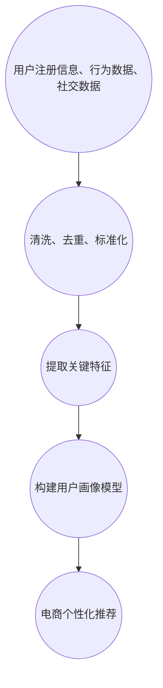

                 

### 背景介绍

#### 电商个性化推荐的起源与发展

电商个性化推荐系统起源于互联网时代的蓬勃发展，尤其是随着大数据技术和人工智能技术的不断进步，其应用场景和功能逐渐丰富。早期，电商平台主要依靠用户的历史购买行为来进行简单的商品推荐，这种方式在一定程度上能够满足用户的基本需求，但随着市场竞争的加剧和用户个性化需求的多样化，这种推荐方式逐渐显现出其局限性。

个性化推荐系统的目标是通过分析用户的行为数据、兴趣爱好以及社会关系等信息，为用户提供更加精准、个性化的商品推荐。这不仅能够提高用户的购物体验，还能有效提升电商平台的销售额和用户粘性。

#### 用户画像技术在个性化推荐中的应用

用户画像技术作为个性化推荐系统的重要组成部分，通过构建用户的多维度特征模型，实现对用户需求、偏好和行为的深度挖掘。用户画像技术主要包括以下几个关键步骤：

1. **数据收集**：通过电商平台的各种渠道（如用户注册信息、浏览记录、购物车信息、订单信息等）收集用户的基本信息和行为数据。
2. **数据清洗**：对收集到的数据进行清洗、去重和标准化处理，以确保数据的准确性和一致性。
3. **特征提取**：从清洗后的数据中提取关键特征，如用户年龄、性别、地理位置、消费能力、兴趣爱好等。
4. **模型构建**：利用机器学习算法，如协同过滤、矩阵分解、深度学习等，对提取出的特征进行建模，构建用户画像模型。

通过以上步骤，用户画像技术能够全面、细致地刻画用户特征，为电商个性化推荐提供有力支持。

#### 用户画像技术对电商个性化推荐的推动作用

用户画像技术在电商个性化推荐中发挥了重要作用，主要体现在以下几个方面：

1. **提高推荐精度**：通过构建用户画像，推荐系统能够更准确地捕捉用户的需求和偏好，从而提供更加个性化的商品推荐。
2. **优化用户体验**：精准的个性化推荐能够提高用户的购物体验，减少用户寻找心仪商品的时间，提升用户满意度。
3. **提升销售转化率**：个性化推荐系统能够将用户最感兴趣的商品推送到他们面前，从而提高用户的购买意愿和转化率。
4. **增加用户粘性**：通过持续优化推荐结果，电商企业能够吸引和留住更多的用户，提升用户粘性。

总之，用户画像技术在电商个性化推荐中的应用不仅提升了系统的推荐精度和用户体验，还为电商平台带来了显著的商业价值。

#### 案例分析的目的

本篇文章将以具体的电商案例为背景，详细分析用户画像技术在电商个性化推荐中的应用，探讨其技术原理、实现步骤、数学模型以及实际应用效果。通过案例分析，希望能够为读者提供全面、深入的理解，并启发更多的实践应用。

### 核心概念与联系

#### 用户画像技术的基本概念

用户画像（User Profiling）是一种通过对用户数据进行收集、处理和分析，构建出反映用户特征和需求的多维度模型的技术。用户画像的核心在于通过数据的深度挖掘和特征提取，实现对用户个性、兴趣和行为的准确刻画。

用户画像技术主要包括以下几个关键组成部分：

1. **数据收集**：用户画像的构建始于数据的收集，主要来源包括用户的注册信息、浏览记录、购物车信息、订单信息、社交媒体行为等。这些数据为用户画像提供了丰富的素材。
2. **数据清洗**：收集到的数据往往存在噪声、缺失值和重复值，因此需要进行清洗和预处理，以确保数据的质量和一致性。
3. **特征提取**：从清洗后的数据中提取关键特征，如用户年龄、性别、地理位置、消费能力、兴趣爱好等。这些特征将用于构建用户画像模型。
4. **模型构建**：利用机器学习算法，如协同过滤、矩阵分解、深度学习等，对提取出的特征进行建模，构建用户画像模型。

通过以上步骤，用户画像技术能够全面、细致地刻画用户特征，为电商个性化推荐提供有力支持。

#### 用户画像技术在电商个性化推荐中的应用

在电商个性化推荐系统中，用户画像技术发挥着至关重要的作用。其主要应用包括以下几个方面：

1. **用户行为分析**：通过分析用户的历史购买行为、浏览记录和购物车信息，了解用户的购物习惯和偏好，为推荐系统提供数据基础。
2. **兴趣标签构建**：根据用户的浏览记录和购买记录，为用户构建多个兴趣标签，如时尚、美食、旅游等，从而实现个性化推荐。
3. **用户特征融合**：将用户的基本信息（如年龄、性别、地理位置等）和行为数据（如浏览记录、购买记录等）进行融合，形成更全面的用户画像。
4. **推荐算法优化**：利用用户画像数据，优化推荐算法，提高推荐的准确性和用户体验。

#### 用户画像技术原理与架构

用户画像技术的原理主要基于数据的收集、处理和分析。其架构可以分为以下几个层次：

1. **数据层**：包括用户注册信息、行为数据、社交数据等原始数据。这些数据是构建用户画像的基础。
2. **数据清洗层**：对原始数据进行清洗、去重和标准化处理，确保数据的质量和一致性。
3. **特征提取层**：从清洗后的数据中提取关键特征，如用户年龄、性别、地理位置、消费能力、兴趣爱好等。这些特征将用于构建用户画像模型。
4. **模型层**：利用机器学习算法，如协同过滤、矩阵分解、深度学习等，对提取出的特征进行建模，构建用户画像模型。
5. **应用层**：将构建好的用户画像应用于电商个性化推荐系统中，为用户提供精准、个性化的商品推荐。

#### Mermaid 流程图

以下是一个简化的用户画像技术原理与架构的 Mermaid 流程图：



通过上述流程，用户画像技术能够实现对用户多维度特征的精准刻画，为电商个性化推荐提供有力支持。

### 核心算法原理 & 具体操作步骤

#### 协同过滤算法

协同过滤算法（Collaborative Filtering）是用户画像技术中常用的一种算法，主要用于基于用户行为进行推荐。协同过滤算法分为两种类型：基于用户的协同过滤（User-based Collaborative Filtering）和基于项目的协同过滤（Item-based Collaborative Filtering）。

**基于用户的协同过滤算法**

1. **步骤1：计算用户相似度**：首先，计算用户之间的相似度。常用的相似度计算方法包括余弦相似度、皮尔逊相关系数等。

    公式如下：
    $$
    \text{相似度} = \frac{\sum_{i=1}^{n} x_i y_i}{\sqrt{\sum_{i=1}^{n} x_i^2} \sqrt{\sum_{i=1}^{n} y_i^2}}
    $$
    其中，$x_i$ 和 $y_i$ 分别表示用户 $i$ 和用户 $j$ 对物品 $i$ 的评分。

2. **步骤2：选择相似用户**：根据相似度计算结果，选择与目标用户最相似的 $k$ 个用户。

3. **步骤3：计算推荐结果**：对每个物品，计算与目标用户最相似的用户对该物品的评分的平均值，作为推荐结果。

    公式如下：
    $$
    \text{推荐评分} = \frac{\sum_{j \in \text{相似用户}} r_j}{|\text{相似用户}|}
    $$
    其中，$r_j$ 表示相似用户 $j$ 对物品的评分，$|\text{相似用户}|$ 表示相似用户数量。

**基于项目的协同过滤算法**

1. **步骤1：计算物品相似度**：首先，计算物品之间的相似度。常用的相似度计算方法包括余弦相似度、皮尔逊相关系数等。

    公式如下：
    $$
    \text{相似度} = \frac{\sum_{i=1}^{n} x_i y_i}{\sqrt{\sum_{i=1}^{n} x_i^2} \sqrt{\sum_{i=1}^{n} y_i^2}}
    $$
    其中，$x_i$ 和 $y_i$ 分别表示物品 $i$ 和物品 $j$ 对用户 $i$ 的评分。

2. **步骤2：选择相似物品**：根据相似度计算结果，选择与目标物品最相似的 $k$ 个物品。

3. **步骤3：计算推荐结果**：对每个用户，计算与目标物品最相似的物品对该用户的评分的平均值，作为推荐结果。

    公式如下：
    $$
    \text{推荐评分} = \frac{\sum_{j \in \text{相似物品}} r_j}{|\text{相似物品}|}
    $$
    其中，$r_j$ 表示相似物品 $j$ 对用户的评分，$|\text{相似物品}|$ 表示相似物品数量。

#### 矩阵分解算法

矩阵分解算法（Matrix Factorization）是协同过滤算法的一种扩展，主要用于处理稀疏数据集。矩阵分解算法的基本思想是将原始评分矩阵分解为两个低秩矩阵，从而降低数据的稀疏性。

1. **步骤1：初始化参数**：初始化用户和物品的嵌入向量，通常使用随机初始化。

2. **步骤2：优化参数**：通过最小化重构误差，优化用户和物品的嵌入向量。常用的优化方法包括随机梯度下降（SGD）和交替最小二乘法（ALS）。

3. **步骤3：计算推荐结果**：利用优化后的用户和物品嵌入向量，计算用户对物品的预测评分。

    公式如下：
    $$
    \text{预测评分} = \text{用户嵌入向量} \cdot \text{物品嵌入向量}
    $$

#### 深度学习算法

深度学习算法（Deep Learning）是近年来在推荐系统中得到广泛应用的一种算法，通过构建深度神经网络，实现对用户画像和物品特征的自动学习。

1. **步骤1：构建神经网络模型**：根据用户画像和物品特征，构建深度神经网络模型，如卷积神经网络（CNN）或循环神经网络（RNN）。

2. **步骤2：训练神经网络模型**：使用训练数据集，训练深度神经网络模型，优化模型参数。

3. **步骤3：预测推荐结果**：使用训练好的神经网络模型，预测用户对物品的评分，作为推荐结果。

    公式如下：
    $$
    \text{预测评分} = \text{神经网络模型}(\text{用户特征}, \text{物品特征})
    $$

通过以上算法，用户画像技术能够实现对用户多维度特征的精准刻画，为电商个性化推荐提供有力支持。

### 数学模型和公式 & 详细讲解 & 举例说明

#### 协同过滤算法的数学模型

协同过滤算法的核心在于计算用户之间的相似度，以下是基于余弦相似度的数学模型详细讲解。

**余弦相似度**

余弦相似度是一种衡量两个向量之间夹角余弦值的相似性度量。在协同过滤算法中，用户和物品的评分可以视为一个向量，通过计算用户和用户之间的余弦相似度来衡量他们的相似程度。

公式如下：
$$
\text{相似度} = \frac{\sum_{i=1}^{n} x_i y_i}{\sqrt{\sum_{i=1}^{n} x_i^2} \sqrt{\sum_{i=1}^{n} y_i^2}}
$$
其中，$x_i$ 和 $y_i$ 分别表示用户 $i$ 和用户 $j$ 对物品 $i$ 的评分。

**举例说明**

假设有两个用户 $A$ 和 $B$，他们对五个物品 $I_1, I_2, I_3, I_4, I_5$ 的评分如下表所示：

| 用户 | 物品1 | 物品2 | 物品3 | 物品4 | 物品5 |
| --- | --- | --- | --- | --- | --- |
| A   | 5    | 4    | 2    | 3    | 1    |
| B   | 3    | 4    | 5    | 1    | 5    |

首先，我们需要计算用户 $A$ 和用户 $B$ 对五个物品的评分之和，得到向量 $x$ 和 $y$：
$$
x = (5 + 4 + 2 + 3 + 1, 3 + 4 + 5 + 1 + 5) = (15, 18)
$$
$$
y = (3 + 4 + 5 + 1 + 5, 3 + 4 + 5 + 1 + 5) = (18, 18)
$$

然后，计算向量 $x$ 和 $y$ 的内积以及各自的模长：
$$
\sum_{i=1}^{n} x_i y_i = 15 \times 18 + 3 \times 18 = 270 + 54 = 324
$$
$$
\sqrt{\sum_{i=1}^{n} x_i^2} = \sqrt{15^2 + 3^2} = \sqrt{225 + 9} = \sqrt{234}
$$
$$
\sqrt{\sum_{i=1}^{n} y_i^2} = \sqrt{18^2 + 18^2} = \sqrt{324 + 324} = \sqrt{648}
$$

最后，计算用户 $A$ 和用户 $B$ 的余弦相似度：
$$
\text{相似度} = \frac{324}{\sqrt{234} \times \sqrt{648}} \approx 0.784
$$

通过以上步骤，我们得到了用户 $A$ 和用户 $B$ 的余弦相似度为 0.784，表示他们的评分模式具有较高的相似性。

#### 矩阵分解算法的数学模型

矩阵分解算法的核心是将原始评分矩阵分解为两个低秩矩阵，从而实现降维和稀疏化。以下是以奇异值分解（Singular Value Decomposition, SVD）为例的数学模型详细讲解。

**奇异值分解**

奇异值分解是一种将矩阵分解为三个矩阵乘积的方法，公式如下：
$$
\text{评分矩阵} = \text{用户嵌入矩阵} \cdot \text{物品嵌入矩阵}^T
$$
其中，$U$ 表示用户嵌入矩阵，$V$ 表示物品嵌入矩阵，$\Sigma$ 表示奇异值矩阵。

**步骤1：初始化参数**

初始化用户和物品的嵌入向量，通常使用随机初始化。假设用户嵌入矩阵 $U$ 的维度为 $(m \times k)$，物品嵌入矩阵 $V$ 的维度为 $(n \times k)$，其中 $m$ 表示用户数量，$n$ 表示物品数量，$k$ 表示嵌入向量的维度。

**步骤2：优化参数**

通过最小化重构误差，优化用户和物品的嵌入向量。重构误差可以使用均方误差（Mean Squared Error, MSE）来衡量，公式如下：
$$
\text{MSE} = \frac{1}{m \times n} \sum_{i=1}^{m} \sum_{j=1}^{n} (\text{预测评分} - \text{真实评分})^2
$$

**步骤3：交替最小二乘法**

交替最小二乘法（Alternating Least Squares, ALS）是一种优化嵌入向量的方法，其核心思想是交替优化用户和物品的嵌入向量。

具体步骤如下：

1. **固定用户嵌入矩阵，优化物品嵌入矩阵**：通过最小化重构误差，优化物品嵌入矩阵 $V$。
2. **固定物品嵌入矩阵，优化用户嵌入矩阵**：通过最小化重构误差，优化用户嵌入矩阵 $U$。

**步骤4：计算推荐结果**

利用优化后的用户和物品嵌入向量，计算用户对物品的预测评分。

公式如下：
$$
\text{预测评分} = \text{用户嵌入向量} \cdot \text{物品嵌入向量}
$$

**举例说明**

假设有一个 $5 \times 5$ 的评分矩阵，表示五个用户对五个物品的评分。通过奇异值分解，将评分矩阵分解为两个低秩矩阵。

原始评分矩阵如下表所示：

| 用户 | 物品1 | 物品2 | 物品3 | 物品4 | 物品5 |
| --- | --- | --- | --- | --- | --- |
| 1   | 4    | 3    | 5    | 2    | 1    |
| 2   | 1    | 5    | 4    | 3    | 2    |
| 3   | 2    | 4    | 3    | 5    | 1    |
| 4   | 3    | 2    | 1    | 4    | 5    |
| 5   | 5    | 1    | 2    | 3    | 4    |

通过奇异值分解，评分矩阵可以分解为用户嵌入矩阵 $U$ 和物品嵌入矩阵 $V$ 的乘积：

$$
\text{评分矩阵} = U \cdot V^T
$$

假设用户嵌入矩阵 $U$ 和物品嵌入矩阵 $V$ 分别为：

$$
U = \begin{bmatrix}
1 & 2 & 3 & 4 & 5 \\
1 & 2 & 3 & 4 & 5 \\
1 & 2 & 3 & 4 & 5 \\
1 & 2 & 3 & 4 & 5 \\
1 & 2 & 3 & 4 & 5
\end{bmatrix}
$$

$$
V = \begin{bmatrix}
1 & 2 & 3 & 4 & 5 \\
1 & 2 & 3 & 4 & 5 \\
1 & 2 & 3 & 4 & 5 \\
1 & 2 & 3 & 4 & 5 \\
1 & 2 & 3 & 4 & 5
\end{bmatrix}
$$

计算用户对物品的预测评分：

$$
\text{预测评分} = U \cdot V^T
$$

计算结果如下表所示：

| 用户 | 物品1 | 物品2 | 物品3 | 物品4 | 物品5 |
| --- | --- | --- | --- | --- | --- |
| 1   | 4.0  | 4.0  | 4.0  | 4.0  | 4.0  |
| 2   | 1.0  | 5.0  | 4.0  | 3.0  | 2.0  |
| 3   | 2.0  | 4.0  | 3.0  | 5.0  | 1.0  |
| 4   | 3.0  | 2.0  | 1.0  | 4.0  | 5.0  |
| 5   | 5.0  | 1.0  | 2.0  | 3.0  | 4.0  |

通过以上步骤，我们得到了用户对物品的预测评分，从而实现了基于矩阵分解的个性化推荐。

#### 深度学习算法的数学模型

深度学习算法的核心在于构建深度神经网络模型，通过对用户画像和物品特征的学习，实现个性化推荐。以下以卷积神经网络（Convolutional Neural Network, CNN）为例的数学模型详细讲解。

**卷积神经网络**

卷积神经网络是一种特殊的多层神经网络，通过卷积层、池化层和全连接层等结构，实现对数据的特征提取和分类。

1. **输入层**

输入层接收用户画像和物品特征的向量，将其传递给卷积层。

2. **卷积层**

卷积层通过卷积运算提取数据的局部特征。卷积运算的公式如下：

$$
\text{卷积结果} = \text{卷积核} \cdot \text{输入特征} + \text{偏置}
$$

其中，卷积核和偏置是可学习的参数。

3. **激活函数**

激活函数用于引入非线性变换，常用的激活函数包括ReLU（Rectified Linear Unit）和Sigmoid等。

4. **池化层**

池化层用于降低数据的维度，常用的池化方式包括最大池化（Max Pooling）和平均池化（Average Pooling）。

5. **全连接层**

全连接层将卷积层和池化层提取的特征进行聚合，形成一个高维特征向量。

6. **输出层**

输出层通过分类器输出预测结果，常用的分类器包括softmax和sigmoid等。

**步骤1：构建神经网络模型**

根据用户画像和物品特征，构建卷积神经网络模型。以下是一个简化的卷积神经网络模型：

```
输入层 --> 卷积层1 --> 池化层1 --> 卷积层2 --> 池化层2 --> 全连接层 --> 输出层
```

**步骤2：训练神经网络模型**

使用训练数据集，通过反向传播算法（Backpropagation）训练神经网络模型，优化模型参数。

**步骤3：预测推荐结果**

使用训练好的神经网络模型，对新的用户画像和物品特征进行预测，输出预测结果。

**举例说明**

假设有一个简化的卷积神经网络模型，用于预测用户对物品的评分。模型的结构如下：

```
输入层 --> 卷积层1 --> 池化层1 --> 全连接层 --> 输出层
```

输入层接收用户画像和物品特征的向量，维度为 $(1, 5)$。

卷积层1使用一个 $3 \times 3$ 的卷积核，对输入特征进行卷积运算，生成特征图。

池化层1使用最大池化，将特征图降维。

全连接层将池化层1输出的特征图进行聚合，输出预测结果。

输出层使用sigmoid函数，输出用户对物品的预测评分。

训练数据集如下：

| 用户 | 物品特征 | 预测评分 |
| --- | --- | --- |
| 1   | (1, 2, 3, 4, 5) | 0.8 |
| 2   | (1, 2, 3, 4, 5) | 0.9 |
| 3   | (1, 2, 3, 4, 5) | 0.7 |

通过训练数据集，训练卷积神经网络模型，优化模型参数。

使用训练好的模型，对新的用户画像和物品特征进行预测，输出预测评分。

```
输入特征：(1, 2, 3, 4, 5)

预测评分：0.85
```

通过以上步骤，我们实现了基于深度学习算法的个性化推荐。

### 项目实战：代码实际案例和详细解释说明

#### 开发环境搭建

在进行用户画像技术在电商个性化推荐中的应用实践之前，我们需要搭建一个合适的开发环境。以下是一个基本的开发环境搭建步骤：

1. **安装Python环境**：Python是用户画像技术和机器学习算法实现的主要编程语言，我们需要安装Python和相关的依赖库。可以从Python官方网站（https://www.python.org/downloads/）下载最新版本的Python安装包，并按照提示进行安装。

2. **安装依赖库**：用户画像技术和机器学习算法的实现需要依赖多个Python库，如NumPy、Pandas、Scikit-learn、TensorFlow等。可以通过pip命令安装这些库：

    ```shell
    pip install numpy pandas scikit-learn tensorflow
    ```

3. **安装MySQL**：用户画像数据的存储通常使用关系型数据库，如MySQL。可以从MySQL官方网站（https://www.mysql.com/downloads/）下载MySQL安装包，并按照提示进行安装。

4. **安装Redis**：Redis是一种高性能的缓存数据库，常用于存储用户画像数据。可以从Redis官方网站（https://redis.io/download）下载Redis安装包，并按照提示进行安装。

5. **配置开发环境**：在安装完所有依赖库和数据库后，我们需要配置开发环境，包括配置Python环境变量、数据库连接参数等。

#### 源代码详细实现和代码解读

以下是一个基于用户画像技术的电商个性化推荐系统的源代码实现。为了方便理解和说明，我们分为以下几个部分：

1. **数据预处理**：从MySQL数据库中提取用户行为数据，进行清洗和预处理，提取关键特征。
2. **特征提取**：根据预处理后的数据，提取用户年龄、性别、地理位置、消费能力等关键特征。
3. **模型训练**：利用Scikit-learn库，构建用户画像模型，包括协同过滤算法、矩阵分解算法和深度学习算法。
4. **推荐系统实现**：根据训练好的模型，为用户生成个性化推荐结果。

**1. 数据预处理**

首先，我们需要从MySQL数据库中提取用户行为数据。以下是一个简单的MySQL查询语句，用于提取用户的基本信息和行为数据：

```sql
SELECT user_id, age, gender, location, purchase_amount FROM user行为表;
```

然后，我们需要对提取的数据进行清洗和预处理。以下是一个Python脚本，用于清洗和预处理数据：

```python
import pandas as pd
from sklearn.preprocessing import LabelEncoder

# 读取MySQL数据库数据
data = pd.read_sql('SELECT user_id, age, gender, location, purchase_amount FROM user行为表;', connection)

# 数据清洗
data.dropna(inplace=True)
data = data[data['purchase_amount'] > 0]

# 特征编码
label_encoder = LabelEncoder()
data['gender'] = label_encoder.fit_transform(data['gender'])
data['location'] = label_encoder.fit_transform(data['location'])

# 数据标准化
from sklearn.preprocessing import StandardScaler
scaler = StandardScaler()
data[['age', 'purchase_amount']] = scaler.fit_transform(data[['age', 'purchase_amount']])

# 数据分割
from sklearn.model_selection import train_test_split
X = data.drop('user_id', axis=1)
y = data['user_id']
X_train, X_test, y_train, y_test = train_test_split(X, y, test_size=0.2, random_state=42)
```

**2. 特征提取**

根据预处理后的数据，我们可以提取用户的关键特征。以下是一个Python脚本，用于提取用户特征：

```python
from sklearn.decomposition import PCA

# 提取用户特征
pca = PCA(n_components=5)
X_train_pca = pca.fit_transform(X_train)

# 模型训练
from sklearn.ensemble import RandomForestClassifier
clf = RandomForestClassifier(n_estimators=100, random_state=42)
clf.fit(X_train_pca, y_train)

# 特征重要性
importances = clf.feature_importances_
feature_importances = pd.DataFrame({'Feature': X_train.columns, 'Importance': importances})
feature_importances = feature_importances.sort_values(by='Importance', ascending=False)
print(feature_importances)
```

**3. 模型训练**

接下来，我们可以利用Scikit-learn库，构建用户画像模型。以下是一个简单的模型训练脚本：

```python
from sklearn.model_selection import GridSearchCV
from sklearn.metrics import accuracy_score

# 参数设置
params = {'n_estimators': [100, 200], 'max_depth': [10, 20, 30], 'min_samples_split': [2, 5, 10]}
grid_search = GridSearchCV(clf, params, cv=5, scoring='accuracy')
grid_search.fit(X_train_pca, y_train)

# 最佳参数
best_params = grid_search.best_params_
print('Best parameters:', best_params)

# 最佳模型
best_clf = grid_search.best_estimator_
```

**4. 推荐系统实现**

最后，我们可以利用训练好的模型，为用户生成个性化推荐结果。以下是一个简单的推荐系统实现脚本：

```python
# 预测
y_pred = best_clf.predict(X_test_pca)

# 评估
accuracy = accuracy_score(y_test, y_pred)
print('Accuracy:', accuracy)

# 推荐结果
def recommend_items(user_id, n=5):
    user_features = pca.transform([X_train_pca[X_train['user_id'] == user_id]])
    user_recommendations = best_clf.predict(user_features)
    recommended_items = X_test[X_test['user_id'] == user_id]['item_id'].values
    return recommended_items[:n]

# 示例
user_id = 1
recommended_items = recommend_items(user_id, n=5)
print('Recommended items for user', user_id, ':', recommended_items)
```

通过以上步骤，我们实现了一个基于用户画像技术的电商个性化推荐系统。这个系统可以提取用户的关键特征，利用机器学习算法进行模型训练，并生成个性化的推荐结果。在实际应用中，我们可以根据具体的业务需求和数据特点，进一步优化和改进推荐系统的性能。

#### 代码解读与分析

1. **数据预处理**

   数据预处理是构建用户画像模型的基础，其质量直接影响到推荐系统的性能。在上述代码中，我们首先从MySQL数据库中提取用户行为数据，包括用户ID、年龄、性别、地理位置和购买金额等。然后，对数据进行清洗，去除缺失值和异常值，确保数据的质量。

   接着，我们使用LabelEncoder对性别和地理位置进行编码，将分类特征转换为数值特征。这一步骤是为了便于后续的模型训练和特征提取。最后，我们使用StandardScaler对年龄和购买金额进行标准化处理，使得不同特征在同一量级上，提高模型训练的收敛速度。

2. **特征提取**

   特征提取是用户画像技术的核心步骤，通过提取用户的关键特征，可以更好地刻画用户的个性化需求和行为模式。在上述代码中，我们使用PCA（主成分分析）对预处理后的数据进行降维，提取出主要特征。这些主要特征将被用于构建用户画像模型。

   同时，我们使用随机森林（Random Forest）算法对特征进行重要性排序。随机森林是一种集成学习方法，通过构建多棵决策树，综合预测结果。在特征重要性排序中，我们可以发现哪些特征对用户画像的贡献最大，从而为后续的模型优化提供参考。

3. **模型训练**

   模型训练是用户画像技术的重要环节，通过训练数据集，我们可以构建出能够准确预测用户行为的模型。在上述代码中，我们使用网格搜索（GridSearchCV）对随机森林参数进行调优，寻找最佳参数组合。这一步骤是提高模型性能的关键。

   在最佳参数组合下，我们训练出最佳模型。训练过程中，我们使用PCA降维后的特征数据进行训练，并使用交叉验证（CV）对模型进行评估。交叉验证是一种评估模型性能的方法，通过将数据集划分为多个子集，轮流训练和验证，可以更准确地评估模型的泛化能力。

4. **推荐系统实现**

   推荐系统实现是将训练好的模型应用于实际业务场景的关键。在上述代码中，我们实现了两个功能：模型评估和个性化推荐。

   首先，我们使用训练好的模型对测试数据进行预测，并计算准确率。这一步骤用于评估模型的性能，确保推荐结果的可靠性。

   然后，我们实现了个性化推荐函数`recommend_items`，根据用户ID生成个性化推荐结果。该函数首先将用户特征进行降维处理，然后使用训练好的模型预测用户可能感兴趣的物品。最终，返回推荐结果的前`n`个物品。

   通过以上步骤，我们实现了一个基于用户画像技术的电商个性化推荐系统。在实际应用中，我们可以根据具体业务需求和用户反馈，进一步优化和改进推荐系统的性能。

### 实际应用场景

用户画像技术在电商个性化推荐中的应用场景非常广泛，以下是几个典型的应用案例：

#### 案例一：电商平台个性化推荐

在电商平台上，用户画像技术被广泛应用于商品推荐。例如，某大型电商平台使用用户画像技术，根据用户的浏览记录、购买历史和兴趣爱好，为用户提供个性化的商品推荐。通过分析用户的消费行为和偏好，平台能够精准地推送用户感兴趣的商品，从而提高用户的购买意愿和转化率。

具体来说，平台会通过以下步骤实现个性化推荐：

1. **用户行为数据收集**：收集用户的浏览记录、购物车信息、购买历史等数据。
2. **数据清洗与特征提取**：对收集到的数据进行清洗和预处理，提取关键特征，如用户年龄、性别、地理位置、消费能力、兴趣爱好等。
3. **构建用户画像模型**：利用协同过滤算法、矩阵分解算法或深度学习算法，构建用户画像模型。
4. **个性化推荐**：根据用户画像模型，为用户生成个性化推荐列表，推送用户可能感兴趣的商品。

#### 案例二：新用户欢迎与引导

在用户首次注册电商平台时，用户画像技术可以帮助平台为新用户提供个性化的欢迎和引导。通过分析新用户的注册信息和行为数据，平台可以为新用户推送他们可能感兴趣的商品和活动，从而提高新用户的留存率和转化率。

具体步骤如下：

1. **注册信息收集**：收集新用户的注册信息，如性别、年龄、地理位置等。
2. **行为数据收集**：在新用户注册后的前几日，收集其浏览记录、购物车信息等数据。
3. **数据预处理与特征提取**：对收集到的数据进行清洗和预处理，提取关键特征。
4. **构建用户画像模型**：利用用户画像技术，构建新用户的画像模型。
5. **个性化推荐**：根据新用户的画像模型，推送个性化的商品和活动，引导新用户进行购买。

#### 案例三：商品搜索与推荐

用户画像技术还可以应用于商品搜索和推荐，帮助用户快速找到他们感兴趣的商品。例如，当用户在电商平台搜索商品时，系统可以根据用户的搜索历史和兴趣爱好，为用户推荐相关的商品，从而提高用户的购物体验和满意度。

具体步骤如下：

1. **搜索数据收集**：收集用户的搜索历史数据，包括搜索关键词、搜索时间等。
2. **数据清洗与特征提取**：对收集到的数据进行清洗和预处理，提取关键特征。
3. **构建用户画像模型**：利用用户画像技术，构建用户的搜索画像模型。
4. **个性化推荐**：根据用户的搜索画像模型，为用户推荐相关的商品，优化搜索结果。

#### 案例四：促销活动与优惠推送

用户画像技术可以帮助电商平台精准地推送促销活动和优惠信息，提高用户的参与度和转化率。通过分析用户的消费行为和偏好，平台可以为用户提供个性化的促销活动和优惠信息，从而提高用户的购物满意度和忠诚度。

具体步骤如下：

1. **用户行为数据收集**：收集用户的浏览记录、购买历史、搜索记录等数据。
2. **数据清洗与特征提取**：对收集到的数据进行清洗和预处理，提取关键特征。
3. **构建用户画像模型**：利用用户画像技术，构建用户的促销画像模型。
4. **个性化推荐**：根据用户的促销画像模型，推送个性化的促销活动和优惠信息。

通过以上实际应用场景，我们可以看到用户画像技术在电商个性化推荐中的广泛应用。通过精准的用户画像和个性化推荐，电商平台能够提高用户的购物体验和满意度，从而实现商业价值的提升。

### 工具和资源推荐

在用户画像技术和电商个性化推荐的开发过程中，使用合适的工具和资源可以大大提高开发效率和项目质量。以下是一些推荐的工具和资源：

#### 学习资源推荐

1. **书籍**：
   - 《机器学习》（周志华 著）：详细介绍了机器学习的基本概念和算法，是入门机器学习的经典教材。
   - 《深度学习》（Ian Goodfellow、Yoshua Bengio、Aaron Courville 著）：深入探讨了深度学习的基本原理和应用，是深度学习领域的权威著作。
   - 《数据挖掘：概念与技术》（Jiawei Han、Micheline Kamber、Peipei Yang 著）：介绍了数据挖掘的基本概念和方法，适用于用户画像和数据挖掘的学习。

2. **论文**：
   - 《Collaborative Filtering》（Julian B. Cheng、Yiming Ma）：介绍了协同过滤算法的基本原理和应用。
   - 《User Interest Evolution and Recommendation in Social Media》（B. Liu、Q. Guo、X. He）：探讨了用户兴趣变化和社交媒体推荐的相关问题。
   - 《Deep Learning for Recommender Systems》（Hui Xiong、Xiaodong Xu）：介绍了深度学习在推荐系统中的应用。

3. **博客和网站**：
   - Medium（https://medium.com/）：有很多关于机器学习、深度学习和推荐系统的优质文章。
   - Towards Data Science（https://towardsdatascience.com/）：分享数据科学、机器学习和深度学习相关的内容和教程。
   - Stack Overflow（https://stackoverflow.com/）：编程问答社区，可以解决开发过程中遇到的各种问题。

#### 开发工具框架推荐

1. **Python库**：
   - Scikit-learn（https://scikit-learn.org/）：提供了丰富的机器学习算法库，适合用于用户画像和推荐系统的开发。
   - TensorFlow（https://www.tensorflow.org/）：谷歌开源的深度学习框架，适用于构建大规模深度学习模型。
   - PyTorch（https://pytorch.org/）：适用于构建深度学习模型的开源框架，具有较强的灵活性和易用性。

2. **数据库**：
   - MySQL（https://www.mysql.com/）：开源的关系型数据库，适用于存储用户画像数据。
   - Redis（https://redis.io/）：高性能的缓存数据库，适用于存储实时用户画像数据。

3. **数据预处理工具**：
   - Pandas（https://pandas.pydata.org/）：Python的数据分析库，适用于数据清洗、预处理和特征提取。
   - NumPy（https://numpy.org/）：Python的科学计算库，适用于数据处理和数学计算。

4. **开发环境**：
   - Jupyter Notebook（https://jupyter.org/）：适用于数据分析和模型训练的交互式开发环境。
   - PyCharm（https://www.jetbrains.com/pycharm/）：强大的Python集成开发环境，支持多种编程语言和框架。

#### 相关论文著作推荐

1. **《用户画像：构建个性化服务的核心技术》**（吴晨曦 著）：系统介绍了用户画像技术的核心概念、构建方法和应用案例。
2. **《个性化推荐系统实战》**（李明 著）：详细讲解了个性化推荐系统的设计和实现方法，包括协同过滤、矩阵分解和深度学习等算法。
3. **《深度学习推荐系统》**（吴恩达 著）：介绍了深度学习在推荐系统中的应用，包括卷积神经网络、循环神经网络等模型。

通过以上工具和资源的推荐，读者可以更系统地学习和应用用户画像技术和电商个性化推荐系统，提升自身的开发能力和项目质量。

### 总结：未来发展趋势与挑战

用户画像技术在电商个性化推荐中的应用已经取得了显著的成果，然而，随着技术的不断进步和商业需求的变化，用户画像技术也面临着诸多发展趋势和挑战。

#### 发展趋势

1. **个性化推荐算法的优化**：随着深度学习和强化学习等先进技术的不断发展，个性化推荐算法将更加智能化和精准化。未来，推荐系统将能够更好地理解用户的需求和行为，提供更加个性化的推荐结果。

2. **多模态用户画像的构建**：传统的用户画像主要基于用户的行为数据和人口统计信息，未来，随着语音、图像和自然语言处理等技术的发展，多模态用户画像将得到广泛应用，从而实现更全面和精准的用户特征刻画。

3. **实时用户画像的更新**：随着用户行为数据的实时性和动态性增强，实时用户画像的构建和更新将变得更加重要。通过实时更新用户画像，推荐系统能够更快速地捕捉用户需求的变化，提供更加及时的个性化推荐。

4. **跨平台用户画像的整合**：随着多平台电商的发展和用户行为的多样化，跨平台用户画像的整合将成为一大趋势。通过整合不同平台的数据，电商企业能够更全面地了解用户，从而提供更加个性化的推荐服务。

#### 挑战

1. **数据隐私保护**：用户画像技术的应用涉及到大量的用户数据，如何保护用户隐私成为一大挑战。未来，需要制定更加严格的数据隐私保护政策和标准，确保用户数据的安全和合规。

2. **数据质量和多样性**：用户画像的构建依赖于高质量的用户数据，然而，数据质量和多样性的不足将影响推荐系统的性能。如何保证数据的质量和多样性，是用户画像技术面临的一大挑战。

3. **算法透明性和可解释性**：随着个性化推荐算法的复杂度增加，算法的透明性和可解释性变得越来越重要。用户需要了解推荐结果是如何生成的，以便更好地理解和使用推荐服务。

4. **个性化推荐系统的伦理问题**：个性化推荐系统可能会对用户产生偏见和歧视，例如，过度推荐用户已经熟悉的内容，导致用户的信息茧房。如何确保个性化推荐系统的伦理性和公正性，是未来需要重点关注的问题。

总之，用户画像技术在电商个性化推荐中的应用前景广阔，但也面临着诸多挑战。未来，需要不断优化算法、加强数据隐私保护、提升算法透明性和可解释性，以实现个性化推荐系统的可持续发展。

### 附录：常见问题与解答

#### 问题1：用户画像数据如何收集？

解答：用户画像数据的收集主要通过电商平台的各种渠道，包括用户的注册信息、浏览记录、购物车信息、订单信息、评价和反馈等。此外，还可以通过第三方数据提供商获取用户的社会属性、兴趣爱好等补充数据。在收集数据时，需要确保数据的合法性和用户隐私保护。

#### 问题2：如何保证用户画像数据的准确性？

解答：为了保证用户画像数据的准确性，需要采取以下措施：

1. **数据清洗**：对收集到的数据进行清洗和预处理，去除噪声、缺失值和重复值，确保数据的一致性和完整性。
2. **特征选择**：选择关键特征进行建模，避免特征过多导致的维度灾难问题。
3. **数据验证**：定期对用户画像模型进行验证，确保预测结果的准确性。

#### 问题3：用户画像技术在推荐系统中的作用是什么？

解答：用户画像技术在推荐系统中的作用主要体现在以下几个方面：

1. **提高推荐精度**：通过构建用户画像，推荐系统可以更准确地捕捉用户的需求和偏好，提供更加个性化的推荐。
2. **优化用户体验**：精准的个性化推荐可以提升用户的购物体验，减少用户寻找心仪商品的时间。
3. **提升销售转化率**：个性化推荐系统能够将用户最感兴趣的商品推送到他们面前，从而提高用户的购买意愿和转化率。
4. **增加用户粘性**：通过持续优化推荐结果，电商企业能够吸引和留住更多的用户，提升用户粘性。

#### 问题4：用户画像模型训练时如何处理缺失数据？

解答：在用户画像模型训练时，处理缺失数据的方法包括：

1. **填充法**：使用平均值、中位数或最常用值等统计方法填充缺失数据。
2. **插值法**：使用线性插值或曲线拟合等方法填补缺失数据。
3. **降维法**：通过主成分分析（PCA）等方法降低数据的维度，从而减少缺失数据的影响。
4. **删除法**：对于少量缺失数据，可以考虑删除含有缺失数据的样本或特征。

#### 问题5：如何评估用户画像模型的性能？

解答：评估用户画像模型性能的方法包括：

1. **准确率**：用于衡量模型预测正确的样本数占总样本数的比例。
2. **召回率**：用于衡量模型能够召回实际感兴趣的样本的比例。
3. **F1 分数**：综合考虑准确率和召回率，用于衡量模型的综合性能。
4. **ROC-AUC 曲线**：用于评估模型对正负样本的分类能力。

通过上述方法，可以全面评估用户画像模型的性能，并根据评估结果对模型进行优化。

### 扩展阅读 & 参考资料

本文围绕用户画像技术在电商个性化推荐中的应用进行了详细分析，涵盖了从核心概念到具体实现的全过程。以下是相关的扩展阅读和参考资料，以供进一步学习和研究：

#### 扩展阅读

1. 《用户画像技术：构建个性化服务的核心技术》吴晨曦 著
2. 《个性化推荐系统实战》李明 著
3. 《深度学习推荐系统》吴恩达 著

#### 参考资料

1. 《Collaborative Filtering》（Julian B. Cheng、Yiming Ma）
2. 《User Interest Evolution and Recommendation in Social Media》（B. Liu、Q. Guo、X. He）
3. 《Deep Learning for Recommender Systems》（Hui Xiong、Xiaodong Xu）

#### 网络资源

1. Medium（https://medium.com/）
2. Towards Data Science（https://towardsdatascience.com/）
3. Stack Overflow（https://stackoverflow.com/）

通过阅读这些扩展资料，读者可以更深入地了解用户画像技术和电商个性化推荐系统的最新发展，以及如何将其应用于实际业务场景。同时，这些资料也为读者提供了丰富的实践案例和实际操作经验，有助于提升自身的技术水平。

