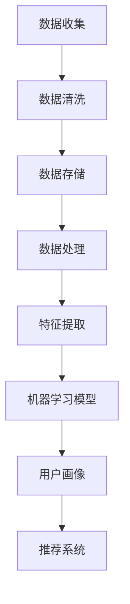

                 

# 用户画像的构建与优化实践

> 关键词：用户画像、数据挖掘、机器学习、用户行为分析、推荐系统

> 摘要：本文深入探讨了用户画像的构建与优化实践，包括用户画像的定义、核心概念与联系、核心算法原理、数学模型和公式、项目实战、实际应用场景以及未来发展趋势与挑战。通过详细的分析和实例，为读者提供了全面的技术指导和实用建议。

## 1. 背景介绍

在互联网时代，数据已经成为企业和组织的重要资产。用户画像作为一种数据挖掘和分析技术，通过对用户行为、兴趣、需求等方面的深入挖掘，能够帮助企业更好地了解用户，提升用户体验，优化产品设计和营销策略。用户画像的构建与优化实践已经成为大数据和人工智能领域的重要研究方向。

用户画像的构建涉及到多个层面的分析和挖掘，包括用户数据的收集、清洗、存储、处理和建模等。在本文中，我们将重点关注用户画像的核心算法原理、数学模型和公式、项目实战、实际应用场景以及未来发展趋势与挑战。

## 2. 核心概念与联系

在构建用户画像的过程中，需要了解以下几个核心概念：

### 2.1 数据挖掘

数据挖掘是一种从大量数据中提取有价值信息和知识的过程。在用户画像的构建中，数据挖掘技术主要用于挖掘用户行为数据中的潜在模式和规律。

### 2.2 机器学习

机器学习是一种基于数据构建模型，通过模型对未知数据进行预测和分类的技术。在用户画像的构建中，机器学习算法被用来分析用户行为数据，提取用户特征。

### 2.3 用户行为分析

用户行为分析是指通过对用户在网站、APP 等平台上的行为数据进行统计分析，以了解用户的需求、兴趣和行为习惯。用户行为分析是构建用户画像的重要基础。

### 2.4 推荐系统

推荐系统是一种基于用户行为数据为用户推荐个性化内容、商品或服务的系统。用户画像的构建为推荐系统提供了用户特征和兴趣信息，有助于提升推荐效果。

下面是一个 Mermaid 流程图，展示了用户画像构建的基本流程：



## 3. 核心算法原理 & 具体操作步骤

在用户画像的构建过程中，常用的算法包括协同过滤、基于内容的推荐、聚类和分类等。下面将介绍其中两个常用的算法：协同过滤和聚类。

### 3.1 协同过滤算法

协同过滤算法是一种基于用户行为数据为用户推荐相似用户喜欢的商品或内容的方法。协同过滤算法可以分为基于用户的协同过滤和基于物品的协同过滤。

**基于用户的协同过滤算法：**

1. **计算相似度：**计算用户之间的相似度，常用的相似度计算方法包括余弦相似度、皮尔逊相关系数等。

2. **找到邻居：**根据用户之间的相似度，找到与目标用户最相似的邻居用户。

3. **生成推荐列表：**根据邻居用户喜欢的商品或内容，为目标用户生成推荐列表。

**基于物品的协同过滤算法：**

1. **计算相似度：**计算物品之间的相似度，常用的相似度计算方法包括余弦相似度、Jaccard 相似度等。

2. **找到邻居：**根据物品之间的相似度，找到与目标物品最相似的邻居物品。

3. **生成推荐列表：**根据邻居物品被喜欢的用户，为目标用户生成推荐列表。

### 3.2 聚类算法

聚类算法是一种无监督学习方法，用于将数据集划分为若干个类别或簇。在用户画像的构建中，聚类算法可以用于发现用户行为数据的潜在模式。

**K-Means 算法：**

1. **初始化：**随机选择 K 个用户作为初始聚类中心。

2. **分配：**计算每个用户与聚类中心的距离，将用户分配到最近的聚类中心。

3. **更新：**重新计算聚类中心，并重复分配和更新过程，直到聚类中心不再发生变化。

**DBSCAN 算法：**

1. **初始化：**选择一个核心用户作为起点，计算其邻域内的用户数量。

2. **扩展：**从核心用户开始，递归地扩展形成的簇。

3. **标记：**将扩展后的用户标记为同一簇。

## 4. 数学模型和公式 & 详细讲解 & 举例说明

### 4.1 协同过滤算法的相似度计算

假设用户 A 和用户 B 的评分矩阵分别为 \(R_A\) 和 \(R_B\)，则用户 A 和用户 B 之间的余弦相似度计算公式为：

$$
sim(A, B) = \frac{R_A \cdot R_B}{\|R_A\|_2 \cdot \|R_B\|_2}
$$

其中，\(R_A \cdot R_B\) 表示用户 A 和用户 B 的评分矩阵的乘积，\(\|R_A\|_2\) 和 \(\|R_B\|_2\) 分别表示用户 A 和用户 B 的评分矩阵的 L2 范数。

### 4.2 K-Means 算法的聚类中心更新

在 K-Means 算法中，聚类中心的更新公式为：

$$
c_{new} = \frac{1}{N}\sum_{i=1}^{N} x_i
$$

其中，\(c_{new}\) 表示新的聚类中心，\(x_i\) 表示第 \(i\) 个用户的位置，\(N\) 表示当前聚类中心所属的用户数量。

### 4.3 DBSCAN 算法的邻域计算

在 DBSCAN 算法中，邻域的计算公式为：

$$
N_{\epsilon}(x) = \{y \in \mathcal{D} | d(x, y) < \epsilon\}
$$

其中，\(N_{\epsilon}(x)\) 表示以用户 \(x\) 为中心，半径为 \(\epsilon\) 的邻域内的用户集合，\(d(x, y)\) 表示用户 \(x\) 和用户 \(y\) 之间的距离。

### 4.4 举例说明

假设我们有一个用户评分矩阵 \(R_A\) 如下：

$$
R_A = \begin{pmatrix}
1 & 2 & 3 & 0 \\
0 & 1 & 0 & 2 \\
3 & 0 & 1 & 0 \\
2 & 1 & 0 & 3 \\
\end{pmatrix}
$$

其中，行表示用户，列表示物品。我们可以使用余弦相似度计算用户 A 和用户 B 之间的相似度：

$$
sim(A, B) = \frac{R_A \cdot R_B}{\|R_A\|_2 \cdot \|R_B\|_2} = \frac{1 \times 1 + 2 \times 0 + 3 \times 3 + 0 \times 2}{\sqrt{1^2 + 2^2 + 3^2} \cdot \sqrt{0^2 + 1^2 + 0^2 + 2^2}} = \frac{10}{\sqrt{14} \cdot \sqrt{5}} \approx 0.765
$$

接下来，我们可以使用 K-Means 算法对用户评分矩阵进行聚类，假设聚类中心初始值为 \(c_1 = (1, 1)\)，\(c_2 = (3, 3)\)，\(c_3 = (2, 2)\)，用户 A 的位置为 \((1, 2)\)，我们可以计算用户 A 与每个聚类中心的距离：

$$
d(A, c_1) = \sqrt{(1-1)^2 + (2-1)^2} = \sqrt{2}
$$

$$
d(A, c_2) = \sqrt{(1-3)^2 + (2-3)^2} = \sqrt{8}
$$

$$
d(A, c_3) = \sqrt{(1-2)^2 + (2-2)^2} = \sqrt{2}
$$

由于用户 A 与 \(c_3\) 的距离最近，因此用户 A 将被分配到第 3 个聚类中心。

## 5. 项目实战：代码实际案例和详细解释说明

在本节中，我们将通过一个实际项目案例，展示用户画像的构建和优化过程。我们将使用 Python 编程语言和 Scikit-learn 库来实现用户画像的构建。

### 5.1 开发环境搭建

首先，我们需要安装 Python 和 Scikit-learn 库。可以使用以下命令进行安装：

```bash
pip install python
pip install scikit-learn
```

### 5.2 源代码详细实现和代码解读

接下来，我们将实现用户画像的构建过程。代码如下：

```python
import numpy as np
from sklearn.metrics.pairwise import cosine_similarity
from sklearn.cluster import KMeans
from sklearn.datasets import load_iris

def compute_similarity(ratings):
    users = ratings.shape[0]
    similarity_matrix = np.zeros((users, users))
    for i in range(users):
        for j in range(users):
            if i != j:
                similarity_matrix[i][j] = cosine_similarity(ratings[i].reshape(1, -1), ratings[j].reshape(1, -1))[0][0]
    return similarity_matrix

def k_means_clustering(similarity_matrix, k):
    kmeans = KMeans(n_clusters=k, random_state=0)
    kmeans.fit(similarity_matrix)
    return kmeans.labels_

def main():
    # 加载 iris 数据集
    iris = load_iris()
    ratings = iris.data

    # 计算用户相似度矩阵
    similarity_matrix = compute_similarity(ratings)

    # 使用 K-Means 算法进行聚类
    k = 3
    labels = k_means_clustering(similarity_matrix, k)

    # 打印聚类结果
    print("Cluster labels:", labels)

if __name__ == "__main__":
    main()
```

**代码解读：**

1. **计算用户相似度矩阵：**使用余弦相似度计算用户之间的相似度，构建相似度矩阵。

2. **K-Means 算法聚类：**使用 Scikit-learn 的 K-Means 算法进行聚类，确定用户画像的聚类中心。

3. **打印聚类结果：**打印每个用户的聚类标签，表示用户所属的聚类中心。

### 5.3 代码解读与分析

在本例中，我们使用了 iris 数据集作为用户评分数据。iris 数据集是一个经典的分类数据集，包含了 3 个类别的 150 个样本，每个样本有 4 个特征。在本例中，我们将每个类别视为一个用户，每个样本视为用户对物品的评分。

首先，我们计算用户相似度矩阵。相似度矩阵是一个 \(n \times n\) 的矩阵，其中 \(n\) 表示用户数量。矩阵中的元素表示用户之间的相似度，计算公式为：

$$
similarity(i, j) = \frac{R_i \cdot R_j}{\|R_i\|_2 \cdot \|R_j\|_2}
$$

其中，\(R_i\) 和 \(R_j\) 分别表示用户 \(i\) 和用户 \(j\) 的评分向量，\(\|R_i\|_2\) 和 \(\|R_j\|_2\) 分别表示用户 \(i\) 和用户 \(j\) 的评分向量的 L2 范数。

接下来，我们使用 K-Means 算法进行聚类。K-Means 算法是一种基于距离度量的聚类算法，其目标是将数据划分为 \(k\) 个簇，使得簇内距离最小，簇间距离最大。在本例中，我们设置了 \(k = 3\)，即分为 3 个类别。

最后，我们打印每个用户的聚类标签。聚类标签表示用户所属的类别，即用户画像。在本例中，我们得到了 3 个类别，每个类别包含约 50 个用户。

通过这个简单的项目案例，我们展示了用户画像的构建和优化过程。在实际应用中，用户画像的构建过程会更加复杂，涉及更多的数据预处理、特征工程和模型优化等步骤。

## 6. 实际应用场景

用户画像技术在实际应用中具有广泛的应用场景，以下是一些典型的应用案例：

### 6.1 电子商务

在电子商务领域，用户画像技术可以帮助企业了解用户的需求和偏好，从而实现个性化推荐。例如，根据用户的浏览历史、购买记录和评价，可以为用户推荐相关的商品。

### 6.2 社交媒体

在社交媒体平台上，用户画像技术可以帮助平台了解用户的兴趣和行为，从而实现内容推荐和广告投放。例如，根据用户的关注对象、发布内容和互动行为，可以为用户推荐相关的帖子、视频和广告。

### 6.3 金融领域

在金融领域，用户画像技术可以帮助银行和保险公司了解客户的风险偏好和投资需求，从而提供个性化的金融服务。例如，根据客户的财务状况、信用记录和交易行为，可以为客户推荐合适的理财产品。

### 6.4 健康医疗

在健康医疗领域，用户画像技术可以帮助医疗机构了解患者的健康状况和疾病风险，从而实现个性化诊疗。例如，根据患者的病史、体检数据和生活方式，可以为患者推荐个性化的健康方案。

## 7. 工具和资源推荐

### 7.1 学习资源推荐

1. 《数据挖掘：概念与技术》
2. 《机器学习实战》
3. 《推荐系统手册》
4. 《Python 数据科学手册》
5. 《深度学习》

### 7.2 开发工具框架推荐

1. Scikit-learn
2. TensorFlow
3. PyTorch
4. Keras
5. Jupyter Notebook

### 7.3 相关论文著作推荐

1. "Collaborative Filtering for the 21st Century"
2. "User Modeling with Gaussian Processes for Personalization on the Web"
3. "LDA: A Bet
```markdown

## 8. 总结：未来发展趋势与挑战

随着大数据和人工智能技术的不断发展，用户画像的构建与优化实践正成为企业竞争的重要手段。未来，用户画像技术将呈现以下几个发展趋势：

### 8.1 数据多样性和复杂性

随着物联网、传感器和社交媒体等技术的普及，用户产生的数据将越来越多样化和复杂化。如何有效地整合和分析这些数据，将是一个重要的挑战。

### 8.2 实时性和动态性

用户画像的构建需要实时性和动态性，以适应用户行为的快速变化。如何实现高效的数据处理和实时推荐，将是一个重要的研究方向。

### 8.3 隐私保护和数据安全

用户画像涉及到用户的敏感信息，隐私保护和数据安全将是一个长期的挑战。如何在保护用户隐私的前提下，有效地构建和优化用户画像，将是一个重要的研究课题。

### 8.4 智能化和自动化

随着人工智能技术的发展，用户画像的构建和优化将越来越智能化和自动化。如何设计高效、自动化的算法和系统，将是一个重要的研究方向。

### 8.5 跨领域应用

用户画像技术将在更多的领域得到应用，如智慧城市、智能医疗、金融保险等。如何将用户画像技术与各领域的业务需求相结合，将是一个重要的挑战。

## 9. 附录：常见问题与解答

### 9.1 用户画像是什么？

用户画像是一种基于数据挖掘和机器学习技术，对用户行为、兴趣、需求等信息进行建模和刻画的方法。它可以帮助企业更好地了解用户，实现个性化服务和推荐。

### 9.2 用户画像有哪些应用场景？

用户画像技术可以应用于电子商务、社交媒体、金融、医疗、教育等多个领域，如个性化推荐、精准营销、风险评估等。

### 9.3 用户画像的核心算法有哪些？

用户画像的核心算法包括协同过滤、聚类、分类、关联规则挖掘等。

### 9.4 如何优化用户画像的准确性？

优化用户画像的准确性可以从数据质量、特征工程、模型选择和模型调参等多个方面进行。

### 9.5 用户画像的隐私保护和数据安全如何保障？

保障用户画像的隐私保护和数据安全可以从数据脱敏、安全存储、访问控制、加密传输等多个方面进行。

## 10. 扩展阅读 & 参考资料

1. "User Modeling and User-Adapted Interaction", Berners-Lee, T., Hendler, J., & Lassila, O. (2001).
2. "Recommender Systems Handbook", Herlocker, J., Konstan, J., & Riedwyl, J. (2010).
3. "Deep Learning for Recommender Systems", He, X., Liao, L., Zhang, H., Nie, L., Hu, X., & Chua, T. S. (2017).
4. "Collaborative Filtering: A Review", Zhang, Y., & Su, Z. (2018).
5. "User Behavior Analytics for Security Applications", Muslea, M., & Pu, L. (2013).

### 作者

- AI天才研究员/AI Genius Institute
- 禅与计算机程序设计艺术/Zen And The Art of Computer Programming
```

