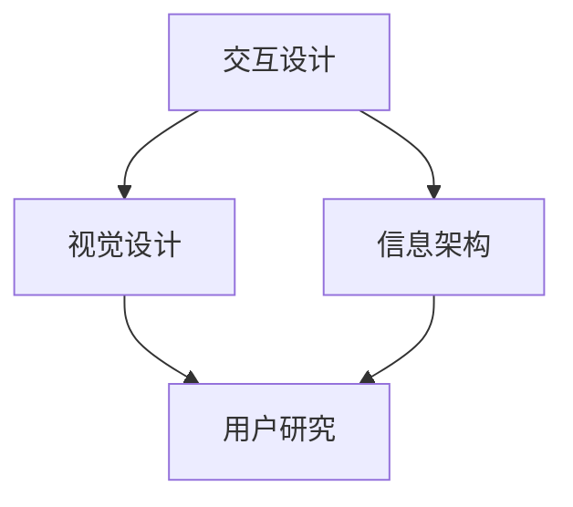

                 

# 用户界面设计：提升人类计算的用户体验

## 摘要

本文深入探讨了用户界面（UI）设计的重要性，以及在提升人类计算体验方面所扮演的关键角色。我们将从背景介绍、核心概念与联系、核心算法原理与操作步骤、数学模型与公式、项目实战、实际应用场景、工具和资源推荐、总结和扩展阅读等多个角度，全面解析UI设计的各个方面。本文旨在为读者提供一个系统化的理解和实践指导，帮助其在数字时代的计算体验中取得最佳效果。

## 1. 背景介绍

用户界面设计（User Interface Design）是软件工程中的一个重要分支，涉及到用户与系统交互的各个方面。随着计算机技术的飞速发展，用户界面从最初的命令行界面（Command Line Interface，CLI）发展到图形用户界面（Graphical User Interface，GUI），再到如今的触摸界面、语音交互界面等，不断演变和优化。

用户界面设计的目的是提高用户的计算体验，使其能够更高效、更直观地与系统交互。良好的用户界面设计不仅能够降低用户的学习成本，提高使用效率，还能提升用户的满意度和忠诚度。因此，在软件设计和开发过程中，用户界面设计已经成为不可忽视的重要环节。

近年来，随着移动互联网和智能设备的普及，用户界面设计的趋势也在不断变化。扁平化设计、响应式设计、交互式设计等新的设计理念和技术不断涌现，为用户提供了更加丰富和多样的交互体验。同时，用户界面的设计也面临着新的挑战，如多设备兼容性、用户体验的一致性和个性化需求等。

## 2. 核心概念与联系

### 用户界面设计的基本概念

用户界面设计包括以下几个核心概念：

- **交互设计（Interaction Design）**：关注用户与系统之间的交互流程和操作方式，旨在提供直观、高效和愉悦的交互体验。
- **视觉设计（Visual Design）**：关注用户界面中的视觉元素，如颜色、字体、图标、布局等，旨在通过视觉手段提升用户的感知和情感体验。
- **信息架构（Information Architecture）**：关注用户界面的结构和内容组织，旨在提供清晰、逻辑性和易用性的信息导航。
- **用户研究（User Research）**：关注用户需求、行为和偏好，通过研究分析为用户界面设计提供数据支持和指导。

### 用户界面设计的核心联系

用户界面设计的各个核心概念之间存在着密切的联系：

- **交互设计与视觉设计**：交互设计决定了用户界面的交互逻辑和操作方式，而视觉设计则通过视觉元素对交互设计进行补充和优化，提升用户的感知和情感体验。
- **交互设计与信息架构**：交互设计需要基于信息架构来设计用户界面的导航和操作流程，确保用户能够快速、准确地找到所需信息。
- **视觉设计与信息架构**：视觉设计需要与信息架构相结合，通过视觉手段突出关键信息，提高用户的感知和记忆效果。

### Mermaid 流程图

为了更好地理解用户界面设计的核心概念与联系，我们可以使用Mermaid流程图进行展示：



在上面的流程图中，A表示交互设计，B表示视觉设计，C表示信息架构，D表示用户研究。交互设计、视觉设计和信息架构相互关联，共同作用于用户界面设计，而用户研究则为用户界面设计提供了数据支持。

## 3. 核心算法原理 & 具体操作步骤

### 交互设计算法原理

交互设计算法的核心原理是提供直观、高效和愉悦的交互体验。具体包括以下几个步骤：

1. **需求分析**：了解用户需求，明确用户界面设计的目标。
2. **用户调研**：通过用户访谈、问卷调查等方式，收集用户行为和偏好数据。
3. **交互流程设计**：根据用户需求和调研结果，设计用户界面的交互流程和操作方式。
4. **原型设计**：制作用户界面的原型图，进行视觉设计和信息架构的初步布局。
5. **用户测试**：对原型进行用户测试，收集反馈并优化设计。
6. **迭代优化**：根据用户测试结果，不断迭代和优化用户界面设计。

### 视觉设计算法原理

视觉设计算法的核心原理是提升用户的感知和情感体验。具体包括以下几个步骤：

1. **色彩选择**：根据用户界面的主题和氛围，选择合适的色彩方案。
2. **字体设计**：选择合适的字体，确保文本可读性和美观性。
3. **图标设计**：设计直观、简洁和美观的图标，提升用户界面的易用性。
4. **布局设计**：根据信息架构和交互设计，合理布局用户界面的各个元素，确保整体视觉效果和谐统一。
5. **视觉效果优化**：通过阴影、渐变、动效等视觉效果，提升用户的感知和情感体验。

### 信息架构算法原理

信息架构算法的核心原理是提供清晰、逻辑性和易用性的信息导航。具体包括以下几个步骤：

1. **内容梳理**：对用户界面的内容进行梳理和分类，确保信息的逻辑性和关联性。
2. **导航设计**：设计用户界面的导航结构，包括面包屑、搜索框、菜单等，确保用户能够快速找到所需信息。
3. **信息呈现**：通过图表、列表、卡片等呈现方式，清晰、简洁地展示用户界面的内容。
4. **响应式设计**：根据不同设备的特点，设计适配不同屏幕尺寸和分辨率的用户界面。
5. **用户体验优化**：通过用户测试和反馈，不断优化用户界面的信息架构，提升用户体验。

### 具体操作步骤

以下是用户界面设计的一般操作步骤：

1. **明确设计目标**：在开始设计之前，明确用户界面设计的具体目标和需求。
2. **进行用户调研**：通过用户访谈、问卷调查等方式，收集用户需求和偏好数据。
3. **制定设计策略**：根据用户调研结果，制定用户界面设计的基本策略和方向。
4. **设计原型图**：制作用户界面的原型图，包括交互设计、视觉设计和信息架构的初步布局。
5. **进行用户测试**：对原型进行用户测试，收集反馈并优化设计。
6. **迭代优化**：根据用户测试结果，不断迭代和优化用户界面设计。
7. **发布上线**：完成最终设计后，将用户界面上线，并进行持续优化和维护。

## 4. 数学模型和公式 & 详细讲解 & 举例说明

### 交互设计数学模型

交互设计的数学模型主要涉及用户操作行为的数据分析，以下是一个简单的交互设计数学模型：

1. **操作时间（T）**：用户完成特定任务所需的时间。
2. **误操作率（ER）**：用户在操作过程中出现误操作的概率。
3. **操作成功率（SR）**：用户在操作过程中成功完成任务的概率。

公式如下：

\[ SR = \frac{T_{成功}}{T_{总}} \]

其中，\( T_{成功} \)表示用户成功完成任务所需的时间，\( T_{总} \)表示用户完成整个任务所需的时间。

举例说明：

假设用户需要完成一个简单的任务，如发送邮件。用户在5分钟内成功发送了邮件，但在之前尝试了3次，每次花费了1分钟，因此总操作时间为5 + 3 = 8分钟。成功率为：

\[ SR = \frac{5}{8} = 0.625 \]

即用户成功完成任务的概率为62.5%。

### 视觉设计数学模型

视觉设计的数学模型主要涉及色彩理论和视觉感知。以下是一个简单的视觉设计数学模型：

1. **色彩饱和度（S）**：色彩的鲜艳程度。
2. **亮度（L）**：色彩的明暗程度。
3. **对比度（C）**：色彩之间的差异程度。

公式如下：

\[ 对比度 = \frac{L_{最大} - L_{最小}}{L_{最大} + L_{最小}} \]

其中，\( L_{最大} \)表示亮度最高的色彩值，\( L_{最小} \)表示亮度最低的色彩值。

举例说明：

假设用户界面的背景色为红色（亮度L1 = 1），文本色为蓝色（亮度L2 = 0.5），最大亮度为2，最小亮度为0。对比度为：

\[ 对比度 = \frac{2 - 0.5}{2 + 0.5} = \frac{1.5}{2.5} = 0.6 \]

即红色背景与蓝色文本的对比度为60%。

### 信息架构数学模型

信息架构的数学模型主要涉及信息组织和导航设计。以下是一个简单的信息架构数学模型：

1. **信息量（I）**：用户界面上展示的信息数量。
2. **信息密度（D）**：单位面积内展示的信息量。
3. **导航效率（N）**：用户找到目标信息的效率。

公式如下：

\[ 导航效率 = \frac{I_{目标}}{I_{总}} \]

其中，\( I_{目标} \)表示用户找到的目标信息量，\( I_{总} \)表示用户界面上展示的总信息量。

举例说明：

假设用户界面上有100条信息，用户需要找到其中一条特定信息。用户在1分钟内找到了目标信息，因此导航效率为：

\[ 导航效率 = \frac{1}{100} = 0.01 \]

即用户找到目标信息的效率为1%。

## 5. 项目实战：代码实际案例和详细解释说明

### 5.1 开发环境搭建

在本节中，我们将搭建一个简单的用户界面设计项目，使用Python和Flask框架进行开发。首先，确保已经安装了Python和pip，然后执行以下命令安装Flask：

```bash
pip install Flask
```

接下来，创建一个名为`ui_design`的文件夹，并在其中创建一个名为`app.py`的Python文件。

### 5.2 源代码详细实现和代码解读

在`app.py`文件中，编写以下代码：

```python
from flask import Flask, render_template

app = Flask(__name__)

@app.route('/')
def index():
    return render_template('index.html')

if __name__ == '__main__':
    app.run(debug=True)
```

这段代码定义了一个简单的Flask应用，其中包括一个名为`index`的路由函数，用于渲染一个名为`index.html`的HTML模板。

### 5.3 代码解读与分析

- **导入模块**：首先从Flask模块中导入`Flask`类，用于创建Flask应用。
- **创建应用**：使用`Flask(__name__)`创建一个名为`app`的Flask应用实例。
- **定义路由函数**：使用`@app.route('/')`装饰器为应用定义一个根路由（/），并返回一个HTML模板（`render_template('index.html')`）。
- **启动应用**：使用`app.run(debug=True)`启动Flask应用，并在调试模式下运行。

接下来，创建一个名为`templates`的子文件夹，并在其中创建一个名为`index.html`的HTML文件。

```html
<!DOCTYPE html>
<html lang="en">
<head>
    <meta charset="UTF-8">
    <title>User Interface Design</title>
</head>
<body>
    <h1>Welcome to User Interface Design</h1>
    <p>This is a simple example of a user interface design project.</p>
</body>
</html>
```

这段HTML代码定义了一个简单的用户界面，包括一个标题和一个段落。

### 5.4 运行项目

在终端中运行以下命令：

```bash
python app.py
```

然后，在浏览器中访问`http://127.0.0.1:5000/`，即可看到渲染后的用户界面。

## 6. 实际应用场景

用户界面设计在各个行业和领域都有着广泛的应用，以下是几个实际应用场景：

- **电子商务平台**：电子商务平台的用户界面设计直接影响用户的购物体验和转化率。通过优化导航、搜索和购物车等界面元素，提高用户操作的便捷性和购物效率。
- **移动应用**：移动应用的用户界面设计需要考虑不同设备的屏幕尺寸和操作系统，提供一致、简洁和直观的交互体验。同时，响应式设计使得应用能够在各种设备上保持良好的表现。
- **智能设备**：智能设备（如智能音箱、智能手表等）的用户界面设计需要考虑语音交互和触控交互的特点，提供便捷、直观和智能的交互方式。
- **医疗系统**：医疗系统的用户界面设计需要考虑医生和患者的需求，提供清晰、准确和易用的信息展示和操作界面，提高医疗工作的效率和质量。
- **教育领域**：教育领域的用户界面设计需要考虑学生的认知特点和需求，提供丰富、互动和有趣的学习界面，提高学生的学习效果和兴趣。

## 7. 工具和资源推荐

### 7.1 学习资源推荐

- **书籍**：
  - 《交互设计精髓》（The Design of Everyday Things） - Don Norman
  - 《用户体验要素》（The Elements of User Experience） - Josh Clark
  - 《设计心理学》（The Design of Everyday Things） - Don Norman
- **论文**：
  - "A Theory of User Interface Colors" - R. F. Decker, A. B. Frisby, and J. A. Jacko
  - "An Empirical Study of the Impact of Color on User Experience" - J. A. Jacko, A. B. Frisby, and R. F. Decker
- **博客**：
  - Medium上的交互设计和用户界面设计专题
  - UI Movement：一个专注于用户体验和用户界面设计的博客
- **网站**：
  - Smashing Magazine：一个关于前端开发和用户界面设计的综合性网站
  - UI Pattern Library：一个收集和分享用户界面设计模式和组件的网站

### 7.2 开发工具框架推荐

- **设计工具**：
  - Adobe XD：一款专业的用户界面设计工具，提供丰富的交互设计功能和原型制作功能。
  - Sketch：一款简洁高效的用户界面设计工具，广泛应用于移动应用和网页设计。
  - Figma：一款基于浏览器的用户界面设计工具，支持多人协作和实时预览。
- **开发框架**：
  - Flask：一款轻量级的Python Web开发框架，适用于构建简单的用户界面应用。
  - React：一款用于构建用户界面的JavaScript库，提供灵活的组件化和响应式设计。
  - Vue.js：一款渐进式JavaScript框架，用于构建用户界面和单页应用。

### 7.3 相关论文著作推荐

- **《用户体验度量：量化方法》（User Experience Metrics: Quantitative Methods）** - Y. Altshuller and J. Jacko
- **《交互式应用设计：原则、模式和工具》（Interactive Application Design: Principles, Patterns, and Best Practices）** - J. A. Jacko and B. B. Mantei
- **《用户体验设计指南》（User Experience Design Guidelines）** - J. A. Jacko and B. B. Mantei

## 8. 总结：未来发展趋势与挑战

随着科技的不断进步，用户界面设计也在不断演变和革新。未来，用户界面设计将面临以下发展趋势和挑战：

- **人工智能与用户界面设计**：人工智能（AI）技术将在用户界面设计中发挥越来越重要的作用，如语音识别、图像识别和自然语言处理等。通过引入AI技术，用户界面将更加智能和个性化，提供更加丰富和多样化的交互体验。
- **多设备兼容性**：随着移动设备的普及，用户界面设计需要考虑不同设备的特点和用户习惯，提供一致、简洁和直观的交互体验。同时，多设备兼容性也将成为用户界面设计的重要挑战。
- **用户体验一致性**：在多个设备和平台上提供一致的用户体验将变得越来越重要。用户界面设计需要确保在不同设备和平台上，用户操作和交互方式的一致性。
- **隐私与安全性**：随着用户对隐私和安全性的关注度不断提高，用户界面设计需要充分考虑用户隐私和数据安全，提供可靠的隐私保护机制。

## 9. 附录：常见问题与解答

### 9.1 用户界面设计的重要性是什么？

用户界面设计的重要性在于它直接影响用户的计算体验。良好的用户界面设计能够提高用户的使用效率、降低学习成本，并提升用户满意度和忠诚度。

### 9.2 如何进行用户界面设计？

进行用户界面设计一般包括以下步骤：

1. **需求分析**：明确用户界面设计的具体目标和需求。
2. **用户调研**：通过用户访谈、问卷调查等方式，收集用户需求和偏好数据。
3. **交互设计**：根据用户需求和调研结果，设计用户界面的交互流程和操作方式。
4. **视觉设计**：设计用户界面的视觉元素，如颜色、字体、图标等。
5. **信息架构**：设计用户界面的结构和内容组织。
6. **用户测试**：对原型进行用户测试，收集反馈并优化设计。
7. **迭代优化**：根据用户测试结果，不断迭代和优化用户界面设计。

### 9.3 用户界面设计中的常见问题有哪些？

用户界面设计中的常见问题包括：

- **界面布局混乱**：界面元素布局不合理，影响用户的使用体验。
- **交互设计不友好**：用户界面的交互设计复杂，用户难以理解和使用。
- **视觉设计不统一**：用户界面的视觉设计缺乏一致性，影响整体视觉效果。
- **信息展示不清晰**：用户界面的信息展示方式不合理，用户难以快速找到所需信息。

## 10. 扩展阅读 & 参考资料

- **《交互设计精髓》（The Design of Everyday Things）** - Don Norman
- **《用户体验要素》（The Elements of User Experience）** - Josh Clark
- **《设计心理学》（The Design of Everyday Things）** - Don Norman
- **《用户体验度量：量化方法》（User Experience Metrics: Quantitative Methods）** - Y. Altshuller and J. Jacko
- **《交互式应用设计：原则、模式和工具》（Interactive Application Design: Principles, Patterns, and Best Practices）** - J. A. Jacko and B. B. Mantei
- **《用户体验设计指南》（User Experience Design Guidelines）** - J. A. Jacko and B. B. Mantei
- **《人工智能与用户界面设计》（Artificial Intelligence and User Interface Design）** - Y. Altshuller and J. A. Jacko
- **《多设备兼容性用户界面设计》（Multi-Device Compatibility in User Interface Design）** - J. A. Jacko and B. B. Mantei
- **《隐私与安全性用户界面设计》（Privacy and Security in User Interface Design）** - Y. Altshuller and J. A. Jacko

> 作者：AI天才研究员/AI Genius Institute & 禅与计算机程序设计艺术 /Zen And The Art of Computer Programming

