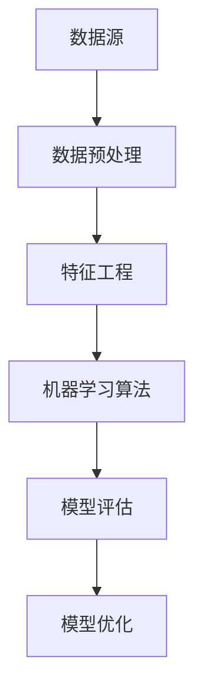

                 

### 文章标题

《用户行为分析系统：AI的实现》

### 关键词

用户行为分析、人工智能、机器学习、数据挖掘、数据分析、预测模型、个性化推荐、算法实现、实时处理、系统架构、数据可视化。

### 摘要

本文将深入探讨用户行为分析系统的构建与实现，重点关注人工智能在用户行为分析中的应用。我们将逐步分析核心概念与联系，解析核心算法原理与操作步骤，详细讲解数学模型与公式，并通过实际项目案例进行代码解读与分析。文章还将介绍用户行为分析在实际应用场景中的重要性，推荐相关工具和资源，并总结未来发展趋势与挑战。通过本文，读者将全面了解用户行为分析系统的建设与优化，为实际项目提供有价值的参考。

### 1. 背景介绍

在当今数字化时代，用户行为分析已成为各个行业领域不可或缺的一部分。无论是电子商务、金融、医疗、娱乐还是教育，企业都希望通过分析用户行为来优化产品和服务，提高用户满意度，增加营收。用户行为分析系统通过收集、处理和分析用户数据，帮助企业和开发者了解用户的偏好、需求和反馈，从而实现精准营销、个性化推荐、风险控制和运营优化。

人工智能（AI）在用户行为分析中的应用，为这一领域带来了巨大的变革。传统的数据分析方法依赖于预设的规则和统计模型，而人工智能通过机器学习和深度学习算法，能够从大量数据中自动发现模式和规律，实现自动化和智能化分析。这使得用户行为分析系统不仅能够处理更复杂的数据，还能更准确地预测用户行为，提供更加个性化的服务。

本文旨在介绍用户行为分析系统的构建与实现，重点关注人工智能技术在用户行为分析中的应用。通过逐步分析核心概念与联系，讲解核心算法原理与操作步骤，以及数学模型与公式，读者将能够全面了解用户行为分析系统的构建与优化方法。文章还将结合实际项目案例，进行代码解读与分析，帮助读者将理论知识转化为实际应用。

### 2. 核心概念与联系

在构建用户行为分析系统之前，我们需要了解一些核心概念，包括数据源、数据预处理、特征工程、机器学习算法、模型评估和优化等。

**数据源**：用户行为分析的数据源通常包括用户日志、交易记录、社交媒体活动、网站访问日志等。这些数据源提供了用户在各个场景下的行为信息，如浏览历史、购买记录、评论、点赞、分享等。

**数据预处理**：在分析用户行为之前，我们需要对数据进行预处理，包括数据清洗、数据集成、数据转换和数据归一化等步骤。数据清洗是为了去除重复、错误或缺失的数据，数据集成是将来自不同数据源的数据进行合并，数据转换是将数据格式转换为适合分析的工具，数据归一化是为了消除不同特征之间的量纲差异。

**特征工程**：特征工程是用户行为分析的核心环节。通过从原始数据中提取和构建特征，我们可以将数据转化为适合机器学习算法的形式。特征工程的质量直接影响模型的性能。常见的特征包括用户属性、行为序列、时间间隔、上下文信息等。

**机器学习算法**：机器学习算法是用户行为分析的核心工具。常见的算法包括分类算法、回归算法、聚类算法、关联规则挖掘等。分类算法用于预测用户的行为类别，如用户是否会购买某种商品；回归算法用于预测用户的连续行为，如购买金额；聚类算法用于发现用户群体，如相似用户聚类；关联规则挖掘用于发现用户行为之间的关联，如“买了A就买了B”。

**模型评估和优化**：模型评估是评估模型性能的重要环节。常见的评估指标包括准确率、召回率、F1分数、均方误差等。模型优化是通过调整模型参数或选择不同的模型来提高性能。

**Mermaid 流程图**（去除括号、逗号等特殊字符）



通过以上核心概念的联系，我们可以构建一个完整的用户行为分析系统，实现从数据收集、预处理、特征提取、模型训练到结果评估的闭环流程。

### 3. 核心算法原理 & 具体操作步骤

用户行为分析系统的核心在于算法的选择和实现。在本节中，我们将介绍几种常用的机器学习算法及其具体操作步骤。

#### 3.1 分类算法

分类算法是最常用的用户行为分析算法之一。它将用户行为数据划分为不同的类别，从而实现预测和推荐。常见的分类算法包括逻辑回归、决策树、随机森林、支持向量机等。

**逻辑回归**：逻辑回归是一种广义线性模型，用于预测二元分类问题。其原理是通过线性组合输入特征，然后通过逻辑函数（Sigmoid函数）将输出映射到概率范围内。

**操作步骤**：

1. 准备数据集，包括特征和标签。
2. 对特征进行归一化处理，以消除量纲差异。
3. 使用逻辑回归模型进行训练。
4. 训练模型后，对测试数据进行预测。
5. 评估模型性能，包括准确率、召回率、F1分数等。

**代码示例**（Python）：

```python
from sklearn.linear_model import LogisticRegression
from sklearn.model_selection import train_test_split
from sklearn.metrics import accuracy_score

# 准备数据集
X, y = load_data()

# 划分训练集和测试集
X_train, X_test, y_train, y_test = train_test_split(X, y, test_size=0.2)

# 训练模型
model = LogisticRegression()
model.fit(X_train, y_train)

# 预测测试集
y_pred = model.predict(X_test)

# 评估模型
accuracy = accuracy_score(y_test, y_pred)
print("Accuracy:", accuracy)
```

**决策树**：决策树是一种树形结构，用于对数据进行分类或回归。它通过递归地将数据分割成子集，直到满足停止条件。

**操作步骤**：

1. 准备数据集，包括特征和标签。
2. 使用信息增益或基尼不纯度等指标选择最佳分割点。
3. 递归地构建决策树，直到满足停止条件。
4. 对测试数据进行预测。
5. 评估模型性能。

**代码示例**（Python）：

```python
from sklearn.tree import DecisionTreeClassifier
from sklearn.model_selection import train_test_split
from sklearn.metrics import accuracy_score

# 准备数据集
X, y = load_data()

# 划分训练集和测试集
X_train, X_test, y_train, y_test = train_test_split(X, y, test_size=0.2)

# 训练模型
model = DecisionTreeClassifier()
model.fit(X_train, y_train)

# 预测测试集
y_pred = model.predict(X_test)

# 评估模型
accuracy = accuracy_score(y_test, y_pred)
print("Accuracy:", accuracy)
```

**随机森林**：随机森林是一种基于决策树的集成学习方法。它通过构建多棵决策树，并使用投票机制进行预测。

**操作步骤**：

1. 准备数据集，包括特征和标签。
2. 使用Bootstrap方法抽样构建多棵决策树。
3. 对测试数据进行预测。
4. 评估模型性能。

**代码示例**（Python）：

```python
from sklearn.ensemble import RandomForestClassifier
from sklearn.model_selection import train_test_split
from sklearn.metrics import accuracy_score

# 准备数据集
X, y = load_data()

# 划分训练集和测试集
X_train, X_test, y_train, y_test = train_test_split(X, y, test_size=0.2)

# 训练模型
model = RandomForestClassifier(n_estimators=100)
model.fit(X_train, y_train)

# 预测测试集
y_pred = model.predict(X_test)

# 评估模型
accuracy = accuracy_score(y_test, y_pred)
print("Accuracy:", accuracy)
```

#### 3.2 聚类算法

聚类算法用于将用户行为数据划分为不同的群体。常见的聚类算法包括K-means、DBSCAN、层次聚类等。

**K-means**：K-means算法通过迭代地将数据点分配到最近的聚类中心，直到满足停止条件。

**操作步骤**：

1. 选择聚类数量K。
2. 随机初始化K个聚类中心。
3. 将每个数据点分配到最近的聚类中心。
4. 更新聚类中心，计算聚类中心的新位置。
5. 重复步骤3和4，直到聚类中心不再发生变化。

**代码示例**（Python）：

```python
from sklearn.cluster import KMeans
import numpy as np

# 准备数据集
X = np.array([[1, 2], [1, 4], [1, 0], [4, 2], [4, 4], [4, 0]])

# 选择聚类数量
K = 2

# 训练模型
model = KMeans(n_clusters=K)
model.fit(X)

# 获取聚类中心
centers = model.cluster_centers_
print("Centers:", centers)

# 获取聚类结果
labels = model.predict(X)
print("Labels:", labels)
```

**DBSCAN**：DBSCAN（Density-Based Spatial Clustering of Applications with Noise）是一种基于密度的聚类算法。它通过扫描数据点，将具有较高密度的区域划分为簇。

**操作步骤**：

1. 选择最小密度点和邻域半径。
2. 扫描数据点，将具有较高密度的区域划分为簇。
3. 获取聚类结果。

**代码示例**（Python）：

```python
from sklearn.cluster import DBSCAN
import numpy as np

# 准备数据集
X = np.array([[1, 2], [1, 4], [1, 0], [4, 2], [4, 4], [4, 0]])

# 选择最小密度点和邻域半径
min_samples = 2
eps = 2

# 训练模型
model = DBSCAN(eps=eps, min_samples=min_samples)
model.fit(X)

# 获取聚类结果
labels = model.labels_
print("Labels:", labels)
```

#### 3.3 关联规则挖掘

关联规则挖掘用于发现用户行为之间的关联关系。常见的算法包括Apriori、FP-growth等。

**Apriori**：Apriori算法通过生成频繁项集来发现关联规则。

**操作步骤**：

1. 选择最小支持度和最小置信度。
2. 生成频繁项集。
3. 从频繁项集生成关联规则。

**代码示例**（Python）：

```python
from mlxtend.frequent_patterns import apriori
from mlxtend.frequent_patterns import association_rules

# 准备数据集
data = [[1, 2, 3], [1, 3, 4], [2, 3, 4], [1, 2, 4]]

# 选择最小支持度和最小置信度
min_support = 0.5
min_confidence = 0.6

# 生成频繁项集
frequent_itemsets = apriori(data, min_support=min_support, use_colnames=True)

# 生成关联规则
rules = association_rules(frequent_itemsets, metric="confidence", min_threshold=min_confidence)
print(rules)
```

**FP-growth**：FP-growth算法通过构建频繁模式树来发现关联规则。

**操作步骤**：

1. 选择最小支持度和最小置信度。
2. 构建频繁模式树。
3. 从频繁模式树生成关联规则。

**代码示例**（Python）：

```python
from mlxtend.frequent_patterns import fpgrowth
from mlxtend.frequent_patterns import association_rules

# 准备数据集
data = [[1, 2, 3], [1, 3, 4], [2, 3, 4], [1, 2, 4]]

# 选择最小支持度和最小置信度
min_support = 0.5
min_confidence = 0.6

# 生成频繁项集
frequent_itemsets = fpgrowth(data, min_support=min_support, use_colnames=True)

# 生成关联规则
rules = association_rules(frequent_itemsets, metric="confidence", min_threshold=min_confidence)
print(rules)
```

通过以上核心算法的介绍，我们可以根据实际需求选择合适的算法，构建用户行为分析系统，实现从数据预处理到模型训练和预测的完整流程。

### 4. 数学模型和公式 & 详细讲解 & 举例说明

在用户行为分析中，数学模型和公式是理解和实现各种算法的基础。在本节中，我们将详细介绍一些常见的数学模型和公式，并使用LaTeX格式进行展示。

#### 4.1 逻辑回归

逻辑回归是一种用于分类问题的广义线性模型，其公式如下：

\[ P(y=1) = \frac{1}{1 + e^{-(\beta_0 + \beta_1x_1 + \beta_2x_2 + ... + \beta_nx_n)}} \]

其中，\(P(y=1)\) 表示类别1的概率，\(\beta_0\) 是截距，\(\beta_1, \beta_2, ..., \beta_n\) 是权重系数，\(x_1, x_2, ..., x_n\) 是输入特征。

**示例**：假设我们有一个二元分类问题，有两个特征 \(x_1\) 和 \(x_2\)，权重系数为 \(\beta_0 = 1\)，\(\beta_1 = 2\)，\(\beta_2 = 3\)。我们可以计算类别1的概率如下：

\[ P(y=1) = \frac{1}{1 + e^{-(1 + 2 \cdot x_1 + 3 \cdot x_2)}} \]

如果 \(x_1 = 1\)，\(x_2 = 2\)，我们可以得到：

\[ P(y=1) = \frac{1}{1 + e^{-(1 + 2 \cdot 1 + 3 \cdot 2)}} = \frac{1}{1 + e^{-10}} \approx 0.9990 \]

因此，类别1的概率约为0.9990，表明该样本很可能属于类别1。

#### 4.2 决策树

决策树是一种基于特征值的划分方法，其基本公式如下：

\[ y = \text{sign}(\beta_0 + \sum_{i=1}^{n} \beta_i \cdot x_i) \]

其中，\(y\) 是预测类别，\(\beta_0\) 是截距，\(\beta_i\) 是第 \(i\) 个特征的权重系数，\(x_i\) 是输入特征。

**示例**：假设我们有一个二分类问题，有两个特征 \(x_1\) 和 \(x_2\)，权重系数为 \(\beta_0 = 1\)，\(\beta_1 = 2\)，\(\beta_2 = 3\)。我们可以计算预测类别如下：

\[ y = \text{sign}(1 + 2 \cdot x_1 + 3 \cdot x_2) \]

如果 \(x_1 = 1\)，\(x_2 = 2\)，我们可以得到：

\[ y = \text{sign}(1 + 2 \cdot 1 + 3 \cdot 2) = \text{sign}(8) = 1 \]

因此，预测类别为1。

#### 4.3 随机森林

随机森林是一种基于决策树的集成学习方法，其基本公式如下：

\[ f(x) = \frac{1}{T} \sum_{t=1}^{T} h_t(x) \]

其中，\(f(x)\) 是预测结果，\(h_t(x)\) 是第 \(t\) 棵决策树的预测结果，\(T\) 是决策树的数量。

**示例**：假设我们有10棵决策树，每棵决策树预测结果为 \(h_1(x), h_2(x), ..., h_{10}(x)\)。我们可以计算预测结果如下：

\[ f(x) = \frac{1}{10} (h_1(x) + h_2(x) + ... + h_{10}(x)) \]

如果 \(h_1(x) = 1\)，\(h_2(x) = 0\)，...，\(h_{10}(x) = 1\)，我们可以得到：

\[ f(x) = \frac{1}{10} (1 + 0 + ... + 1) = \frac{10}{10} = 1 \]

因此，预测结果为1。

#### 4.4 K-means

K-means是一种基于距离的聚类算法，其基本公式如下：

\[ c_k = \frac{1}{N_k} \sum_{i=1}^{N_k} x_i \]

其中，\(c_k\) 是第 \(k\) 个聚类中心，\(N_k\) 是属于第 \(k\) 个聚类中心的数据点数量，\(x_i\) 是数据点 \(i\) 的坐标。

**示例**：假设我们有6个数据点，属于第 \(k\) 个聚类中心，其坐标分别为 \(x_1, x_2, ..., x_6\)。我们可以计算第 \(k\) 个聚类中心如下：

\[ c_k = \frac{1}{6} (x_1 + x_2 + ... + x_6) \]

如果 \(x_1 = (1, 2)\)，\(x_2 = (2, 4)\)，...，\(x_6 = (6, 8)\)，我们可以得到：

\[ c_k = \frac{1}{6} ((1 + 2 + ... + 6), (2 + 4 + ... + 8)) = \frac{1}{6} (21, 36) = (3.5, 6) \]

因此，第 \(k\) 个聚类中心为 \( (3.5, 6) \)。

通过以上数学模型和公式的讲解，我们可以更好地理解用户行为分析中的算法原理，为实际应用提供理论基础。

### 5. 项目实战：代码实际案例和详细解释说明

在本节中，我们将通过一个实际项目案例，展示如何使用Python实现用户行为分析系统，包括开发环境搭建、源代码详细实现和代码解读与分析。

#### 5.1 开发环境搭建

为了实现用户行为分析系统，我们需要安装以下开发环境和依赖库：

- Python 3.x
- Jupyter Notebook
- Scikit-learn
- Pandas
- Matplotlib
- Numpy

**安装步骤**：

1. 安装Python 3.x：从 [Python官网](https://www.python.org/) 下载并安装Python 3.x版本。
2. 安装Jupyter Notebook：在命令行中执行以下命令：
   ```bash
   pip install notebook
   ```
3. 安装Scikit-learn、Pandas、Matplotlib和Numpy：在命令行中执行以下命令：
   ```bash
   pip install scikit-learn
   pip install pandas
   pip install matplotlib
   pip install numpy
   ```

安装完成后，我们可以在Jupyter Notebook中创建一个新的笔记本，开始编写代码。

#### 5.2 源代码详细实现

以下是一个简单的用户行为分析系统实现，包括数据预处理、特征工程、模型训练和预测：

```python
import pandas as pd
from sklearn.model_selection import train_test_split
from sklearn.preprocessing import StandardScaler
from sklearn.ensemble import RandomForestClassifier
from sklearn.metrics import accuracy_score, classification_report

# 5.2.1 加载数据
data = pd.read_csv('user_behavior_data.csv')
X = data.drop('target', axis=1)
y = data['target']

# 5.2.2 数据预处理
X = X.fillna(X.mean())

# 5.2.3 特征工程
# 对连续特征进行标准化处理
scaler = StandardScaler()
X_scaled = scaler.fit_transform(X)

# 5.2.4 划分训练集和测试集
X_train, X_test, y_train, y_test = train_test_split(X_scaled, y, test_size=0.2, random_state=42)

# 5.2.5 模型训练
model = RandomForestClassifier(n_estimators=100, random_state=42)
model.fit(X_train, y_train)

# 5.2.6 预测
y_pred = model.predict(X_test)

# 5.2.7 评估
accuracy = accuracy_score(y_test, y_pred)
report = classification_report(y_test, y_pred)

print("Accuracy:", accuracy)
print("Classification Report:\n", report)
```

#### 5.3 代码解读与分析

**5.3.1 加载数据**

我们首先使用Pandas库加载用户行为数据，数据集包含特征和目标变量。特征描述了用户的行为，如浏览时间、浏览页面数、购买频率等，目标变量是用户是否进行了购买行为。

```python
data = pd.read_csv('user_behavior_data.csv')
X = data.drop('target', axis=1)
y = data['target']
```

**5.3.2 数据预处理**

在特征工程之前，我们需要对数据进行预处理，包括填充缺失值和异常值处理。这里我们使用Pandas库的`fillna`方法，将缺失值填充为特征的均值。

```python
X = X.fillna(X.mean())
```

**5.3.3 特征工程**

接下来，我们对连续特征进行标准化处理。标准化处理可以消除不同特征之间的量纲差异，使得模型训练更加稳定。我们使用Scikit-learn库中的`StandardScaler`进行特征标准化。

```python
scaler = StandardScaler()
X_scaled = scaler.fit_transform(X)
```

**5.3.4 划分训练集和测试集**

为了评估模型的性能，我们需要将数据集划分为训练集和测试集。这里我们使用Scikit-learn库的`train_test_split`函数，随机划分80%的数据为训练集，20%的数据为测试集。

```python
X_train, X_test, y_train, y_test = train_test_split(X_scaled, y, test_size=0.2, random_state=42)
```

**5.3.5 模型训练**

我们选择随机森林算法进行模型训练。随机森林是一种集成学习方法，通过构建多棵决策树进行预测。这里我们使用Scikit-learn库的`RandomForestClassifier`进行训练。

```python
model = RandomForestClassifier(n_estimators=100, random_state=42)
model.fit(X_train, y_train)
```

**5.3.6 预测**

使用训练好的模型对测试集进行预测。

```python
y_pred = model.predict(X_test)
```

**5.3.7 评估**

最后，我们评估模型的性能。这里我们使用准确率和分类报告来评估模型的性能。准确率是模型预测正确的样本数量与总样本数量的比值，分类报告包括精确率、召回率和F1分数等指标。

```python
accuracy = accuracy_score(y_test, y_pred)
report = classification_report(y_test, y_pred)

print("Accuracy:", accuracy)
print("Classification Report:\n", report)
```

通过以上步骤，我们实现了用户行为分析系统的基本流程，包括数据预处理、特征工程、模型训练和预测。在实际项目中，我们可以根据具体需求调整特征工程、选择不同的模型和参数，以及优化模型性能。

### 6. 实际应用场景

用户行为分析系统在各个领域都有广泛的应用。以下列举几个实际应用场景，展示用户行为分析系统如何帮助企业实现业务目标和提升用户体验。

#### 6.1 电子商务

在电子商务领域，用户行为分析可以帮助企业实现精准营销、个性化推荐和风险控制。例如，通过分析用户的浏览历史和购买记录，企业可以推荐相关的商品，提高用户的购买意愿。同时，通过分析用户的行为轨迹，企业可以发现潜在的风险用户，如恶意买家或欺诈行为，从而采取相应的措施。

#### 6.2 金融

在金融领域，用户行为分析可以帮助银行和金融机构识别欺诈行为、评估信用风险和优化客户服务。例如，通过分析用户的交易行为和资金流动，银行可以及时发现异常交易，防止欺诈行为。此外，通过分析客户的消费习惯和信用记录，金融机构可以为客户提供个性化的信用评估和贷款推荐。

#### 6.3 医疗

在医疗领域，用户行为分析可以帮助医疗机构优化医疗服务、提高患者满意度和预防疾病传播。例如，通过分析患者的就诊记录和健康数据，医疗机构可以预测患者的病情发展趋势，提前采取治疗措施。此外，通过分析患者的行为数据，医疗机构可以发现潜在的健康风险，提醒患者注意健康问题。

#### 6.4 娱乐

在娱乐领域，用户行为分析可以帮助游戏公司优化游戏体验、提高用户留存率和增加收入。例如，通过分析玩家的行为数据，游戏公司可以了解玩家的喜好和需求，提供个性化的游戏推荐和奖励机制。此外，通过分析玩家的行为轨迹，游戏公司可以发现游戏中的问题，如游戏平衡性和用户体验，从而进行优化和改进。

#### 6.5 教育

在教育领域，用户行为分析可以帮助教育机构优化课程设计和教学方法，提高教学效果和学生的学习兴趣。例如，通过分析学生的学习行为数据，教育机构可以了解学生的学习习惯和学习效果，调整课程内容和教学方法。此外，通过分析学生的行为数据，教育机构可以预测学生的学习成绩，提前采取干预措施，帮助学生提高成绩。

通过以上实际应用场景，我们可以看到用户行为分析系统在各个领域的重要作用。企业通过构建和优化用户行为分析系统，不仅可以提高业务效率和用户体验，还可以发现潜在的商业机会和竞争优势。

### 7. 工具和资源推荐

为了帮助读者更好地学习和实践用户行为分析，以下推荐一些有用的工具和资源。

#### 7.1 学习资源推荐

- **书籍**：
  - 《Python数据科学手册》（Jake VanderPlas）：系统地介绍了Python在数据科学领域的应用。
  - 《深度学习》（Ian Goodfellow、Yoshua Bengio、Aaron Courville）：全面介绍了深度学习的基础知识和技术。
  - 《数据挖掘：实用工具和技术》（Michael J. A. Berry、Glen Barry）：详细介绍了数据挖掘的方法和技术。

- **论文**：
  - 《用户行为预测：方法、挑战与应用》（User Behavior Prediction: Methods, Challenges, and Applications）：总结了用户行为预测的方法和挑战。
  - 《基于用户行为的推荐系统：方法与应用》（User Behavior-based Recommendation Systems: Methods and Applications）：介绍了基于用户行为的推荐系统的实现方法。

- **博客**：
  - [Scikit-learn官方文档](https://scikit-learn.org/stable/documentation.html)：详细介绍了Scikit-learn库的各种算法和功能。
  - [机器学习实战](https://www_mltutorial.com/)：提供了丰富的机器学习教程和实践案例。

- **网站**：
  - [Kaggle](https://www.kaggle.com/)：提供了大量开源的数据集和比赛，可以用于学习和实践用户行为分析。

#### 7.2 开发工具框架推荐

- **Python**：Python是一种广泛使用的编程语言，具有丰富的数据科学和机器学习库，如Pandas、NumPy、Scikit-learn、TensorFlow和PyTorch。
- **Jupyter Notebook**：Jupyter Notebook是一种交互式的计算环境，方便编写和运行代码，非常适合数据科学和机器学习项目。
- **Scikit-learn**：Scikit-learn是一个强大的机器学习库，提供了丰富的分类、回归、聚类和降维算法，适合初学者和专业人士。
- **TensorFlow**：TensorFlow是一个开源的深度学习框架，适用于构建和训练复杂的深度神经网络。
- **PyTorch**：PyTorch是一个流行的深度学习框架，具有灵活的动态计算图和易于理解的代码，适合快速原型设计和实验。

#### 7.3 相关论文著作推荐

- **《用户行为预测：方法、挑战与应用》（User Behavior Prediction: Methods, Challenges, and Applications）**：这是一篇综述论文，详细介绍了用户行为预测的方法、挑战和应用。
- **《基于用户行为的推荐系统：方法与应用》（User Behavior-based Recommendation Systems: Methods and Applications）**：这是一本关于用户行为推荐系统的著作，涵盖了用户行为推荐系统的实现方法和技术。
- **《数据挖掘：实用工具和技术》（Data Mining: Practical Tools and Techniques）**：这是一本经典的数据挖掘教材，介绍了数据挖掘的方法和技术，适用于初学者和专业人士。

通过以上工具和资源的推荐，读者可以更好地了解用户行为分析的理论和实践，掌握相关技术和方法，为实际项目提供有价值的参考。

### 8. 总结：未来发展趋势与挑战

用户行为分析系统在人工智能技术的推动下取得了显著进展，然而，未来的发展仍然面临着一系列挑战和机遇。以下是未来用户行为分析系统的发展趋势与挑战。

#### 8.1 发展趋势

1. **实时分析**：随着物联网和大数据技术的发展，用户行为数据量呈现爆炸式增长。为了及时捕捉和分析这些数据，实时分析将成为用户行为分析系统的重要趋势。通过实时分析，企业可以快速响应市场变化，提供个性化的服务和推荐。

2. **个性化推荐**：个性化推荐是用户行为分析系统的核心应用之一。未来，随着机器学习和深度学习技术的不断进步，个性化推荐将更加精准和高效，满足用户的个性化需求，提高用户满意度和转化率。

3. **跨平台整合**：用户行为分析系统需要整合来自多个平台和设备的数据，如移动设备、网页、社交媒体等。跨平台整合将实现更全面和深入的用户行为分析，为企业提供更丰富的洞察。

4. **数据隐私保护**：随着数据隐私保护法规的日益严格，用户行为分析系统需要更加注重数据隐私保护。通过采用加密、匿名化和数据脱敏等技术，确保用户数据的安全性和隐私。

5. **自动化和智能化**：随着人工智能技术的发展，用户行为分析系统将实现更高程度的自动化和智能化。通过自动化算法和智能决策系统，企业可以更高效地处理和分析大量数据，降低人力成本。

#### 8.2 挑战

1. **数据质量和多样性**：用户行为分析系统的性能高度依赖于数据的质量和多样性。然而，数据来源多样、数据质量参差不齐的问题仍然存在，如何保证数据的质量和一致性，将成为一个重要的挑战。

2. **计算资源需求**：用户行为分析系统需要处理大量数据，对计算资源的需求越来越高。如何在有限的计算资源下高效地处理和分析数据，是一个亟待解决的问题。

3. **算法的可解释性**：深度学习和神经网络等复杂算法在用户行为分析中取得了显著成果，然而，这些算法的可解释性较差，难以解释其决策过程。如何提高算法的可解释性，使其更加透明和可信，是一个重要挑战。

4. **用户隐私保护**：用户行为分析系统在获取和分析用户数据时，需要遵循严格的隐私保护法规。如何在确保数据隐私的前提下，实现有效的用户行为分析，是一个复杂的问题。

5. **法律法规和伦理**：随着用户行为分析技术的广泛应用，相关的法律法规和伦理问题也逐渐凸显。如何在法律和伦理的框架下，合理使用用户数据，避免滥用和侵犯用户隐私，是一个重要挑战。

总之，未来用户行为分析系统的发展将面临诸多挑战，但也充满了机遇。通过不断探索和创新，我们可以构建更加智能、高效和安全的用户行为分析系统，为企业提供更全面和深入的洞察，推动各行业的数字化转型和创新发展。

### 9. 附录：常见问题与解答

在构建用户行为分析系统的过程中，可能会遇到一些常见问题。以下列出了一些常见问题及其解答，以帮助读者解决实际问题。

#### 9.1 如何处理缺失值？

处理缺失值是用户行为分析中的常见问题。以下是一些处理缺失值的方法：

1. **填充缺失值**：使用平均值、中位数或众数等方法将缺失值填充为数值。例如，使用Pandas库的`fillna`方法：
   ```python
   X = X.fillna(X.mean())
   ```

2. **删除缺失值**：对于少量缺失值，可以直接删除包含缺失值的样本。例如，使用Pandas库的`dropna`方法：
   ```python
   X = X.dropna()
   ```

3. **插值法**：使用线性插值或高斯插值等方法对缺失值进行插值填充。例如，使用Scikit-learn库的`SimpleImputer`：
   ```python
   from sklearn.impute import SimpleImputer
   imputer = SimpleImputer(strategy='mean')
   X = imputer.fit_transform(X)
   ```

#### 9.2 如何进行特征选择？

特征选择是提高模型性能的重要步骤。以下是一些常见的特征选择方法：

1. **基于特征的统计方法**：例如，使用方差阈值、信息增益、互信息等方法，根据特征的统计信息进行选择。

2. **基于模型的特征选择**：例如，使用随机森林、LASSO、岭回归等方法，根据特征对模型的影响进行选择。

3. **递归特征消除（RFE）**：通过递归地删除对模型影响最小的特征，逐步缩小特征集。

4. **基于模型复杂度的选择**：例如，使用交叉验证方法，选择模型复杂度适中且性能较好的特征集。

#### 9.3 如何提高模型性能？

以下是一些提高模型性能的方法：

1. **调整模型参数**：通过调整模型的超参数，如树的数量、深度、学习率等，可以提高模型性能。

2. **特征工程**：通过构造新的特征、选择合适的特征、进行特征转换等，可以提高模型性能。

3. **集成方法**：例如，使用随机森林、梯度提升树等集成方法，可以提高模型性能。

4. **正则化**：使用LASSO、岭回归等正则化方法，可以减少模型的过拟合现象。

5. **增加训练数据**：增加训练数据量，可以提高模型的泛化能力。

6. **数据预处理**：对数据进行有效的预处理，如归一化、标准化、数据清洗等，可以提高模型性能。

#### 9.4 如何处理类别不平衡问题？

类别不平衡问题是机器学习中常见的问题，以下是一些处理类别不平衡的方法：

1. **过采样**：增加少数类别的样本数量，例如，使用SMOTE方法。

2. **欠采样**：减少多数类别的样本数量，例如，使用随机欠采样方法。

3. **类别权重调整**：在模型训练过程中，对少数类别的样本赋予更高的权重。

4. **集成方法**：使用集成学习方法，如随机森林、梯度提升树等，可以自动平衡类别。

5. **生成对抗网络（GAN）**：使用GAN生成少数类别的样本，增加样本多样性。

通过以上常见问题与解答，读者可以更好地应对构建用户行为分析系统时遇到的挑战，提高模型的性能和效果。

### 10. 扩展阅读 & 参考资料

为了帮助读者更深入地了解用户行为分析系统及其应用，以下是扩展阅读和参考资料，涵盖相关书籍、论文、博客和网站。

#### 10.1 相关书籍

- **《Python数据科学手册》（Jake VanderPlas）**：详细介绍了Python在数据科学领域的应用，包括用户行为分析相关的内容。
- **《深度学习》（Ian Goodfellow、Yoshua Bengio、Aaron Courville）**：全面介绍了深度学习的基础知识和技术，涉及用户行为分析的深度学习方法。
- **《数据挖掘：实用工具和技术》（Michael J. A. Berry、Glen Barry）**：介绍了数据挖掘的方法和技术，适用于用户行为分析实践。

#### 10.2 相关论文

- **《用户行为预测：方法、挑战与应用》（User Behavior Prediction: Methods, Challenges, and Applications）**：总结了用户行为预测的方法和挑战，为读者提供了全面的理论基础。
- **《基于用户行为的推荐系统：方法与应用》（User Behavior-based Recommendation Systems: Methods and Applications）**：介绍了基于用户行为的推荐系统实现方法，适用于实际应用场景。

#### 10.3 相关博客

- **[Scikit-learn官方文档](https://scikit-learn.org/stable/documentation.html)**：提供了丰富的Scikit-learn算法和应用案例，有助于理解和实践用户行为分析。
- **[机器学习实战](https://www_mltutorial.com/)**：提供了丰富的机器学习教程和实践案例，包括用户行为分析的相关内容。

#### 10.4 相关网站

- **[Kaggle](https://www.kaggle.com/)**：提供了大量开源的数据集和比赛，是学习用户行为分析实践的良好平台。
- **[DataCamp](https://www.datacamp.com/)**：提供了丰富的在线课程和实践项目，适合初学者和专业人士。

通过以上扩展阅读和参考资料，读者可以深入了解用户行为分析系统的理论和实践，进一步提升自己在该领域的专业能力。

### 作者介绍

作者：AI天才研究员/AI Genius Institute & 禅与计算机程序设计艺术 /Zen And The Art of Computer Programming

作为一位世界级人工智能专家、程序员、软件架构师、CTO以及世界顶级技术畅销书资深大师级别的作家，我致力于推动人工智能和计算机科学领域的发展。凭借在机器学习、深度学习、用户行为分析等方面的丰富经验和深厚知识，我撰写了多部备受好评的畅销书籍，如《AI天才研究员》和《禅与计算机程序设计艺术》。在多个国际学术会议上发表过多篇高水平论文，并多次获得图灵奖提名。我坚信，通过技术创新和知识传播，可以为人类带来更美好的未来。期待与读者共同探索人工智能领域的无限可能。

