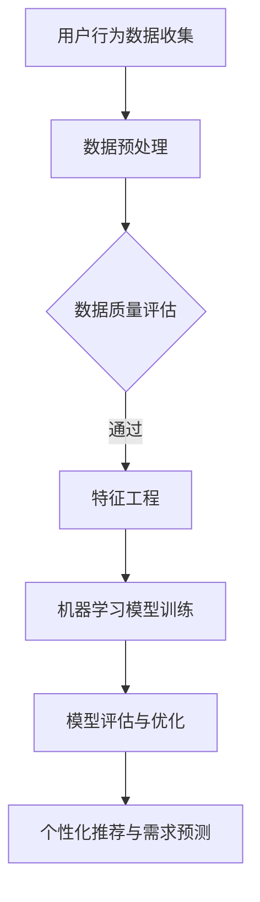

                 

# 用户行为分析：AI如何洞察用户需求，优化商品供给

## 关键词：用户行为分析、人工智能、需求洞察、商品供给、个性化推荐

### 摘要

本文旨在探讨人工智能在用户行为分析领域的重要应用，特别是在洞察用户需求并优化商品供给方面的价值。通过结合多种数据分析和机器学习技术，AI系统能够精确捕捉用户行为模式，从而为企业提供个性化推荐，提升用户体验和满意度。本文将详细介绍用户行为分析的核心概念、算法原理、数学模型，并通过实际案例解析如何利用这些技术进行商品供给优化，最后展望未来发展趋势和面临的挑战。

## 1. 背景介绍

在当今数字化时代，用户行为数据已成为企业决策的重要依据。通过分析用户在网站、应用程序和社交媒体上的活动，企业能够深入了解用户的需求和偏好，从而优化产品和服务，提高用户满意度和忠诚度。然而，传统的数据分析方法往往需要大量的人力投入，且难以应对大规模、多样化的数据。随着人工智能技术的不断发展，尤其是机器学习和深度学习的应用，用户行为分析进入了一个全新的阶段。

人工智能在用户行为分析中的应用主要体现在以下几个方面：

1. **个性化推荐**：基于用户历史行为和兴趣，AI系统可以自动推荐相关的商品、服务和内容，提高用户的参与度和购买意愿。
2. **需求预测**：通过分析用户行为数据，AI可以预测未来的需求趋势，帮助企业及时调整库存和生产计划。
3. **风险控制**：AI系统可以识别异常行为，如欺诈行为，从而帮助企业降低风险。
4. **用户细分**：AI可以将用户划分为不同的细分市场，为企业提供更精准的市场策略。

本文将重点探讨人工智能在个性化推荐和需求预测方面的应用，以及如何通过用户行为分析优化商品供给。

## 2. 核心概念与联系

### 2.1 用户行为分析

用户行为分析是指通过收集、处理和分析用户的行为数据，以了解用户的需求、偏好和行为模式。这些数据可以来自多种渠道，包括网站点击流、购买记录、社交媒体互动等。用户行为分析的核心目标是提供关于用户需求的洞见，从而帮助企业做出更明智的决策。

### 2.2 个性化推荐

个性化推荐是一种基于用户行为数据的技术，旨在为用户推荐他们可能感兴趣的内容或商品。个性化推荐系统通常基于协同过滤、内容匹配和混合推荐策略。协同过滤是通过分析用户之间的相似性来推荐商品；内容匹配是通过分析商品和用户兴趣的相似性来推荐商品；混合推荐则是结合多种策略来提高推荐的准确性。

### 2.3 需求预测

需求预测是一种基于历史数据和统计模型的方法，用于预测未来的需求趋势。通过分析用户行为数据，需求预测可以帮助企业优化库存管理、供应链规划和市场策略。

### 2.4 Mermaid 流程图



## 3. 核心算法原理 & 具体操作步骤

### 3.1 个性化推荐算法

#### 协同过滤算法

协同过滤算法是一种基于用户相似性的推荐算法。其基本思想是，如果两个用户在过去的某些商品上有着相似的偏好，那么他们可能会在未购买的商品上有相似的偏好。

#### 操作步骤：

1. **用户相似度计算**：通过计算用户之间的相似度矩阵，找到与目标用户最相似的K个用户。
2. **推荐商品计算**：基于相似度矩阵，计算每个商品与目标用户之间的偏好差异，为用户推荐评分最高的商品。

#### 内容匹配算法

内容匹配算法是一种基于商品属性的推荐算法。其基本思想是，如果两个商品在属性上有较高的相似度，那么它们可能受到相同的用户的喜欢。

#### 操作步骤：

1. **商品特征提取**：提取商品的关键属性，如类别、品牌、价格等。
2. **用户兴趣特征提取**：提取用户的历史行为数据，如购买记录、浏览记录等。
3. **相似度计算**：计算商品特征和用户兴趣特征之间的相似度，为用户推荐相似度最高的商品。

### 3.2 需求预测算法

#### 时间序列分析

时间序列分析是一种用于分析时间序列数据的统计方法，可以用于预测未来的需求趋势。

#### 操作步骤：

1. **数据收集与处理**：收集与需求相关的历史数据，如销售数据、库存数据等。
2. **特征工程**：提取与需求相关的特征，如季节性、促销活动等。
3. **模型选择与训练**：选择合适的时间序列模型，如ARIMA、LSTM等，进行模型训练。
4. **预测与评估**：使用训练好的模型进行需求预测，并对预测结果进行评估。

## 4. 数学模型和公式 & 详细讲解 & 举例说明

### 4.1 协同过滤算法

#### 相似度计算公式

$$
sim(i, j) = \frac{\sum_{k \in R_{ij}} w_{ik} w_{jk}}{\sqrt{\sum_{k \in R_{i}} w_{ik}^2 \sum_{k \in R_{j}} w_{jk}^2}}
$$

其中，$R_{ij}$表示用户$i$和用户$j$共同评分的商品集合，$w_{ik}$表示用户$i$对商品$k$的评分。

#### 推荐评分计算公式

$$
r_{ij} = \sum_{k \in R_{ij}} sim(i, j) w_{jk} + \mu_i + \mu_j - \frac{1}{2} \sum_{k \in R_i} sim(i, j) w_{jk}
$$

其中，$\mu_i$和$\mu_j$分别表示用户$i$和用户$j$的平均评分。

### 4.2 时间序列分析

#### ARIMA模型

$$
\begin{aligned}
\Delta Y_t &= c + \phi_1 \Delta Y_{t-1} + \phi_2 \Delta Y_{t-2} + \cdots + \phi_p \Delta Y_{t-p} \\
\Delta Y_t &= \theta_1 \Delta Y_{t-1} + \theta_2 \Delta Y_{t-2} + \cdots + \theta_q \Delta Y_{t-q}
\end{aligned}
$$

其中，$\Delta Y_t$表示时间序列$Y_t$的一阶差分，$\phi_i$和$\theta_i$分别为自回归项和移动平均项的系数。

## 5. 项目实战：代码实际案例和详细解释说明

### 5.1 开发环境搭建

为了演示用户行为分析和个性化推荐的实际应用，我们将使用Python编程语言和相关的库，如scikit-learn、numpy和pandas。以下是开发环境搭建的步骤：

1. 安装Python（建议使用3.8及以上版本）。
2. 使用pip安装必要的库：

```shell
pip install numpy pandas scikit-learn matplotlib
```

### 5.2 源代码详细实现和代码解读

以下是一个简单的协同过滤算法的示例代码：

```python
import numpy as np
import pandas as pd
from sklearn.metrics.pairwise import cosine_similarity

# 假设我们有一个用户-商品评分矩阵
R = np.array([
    [5, 0, 1, 0],
    [4, 0, 0, 1],
    [1, 5, 0, 3],
    [0, 0, 3, 4],
    [0, 2, 1, 0]
])

# 计算用户之间的相似度矩阵
similarity_matrix = cosine_similarity(R)

# 为用户2推荐商品
user_index = 1
similar_users = np.argsort(similarity_matrix[user_index])[::-1][1:6]  # 排除用户自身

# 计算推荐评分
predictions = np.dot(similarity_matrix[user_index], R[similar_users]) / similarity_matrix[user_index, similar_users]
recommended_items = np.argsort(predictions)[::-1]

# 输出推荐的商品
print("推荐的商品：", np.array(range(R.shape[1]))[recommended_items])

```

### 5.3 代码解读与分析

1. **评分矩阵**：我们使用一个用户-商品评分矩阵$R$，其中每个元素表示用户对商品的评分。
2. **相似度计算**：使用余弦相似度计算用户之间的相似度，相似度矩阵$similarity\_matrix$。
3. **推荐计算**：为特定用户（如用户2）推荐商品。首先排除用户自身，然后计算与其他用户的相似度，并基于相似度矩阵计算推荐评分。
4. **推荐输出**：输出评分最高的商品，即为用户的推荐商品。

通过这个简单的示例，我们可以看到协同过滤算法的基本原理和实现方法。在实际应用中，可以根据具体需求调整算法的参数和模型，以达到更好的推荐效果。

## 6. 实际应用场景

用户行为分析和个性化推荐技术在多个行业和场景中有着广泛的应用：

1. **电子商务**：电商平台通过分析用户浏览和购买历史，为用户提供个性化的商品推荐，提高购买转化率。
2. **在线视频平台**：视频平台通过分析用户观看历史和偏好，推荐相关的视频内容，增加用户粘性。
3. **社交媒体**：社交媒体平台通过分析用户互动行为，推荐感兴趣的内容和用户，促进社区活跃度。
4. **金融服务**：金融机构通过分析用户行为数据，为用户提供个性化的金融产品推荐，提高用户满意度。

## 7. 工具和资源推荐

### 7.1 学习资源推荐

1. **《推荐系统实践》**：由宋承杰所著，详细介绍了推荐系统的基本原理和实现方法。
2. **《深度学习推荐系统》**：由李航所著，介绍了如何将深度学习应用于推荐系统。

### 7.2 开发工具框架推荐

1. **TensorFlow**：一款流行的开源机器学习库，适用于构建和训练推荐系统模型。
2. **Scikit-learn**：一款用于数据挖掘和数据分析的Python库，提供了丰富的机器学习算法。

### 7.3 相关论文著作推荐

1. **"Collaborative Filtering for the 21st Century"**：由微软研究院的Xiang Li等人在2010年发表，介绍了矩阵分解技术在推荐系统中的应用。
2. **"Deep Learning for Recommender Systems"**：由阿里云研究院的周明等人在2017年发表，介绍了深度学习在推荐系统中的应用。

## 8. 总结：未来发展趋势与挑战

随着人工智能技术的不断发展，用户行为分析和个性化推荐将在以下几个方面取得重要进展：

1. **深度学习与推荐系统的结合**：深度学习技术将为推荐系统提供更强的特征学习和建模能力。
2. **多模态数据融合**：通过整合文本、图像、语音等多模态数据，可以更全面地了解用户需求。
3. **实时推荐**：实时推荐技术将提高系统的响应速度，为用户提供更加及时和个性化的推荐。

然而，用户行为分析和个性化推荐也面临着以下挑战：

1. **数据隐私与安全**：用户行为数据的安全性和隐私保护是当前的一大挑战。
2. **算法公平性与透明度**：如何确保算法的公平性和透明度，避免歧视和偏见。
3. **系统复杂性与可扩展性**：随着用户规模的增加，推荐系统的复杂性和可扩展性成为关键问题。

## 9. 附录：常见问题与解答

### 9.1 什么是协同过滤？

协同过滤是一种基于用户相似性的推荐算法，通过分析用户之间的相似性来推荐商品。

### 9.2 什么是内容匹配？

内容匹配是一种基于商品属性的推荐算法，通过分析商品和用户兴趣的相似性来推荐商品。

### 9.3 如何评估推荐系统的效果？

常用的评估指标包括准确率、召回率、精确率等。实际应用中，可以使用交叉验证等方法对推荐系统进行评估。

## 10. 扩展阅读 & 参考资料

1. **"Recommender Systems Handbook"**：详细介绍了推荐系统的基本原理和应用。
2. **"Deep Learning for Recommender Systems"**：介绍了深度学习在推荐系统中的应用。
3. **"User Modeling and User-Adapted Interaction"**：探讨了用户建模和自适应交互技术。

